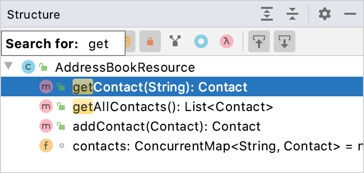

# 一、配置

默认配置所在路径为：

`%APPDATA%\JetBrains\`

如果需要修改配置文件、插件之类的存放路径，需要在IDEA安装目录下的bin目录中的 `idea.properties`文件中修改如下配置：

```
idea.config.path=${user.home}/.IntelliJIdea/config
idea.system.path=${user.home}/.IntelliJIdea/system
idea.plugins.path=${idea.config.path}/plugins
idea.log.path=${idea.system.path}/log
```

IDEA自带的配置备份功能很多东西，例如插件，都无法备份，所以要想完美迁移设备，就得把配置目录下的一些文件都复制到迁移后的设备中的配置目录下。


# 二、工具窗口

## 1.在工具窗口中快速搜索

1）选定一个工具窗口

2）直接在工具窗口中输入要搜索的字符串

3）如果有多个匹配的，使用 `↑` `↓` 键来选择，`Enter` 来打开选择的条目。




# 常用快捷键

| Ctrl + 数字键盘的 ‘ + ’ 或 ‘ - ’ | 全部展开，全部折叠 |
| -------------------------------- | ------------------ |
|                                  |                    |
|                                  |                    |
|                                  |                    |
|                                  |                    |

