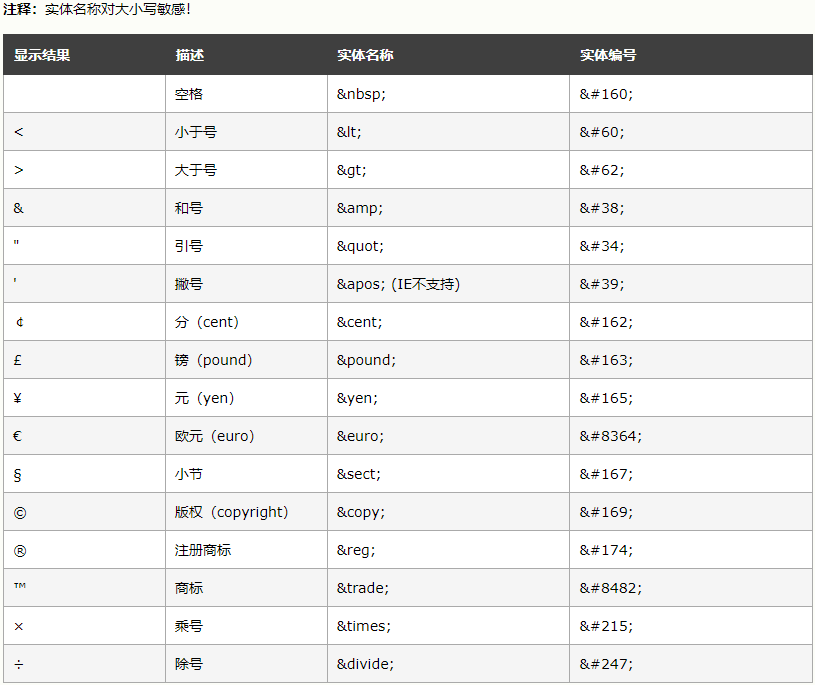
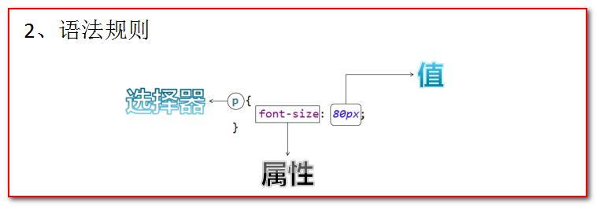

# HTML

## 一、 HTML标签

### 1.标签的**格式**:

<标签名>封装的数据</标签名>

### 2.标签名**大小写不敏感**。

### 3.标签拥有自己的**属性**。

​	i. 分为**基本属性**： 可以修改简单的样式效果

​	`bgcolor="red"` 

​	ii. **事件属性**：可以直接设置事件响应后的代码

​	 `onclick="alert('你好！ ');"` 

​	一个标签可以有多个属性，不同属性用空格分隔

### 4.标签又分为， 单标签和双标签。

​	i. **单标签**格式： <标签名 />。

​		 `<br/>` 换行 

​		`<hr/>` 水平线
​	ii. **双标签**格式: <标签名> ...封装的数据...</标签名>  

### 5.标签的语法：

​	a. 标签不能交叉嵌套

​	b. 标签必须正确关闭

​		`<div> content </div>`

​	    没有内容的标签：

​		`<br/>`

​		**注意斜杠的位置**

​	c. 属性必须有值， 属性值必须加引号  

​	d. 注释不能嵌套  

### 6. 字符实体

​	类似于 `<` 之类的字符，在html中使用，需要进行转义，用 `& ;`包起来


​	HTML 中的常用字符实体是**不间断空格**(`&nbsp;`)。

​	浏览器总是会截短 HTML 页面中的空格。如果您在文本中写 10 个空格，在显示该页面之前，浏览器会删除它们中的 9 个。如需在页面中增加空格的数量，您需要使用 &nbsp; 字符实体。





### 7.常用标签（元素）

#### 1）font 标签

​	font 标签是字体标签,它可以用来修改文本的字体,颜色,大小(尺寸)

​	**color 属性**修改颜色
​	**face 属性**修改字体
​	**size 属性**修改文本大小  

`<font color="red" face="宋体" size="7">我是字体标签</font>  `

#### 2）标题标签  （h1 ~ h6)

​	标题标签（标题字体的大小）由大到小是 h1 到 h6  

​	**align 属性**是对齐属性  

​		left 左对齐(默认)
​		center 剧中
​		right 右对齐

```html
<h1 align="left">标题 1</h1>
<h2 align="center">标题 2</h2>
<h3 align="right">标题 3</h3>
```

#### 3）a标签

​	**href 属性**设置url
​	**target 属性**设置哪个目标进行跳转
​		_self 表示当前页面(默认值)
​		_blank 表示打开新页面来进行跳转

```html
<a href="http://localhost:8080">百度</a><br/>
<a href="http://localhost:8080" target="_self">百度_self</a><br/>
<a href="http://localhost:8080" target="_blank">百度_blank</a><br/>
```

#### 4）列表标签（ ul 无序列表，ol 有序列表）

​	**type 属性**可以修改列表项前面的符号
​	**li 标签**是列表项  

```html
<ul type="none">
	<li>赵四</li>
	<li>刘能</li>
	<li>小沈阳</li>
	<li>宋小宝</li>
</ul>
```

#### 5）img 标签

它是一个自闭合标签

**img 标签**是图片标签,用来显示图片
	**src 属性**可以设置图片的路径
	**width 属性**设置图片的宽度
	**height 属性**设置图片的高度
	**border 属性**设置图片边框大小
	**alt 属性**设置当指定路径找不到图片时,用来代替显示的文本内容  

` `

#### 6）table标签

**table标签**定义 HTML 表格。

​	**border属性**设置表格标签

​	**width属性**设置表格宽度

​	**height属性**设置表格高度

​	**align属性**设置**表格相对于页面**的对齐方式  

​	**cellspacing属性**设置单元格间距  


**tr 标签**定义表格行


**th 标签**定义表头单元


**td 标签**定义表格单元

​	**align属性**设置**单元格文本**对齐方式  

​	**colspan 属性**设置跨列

​	**rowspan 属性**设置跨行  

​	**b 标签**是加粗标签  


以下是一个 3X3的一个表格

```html
<table align="center" border="1" width="300" height="300" cellspacing="0">
	<tr> 行
		<th>1.1</th>表头单元
		<th>1.2</th>
		<th>1.3</th>
	</tr> 
    
	<tr>
		<td>2.1</td>表格单元
		<td>2.2</td>
		<td>2.3</td>
	</tr>
    
	<tr>
		<td>3.1</td>
		<td>3.2</td>
		<td>3.3</td>
	</tr>
</table>
```


#### 7）iframe 标签（内嵌窗口）

​	iframe 标签它可以在一个 html 页面上,打开一个小窗口,去加载一个单独的页面

​	用法：在 iframe 标签中使用 **name 属性**定义一个名称，然后在 a 标签的 **target 属性**上设置 iframe 的 name 的属性值  。

```html
<iframe src="3.标题标签.html" width="500" height="400" name="abc"></iframe>
<br/>
<ul>
	<li><a href="0-标签语法.html" target="abc">0-标签语法.html</a></li>
	<li><a href="1.font 标签.html" target="abc">1.font 标签.html</a></li>
	<li><a href="2.特殊字符.html" target="abc">2.特殊字符.html</a></li>
</ul>
```


#### 8）表单标签

**form 标签**就是表单  

​	**action 属性**设置 当提交表单时，向何处发送表单数据。
​	**method 属性** 设置发送表单数据的HTTP方法 GET(默认值)或 POST  

**input 标签**用于收集用户输入

​	**type属性**控制输入标签的类型

​		**type=text** 是文件输入框 			**value**属性设置默认显示内容

​		**type=password** 是密码输入框  	**value**属性设置默认显示内容

​		**type=radio** 是单选框 			**name** 属性可以对其进行分组 	**checked="checked"**表示默认选中

​		**type=checkbox** 是复选框 	**checked="checked"**表示默认选中

​		**type=reset** 是重置按钮 		**value 属性**修改按钮上的文本

​		**type=submit** 是提交按钮 	**value 属性**修改按钮上的文本

​		**type=button** 是按钮			 **value 属性**修改按钮上的文本

​		**type=file** 是文件上传域

​		**type=hidden** 是隐藏域 ,当我们要发送某些信息， 而这些信息， 不需要用户参与， 就可以使用隐藏域（提交的时候同时发送给服务器）


**select 标签**是下拉列表框

​	**option 标签**是下拉列表框中的选项 	**selected="selected"**设置默认选中

**textarea 标签**表示多行文本输入框 （起始标签和结束标签中的内容是默认值）

​	**rows 属性**设置可以显示几行的高度

​	**cols 属性**设置每行可以显示几个字符宽度

```html
<form>
用户名称： <input type="text" value="默认值"/><br/>
    
用户密码： <input type="password" value="abc"/><br/>
    
确认密码： <input type="password" value="abc"/><br/>
    
性别： <input type="radio" name="sex"/>男<input type="radio" name="sex" checked="checked" />女<br/>
    
兴趣爱好： <input type="checkbox" checked="checked" />Java<input type="checkbox" />JavaScript<input type="checkbox" />C++<br/>
    
国籍：
    <select>
		<option>--请选择国籍--</option>
		<option selected="selected">中国</option>
		<option>美国</option>
		<option>小日本</option>
	</select><br/>
    
自我评价： 
<textarea rows="10" cols="20">我才是默认值</textarea><br/>
    
<input type="reset" value="重置按钮" />
    
<input type="submit" value="提交按钮"/>
</form>
```


为了美观，通常把表单里的内容放到一个两列的table标签里，第一列放提示信息，第二列放input标签：

```html
<form>
    <h1>用户注册</h1>
    
    <table>
        <tr>
            <td>用户名：</td>
            <td>
                <input type="text" value="默认值"/>
            </td>
        </tr>

        <tr>
            <td>性别：</td>
            <td>
                <input type="radio" name="sex" />男
                <input type="radio" name="sex" />女
            </td>
        </tr>
    </table>
    
</form>

```


要想把表单数据发送给服务器，需要：

1. form标签的 **action属性**的值为发送表单数据的url。

2. form标签的 **method属性**的值为发送表单数据的方法（GET 或者 POST）。

3. 在需要发送给服务器的表单项中添加 **name属性**。

4. 单选、 复选（下拉列表中的 option 标签） 都需要添加 **value 属性**， 以便发送给服务器  。

5. 如果是GET方法，那么请求的URL中的参数就由上述中name和value属性的值组成： ?name=value&name=value...

   完整表单：

   ```html
   <form action="http://localhost:8080" method="post">
       <input type="hidden" name="action" value="login"/>
       <h1 align="center">用户注册</h1>
       <table align="center">
           <tr>
               <td> 用户名称：</td>
               <td>
                   <input type="text" name="username" value="默认值"/>
               </td>
           </tr>
           
           <tr>
               <td> 用户密码：</td>
               <td><input type="password" name="password" value="abc"/></td>
           </tr>
           
           <tr>
               <td>性别：</td>
               <td>
                   <input type="radio" name="sex" value="boy"/>男
                   <input type="radio" name="sex" checked="checked" value="girl"/>女
               </td>
           </tr>
           
           <tr>
               <td> 兴趣爱好：</td>
               <td><input name="hobby" type="checkbox" checked="checked" value="java"/>Java
                   <input name="hobby" type="checkbox" value="js"/>JavaScript
                   <input name="hobby" type="checkbox" value="cpp"/>C++
               </td>
           </tr>
           
           <tr>
               <td>国籍：</td>
               <td>
                   <select name="country">
                       <option value="none">--请选择国籍--</option>
                       <option value="cn" selected="selected">中国</option>
                       <option value="usa">美国</option>
                       <option value="jp">小日本</option>
                   </select>
               </td>
           </tr>
           
           <tr>
               <td>自我评价：</td>
               <td><textarea name="desc" rows="10" cols="20">我才是默认值</textarea></td>
           </tr>
           
           <tr>
               <td><input type="reset"/></td>
               <td align="center"><input type="submit"/></td>
           </tr>
           
       </table>
   </form>
   ```


#### 9）div、span、p标签

**div 标签** 	默认独占一行

**span 标签** 	它的长度是封装数据的长度

**p 标签** 	默认会在段落的上方或下方各空出一行来（如果已有就不再空）

#### 10）link标签

<link> 标签定义文档与外部资源的关系。

<link> 标签最常见的用途是链接样式表。

```html
<head>
	<link rel="stylesheet" type="text/css" href="theme.css" />
</head>
```

**rel属性** ：规定当前文档与被链接文档之间的关系。


### 8.HTML 标签参考手册

https://www.w3school.com.cn/tags/index.asp


# CSS

## 一、语法规则



**选择器**： 浏览器根据“选择器” 决定受 CSS 样式影响的 HTML 元素（标签） 。

**属性 (property)** ：是你要改变的样式名， 并且每个属性都有一个值。 属性和值被冒号分开， 并
由花括号包围， 这样就组成了一个完整的样式声明（declaration） ， 例如： `p {color: blue}`

**多个声明**： 如果要定义不止一个声明， 则需要用**分号**将每个声明分开。 虽然最后一条声明的
最后可以不加分号(但尽量在每条声明的末尾都加上分号)  

一般每行只描述一个属性

**CSS 注释**：`/* */`，和java的多行注释一样

## 二、CSS 和 HTML 的结合方式

### 1.为标签添加style属性

 `<div style="border: 1px solid red;">div 标签 1</div> `

### 2.在 head 标签中， 使用 style 标签  

```html
<head>
	<meta charset="UTF-8">
	<title>Title</title>
	
	<!--style 标签专门用来定义 css 样式代码-->
	
	<style type="text/css">
	/*这里需要这样子注释*/
	div{
		border: 1px solid red;
		} 
		
	span{
		border: 1px solid red;
		}
	</style>
</head>
```

### 3.使用单独的CSS文件

把 css 样式写成一个单独的 css 文件， 再通过 **link 标签**引入即可复用。  

```html
<head>
	<meta charset="UTF-8">
	<title>Title</title>
	<!--link 标签专门用来引入 css 样式代码-->
	<link rel="stylesheet" type="text/css" href="1.css"/>
</head>
```

“1.css”文件的内容：

```css
div{
	border: 1px solid yellow;
} 

span{
	border: 1px solid red;
}
```


## 三、CSS选择器

### 1.标签名选择器

格式：

```css
标签名{
	属性： 值;
}

div{
	border: 1px solid yellow;
	color: blue;
	font-size: 30px;
}
```

### 2.id选择器

利用 标签的**id属性** 来选择 css作用的元素

格式：`#id`

```html
<div id="id001">div 标签 1</div>

<style type="text/css">
	#id001{
		color: blue;
		font-size: 30px;
		border: 1px yellow solid;}
</style>
```

### 3.class选择器

利用 标签的**class属性** 来选择 css作用的元素

格式：`.class`

```html
<div class="class01">div 标签 1</div>

<style type="text/css">
	.class01{
		color: blue;
		font-size: 30px;
		border: 1px yellow solid;
		}
</style>
```

### 4.组合选择器

把各种选择器组合起来，用 `,` 分隔，从而让**多个选择器共用一段CSS样式代码**

格式：

```css
选择器 1,选择器 2,选择器 n{
	属性:值;
}

.class01 , #id01{
	color: blue;
	font-size: 20px;
	border: 1px yellow solid;
}
```

class 属性为 class01 **或者**  id属性为 id01 的元素会呈现上述代码的效果

## 四、常用样式

### 1、 字体颜色

`color：red;`
颜色可以写颜色名如： black, blue, red, green 等
颜色也可以写 rgb 值和十六进制表示值： 如 rgb(255,0,0)， #00F6DE， 如果写十六进制值必
须加#

### 2、 宽度

`width:19px;`
宽度可以写像素值： 19px；
也可以写百分比值： 20%；

### 3、 高度

`height:20px;`
高度可以写像素值： 19px；
也可以写百分比值： 20%；

### 4、 背景颜色

`background-color:#0F2D4C`

### 5、 字体大小：

`font-size： 20px;`

### 6、 红色 1 像素实线边框

`border： 1px solid red;`

### 7、 DIV 居中

`margin-left: auto;`
`margin-right: auto;`

### 8、 文本居中：

`text-align: center;`

### 9、 超链接去下划线

`text-decoration: none;`

### 10、 表格细线

```
table {
	border: 1px solid black; /*设置边框*/
	border-collapse: collapse; /*将边框合并*/
}

td,th {
	border: 1px solid black; /*设置边框*/
}
```


### 11、 无序列表前面的符号去掉

```
ul {
	list-style: none;
}  
```

