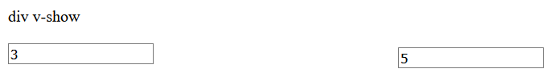
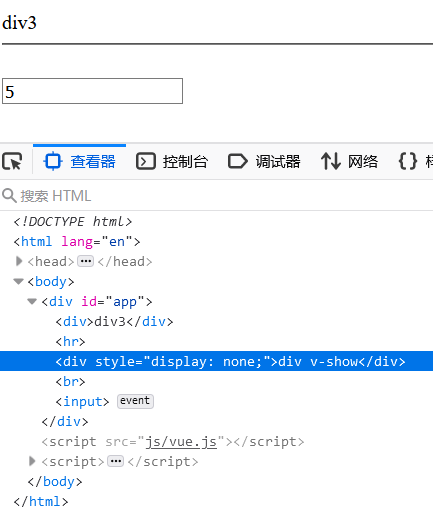

# VUE

## 一、概述

Vue 是一套前端框架，免除原生JavaScript中的DOM操作，简化开发。

Vue基于MVVM(Model-View-ViewModel)思想，实现数据的双向绑定，将编程的关注点放在数据上。

## 二、快速入门

1. **新建 HTML 页面，引入 Vue.js文件**

   ```html
   <script src="js/vue.js"></script>
   ```

2. **在JS代码区域，创建Vue核心对象，进行数据绑定**

   ```js
   new Vue({
       el: "#app",
       data() {
           return {
               username: ""
           }
       }
   });
   ```

   创建 Vue 对象时，需要传递一个 js 对象，而该对象中需要如下属性：

   * `el` ： 它的值为一个选择器表达式，用来指定哪些标签受 Vue 管理。 `#app` 表示id属性为 `app`的标签受到Vue管理。
   * `data` ：用来定义数据模型
   * `methods` ：用来定义函数。

3. **编写视图**

   ```html
   <div id="app">
       <input name="username" v-model="username" >
       {{username}}
   </div>
   ```

   `{{}}` 是 Vue 中定义的 `插值表达式` ，在里面写数据模型，到时候会将该模型的数据值展示在这个位置。

**整体代码如下：**

```html
<!DOCTYPE html>
<html lang="en">
<head>
    <meta charset="UTF-8">
    <title>Title</title>
</head>
<body>
<div id="app">
    <input v-model="username">
    <!--插值表达式-->
    {{username}}
</div>
<script src="js/vue.js"></script>
<script>
    //1. 创建Vue核心对象
    new Vue({
        el:"#app",
        data(){  // data() 是 ECMAScript 6 版本的新的写法
            return {
                username:""
            }
        }

        /*data: function () {
            return {
                username:""
            }
        }*/
    });

</script>
</body>
</html>
```

## 三、Vue指令

**指令：**HTML 标签上带有 v- 前缀的特殊属性，不同指令具有不同含义。例如：v-if，v-for…

常用的指令有：

| **指令**  | **作用**                                            |
| --------- | --------------------------------------------------- |
| v-bind    | 为HTML标签绑定属性值，如设置  href , css样式等      |
| v-model   | 在表单元素上创建双向数据绑定                        |
| v-on      | 为HTML标签绑定事件                                  |
| v-if      | 条件性的渲染某元素，判定为true时渲染,否则不渲染     |
| v-else    |                                                     |
| v-else-if |                                                     |
| v-show    | 根据条件展示某元素，区别在于切换的是display属性的值 |
| v-for     | 列表渲染，遍历容器的元素或者对象的属性              |

### v-bind

该指令可以给标签原有属性绑定模型数据。这样模型数据发生变化，标签属性值也随之发生变化

例如：

```html
<!DOCTYPE html>
<html lang="en">
<head>
    <meta charset="UTF-8">
    <title>Title</title>
    <script src="js/vue.js"></script>
</head>
<body>
    
    <div id="app">
        <a :href="url">百度一下</a>	等价于 <a v-bind:href="url">百度一下</a>
        <input v-model="url"/>
    </div>

    <script>
        new Vue({
            el:"#app",
            data(){
                return {
                    url:"https://www.baidu.com"
                }
            }
        });
    </script>

</body>
</html>
```

在上述代码中

`<a v-bind:href="url">百度一下</a>`  可以省略 `v-bind`，即写成：`<a :href="url">百度一下</a>` 也是一样的。

它把该 a标签的 href属性与 `url` 这个数据模型进行了绑定。


### v-model

该指令可以给表单项标签绑定模型数据。这样就能实现双向绑定效果。例如上述代码中的：

```
<input v-model="url"/>
```

这样，当用户输入相应的字符串后，`url`的值也会响应变化。


### v-on 

为HTML标签绑定事件。

语法： `v-on:事件="方法名()"`  等价于 `@事件="方法名()"` 。

**注意**：`v-on:` 后面的事件名称是原生事件属性名去掉on。

例如：

* 单击事件 ： 事件属性名是 onclick，而在vue中使用是 `v-on:click`
* 失去焦点事件：事件属性名是 onblur，而在vue中使用时 `v-on:blur`


例如：`<input type="button" value="一个按钮" v-on:click="show()">` 

​		等价于：`<input type="button" value="一个按钮" @click="show()">`

同时，需要在 Vue对象中的 `methods` 属性中，定义一个方法：

```
new Vue({
    el: "#app",
    methods: {
    	/* ** */
        show(){
            alert("点击了按钮");
        }
        /* ** */
    }
});
```


### 条件判断指令（v-if、v-show)


接下来通过代码演示一下。在 Vue中定义一个 `count` 的数据模型，如下

```js
//1. 创建Vue核心对象
new Vue({
    el:"#app",
    data(){
        return {
            count:3
        }
    }
});
```

现在要实现，当 `count` 模型的数据是3时，在页面上展示 `div1` 内容；当 `count` 模型的数据是4时，在页面上展示 `div2` 内容；`count` 模型数据是其他值时，在页面上展示 `div3`。这里为了动态改变模型数据 `count` 的值，再定义一个输入框绑定 `count` 模型数据。html 代码如下：

```html
<div id="app">
    <div v-if="count == 3">div1</div>
    <div v-else-if="count == 4">div2</div>
    <div v-else>div3</div>
    <hr>
    <input v-model="count">
</div>
```

**整体页面代码如下：**

```html
<!DOCTYPE html>
<html lang="en">
<head>
    <meta charset="UTF-8">
    <title>Title</title>
</head>
<body>
<div id="app">
    <div v-if="count == 3">div1</div>
    <div v-else-if="count == 4">div2</div>
    <div v-else>div3</div>
    <hr>
    <input v-model="count">
</div>

<script src="js/vue.js"></script>
<script>
    //1. 创建Vue核心对象
    new Vue({
        el:"#app",
        data(){
            return {
                count:3
            }
        }
    });
</script>
</body>
</html>
```

通过浏览器打开页面并在输入框输入不同的值，效果如下


​	然后我们在看看 **v-show 指令**的效果，如果模型数据 `count ` 的值是3时，展示 `div v-show` 内容，否则不展示，html页面代码如下

```html
<div v-show="count == 3">div v-show</div>
<br>
<input v-model="count">
```

浏览器打开效果如下：



通过上面的演示，发现 `v-show` 和 `v-if` 效果一样，那它们到底有什么区别呢？我们根据浏览器的检查功能查看源代码



通过上图可以看出 **v-show 不展示的原理是给对应的标签添加 `display` css属性，并将该属性值设置为 `none` ，这样就达到了隐藏的效果。而 `v-if` 指令是条件不满足时根本就不会渲染。**


### v-for

它用来遍历数据模型

该指令使用的格式如下：

```html
<标签 v-for="变量名 in 集合模型数据">
    {{变量名}}
</标签>
```


如果在页面需要使用到集合模型数据的索引，就需要使用如下格式：

```html
<标签 v-for="(变量名,索引变量) in 集合模型数据">
    <!--索引变量是从0开始，所以要表示序号的话，需要手动的加1-->
   {{索引变量 + 1}} {{变量名}}
</标签>
```

**代码演示：**

```html
<!DOCTYPE html>
<html lang="en">
<head>
    <meta charset="UTF-8">
    <title>Title</title>
</head>
<body>
<div id="app">
    <div v-for="addr in addrs">
        {{addr}} <br>
    </div>

    <hr>
    <div v-for="(addr,i) in addrs">
        {{i+1}}--{{addr}} <br>
    </div>
</div>

<script src="js/vue.js"></script>
<script>

    //1. 创建Vue核心对象
    new Vue({
        el:"#app",
        data(){
            return {
                addrs:["北京","上海","西安"]
            }
        }
    });
</script>
</body>
</html>
```


## 四、生命周期

生命周期的八个阶段：每触发一个生命周期事件，会自动执行一个生命周期方法，这些生命周期方法也被称为钩子方法。


`mounted`：挂载完成，Vue初始化成功，HTML页面渲染成功。而以后**我们会在该方法中发送异步请求，加载数据。**

eg:

```js
new Vue({
    el: "#app",
    data(){
        return{
            brands:[]
        }
    },
    mounted(){
        // 页面加载完成后，发送异步请求，查询数据
        var _this = this;
        axios({
            method:"get",
            url:"http://localhost:8080/brand-demo/selectAllServlet"
        }).then(function (resp) {
            _this.brands = resp.data;
        })
    }
})
```

