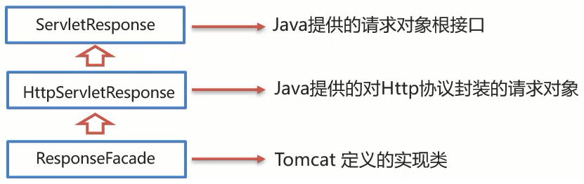

# Request和Response概述

`service方法` 中有两个参数：`ServletRequest request,ServletResponse response`

这两个参数有如下的作用：

request:**获取**请求数据

* 浏览器会发送HTTP请求到后台服务器[Tomcat]

* HTTP的请求中会包含很多请求数据[请求行+请求头+请求体]

* 后台服务器[Tomcat]会对HTTP请求中的数据进行解析并把解析结果存入到一个对象中

* 所存入的对象即为request对象，所以我们可以从request对象中获取请求的相关参数

* 获取到数据后就可以继续后续的业务，比如获取用户名和密码就可以实现登录操作的相关业务

  

response:**设置**响应数据

* 业务处理完后，后台就需要给前端返回业务处理的结果即响应数据
* 把响应数据封装到response对象中
* 后台服务器[Tomcat]会解析response对象,按照[响应行+响应头+响应体]格式拼接结果
* 浏览器最终解析结果，把内容展示在浏览器给用户浏览


## 一、Request对象

### 1.继承体系


​	ServletRequest和HttpServletRequest都是Java提供的，ServletRequest和HttpServletRequest是继承关系，并且两个都是**接口**。

​	RequestFacade类实现了HttpServletRequest接口，也间接实现了ServletRequest接口。

​	Servlet类中的service方法、doGet方法或者是doPost方法最终都是由Web服务器[Tomcat]来调用的，所以Tomcat提供了方法参数接口的具体实现类，并完成了对象的创建。

​	Tomcat需要解析请求数据，封装为request对象,并且创建request对象传递到service方法。

​	使用request对象，可以查阅JavaEE API文档的HttpServletRequest接口中方法说明。

### 2.request获取请求数据

HTTP请求包括三部分：**请求行**、**请求头**、**请求体**


#### 获取请求行

请求行包含三块内容，分别是`请求方式`、`请求资源路径`、`HTTP协议及版本`


对于这三部分内容，request对象都提供了对应的API方法来获取，具体如下:

* 获取请求方式: `GET`

```
String getMethod()
```

* 获取虚拟目录(项目访问路径): `/request-demo`

```
String getContextPath()
```

* 获取URL(统一资源定位符): `http://localhost:8080/request-demo/req1`

```
StringBuffer getRequestURL()
```

* 获取URI(统一资源标识符): `/request-demo/req1`

```
String getRequestURI()
```

* 获取请求参数(GET方式，且未经解析): `username=zhangsan&password=123`

```
String getQueryString()
```


#### 获取请求头

`String getHeader(String name)` 用于获取请求头，name为键的名字


#### 获取请求体

用于获取客户端通过POST方法发送的数据

获取**字节输入流**，如果前端发送的是字节数据，比如传递的是文件数据，则使用该方法

```
ServletInputStream getInputStream()
该方法可以获取字节
```


获取**字符输入流**，如果前端发送的是纯文本数据，则使用该方法

```
BufferedReader getReader()
```


### 3.获取请求参数的通用方法

对于请求参数的获取,常用的有以下两种:

* GET方式:

```
String getQueryString()
```

* POST方式:

```
BufferedReader getReader();
```

但这两种方式获取到的都是原生字符串，不是很方便，而且对于GET和POST方法，需要分别编写doGet和doPost方法，很麻烦。


下面这三个方法就直接对请求参数进行了解析和封装，并且GET和POST方法都适用

获取所有参数Map集合

**Map<String,String[]> getParameterMap()**


根据名称获取参数值（数组）

**String[] getParameterValues(String name)**


根据名称获取参数值(单个值)

**String getParameter(String name)**


实例：

```java
import javax.servlet.annotation.WebServlet;
import javax.servlet.http.HttpServlet;
import javax.servlet.http.HttpServletRequest;
import javax.servlet.http.HttpServletResponse;
import java.util.Map;

@WebServlet("/hello")
public class MyServlet extends HttpServlet {
    @Override
    protected void doGet(HttpServletRequest req, HttpServletResponse resp) {
        System.out.println("get...");

        Map<String,String[]> params = req.getParameterMap();
        for (String key: params.keySet()){
            String[] values = params.get(key);
            System.out.print(key + "=");
            for (int i = 0; i < values.length; i++) {
                if(i > 0)
                    System.out.print("," + values[i]);
                else
                    System.out.print(values[i]);
            }
            System.out.println();
        }

        String[] hobbies = req.getParameterValues("hobby");
        for (String s : hobbies) {
            System.out.println(s);
        }

        System.out.println(req.getParameter("username"));

    }

    @Override
    protected void doPost(HttpServletRequest req, HttpServletResponse resp) {
        System.out.println("post..");

        Map<String,String[]> params = req.getParameterMap();
        for (String key: params.keySet()){
            String[] values = params.get(key);
            System.out.print(key + "=");
            for (int i = 0; i < values.length; i++) {
                if(i > 0)
                    System.out.print("," + values[i]);
                else
                    System.out.print(values[i]);
            }
            System.out.println();
        }

        String[] hobbies = req.getParameterValues("hobby");
        for (String s : hobbies) {
            System.out.println(s);
        }

        System.out.println(req.getParameter("username"));
		
    }
}

```

表单代码如下：

```html
<form action="/Web/hello" method="post">
    username<input type="text" name="username"/><br/>
    password<input type="password" name="password"/><br/>
    swimming<input type="checkbox" name="hobby" value="swimming"/><br/>
    running<input type="checkbox" name="hobby" value="running"/><br/>
    <input type="submit" value="提交"/>
</form>
```


**小结**

* req.getParameter()方法使用的频率会比较高

* 以后我们再写代码的时候，就只需要按照如下格式来编写:

```java
public class RequestDemo1 extends HttpServlet {
    @Override
    protected void doGet(HttpServletRequest req, HttpServletResponse resp) throws ServletException, IOException {
       //采用request提供的获取请求参数的通用方式来获取请求参数
       //编写其他的业务代码...
    }
    @Override
    protected void doPost(HttpServletRequest req, HttpServletResponse resp) throws ServletException, IOException {
        this.doGet(req,resp);
    }
}
```

### 4.请求参数中文乱码问题（tomcat8 以前)

在**tomcat8之前的版本**中，会出现下列情况

问题展示:

(1)将req.html页面的请求方式修改为get

```html
<!DOCTYPE html>
<html lang="en">
<head>
    <meta charset="UTF-8">
    <title>Title</title>
</head>
<body>
<form action="/request-demo/req2" method="get">
    <input type="text" name="username"><br>
    <input type="password" name="password"><br>
    <input type="checkbox" name="hobby" value="1"> 游泳
    <input type="checkbox" name="hobby" value="2"> 爬山 <br>
    <input type="submit">

</form>
</body>
</html>
```

(2)在Servlet方法中获取参数，并打印

```java
/**
 * 中文乱码问题解决方案
 */
@WebServlet("/req4")
public class RequestDemo4 extends HttpServlet {
    @Override
    protected void doGet(HttpServletRequest request, HttpServletResponse response) throws ServletException, IOException {
       //1. 获取username
       String username = request.getParameter("username");
       System.out.println(username);
    }

    @Override
    protected void doPost(HttpServletRequest request, HttpServletResponse response) throws ServletException, IOException {
        this.doGet(request, response);
    }
}
```

（3）启动服务器，页面上输入中文参数


（4）查看控制台打印内容


（5）把req.html页面的请求方式改成post,再次发送请求和中文参数


（6）查看控制台打印内容，依然为乱码（控制台编码为 UTF-8）


通过上面的案例，会发现，不管是GET还是POST请求，在发送的请求参数中如果有中文，在后台接收的时候，都会出现中文乱码的问题。具体该如何解决呢？


#### URL编码解码原理

```java
public class URLDemo {

  public static void main(String[] args) throws UnsupportedEncodingException {
        String username = "张三"; //张三的 UTF-8 编码为：E5BCA0 E4B889
        //1. URL编码
        String encode = URLEncoder.encode(username, "utf-8");
        System.out.println(encode);     //%E5%BC%A0%E4%B8%89

        //2. URL解码
        String decode = URLDecoder.decode(encode, "ISO-8859-1");
        /* URLDecoder.decode方法会把上述中的encode字符串先转换成字节数组：E5BCA0E4B889，然后对这个字节数组按照ISO-8859-1编码来解释。
         * ISO-8859-1每个字符的编码范围为：0x00 ~ 0xFF
         * 所以URLDecoder.decode方法会把E5 BC A0 E4 B8 89解释成6个ISO-8859-1字符，也就是说解码后decode字符串底层的字节序列仍然是E5BCA0E4B889
         * 在java中，内存中存放字符串的底层的字节数组都是用的UTF16-BE编码来存储的。
         * */

        //decode字符串在内存中的表示
        for (int i = 0; i < decode.length(); i++) {
            System.out.print(Integer.toHexString(decode.charAt(i)) + " ");
        }
        System.out.println();
        //输出为e5 bc a0 e4 b8 89

        System.out.println(decode); //此处打印的是对应的乱码数据
        /*由于decode字符串的底层的字节序列为E5BCA0E4B889，并且控制台的编码为UTF-8，所以会把E5BCA0E4B889当作是一个字符串的UTF16-BE编码序列（因为在java中，内存中字符串的的字符编码为UTF16-BE)，然后把这个序列转换成相应的utf-8编码并输出到控制台上，所以会显示乱码,即“张三”。
        “张三”  这个字符串的utf-8编码为：C3A5C2BCC2A0C3A4C2B8C289，它所对应的UTF16-BE编码正是:E5BCA0E4B889
        * */

        //3. 转换为字节数据,编码
        byte[] bytes = decode.getBytes("ISO-8859-1");
        //getBytes方法会把字符串底层的UTF16-BE编码转换为参数中的编码
      	//本例中就会把decode字符串底层的字节序列E5BCA0E4B889转换为ISO-8859-1编码，但是由于第二步用URLDecoder解码时指定的编码为ISO-8859-1，所以会照原样返回E5BCA0E4B889。如果decode字符串原来是一个UTF-8编码字符串，参数给的编码却是：ISO-8859-1，那么此时getBytes就会返回3f3f。例如：
      /*
     	byte[] bytes = {(byte) 0xE5, (byte) 0xBC, (byte) 0xA0, (byte)0xE4, (byte) 0xB8, (byte) 0x89};
      	//"张三"的utf-8编码。
      
       	String s2 = new String(bytes, StandardCharsets.UTF_8);
        System.out.println(s2);//输出的是 张三
        
        for (byte b : s2.getBytes(StandardCharsets.ISO_8859_1)) {
            System.out.print(Integer.toHexString(b & 0xff) + " ");
        }
        输出3f 3f 
             
             
             
             
             
        byte[] bytes = {(byte) 0xE5, (byte) 0xBC, (byte) 0xA0, (byte) 0xE4, (byte) 0xB8, (byte) 0x89};
        //"张三"的utf-8编码。
        String s2 = new String(bytes, StandardCharsets.ISO_8859_1);
        System.out.println(s2);	//乱码
        for (byte b : s2.getBytes(StandardCharsets.ISO_8859_1)) {
            System.out.print(Integer.toHexString(b & 0xff) + " ");
        }
        输出e5 bc a0 e4 b8 89 
           */
      
        for (byte b : bytes) {
            System.out.print(Integer.toHexString(b & 0xff) + " ");
        }
        //此处打印的是:e5 bc a0 e4 b8 89

        //4. 将字节数组转为字符串，解码
        String s = new String(bytes, "utf-8");//把字节序列“e5bca0e4b889”按照utf-8来解释，它正是“张三”这个字符串的utf-8编码
        System.out.println(s); //此处打印的是张三
    }
}
```


#### POST请求出现乱码的原因

* POST的请求参数是通过request的getReader()来获取流中的数据
* TOMCAT在获取流的时候采用的编码是ISO-8859-1
* ISO-8859-1编码是不支持中文的，所以会出现乱码

解决方案：

* 页面设置的编码格式为UTF-8
* 把TOMCAT在获取流数据之前的编码设置为UTF-8
* 通过**request.setCharacterEncoding("UTF-8")**设置编码,UTF-8也可以写成小写

修改后的代码为:

```java
/**
 * 中文乱码问题解决方案
 */
@WebServlet("/req4")
public class RequestDemo4 extends HttpServlet {
    @Override
    protected void doGet(HttpServletRequest request, HttpServletResponse response) throws ServletException, IOException {
        //1. 解决乱码: POST getReader()
        //设置字符输入流的编码，设置的字符集要和页面保持一致
        request.setCharacterEncoding("UTF-8");
       //2. 获取username
       String username = request.getParameter("username");
       System.out.println(username);
    }

    @Override
    protected void doPost(HttpServletRequest request, HttpServletResponse response) throws ServletException, IOException {
        this.doGet(request, response);
    }
}
```

重新发送POST请求，就会在控制台看到正常展示的中文结果。

至此POST请求中文乱码的问题就已经解决，但是这种方案**不适用于GET请求**！

#### GET请求出现乱码的原因

* GET请求获取请求参数的方式是`request.getQueryString()`
* POST请求获取请求参数的方式是`request.getReader()`
* request.setCharacterEncoding("utf-8")是设置request处理流的编码
* getQueryString方法并没有通过流的方式获取数据

1. 首先我们需要先分析下GET请求出现乱码的原因:

 

(1)浏览器通过HTTP协议发送请求和数据给后台服务器（Tomcat)

(2)浏览器在发送HTTP的过程中会对中文数据进行URL==编码==

(3)在进行URL编码的时候会采用页面`<meta>`标签指定的UTF-8的方式进行编码，`张三`编码后的结果为`%E5%BC%A0%E4%B8%89`

(4)后台服务器(Tomcat)接收到`%E5%BC%A0%E4%B8%89`后会默认按照`ISO-8859-1`进行URL==解码==

(5)由于前后编码与解码采用的格式不一样，就会导致后台获取到的数据为乱码。

解决方法：

1.按照ISO-8859-1编码获取乱码`å¼ ä¸‰`对应的字节数组

` byte[] bytes = username.getBytes(StandardCharsets.ISO_8859_1);`

2.按照UTF-8编码获取字节数组对应的字符串

`username = new String(bytes, StandardCharsets.UTF_8);`

```java
/**
 * 中文乱码问题解决方案
 */

    protected void doGet(HttpServletRequest request, HttpServletResponse response) throws ServletException, IOException {
        //POST解决乱码：POST，getReader()
        //request.setCharacterEncoding("UTF-8");//设置字符输入流的编码

        //GET解决乱码：
        String username = request.getParameter("username");
        System.out.println("解决乱码前："+username);

		
        username  = new String(username.getBytes(StandardCharsets.ISO_8859_1),StandardCharsets.UTF_8);

        System.out.println("解决乱码后："+username);

    }

    @Override
    protected void doPost(HttpServletRequest request, HttpServletResponse response) throws ServletException, IOException {
        this.doGet(request, response);
    }

```

**注意：**

* 把`request.setCharacterEncoding("UTF-8")`代码注释掉后，会发现GET请求参数乱码解决方案同时也可也把POST请求参数乱码的问题也解决了
* 只不过对于POST请求参数一般都会比较多，采用这种方式解决乱码起来比较麻烦，所以对于POST请求还是建议使用设置编码的方式进行。


#### Tomcat8.0之后

**Tomcat8.0之后，已将GET请求乱码问题解决，设置了默认的解码方式为UTF-8，所以GET请求参数不用进行编码转换，但是POST请求仍然需要设置字符编码为UTF-8** 


但是，以下代码在IDEA中使用Tomcat8.0之后的版本运行时，控制台的编码如果为UTF-8，那么依然可能出现乱码，原因是**Tomcat启动时Java虚拟机指定的编码为平台默认的编码，例如GBK**，**所以需要给Tomcat的启动加上VM参数 ：** `-Dfile.encoding=UTF-8`，这样IDEA的控制台就不会输出乱码了。

```java
package org.example.web;

import javax.servlet.*;
import javax.servlet.http.*;
import javax.servlet.annotation.*;
import java.io.IOException;

@WebServlet("/test")
public class TestServlet extends HttpServlet {
    @Override
    protected void doGet(HttpServletRequest request, HttpServletResponse response) throws ServletException, IOException {
        String s = request.getParameter("username");
        System.out.println(s);
    }

    @Override
    protected void doPost(HttpServletRequest request, HttpServletResponse response) throws ServletException, IOException {
        this.doGet(request, response);
    }
}
```

#### 总结

Tomcat8.0以前中文乱码解决方案

* POST请求解决方案是:设置输入流的编码

  ```
  request.setCharacterEncoding("UTF-8");
  注意:设置的编码要和页面保持一致
  ```

* 通用方式（GET/POST）：需要先解码，再编码

  ```
  new String(username.getBytes("ISO-8859-1"),"UTF-8");
  ```


### 5.Request请求转发

**请求转发(forward)**:一种在**服务器内部**的资源跳转方式。


(1)浏览器发送请求给服务器，服务器中对应的资源A（可以把这个资源看作是Servlet）接收到请求

(2)资源A处理完请求后将请求发给资源B

(3)资源B处理完后将结果响应给浏览器

(4)请求从资源A到资源B的过程就叫**请求转发**

#### 实现方式

`req.getRequestDispatcher("资源B路径").forward(req,resp);`

资源A：

```java
package org.example.web;

import javax.servlet.*;
import javax.servlet.http.*;
import javax.servlet.annotation.*;
import java.io.IOException;

@WebServlet("/a")
public class ServletA extends HttpServlet {
    @Override
    protected void doGet(HttpServletRequest request, HttpServletResponse response) throws ServletException, IOException {
        System.out.println("A...");
        
        //转发
        request.getRequestDispatcher("/b").forward(request,response);
    }

    @Override
    protected void doPost(HttpServletRequest request, HttpServletResponse response) throws ServletException, IOException {
        this.doGet(request, response);
    }
}

```

资源B：

```java
package org.example.web;

import javax.servlet.*;
import javax.servlet.http.*;
import javax.servlet.annotation.*;
import java.io.IOException;

@WebServlet("/b")
public class ServletB extends HttpServlet {
    @Override
    protected void doGet(HttpServletRequest request, HttpServletResponse response) throws ServletException, IOException {
        System.out.println("B...");
    }

    @Override
    protected void doPost(HttpServletRequest request, HttpServletResponse response) throws ServletException, IOException {
        this.doGet(request, response);
    }
}

```

访问 `http://localhost/Web/a` 那么会在控制台上输出 

```console
A...
B...
```


通过请求转发，还可以在资源间共享数据，可以把数据保存在request对象中，然后转发给另一个资源。

需要使用request对象提供的三个方法:

* 存储数据到request域中

```
void setAttribute(String name,Object o);
```

* 根据key获取值

```
Object getAttribute(String name);
```

* 根据key删除该键值对

```
void removeAttribute(String name);
```


资源A：

```java
package org.example.web;

import javax.servlet.*;
import javax.servlet.http.*;
import javax.servlet.annotation.*;
import java.io.IOException;

@WebServlet("/a")
public class ServletA extends HttpServlet {
    @Override
    protected void doGet(HttpServletRequest request, HttpServletResponse response) throws ServletException, IOException {
        System.out.println("A...");

        request.setAttribute("msg","Forwarded");
        request.getRequestDispatcher("/b").forward(request,response);
    }

    @Override
    protected void doPost(HttpServletRequest request, HttpServletResponse response) throws ServletException, IOException {
        this.doGet(request, response);
    }
}

```

资源B：

```java
package org.example.web;

import javax.servlet.*;
import javax.servlet.http.*;
import javax.servlet.annotation.*;
import java.io.IOException;

@WebServlet("/b")
public class ServletB extends HttpServlet {
    @Override
    protected void doGet(HttpServletRequest request, HttpServletResponse response) throws ServletException, IOException {
        System.out.println("B...");

        Object attr = request.getAttribute("msg");
        System.out.println(attr);
    }

    @Override
    protected void doPost(HttpServletRequest request, HttpServletResponse response) throws ServletException, IOException {
        this.doGet(request, response);
    }
}

```

访问 `http://localhost/Web/a` 那么会在控制台上输出 

```console
A...
B...
Forwarded
```

#### 请求转发的特点

* 浏览器地址栏路径不发生变化

  虽然后台从`/a`转发到`/b`,但是浏览器的地址一直是`/a`,未发生变化

* 只能转发到当前服务器的**内部资源**

  不能从一个服务器通过转发访问另一台服务器

* 客户端只会发送一次请求。可以在转发资源间使用request共享数据。

  

## 二、Response对象

### 1.继承体系

Reponse的继承体系和Request的继承体系也非常相似:



### 2.Response设置响应数据

#### 设置响应行

`void setStatus(int sc);` 设置状态码


#### 设置响应头

`void setHeader(String name,String value);` 设置响应头键值对


#### 设置响应体

对于响应体，是通过字符、字节输出流的方式往浏览器写，

获取**字符输出流**:

```
PrintWriter getWriter();
```

获取**字节输出流**

```
ServletOutputStream getOutputStream();
```


### 3.response 重定向

重定向是一种资源跳转方式：

(1)浏览器发送请求给服务器，服务器中对应的资源A接收到请求

(2)资源A现在无法处理该请求，就会给浏览器响应一个**302的状态码（暂时重定向）+Location响应头（访问资源B的url）**

(3)浏览器接收到响应状态码为302就会重新发送请求到Location对应的url去访问资源B

(4)资源B接收到请求后进行处理并最终给浏览器响应结果，这整个过程就叫重定向


重定向的实现方式：

1.设置重定向状态码

`response.setStatus(302)`

2.设置location响应头

`response.setHeader("Location","urlOfRedir")` 


重定向还有一种简化方式：

`response.sendRedirect("urlOfRedir")`  该方法会发送302状态码和Location响应头


**关于Location的值**：

1. 重定向的url可以是**绝对url** ，例如 `http://www.baidu.com`

2. 也可以是相对url

   - **如果相对url以 `/`开头**，那么它表示相对于 servlet容器的根（即 tomcat服务器的根）

     例如 `/Web/b` 就表示重定向到 `http://localhost:8080/Web/b`。

   - **如果相对url不以 `/` 开头**，那么表示相对于当前请求的URI。

     例如当前请求为 `http://localhost:8080/Web/a` ，location的值为 `b` ，那么就会重定向到 `http://localhost:8080/Web/b`


重定向的特点：

* 浏览器地址栏url发送变化

* 可以重定向到任何位置的资源(服务内容、外部均可)

* 两次请求，不能在多个资源使用request共享数据

  

重定向和请求转发的对比：


### 4.路径问题

假如当前项目的虚拟目录为 `/Web` （也就是通过 `request.getContextPath()` 获得的路径）

那么配置路径（url）的时候，对于不同的情况需要判断是否加上这个虚拟目录：

* 浏览器使用:需要加虚拟目录(项目访问路径)
* 服务端使用:不需要加虚拟目录

对于转发来说，因为是在服务端进行的，所以不需要加虚拟目录

对于重定向来说，路径最终是由浏览器来发送请求，就需要添加虚拟目录。（当然也可以不加）


例如：

* `<a href='url'>` 超链接，从浏览器发送，需要加虚拟目录
* `<form action='url'>` 表单，从浏览器发送，需要加
* req.getRequestDispatcher("path") 转发，是从服务器内部跳转，不需要加
* resp.sendRedirect("url") 重定向，是由浏览器进行跳转，可以加，也可以不加。


如果使用 sendRedirect 时，需要使用加上虚拟目录的方式来指定 location，由于虚拟目录可以通过 tomcat 进行配置，可能会发生改变，那么可以使用以下方法：

```java
String contextPath = request.getContextPath(); 	//动态获取虚拟目录
response.sendRedirect(contextPath+"/resp2"); //字符串拼接
```


### 5. 响应字符数据

* 通过Response对象获取字符输出流： **PrintWriter writer = resp.getWriter();**

* 通过字符输出流写数据: **writer.write("aaa");**

如果是返回html的内容，需要加上：

`response.setHeader("content-type","text/html");`

或者直接使用：

`response.setContentType("text/html");`

如果响应内容中含有中文等字符，需要使用：

`response.setContentType("text/html;charset=utf-8");`

### 6.响应字节数据

- 通过Response对象获取字节输出流：**ServletOutputStream outputStream = resp.getOutputStream();**

- 通过字节输出流写数据: **outputStream.write(字节数据);**

示例：

```
		//1. 读取文件
        FileInputStream fis = new FileInputStream("d://a.jpg");
        //2. 获取response字节输出流
        ServletOutputStream os = response.getOutputStream();
        //3. 完成流的copy
        byte[] buff = new byte[1024];
        int len = 0;
        while ((len = fis.read(buff))!= -1){
            os.write(buff,0,len);
        }
        fis.close();
```

上述代码中，流的copy很繁琐，所以可以使用 commons-io 库来简化代码：

先添加  commons-io 依赖：

```
<dependency>
    <groupId>commons-io</groupId>
    <artifactId>commons-io</artifactId>
    <version>2.6</version>
</dependency>
```

使用工具类方法：

`IOUtils.copy(fis,os);`

