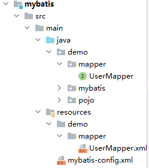
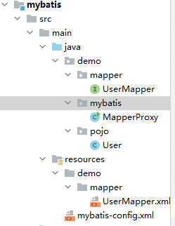
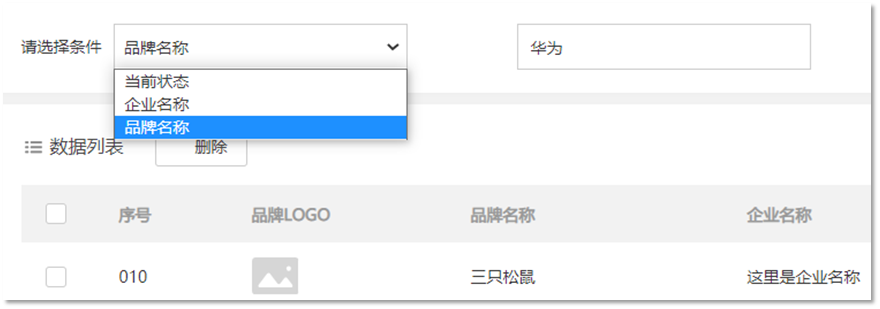

Mybatis 是一款**持久层框架**，用于简化JDBC开发。

# 一、快速入门

使用Mybatis访问数据库的步骤：

1. 添加 **Mybatis依赖** 。由于需要访问数据库，所以还应当添加上**mysql 驱动**的坐标。

   ```xml
   <dependency>
   	<groupId>org.mybatis</groupId>
   	<artifactId>mybatis</artifactId>
   	<version>3.5.5</version>
   </dependency>
   ```

2. 在模块的 `resources` 目录下创建Mybatis配置文件 **mybatis-config.xml**

   ```xml
   <?xml version="1.0" encoding="UTF-8" ?>
   <!DOCTYPE configuration
           PUBLIC "-//mybatis.org//DTD Config 3.0//EN"
           "http://mybatis.org/dtd/mybatis-3-config.dtd">
   <configuration>
        <!--
       environments：配置数据库连接环境信息。可以配置多个environment，通过default属性切换不同的environment
       -->
       <environments default="development">
           <environment id="development">
               <transactionManager type="JDBC"/>
               <dataSource type="POOLED">
                   <!--数据库连接信息-->
                   <property name="driver" value="com.mysql.cj.jdbc.Driver"/>
                   <property name="url" value="jdbc:mysql://localhost:3306/mydb"/>
                   <property name="username" value="root"/>
                   <property name="password" value="5970"/>
               </dataSource>
           </environment>
           
       	 <!-- 测试环境 -->   
            <environment id="test">
               <transactionManager type="JDBC"/>
               <dataSource type="POOLED">
                   <!--数据库连接信息-->
                   <property name="driver" value="com.mysql.jdbc.Driver"/>
                   <property name="url" value="jdbc:mysql:///mybatis?useSSL=false"/>
                   <property name="username" value="root"/>
                   <property name="password" value="1234"/>
               </dataSource>
           </environment>
       </environments>
       
       <!-- sql映射文件 -->
       <mappers>
           <mapper resource="UserMapper.xml"/>
       </mappers>
   </configuration>
   ```

3. 在模块的 `resources` 目录下创建 SQL映射文件 **xxxMapper.xml**

   例如 UserMapper.xml:

   ```xml
   <?xml version="1.0" encoding="UTF-8" ?>
   <!DOCTYPE mapper
           PUBLIC "-//mybatis.org//DTD Mapper 3.0//EN"
           "http://mybatis.org/dtd/mybatis-3-mapper.dtd">
   <mapper namespace="namespaceAny">
       <select id="selectAll" resultType="demo.pojo.User">
           select * from user_table;
       </select>
   </mapper>
   ```

4. 编写Java代码：

   1. 定义 POJO类

      demo.pojo.User.java:

      ```java
      package demo.pojo;
      
      public class User {
          private int id;
          private String user;
          private String password;
          
          public User(int id, String user, String password) {
              this.id = id;
              this.user = user;
              this.password = password;
          }
          
          public User(){}
      
          @Override
          public String toString() {
              return "User{" +
                      "id=" + id +
                      ", user='" + user + '\'' +
                      ", password='" + password + '\'' +
                      '}';
          }
      
          public int getId() {
              return id;
          }
      
          public void setId(int id) {
              this.id = id;
          }
      
          public String getUser() {
              return user;
          }
      
          public void setUser(String user) {
              this.user = user;
          }
      
          public String getPassword() {
              return password;
          }
      
          public void setPassword(String password) {
              this.password = password;
          }
      
         
      }
      
      ```

   2. 加载核心配置文件，获取 **SqlSessionFactory对象**

   3. 获取 **SqlSession对象**

   4. 通过 SqlSession对象来执行sql语句并获取相关结果

   5. 释放资源
   
   demo.mybatis.QuickStart.java:

```java
package demo.mybatis;

import demo.pojo.User;
import org.apache.ibatis.io.Resources;
import org.apache.ibatis.session.SqlSession;
import org.apache.ibatis.session.SqlSessionFactory;
import org.apache.ibatis.session.SqlSessionFactoryBuilder;

import java.io.IOException;
import java.io.InputStream;
import java.util.List;

public class QuickStart {
    public static void main(String[] args) throws IOException {
        //加载核心配置文件,并获取 SqlSessionFactory对象
        String configFile = "mybatis-config.xml";   
        InputStream inputStream = Resources.getResourceAsStream(configFile);
        SqlSessionFactory sqlSessionFactory = new SqlSessionFactoryBuilder().build(inputStream);

        //获取 SqlSession对象
        SqlSession sqlSession = sqlSessionFactory.openSession();

        //执行sql,需要传入xxxMapper.xml配置文件里的语句的id，前面一定要加上 命名空间（前面 Mapper.xml文件中 mapper标签的 namespace属性值）
      
        List<User> users = sqlSession.selectList("namespaceAny.selectAll");

        System.out.println(users);

        //释放资源
        sqlSession.close();

    }
}

```


# 二、Mapper代理开发

在上述中，执行sql语句时出现了硬编码：

`List<User> users = sqlSession.selectList("namespaceAny.selectAll");`

为了解决硬编码，也为了简化后期执行sql，所以需要用到 Mapper代理开发

## 步骤

1）定义与SQL映射文件（前文中的 UserMapper.xml）同名的Mapper接口，并且把它和SQL映射文件放在同一目录下。

​	新建一个 demo.mapper.UserMapper.java 文件，它是一个接口源文件。

​	在 maven 项目中，resources目录下的文件 ，编译后实际上是和class文件处于同一级目录下的，但是由于应当把 UserMapper.xml 文件放在resources目录下，而demo.mapper.UserMapper.java 文件应当放在 java 目录下（源代码目录），如果想让 UserMapper.java 文件 和 UserMapper.xml 文件在编译后处于同一目录下，就可以像下面这样存放源文件和相关的资源文件：



也就是说，java目录 和 resources目录在编译后实际上会合并成一个目录。

这样，也需要更改 **mybatis-config.xml 文件**中填写的 mapper的路径：

```
<mappers>
        <mapper resource="demo/mapper/UserMapper.xml"/>
</mappers>
```


2）设置SQL映射文件的namespace属性为Mapper接口全限定名（即加上包名的接口名）

**UserMapper.xml文件：**

```xml
<?xml version="1.0" encoding="UTF-8" ?>
<!DOCTYPE mapper
        PUBLIC "-//mybatis.org//DTD Mapper 3.0//EN"
        "http://mybatis.org/dtd/mybatis-3-mapper.dtd">
<!--把namesapce 属性改为UserMapper接口的全名 -->
<mapper namespace="demo.mapper.UserMapper"> 
    <select id="selectAll" resultType="demo.pojo.User">
        select * from user_table;
    </select>
</mapper>
```


3）在Mapper接口中定义方法，**方法名为SQL映射文件中sql语句的id**（即 UserMapper.xml文件中 select 标签的id属性），并且保持参数类型和返回值类型一致

UserMapper.java 的内容：

```java
package demo.mapper;

import demo.pojo.User;
import java.util.List;

public interface UserMapper {
    List<User> selectAll();
}

```


4）编写代码

​	a. 通过 **SqlSession** 的 **getMapper 方法**获取 Mapper接口的代理对象

​	`UserMapper userMapper =  sqlSession.getMapper(UserMapper.class);`

​	b. 调用相应的方法完成sql的执行

​	`List<User> users = userMapper.selectAll();`

```java
package demo.mybatis;

import demo.mapper.UserMapper;
import demo.pojo.User;
import org.apache.ibatis.io.Resources;
import org.apache.ibatis.session.SqlSession;
import org.apache.ibatis.session.SqlSessionFactory;
import org.apache.ibatis.session.SqlSessionFactoryBuilder;

import java.io.IOException;
import java.io.InputStream;
import java.util.List;

public class MapperProxy {
    public static void main(String[] args) throws IOException {
        //加载核心配置文件,并获取 SqlSessionFactory对象
        String configFile = "mybatis-config.xml";   //该文件放在 resources目录下的
        InputStream inputStream = Resources.getResourceAsStream(configFile);
        SqlSessionFactory sqlSessionFactory = new SqlSessionFactoryBuilder().build(inputStream);

        //获取 SqlSession对象
        SqlSession sqlSession = sqlSessionFactory.openSession();

        //执行sql, 使用 Mapper代理
        //获取 UserMapper接口的代理对象
        UserMapper userMapper =  sqlSession.getMapper(UserMapper.class);
        //通过 UserMapper接口来获取sql结果
        List<User> users = userMapper.selectAll();

        System.out.println(users);

        //释放资源
        sqlSession.close();

    }
}

```

源代码的结构：




**注意：** <u>如果 Mapper接口名称 和 SQL映射文件 名称相同，并且在同一目录下</u>，也就是上述中的情况，那么可以使用一种简化的配置方式**（包扫描）**来简化 SQL映射文件的加载：

在 **mybatis-config.xml 文件**中，在 mappers 标签下把原来的 mapper 标签改为 package标签，并且其name属性为所有 xxxMapper接口的包名：

```xml
<mappers>
        <package name="demo.mapper"/>
</mappers>
```

这样，只需要一行就可以适用所有的 xxxMapper接口。


# 三、配置文件 完成CRUD

## 配置文件结构

**mybatis-config.xml：**

```xml
<?xml version="1.0" encoding="UTF-8" ?>
<!DOCTYPE configuration
        PUBLIC "-//mybatis.org//DTD Config 3.0//EN"
        "http://mybatis.org/dtd/mybatis-3-config.dtd">
<configuration>
    
    <typeAliases>
    	<!--name属性的值是实体类所在包 ,如果写了别名，那么在 xxxMapper.xml文件中的 resultType属性值，就不用写全名，直接写类名即可-->
    	<package name="demo.pojo"/> 
	</typeAliases>
    
     <!--
    environments：配置数据库连接环境信息。可以配置多个environment，通过default属性切换不同的environment
    -->
    <environments default="development">
        <environment id="development">
            <transactionManager type="JDBC"/>
            <dataSource type="POOLED">
                <!--数据库连接信息-->
                <property name="driver" value="com.mysql.cj.jdbc.Driver"/>
                <property name="url" value="jdbc:mysql://localhost:3306/mydb"/>
                <property name="username" value="root"/>
                <property name="password" value="5970"/>
            </dataSource>
        </environment>
        
    	 <!-- 测试环境 -->   
         <environment id="test">
            <transactionManager type="JDBC"/>
            <dataSource type="POOLED">
                <!--数据库连接信息-->
                <property name="driver" value="com.mysql.jdbc.Driver"/>
                <property name="url" value="jdbc:mysql:///mybatis?useSSL=false"/>
                <property name="username" value="root"/>
                <property name="password" value="1234"/>
            </dataSource>
        </environment>
    </environments>
    
    <!-- sql映射文件 -->
    <mappers>
        <mapper resource="demo.mapper.xxxMapper.xml"/>
        
        <!-- 包扫描模式，有这个就不用写上面的那种方式了。 -->
        <package name="demo.mapper"/>
    </mappers>
</configuration>
```

**xxxMapper.xml：**

```xml
<?xml version="1.0" encoding="UTF-8" ?>
<!DOCTYPE mapper
        PUBLIC "-//mybatis.org//DTD Mapper 3.0//EN"
        "http://mybatis.org/dtd/mybatis-3-mapper.dtd">
<!--namesapce 属性为xxxMapper接口的全名 -->
<mapper namespace="demo.mapper.xxxMapper"> 
    <!--id属性值必须与Mapper接口中的方法名相同。
 		resultType属性为pojo类的全名，如果在config配置文件中设置了别名，那么不用写全名，只需要写类名即可 -->
    <select id="selectAll" resultType="demo.pojo.User">
        select * from user_table;
    </select>
</mapper>
```


### 多环境配置

在核心配置文件的 `environments` 标签中其实是可以配置多个 `environment` ，使用 `id` 给每段环境起名，在 `environments` 中使用 `default='环境id'` 来指定使用哪个配置。

```xml
<environments default="development">
    <environment id="development">
        <transactionManager type="JDBC"/>
        <dataSource type="POOLED">
            <!--数据库连接信息-->
            <property name="driver" value="com.mysql.jdbc.Driver"/>
            <property name="url" value="jdbc:mysql:///mybatis?useSSL=false"/>
            <property name="username" value="root"/>
            <property name="password" value="1234"/>
        </dataSource>
    </environment>

    <environment id="test">
        <transactionManager type="JDBC"/>
        <dataSource type="POOLED">
            <!--数据库连接信息-->
            <property name="driver" value="com.mysql.jdbc.Driver"/>
            <property name="url" value="jdbc:mysql:///mybatis?useSSL=false"/>
            <property name="username" value="root"/>
            <property name="password" value="1234"/>
        </dataSource>
    </environment>
</environments>
```

### 类型别名

在<u>映射配置文件</u>（xxxMapper.xml文件）中的 `resultType` 属性需要配置数据封装的类型**（类的全限定名）**。而每次这样写是特别麻烦的，Mybatis 提供了 `类型别名`(typeAliases) 可以简化这部分的书写。

首先需要现在**核心配置文件**中配置类型别名，也就意味着给pojo包下所有的类起了别名**（别名就是类名），不区分大小写。**内容如下：

```xml
<typeAliases>
    <!--name属性的值是实体类所在包-->
    <package name="com.itheima.pojo"/> 
</typeAliases>
```

通过上述的配置，我们就可以简化<u>映射配置文件</u>中 `resultType` 属性值的编写

```xml
<mapper namespace="com.itheima.mapper.UserMapper">
    <select id="selectAll" resultType="user">
        select * from tb_user;
    </select>
</mapper>
```


## 通用步骤

通过使用配置文件来完成 CRUD操作的 一般步骤：

1. 创建实体类（pojo类） 

2. 创建Mapper接口

3. 在Mapper接口中添加方法

4. 创建Mapper接口相对应的SQL映射文件（xxxMapper.xml)，并编写SQL语句

5. 在代码中执行相应的CRUD语句


下面的示例使用的数据库表：

```sql
-- 删除tb_brand表
drop table if exists tb_brand;
-- 创建tb_brand表
create table tb_brand
(
    -- id 主键
    id           int primary key auto_increment,
    -- 品牌名称
    brand_name   varchar(20),
    -- 企业名称
    company_name varchar(20),
    -- 排序字段
    ordered      int,
    -- 描述信息
    description  varchar(100),
    -- 状态：0：禁用  1：启用
    status       int
);
-- 添加数据
insert into tb_brand (brand_name, company_name, ordered, description, status)
values ('三只松鼠', '三只松鼠股份有限公司', 5, '好吃不上火', 0),
       ('华为', '华为技术有限公司', 100, '华为致力于把数字世界带入每个人、每个家庭、每个组织，构建万物互联的智能世界', 1),
       ('小米', '小米科技有限公司', 50, 'are you ok', 1);
```

安装**MybatisX** 插件

是一款基于 IDEA 的快速开发插件。

* 主要功能

  * XML映射配置文件 和 接口方法 间相互跳转
  * 根据接口方法生成 配置文件中的statement 


## ①查询所有数据（无参数）

### 1.1创建实体类

在demo.pojo包下创建一个 **Brand类**：

```java
public class Brand {
    private Integer id;		//使用包装类，可以避免默认初始化时自动赋值为0
    private String brandName;	//注意此处的名字与数据库中的名字不同，数据库中为brand_name，那么下面的代码执行后，这一列的数据会变为null，下面会说解决方法。
    private String companyName; //该处也一样
    private Integer ordered;
    private String description;
    private Integer status;
    
    //省略 setter and getter。
}
```


### 1.2创建Mapper接口

在demo.mapper包下创建 **BrandMapper接口**：

```java
package demo.mapper;

public interface BrandMapper {
   
}
```


### 1.3在Mapper接口中添加方法

**demo.mapper.BrandMapper接口**：

```java
package demo.mapper;

import demo.pojo.Brand;
import java.util.List;

public interface BrandMapper {
    List<Brand> selectAll();	//查询所有数据的方法
}
```


### 1.4创建 SQL映射文件，和编写SQL语句

在 resources目录下创建 `demo/mapper/BrandMapper.xml` 文件：

```xml
<?xml version="1.0" encoding="UTF-8" ?>
<!DOCTYPE mapper
        PUBLIC "-//mybatis.org//DTD Mapper 3.0//EN"
        "http://mybatis.org/dtd/mybatis-3-mapper.dtd">

<mapper namespace="demo.mapper.BrandMapper">
    <select id="selectAll" resultType="demo.pojo.Brand">
        select * from tb_brand;
    </select>
</mapper>
```

#### 映射文件中SQL语句中特殊字符的处理

如果我们在映射文件中的SQL语句中需要使用 类似于 `< >` 这样的特殊字符，由于映射文件是一个xml文件，所以这些字符需要转义：

a. 使用 `&lt;` 这种形式

b. 使用 `<![CDATA[ < ]]>` 来进行转义


### 1.5编写代码执行操作

```java
package demo.mybatis;

import demo.mapper.BrandMapper;
import demo.pojo.Brand;
import org.apache.ibatis.io.Resources;
import org.apache.ibatis.session.SqlSession;
import org.apache.ibatis.session.SqlSessionFactory;
import org.apache.ibatis.session.SqlSessionFactoryBuilder;

import java.io.IOException;
import java.io.InputStream;
import java.util.List;

public class MapperProxy {
    public static void main(String[] args) throws IOException {
        //加载核心配置文件,并获取 SqlSessionFactory对象
        String configFile = "mybatis-config.xml";   //该文件放在 resources目录下的
        InputStream inputStream = Resources.getResourceAsStream(configFile);
        SqlSessionFactory sqlSessionFactory = new SqlSessionFactoryBuilder().build(inputStream);

        //获取 SqlSession对象
        SqlSession sqlSession = sqlSessionFactory.openSession();

        //执行sql, 使用 Mapper代理
        //获取 BrandMapper接口的代理对象
        BrandMapper brandMapper = sqlSession.getMapper(BrandMapper.class);
        //通过 BrandMapper接口来获取sql结果
        List<Brand> brands = brandMapper.selectAll();

        System.out.println(brands);

        //释放资源
        sqlSession.close();

    }
}
```


### 注意：

由于数据库中域的名称与实体类属性的名称不符：


所以执行sql语句后获得的 Brand对象，这两个属性会出现空值。

可以通过如下办法来解决这个问题：

**1.起别名**

可以在 sql语句中给名称不相同的域起别名，使之与实体类中的属性的名称相同，例如：

```sql
select id,brand_name as brandName,company_name as companyName,
               ordered,description,status
        from tb_brand;
```


而上面的SQL语句中的字段列表书写麻烦，如果表中还有更多的字段，同时其他的功能也需要查询这些字段时就显得我们的代码不够精炼。Mybatis提供了**sql 片段**可以提高sql的复用性。

#### SQL片段

* 将需要复用的SQL片段抽取到 `sql` 标签中

  ```xml
  <sql id="brand_column">
  	id, brand_name as brandName, company_name as companyName, ordered, description, status
  </sql>
  ```

  id属性值是唯一标识，引用时也是通过该值进行引用。

* 在原sql语句中进行引用

  使用 `include` 标签引用上述的 SQL 片段，而 `refid` 指定上述 SQL 片段的id值。

  ```xml
  <select id="selectAll" resultType="brand">
      select
      <include refid="brand_column" />
      from tb_brand;
  </select>
  ```


**2.使用resultMap**

起别名 + sql片段的方式可以解决上述问题，但是它也存在问题。如果还有功能只需要查询部分字段，而不是查询所有字段，那么我们就需要再定义一个 SQL 片段，这就显得不是那么灵活。

那么我们也可以使用resultMap来定义字段和属性的映射关系的方式解决上述问题。

#### resultMap（推荐）

* 在<u>映射配置文件</u>中使用 **resultMap标签** 定义 字段 和 属性 的映射关系

  注意：在上面只需要定义 字段名 和 属性名 不一样的映射，而一样的则不需要专门定义出来。
  
* SQL语句正常编写

  ```xml
  <select id="selectAll" resultMap="brandResultMap">
      select *
      from tb_brand;
  </select>
  ```

此时的 BrandMapper.xml 文件：

```xml
<?xml version="1.0" encoding="UTF-8" ?>
<!DOCTYPE mapper
        PUBLIC "-//mybatis.org//DTD Mapper 3.0//EN"
        "http://mybatis.org/dtd/mybatis-3-mapper.dtd">


<mapper namespace="demo.mapper.BrandMapper">
    <!--    id属性指定为唯一的标识，type属性为实体类的名称（支持别名）-->
    <resultMap id="brandResultMap" type="demo.pojo.Brand">

        <!-- 这里可以指定两种标签
            id标签：完成主键字段的映射
            result标签：完成一般字段的映射
                column属性为数据库中字段的名称
                propperty属性为实体类的属性名
               -->
        <result column="brand_name" property="brandName"/>
        <result column="company_name" property="companyName"/>
    </resultMap>

    <!--这里需要把resultType属性改为resultMap属性，其值为前面resultMap标签的id属性-->
    <select id="selectAll" resultMap="brandResultMap">
        select *
        from tb_brand;
    </select>

</mapper>
```


以下实现均省略了通用步骤中的前两步

## ②单个条件查询（单个参数）

假如我们想根据 id 来查询某一行数据，其中id是可变的参数。

**2.1在Mapper接口中添加方法**

在 **BrandMapper** 接口中添加如下方法：

```java
	/**
     * 根据id查询单行数据
     */
    Brand selectById(int id);
```


**2.2编写SQL语句**

在 **BrandMapper.xml** 中添加一个 **select元素** ，注意使用的是 **resultMap**，而不是 **returnType**：

```xml
<select id="selectById" resultMap="brandResultMap">
    select *
    from tb_brand
    where id = #{id};		<!-- #{id} 是表示参数的语法，下面会讲解
</select>
```


### 参数占位符

在这个映射配置文件中， `#{id}` 类似于 PreparedStatement 里的 `?` 参数占位符。

mybatis提供了两种参数占位符：

* **#{}** ：执行SQL时，会将 #{} 占位符替换为？，将来自动设置参数值。从上述例子可以看出使用#{} 底层使用的是 `PreparedStatement`

* **${}** ：拼接SQL。底层使用的是 `Statement`，**会存在SQL注入问题**。**仅适用于表名或列明不固定的情况下。**

  

### parameterType属性

对于有参数的mapper接口方法，我们在映射配置文件中应该配置 `ParameterType属性` 来指定参数类型。**只不过该属性都可以省略。**如下图：

```xml
<select id="selectById" parameterType="int" resultMap="brandResultMap">
    select *
    from tb_brand where id = #{id};
</select>
```


**2.3编写代码执行操作**

```java
package demo.mybatis;

import demo.mapper.BrandMapper;
import demo.pojo.Brand;
import org.apache.ibatis.io.Resources;
import org.apache.ibatis.session.SqlSession;
import org.apache.ibatis.session.SqlSessionFactory;
import org.apache.ibatis.session.SqlSessionFactoryBuilder;

import java.io.IOException;
import java.io.InputStream;
import java.util.List;

public class MapperProxy {
    public static void main(String[] args) throws IOException {
        //加载核心配置文件,并获取 SqlSessionFactory对象
        String configFile = "mybatis-config.xml";   //该文件放在 resources目录下的
        InputStream inputStream = Resources.getResourceAsStream(configFile);
        SqlSessionFactory sqlSessionFactory = new SqlSessionFactoryBuilder().build(inputStream);

        //获取 SqlSession对象
        SqlSession sqlSession = sqlSessionFactory.openSession();

        //获取 BrandMapper接口的代理对象
        BrandMapper brandMapper = sqlSession.getMapper(BrandMapper.class);

        int id = 3;     //参数

        //通过 BrandMapper接口来获取sql结果
        Brand brand = brandMapper.selectById(id);

        System.out.println(brand);

        //释放资源
        sqlSession.close();

    }
}
```


## ③多个条件查询（多个参数）

假如我们想根据  status，company_name，brand_name  这三个字段来进行条件查询，其中企业名称和品牌名称为模糊匹配。

**3.1 在Mapper接口中添加方法**

由于这是一个多条件查询，一共有三个参数，Mybatis针对<u>多参数</u>有三种方法：

### 多参数在Mapper接口中实现的三种方法

1. 使用 `@Param("参数名称")` 注解标记每一个参数，在映射配置文件中就需要使用 `#{参数名称}` 进行占位，并且两者名字一定要相同

  ```java
  List<Brand> selectByCondition(@Param("status") int status, @Param("companyName") String companyName,@Param("brandName") String brandName);
  ```

2. 将多个参数封装成一个 <u>实体对象</u> ，将该实体对象作为接口的方法参数。该方式要求在映射配置文件的SQL中使用 `#{名称}` 时，里面的 <u>名称</u> 必须和 <u>实体类属性名</u> 保持一致。

  ```java
  List<Brand> selectByCondition(Brand brand);
  ```

3. 将多个参数封装到 <u>map集合</u> 中，将map集合作为接口的方法参数。该方式要求在映射配置文件的SQL中使用 `#{名称}` 时，里面的 <u>名称</u> 必须和 map集合中<u>键</u>的名称一致。

  ```
  List<Brand> selectByCondition(Map map);
  ```

**3.2编写SQL语句**

在 `BrandMapper.xml` 映射配置文件中添加 **select元素** 并编写sql语句：

```xml
<select id="selectByCondition" resultMap="brandResultMap">
        select *
        from tb_brand
        where status = #{status}
          and company_name like #{companyName}
          and brand_name like #{brandName}
</select>
```


**3.3编写代码执行操作**

```java
package demo.mybatis;

import demo.mapper.BrandMapper;
import demo.pojo.Brand;
import org.apache.ibatis.io.Resources;
import org.apache.ibatis.session.SqlSession;
import org.apache.ibatis.session.SqlSessionFactory;
import org.apache.ibatis.session.SqlSessionFactoryBuilder;

import java.io.IOException;
import java.io.InputStream;
import java.util.HashMap;
import java.util.List;
import java.util.Map;

public class MapperProxy {
    public static void main(String[] args) throws IOException {
        //加载核心配置文件,并获取 SqlSessionFactory对象
        String configFile = "mybatis-config.xml";   //该文件放在 resources目录下的
        InputStream inputStream = Resources.getResourceAsStream(configFile);
        SqlSessionFactory sqlSessionFactory = new SqlSessionFactoryBuilder().build(inputStream);

        //获取 SqlSession对象
        SqlSession sqlSession = sqlSessionFactory.openSession();

        //获取 BrandMapper接口的代理对象
        BrandMapper brandMapper = sqlSession.getMapper(BrandMapper.class);

        //参数
        int status = 1;
        String companyName = "%"+ "华为" + "%";   //拼接模糊匹配字符串
        String brandName = "%"+ "华为" + "%";

        //通过 BrandMapper接口来获取sql结果
        //第一种方式
        // List<Brand> brands = brandMapper.selectByCondition(status,companyName,brandName);

        //第二种方式
        /*
        Brand brand = new Brand();
        brand.setStatus(status);
        brand.setCompanyName(companyName);
        brand.setBrand_name(brandName);
        List<Brand> brands = brandMapper.selectByCondition(brand);
        */

        //第三种方式
        Map<String , Object> map = new HashMap<>();
        map.put("status",status);
        map.put("companyName",companyName);
        map.put("brandName",brandName);
        List<Brand> brands = brandMapper.selectByCondition(map);

        System.out.println(brands);

        //释放资源
        sqlSession.close();

    }
}

```


### 动态SQL

上述功能实现存在很大的问题。用户在输入条件时，有可能不会所有的条件都填写。例如，当用户只输入了 status 时，其它两个参数就会都为null，这时 sql语句就变成了：

```sql
select *
from tb_brand
where status = 1
     and company_name like null
     and brand_name like null
```

但是实际想达到的效果确是：

```java
select * from tb_brand where status = 1
```

针对上述的需要，Mybatis对动态SQL有很强大的支撑：

* **if**

* **choose (when, otherwise)**

* **trim (where, set)**

* **foreach**

以上都是**映射配置文件里的xml标签**


#### if标签

**test 属性**：逻辑表达式

```xml
<select id="selectByCondition" resultMap="brandResultMap">
    select *
    from tb_brand
    where
        <if test="status != null">
            status = #{status}
        </if>
        <if test="companyName != null and companyName != '' ">
            and company_name like #{companyName}
        </if>
        <if test="brandName != null and brandName != '' ">
            and brand_name like #{brandName}
        </if>
</select>
```

它表示，**如果 test属性里的表达式为真，那么 if 标签里的语句会原样被添加到sql语句中**，例如，如果我们只传入status这个参数：

```java
Map map = new HashMap();
map.put("status" , status);
//map.put("companyName", companyName);
//map.put("brandName" , brandName);
```

那么是可以达到我们要求的 `select * from tb_brand where status = ?` 这个效果。

但是如果只传入 companyName 这个参数，那么sql语句就会变成：

`select * from tb_brand where  and company_name like ?`

这种情况可以通过 **where标签** 来解决


#### where标签

作用：

* 替换where关键字
* 会动态地去掉第一个条件前的 and 
* 如果所有的参数没有值则不加where关键字

```xml
<select id="selectByCondition" resultMap="brandResultMap">
        select *
        from tb_brand
        <where>
            <if test="status != null">
               status = #{status}
            </if>

            <if test="companyName != null and companyName != '' ">
               and company_name like #{companyName}
            </if>


            <if test="brandName != null and brandName != '' ">
                and brand_name like #{brandName}
            </if>
        </where>
</select>
```


## ④多选一条件查询（动态SQL）



如上图所示，在查询时只能选择 `品牌名称`、`当前状态`、`企业名称` 这三个条件中的一个，但是用户到底选择哪儿一个，我们并不能确定。

这种需求需要使用到  **choose（when，otherwise）标签**  实现，  而 `choose` 标签类似于Java 中的switch语句。

### choose（when，otherwise）标签

**choose标签** 类似于 switch关键字

**when标签** 类似于 case关键字 ，当它的 **test属性** 中的表达式值为真时，该标签中的语句会添加到sql语句中

**otherwise标签** 类似于default关键字


**4.1 在Mapper接口中添加方法**

```java
  /**
    * 多选一条件查询 ，这里的参数也可以是 Map类型
    */
List<Brand> selectByConditionSingle(Brand brand);
```

**4.2编写SQL语句**

```xml
<select id="selectByConditionSingle" resultMap="brandResultMap">
        select *
        from tb_brand
        <where>
            <choose><!--相当于switch-->
                <when test="status != null"><!--相当于case-->
                    status = #{status}
                </when>

                <when test="companyName != null and companyName != '' "><!--相当于case-->
                    company_name like #{companyName}
                </when>

                <when test="brandName != null and brandName != ''"><!--相当于case-->
                    brand_name like #{brandName}
                </when>
            </choose>
        </where>
</select>
```

**4.3编写代码执行操作**

```java
package demo.mybatis;

import demo.mapper.BrandMapper;
import demo.pojo.Brand;
import org.apache.ibatis.io.Resources;
import org.apache.ibatis.session.SqlSession;
import org.apache.ibatis.session.SqlSessionFactory;
import org.apache.ibatis.session.SqlSessionFactoryBuilder;

import java.io.IOException;
import java.io.InputStream;
import java.util.HashMap;
import java.util.List;
import java.util.Map;

public class MapperProxy {
    public static void main(String[] args) throws IOException {
        //加载核心配置文件,并获取 SqlSessionFactory对象
        String configFile = "mybatis-config.xml";   //该文件放在 resources目录下的
        InputStream inputStream = Resources.getResourceAsStream(configFile);
        SqlSessionFactory sqlSessionFactory = new SqlSessionFactoryBuilder().build(inputStream);

        //获取 SqlSession对象
        SqlSession sqlSession = sqlSessionFactory.openSession();

        //获取 BrandMapper接口的代理对象
        BrandMapper brandMapper = sqlSession.getMapper(BrandMapper.class);

        //参数
        int status = 1;
        String companyName = "%"+ "华为" + "%";   //拼接模糊匹配字符串
        String brandName = "%"+ "华为" + "%";

        //通过 BrandMapper接口来获取sql结果

        Map map = new HashMap();
        // map.put("status" , status);
        map.put("companyName", companyName);
        // map.put("brandName" , brandName);

        List<Brand> brands = brandMapper.selectByConditionSingle(map);

        System.out.println(brands);

        //释放资源
        sqlSession.close();

    }
}
```

**注意：** 假如上述代码中，同时传入了 两个参数：

```java
 Map map = new HashMap();
 map.put("status" , status);
 map.put("companyName", companyName);
```

那么最终的 SQL语句中也只会有一个条件查询：`select * from tb_brand WHERE status = ? `

如果没有传任何参数，那么相当于：`select * from tb_brand `


## ⑤添加数据

### Mybatis事务

在我们创建 **SqlSession 对象** 时：` SqlSession sqlSession = sqlSessionFactory.openSession();` 

**默认是 autocommit = false 的**，也就是说，如果我们需要添加数据，必须手动提交：`SqlSession.commit()`。

如果希望开启自动提交，那么可以使用 ： `SqlSession sqlSession = sqlSessionFactory.openSession(true);`


假如我们想在数据库中添加数据。

**5.1 在Mapper接口中添加方法**

```java
int addOne(Brand brand);	//返回值为更新的行数
```

**5.2编写SQL语句**

如果要添加数据，就需要在映射文件中使用 **insert标签**

```
<insert id="addOne">
        insert into tb_brand(brand_name,company_name,ordered,description,status)
        values(#{brandName},#{companyName},#{ordered},#{description},#{status})
</insert>
```

**5.3编写代码执行操作**

```java
package demo.mybatis;

import demo.mapper.BrandMapper;
import demo.pojo.Brand;
import org.apache.ibatis.io.Resources;
import org.apache.ibatis.session.SqlSession;
import org.apache.ibatis.session.SqlSessionFactory;
import org.apache.ibatis.session.SqlSessionFactoryBuilder;

import java.io.IOException;
import java.io.InputStream;
import java.util.HashMap;
import java.util.List;
import java.util.Map;

public class MapperProxy {
    public static void main(String[] args) throws IOException {
        //加载核心配置文件,并获取 SqlSessionFactory对象
        String configFile = "mybatis-config.xml";   //该文件放在 resources目录下的
        InputStream inputStream = Resources.getResourceAsStream(configFile);
        SqlSessionFactory sqlSessionFactory = new SqlSessionFactoryBuilder().build(inputStream);

        //获取 SqlSession对象,默认为关闭自动提交
        SqlSession sqlSession = sqlSessionFactory.openSession();
        //SqlSession sqlSession = sqlSessionFactory.openSession(true); //设置自动提交事务，这种情况不需要手动提交事务了

        //获取 BrandMapper接口的代理对象
        BrandMapper brandMapper = sqlSession.getMapper(BrandMapper.class);

        //接收参数
        int status = 1;
        String companyName = "Apple";
        String brandName = "苹果";
        String description = "Apple apple";
        int ordered = 597;

        Brand brand = new Brand();
        brand.setStatus(status);
        brand.setCompanyName(companyName);
        brand.setBrandName(brandName);
        brand.setDescription(description);
        brand.setOrdered(ordered);

        //通过 BrandMapper接口来获取sql结果
        int i  = brandMapper.addOne(brand);

        System.out.println(i);

        //提交事务
        sqlSession.commit();

        //释放资源
        sqlSession.close();

    }
}
```


### 主键返回

在数据添加成功后，有时候需要获取插入数据的主键（自增长主键）。

在 **insert 标签**上添加如下属性：

* **useGeneratedKeys**：是否获取自动增长的主键值。true表示获取
* **keyProperty**  ：指定将获取到的主键值封装到实体类中的哪个属性里。

```xml
<insert id="addOne" useGeneratedKeys="true" keyProperty="id">
        insert into tb_brand (brand_name, company_name, ordered, description, status)
        values (#{brandName}, #{companyName}, #{ordered}, #{description}, #{status});
</insert>
```

这样我们添加数据后，可以通过一开始的brand对象来获取其主键值了 `brand.getId()`。


## ⑥修改数据

假如我们想要修改数据中某些字段的值。

**6.1 在Mapper接口中添加方法**

```java
int update(Brand brand);		//返回值为更新的行数
```

**6.2编写SQL语句**

使用动态 sql 语句：

```xml
<update id="update">
    update tb_brand
    <set>
        <if test="brandName != null and brandName != ''">
            brand_name = #{brandName},
        </if>
        <if test="companyName != null and companyName != ''">
            company_name = #{companyName},
        </if>
        <if test="ordered != null">
            ordered = #{ordered},
        </if>
        <if test="description != null and description != ''">
            description = #{description},
        </if>
        <if test="status != null">
            status = #{status}
        </if>
    </set>
    where id = #{id};
</update>
```

### set标签（动态sql）

*set* 标签可以用于动态包含需要更新的列，它可以自动删去末尾的 `，` ，并且在所有参数都为空的情况下，去掉 `set` 语句。 

**6.3编写代码执行操作**

```java
package demo.mybatis;

import demo.mapper.BrandMapper;
import demo.pojo.Brand;
import org.apache.ibatis.io.Resources;
import org.apache.ibatis.session.SqlSession;
import org.apache.ibatis.session.SqlSessionFactory;
import org.apache.ibatis.session.SqlSessionFactoryBuilder;

import java.io.IOException;
import java.io.InputStream;

public class MapperProxy {
    public static void main(String[] args) throws IOException {
        //加载核心配置文件,并获取 SqlSessionFactory对象
        String configFile = "mybatis-config.xml";   //该文件放在 resources目录下的
        InputStream inputStream = Resources.getResourceAsStream(configFile);
        SqlSessionFactory sqlSessionFactory = new SqlSessionFactoryBuilder().build(inputStream);

        //获取 SqlSession对象,默认为关闭自动提交
        SqlSession sqlSession = sqlSessionFactory.openSession();

        //获取 BrandMapper接口的代理对象
        BrandMapper brandMapper = sqlSession.getMapper(BrandMapper.class);

        //接收参数
        String description = "Apple apple new";
        int ordered = 199;

        Brand brand = new Brand();
        brand.setId(7);
        brand.setDescription(description);
        brand.setOrdered(ordered);

        //通过 BrandMapper接口来获取sql结果
        System.out.println(brandMapper.update(brand));

        //提交事务
        sqlSession.commit();


        //释放资源
        sqlSession.close();

    }
}

```


## ⑦删除一行数据

假如我们想根据主键id的值来删除一行数据。

**7.1 在Mapper接口中添加方法**

`void deleteById(int id);`


**7.2编写SQL语句**

需要使用 **delete标签**

```xml
    <delete id="deleteById">
        delete from tb_brand
        where id = #{id};
    </delete>
```


**7.3编写代码执行操作**

```java
package demo.mybatis;

import demo.mapper.BrandMapper;
import demo.pojo.Brand;
import org.apache.ibatis.io.Resources;
import org.apache.ibatis.session.SqlSession;
import org.apache.ibatis.session.SqlSessionFactory;
import org.apache.ibatis.session.SqlSessionFactoryBuilder;

import java.io.IOException;
import java.io.InputStream;

public class MapperProxy {
    public static void main(String[] args) throws IOException {
        //加载核心配置文件,并获取 SqlSessionFactory对象
        String configFile = "mybatis-config.xml";   //该文件放在 resources目录下的
        InputStream inputStream = Resources.getResourceAsStream(configFile);
        SqlSessionFactory sqlSessionFactory = new SqlSessionFactoryBuilder().build(inputStream);

        //获取 SqlSession对象,默认为关闭自动提交
        SqlSession sqlSession = sqlSessionFactory.openSession();

        //获取 BrandMapper接口的代理对象
        BrandMapper brandMapper = sqlSession.getMapper(BrandMapper.class);

        //通过 BrandMapper接口来获取sql结果
        brandMapper.deleteById(7);

        //提交事务
        sqlSession.commit();

        //释放资源
        sqlSession.close();

    }
}

```


## ⑧批量删除

假如我们想根据id的值删除多行数据。

**8.1 在Mapper接口中添加方法**

这时传入的参数应该是一个数组。

```java
void deleteByIds(int[] ids);
```


**8.2编写SQL语句**

编写SQL时需要遍历数组来拼接SQL语句。

### foreach标签(动态sql)

它用来迭代任何可迭代的对象（如数组，集合）。

* **collection 属性**：
  - mybatis会将数组参数，封装为一个Map集合。这个Map的key默认名称为 array，值为参数数组，那么 **collection 属性** 的就应该为 **array**。
  
  - 也可以使用**@Param注解**改变Map集合的key默认的名称 `void deleteByIds(@Param("ids")int[] ids);` ,那么此时 **collection 属性**的值就应该为 **ids**。
  
* **item 属性**：本次迭代获取到的元素。应该和 **#{参数}** 里的参数名一致

* **separator 属性**：集合项迭代之间的分隔符。`foreach` 标签不会错误地添加多余的分隔符。也就是最后一次迭代不会加分隔符。

* **open 属性**：该属性值是在拼接SQL语句之前拼接的语句，只会拼接一次

* **close 属性**：该属性值是在拼接SQL语句拼接后拼接的语句，只会拼接一次

```xml
<delete id="deleteByIds">
        delete from tb_brand
        where id in
        <foreach collection="array" item="id" open="(" close=")" separator=",">
            #{id}
        </foreach>
</delete>
```


**8.3编写代码执行操作**

```java
package demo.mybatis;

import demo.mapper.BrandMapper;
import demo.pojo.Brand;
import org.apache.ibatis.io.Resources;
import org.apache.ibatis.session.SqlSession;
import org.apache.ibatis.session.SqlSessionFactory;
import org.apache.ibatis.session.SqlSessionFactoryBuilder;

import java.io.IOException;
import java.io.InputStream;

public class MapperProxy {
    public static void main(String[] args) throws IOException {
        //加载核心配置文件,并获取 SqlSessionFactory对象
        String configFile = "mybatis-config.xml";   //该文件放在 resources目录下的
        InputStream inputStream = Resources.getResourceAsStream(configFile);
        SqlSessionFactory sqlSessionFactory = new SqlSessionFactoryBuilder().build(inputStream);

        //获取 SqlSession对象,默认为关闭自动提交
        SqlSession sqlSession = sqlSessionFactory.openSession();

        //获取 BrandMapper接口的代理对象
        BrandMapper brandMapper = sqlSession.getMapper(BrandMapper.class);

        //通过 BrandMapper接口来获取sql结果
        brandMapper.deleteByIds(new int[]{4,5,6});

        //提交事务
        sqlSession.commit();

        //释放资源
        sqlSession.close();

    }
}

```


# 四、Mybatis参数传递

Mybatis 接口方法中可以接收各种各样的参数，如下：

* 多个参数
* 单个参数：单个参数又可以是如下类型
  * POJO 类型
  * Map 集合类型
  * Collection 集合类型
  * List 集合类型
  * Array 类型
  * 其他类型

## 多个参数

如下面的代码，就是接收两个参数，而接收多个参数需要使用 `@Param` 注解，那么为什么要加该注解呢？这个问题要弄明白就必须来研究Mybatis 底层对于这些参数是如何处理的。

```java
User select(@Param("username") String username,@Param("password") String password);
```

```xml
<select id="select" resultType="user">
	select *
    from tb_user
    where 
    	username=#{username}
    	and password=#{password}
</select>
```

我们在接口方法中定义多个参数，Mybatis 会将这些参数封装成 **Map 集合**对象，值就是参数值，而键在没有使用 `@Param` 注解时有以下命名规则：

* 以 arg 开头  ：第一个参数就叫 arg0，第二个参数就叫 arg1，以此类推。底层实现类似于：

  > map.put("arg0"，参数值1);
  >
  > map.put("arg1"，参数值2);

* 以 param 开头 ： 第一个参数就叫 param1，第二个参数就叫 param2，依次类推。底层实现类似于：

  > map.put("param1"，参数值1);
  >
  > map.put("param2"，参数值2);

**代码验证：**

* 在 `UserMapper` 接口中定义如下方法

  ```java
  User select(String username,String password);
  ```

* 在 `UserMapper.xml` 映射配置文件中定义SQL

  ```xml
  <select id="select" resultType="user">
  	select *
      from tb_user
      where 
      	username=#{arg0}
      	and password=#{arg1}
  </select>
  ```

  或者

  ```xml
  <select id="select" resultType="user">
  	select *
      from tb_user
      where 
      	username=#{param1}
      	and password=#{param2}
  </select>
  ```

* 此时运行代码的话，可以正常运行。

  

 在接口方法参数上使用 `@Param` 注解，Mybatis 会将 <u>`arg` 开头的键名</u>替换为对应注解的属性值。

**代码验证：**

* 在 `UserMapper` 接口中定义如下方法，在 `username` 参数前加上 `@Param` 注解

  ```java
  User select(@Param("username") String username, String password);
  ```

  Mybatis 在封装 Map 集合时，键名就会变成如下：

  > map.put("username"，参数值1);
  >
  > map.put("arg1"，参数值2);
  >
  > map.put("param1"，参数值1);
  >
  > map.put("param2"，参数值2);

* 在 `UserMapper.xml` 映射配置文件中定义SQL

  ```xml
  <select id="select" resultType="user">
  	select *
      from tb_user
      where 
      	username=#{username}
      	and password=#{param2}
  </select>
  ```

* 运行程序结果没有报错。而如果将 `#{}` 中的 `username` 还是写成  `arg0` 

  ```xml
  <select id="select" resultType="user">
  	select *
      from tb_user
      where 
      	username=#{arg0}
      	and password=#{param2}
  </select>
  ```

* 运行程序则可以看到错误


**以后接口参数是多个时，在每个参数上都使用 `@Param` 注解。这样代码的可读性更高。**


## 单个参数

* POJO 类型

  直接使用。要求 `属性名` 和 `参数占位符名称` 一致

* Map 集合类型

  直接使用。要求 `map集合的键名` 和 `参数占位符名称` 一致

* Collection 集合类型

  Mybatis 会将Collection 集合封装到 map 集合中，如下：

  > map.put("arg0"，collection集合);
  >
  > map.put("collection"，collection集合;

  **可以使用 `@Param` 注解替换map集合中默认的 arg 键名。**

* List 集合类型

  Mybatis 会将List集合封装到 map 集合中，如下：

  > map.put("arg0"，list集合);
  >
  > map.put("collection"，list集合);
  >
  > map.put("list"，list集合);

  **可以使用 `@Param` 注解替换map集合中默认的 arg 键名。**

* 数组类型

  Mybatis 会将数组封装到 map 集合中，如下：

  > map.put("arg0"，数组);
  >
  > map.put("array"，数组);

  **可以使用 `@Param` 注解替换map集合中默认的 arg 键名**。

* 其他类型

  比如int类型，`参数占位符名称` 叫什么都可以。尽量做到见名知意


# 五、注解实现CRUD

使用注解开发会比配置文件开发更加方便。如下就是使用注解进行开发

```java
@Select(value = "select * from tb_user where id = #{id}")
public User select(int id);
```

 **注意：**

​	注解是用来替换<u>映射配置文件</u>方式配置的，所以使用了注解，就不需要再映射配置文件中书写对应的 `statement` 了


Mybatis 针对 CRUD 操作都提供了对应的注解，已经做到见名知意。如下：

* 查询 ：**@Select**
* 添加 ：**@Insert**
* 修改 ：**@Update**
* 删除 ：**@Delete**


下面举一个例子：

我们在 **BrandMapper.xml** 中根据id查询数据的 `statement` 删去：

```
注释掉
   <!-- <select id="selectById" resultMap="brandResultMap">
        select *
        from tb_brand
        where id = #{id};
    </select>-->
```

然后为 **BrandMapper接口** 中的对应的 **selectById方法** 填上注解：

```java
	/**
     * 根据id查询单行数据
     */
    @Select("select * from tb_brand where id=#{id}")
    Brand selectById(int id);
```

运行之后，可以发现能正常运行，但是 brandName 和 companyName属性的值为null，可以再加上一个 @ResultMap("brandResultMap") 注解就行了：

```java
	/**
     * 根据id查询单行数据
     */
    @Select("select * from tb_brand where id=#{id}")
    @ResultMap("brandResultMap")
    Brand selectById(int id);
```


但是像诸如动态SQL之类复杂功能，最好还是使用配置文件的方式。

所以，需要灵活地选择 注解方式 还是 配置文件的方式

**注解完成简单功能，配置文件完成复杂功能。**

