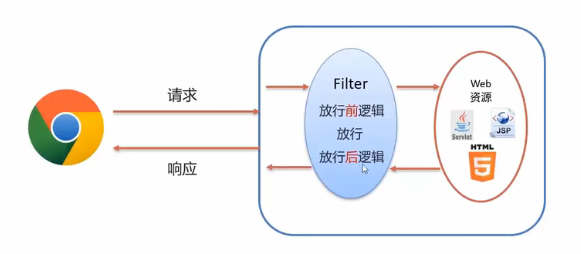
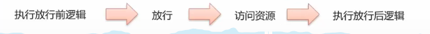
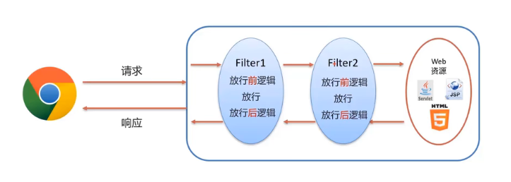
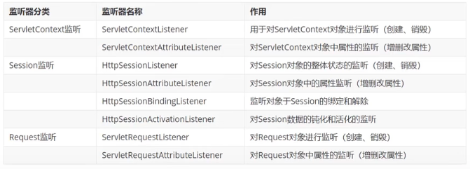

# Filter

 Filter 是 JavaWeb三大组件（Servlet、Filter、Listener）之一，它可以把对资源的请求拦截下来，然后进行过滤（比如：权限控制、统一编码处理、敏感字符处理）。

## 一、快速入门

### 1.定义类，实现 Filter接口

```java
package org.example.filter;

import javax.servlet.*;
import java.io.IOException;

public class FilterDemo implements Filter {
    @Override
    public void init(FilterConfig filterConfig) throws ServletException {

    }

    @Override
    public void doFilter(ServletRequest request, ServletResponse response, FilterChain chain) throws IOException, ServletException {

    }

    @Override
    public void destroy() {

    }
}

```

### 2.配置Filter拦截资源的路径

在Filter实现类上添加 **@WebFilter注解**

```
@WebFilter("/*")
public class FilterDemo implements Filter {
...
```

### 3.在 doFilter方法中实现功能

```java
@Override
public void doFilter(ServletRequest request, ServletResponse response, FilterChain chain) throws IOException, ServletException {
    System.out.println("filtering...");
	chain.doFilter(request,response);	//放行
}
```


## 二、执行流程





放行请求之后，资源访问完后，会回到doFilter方法中，执行 `chain.doFilter(request,response);` 后的代码。


综上所述，`doFilter方法` 的通用逻辑结构如下：

```java
public void doFilter(ServletRequest request, ServletResponse response, FilterChain chain) throws IOException, ServletException {
        //放行前，对request中的数据进行处理

        //放行
        chain.doFilter(request,response);

        //放行后，资源访问成功后，对response中的数据进行处理
    }
```


## 三、拦截路径的配置

通过 **@WebFilter("path")** 注解来配置需要进行过滤的资源的路径


### 1.拦截具体的资源

例如：`/index.jsp`  只拦截访问`index.jsp`的请求。

### 2.目录拦截

例如：`/user/*`  拦截对以`/user`开头的资源的所有请求

### 3.后缀名拦截

例如：`*.jsp`  拦截对后缀名为 jsp的资源的请求

### 4.拦截所有

例如： `/*` 拦截对该Web项目上所有资源的请求


## 四、过滤器链

一个Web应用，可以配置多个过滤器，这些过滤器构成一个过滤器链：



上图中的过滤器链执行是按照以下流程执行：

1. 执行 `Filter1` 的放行前逻辑代码
2. 执行 `Filter1` 的放行代码
3. 执行 `Filter2` 的放行前逻辑代码
4. 执行 `Filter2` 的放行代码
5. 访问到资源
6. 执行 `Filter2` 的放行后逻辑代码
7. 执行 `Filter1` 的放行后逻辑代码

**注意：** 注解配置的Filter，优先级按照过滤器的**类名字符串**来排序。例如上图中 Filter1在 Filter2的前面。


# Listener

Listener 可以在 `ServletContext（代表整个Web应用）、HttpSession、ServletRequest` 这三个对象创建、销毁或者这三个对象的属性发生变化（增、删、改）时，自动执行一些代码。

`ServletContext` 代表整个web应用，在服务器启动的时候，tomcat会自动创建该对象。在服务器关闭时会自动销毁该对象。

JavaWeb提供八个监听器（接口）：



## 使用例子

1.定义类，实现ServletContextListener接口

2.在类前加上 **@WebListener注解**

```java
package org.example.web.listener;

import javax.servlet.ServletContextEvent;
import javax.servlet.ServletContextListener;
import javax.servlet.annotation.WebListener;

@WebListener
public class ContextListener implements ServletContextListener {

    @Override
    public void contextInitialized(ServletContextEvent sce) {
		//加载资源
    }

    @Override
    public void contextDestroyed(ServletContextEvent sce) {
		//释放资源
    }
}

```

