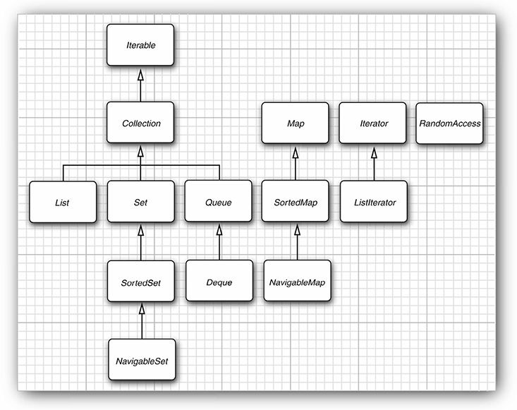
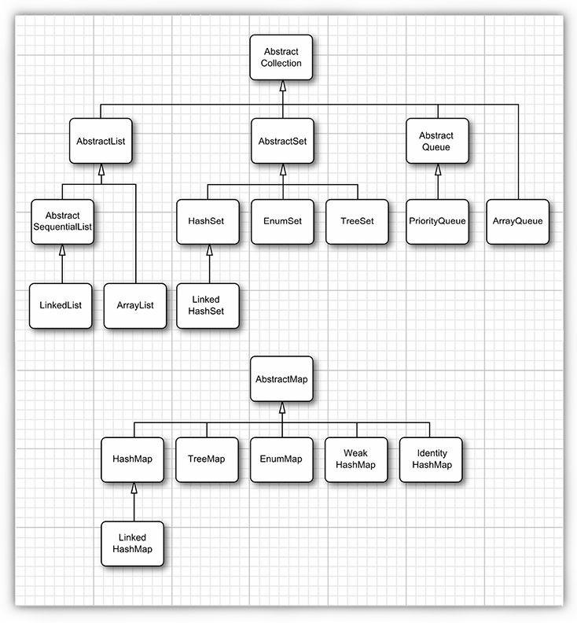
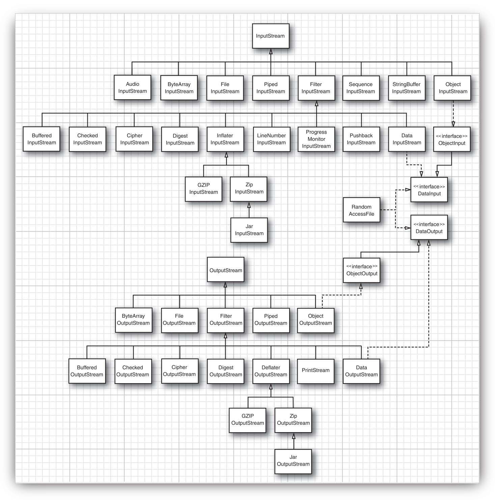
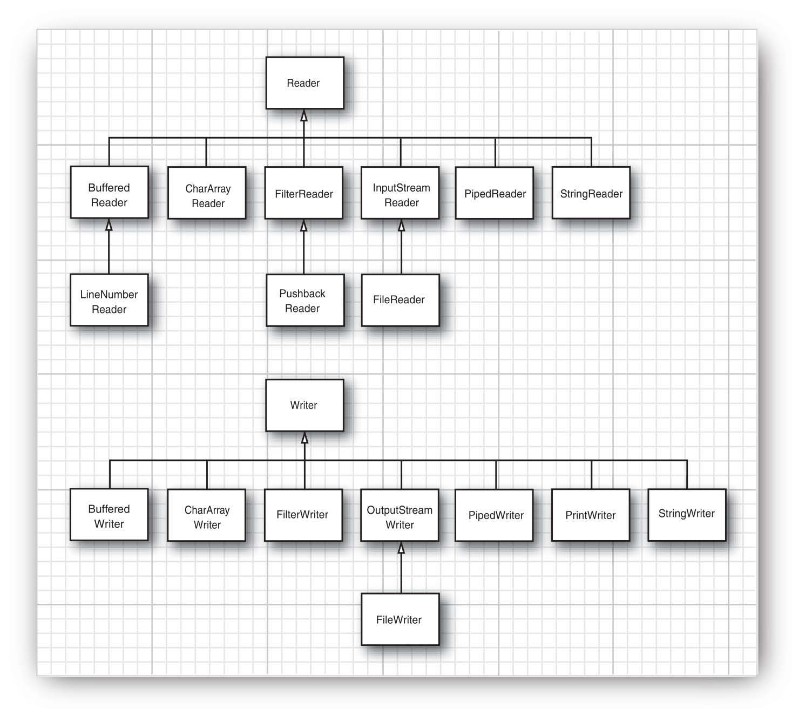
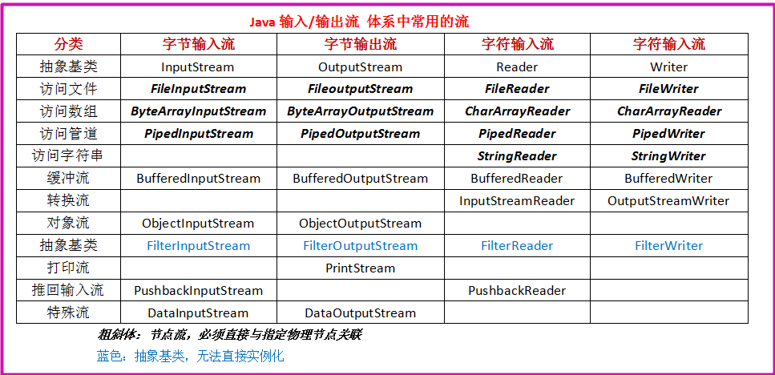
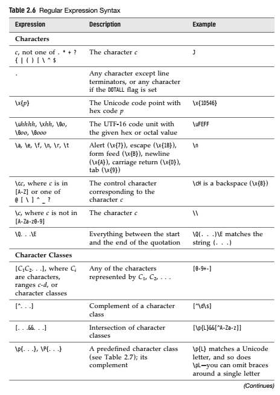
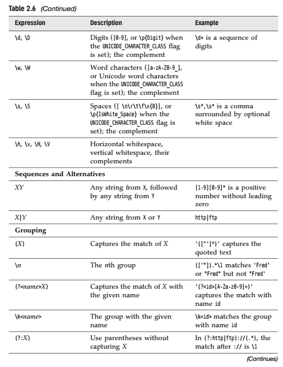
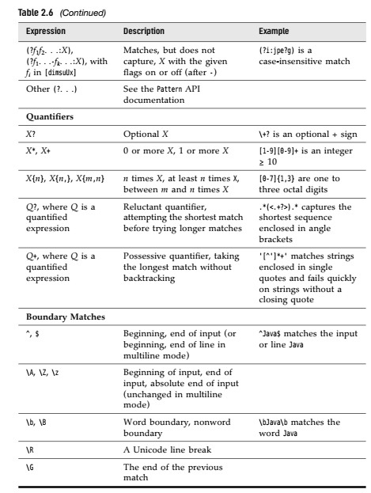
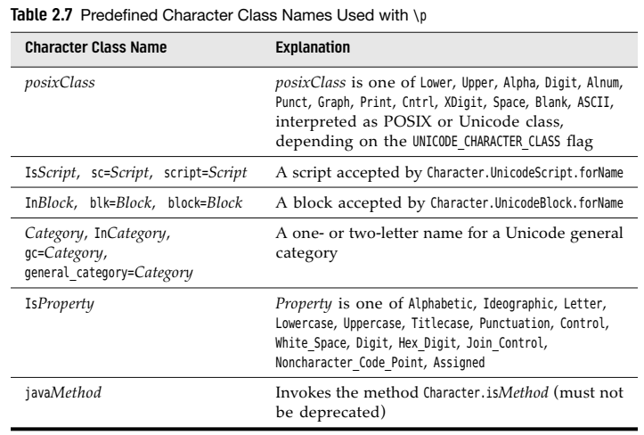
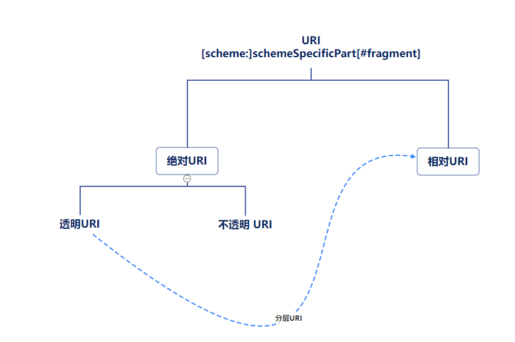

# 一些易忘知识点

#### 浮点数可以用十六进制表示

​		如：`0.125 = 2^-3` 可以表示成 `0x1.0p-3` ， 其中 p 表示指数，尾数用十六进制，指数用十进制表示，但是指数的基数是 **2**

#### 

#### 整型数值各进制表示法（2，8，16）

​	二进制： `0b` 或者 `0B` 开头

​	八进制： `0` 开头

​	十六进制：`0x`或 `0X`开头

#### 可以用 `\uxxxx`表示字符

​	”xxxx“ 用十六进制表示的 **UTF-16BE**（代码单元） ，如果超过了四位，则用两个四位表示

 	如： `\u000a` 表示 字符 `\n`

​			`\uD835\uDD46` 表示字符 `𝕆`（其 **Unicode码点** 为`U+1D546`）

#### 码点和代码单元

​	**码点（Code Point）** 表示 **Unicode 字符集编码**

​	**代码单元（Code Unit)** 表示 **java内部存储字符的一个基本单位**，也就是 **char 类型 2bytes** 的大小

 	在java 中，char 类型描述了 **UTF-16** 编码中的一个代码单元。

​	也就是说，java字符串在内存中是以 **UTF-16** 编码来存储的

​	 `'你'` 像这样一个字符，如果把它赋值给 `int` ，那么该 `int` 的值为 `'你'` 这个字符的码点

​	`int i = '你';`  `i` 的值为 20320 

#### 

#### printf 转换符

`%o` 八进制整数

`%e` 指数浮点数：`1.59e+01`

`%a` 十六进制浮点数：`0x1.fccdp3`

`%b` 布尔表达式：`true`

`%h` 散列码

`%%` 百分号

`%n` 和平台有关的换行符

#### printf 标志

`+` 打印正负数的符号 ： `+333.33`

` ` (空格)  在正数前添加空格

`0` 数字前面补0

`(` 把负数括在括号内： `"%(d",-1` 输出为 `(1)`

`,` 添加分组分隔符

`#` 对于 十六进制或八进制整数，添加其前缀：`"%#x",0xffff` 输出 `0xffff`

`$`  格式化的参数的索引 ：  `printf("%2$d,%2$x",1,15)`  输出 `15,f`

`<` 格式化前面说明的字符 ： `printf("%d %<x",15)` 输出 `15 f`


#### 二维数组使用 for-each 遍历

```java
for(double[] row : a)
	for(double value : row)
		System.out.print(value);
```

#### 多维数组可以使用 `Arrays.deepToString(arr)` 遍历

#### java中实际上没有多维数组，多维数组 被解释为”数组的数组“

​	假如 balances 是一个二维数组， 即：`int[][] balances`

​	那么 balances[0] 就表示一个一维数组的引用


#### 一个源文件中，只能有一个 public 类，并且此类的类名应与源文件名前缀一致。但是可以有任意数目的非公有类。每个类都可以有一个 main 方法，可以独立运行（单元测试），只需要在命令行输入 `java ClassName` 就行。 


#### 不要编写返回 可变对象引用 的访问器方法

​	例如：

​	 `public Date getHireDay(){return hireDay;}` 这种就不行，因为该函数的调用者可能会修改该 Date 对象。如果需要返回一个可变对象的引用，应该返回它的克隆：

​	 `public Date getHireDay(){return (Date)hireDay.clone();}`


#### final 修饰非基本数据类型

  `final StringBuilder sb = new StringBuilder();`  只是说明 sb 只能引用最开始赋值的对象，也就是说，相当于sb这个引用的值不可变，但是它引用的对象的内容可以改变。

  `sb = new StringBuilder();` 这样是不行的

  `sb.append("hh");` 这样可以

#### 

#### static

​	如果把域用 **static** 修饰，则表示这个域在这个类中只有一个，即 所有对象都共享这个域，它属于这个类，而不属于任何独立的对象

​	如果把一个方法用 **static** 修饰，那么该方法只能使用 **静态域** ，不能访问类的非静态域


#### 重载（overloading）

 	多个方法，有 **相同的名字，不同的参数（顺序，数量或者类型不同）**

​	 两个方法有 **相同的名字，参数数量相同，参数的类型也一致，但是参数顺序不同** 也叫重载：

​		

```java
int f(int a,double b){return a;}
int f(double a, int b){return (int)a ;}
```

​	 

​	但是 **相同的名字，相同的参数，不同的返回值** 不叫重载

​	**不能有两个名字相同，参数类型也相同，但返回值类型不同的**方法

​	

#### 域 如果没有主动赋初值，那么会自动初始化为默认值（0，0.0，null，false），也就是说不赋初值也可以使用该变量（域），但是方法中的局部变量如果没有赋初值，是不会自动初始化的，所以不能直接使用局部变量


#### 如果编写一个类时没有编写构造方法，系统会自动生成一个无参构造方法，它会把所有的实力域设置为默认值。如果类中提供了至少一个构造方法，但是没有提供无参构造方法，这时系统不会自动生成一个无参构造方法。

​	**仅当类没有提供任何构造方法时，系统才会自动生成一个默认的构造方法！**


#### 初始化块

```java
public class Main {
    static int i;
    static int j;
	
    //这就是一个初始化块，它只会在构造方法被调用的时候运行
    {
        i = 100;
    }
	
    
    //这是一个静态初始化块，它在类第一次加载的时候就会运行
    static {
        j = 100;
    }

    public static void main(String[] args) throws Exception {
		System.out.println(i);	//0
        System.out.println(j);	//100
        Main m = new Main();
        System.out.println(i);	//100
        System.out.println(j);	//100
    }
}
```


#### 静态导入(`import static`)

​	它可以导入静态方法和静态域

​	`import static java.lang.Math.*;`

​	那么可以直接用 `sqrt(n)`  或者 `PI`

​	

#### 关于继承的几个问题

1.父类中的 私有域和私有方法，虽然子类会继承下来，但是在子类中无法访问。

2.如果子类的构造方法需要用 **super** 调用父类的构造方法，则这个 **super** 语句必须作为子类的构造方法中的**第一条语句**。

3.如果子类的构造方法没有 **显式地** 调用父类的构造方法，系统会自动地调用（添加）父类的无参构造方法。如果父类没有无参构造方法，子类的构造方法中也没有显式地调用父类的任何构造方法，那么Java编译器会报错。

4.关于多态：

```java
public class Son extends Father {
    //子类重写父类的方法
    @Override
    public void f(){
        System.out.println("Main");
    }

    //子类新添加的方法
    public void m(){
        System.out.println("function m");
    }

    public static void main(String[] args) {
        Father fa = new Son();		
        fa.f();		//输出 Main
        // fa.m();      //这条语句会报错，因为 方法m 是在子类中定义的，所以父类对象引用不可见
        Son ma = (Son) fa;
        ma.f();		//输出 Main
        ma.m();		//输出 function m
    }
}

class Father{
    public void f(){
        System.out.println("Father");
    }
}
```

 	上述代码说明，如果把 子类对象 赋值给 父类对象的引用（`Father fa = new Son()`），那么 `fa`

只能调用在父类（`Father`）中定义的方法，而看不见子类新增加的方法。

​	 假如子类重写了父类中的方法，那么父类对象引用（`fa`)  调用这个重写的方法 （`m()`），则会按照这个对象引用实际所指的对象的方法来执行 。

5.

```java
public class Son extends Father {
    public static void main(String[] args) {
        Son[] sons = new Son[10];		//①
        Father[] fas1 = new Son[10];	//① 子类数组对象 赋值给 父类数组对象引用
        Father[] fas2 = sons;			//① 子类数组对象引用 赋值给 父类数组对象引用
        fas1[0] = new Father();			//可以通过编译，但是运行引发 ArrayStoreException 异常
    }
}

class Father{
}

```

​	①在Java中，子类数组（该数组的对象或者数组对象的引用）可以直接赋值给父类数组的引用，且不需要强制类型转换。

6.重写(override) 与 重载（overload）

​	如果在子类中定义了一个与超类签名相同——方法名相同，方法的参数列表（参数的数量，顺序，类型）也相同的方法，那么子类中这个方法就 **覆盖（重写）override** 了父类中的这个相同签名的方法。

​	但是，返回类型不是签名的一部分：


```java
public class Son extends Father {
    //这个叫做重载，因为签名不同（参数类型顺序不匹配），方法名相同
    public int f(double a,int b){
        return 2;
    }

    //这个叫做重写，方法签名完全相同
    @Override
    public int f(int a, double b){
        return 3;
    }

    /*
    //会报错，因为这个方法跟上面的方法签名相同（返回值类型不属于方法签名）,所以它既不属于重载也不属于重写
    public double f(int a, double b){
        return 3.0;
    }
    */
}

class Father{
    public int f(int a,double b){
        return 1;
    }
}
```


但是，有种特殊的情况：**允许子类把重写方法的返回类型定义为原返回类型的子类型** ：

```java
public class Son extends Father {
    //会报错，这个方法跟父类方法签名相同,但是返回值不兼容，所以编译器判定方法冲突
    public double f(int a, double b){
        return 3.0;
    }
    
    //这个也相当于重写，因为重写后的返回值类型为原来返回类型的子类
    @Override
    public Son foo(){
        return new Son();
    }
}

class Father{
    public int f(int a,double b){
        return 1;
    }
    
    public Father foo(){
        return new Father();
    }
}
```

​	**在覆盖一个方法的时候，子类方法不能低于父类方法的可见性**


#### **final** 关键字

​	**final**修饰域，那么该域的值一旦初始化后，就无法改变

​	**final**修饰方法，那么该方法无法被重写

​	**final** 修饰类，那么类无法被继承。其中方法自动成为 **final** ，而不包括域


#### 抽象类

抽象类中可以有具体方法和具体数据，但是只要有一个抽象方法，这个类就必须声明为 **abstract**。

```java
abstract class Abs{
    int i;
    abstract void f1();
    int f2(){
        return 1;
    }
}
```


#### **protected** 关键字

​	总的来说，被 **protected** 修饰的方法或者域：

##### 	1.同包中的其他类是可见的

##### 	2.同包中的子类是可见的

##### 	3.不同包中的其他类，不可见

##### 	4.若子类与父类不在同一包中，那么在子类中，子类对象可以访问其从父类继承而来的protected成员，但是通过父类对象无法访问其父类的protected成员, 其他子类的对象中的 protected成员也对这个子类不可见（例如clone()方法，只能在自己这个类中使用，看不见其他类的clone()方法）。

第一个包中的类：

​		**pack1.Father.java**:

```java
package pack1;

public class Father {
    protected String fatherString = "FatherS";
    protected void fatherFunc(){
        System.out.println("Father");
    }
}
```

​		**pack1.Son.java**

```java
package pack1;

public class Son extends Father{
    public static void main(String[] args) {
        //同包中的子类，可以通过子类对象访问其继承的 protected成员
        Son s = new Son();
        s.fatherFunc();
        System.out.println(s.fatherString);

        //同包中的子类，可以通过父类对象访问父类中的 protected成员
        Father father = new Father();
        father.fatherFunc();
        System.out.println(father.fatherString);
    }

    public void sonFunc(){
        //同包中的子类，可以访问其继承的 protected 成员
        fatherFunc();
        fatherString = "sonString";
        System.out.println("Son");
    }
}

```

​		**pack1.Test.java**:

```java
package pack1;

public class Test {
    public static void main(String[] args) {
        //同包中的其他类，可见
        Father f = new Father();
        f.fatherFunc();
        System.out.println(f.fatherString);

        //同包中的其他类，可以通过子类对象，访问其继承的父类的protected成员，也可以访问该子类自己的成员
        Son son = new Son();
        son.sonFunc();
        son.fatherFunc();
        System.out.println(son.fatherString);
    }
}

```


第二个包中的类：

​	**pack2.Daughter.java**

```java
package pack2;

import pack1.Father;
import pack1.Son;

public class Daughter extends Father {
    public void daughterFunc(){
        //不同包中的子类，可以访问其继承下来的 protected 成员
        fatherFunc();
        fatherString = "DaughterString";
        System.out.println("Daughter");
    }

    public static void main(String[] args) {
        Father f = new Father();
        // 不同包中的子类，无法通过其父类对象访问其父类的protected成员
        // f.fatherFunc();

        //不同包中的子类，可以通过该子类对象，访问其继承下来的protected 成员
        Daughter d = new Daughter();
        d.fatherFunc();
        d.fatherString = "daughter";
    }
}
```

​	**pack2.Main.java**

```java
package pack2;

import pack1.*;

public class Main{
    public static void main(String[] args) {
        Father f = new Father();
        // f.fatherFunc();      不同包的其他类，不可见

        Daughter d = new Daughter();
        //不同包中的其他类Main 通过与 类Main 在同一个包下的 类Daughter 的对象，也是无法访问 Daughter类 的父类的protected成员
        // d.fatherFunc();
    }
}
```


#### equals 方法编写

​	1.如果子类有自己独立的相等概念，则需要在子类中覆盖父类的equals方法，同时子类的equals方法要在其中包含调用 `super.equals(otherObject)`，并且父类一定要用getClass方法来检测。

​	2.如果由父类决定相等的概念，则用 `instanceof` 运算符 进行检测，并把这个equals方法声明为final，其子类就不用重写父类的equals 方法

​	一个完美equals 方法的模板：

```java
@Override
    public boolean equals(Object otherObject){  //显式参数一定要是Object类型，这样才能够覆盖掉Object类的equals方法
        if(otherObject == null)
            return false;
        if(this == otherObject)
            return true;

        //如果子类有独立的相等语义，则用getClass方法判断this和otherObject是否属于同一个类
        if(getClass() != otherObject.getClass())
            return false;
        //如果所有的子类和父类都有统一的相等语义，则用instanceof运算符检测
        if(!(otherObject instanceof ClassName))
            return false;
        
        //把otherObject转换为相应的类类型变量
        ClassName other = (ClassName)otherObject;
        
        //最后，对需要比较的域进行相等判断
        return field1 == other.field1               //如果是基本数据类型，则用 == 判断
                && Objects.equals(field2,otherObject.field2)    //如果是引用类型，则用 Objects.equals 方法进行判断
                && ...;
    }
```

#### hashCode方法

​	如果重新定义了equals方法，那么就必须重新定义hashCode方法！

​	如果 `x.equals(y) `返回 true，那么 `x.hashCode()` 需要等于 `y.hashCode()`

​	重写hashCode方法需要把 equals方法中参与相等判断的域都要计算hashCode：

```java
 public int hashCode(){
 	return Objects.hash(field1,field2...);
 }
```


#### 关于接口

1. 接口中所有方法自动地属于 **public** ，所以接口中声明的方法可以省略 **public**，但是在实现接口时，必须把方法声明为 **public**

2. 接口中不能含有 **实例域**，但是可以包含 **常量**，接口中所有的域自动被设置为： **public static final** 。

3. 接口中可以包含 **静态方法** 和 **默认方法**（用 `default` 关键字修饰）以及 **抽象方法**，方法自动被设置为：**public abstract**。

4. 对于 **Comparable** 接口：

   ​    如果子类之间的比较含义不一样，那么每个compareTo方法都应该在开始的时候进行下列检测：

   ​	`if(getClass() != other.getClass()) throw new ClassCastException;`

   

   ​	如果存在着一种通用的比较算法，对所有子类均可适用，那么可以在父类中提供这样一个compareTo 方法，并将其声明为 final。

   

5. 默认方法冲突

   如果一个接口定义了一个默认方法，然后在超类和另一个接口中也有一个同样的方法，这时就要解决冲突：

    超类优先：超类如果有一个具体方法和接口中的默认方法签名一致，则默认方法会被忽略。

    如果两个接口都有签名相同的默认方法，那么必须在具体类中覆盖这个方法。如果要选择这两个接口中的某个默认方法则须使用：

   ​	`ClassName.super.funcName()`

   ```java
   public class Test implements Person,Named{
       @Override
       public void f(){
           Person.super.f(); //
       }
   }
   
   interface Person{
       default void f(){
           System.out.print(1);
       }
   }
   
   interface Named{
       default void f(){
           System.out.println(2);
       }
   }
   ```

   ​	

#### Cloneable接口

   ​	它只是一个 **标记接口** ，不含有任何方法。如果在一个对象上调用clone，但是这个对象的类没有实现 **Cloneable** 接口，那么就会抛出一个 **CloneNotSupportedException**。

   ​	由于Object类中的 `clone()`方法为 `protected`, 所以，每个类只能在调用它自己的 `clone()`方法，看不见其他类的 `clone()` 方法，如果想让某个类的 `clone()`方法能被其他类调用，可以这样做：

   ```java
public class ClassName implements Cloneable{	//实现 Cloneable接口
   	//覆盖从 Object类 继承来的 clone()方法，并声明为 public
    @Override
    public ClassName clone() throws CloneNotSupportedException{
        ClassName cloned = (ClassName)(super.clone());
        cloned.mutableField = (Mutable)(mutableField.clone());	//如果克隆对象中有可变的实例域，这些实例域也要进行克隆！
        return cloned;
    }
}
   ```

   ​	 所有的数组类型都有一个 public 的 clone方法。所有可以用它来拷贝数组


#### 方法引用与lambda表达式

 1. `object::instanceMethod` 

 2. `Class::staticMethod`

    这两种都等价于 提供方法参数的 lambda表达式，例如

    `System.out::println`  等价于 `x->System.out.println(x)`

    `Math::pow` 等价于 `(x,y)->Math.pow(x,y)`

 3. `Class::instanceMethod`

    这种情况，第一个参数会成为调用该方法的对象，例如

    `String::compareTo` 等价于 `(x,y)->x.compareTo(y)`

    

 4. 可以在方法引用中使用 `this` 和 `super` 参数：

    `this::equals` 等价于 `x->this.equals(x)`

5. 构造器引用

   `Person::new`根据上下文来选择使用哪个构造器

   `int[]::new ` 等价于 `x->new int[x]`


#### lambda表达式中捕获的变量必须是 最终变量（它被初始化后，不会改变值）

​	如果lambda表达式中有自由变量的值在外部可能改变，那么就是非法的：

```java
 for(int i = 0; i < 10 ; i++){
 	 ActionListener l = event -> {
 		System.out.println(i); //非法，因为 i 可变
 	}
 }

```

​	

#### 在lambda表达式中声明与一个局部变量同名的参数或者局部变量是非法的

#### 

#### 内部类创建对象

```java
public class Outer {
    private int outerI = 1;

    public class Inner{
        public Inner(){
            System.out.print(Outer.this.outerI);	//外部类的引用为： Outer.this
        }
    }
}

public class Main{
    public static void main(String[] args){
        Outer outer = new Outer();		//先创建外部类对象
        Outer.Inner iner = outer.new Inner();	//再创建内部类对象
    }
}
```

​    

#### 内部类中声明的所有静态域都必须为final。静态内部类可以有静态域和静态方法。声明在接口中的内部类自动成为 static 和 public

​    

#### 在静态方法中无法调用getClass()（它不是静态方法），如果仍然想要在静态方法中获取Class对象，可以这么做：

​	`new Object(){}.getClass().getEnclosingClass()`

​	`new Object(){}` 会创建一个Object的匿名子类的匿名对象，然后通过 `getEnclosingClass()`获取其外部类，也就是这个静态方法所在的类


#### 如果方法中可能抛出受查异常（checked exception），需要在方法签名后面添加 `throws` 语句，但是不应该声明非受查异常（unchecked exception）。

`非受查异常`指的是java.lang.RuntimeException和java.lang.Error类及其子类，不需要调用者显示捕获。

所有其他的异常类都称为`受查异常`，需要调用者显示通过try-catch捕获的异常。

 

####  当 finally 子句中包含 return语句时，如果try 语句块也有return 语句，那么finally子句中的返回值会覆盖掉 try语句块中的 返回值。

 


​    

#### 关于泛型的一些约束

**注意：**

`Pair<T>` 指的是 **generic type(泛型类型)**

`T` 指的是  **type variable(类型变量)** 或者 **type parameter(类型参数）**

`Pair<String>`指的是  **parameterized type(参数化类型)**

`Pair<String>`里的 `String` 指的是 **type argument（也翻译成类型参数）**

`Pair<T>` 中的 `Pair`类型指的是 **类型擦除** 后的 **raw type(原生类型)** 

`Pair<? extends Employee>`  指的是 **wildcard type(通配符类型)**


**parameter**是指函数定义中**形参**，而**argument**指的是函数调用时的**实参**。

在不很严格的情况下，现在二者可以混用，一般用argument，而parameter则比较少用。


##### 1.**不能用基本类型实例化类型参数**

*Type Parameters Cannot Be Instantiated with Primitive Types* 

例如：`Pair<int>`


##### 2.**运行时类型查询只适用于原生类型**

*Runtime Type Inquiry Only Works with Raw Types*  

虚拟机中的对象总有一个特定的非泛型类型，所有类型查询只产生于原始类型（类型擦除后的类型）

例如：

`a instanceof Pair<String>` 会得到一个编译错误

`Pair<String> p = (Pair<String>) a`会得到一个警告

`getClass`方法也总是返回原始类型: `Pair<String> s` ，`Pair<Employee> e`，`e.getClass() == s.getClass()` 会返回 `true`。它们都返回 Pair.class。


##### 3.不能创建参数化类型的数组

*You Cannot Create Arrays of Parameterized Types*  

例如：`Pair<String>[] table = new Pair<String>[10]` 是非法的

但是可以声明 `Pair<String>[] table` 这个变量，只是不能初始化

可以使用通配符 `?` 并进行强制类型转换 ： `Pair<String>[] ps = (Pair<String>[])new Pair<?>[10];` 或者 `Pair<String>[] ps = new Pair[10];`但是这样不安全。

**如果需要收集泛型类的对象，只有一种安全而有效的方法——使用 ArrayList ： ArrayList<Pair<Sring>>**


##### 4.不能实例化类型变量

*You Cannot Instantiate Type Variables*

诸如： `new T(..)`、 `new T[]`、`T.class` 这样的表达式都是非法的


##### 5.不能构造泛型数组

*You Cannot Construct a Generic Array*  

例如：`T[] a = new T[10]` 这就是非法的

 但是，如果数组仅仅作为一个类的私有实例域，那么可以把这个数组声明为 **Object[]** ，并进行类型转换：

`T[] a =(T[]) new Object[10] `，这样编译可以通过，但是后面可能会出现类型转换的问题。

所以，如果方法需要返回泛型参数数组，最好是让用户提供一个数组构造器：

```java
public <T extends Comparable> T[] function(IntFunction<T[]> constr,T... a) {
        T[] arr = constr.apply(a.length);
       }

用户这样调用：
    String[] sarr = function(String[]::new,param1,param2...)
```

比较老式的方法就是使用反射， `java.util.reflect.Array.newInstance`


##### 6.不能在静态域或静态方法中使用类型变量。

*Type Variables Are Not Valid in Static Contexts of Generic Classes*  

例如：

```
public class ClassName<T>{
	private static T var;
	public static T staticFunc(){
		return...
	}
}
```

  上述是非法的；

 但是这样却可以：

```
public class ClassName{
	//这表示是一个返回泛型参数类型的方法。
	public static <T> T staticFunc(){
		return...
	}
}
```


#### Iterator接口中 在调用remove方法前一定要调用next方法，不然会抛出一个 IllegealStateException。


####    Java集合库中的接口



#### Java集合库中的具体类




#### Queue接口中的 `add,remove,element` 这三个方法为一组，他们会在队列空或者满的时候抛出异常。  `offer,poll,peek` 又是一组，他们与前者功能相同，但是不会抛出异常。


#### 集合视图

​	像 `Arrays.asList(T[] a)` 这种方法，会返回一个集合，这种集合并不是创建了一个新的集合，而是创建了一个 **视图**，在这个视图上进行操作会影响到原来的数据；

​	例如：

```java
 Integer[] a = {1,2,3,4,5};
 List<Integer> list = Arrays.asList(a);

 list.set(2,5);
 for (int i : a) {
 	System.out.println(i);	//会输出 1 2 5 4 5
 }
```

  在 **视图** 上进行操作，会影响到视图所映射的集合。


#### synchronized关键字

​	Java中每个对象都有一个内部锁。那么下面的代码是等价的：

​	public **synchronized** void method(){...} 

​	等同于

```java
public void method{

		**this.intrinsicLock.lock();**

		try{
			...
		}
        finally{**this.intrinsicLock.unlock();**}

}
```

​	内部锁只有一个相关条件变量。

​	`wait()` 等价于 `intrinsicCondition.await()`

​	`notifyAll()` 等价于 `intrinsicCondition.signalAll()`

​	如果是静态方法声明为 `synchronized` ，那么该方法获得 相关类的内部所


#### volatile 关键字

​	`volatile` 为实例域的同步访问提供了一种免锁机制。

​	

​	一旦一个共享变量（类的成员变量、类的静态成员变量）被volatile修饰之后，那么就具备了两层语义：

​		1)  保证了不同线程对这个变量进行操作时的可见性，即一个线程修改了某个变量的值，这新值对其他线程来说是立即可见的。

​			具体原理如下：

​			第一：使用volatile关键字会强制将修改的值立即写入主存；

　　	第二：使用volatile关键字的话，当线程2进行修改时，会导致线程1的工作内存中缓存变量stop的缓存行无效（反映到硬件层的话，就是CPU的L1或者L2缓存中对应的缓存行无效）；

　　	第三：由于线程1的工作内存中缓存变量stop的缓存行无效，所以线程1再次读取变量stop的值时会去主存读取。


　　2）禁止进行指令重排序。

​			volatile关键字禁止指令重排序有两层意思：

　　	第一：当程序执行到volatile变量的读操作或者写操作时，在其前面的操作的更改肯定全部已经进行，且结果已经对后面的操作可见；在其后面的操作肯定还没有进行；

　　	第二：在进行指令优化时，不能将在对volatile变量访问的语句放在其后面执行，也不能把volatile变量后面的语句放到其前面执行。

​			举个简单的例子：

```
//x、y为非volatile变量
//flag为volatile变量
 
x = 2;        //语句1
y = 0;        //语句2
flag = true;  //语句3
x = 4;         //语句4
y = -1;       //语句5
```

 　		  由于flag变量为volatile变量，那么在进行指令重排序的过程的时候，不会将语句3放到语句1、语句2前面，也不会讲语句3放到语句4、语句5后面。但是要注意语句1和语句2的顺序、语句4和语句5的顺序是不作任何保证的。

　　		并且volatile关键字能保证，执行到语句3时，语句1和语句2必定是执行完毕了的，且语句1和语句2的执行结果对语句3、语句4、语句5是可见的。

　　		再看下面这个例子：

```
//线程1:
context = loadContext();   //语句1
inited = true;             //语句2
 
//线程2:
while(!inited ){
  sleep()
}
doSomethingwithconfig(context);
```

 　			语句2会在语句1之前执行，那么久可能导致context还没被初始化，而线程2中就使用未初始化的context去进行操作，导致程序出错。

　　		 这里如果用volatile关键字对inited变量进行修饰，就不会出现这种问题了，因为当执行到语句2时，必定能保证context已经初始化完毕。


​		但是，**volatile 无法提供原子性！** 

​		

#### 使用volatile关键字的场景

​	　synchronized关键字是防止多个线程同时执行一段代码，那么就会很影响程序执行效率，而volatile关键字在某些情况下性能要优于synchronized，但是要注意volatile关键字是无法替代synchronized关键字的，因为volatile关键字无法保证操作的原子性。通常来说，使用volatile必须具备以下2个条件：

　　1）对变量的写操作不依赖于当前值

　　2）该变量没有包含在具有其他变量的不变式中

常用的场景有两个：

**1.状态标记量**

​	使用volatile来修饰状态标记量，使得状态标记量对所有线程是实时可见的，从而保证所有线程都能实时获取到最新的状态标记量，进一步决定是否进行操作。

​	例如常见的促销活动“秒杀”，可以用volatile来修饰“是否售罄”字段，从而保证在并发下，能正确的处理商品是否售罄。

```java
volatile boolean flag = false;
while (!flag) {
    doSomething();
}
public void setFlag() {
    flag = true;
}
```

**2.双重检测机制实现单例**

​	普通的双重检测机制在极端情况，由于指令重排序会出现问题，通过使用volatile来修饰instance，禁止指令重排序，从而可以正确的实现单例。

```java
class Singleton{
    private volatile static Singleton instance = null;
     
    private Singleton() {
         
    }
     
    public static Singleton getInstance() {
        if(instance==null) {
            synchronized (Singleton.class) {
                if(instance==null)
                    instance = new Singleton();
            }
        }
        return instance;
    }
}
```


#### 阻塞队列各方法

**put（增） 和 take（删）**     会引起线程阻塞


**offer（增） 和 poll（删）**   会给出错误提示（offer 返回 false，poll返回 null）。


**add（增） 和 remove（删）** 会抛出异常。


**peek** 返回队首元素，不删除，错误提示为 null。

**element** 返回队首元素，不删除，会抛出异常。


#### 线程池

​	使用线程池的步骤：

 1. 调用 Executors 类中的静态方法：newCachedThreadPool 、 newFixedThreadPool ...

    ​	例如	`ExecutorService pool = Executors.newCachedThreadPool();`

    ​	这些静态方法返回的是一个 **ThreadPoolExecutor** 类的对象，这个类实现了 **ExecutorService** 接口

 2. 调用 submit 方法提交 Runnable或者 Callable 对象

    `Future<ReturnType> result = pool.submit(runnableObj or callableObj)`

    ​	 如果想要取消一个任务，必须要保存好 submit 方法返回的 Future 对象

 3. 当不需要提交任务时，调用shutdown方法关闭线程池

    `pool.shutdown()`

    

    

#### Java8流库

##### 流 与 集合的区别：

	1. 流 并不存储元素。
	2. 流 的操作不会修改其数据源
	3. 流 的操作是 **尽可能惰性执行的** 。也就是说，只有在需要的时候才会执行相关操作。

##### reduce方法中的操作应该是可结合的：

​	如果reduce方法有一项约简操作 **op** ，那么该方法就会产生 **v₁ op v₂ op v₃ op...**。**op** 操作应该是可结合的：

​	例如 **(x op y) op z** 等价于 **x op (y op z)**


#### 输入输出流

##### 输入输出流的层次结构

​		字节流：



​		字符流：



##### Java中的各种IO流的关系：

 	1. **InputStream** 与 **OutputStream** 是 **字节流IO抽象类**。
 	2. **Reader** 与 **Writer** 是 **字符流IO抽象类**
 	3. Java 中通常需要把更高一层的 IO流组装到底层的IO流之上，这样来添加额外的功能。例如为了从文件中读入数字：

```java
FileInputStream fin = new FileInputStream("file.dat");
DataInputStream din = new DataInputStream(fin);
int i = din.readInt();
```

Java通过这种组合IO流的方式，可以实现多种功能的灵活使用。

例如：

​	**BufferedInputStream** 类可以提供缓冲机制：于是可以这样：

```java
DataInputStream in = new DataInputStream(new BufferedInputStream(new FileInputStream("file.dat")));
int i = in.readInt();
```


​	**PushbackInputStream** 类可以预览输入的下一个字节，以确定是否是需要的值：	

```java
PushbackInputStream in = new PushbackInputStream(new BufferedInputStream(new FileInputStream("file.dat")));
int b = in.read();
if(b != 'x')
	in.unread(b);
```

​		

##### 常用文本文件输出

1. **PrintWriter** 是字符输出流，它具有与 System.out 类似的 print*方法

2. **FileWriter**

3. **BufferedWriter**

   ...

##### 常用文本文件输入

 1. 使用**Scanner**类：`Scanner in = new Scanner(new FileInputStream(file,charset))`

 2. 使用 **Files** 类的静态方法：

    1）**Files.readAllBytes**：`String content = new String(Files.readAllBytes(path),charset)` 

    2）**Files.readAllLines** ：`List<String> lines = Files.readAllLines(path,charset)`

    3）**Files.lines**：`Stream<String> lines = Files.lines(path,charset)`

 3. 使用 **Reader** 类


##### Java IO总结图：    



​		

##### 对象IO流（ObjectInput(Output)Stream）

 	1. 对象流输出中包含所有对象的类型以及数据域
 	2. 每个对象都有一个序列号
 	3. 相同对象的重复出现会被存储为这个对象的序列号的引用


#### Externalizable接口

​	Externalizable继承了Serializable，该接口中定义了两个抽象方法：writeExternal()与readExternal()。当使用Externalizable接口来进行序列化与反序列化的时候需要开发人员重写writeExternal()与readExternal()方法，也就是说自定义序列化机制。在读入实现Externalizable接口的类的对象时，会先调用该类无参构造器创建一个对象，然后调用readExternal方法。

​	**这个接口通常用来实现自定义序列化机制。** 另一种方法就是使用 **transient** 关键字修饰一些不需要序列化的域，然后提供一个专门的序列化对象的方法（比如 readObject（））


#### Java正则表达式语法





    



#### 正则表达式中的嵌套群组是按照前括号排序的。


#### URI格式

**[scheme:]schemeSpecificPart[#fragment]**  



​	

#### Duration 和 Period 区别

​	**Duration** 是指两个 **Instant**（时刻）的间隔，可以精确到纳秒。

​	**Period** 是指两个 **LocalDate**（日期）的间隔，以年，月，日为计量单位，表示两个日期相隔的年，月，日。


#### LocalTime 只描述小时及以下的时间。


#### Instant.now() 返回的是UTC的时刻，它可以加上ZoneId转化为ZonedDateTime：

```java
Instant instant = Instant.now();
ZonedDateTime localNow = ZonedDateTime.ofInstant(instant,ZoneId.of("Asia/Shanghai"));
```


#### 类加载器

​	每个Java程序至少拥有三个类加载器：

​	**1. 引导类加载器** ：加载**系统类**。也就是Java类库中的类。

​	**2. 扩展类加载器**： 从 **jre/lib/ext** 目录加载 **标准的扩展**。

​	**3. 系统类加载器**： 用于加载 **应用类**。也就是在 classpath 中或  jar/zip文件中 的类。


#### 对称密钥算法的使用：

```java
import javax.crypto.KeyGenerator;
import javax.crypto.Cipher;
import java.security.SecureRandom;
import java.security.Key;

try(InputStream in = new FileInputStream("plaintext.txt");
            OutputStream out = new FileOutputStream("ciphertext.txt")) {
            //获取对称密钥
            KeyGenerator keygen = KeyGenerator.getInstance("AES");
            keygen.init(new SecureRandom());
            Key key = keygen.generateKey();

            //保存密钥
            try(ObjectOutputStream keyOut = new ObjectOutputStream(new FileOutputStream("aes.key"))){
                keyOut.writeObject(key);
            }

            //如果是解密则把init中的mode改为Cipher.DECRYPT_MODE,其他代码不变，只不过明文和密文的角色互换
            Cipher cipher = Cipher.getInstance("AES");
            cipher.init(Cipher.ENCRYPT_MODE, key);       //指定模式与密钥
    
            int blockSize = cipher.getBlockSize();      //获取密码块大小，如果该加密算法不是分组加密算法，则返回0
            int outputSize = cipher.getOutputSize(blockSize);
            byte[] inBytes = new byte[blockSize];       //明文块存放的数组
            byte[] outBytes = new byte[outputSize];     //密文块存放的数组

            int inLength = 0;       //明文块的长度
            boolean more = true;
            while (more) {
                inLength = in.read(inBytes);
                if(inLength == blockSize){
                    int outLength =  cipher.update(inBytes,0,blockSize,outBytes);	//使用update方法对明文进行加密
                    out.write(outBytes,0,outLength);
                }

                else more = false;
            }

            if(inLength > 0)    outBytes = cipher.doFinal(inBytes,0,inLength);  //如果还有明文块，但是小于密码块的大小
            else outBytes = cipher.doFinal();    //明文刚好是密码块的整数倍

            out.write(outBytes);
        }catch (Exception e)
        {
            e.printStackTrace();
        }

```

还可以用更简单的 **CipherInputStream** 或者  **CipherOutputStream**  类来进行加密解密，详见api


#### 非对称密钥算法的使用：

如果是单纯的加密解密：

 `cipher.init(Cipher.ENCRYPT_MODE, key);`      这一部分的模式就是 ENCRYPT_MODE 或者DECRYPT_MODE 。

`Cipher.WRAP_MODE` 和 `Cipher.UNWRAP_MODE` 模式用于加密 **对称密钥**


**RSA** 加密：

```java
try(InputStream in = new FileInputStream("plaintext.txt");
    OutputStream out = new FileOutputStream("ciphertext.txt")) {
    final int KEYSIZE = 1024;       //密钥大小，bits

    //获取非对称密钥
    KeyPairGenerator pairgen = KeyPairGenerator.getInstance("RSA");
    pairgen.initialize(KEYSIZE,new SecureRandom());
    KeyPair keyPair = pairgen.generateKeyPair();
    Key pubKey = keyPair.getPublic();   //公钥
    Key priKey = keyPair.getPrivate();  //私钥

    //保存密钥
    try(ObjectOutputStream pubOut = new ObjectOutputStream(new FileOutputStream("pub.key"))){
        pubOut.writeObject(pubKey);
    }
    try(ObjectOutputStream priOut = new ObjectOutputStream(new FileOutputStream("pri.key"))){
        priOut.writeObject(priKey);
    }

    //如果是解密则把init中的mode改为Cipher.DECRYPT_MODE,并且密钥换成priKey，其他代码不变
    Cipher cipher = Cipher.getInstance("RSA");
    cipher.init(Cipher.ENCRYPT_MODE,pubKey);       //用公钥进行加密

    byte[] inBytes =  in.readAllBytes();        //获取明文
    byte[] outBytes = cipher.doFinal(inBytes);   //获取密文

    out.write(outBytes);
}catch (Exception e)
{
    e.printStackTrace();
}
```


下面的代码展示的是 用 **AES**加密明文， **RSA** 加密 **AES** 密钥（`WRAP_MODE`）：

```java
			//获取非对称密钥
            KeyPairGenerator pairgen = KeyPairGenerator.getInstance("RSA");
            pairgen.initialize(KEYSIZE,new SecureRandom());
            KeyPair keyPair = pairgen.generateKeyPair();
            Key pubKey = keyPair.getPublic();   //公钥
            Key priKey = keyPair.getPrivate();  //私钥

            //获取对称密钥
            KeyGenerator keygen = KeyGenerator.getInstance("AES");
            keygen.init(new SecureRandom());
            SecretKey secretKey = keygen.generateKey();

            //使用 WRAP_MODE
            Cipher cipher = Cipher.getInstance("RSA");
            cipher.init(Cipher.WRAP_MODE,pubKey);       //用公钥进行加密

            byte[] wrappedKey = cipher.wrap(secretKey); //用公钥加密后的对称密钥
            out.writeInt(wrappedKey.length);    //保存好对称密钥
            out.write(wrappedKey);


            cipher = Cipher.getInstance("AES"); //用对称密钥算法对明文进行加密
            cipher.init(Cipher.ENCRYPT_MODE,secretKey);


            /*
                然后用对称密钥加密明文，已省略。
             */
```

​	解密的话先从密文中获取加密后的对称密钥，然后使用 UNWRAP_MODE 和 私钥解密对称密钥

```java
Cipher cipher = Cipher.getInstance("RSA");
cipher.init(Cipher.UNWRAP_MODE,priKey);
Key secretKey = cipher.unwrap(wrappedKey,"AES",Cipher.SECRET_KEY);
//再使用这个对称密钥对密文进行解密
```


