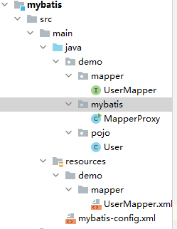

# Mybatis

## 核心配置文件

mybatis-config.xml

```xml
<?xml version="1.0" encoding="UTF-8" ?>
<!DOCTYPE configuration
        PUBLIC "-//mybatis.org//DTD Config 3.0//EN"
        "http://mybatis.org/dtd/mybatis-3-config.dtd">
<configuration>
    
    <typeAliases>
    	<!--name属性的值是实体类所在包 ,如果写了别名，那么在 xxxMapper.xml文件中的 resultType属性值，就不用写全名，直接写类名即可-->
    	<package name="demo.pojo"/> 
	</typeAliases>
    
     <!--
    environments：配置数据库连接环境信息。可以配置多个environment，通过default属性切换不同的environment
    -->
    <environments default="development">
        <environment id="development">
            <transactionManager type="JDBC"/>
            <dataSource type="POOLED">
                <!--数据库连接信息-->
                <property name="driver" value="com.mysql.cj.jdbc.Driver"/>
                <property name="url" value="jdbc:mysql://localhost:3306/mydb"/>
                <property name="username" value="root"/>
                <property name="password" value="5970"/>
            </dataSource>
        </environment>
        
    	 <!-- 测试环境 -->   
         <environment id="test">
            <transactionManager type="JDBC"/>
            <dataSource type="POOLED">
                <!--数据库连接信息-->
                <property name="driver" value="com.mysql.jdbc.Driver"/>
                <property name="url" value="jdbc:mysql:///mybatis?useSSL=false"/>
                <property name="username" value="root"/>
                <property name="password" value="1234"/>
            </dataSource>
        </environment>
    </environments>
    
    <!-- sql映射文件 -->
    <mappers>
        <mapper resource="demo.mapper.xxxMapper.xml"/>
        
        <!-- 包扫描模式，有这个就不用写上面的那种方式了。使用这种方式必须让映射文件和Mapper接口同名，并且放在同一包下！！ name属性指定的就是Mapper接口的包名 -->
        <package name="demo.mapper"/>
    </mappers>
</configuration>
```

## 映射文件

xxxMapper.xml:

```xml
<?xml version="1.0" encoding="UTF-8" ?>
<!DOCTYPE mapper
        PUBLIC "-//mybatis.org//DTD Mapper 3.0//EN"
        "http://mybatis.org/dtd/mybatis-3-mapper.dtd">
<!--namesapce 属性为xxxMapper接口的全名 -->
<mapper namespace="demo.mapper.xxxMapper"> 
    <!--id属性值必须与Mapper接口中的方法名相同。
 		resultType属性为pojo类的全名，如果在config配置文件中设置了别名，那么不用写全名，只需要写类名即可 -->
    <select id="selectAll" resultType="demo.pojo.User">
        select * from user_table;
    </select>
</mapper>
```

xxxMapper.java(接口)文件必须和xml文件同名，并且放在同一包下。

## 使用mybatis

```java
package demo.mybatis;

import demo.mapper.UserMapper;
import demo.pojo.User;
import org.apache.ibatis.io.Resources;
import org.apache.ibatis.session.SqlSession;
import org.apache.ibatis.session.SqlSessionFactory;
import org.apache.ibatis.session.SqlSessionFactoryBuilder;

import java.io.IOException;
import java.io.InputStream;
import java.util.List;

public class MapperProxy {
    public static void main(String[] args) throws IOException {
        //1.加载核心配置文件,并获取 SqlSessionFactory对象
        String configFile = "mybatis-config.xml";   //该文件放在 resources目录下的
        InputStream inputStream = Resources.getResourceAsStream(configFile);
        SqlSessionFactory sqlSessionFactory = new SqlSessionFactoryBuilder().build(inputStream);

        //2.获取 SqlSession对象
        SqlSession sqlSession = sqlSessionFactory.openSession();

        //3.执行sql, 使用 Mapper代理
        //获取 UserMapper接口的代理对象
        UserMapper userMapper =  sqlSession.getMapper(UserMapper.class);
        //通过 UserMapper接口来获取sql结果
        List<User> users = userMapper.selectAll();

        System.out.println(users);

        //4.释放资源
        sqlSession.close();

    }
}

```


## 项目结构



## Mapper文件标签

### sql标签

1.将需要复用的SQL片段抽取到 `sql` 标签中

```xml
<sql id="brand_column">
	id, brand_name as brandName, company_name as companyName, ordered, description, status
</sql>
```

2.在原sql语句中进行引用

使用 `include` 标签引用上述的 SQL 片段，而 `refid` 指定上述 SQL 片段的id值。

```xml
<select id="selectAll" resultType="brand">
    select
    <include refid="brand_column" />
    from tb_brand;
</select>
```


```xml
<sql id="userColumns"> ${alias}.id,${alias}.username,${alias}.password </sql>

<select id="selectUsers" resultType="map">
  select
    <include refid="userColumns"><property name="alias" value="t1"/></include>,
    <include refid="userColumns"><property name="alias" value="t2"/></include>
  from some_table t1
    cross join some_table t2
</select>
```


### resultMap标签

```xml
<mapper namespace="demo.mapper.BrandMapper">
    <!--    id属性指定为唯一的标识，type属性为实体类的名称（支持别名）-->
    <resultMap id="brandResultMap" type="demo.pojo.Brand">

        <!-- 这里可以指定两种标签
            id标签：完成主键字段的映射
            result标签：完成一般字段的映射
                column属性为数据库中字段的名称
                propperty属性为实体类的属性名
               -->
        <result column="brand_name" property="brandName"/>
        <result column="company_name" property="companyName"/>
    </resultMap>

    <!--这里需要把resultType属性改为resultMap属性，其值为前面resultMap标签的id属性-->
    <select id="selectAll" resultMap="brandResultMap">
        select *
        from tb_brand;
    </select>

</mapper>
```


### select标签

```xml
<select id="selectById" parameterType="int" resultMap="brandResultMap">
    select *
    from tb_brand where id = #{id};
</select>
```

常用属性：

| `id`              | 在命名空间中唯一的标识符，可以被用来引用这条语句。           |
| ----------------- | ------------------------------------------------------------ |
| **parameterType** | 设置参数的类全限定名或别名。这个属性是可选的                 |
| **resultType**    | 期望从这条语句中返回结果的类全限定名或别名。 注意，如果返回的是集合，那应该设置为集合包含的类型，而不是集合本身的类型。 **resultType 和 resultMap 之间只能同时使用一个。** |
| **resultMap**     | resultMap标签的id。                                          |


### insert、update、delete标签

insert:

```xml
<insert id="addOne" useGeneratedKeys="true" keyProperty="id">
        insert into tb_brand (brand_name, company_name, ordered, description, status)
        values (#{brandName}, #{companyName}, #{ordered}, #{description}, #{status});
</insert>
```

update:

```xml
<update id="updateAuthor">
  update Author set
    username = #{username},
    password = #{password},
    email = #{email},
    bio = #{bio}
  where id = #{id}
</update>
```

delete:

```xml
<delete id="deleteById">
    delete from tb_brand
    where id = #{id};
</delete>
```


常用属性：

| **id**               | 在命名空间中唯一的标识符，可以被用来引用这条语句。           |
| -------------------- | ------------------------------------------------------------ |
| **parameterType**    | 将会传入这条语句的参数的类全限定名或别名。这个属性是可选的   |
| **useGeneratedKeys** | **（仅适用于 insert 和 update）**是否获取自动生成的键值。默认值：false。 |
| **keyProperty**      | **（仅适用于 insert 和 update）**指定将获取到的键值封装到实体类中的哪个属性里。 |
| **keyColumn**        | **（仅适用于 insert 和 update）**设置生成键值在表中的列名，在某些数据库（像 PostgreSQL）中，当主键列不是表中的第一列的时候，是必须设置的。如果生成列不止一个，可以用逗号分隔多个属性名称。 |


## 动态sql

### if标签

```xml
<select id="selectByCondition" resultMap="brandResultMap">
    select *
    from tb_brand
    where
        <if test="status != null">
            status = #{status}
        </if>
        <if test="companyName != null and companyName != '' ">
            and company_name like #{companyName}
        </if>
        <if test="brandName != null and brandName != '' ">
            and brand_name like #{brandName}
        </if>
</select>
```

它表示，**如果 test属性里的表达式为真，那么 if 标签里的语句会原样被添加到sql语句中**


### where标签

```xml
<select id="selectByCondition" resultMap="brandResultMap">
        select *
        from tb_brand
        <where>
            <if test="status != null">
               status = #{status}
            </if>

            <if test="companyName != null and companyName != '' ">
               and company_name like #{companyName}
            </if>


            <if test="brandName != null and brandName != '' ">
                and brand_name like #{brandName}
            </if>
        </where>
</select>
```

作用：

* 替换where关键字
* 会动态地去掉第一个条件前的 `and` 或者 `or`
* 如果所有的子元素没有返回内容则不加where关键字


### choose（when，otherwise）标签

**choose标签** 类似于 Java中的switch关键字

**when标签** 类似于 Java中的case关键字 ，当它的 **test属性** 中的表达式值为真时，该标签中的语句会添加到sql语句中

**otherwise标签** 类似于Java中的default关键字

```xml
<select id="selectByConditionSingle" resultMap="brandResultMap">
        select *
        from tb_brand
        <where>
            <choose><!--相当于switch-->
                <when test="status != null"><!--相当于case-->
                    status = #{status}
                </when>

                <when test="companyName != null and companyName != '' "><!--相当于case-->
                    company_name like #{companyName}
                </when>

                <when test="brandName != null and brandName != ''"><!--相当于case-->
                    brand_name like #{brandName}
                </when>
            </choose>
        </where>
</select>
```


### set标签

*set* 标签可以用于动态包含需要更新的列，它可以自动删去末尾的 `，` ，并且在所有参数都为空的情况下，去掉 `set` 语句。 

```xml
<update id="update">
    update tb_brand
    <set>
        <if test="brandName != null and brandName != ''">
            brand_name = #{brandName},
        </if>
        <if test="companyName != null and companyName != ''">
            company_name = #{companyName},
        </if>
        <if test="ordered != null">
            ordered = #{ordered},
        </if>
        <if test="description != null and description != ''">
            description = #{description},
        </if>
        <if test="status != null">
            status = #{status}
        </if>
    </set>
    where id = #{id};
</update>
```


### foreach标签

它用来迭代任何可迭代的对象（如数组，集合）。

* **collection 属性**：
  - mybatis会将数组参数，封装为一个Map集合。这个Map的key默认名称为 array，值为参数数组，那么 **collection 属性** 的就应该为 **array**。

  - 也可以使用**@Param注解**改变Map集合的key默认的名称 ：例如`void deleteByIds(@Param("ids")int[] ids);` ,那么此时 **collection 属性**的值就应该为 **ids**。

  - 如果是参数是List集合，那么collection属性值默认为 **list**
  
* **item 属性**：本次迭代获取到的元素。应该和 **#{参数}** 里的参数名一致

* **separator 属性**：集合项迭代之间的分隔符。`foreach` 标签不会错误地添加多余的分隔符。也就是最后一次迭代不会加分隔符。

* **open 属性**：该属性值是在拼接SQL语句之前拼接的语句，只会拼接一次

* **close 属性**：该属性值是在拼接SQL语句拼接后拼接的语句，只会拼接一次

你可以将任何**可迭代对象（如 List、Set 等）**、**Map 对象**或者**数组对象**作为集合参数传递给 *foreach*。

eg:

```xml
<select id="selectByIds">
    select id, name, money
    from account
    <where>
        <foreach collection="array" item="id" open="id in (" close=")" separator=",">
            #{id}
        </foreach>
    </where>
</select>

Mappe接口这样写方法：
List<Account> selectByIds(int[] ids);
```

```xml
<insert id="addMulti" useGeneratedKeys="true" keyProperty="idD">
    insert into account(name,money)
    values
    <foreach collection="list" item="item" separator=",">
        <if test="item != null">
            (#{item.name},#{item.money})
        </if>
    </foreach>
</insert>

Mappe接口这样写方法：
Integer addMulti(List<Account> accounts);
```


## 多表查询

### 一对多

```xml
<mapper namespace="hhh.mapper.TeacherMapper">
    <!--多表查询 一个老师对应多名学生 -->
    <select id="selectAll" resultMap="teacherResultMap">
        SELECT t.id   t_id,
               t.name t_name,
               s.id   s_id,
               s.name s_name,
               s.tid  s_tid
        FROM t_teacher t
                 INNER JOIN t_student s ON t.id = s.tid
    </select>

    <resultMap id="teacherResultMap" type="hhh.entity.Teacher">
        <!--id 标签类似于result标签，只不过id元素对应的property会被标记为对象的标识符-->
        <id property="id" column="t_id"/>
        <result property="name" column="t_name"/>
        
        <!--一对多，如果对象属性为集合 使用collection标签 
			javaType属性指定集合的类型
            ofType属性指定集合的类型-->
        这里同样也可以使用resultMap属性复用一个已经写好的 resultMap
        <collection property="studentList" javaType="ArrayList" ofType="hhh.entity.Student">
            <id property="id" column="s_id"/>
            <result property="name" column="s_name"/>
            <result property="tid" column="s_tid"/>
        </collection>
    </resultMap>
</mapper>
```

### 多对一

```xml
<mapper namespace="hhh.mapper.StudentMapper">
    <!--多表查询-->
    <select id="selectAll" resultMap="studentResultMap">
        SELECT
            s.id s_id,
            s.name s_name,
            s.tid s_tid,
            t.id t_id,
            t.name t_name
        FROM t_student s INNER JOIN t_teacher t ON s.tid = t.id;
    </select>

    <resultMap id="studentResultMap" type="hhh.entity.Student">
        <!--id 标签类似于result标签，只不过id元素对应的property会被标记为对象的标识符-->
        <id property="id" column="s_id"/>
        <result property="name" column="s_name"/>
        <result property="tid" column="s_tid"/>

        <!--association 标签对应一对一关系，本例中指一个学生对应一个老师
            javaType 指定映射的结果类型
            property 指定外层对象的属性名 本例中指Student对象的属性名-->
        <association property="teacher" javaType="hhh.entity.Teacher">
            <!--association内部也是像前面一样书写映射关系-->
            <id property="id" column="t_id"/>
            <result property="name" column="t_name"/>
        </association>
    </resultMap>
</mapper>
```


## 参数传递

1. 使用 `@Param("参数名称")` 注解标记每一个参数，在映射配置文件中就需要使用 `#{参数名称}` 进行占位，并且两者名字一定要相同

   ```java
   List<Brand> selectByCondition(@Param("status") int status, @Param("companyName") String companyName,@Param("brandName") String brandName);
   ```

2. 将多个参数封装成一个 <u>实体对象</u> ，将该实体对象作为接口的方法参数。该方式要求在映射配置文件的SQL中使用 `#{名称}` 时，里面的 <u>名称</u> 必须和 <u>实体类属性名</u> 保持一致。

   ```java
   List<Brand> selectByCondition(Brand brand);
   ```

3. 将多个参数封装到 <u>map集合</u> 中，将map集合作为接口的方法参数。该方式要求在映射配置文件的SQL中使用 `#{名称}` 时，里面的 <u>名称</u> 必须和 map集合中<u>键</u>的名称一致。

   ```
   List<Brand> selectByCondition(Map map);
   ```

细节见详细文档


## MyBatis事务

在我们创建 **SqlSession 对象** 时：` SqlSession sqlSession = sqlSessionFactory.openSession();` 

**默认是 autocommit = false 的**，也就是说，如果我们需要添加数据，必须手动提交：`SqlSession.commit()`。

如果希望开启自动提交，那么可以使用 ： `SqlSession sqlSession = sqlSessionFactory.openSession(true);`


## 注解CRUD

Mybatis 针对 CRUD 操作都提供了对应的注解，已经做到见名知意。如下：

* 查询 ：**@Select**
* 添加 ：**@Insert**
* 修改 ：**@Update**
* 删除 ：**@Delete**

eg:

```java
/**
* 根据id查询单行数据
*/
@Select("select * from tb_brand where id=#{id}")
@ResultMap("brandResultMap")
Brand selectById(int id);
```


要在带注解的映射器接口类中使用动态 SQL，可以使用 *script* 元素。比如:

```java
    @Update({"<script>",
      "update Author",
      "  <set>",
      "    <if test='username != null'>username=#{username},</if>",
      "    <if test='password != null'>password=#{password},</if>",
      "    <if test='email != null'>email=#{email},</if>",
      "    <if test='bio != null'>bio=#{bio}</if>",
      "  </set>",
      "where id=#{id}",
      "</script>"})
    void updateAuthorValues(Author author);
```

