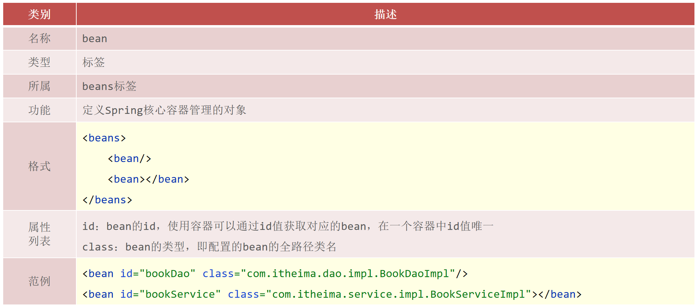
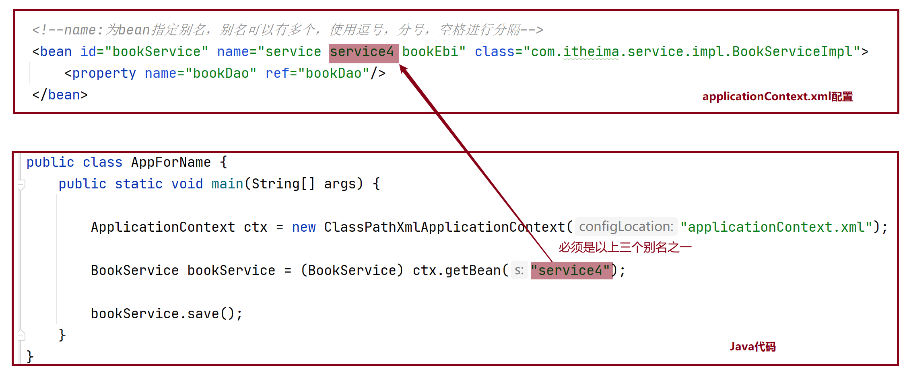
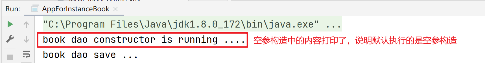
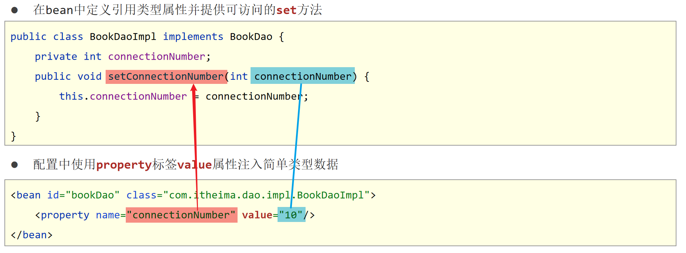
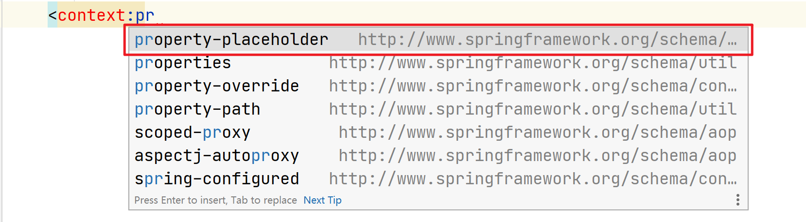
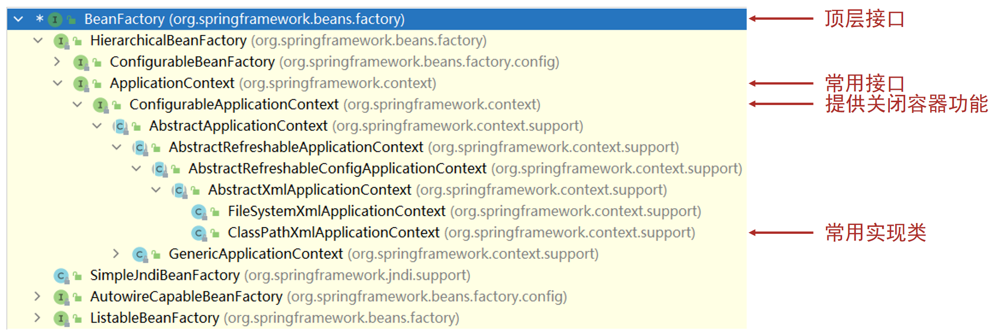
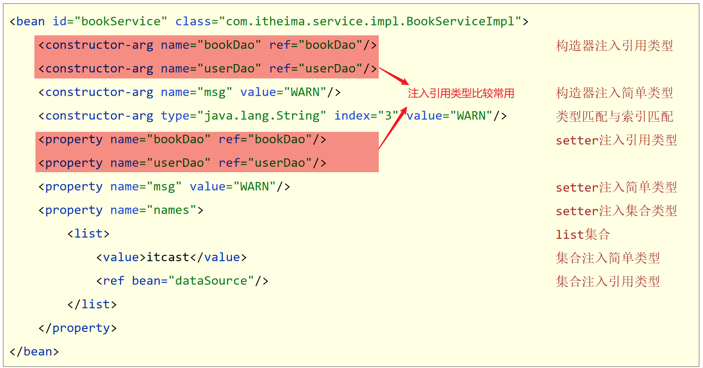

# 一、Spring简介

## 1. Spring Framework学习路线


## 2. Spring核心概念

如下代码存在的问题：


- 代码书写现状
  - 耦合度偏高
- 解决方案
  - 使用对象时，在程序中不要主动使用new产生对象，转换为由外部提供对象

 **Spring核心概念**

- **IOC（Inversion of Control）控制反转**

  使用对象时，由主动new产生对象转换为由**外部**提供对象，此过程中对象创建控制权由程序转移到外部，此思想称为控制反转。通俗的讲就是“**将new对象的权利交给Spring，我们从Spring中获取对象使用即**可”

- Spring技术对IoC思想进行了实现

  - Spring提供了一个容器，称为 **IOC容器**，用来充当IoC思想中的“外部”
  - IOC容器负责对象的创建、初始化等一系列工作，被创建或被管理的对象在IoC容器中统称为**Bean**

- **DI（Dependency Injection）依赖注入**
  
  - 在容器中建立bean与bean之间的依赖关系的整个过程，称为依赖注入。


- 目标：充分解耦
  - 使用IoC容器管理bean（IOC)
  - 在IoC容器内将有依赖关系的bean进行关系绑定（DI）
- 最终效果
  - 使用对象时不仅可以直接从IoC容器中获取，并且获取到的bean已经绑定了所有的依赖关系


# 二、IOC和DI入门案例【重点】

## 1 IOC入门案例【重点】

### 1.1 实现步骤

```
【第一步】导入Spring坐标
【第二步】定义Spring管理的类（接口）
【第三步】创建Spring配置文件，配置对应类作为Spring管理的bean对象
【第四步】初始化IOC容器（Spring核心容器/Spring容器），通过容器获取bean对象
```

### 1.2 实现代码

**【第一步】导入Spring坐标**

```xml
<dependencies>
    <!--导入spring的坐标spring-context，对应版本是5.2.10.RELEASE-->
    <dependency>
        <groupId>org.springframework</groupId>
        <artifactId>spring-context</artifactId>
        <version>5.2.10.RELEASE</version>
    </dependency>
</dependencies>
```

**【第二步】定义Spring管理的类（接口）**

- BookDao接口和BookDaoImpl实现类

```java
public interface BookDao {
    public void save();
}

public class BookDaoImpl implements BookDao {
    public void save() {
        System.out.println("book dao save ...");
    }
}
```

- BookService接口和BookServiceImpl实现类

```java
public interface BookService {
    public void save();
}

public class BookServiceImpl implements BookService {
    private BookDao bookDao = new BookDaoImpl();
    public void save() {
        System.out.println("book service save ...");
        bookDao.save();
    }
}
```

**【第三步】创建Spring配置文件，配置对应类作为Spring管理的bean对象**

- 定义**applicationContext.xml配置文件**并配置BookServiceImpl

```xml
<?xml version="1.0" encoding="UTF-8"?>
<beans xmlns="http://www.springframework.org/schema/beans"
       xmlns:xsi="http://www.w3.org/2001/XMLSchema-instance"
       xsi:schemaLocation="http://www.springframework.org/schema/beans http://www.springframework.org/schema/beans/spring-beans.xsd">
 
    <!--
		bean标签：表示配置bean
    	id属性：表示给bean起名字
    	class属性：指定bean的类型
	-->
    <bean id="bookService" class="com.itheima.service.impl.BookServiceImpl"></bean>

</beans>
```

**注意事项：bean定义时id属性在同一个上下文中(IOC容器中)不能重复**

**【第四步】初始化IOC容器（Spring核心容器/Spring容器），通过容器获取Bean对象**

```java
public class App {
    public static void main(String[] args) {
        //1.创建IoC容器对象，加载spring核心配置文件
        ApplicationContext ctx = new ClassPathXmlApplicationContext("applicationContext.xml");
        //2 从IOC容器中获取Bean对象(BookService对象)
        BookService bookService= (BookService)ctx.getBean("bookService");
        //3 调用Bean对象(BookService对象)的方法
        bookService.save();
    }
}
```


## 2 DI入门案例【重点】

### 2.1 实现步骤

```
【第一步】删除使用new的形式创建对象的代码
【第二步】提供依赖对象对应的setter方法
【第三步】配置service与dao之间的关系
```

### 2.2 实现代码

**【第一步】删除使用new的形式创建对象的代码**

```java
public class BookServiceImpl implements BookService {
    private BookDao bookDao;  //【第一步】删除使用new的形式创建对象的代码
    public void save() {
        System.out.println("book service save ...");
        bookDao.save();
    }
}
```

**【第二步】提供依赖对象对应的setter方法**

```java
public class BookServiceImpl implements BookService {
    private BookDao bookDao;
    public void save() {
        System.out.println("book service save ...");
        bookDao.save();
    }
    //【第二步】提供依赖对象对应的setter方法
    public void setBookDao(BookDao bookDao) {
        this.bookDao = bookDao;
    }
}
```

**【第三步】配置service与dao之间的关系**

> 在applicationContext.xml中配置

```xml
<?xml version="1.0" encoding="UTF-8"?>
<beans xmlns="http://www.springframework.org/schema/beans"
       xmlns:xsi="http://www.w3.org/2001/XMLSchema-instance"
       xsi:schemaLocation="http://www.springframework.org/schema/beans http://www.springframework.org/schema/beans/spring-beans.xsd">
    <!--
		bean标签：表示配置bean
    	id属性：表示给bean起名字
    	class属性：表示给bean定义类型
	-->
    <bean id="bookDao" class="com.itheima.dao.impl.BookDaoImpl"/>

    <bean id="bookService" class="com.itheima.service.impl.BookServiceImpl">
        <!--配置server与dao的关系
			property标签：表示配置当前bean的属性
        	name属性：表示配置哪一个具体的属性
        	ref属性：表示参照哪一个bean
		-->
        <property name="bookDao" ref="bookDao"/>
    </bean>
</beans>
```

### 2.3 图解演示


# 三、Bean的基础配置

## 1 Bean基础配置【重点】

### 配置说明



## 2 Bean别名配置

### 配置说明


**代码演示**



**打印结果**


## 3 Bean作用范围配置【重点】

### 配置说明


> 扩展：scope的取值不仅仅只有singleton和prototype，还有request、session、application、 websocket ，表示创建出的对象放置在web容器(tomcat)对应的位置。比如：request表示保存到request域中。

**代码演示**


**打印结果**


> 最后给大家说明一下：在我们的实际开发当中，绝大部分的Bean是单例的，也就是说绝大部分Bean不需要配置scope属性。


# 四、Bean的实例化

## 1 Bean是如何创建的【理解】

bean本质上就是对象，创建bean使用构造方法完成


## 2 实例化Bean的三种方式

### 2.1 构造方法方式【重点】

- BookDaoImpl实现类

```java
public class BookDaoImpl implements BookDao {
    public BookDaoImpl() {
        System.out.println("book dao constructor is running ....");
    }
    public void save() {
        System.out.println("book dao save ...");
    }
}
```

- applicationContext.xml配置

```xml
<!--方式一：构造方法实例化bean-->
<bean id="bookDao" class="com.itheima.dao.impl.BookDaoImpl"/>
```

- AppForInstanceBook测试类

```java
public class AppForInstanceBook {
    public static void main(String[] args) {
        ApplicationContext ctx = new ClassPathXmlApplicationContext("applicationContext.xml");

        BookDao bookDao = (BookDao) ctx.getBean("bookDao");

        bookDao.save();
    }
}
```

- 运行结果



==注意：无参构造方法如果不存在，将抛出异常`BeanCreationException`==

### 2.2 静态工厂方式

- OrderDao接口和OrderDaoImpl实现类

```java
public interface OrderDao {
    public void save();
}
public class OrderDaoImpl implements OrderDao {
    public void save() {
        System.out.println("order dao save ...");
    }
}
```

- OrderDaoFatory工厂类

```java
//静态工厂创建对象
public class OrderDaoFactory {
    public static OrderDao getOrderDao(){
        System.out.println("factory setup....");
        return new OrderDaoImpl();
    }
}
```

- applicationContext.xml配置

```xml
<!--方式二：使用静态工厂实例化bean-->
<bean id="orderDao" class="com.itheima.factory.OrderDaoFactory" factory-method="getOrderDao"/>
```


- AppForInstanceOrder测试类

```java
public class AppForInstanceOrder {
    public static void main(String[] args) {
        ApplicationContext ctx = new ClassPathXmlApplicationContext("applicationContext.xml");

        OrderDao orderDao = (OrderDao) ctx.getBean("orderDao");

        orderDao.save();
    }
}
```

- 运行结果


### 2.3 实例工厂方式

- UserDao接口和UserDaoImpl实现类

```java
public interface UserDao {
    public void save();
}
public class UserDaoImpl implements UserDao {
    public void save() {
        System.out.println("user dao save ...");
    }
}
```

- UserDaoFactory工厂类

```java
//实例工厂创建对象
public class UserDaoFactory {
    public UserDao getUserDao(){
        return new UserDaoImpl();
    }
}
```

- applicationContext.xml配置

```xml
<!--方式三：使用实例工厂实例化bean-->
<bean id="userFactory" class="com.itheima.factory.UserDaoFactory"/>

<bean id="userDao" factory-method="getUserDao" factory-bean="userFactory"/>
```


- AppForInstanceUser测试类

```java
public class AppForInstanceUser {
    public static void main(String[] args) {
        //        //创建实例工厂对象
        //        UserDaoFactory userDaoFactory = new UserDaoFactory();
        //        //通过实例工厂对象创建对象
        //        UserDao userDao = userDaoFactory.getUserDao();
        //        userDao.save();
        ApplicationContext ctx = new ClassPathXmlApplicationContext("applicationContext.xml");
        UserDao userDao = (UserDao) ctx.getBean("userDao");
        userDao.save();
    }
}
```

- 运行结果


### 2.4 实现FactoryBean\<T>方式【扩展,了解】

- 定义UserDaoFactoryBean实现FactoryBean\<UserDao>

> UserDaoFactoryBean中实例化什么类型的对象泛型就是该类型。

```java
//FactoryBean创建对象
public class UserDaoFactoryBean implements FactoryBean<UserDao> {
    //代替原始实例工厂中创建对象的方法
    public UserDao getObject() throws Exception {
        return new UserDaoImpl();
    }

    public Class<?> getObjectType() {
        return UserDao.class;
    }
}
```

- applicationContext.xml配置

```xml
<!--方式四：使用FactoryBean实例化bean-->
<bean id="userDao" class="com.itheima.factory.UserDaoFactoryBean"/>
```

> 使用之前的AppForInstanceUser测试类去运行看结果就行了。注意配置文件中id="userDao"是否重复。


# 五、Bean的生命周期【了解】

## 1 生命周期相关概念介绍

- 生命周期：从创建到消亡的完整过程
- bean生命周期：bean从创建到销毁的整体过程
- bean生命周期控制：在bean创建后到销毁前做一些事情


## 2 Bean生命周期控制

### 2.1 方式1

- 提供生命周期控制方法

```java
public class BookDaoImpl implements BookDao {
    public void save() {
        System.out.println("book dao save ...");
    }
    //表示bean初始化对应的操作
    public void init(){
        System.out.println("init...");
    }
    //表示bean销毁前对应的操作
    public void destory(){
        System.out.println("destory...");
    }
}
```

- applicationContext.xml配置

```xml
<!--init-method：设置bean初始化生命周期回调函数,此处填写init方法名-->
<!--destroy-method：设置bean销毁生命周期回调函数，仅适用于单例对象，此处填写destory方法名-->
<bean id="bookDao" class="com.itheima.dao.impl.BookDaoImpl" init-method="init" destroy-method="destory"/>
```

- 测试类

```java
public class AppForLifeCycle {
    public static void main( String[] args ) {
        //此处需要使用实现类类型，接口类型没有close方法
        ClassPathXmlApplicationContext ctx = new ClassPathXmlApplicationContext("applicationContext.xml");
        BookDao bookDao = (BookDao) ctx.getBean("bookDao");
        bookDao.save();
        //关闭容器，执行销毁的方法
        ctx.close();
    }
}
```

### 2.2 方式2

- 实现InitializingBean, DisposableBean接口

```java
public class UserDAO implements InitializingBean, DisposableBean {
    public void func(){
        System.out.println("UserDAO...");
    }

    //初始化方法
    @Override
    public void afterPropertiesSet() throws Exception {

    }

    //销毁方法
    @Override
    public void destroy() throws Exception {

    }
}
```


## 3 Bean销毁时机

- 容器关闭前触发bean的销毁
- 关闭容器方式：
  - 手工关闭容器
    `ConfigurableApplicationContext`接口`close()`操作
  - 注册关闭钩子，在虚拟机退出前先关闭容器再退出虚拟机
    `ConfigurableApplicationContext`接口`registerShutdownHook()`操作

```java
public class AppForLifeCycle {
    public static void main( String[] args ) {
        //此处需要使用实现类类型，接口类型没有close方法
        ClassPathXmlApplicationContext ctx = new ClassPathXmlApplicationContext("applicationContext.xml");

        BookDao bookDao = (BookDao) ctx.getBean("bookDao");
        bookDao.save();
        //注册关闭钩子函数，在虚拟机退出之前回调此函数，关闭容器
        ctx.registerShutdownHook();
        //关闭容器
        //ctx.close();
    }
}
```


# 六、依赖注入(DI配置)

## 1 依赖注入方式【重点】

### 1.1 依赖注入的两种方式

1. **setter注入**
    简单类型
    **引用类型(很常用)**
2. **构造器注入**
    简单类型
    引用类型

### 1.2 setter方法注入

##### 引用类型


##### 简单类型



### 1.3 构造方法注入

##### 引用类型


##### 简单类型


##### 参数适配【了解】


### 1.4 依赖注入方式选择

1. 强制依赖使用构造器进行，使用setter注入有概率不进行注入导致null对象出现
2. 可选依赖使用setter注入进行，灵活性强
3. Spring框架倡导使用构造器，第三方框架内部大多数采用构造器注入的形式进行数据初始化，相对严谨
4. 如果有必要可以两者同时使用，使用构造器注入完成强制依赖的注入，使用setter注入完成可选依赖的注入
5. 实际开发过程中还要根据实际情况分析，如果受控对象没有提供setter方法就必须使用构造器注入
6. **自己开发的模块推荐使用setter注入**


## 2 依赖自动装配【理解】

### 2.1 自动装配概念

- IoC容器根据bean所依赖的资源在容器中自动查找并注入到bean中的过程称为自动装配
- 自动装配方式
  **按类型（常用）**
  按名称
  按构造方法
  不启用自动装配

### 2.2 自动装配类型

##### 依赖自动装配

> 配置中使用bean标签autowire属性设置自动装配的类型

```xml
<bean id="bookDao" class="com.itheima.dao.impl.BookDaoImpl"/>
<bean id="bookService" class="com.itheima.service.impl.BookServiceImpl" autowire="byType"/>
```

##### 依赖自动装配特征

1. 自动装配用于引用类型依赖注入，不能对简单类型进行操作
2. 使用按类型装配时（byType）必须保障容器中相同类型的bean唯一，推荐使用
3. 使用按名称装配时（byName）必须保障容器中具有指定名称的bean，因变量名与配置耦合，不推荐使用
4. 自动装配优先级低于setter注入与构造器注入，同时出现时自动装配配置失效


## 3 集合注入

下面均省略了bean标签

#### 3.1 注入数组类型数据

```xml
<property name="array">
    <array>
        <value>100</value>
        <value>200</value>
        <value>300</value>
    </array>
</property>
```

#### 3.2 注入List类型数据

```xml
<property name="list">
    <list>
        <value>itcast</value>
        <value>itheima</value>
        <value>boxuegu</value>
        <value>chuanzhihui</value>
    </list>
</property>
```

#### 3.3 注入Set类型数据

```xml
<property name="set">
    <set>
        <value>itcast</value>
        <value>itheima</value>
        <value>boxuegu</value>
        <value>boxuegu</value>
    </set>
</property>
```

#### 3.4 注入Map类型数据

```xml
<property name="map">
    <map>
        <entry key="country" value="china"/>
        <entry key="province" value="henan"/>
        <entry key="city" value="kaifeng"/>
    </map>
</property>
```

#### 3.5 注入Properties类型数据

```xml
<property name="properties">
    <props>
        <prop key="country">china</prop>
        <prop key="province">henan</prop>
        <prop key="city">kaifeng</prop>
    </props>
</property>
```

> 说明：property标签表示setter方式注入，构造方式注入constructor-arg标签内部也可以写\<array>、\<list>、\<set>、\<map>、\<props>标签


# 七、第三方资源配置管理

> 说明：以管理DataSource连接池对象为例讲解第三方资源配置管理

## 1 管理DataSource连接池对象

### 1.1 管理Druid连接池【重点】

**数据库准备**

```sql
create database if not exists spring_db character set utf8;
use spring_db;
create table if not exists tbl_account(
    id int primary key auto_increment,
    name varchar(20),
    money double
);
insert into tbl_account values(null,'Tom',1000);
insert into tbl_account values(null,'Jerry',1000);
```

**【第一步】添加Druid连接池依赖**

```xml
<dependency>
    <groupId>com.alibaba</groupId>
    <artifactId>druid</artifactId>
    <version>1.1.16</version>
</dependency>
<dependency>
    <groupId>mysql</groupId>
    <artifactId>mysql-connector-java</artifactId>
    <version>5.1.47</version>
</dependency>
```

> 注意：除了添加以上两个依赖之外，别忘了添加spring-context依赖。

```xml
<dependency>
	<groupId>org.springframework</groupId>
	<artifactId>spring-context</artifactId>
	<version>5.3.18</version>
</dependency>
```

**【第二步】配置DruidDataSource连接池Bean对象**

```xml
<bean id="dataSource" class="com.alibaba.druid.pool.DruidDataSource">
    <property name="driverClassName" value="com.mysql.jdbc.Driver"/>
    // 8.0的mysql的驱动名叫 com.mysql.cj.jdbc.Driver
    <property name="url" value="jdbc:mysql://localhost:3306/spring_db"/>
    <property name="username" value="root"/>
    <property name="password" value="root"/>
</bean>
```

**【第三步】在测试类中从IOC容器中获取连接池对象并打印**

```java
public class App {
    public static void main(String[] args) {
        ApplicationContext ctx = new ClassPathXmlApplicationContext("applicationContext.xml");
        DataSource dataSource = (DataSource) ctx.getBean("dataSource");
        System.out.println(dataSource);
    }
}
```

### 1.2 管理c3p0连接池

**【第一步】添加c3p0连接池依赖**

```xml
<dependency>
    <groupId>c3p0</groupId>
    <artifactId>c3p0</artifactId>
    <version>0.9.1.2</version>
</dependency>
```

**【第二步】配置c3p0连接池Bean对象**

```xml
<bean id="dataSource" class="com.mchange.v2.c3p0.ComboPooledDataSource">
    <property name="driverClass" value="com.mysql.jdbc.Driver"/>
    <property name="jdbcUrl" value="jdbc:mysql://localhost:3306/spring_db"/>
    <property name="user" value="root"/>
    <property name="password" value="root"/>
    <property name="maxPoolSize" value="1000"/>
</bean>
```

> 注意：同一个Spring容器中不能有两个id="dataSource"的连接池。

**【第三步】在测试类中从IOC容器中获取连接池对象并打印**

```java
public class App {
    public static void main(String[] args) {
        ApplicationContext ctx = new ClassPathXmlApplicationContext("applicationContext.xml");
        DataSource dataSource = (DataSource) ctx.getBean("dataSource");
        System.out.println(dataSource);
    }
}
```


## 2 加载properties属性文件【重点】

> 目的：将数据库的连接参数抽取到一个单独的文件中，与Spring配置文件解耦。

### 2.1 基本用法

**【第一步】编写jdbc.properties属性文件**

```properties
jdbc.driver=com.mysql.jdbc.Driver
jdbc.url=jdbc:mysql://127.0.0.1:3306/spring_db
jdbc.username=root	##这里的用户名键如果写成 username，会出现问题，因为系统环境变量也有一个 键叫做 username，解决这个的办法可以在下面的context:property-placeholder标签中添加一个 system-properties-mode="NEVER"属性即可
jdbc.password=root
```

**【第二步】在applicationContext.xml中开启开启context命名空间，加载jdbc.properties属性文件**


**==小技巧：如果同学们觉得上述复制粘贴方式不好改或者容易改错，其实idea是有提示功能的，注意不要选错就行了。有些版本的idea没有这个提示，那么就按照上面复制粘贴的方式改，改完之后可以做成live template模板，后期直接用。==**



```xml
<context:property-placeholder location="classpath*:jdbc.properties"/>  一定要加上这个 classpath*
```


**【第三步】在配置连接池Bean的地方使用EL表达式获取jdbc.properties属性文件中的值**

```xml
<bean class="com.alibaba.druid.pool.DruidDataSource">
    <property name="driverClassName" value="${jdbc.driver}"/>
    <property name="url" value="${jdbc.url}"/>
    <property name="username" value="${jdbc.username}"/>
    <property name="password" value="${jdbc.password}"/>
</bean>
```

> 配置完成之后，运行之前的获取Druid连接池代码，可以获取到连接池对象就表示配置成功。


### 2.2 配置不加载系统属性

**问题**

如果属性文件中配置的不是jdbc.username，而是username=root666，那么使用${username}获取到的不是root666，而是计算机的名称。

**原因**

系统属性的优先级比我们属性文件中的高，替换了我们的username=root666。

**解决**

解决1：换一个名称，例如不叫username，叫jdbc.username。

解决2：使用system-properties-mode="NEVER"属性表示不使用系统属性。

```properties
<context:property-placeholder location="jdbc.properties" system-properties-mode="NEVER"/>
```


### 2.3 加载properties文件写法

- 不加载系统属性

```xml
<context:property-placeholder location="jdbc.properties" system-properties-mode="NEVER"/>
```

- 加载多个properties文件

```xml
<context:property-placeholder location="jdbc.properties,msg.properties"/>
```

- 加载所有properties文件

```xml
<context:property-placeholder location="*.properties"/>
```

- 加载properties文件**==标准格式==**

```xml
<context:property-placeholder location="classpath:*.properties"/>
```

- 加载properties文件标准格式

```xml
<context:property-placeholder location="classpath*:*.properties"/>
```

**classpath 和 classpath* 区别：**
classpath：只会到classpath中（比如web项目中的`WBE-INF/classes`）查找文件;
classpath*：如果classpath有多个，会到所有的classpath中进行查找。

在多个classpath中存在同名资源，都需要加载，那么用classpath:只会加载第一个，这种情况下也需要用classpath*:前缀

# 八、Spring容器

## 1 Spring核心容器介绍

### 1.1 创建容器

- 方式一：类路径加载配置文件

```java
ApplicationContext ctx = new ClassPathXmlApplicationContext("applicationContext.xml");
```

​	加载多个配置文件

```java
ApplicationContext ctx = new ClassPathXmlApplicationContext("bean1.xml", "bean2.xml");
```

- 方式二：文件路径加载配置文件

```java
ApplicationContext ctx = new FileSystemXmlApplicationContext("D:\\applicationContext.xml");
```

- 方式三：基于注解的配置类方式

```java
ApplicationContext ctx = new AnnotationConfigApplicationContext(SpringConfig.class);
```


### 1.2 获取bean对象

- 方式一：使用bean名称获取

> 弊端：需要自己强制类型转换

```java
BookDao bookDao = (BookDao) ctx.getBean("bookDao");
```

- **方式二：使用bean名称获取并指定类型**

> 推荐使用

```java
BookDao bookDao = ctx.getBean("bookDao", BookDao.class);
```

- 方式三：使用bean类型获取

> 弊端：如果IOC容器中同类型的Bean对象有多个，此处获取会报错

```java
BookDao bookDao = ctx.getBean(BookDao.class);
```

### 1.3 容器类层次结构



### 1.4 BeanFactory

已经过时了，了解即可

- 类路径加载配置文件

```java
Resource resources = new ClassPathResource("applicationContext.xml");
BeanFactory bf = new XmlBeanFactory(resources);
BookDao bookDao = bf.getBean("bookDao", BookDao.class);
bookDao.save();
```

- BeanFactory创建完毕后，所有的Bean均为**延迟加载**，也就是说我们调用getBean()方法获取Bean对象时才创建Bean对象并返回给我们。

  而 ApplicationContext 在读取配置文件时就会创建对象。


## 2 Spring核心容器总结

### 2.1 容器相关

- BeanFactory是IoC容器的顶层接口，初始化BeanFactory对象时，加载的bean延迟加载
- ApplicationContext接口是Spring容器的核心接口，初始化时bean立即加载
- ApplicationContext接口提供基础的bean操作相关方法，通过其他接口扩展其功能
- ApplicationContext接口常用初始化类
  - **==ClassPathXmlApplicationContext(常用)==**
  - FileSystemXmlApplicationContext

### 2.2 bean相关


### 2.3 依赖注入相关



