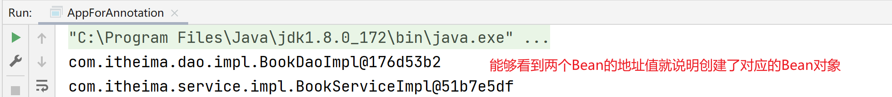

## 一、Spring注解开发

### 1 注解开发定义Bean对象【重点】

#### 1.1 基本使用 

**【第一步】在applicationContext.xml中开启Spring注解包扫描**

```xml
<?xml version="1.0" encoding="UTF-8"?>
<beans xmlns="http://www.springframework.org/schema/beans"
       xmlns:context="http://www.springframework.org/schema/context"
       xmlns:xsi="http://www.w3.org/2001/XMLSchema-instance"
       xsi:schemaLocation="
        http://www.springframework.org/schema/beans http://www.springframework.org/schema/beans/spring-beans.xsd
        http://www.springframework.org/schema/context http://www.springframework.org/schema/context/spring-context.xsd">
	 <!--扫描com.itheima包及其子包下的类中注解，比如@Component、@Autowired等-->
    <context:component-scan base-package="com.itheima"/>
</beans>
```

**【第二步】在类上使用@Component注解定义Bean。**

```java
//@Component定义bean
@Component("bookDao")
public class BookDaoImpl implements BookDao {
    public void save() {
        System.out.println("book dao save ...");
    }
}
@Component
public class BookServiceImpl implements BookService {
    private BookDao bookDao;

    public void setBookDao(BookDao bookDao) {
        this.bookDao = bookDao;
    }

    public void save() {
        System.out.println("book service save ...");
        bookDao.save();
    }
}
```

> 补充说明：如果@Component注解没有使用参数指定Bean的名称，那么类名首字母小写就是Bean在IOC容器中的默认名称。例如：BookServiceImpl对象在IOC容器中的名称是bookServiceImpl。

**【第三步】在测试类中获取Bean对象**

```java
public class AppForAnnotation {
    public static void main(String[] args) {
        ApplicationContext ctx = new ClassPathXmlApplicationContext("applicationContext.xml");
        BookDao bookDao = (BookDao) ctx.getBean("bookDao");
        System.out.println(bookDao);
        //按类型获取bean
        BookService bookService = ctx.getBean(BookService.class);
        System.out.println(bookService);
    }
}
```

> 注意：在测试类中不要调用bookService的save方法，因为还没有给BookServiceImpl中的bookDao赋值，调用bookService的save方法会出现空指针异常。

**运行结果**



#### 1.2 @Component三个衍生注解

> 说明：加粗的注解为常用注解

- Spring提供**`@Component`**注解的三个衍生注解
  - **`@Controller`**：用于表现层bean定义
  - **`@Service`**：用于业务层bean定义
  - `@Repository`：用于数据层（dao层）bean定义

```java
@Repository("bookDao")
public class BookDaoImpl implements BookDao {
}

@Service
public class BookServiceImpl implements BookService {
}

```


### 2 纯注解开发模式【重点】

#### 2.1 纯注解开发模式介绍

- Java类代替Spring核心配置文件


- **@Configuration注解**用于设定当前类为配置类
- **@ComponentScan注解**用于设定注解包扫描路径，此注解只能添加一次，多个数据请用数组格式：

```java
@ComponentScan({com.itheima.service","com.itheima.dao"})
```

- 读取Spring核心配置文件来初始化容器对象 切换为 读取Java配置类来初始化容器对象：

```java
//加载配置文件初始化容器
ApplicationContext ctx = new ClassPathXmlApplicationContext("applicationContext.xml");

//完全注解开发使用这个
//加载配置类初始化容器
ApplicationContext ctx = new AnnotationConfigApplicationContext(SpringConfig.class);
```

#### 2.2 代码演示

**【第一步】定义配置类代替配置文件**

```java
//声明当前类为Spring配置类
@Configuration
//Spring注解扫描，相当于<context:component-scan base-package="com.itheima"/>
@ComponentScan("com.itheima")
//设置bean扫描路径，多个路径书写为字符串数组格式
//@ComponentScan({"com.itheima.service","com.itheima.dao"})
public class SpringConfig {
}
```

**【第二步】在测试类中加载配置类，获取Bean对象并使用**

```java
public class AppForAnnotation {
    public static void main(String[] args) {
        //AnnotationConfigApplicationContext加载Spring配置类初始化Spring容器
        ApplicationContext ctx = new AnnotationConfigApplicationContext(SpringConfig.class);
        BookDao bookDao = (BookDao) ctx.getBean("bookDao");
        System.out.println(bookDao);
        //按类型获取bean
        BookService bookService = ctx.getBean(BookService.class);
        System.out.println(bookService);
    }
}
```


### 3 注解开发Bean作用范围和生命周期管理

#### 3.1 bean作用范围注解配置

- 使用**@Scope**定义bean作用范围

```java
@Repository
@Scope("singleton")
public class BookDaoImpl implements BookDao {
}
```

#### 3.2 bean生命周期注解配置

- 使用**@PostConstruct、@PreDestroy** 控制bean生命周期

```java
@Repository
@Scope("singleton")
public class BookDaoImpl implements BookDao {
    public BookDaoImpl() {
        System.out.println("book dao constructor ...");
    }
    @PostConstruct
    public void init(){
        System.out.println("book init ...");
    }
    @PreDestroy
    public void destroy(){
        System.out.println("book destory ...");
    }
}
```

**注意：@PostConstruct和@PreDestroy注解是jdk中提供的注解，从jdk9开始，jdk中的javax.annotation包被移除了，也就是说这两个注解就用不了了，可以额外导入一下依赖解决这个问题。**

```xml
<dependency>
  <groupId>javax.annotation</groupId>
  <artifactId>javax.annotation-api</artifactId>
  <version>1.3.2</version>
</dependency>
```


### 4 注解开发依赖注入【重点】

#### 4.1 使用@Autowired注解开启自动装配模式（按类型）

```java
@Service
public class BookServiceImpl implements BookService {
    //@Autowired：注入引用类型，自动装配模式，默认按类型装配
    @Autowired
    private BookDao bookDao;

    public void save() {
        System.out.println("book service save ...");
        bookDao.save();
    }
}
```

> 说明：不管是使用配置文件还是配置类，都必须进行对应的Spring注解包扫描才可以使用。@Autowired默认按照类型自动装配，如果IOC容器中同类的Bean有多个，那么默认按照变量名和Bean的名称匹配，建议使用@Qualifier注解指定要装配的bean名称

注意：自动装配**基于反射设计**创建对象并暴力反射对应属性为私有属性初始化数据，**因此无需提供setter方法**。

#### 4.2 使用@Qualifier注解指定要装配的bean名称

> 目的：解决IOC容器中同类型Bean有多个装配哪一个的问题

```java
@Service
public class BookServiceImpl implements BookService {
    //@Autowired：注入引用类型，自动装配模式，默认按类型装配
    @Autowired
    //@Qualifier：自动装配bean时按bean名称装配
    @Qualifier("bookDao")
    private BookDao bookDao;

    public void save() {
        System.out.println("book service save ...");
        bookDao.save();
    }
}
```

==注意：@Qualifier注解无法单独使用，**必须配合@Autowired注解使用**==

#### 4.3 使用@Value实现简单类型注入

```java
@Repository("bookDao")
public class BookDaoImpl implements BookDao {
    //@Value：注入简单类型（无需提供set方法）
    @Value("${name}")
    private String name;
    //默认使用 ',' 分隔，然后注入
    @Value("1,2,3")
    private int[] a;
}
```

以上@Value注解中使用**el表达式**从属性文件中读取name值，那么就需要在配置类或者配置文件中加载属性文件。

```java
@Configuration
@ComponentScan("com.itheima")
//@PropertySource注解加载properties配置文件（可以有多个）
@PropertySource({"classpath:jdbc.properties"}) //如果只有一个配置文件，{}可以省略不写
public class SpringConfig {
}
```

**注意：@PropertySource()中加载多文件请使用数组格式配置，不允许使用通配符***


### 5 注解开发管理第三方Bean【重点】

#### **【第一步】单独定义配置类**

不要写在Spring的配置文件里，每个第三方bean都单独定义一个配置类

```java
public class JdbcConfig {
    //@Bean：表示当前方法的返回值是一个bean对象，添加到IOC容器中
    @Bean
    public DataSource dataSource(){
        DruidDataSource ds = new DruidDataSource();
        ds.setDriverClassName("com.mysql.jdbc.Driver");
        ds.setUrl("jdbc:mysql://localhost:3306/spring_db");
        ds.setUsername("root");
        ds.setPassword("root");
        return ds;
    }
}
```

#### **【第二步】将独立的配置类加入到IOC容器中**

把第一步定义的配置类加入到Spring配置类中

##### 方式1：@Import注解导入式

```java
@Configuration
@ComponentScan("com.itheima")
//@Import:导入配置信息
@Import({JdbcConfig.class})
public class SpringConfig {
}
```

##### 方式2：@ComponentScan扫描式（不推荐）

```java
@Configuration
@ComponentScan({"com.itheima.config","com.itheima.service","com.itheima.dao"})  //只要com.itheima.config包扫到了就行，三个包可以合并写成com.itheima
public class SpringConfig {
}
```


### 6 注解开发为第三方Bean注入资源【重点】

#### 6.1 简单类型依赖注入

```java
public class JdbcConfig {
    //1.这些属性也可以用el表达式从properties文件中获取
    @Value("com.mysql.jdbc.Driver")
    private String driver;
    @Value("jdbc:mysql://localhost:3306/spring_db")
    private String url;
    @Value("root")
    private String userName;
    @Value("root")
    private String password;
    //2.@Bean：表示当前方法的返回值是一个bean对象，添加到IOC容器中
    @Bean
    public DataSource dataSource(){
        DruidDataSource ds = new DruidDataSource();
        ds.setDriverClassName(driver);
        ds.setUrl(url);
        ds.setUsername(userName);
        ds.setPassword(password); 
        return ds;
    }
}
```

> 说明：如果@Value()中使用了EL表达式读取properties属性文件中的内容，那么就需要加载properties属性文件。（在Spring配置类中加入@PropertySource注解） 

#### 6.2 引用类型依赖注入

```java
//Spring会自动从IOC容器中找到BookDao对象赋值给参数bookDao变量，如果没有就会报错。
@Bean 
public DataSource dataSource(@Value("1") int id,BookDao bookDao){
    System.out.println(id);
    System.out.println(bookDao);
    DruidDataSource ds = new DruidDataSource();
    ds.setDriverClassName(driver);
    ds.setUrl(url);
    ds.setUsername(userName);
    ds.setPassword(password);
    return ds;
}
```

> 说明：引用类型注入只需要为bean定义方法设置形参即可，容器会根据类型自动装配对象。
>
> 如果还需要传入基本类型，可以给形参加上 @Value为其注入值

**简单类型**依赖注入设置私有属性然后通过@Value来注入

**引用类型**依赖注入为bean定义方法设置形参即可，然后在相应的形参类上加上@Component之类的注解，容器会**根据类型** 自动装配对象。


### 7 注解开发总结


## 二、Spring整合其他技术【重点】

### 1 Spring整合mybatis【重点】

本节需要导入的依赖：

```xml
<dependency>
    <groupId>org.springframework</groupId>
    <artifactId>spring-context</artifactId>
    <version>5.3.18</version>
</dependency>


<dependency>
    <groupId>mysql</groupId>
    <artifactId>mysql-connector-java</artifactId>
    <version>8.0.28</version>
    <scope>runtime</scope>
</dependency>
<dependency>
    <groupId>com.alibaba</groupId>
    <artifactId>druid</artifactId>
    <version>1.2.8</version>
</dependency>

<dependency>
    <groupId>org.mybatis</groupId>
    <artifactId>mybatis</artifactId>
    <version>3.5.6</version>
</dependency>

这个依赖是spring整合mybatis要用的依赖
<dependency>
    <groupId>org.mybatis</groupId>
    <artifactId>mybatis-spring</artifactId>
    <version>1.3.0</version>
    <scope>compile</scope>
</dependency>
<dependency>
    <groupId>org.springframework</groupId>
    <artifactId>spring-jdbc</artifactId>
    <version>5.3.18</version>
    <scope>compile</scope>
</dependency>
```


#### 1.1 思路分析

##### 1.1.1 MyBatis程序核心对象分析


##### 1.1.2 整合MyBatis

- **SqlSessionFactoryBean类**封装了创建SqlSessionFactory对象所需要的环境信息。


- 使用**MapperScannerConfigurer**加载xxxMapper接口，创建Mapper代理对象保存到IOC容器中


#### 1.2 代码实现

##### 【前置工作】

1. 在pom.xml中添加spring-context、druid、mybatis、mysql-connector-java等基础依赖。
2. 准备service和dao层基础代码

```java
public interface AccountService {

    void save(Account account);

    void delete(Integer id);

    void update(Account account);

    List<Account> findAll();

    Account findById(Integer id);

}
@Service
public class AccountServiceImpl implements AccountService {

    @Autowired
    private AccountDao accountDao;

    public void save(Account account) {
        accountDao.save(account);
    }

    public void update(Account account){
        accountDao.update(account);
    }

    public void delete(Integer id) {
        accountDao.delete(id);
    }

    public Account findById(Integer id) {
        return accountDao.findById(id);
    }

    public List<Account> findAll() {
        return accountDao.findAll();
    }
}

public interface AccountDao {

    @Insert("insert into tbl_account(name,money)values(#{name},#{money})")
    void save(Account account);

    @Delete("delete from tbl_account where id = #{id} ")
    void delete(Integer id);

    @Update("update tbl_account set name = #{name} , money = #{money} where id = #{id} ")
    void update(Account account);

    @Select("select * from tbl_account")
    List<Account> findAll();

    @Select("select * from tbl_account where id = #{id} ")
    Account findById(Integer id);
}
```

##### **【第一步】导入Spring整合Mybatis依赖**

```xml
<dependency>
    <groupId>org.springframework</groupId>
    <artifactId>spring-jdbc</artifactId>
    <version>5.2.10.RELEASE</version>
</dependency>

<dependency>
    <groupId>org.mybatis</groupId>
    <artifactId>mybatis-spring</artifactId>
    <version>1.3.0</version>
</dependency>
```

##### **【第二步】创建JdbcConfig配置DataSource数据源**

```properties
jdbc.driver=com.mysql.jdbc.Driver
jdbc.url=jdbc:mysql://localhost:3306/spring_db?useSSL=false
jdbc.username=root
jdbc.password=root
```

```java
public class JdbcConfig {
    @Value("${jdbc.driver}")
    private String driver;
    @Value("${jdbc.url}")
    private String url;
    @Value("${jdbc.username}")
    private String userName;
    @Value("${jdbc.password}")
    private String password;

    @Bean
    public DataSource dataSource(){
        DruidDataSource ds = new DruidDataSource();
        ds.setDriverClassName(driver);
        ds.setUrl(url);
        ds.setUsername(userName);
        ds.setPassword(password);
        return ds;
    }
}
```

##### **【第三步】创建MybatisConfig整合mybatis**

```java
public class MybatisConfig {
    //定义bean，SqlSessionFactoryBean，用于产生SqlSessionFactory对象
    @Bean
    public SqlSessionFactoryBean sqlSessionFactory(DataSource dataSource){
        SqlSessionFactoryBean ssfb = new SqlSessionFactoryBean();
        //设置类型别名包扫描。相当于mybatis配置文件中的typeAliases标签
        ssfb.setTypeAliasesPackage("com.itheima.domain");
        //设置数据源
        ssfb.setDataSource(dataSource);
        return ssfb;
    }
    //定义bean，返回MapperScannerConfigurer对象，用于设置Mapper接口包扫描。
    @Bean
    public MapperScannerConfigurer mapperScannerConfigurer(){
        MapperScannerConfigurer msc = new MapperScannerConfigurer();
        //设置xxxMapper接口的包。相当于mybatis配置文件中的mappers标签
        msc.setBasePackage("com.itheima.mapper");
        return msc;
    }
}
```

##### **【第四步】创建SpringConfig主配置类进行包扫描和加载其他配置类**

```java
@Configuration
@ComponentScan("com.itheima")
//@PropertySource：加载类路径jdbc.properties文件
@PropertySource("classpath:jdbc.properties")
@Import({JdbcConfig.class,MybatisConfig.class})
public class SpringConfig {
}
```

##### **【第五步】定义测试类进行测试**

```java
public class App {
    public static void main(String[] args) {
        ApplicationContext ctx = new AnnotationConfigApplicationContext(SpringConfig.class);

        AccountService accountService = ctx.getBean(AccountService.class);

        Account ac = accountService.findById(1);
        System.out.println(ac);
    }
}
```

### 2 Spring整合Junit单元测试【重点】

#### 【第一步】导入整合的依赖坐标spring-test

```xml
<!--junit-->
<dependency>
    <groupId>junit</groupId>
    <artifactId>junit</artifactId>
    <version>4.12</version>
    <scope>test</scope>
</dependency>
<!--spring整合junit-->
<dependency>
    <groupId>org.springframework</groupId>
    <artifactId>spring-test</artifactId>
    <version>5.2.10.RELEASE</version>
    <scope>test</scope>
</dependency>
```

#### 【第二步】使用Spring整合Junit专用的类加载器

#### 【第三步】加载配置文件或者配置类

```java
//【第二步】使用Spring整合Junit专用的类加载器
@RunWith(SpringJUnit4ClassRunner.class)
//【第三步】加载配置文件或者配置类
@ContextConfiguration(classes = {SpringConfiguration.class}) //加载配置类
//@ContextConfiguration(locations={"classpath:applicationContext.xml"})//加载配置文件
public class AccountServiceTest {
    //支持自动装配注入bean
    @Autowired
    private AccountService accountService;

    @Test
    public void testFindById(){
        System.out.println(accountService.findById(1));
    }

    @Test
    public void testFindAll(){
        System.out.println(accountService.findAll());
    }
}
```

**==注意：junit的依赖至少要是4.12版本,可以是4.13等版本,否则出现如下异常：==**


