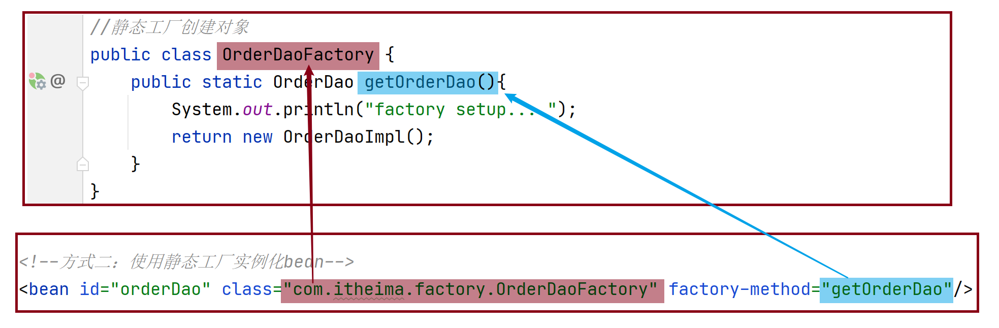
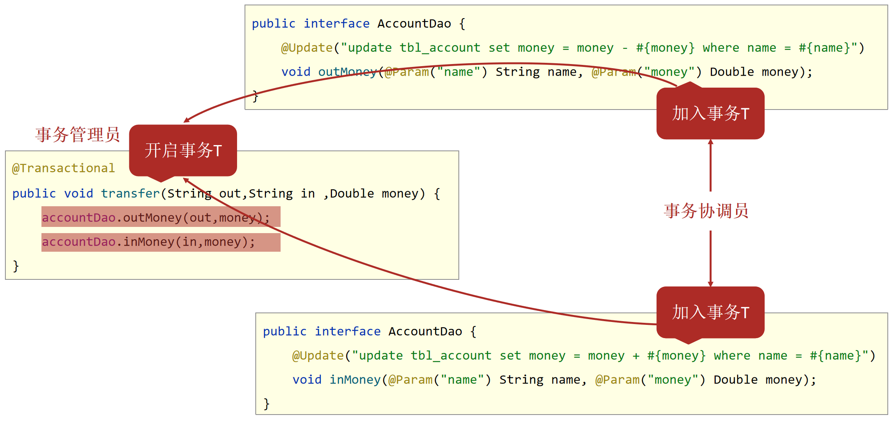

# 一、Spring

## 1. **Maven坐标**

```xml
<dependencies>
    <!--导入spring的坐标spring-context，对应版本是5.2.10.RELEASE-->
    <dependency>
        <groupId>org.springframework</groupId>
        <artifactId>spring-context</artifactId>
        <version>5.2.10.RELEASE</version>
    </dependency>
</dependencies>
```

## 2. XML配置方式

### **XML文件实例化Bean**

applicationContext.xml

```xml
<?xml version="1.0" encoding="UTF-8"?>
<beans xmlns="http://www.springframework.org/schema/beans"
       xmlns:xsi="http://www.w3.org/2001/XMLSchema-instance"
       xsi:schemaLocation="http://www.springframework.org/schema/beans http://www.springframework.org/schema/beans/spring-beans.xsd">

    <!--通用配置：
         bean标签：表示配置bean
         id属性：bean的唯一标识符。每一个bean在容器中id值唯一
         name属性：bean的别名。
         class属性：指定bean的全路径类名
         scope属性：配置bean的作用范围：默认是singleton，还有prototype等。
     -->
    <bean id="userService" name="us" class="hhh.service.impl.UserServiceImpl" scope="singleton"></bean>

    <bean id="studentDao" class="hhh.mapper.StudentDao"></bean>
</beans>
```

#### 1. 构造方法方式

- BookDaoImpl实现类

```java
public class BookDaoImpl implements BookDao {
    public BookDaoImpl() {
        System.out.println("book dao constructor is running ....");
    }
    public void save() {
        System.out.println("book dao save ...");
    }
}
```

- applicationContext.xml配置

```xml
<!--方式一：构造方法实例化bean-->
<bean id="bookDao" class="com.itheima.dao.impl.BookDaoImpl"/>
```

#### 2. 静态工厂方式



#### 3. 实例工厂方式


### XML文件配置依赖注入

#### setter方法注入

**引用类型**


**简单类型**


#### 构造方法注入

**引用类型**


**简单类型**


**参数适配【了解】**


#### 依赖自动装配

IoC容器根据bean所依赖的资源在容器中自动查找并注入到bean中的过程称为**自动装配**

xml配置中使用**bean标签autowire属性**设置自动装配的类型

```xml
<bean id="bookDao" class="com.itheima.dao.impl.BookDaoImpl"/>
<bean id="bookService" class="com.itheima.service.impl.BookServiceImpl" autowire="byType"/>
```

**依赖自动装配特征**

1. 自动装配用于引用类型依赖注入，不能对简单类型进行操作
2. 使用按类型装配时（byType）必须保障容器中相同类型的bean唯一，推荐使用
3. 使用按名称装配时（byName）必须保障容器中具有指定名称的bean，因变量名与配置耦合，不推荐使用
4. 自动装配优先级低于setter注入与构造器注入，同时出现时自动装配配置失效

#### 集合数组类型注入

下面均省略了bean标签。一定要给属性添加相应的setting方法才行。

**注入数组类型数据**

```xml
<property name="array">
    <array>
        <value>100</value>
        <value>200</value>
        <value>300</value>
    </array>
</property>
```

**注入List类型数据**

```xml
<property name="list">
    <list>
        <value>itcast</value>
        <value>itheima</value>
        <value>boxuegu</value>
        <value>chuanzhihui</value>
    </list>
</property>
```

**注入Set类型数据**

```xml
<property name="set">
    <set>
        <value>itcast</value>
        <value>itheima</value>
        <value>boxuegu</value>
        <value>boxuegu</value>
    </set>
</property>
```

**注入Map类型数据**

```xml
<property name="map">
    <map>
        <entry key="country" value="china"/>
        <entry key="province" value="henan"/>
        <entry key="city" value="kaifeng"/>
    </map>
</property>
```

**注入Properties类型数据**

```xml
<property name="properties">
    <props>
        <prop key="country">china</prop>
        <prop key="province">henan</prop>
        <prop key="city">kaifeng</prop>
    </props>
</property>
```

说明：**property标签表示setter方法注入**，构造方法注入constructor-arg标签内部也可以写\<array>、\<list>、\<set>、\<map>、\<props>标签


### XML文件配置加载Properties文件

**【第一步】编写properties属性文件**

例如：jdbc.properties文件

```properties
jdbc.driver=com.mysql.jdbc.Driver
jdbc.url=jdbc:mysql://127.0.0.1:3306/spring_db
jdbc.username=root	
#这里的用户名键如果写成 username，会出现问题，因为系统环境变量也有一个 键叫做 username。解决这个的办法可以在下面的context:property-placeholder标签中添加一个 system-properties-mode="NEVER"属性即可，或者不使用username这个键名
jdbc.password=root
```

**【第二步】在applicationContext.xml中开启开启context命名空间，加载.properties属性文件**


在beans标签中添加如下标签：

```xml
<context:property-placeholder location="classpath*:jdbc.properties"/>
在location属性中填写properties文件的路径。这里使用的是classpath相对路径
```

**【第三步】在需要使用properties文件中属性的地方使用EL表达式获取properties属性文件中的值**

```xml
<bean class="com.alibaba.druid.pool.DruidDataSource">
    <property name="driverClassName" value="${jdbc.driver}"/>
    <property name="url" value="${jdbc.url}"/>
    <property name="username" value="${jdbc.username}"/>
    <property name="password" value="${jdbc.password}"/>
</bean>
```


**location属性值的写法**

- 不加载系统属性

```xml
<context:property-placeholder location="jdbc.properties" system-properties-mode="NEVER"/>
```

- 加载多个properties文件

```xml
<context:property-placeholder location="jdbc.properties,msg.properties"/>
```

- 加载通配符匹配的properties文件

```xml
<context:property-placeholder location="*.properties"/>
```

- 使用classpath加载properties文件

```xml
<context:property-placeholder location="classpath:*.properties"/>
```

- 使用classpath*加载properties文件标准格式

```xml
<context:property-placeholder location="classpath*:*.properties"/>
```

**classpath 和 classpath* 区别：**
classpath：只会到classpath中（比如web项目中的`WBE-INF/classes`）查找文件;
classpath*：如果classpath有多个，会到所有的classpath中进行查找。

在多个classpath中存在同名资源，都需要加载，那么用classpath:只会加载第一个，这种情况下也需要用classpath*:前缀


### 注解和配置文件结合（了解）

既可以使用注解来创建bean也可以使用配置文件创建bean。

**1.配置文件开启Spring注解包扫描**

```xml
<?xml version="1.0" encoding="UTF-8"?>
<beans xmlns="http://www.springframework.org/schema/beans"
       xmlns:context="http://www.springframework.org/schema/context"
       xmlns:xsi="http://www.w3.org/2001/XMLSchema-instance"
       xsi:schemaLocation="
        http://www.springframework.org/schema/beans http://www.springframework.org/schema/beans/spring-beans.xsd
        http://www.springframework.org/schema/context http://www.springframework.org/schema/context/spring-context.xsd">
	 <!--扫描com.itheima包及其子包下的类中注解。
			比如@Component、@Autowired等-->
    <context:component-scan base-package="com.itheima"/>
</beans>
```

**2.使用注解定义Bean。**

```java
//@Component定义bean
@Component("bookDao")
public class BookDaoImpl implements BookDao {
    public void save() {
        System.out.println("book dao save ...");
    }
}
@Component
public class BookServiceImpl implements BookService {
    private BookDao bookDao;

    public void setBookDao(BookDao bookDao) {
        this.bookDao = bookDao;
    }

    public void save() {
        System.out.println("book service save ...");
        bookDao.save();
    }
}
```

> 补充说明：如果@Component注解没有使用参数指定Bean的名称，那么类名首字母小写就是Bean在IOC容器中的默认名称。例如：BookServiceImpl对象在IOC容器中的名称是bookServiceImpl。


**3.获取Bean对象**

```java
public class AppForAnnotation {
    public static void main(String[] args) {
        ApplicationContext ctx = new ClassPathXmlApplicationContext("applicationContext.xml");
        BookDao bookDao = (BookDao) ctx.getBean("bookDao");
        System.out.println(bookDao);
        //按类型获取bean
        BookService bookService = ctx.getBean(BookService.class);
        System.out.println(bookService);
    }
}
```


## 3. 纯注解开发

### 使用步骤

**1. 定义配置类代替配置文件**

```java
//声明当前类为Spring配置类，可以从中获取Bean对象
@Configuration
//Spring注解扫描，相当于<context:component-scan base-package="com.itheima"/>
@ComponentScan("com.itheima")
//多个路径书写为字符串数组格式
//@ComponentScan({"com.itheima.service","com.itheima.dao"})
public class SpringConfig {
}
```

**2. 在需要注册到IOC容器中的类上加上@Component等注解**

**3.在测试类中加载配置类，获取Bean对象并使用**

```java
public class AppForAnnotation {
    public static void main(String[] args) {
        //AnnotationConfigApplicationContext加载Spring配置类初始化Spring容器
        ApplicationContext ctx = new AnnotationConfigApplicationContext(SpringConfig.class);

        //按类型获取bean
        BookService bookService = ctx.getBean(BookService.class);
        System.out.println(bookService);
    }
}
```

### bean作用范围

#### @Scope

- 使用**@Scope**定义bean作用范围

```java
@Repository
@Scope("singleton")
public class BookDaoImpl implements BookDao {
}
```

### bean生命周期

- 使用**@PostConstruct、@PreDestroy** 控制bean生命周期

```java
@Repository
@Scope("singleton")
public class BookDaoImpl implements BookDao {
    public BookDaoImpl() {
        System.out.println("book dao constructor ...");
    }
    @PostConstruct
    public void init(){
        System.out.println("book init ...");
    }
    @PreDestroy
    public void destroy(){
        System.out.println("book destory ...");
    }
}
```

**注意：@PostConstruct和@PreDestroy注解是jdk中提供的注解，从jdk9开始，jdk中的javax.annotation包被移除了，也就是说这两个注解就用不了了，可以额外导入一下依赖解决这个问题。**

```xml
<dependency>
  <groupId>javax.annotation</groupId>
  <artifactId>javax.annotation-api</artifactId>
  <version>1.3.2</version>
</dependency>
```


### 依赖注入

#### **@Autowired**

使用@Autowired注解注入**引用类型（按类型）**

注意：自动装配**基于反射设计**创建对象并暴力反射对应属性为私有属性初始化数据，**因此无需提供setter方法**。

```java
@Service
public class BookServiceImpl implements BookService {
    //@Autowired：注入引用类型，自动装配模式，默认按类型装配
    @Autowired
    private BookDao bookDao;
}
```

#### @Qualifier

解决IOC容器中同类型Bean有多个装配哪一个的问题

@Qualifier注解无法单独使用，**必须配合@Autowired注解使用**。用于指定bean的名称，**按名称自动装配**。

```java
@Service
public class BookServiceImpl implements BookService {
    //@Autowired：注入引用类型，自动装配模式，默认按类型装配
    @Autowired
    //@Qualifier：自动装配bean时按bean名称和类型装配
    @Qualifier("bookDao")
    private BookDao bookDao;
}
```

#### **@Value**

**注入基本类型**

```java
@Repository("bookDao")
public class BookDaoImpl implements BookDao {
    //@Value：注入简单类型（无需提供set方法）
    @Value("${name}")
    private String name;
    //默认使用 ',' 分隔，然后转换为int数组
    @Value("1,2,3")
    private int[] a;
}
```

可以使用el表达式，也可以使用字符串值，spring会自动进行类型转换。

如果使用el表达式注入属性，那么需要在配置类上添加**@PropertySource**注解加载properties文件


### 加载properties文件

#### @PropertySource

**不允许使用通配符**

```java
@Configuration
@ComponentScan("com.itheima")
@PropertySource({"classpath:jdbc.properties"}) 
public class SpringConfig {
}
```

@PropertySource注解放到配置类上，加载properties配置文件（可以有多个）。如果只有一个配置文件，{}可以省略不写。

这样就可以在@Value注解中使用el表达式注入properties文件中的内容了。


### 注册第三方Bean到容器中

要想把Bean注册到IOC容器中，使用@Component、@Configuration等只适用于我们自己编写的类。对于第三方bean注册到IOC容器中，需要使用如下方法。以下方法以把DruidDataSource加入到IOC容器中为例：

**【第一步】单独定义一个配置类（对象工厂），在该类中写一个工厂方法，并加上@Bean注解**

不要写在Spring的配置文件里，每个第三方bean都单独定义一个配置类

```java
public class JdbcConfig {
    //1.这些属性也可以用el表达式从properties文件中获取
    @Value("com.mysql.jdbc.Driver")
    private String driver;
    @Value("jdbc:mysql://localhost:3306/spring_db")
    private String url;
    @Value("root")
    private String userName;
    @Value("root")
    private String password;
    
    //2.@Bean：表示当前方法的返回值是一个bean对象，添加到IOC容器中
    @Bean
    public DataSource dataSource(){
        DruidDataSource ds = new DruidDataSource();
        ds.setDriverClassName(driver);
        ds.setUrl(url);
        ds.setUsername(userName);
        ds.setPassword(password); 
        return ds;
    }
}
```

**【第二步】将独立的配置类加入到IOC容器中**

有两种方式：

**方式1：@Import注解导入式**

```java
@Configuration
@ComponentScan("com.itheima")
//@Import:导入配置信息
@Import({JdbcConfig.class})
public class SpringConfig {
}
```

**方式2：@ComponentScan扫描式（不推荐）**

给配置类加上 @Configuration或者@Component注解，然后在Spring配置类上通过@ComponentScan扫描到配置类所在的包。

```java
@Configuration
@ComponentScan({"com.itheima.config","com.itheima.service","com.itheima.dao"}) 
public class SpringConfig {
}

@Configuration
public class JdbcConfig {
}
```


## 4. 注解总结

### **@Configuration**

类注解

用于设定当前类为配置类，**这个类会注册到IOC容器中**。

可以在配置类中写一些 **@Bean**注解的方法，方法返回值的对象也会被注册到IOC容器中，相当于该配置类是一个对象工厂。

```java
@Configuration
public class StudentConfig {
    @Bean
    public Student zhangSan(){
        Student student = new Student();
        student.setName("张三");
        return student;
    }
}
```

现在IOC容器中有一个名为"zhangSan"的Student类的对象。

```java
ApplicationContext ctx = new AnnotationConfigApplicationContext(SpringConfig.class);
Student zhangSan = (Student)ctx.getBean("zhangSan");	//可以获取到这个bean
```


### @Bean

注解到方法上，会把该方法的返回值对象加入到IOC容器中。方法所在的类必须（通过@Configuration或者@Import等方式）注册到IOC容器中。相当于该方法是一个工厂方法，该方法所在的类是一个工厂类。

```java
@Configuration
public class SpringConfig {
    //如果工厂方法有形参，也可以通过自动装配机制给方法传入实参。
    //@Autowired可以省略，spring会在IOC容器中按类型给方法传入实参
    @Bean
    public Student zhangSan(@Value("1") int id,@Autowired Teacher teacher){
        Student student = new Student();
        student.setName("张三");
        student.setId(id);
        student.setTeacher(teacher);
        return student;
    }
}
```

**注：这个Bean的名字就是方法名。**本例中，该Student在容器中的名字就是zhangSan


### @Import

只能注解类

**@Import通过快速导入的方式实现把实例加入spring的IOC容器中**

@Import的用法主要包括：

- 直接填Class数组方式

​		value属性数组中的类会实例化为bean加入到IOC容器中，在容器中bean名称是该类的全类名 

- ImportSelector方式

  value属性传入实现了ImportSelector接口的类的Class对象。

  ImportSelector接口有一个 `String[] selectImports方法`，方法的返回值就是要注册到IOC容器中的类的全类名。

```java
@Configuration
@ComponentScan("com.itheima")
//@Import:导入JdbcConfig类，这样IOC容器中就有该类的一个实例
@Import({JdbcConfig.class})
public class SpringConfig {
}
```


### **@ComponentScan**

类注解

设置注解包扫描路径，扫描指定包下面的 @Component、@Autowired、@Controller等注解

只有添加了这个注解，相应包下面的上述注解才能生效

```
@ComponentScan({com.itheima.service","com.itheima.dao"})
```

**excludeFilters属性**：排除一些类

**includeFilters属性**：只包含一些类

```java
@Configuration
//如下注解表示扫描com.itheima包及其子包中的组件，但是排除掉添加了@Controller注解的类。
@ComponentScan(value = "com.itheima",
               excludeFilters = @ComponentScan.Filter(
                   type = FilterType.ANNOTATION,
                   classes = Controller.class
               )
              )
public class SpringConfig {
}
```


### **@Component**

类注解

- **`@Controller`**：用于表现层bean定义
- **`@Service`**：用于业务层bean定义
- `@Repository`：用于数据层（dao层）bean定义

以上四个注解效果都是一样的，把被该注解的类注册到IOC容器中，只是为了逻辑上的区分

value属性为bean对象在IOC容器中的名字。


## 5. Bean生命周期控制

**方式1**

- 提供生命周期控制方法

```java
public class BookDaoImpl implements BookDao {
    public void save() {
        System.out.println("book dao save ...");
    }
    //表示bean初始化对应的操作
    public void init(){
        System.out.println("init...");
    }
    //表示bean销毁前对应的操作
    public void destory(){
        System.out.println("destory...");
    }
}
```

- applicationContext.xml配置

```xml
<!--init-method：设置bean初始化生命周期回调函数,此处填写init方法名-->
<!--destroy-method：设置bean销毁生命周期回调函数，仅适用于单例对象，此处填写destory方法名-->
<bean id="bookDao" class="com.itheima.dao.impl.BookDaoImpl" init-method="init" destroy-method="destory"/>
```

**方式2**

- 实现**InitializingBean**, **DisposableBean**接口

```java
public class UserDAO implements InitializingBean, DisposableBean {
    public void func(){
        System.out.println("UserDAO...");
    }

    //初始化方法
    @Override
    public void afterPropertiesSet() throws Exception {

    }

    //销毁方法
    @Override
    public void destroy() throws Exception {

    }
}
```


## 6. **ApplicationContext（IOC容器）对象**

```java
public class App {
    public static void main(String[] args) {
        //1.加载spring核心配置文件，创建IoC容器对象。
        ApplicationContext ctx = new ClassPathXmlApplicationContext("applicationContext.xml");
        
        //2 从IOC容器中获取Bean对象(BookService对象)。        
        BookService bookService= (BookService)ctx.getBean("bookService");
        
        //3 调用Bean对象(BookService对象)的方法
        bookService.save();
    }
}
```

### 创建核心容器方式

- 方式一：类路径加载配置文件

```java
ApplicationContext ctx = new ClassPathXmlApplicationContext("applicationContext.xml");
```

​	加载多个配置文件

```java
ApplicationContext ctx = new ClassPathXmlApplicationContext("bean1.xml", "bean2.xml");
```

- 方式二：文件路径加载配置文件

```java
ApplicationContext ctx = new FileSystemXmlApplicationContext("D:\\applicationContext.xml");
```

- 方式三：基于注解的配置类方式

```java
ApplicationContext ctx = new AnnotationConfigApplicationContext(SpringConfig.class);
```

### 获取Bean对象

- 方式一：使用bean名称获取

```java
BookDao bookDao = (BookDao) ctx.getBean("bookDao");
```

- **方式二：使用bean名称获取并指定类型**

```java
BookDao bookDao = ctx.getBean("bookDao", BookDao.class);
```

- 方式三：使用bean类型获取

```java
BookDao bookDao = ctx.getBean(BookDao.class);
```


## 7. Spring整合Mybatis

### Maven依赖

```xml
这个依赖是spring整合mybatis要用的依赖
<dependency>
    <groupId>org.mybatis</groupId>
    <artifactId>mybatis-spring</artifactId>
    <version>1.3.0</version>
</dependency>
这个依赖也要添加
<dependency>
    <groupId>org.springframework</groupId>
    <artifactId>spring-jdbc</artifactId>
    <version>5.2.10.RELEASE</version>
</dependency>
```


### Mybatis配置bean

- **SqlSessionFactoryBean类**封装了创建SqlSessionFactory对象所需要的环境信息。下图颜色对应错了。


- 使用**MapperScannerConfigurer**加载xxxMapper接口，创建Mapper代理对象保存到IOC容器中


```java
@Configuration	//1.把配置类加入到IOC容器中
public class MybatisConfig {
    //2.定义SqlSessionFactoryBean，用于产生SqlSessionFactory对象
    @Bean
    public SqlSessionFactoryBean sqlSessionFactory(DataSource dataSource){
        SqlSessionFactoryBean ssfb = new SqlSessionFactoryBean();
        //设置类型别名包扫描。相当于mybatis配置文件中的typeAliases标签
        ssfb.setTypeAliasesPackage("com.itheima.domain");
        //设置数据源
        ssfb.setDataSource(dataSource);
        return ssfb;
    }
    //3.定义bean，返回MapperScannerConfigurer对象，用于设置用于设置Mapper接口包扫描。
    @Bean
    public MapperScannerConfigurer mapperScannerConfigurer(){
        MapperScannerConfigurer msc = new MapperScannerConfigurer();
        //设置xxxMapper接口的包。相当于mybatis配置文件中的mappers标签
        msc.setBasePackage("com.itheima.mapper");
        return msc;
    }
}
```

有了这个配置类，我们就不需要mybatis的配置文件了。xxMapper.xml文件依然可以使用，只需要把Mapper.xml文件和Mapper.java接口文件放在同一包下即可。

**注：**

上述中的 DataSource 可以使用Druid连接池来创建，具体代码省略了。


现在，IOC容器中就已经有了xxMapper对象了：

```java
ApplicationContext ctx = new AnnotationConfigApplicationContext(SpringConfig.class);
StudentMapper mapper = ctx.getBean(StudentMapper.class);
System.out.println(mapper.selectAll());
System.out.println(mapper.selectById(1));
```


## 8. Spring整合 JUnit

### Maven依赖

```xml
<!--junit-->
<dependency>
    <groupId>junit</groupId>
    <artifactId>junit</artifactId>
    <version>4.12</version>
    <scope>test</scope>
</dependency>
<!--spring整合junit-->
<dependency>
    <groupId>org.springframework</groupId>
    <artifactId>spring-test</artifactId>
    <version>5.2.10.RELEASE</version>
    <scope>test</scope>
</dependency>
```

### 相关注解

```java
//【第二步】使用Spring整合Junit专用的类加载器
@RunWith(SpringJUnit4ClassRunner.class)
//【第三步】加载配置文件或者配置类
@ContextConfiguration(classes = {SpringConfiguration.class}) //加载配置类
//@ContextConfiguration(locations={"classpath:applicationContext.xml"})//加载配置文件
public class AccountServiceTest {
    //支持自动装配注入bean
    @Autowired
    private AccountService accountService;

    @Test
    public void testFindById(){
        System.out.println(accountService.findById(1));
    }

    @Test
    public void testFindAll(){
        System.out.println(accountService.findAll());
    }
}
```

注意：junit的依赖至少要是4.12版本


## 9. AOP

**AOP作用**：简单的说就是在不改变方法源代码的基础上对方法进行功能增强。

### 核心概念


- **连接点（JoinPoint）**：**可以增强的方法**，例如：update()、delete()、select()等都是连接点。
- **切入点（Pointcut）**：**进行功能增强了的方法**，例如:update()、delete()方法。select()方法没有被增强所以不是切入点，但是是连接点。
  - 在SpringAOP中，一个切入点可以只描述一个具体方法，也可以匹配多个方法
    - 一个具体方法：com.itheima.dao包下的BookDao接口中的无形参无返回值的save方法
    - 匹配多个方法：所有的save方法，所有的get开头的方法，所有以Dao结尾的接口中的任意方法，所有带有一个参数的方法
- **通知（Advice）**：在切入点前后执行的操作，也就是增强的共性功能
  - 在SpringAOP中，功能最终以方法的形式呈现
- **通知类**：通知方法所在的类叫做通知类
- **切面（Aspect）**：描述**通知与切入点**的对应关系，也就是哪些通知方法对应哪些切入点方法。


### SpringAOP依赖

```xml
<dependencies>
    <!--spring核心依赖，会将spring-aop传递依赖进来-->
    <dependency>
        <groupId>org.springframework</groupId>
        <artifactId>spring-context</artifactId>
        <version>5.2.10.RELEASE</version>
    </dependency>
    <!--引入该依赖就可以使用 切入点表达式、AOP相关注解等-->
    <dependency>
        <groupId>org.aspectj</groupId>
        <artifactId>aspectjweaver</artifactId>
        <version>1.9.4</version>
    </dependency>
</dependencies>
```


### 通用步骤

**①定义通知类，编写通知方法（增强的功能逻辑，比如权限校验，日志处理，计算接口效率等）**

**②定义切入点表达式、配置切面(绑定切入点与通知关系)**

```java
//通知类必须配置成Spring管理的bean
@Component
//1.设置当前类为切面类(通知类)
@Aspect
public class MyAdvice {
    //3.设置切入点，@Pointcut的value属性为切入点表达式。
    @Pointcut("execution(public void hhh.service.impl.UserServiceImpl.func())")
    private void pt(){
        //表示切入点的方法没有返回值、参数、以及方法体
    }
    
    // 2.@Before表示该方法是一个前置通知方法，也就是在切入点方法之前执行。
    // 通知注解的 value属性指定 @Pointcut注解的方法
    @Before("pt()")
    public void enhance(){
        System.out.println("增强的功能逻辑");
    }
}

```

**③在配置类上加 @EnableAspectJAutoProxy 中开启AOP功能，并且配置@ComponentScan扫描到通知类所在的包**

```java
@Configuration
@ComponentScan("hhh")	//组件扫描要扫描到通知类所在的包
@EnableAspectJAutoProxy	//4.开启注解开发AOP功能
public class SpringConfig {
}
```


### AOP相关注解

#### @Aspect

注解在类上，表示该类是一个切面类（通知类）。


#### @Pointcut

注解在通知类中的方法上，该方法没有返回值也没有参数，仅仅用来表示切入点。

其value属性用于设置切入点表达式，切入点表达式用于指定哪些方法作为切入点，也就是哪些方法会被增强。


#### @EnableAspectJAutoProxy

注解在配置类上，开启AOP代理功能


### 切入点表达式

- 切入点：要进行增强的方法

- 切入点表达式：对要进行增强的方法的描述方式

**切入点表达式标准格式**：`动作关键字(访问修饰符  返回值  包名.类/接口名.方法名(参数) 异常名）`

```
execution(public User com.itheima.service.UserService.findById(int))
```

- 动作关键字：描述切入点的行为动作，例如execution表示执行到指定切入点
- 方法的访问修饰符：public，private等，**可以省略**
- 返回值：写返回值类型
- 包名：多级包使用点连接
- 类/接口名：
- 方法名：
- 参数：直接写参数的类型，多个类型用逗号隔开
- 异常名：方法定义中抛出指定异常，**可以省略**

**切入点表达式各部分的顺序跟Java方法签名中的顺序是一样的**

切入点表达式通配符：

* `*`：**单个**独立的任意符号，可以独立出现，也可以作为前缀或者后缀的匹配符出现

匹配com.itheima包下的任意包中的UserService类或接口中所有find开头的带有**一个参数**的方法:

```java
execution(public * com.itheima.*.UserService.find*(*))
```

- `..` ：**多个**连续的任意符号，可以独立出现，常用于简化包名与参数的书写

> 匹配com包下的任意包中的UserService类或接口中所有名称为findById的方法

```java
execution（public User com..UserService.findById(..))
```

- `+`：专用于匹配子类类型

```java
execution(* *..*Service+.*(..))
```


### AOP通知类型

以下通知类型的注解加在通知方法上，用于设置当前通知方法与切入点之间的绑定关系，其value属性的值为 被@Pointcut注解的方法名加上 `()`。例如：`@Before("pt()")`。

#### @Before (**前置通知**)

当前通知方法在原始切入点方法**前**运行

eg：

```java
@Before("pt()")
public void before() {
    System.out.println("before advice ...");
}
```

#### @After (最终通知)

当前通知方法在原始切入点方法**后**运行

eg：

```java
@After("pt()")
public void after() {
    System.out.println("after advice ...");
}
```

如果原始方法正常运行结束返回：**@After**的方法会在**@AfterReturning**的方法 **之后**

如果原始方法出现异常：**@After**的方法会在**@AfterThrowing**的方法 **之后**


#### @Around (环绕通知) 重点

当前通知方法在原始切入点方法**前后**运行

eg:

```java
@Around("pt()")
public Object around(ProceedingJoinPoint pjp) throws Throwable {
    System.out.println("around before advice ...");
    Object ret = pjp.proceed();
    System.out.println("around after advice ...");
    return ret;
}
```

1. 环绕通知方法形参必须是**ProceedingJoinPoint**，表示正在执行的连接点方法，使用该对象的**proceed()方法**表示对原始方法进行调用，返回值为原始方法的返回值。
2. 环绕通知方法的返回值建议写成**Object类型**，用于将原始对象方法的返回值进行返回，哪里使用代理对象就返回到哪里。
3. 环绕通知方法必须抛出 **Throwable异常**


#### @AfterReturning（了解）

**返回后通知**，当前通知方法在原始切入点方法**正常执行完毕后**运行

#### @AfterThrowing（了解）

**抛出异常后通知**，当前通知方法在原始切入点方法运行**抛出异常后**执行


### AOP切入点方法数据获取

#### **JoinPoint、ProceedingJoinPoint**

**JoinPoint**是对连接点方法的封装，通过它可以获得原始切入点方法的参数、返回值等数据，把它作为参数传递给 前置通知方法或者后置通知方法。

**ProceedingJoinPoint** 是 JoinPoint的子接口，把它作为参数传递给 环绕通知方法。


#### 获取方法参数

使用JoinPoint的 **getArgs()方法** 可以获取切入点方法的实参：

```java
@Before("pt()")
public void before(JoinPoint jp) {
    Object[] args = jp.getArgs(); //获取连接点方法的参数们
    System.out.println(Arrays.toString(args));
}

@Around("pt()")
public Object around(ProceedingJoinPoint pjp) throws Throwable {
    Object[] args = pjp.getArgs(); //获取连接点方法的参数们
    System.out.println(Arrays.toString(args));
    Object ret = pjp.proceed();
    return ret;
}
```


#### 获取返回值

在**@AfterReturning通知**和**@Around通知**中都可以获取到切入点方法的返回值

- 使用**形参**可以接收返回值
- 如果形参列表中还需要有 **JoinPoint** 那么 JoinPoint必须为第一个参数

```java
@AfterReturning(value = "pt()",returning = "ret")
public void afterReturning((JoinPoint jp),String ret) { //变量名要和returning="ret"的属性值一致
    System.out.println("afterReturning advice ..."+ret);
}
```

- 环绕通知中可以手工书写对原始方法的调用，得到的结果即为原始方法的返回值

```java
@Around("pt()")
public Object around(ProceedingJoinPoint pjp) throws Throwable {
    // 手动调用连接点方法，返回值就是连接点方法的返回值
    Object ret = pjp.proceed();
    return ret;
}
```


#### 获取异常

说明：在**抛出异常后通知@AfterThrowing **和**环绕通知 @Around** 中都可以获取到连接点方法中出现的异常

- 抛出异常后通知 可以获取切入点方法中出现的异常信息，使用**形参**可以接收对应的异常对象

```java
@AfterThrowing(value = "pt()",throwing = "t")
public void afterThrowing(Throwable t) {//变量名要和throwing = "t"的属性值一致
    System.out.println("afterThrowing advice ..."+ t);
}
```

- 环绕通知 可以直接获取切入点方法运行的异常信息

```java
@Around("pt()")
public Object around(ProceedingJoinPoint pjp)  {
    Object ret = null;
    //此处需要try...catch处理，catch中捕获到的异常就是连接点方法中抛出的异常
    try {
        ret = pjp.proceed();
    } catch (Throwable t) {
        t.printStackTrace();
    }
    return ret;
}
```


## 10. 事务

### Maven依赖

```xml
<dependency>
    <groupId>org.springframework</groupId>
    <artifactId>spring-context</artifactId>
    <version>5.2.10.RELEASE</version>
</dependency>

<dependency>
    <groupId>org.springframework</groupId>
    <artifactId>spring-jdbc</artifactId>
    <version>5.2.10.RELEASE</version>
</dependency>
```


### Spring声明式事务使用步骤

**①配置事务管理器(将事务管理器添加到IOC容器中)**

```java
//配置事务管理器，mybatis使用的是jdbc事务
//可以把这个方法放到 创建DataSource的配置类中
@Bean
public PlatformTransactionManager transactionManager(DataSource dataSource){
    DataSourceTransactionManager dtm = new DataSourceTransactionManager();
    transactionManager.setDataSource(dataSource);
    return transactionManager;
}
```

注意事项

1. 事务管理器要根据实现技术进行选择 ，也就是说 `  DataSourceTransactionManager dtm = new DataSourceTransactionManager();`这个可以灵活变化，但是PlatformTransactionManager 不能变。
2. MyBatis框架使用的是**JDBC事务**

**②在Spring配置类上添加@EnableTransactionManagement注解**

```java
@Configuration
@ComponentScan("com.itheima")
@PropertySource("classpath:jdbc.properties")
@Import({JdbcConfig.class,MybatisConfig.class})
//开启注解式事务驱动
@EnableTransactionManagement
public class SpringConfig {
}
```

**③在需要配置事务的方法、类、接口上添加@Transactional注解**

```java
public interface AccountService {
    //配置当前接口方法具有事务
    @Transactional
    public void transfer(String out,String in ,Double money) ;
}
```


#### @EnableTransactionManagement

注解在配置类上，表示开启声明式事务支持


#### @Transactional

注解在类或接口上表示该类或接口中的所有方法开启事务处理

注解在方法上则只表示该方法开启事务处理

通过该注解的一些属性，可以配置事务的一些功能：


说明：

**rollbackFor**：在执行开启事务的方法中的代码时，只有发生了非受查异常（RuntimeException、Error）才会回滚，如果希望发生受查异常时也能回滚，那么需要设置该属性来指定发生某些受查异常时也能回滚。

**isolation**：设置事务的隔离级别。可使用**Isolation枚举类**中定义的枚举类型

**propagation**：事务的传播行为。可使用**Propagation枚举类**中定义的枚举类型。


### Spring事务角色

- **事务管理员**：发起事务方，可以理解为最开始开启事务的方法
- **事务协调员**：加入事务方，可以理解为被事务管理员方法所调用的加了@Transactional的方法。



### 事务的传播行为

**事务传播行为**：事务协调员对事务管理员所携带事务的处理态度，即事务协调员是加入事务管理员的事务，还是开启一个新的事务。

也就是说，**被@Transactional注解的方法被其他方法调用时，应该怎么做，是加入调用者的事务还是创建一个新事务**。

可以通过上述的**propagation**属性来配置：


图中表示的意思是：

例如 **REQUERES_NEW** , 第一行：事务管理员如果开启了事务，事务协调员会新建另一个事务

第二行：事务管理员没开启事务，事务协调员也会开启一个事务。


## 11. @Async

@Async

Spring提供的异步处理注解，被此注解标注的方法会在新的线程中执行，其实就相当于我们自己new Thread。

使用该注解，必须要在引导类上面加上 **@EnableAsync注解** ，然后在需要异步处理的方法上面添加 **@Async注解** 即可。
