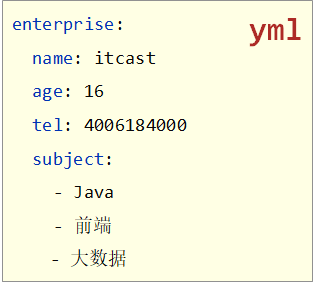
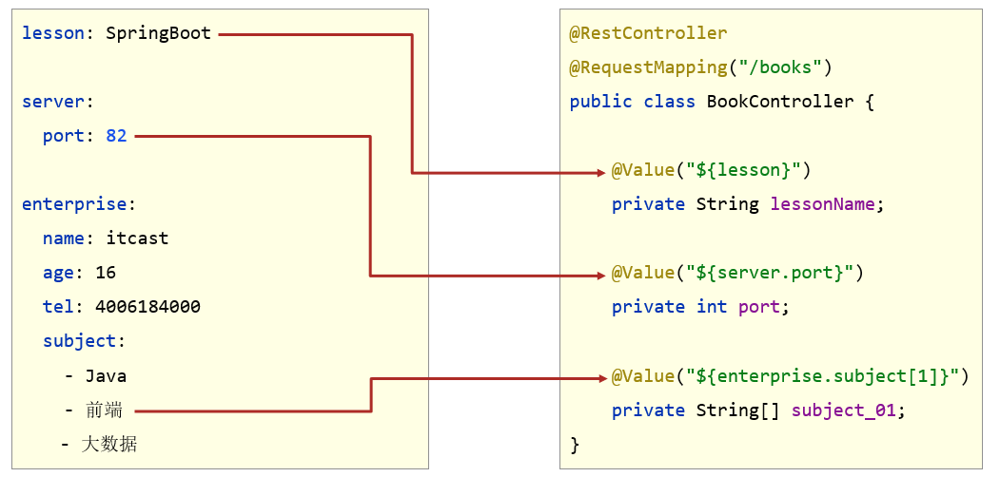
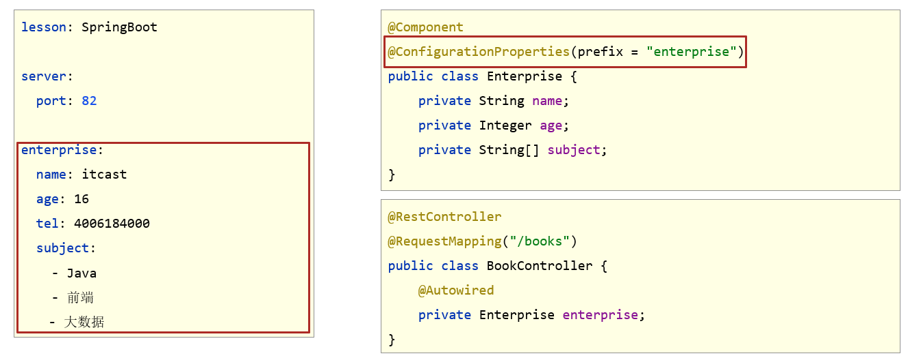
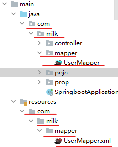
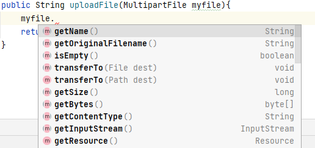
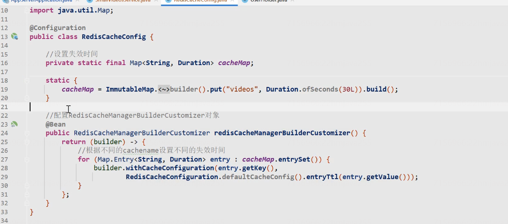
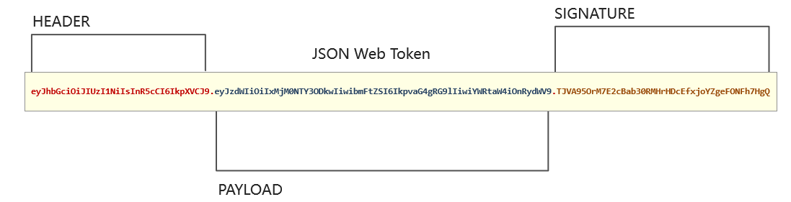
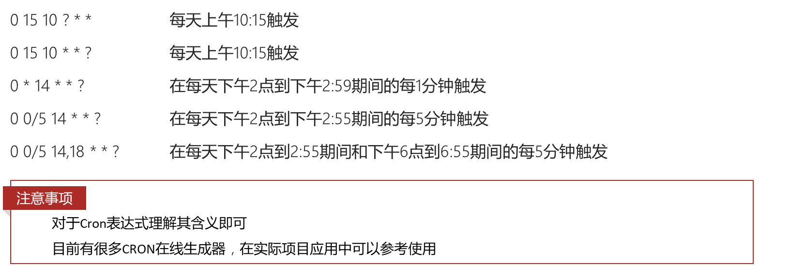

# 一.Pom文件

```xml
<?xml version="1.0" encoding="UTF-8"?>
<project xmlns="http://maven.apache.org/POM/4.0.0" xmlns:xsi="http://www.w3.org/2001/XMLSchema-instance"
         xsi:schemaLocation="http://maven.apache.org/POM/4.0.0 https://maven.apache.org/xsd/maven-4.0.0.xsd">
    <modelVersion>4.0.0</modelVersion>
    -------------------
    所有SpringBoot项目都要继承这个，有了这个我们指定依赖的坐标一般就不需要指定版本了
    <parent>
        <groupId>org.springframework.boot</groupId>
        **
        <artifactId>spring-boot-starter-parent</artifactId>
        **
        <version>2.5.0</version>
    </parent>
    -------------------
    
    <groupId>com.itheima</groupId>
    <artifactId>springboot-01-quickstart</artifactId>
    <version>0.0.1-SNAPSHOT</version>
    
    <dependencies>
        <dependency>
            <groupId>org.springframework.boot</groupId>
            <artifactId>spring-boot-starter-web</artifactId>
        </dependency>
    </dependencies>
    
    <build>
        <plugins>
            <plugin>
                <groupId>org.springframework.boot</groupId>
                <artifactId>spring-boot-maven-plugin</artifactId>
            </plugin>
        </plugins>
    </build>
</project>

```


# 二.启动类（引导类）

```java
@SpringBootApplication
public class Application {
    public static void main(String[] args) {
        SpringApplication.run(Application.class, args);
    }
}
```

SpringBoot项目内置Tomcat服务器

SpringBoot的引导类是项目的入口，运行main方法就可以启动项目


## 更换内置服务器

例如如果我们想把内置Tomcat服务器换成 Jetty

```xml
<dependencies>
    <dependency>
        <groupId>org.springframework.boot</groupId>
        <artifactId>spring-boot-starter-web</artifactId>
        <!--web起步依赖环境中，排除Tomcat起步依赖-->
        <exclusions>
            <exclusion>
                <groupId>org.springframework.boot</groupId>
                <artifactId>spring-boot-starter-tomcat</artifactId>
            </exclusion>
        </exclusions>
    </dependency>
    <!--添加Jetty起步依赖，版本由SpringBoot的starter控制-->
    <dependency>
        <groupId>org.springframework.boot</groupId>
        <artifactId>spring-boot-starter-jetty</artifactId>
    </dependency>
</dependencies>
```


# 三.SpringBoot项目快速启动

pringBoot可以通过maven来实现把项目打包，然后在其他地方就可以直接运行。

① 对SpringBoot项目打包（执行Maven构建指令**package**）

② 执行启动指令

```cmd
java -jar springboot_01_quickstart.jar	# 项目的名称根据实际情况修改
```

**注意事项：**

**jar支持命令行启动需要依赖maven插件支持，请确认打包时是否具有SpringBoot对应的maven插件。**

```xml
<build>
    <plugins>
        <plugin>
            <groupId>org.springframework.boot</groupId>
            <artifactId>spring-boot-maven-plugin</artifactId>
        </plugin>
    </plugins>
</build>
```


# 四.配置文件

## 配置文件格式

**SpringBoot核心配置文件名为 application**

SpringBoot提供了多种配置文件格式（这些文件均在 src/main/resources 目录下）

- **application.properties**

```properties
server.port=80
```

- **application.yml（<u>通常使用这一种</u>）**

```yaml
server:
  port: 81	//值 前面一定要有一个空格
```

- **application.yaml**

```yaml
server:
  port: 82
```

优先级：

application.**properties** > application.**yml** > application.**yaml**


## yml文件语法

- 大小写敏感
- 属性层级关系使用多行描述，每行结尾使用**冒号**结束
- 使用**缩进**表示层级关系，同层级左侧对齐，只允许使用**空格**（不允许使用Tab键）
- **属性值前面添加空格**（属性名与属性值之间使用<u>冒号+空格</u>作为分隔）
- **#**表示注释
- 核心规则：**数据前面要加空格与冒号隔开**


 **yaml数组数据**

- 数组数据在数据书写位置的下方使用**减号**作为数据开始符号，每行书写一个数据，减号与数据间**空格**分隔




## yml数据读取

如何从yml配置文件中读取配置信息呢？

**方式一：**

使用**@Value**读取单个数据，属性名引用方式：`${一级属性名.二级属性名……}`




**方式二：**

把yml文件中的配置信息封装到一个bean中

```java
@Component	加上这两个注解	
@ConfigurationProperties(prefix = "enterprise")	
public class Enterprise {
    private String name;
    private Integer age;
    private String tel;
    private String[] subject;
    //省略了getter、setter、toString()等方法
}
```



**注意：**

1.**上述方式，被@ConfigurationProperties注解的类必须有 setter方法，并且类的成员变量名称必须和yml配置文件中配置项的名称一致。**

2.如果不加**@Component注解**，则需要在启动类上加上`@EnableConfigurationProperties({Enterprise.class})` 注解。


### @ConfigurationProperties

注解在类上，该类的成员变量名称必须和yml配置文件中配置项的名称一致。

使用这个注解可以把yml配置文件中的配置项信息封装成bean对象，并加入到Spring容器中。

**prefix 和 value 属性：** 指定yml配置文件中配置项的前缀。


### @EnableConfigurationProperties

加在配置类上。表示启用@ConfigurationProperties注解的功能。

**value属性：** Class数组，指定需要开启@ConfigurationProperties功能的类。

```java
@SpringBootApplication
@EnableConfigurationProperties({Conf.class})
public class SpringbootApplication {
    public static void main(String[] args) {
        SpringApplication.run(SpringbootApplication.class, args);
    }
}
```


## 多环境配置

在实际开发中，项目的开发环境、测试环境、生产环境的配置信息不一样。可以把不同环境的配置写到一个配置文件中，然后按实际情况启用不同环境的配置。

```yml
profile:
  name: libai
  age: 123
  hobby:
    - 唱
    - 跳
    - rap
    - 篮球

#上面的是各个环境的公共配置
spring:
  profiles:
    active: test #这个属性指定启用的环境配置的id
--- #使用这个符号分隔各个配置
spring:
  config:
    activate:
      on-profile: pro #指定环境配置的id。下面书写配置项
server:
  port: 8080
---
spring:
  config:
    activate:
      on-profile: test
server:
  port: 8081
```


注：**properties文件多环境启动**

```properties
#主启动配置文件 application.properties
spring.profiles.active=pro
```

环境分类配置文件名为 application后面加上 `-环境名`:

```properties
#环境分类配置文件 application-pro.properties
server.port=80
```

```properties
#环境分类配置文件 application-dev.properties
server.port=81
```

```properties
#环境分类配置文件application-test.properties
server.port=82
```


**多环境启动命令格式**

- 带参数启动SpringBoot

```sh
java –jar springboot.jar --spring.profiles.active=test
```

​	如果需要修改配置中的属性：

```sh
java –jar springboot.jar --server.port=88
java –jar springboot.jar --server.port=88 --spring.profiles.active=test
```


## 多配置文件优先级

如果通过命令行启动打包后的项目时指定的临时配置属性太多，不可能一个一个地通过上述命令指定，可以通过在jar包所在目录再写一个配置文件来解决。这样项目启动就有多个配置文件了。

- SpringBoot中**4级配置文件**

  1级： file/config/application.yml 【最高】

  2级： file/application.yml

  3级：classpath/config/application.yml

  4级：classpath/application.yml  【最低】

  file 表示打包后的jar包所在的目录

  classpath 表示class文件所在的目录，在maven工程中也就是src/java/resources目录

- 作用：

  1级与2级留做**系统打包后**设置通用属性

  3级与4级用于**系统开发阶段**设置通用属性

例如：


我们在打包后的jar包所在的目录也添加一个 yml配置文件，那么通过 java -jar启动后，这个配置文件中的配置会覆盖掉jar包内部的 yml配置文件中的配置。


# 五.SpringBoot整合JUnit

【第一步】添加整合junit起步依赖

```xml
<dependency>
    <groupId>org.springframework.boot</groupId>
    <artifactId>spring-boot-starter-test</artifactId>
    <scope>test</scope>
</dependency>
```

【第二步】编写测试类

```java
@SpringBootTest(classes=xxxApplication.class)	//使用这个注解来 注解测试类。
class Springboot07JunitApplicationTests {
    @Autowired
    private BookService bookService;

    @Test
    public void testSave() {
        bookService.save();
    }
}
```

## @SpringBootTest

用于注解测试类。

classes属性：**指定 启动类 的Class对象**。如果测试类在启动类的包和子包中，可以省略该属性


# 六.SpringBoot整合MyBatis

## 6.1.Maven依赖

```xml
<dependency>
    <groupId>org.mybatis.spring.boot</groupId>
    <artifactId>mybatis-spring-boot-starter</artifactId>
    <version>2.2.2</version>
</dependency>

<dependency>
    <groupId>mysql</groupId>
    <artifactId>mysql-connector-java</artifactId>
    <scope>runtime</scope>
</dependency>
```

## 6.2.配置数据源

```yml
spring:
  datasource:
    driver-class-name: com.mysql.cj.jdbc.Driver
    url: jdbc:mysql://localhost:3306/ssm_db?serverTimezone=UTC
    username: root
    password: root
    type: com.alibaba.druid.pool.DruidDataSource	#如果要使用Druid，那么可以指定datasource的类型。
```


## 6.3.@Mapper

在MyBatis的xxxMapper接口上加上该注解，这样才能从Spring容器中获取到Mapper代理对象。

```java
@Mapper  //一定要加上这个注解
public interface UserMapper {
    @Select("select * from tbl_book where id=#{id}")
    Book getById(Integer id);
}
```

然后我们就可以在需要使用这个Mapper对象的地方，使用自动装配机制获取它。


也可以不加这个注解，在启动类上添加 **@MapperScan注解** ，这样会把指定包下的所有接口看作是Mapper。相当于如下配置：

```java
@Bean
public MapperScannerConfigurer mapperScannerConfigurer(){
    MapperScannerConfigurer msc = new MapperScannerConfigurer();
    //设置xxxMapper接口的包。相当于mybatis配置文件中的mappers标签
    msc.setBasePackage("com.itheima.mapper");
    return msc;
}
```


### @MapperScan

注解在 启动类上 ，用于设置Mapper所在的包，value属性为 Mapper接口所在的包。

```java
@SpringBootApplication
@MapperScan("com.milk.mapper")	//指定Mapper接口所在的包
public class SpringbootApplication {
    public static void main(String[] args) {
        SpringApplication.run(SpringbootApplication.class, args);
    }
}
```


## 6.4.使用xml映射文件

如果想在SpringBoot整合MyBatis中使用 MyBatis的xml映射文件，有两种方式：

方式一：

把 **xxxMapper.xml文件**跟 **xxxMapper.java** 放在同一包下：



然后只需要在java代码中加上 @Mapper 或者 @MapperScan注解即可。


方式二：

在 **applicaiton.yml** 配置文件中配置映射文件的路径：

```yml
mybatis:
  #核心配置文件位置
  config-location: classpath:mybatis/mybatis-config.xml
  #mapper文件位置
  mapper-locations: classpath:mybatis/mapper/*.xml
  #类型别名包扫描
  type-aliases-package: com.milk.pojo
```

这种方式 xml 和 java文件就可以不用在同一包下。


# 七.静态资源目录

在Springboot项目中, 默认静态资源的存放目录为 : `"classpath:/resources/"`, `"classpath:/static/"`, `"classpath:/public/"` ;

在Maven项目的源代码中上述目录是放在 `resources目录` 下的。

如果没有放在上述路径下，就必须设置静态资源映射：使用WebMvcConfigurationSupport中的

addResourceHandlers 方法，具体步骤见SpringMvc笔记。


# 八.SpringBoot中配置Filter

在SpringBoot项目中要想使用Filter，首先定义Filter：

```java
@WebFilter(filterName = "loginCheckFilter",urlPatterns = "/*")
public class LoginCheckFilter implements Filter{
		...
}
```

然后再启动类上添加 **@ServletComponentScan注解**

## @ServletComponentScan

在SpringBoot项目中, 在引导类/配置类上加了该注解后, 会自动扫描注解类所在的包及其子包下的`@WebServlet , @WebFilter , @WebListener` 注解, 自动注册Servlet的相关组件 。


# 九.文件上传与下载

## **上传文件**

文件上传时，对页面的form表单有如下要求：

| 表单属性 | 取值                | 说明                      |
| -------- | ------------------- | ------------------------- |
| method   | post                | 必须选择post方式提交      |
| enctype  | multipart/form-data | 采用multipart格式上传文件 |
| type     | file                | 使用input的file控件上传   |

eg：

```html
<form method="post" action="/common/upload" enctype="multipart/form-data">
    <input name="myFile" type="file"  />
    <input type="submit" value="提交" /> 
</form>
```


Spring框架在**spring-web包**中对文件上传进行了封装，大大简化了服务端代码，我们只需要在Controller的方法中声明一个**MultipartFile类**型的参数即可接收上传的文件，例如：

```java
@PostMapping("/upload")
public String uploadFile(MultipartFile myFile){
    //将临时文件转存到指定位置
    file.transferTo(new File(basePath + fileName));
    return file.getOriginalFilename();
}
```

**MultipartFile参数名一定要和 `<input name="myFile" type="file"/>`中的name一致！** 

MultipartFile提供如下方法：



使用 `transferTo方法`可以把客户端上传的文件保存到服务器的本地目录中。

## 下载文件

我们直接通过 HttpServletResponse对象 向客户端写一个文件即可：

```java
@GetMapping("/download")
public void download(HttpServletResponse response) throws IOException {
    byte[] bytes = Files.readAllBytes(Paths.get("E:\\PROJECT\\springboot\\src\\main\\resources\\img.jpg"));
    //直接向客户端发送文件数据的响应即可
    response.setContentType("image/jpeg");
    ServletOutputStream outputStream = response.getOutputStream();
    outputStream.write(bytes,0,bytes.length);
}
```

## SpringBoot文件上传大小设置

对于SpringBoot工程进行文件上传，默认支持最大的文件是1M。为了解决这个问题，需要在application.yml中配置文件限制

```properties
spring:
  servlet:
    multipart:
      max-file-size: 30MB
      max-request-size: 30MB
```


# 十.事务

SpringBoot项目中使用事务，只需要直接在启动类上添加 @EnableTransactionManagement注解，并在需要开启事务的方法上添加 @Transactional注解即可。不需要再配置 PlatformTransactionManager的 bean了。


# 十一.SpringCache

由于SpringCache的基本功能是**Spring核心(spring-context)**中提供的。

在Spring boot项目中，使用缓存技术只需在项目中导入相关**缓存技术的依赖包**（例如Spring data Redis），并在**启动类**上使用**@EnableCaching**开启缓存支持即可。

如果没有添加缓存技术的依赖包，SpringCache底层默认使用的是ConcurrentHashMap来把数据缓存在内存中，服务器重启后就会丢失缓存中的数据。


下面介绍的注解，都有下面这两个属性：

​	**value:** 缓存的名称，相当于名称空间。每个缓存名称下面可以有很多key

​	**key**: 缓存的key  ----------> 支持Spring的表达式语言SPEL语法

## SPEL

SPEL（Spring表达式语言）

​	**key的写法**如下： 

​		**#id** ：代表变量名为id的方法形参

​		**#user** : #user指的是方法形参中名为user的参数。

​		**#user.id** : #user指的是方法形参的名称, id指的是user的id属性 , 也就是使用user的id属性作为key ;

​		**#user.name**: #user指的是方法形参的名称, name指的是user的name属性 ,也就是使用user的name属性作为key ;


​		**#p0**： 代表方法的第一个参数

​		**#p1**： 代表方法的第二个参数

​		**#root.args[0]** ： 代表方法的第一个参数

​		**#root.args[1]** ： 代表方法的第二个参数

​		

​		**#result** : #result代表方法返回值

​		**#result.id** : 该表达式 代表以返回对象的id属性作为key ；

​		**#result.name** : 该表达式 代表以返回对象的name属性作为key ；


key还可以这样写：`key = "#user.id + '_' + #user.name"` 表示把它们拼接起来。

key还可以调用其他方法来获取结果： `key="T(com.tanhua.server.interceptor.UserHolder).getUserId()"` 这个表示调用 `UserHolder.getUserId()` 方法的返回值作为 key

## @CachePut

一般放在**方法**上。将**方法的返回值**放到缓存中

```java
@CachePut(value = "userCache", key = "#result.id")
@PostMapping
public User save(User user){
    userService.save(user);
    return user;
}
```


## @CacheEvict

一般放在**方法**上。将一条或多条数据从缓存中删除。

​	**allEntries**：true 把名称空间value下的的所有缓存清除，**key** 和 **allEntries**属性只能指定一个

```java
@CacheEvict(value = "userCache",key = "#p0")  //#p0 代表第一个参数
//@CacheEvict(value = "userCache",key = "#root.args[0]") //#root.args[0] 代表第一个参数
//@CacheEvict(value = "userCache",key = "#id") //#id 代表变量名为id的参数
@DeleteMapping("/{id}")
public void delete(@PathVariable Long id){
    userService.removeById(id);
}
```


## @Cacheable

一般放在**方法**上。在方法执行前spring先查看缓存中是否有数据，如果有数据，则直接返回缓存数据；若没有数据，调用方法并将方法返回值放到缓存中

​	**condition** : 表示满足什么条件, 再进行缓存 ;

​	**unless** : 表示条件不满足时则缓存 ; 

```java
@Cacheable(value = "userCache",key = "#id", unless = "#result == null")
@GetMapping("/{id}")
public User getById(@PathVariable Long id){
    User user = userService.getById(id);
    return user;
}
```

**注意：** 上述代码中，我们使用的时候只能够使用 unless， 因为在 condition中不能使用 #result。


## @Caching

Java代码中，同个方法，一个注解只能配置一次。如若操作多个缓存，可以使用**@Caching**

```java
public @interface Caching {
	Cacheable[] cacheable() default {};
	CachePut[] put() default {};
	CacheEvict[] evict() default {};
}
```


## 集成Redis

```xml
<dependency>
    <groupId>org.springframework.boot</groupId>
    <artifactId>spring-boot-starter-data-redis</artifactId>
</dependency>
```

```yml
spring:
  redis:
    host: 192.168.200.200
    port: 6379
    password: root@123456
    database: 0
  cache:
    redis:
      time-to-live: 1800000   #全局设置缓存过期时间，可选，单位ms
```

在启动类上加上 **@EnableCaching注解**


## 根据缓存名称设置缓存的TTL

如果根据缓存名称给不同的缓存设置不同的TTL，可以编写如下配置类：




# 十二、自动装配

企业开发中，往往将常见工具类封装抽取成一个模块，然后其他工程模块只需要引入该模块的依赖，即可使用。而SpringBoot的**自动装配机制**可以方便的实现组件抽取。

步骤如下：

**1.编写类读取配置文件**

使用**@ConfigurationProperties**注解读取application.yml配置文件中的配置信息。

```java
@Data
@ConfigurationProperties(prefix = "tanhua.sms")	//把配置信息封装成类
public class SmsProperties {
    private String signName;
    private String templateCode;
    private String accessKey;
    private String secret;
}
```

**2.在工具类中通过构造方法传入配置类，并提供模板方法**

```java
public class SmsTemplate {	//工具类
	// 把配置信息抽取出来，并通过构造方法传递给模板对象
    private SmsProperties properties;
	
    public SmsTemplate(SmsProperties properties) {
        this.properties = properties;
    }
	
    //模板方法
    public void sendSms(String mobile,String code) {
    	//略
    }
}
```

**3.编写自动装配类**

在自动装配类上添加 **@EnableConfigurationProperties** ，并提供@Bean方法把工具类对象注册到容器中

```java
@EnableConfigurationProperties({
        SmsProperties.class
})
public class TanhuaAutoConfiguration {	
    @Bean
    public SmsTemplate smsTemplate(SmsProperties properties) {
        //spring会自动帮我们传入 SmsProperties 对象
        return new SmsTemplate(properties);
    }
}
```

**4.在工具类所在模块的resources目录下创建`/META-INF/spring.factories`文件**

```properties
org.springframework.boot.autoconfigure.EnableAutoConfiguration=\
com.tanhua.autoconfig.TanhuaAutoConfiguration	值为自动装配类的全限定名
```


其他需要使用这些工具类的模块只需要引入工具类所在的模块的依赖，在yml配置文件中配置好需要的配置信息，然后在需要使用工具类的地方 通过@Autowired 注入该工具类对象即可。


# 十三、JWT

**JSON Web token**简称JWT， 是用于对应用程序上的用户进行**身份验证**的标记。

## 格式

* JWT就是一个**字符串**，经过加密处理与校验处理的字符串，形式为：**A.B.C**

* A由JWT头部信息**header**经过base64编码得到

* B由身份验证信息**json数据**经过base64编码得到

* C由A和B加密得到，是签名部分



由于 B 部分是通过base64编码得到，所以**不能用于存放敏感信息**

## Maven依赖

~~~xml
<dependency>
    <groupId>io.jsonwebtoken</groupId>
    <artifactId>jjwt</artifactId>
    <version>0.9.1</version>
</dependency>
~~~

## 生成Token

```java
//1、准备数据
Map map = new HashMap();
map.put("id",1);
map.put("mobile","13800138000");

//2、使用JWT的工具类生成token
long now = System.currentTimeMillis();
String token = Jwts.builder()
	.signWith(SignatureAlgorithm.HS512, "itcast") //指定加密算法，以及签名的密钥
	.setClaims(map) //写入数据
	.setExpiration(new Date(now + 30000)) //失效时间
	.compact();
```

## 解析Token

```java
String token = "";
try {
    Claims claims = Jwts.parser()
        .setSigningKey("itcast")	//指定该token签名的密钥，必须和生成token时指定的一致
        .parseClaimsJws(token)
        .getBody();

    Object id = claims.get("id");
    Object mobile = claims.get("mobile");
    System.out.println(id + "--" + mobile);
}catch (ExpiredJwtException e) {
    System.out.println("token已过期");
}catch (SignatureException e) {
    System.out.println("token不合法");
}
```


# 十四、定时任务

Spring 3.0以后自带了task 调度工具，用于创建定时任务

使用步骤：

## 1. @EnableScheduling

在启动类上添加 **@EnableScheduling注解** 开启定时任务支持

## 2. @Scheduled

在定时方法上添加 **@Scheduled注解**  

**cron属性**：指定CRON表达式

```java
@Component		
public class AnalysisTask {
    @Scheduled( cron = "0/20 * * * * ?")	//该注解表示该方法是一个定时任务，cron的值的是一个 cron表达式
    public void analysis() throws ParseException {
        //业务逻辑
        String time = new SimpleDateFormat("yyyy-MM-dd HH:mm:ss").format(new Date());
        System.out.println("当前时间："+time);
    }
}
```

### CRON表达式

CRON表达式是一个字符串，字符串以5或6个空格隔开，分为6或7个域，每一个域代表一个含义

**Spring中 Cron  表达式支持六个域： **

| **名称** | **是否必须** | **允许值**      | **特殊字符**    |
| -------- | ------------ | --------------- | --------------- |
| 秒       | 是           | 0-59            | , - * /         |
| 分       | 是           | 0-59            | , - * /         |
| 时       | 是           | 0-23            | , - * /         |
| 日       | 是           | 1-31            | , - * ? / L W C |
| 月       | 是           | 1-12 或 JAN-DEC | , - * /         |
| 周       | 是           | 1-7 或 SUN-SAT  | , - * ? / L C # |

月份和星期的名称是不区分大小写的。FRI 和 fri 是一样的。 域之间用空格分隔

特殊字符含义：

*****：匹配该域的任意值

**?**：忽略该域，只能用在周和日两个域。因为二者会相互影响。

**-**：表示范围。例如在Minutes域使用5-20，表示从5分到20分钟每分钟触发一次

**/**：表示起始时间开始触发，然后每隔固定时间触发一次。

**,**：表示列出枚举值 

举例：




# 常用配置

```yml
server:
  port: 8080 #服务器端口
spring:
  application:
    name: appname	#应用名称
  datasource:		#数据源
      driver-class-name: com.mysql.cj.jdbc.Driver
      url: jdbc:mysql://localhost:3306/test?serverTimezone=Asia/Shanghai&useUnicode=true&characterEncoding=utf-8&zeroDateTimeBehavior=convertToNull&useSSL=false&allowPublicKeyRetrieval=true
      username: root
      password: root
```

