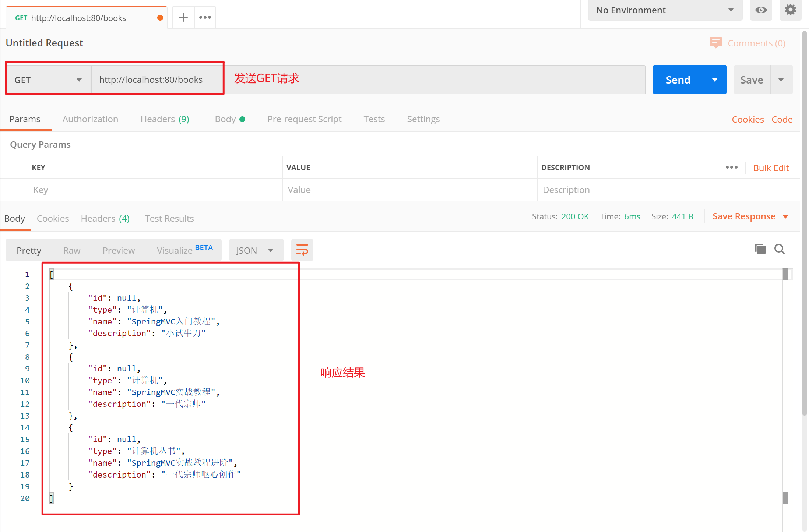

## 一、REST风格

### 1 REST简介 

#### 1.1 REST介绍

- **REST（Representational State Transfer）**，表现形式状态转换
  - 传统风格资源描述形式
    	http://localhost/user/getById?id=1
    	http://localhost/user/saveUser
  - **REST风格描述形式**
    	http://localhost/user/1
    	http://localhost/user
- 优点：
  - 隐藏资源的访问行为，无法通过地址得知对资源是何种操作
  - 书写简化

#### 1.2 RESTful介绍

- 按照REST风格访问资源时使用 **行为动作** 区分对资源进行了何种操作
  http://localhost/users		查询全部用户信息					GET（查询）
  http://localhost/users/1		查询指定用户信息				GET（查询）
  http://localhost/users		添加用户信息							POST（新增/保存）
  http://localhost/users		修改用户信息							PUT（修改/更新）
  http://localhost/users/1		删除用户信息						DELETE（删除）
- 根据**REST风格**对资源进行访问称为**RESTful**

#### 1.3 注意事项

- 上述行为是**约定方式**，约定不是规范，可以打破，所以称**REST风格**，而不是REST规范

- 描述模块的名称通常使用复数，也就是加s的格式描述，表示此类资源，而非单个资源，例如：users、books、accounts……

  

### 2 RESTful入门案例

#### 2.1 快速入门

做法：在Controller中定义方法时设定**"http请求动作(请求方式)"**和**"设定请求参数（路径变量）"**

```java
@Controller
public class UserController {

    //设置当前请求方法为POST，表示REST风格中的添加操作
    @RequestMapping(value = "/users",method = RequestMethod.POST)
    @ResponseBody
    public String save(){
        System.out.println("user save...");
        return "{'module':'user save'}";
    }

    //设置当前请求方法为DELETE，表示REST风格中的删除操作
    //@PathVariable注解用于设置路径变量（路径参数），要求路径上设置对应的占位符，并且占位符名称与方法形参名称相同
    @RequestMapping(value = "/users/{id}",method = RequestMethod.DELETE)
    @ResponseBody
    public String delete(@PathVariable Integer id){
        System.out.println("user delete..." + id);
        return "{'module':'user delete'}";
    }

    //设置当前请求方法为PUT，表示REST风格中的修改操作
    @RequestMapping(value = "/users",method = RequestMethod.PUT)
    @ResponseBody
    public String update(@RequestBody User user){
        System.out.println("user update..."+user);
        return "{'module':'user update'}";
    }

    //设置当前请求方法为GET，表示REST风格中的查询操作
    //@PathVariable注解用于设置路径变量（路径参数），要求路径上设置对应的占位符，并且占位符名称与方法形参名称相同
    @RequestMapping(value = "/users/{id}" ,method = RequestMethod.GET)
    @ResponseBody
    public String getById(@PathVariable Integer id){
        System.out.println("user getById..."+id);
        return "{'module':'user getById'}";
    }

    //设置当前请求方法为GET，表示REST风格中的查询操作
    @RequestMapping(value = "/users",method = RequestMethod.GET)
    @ResponseBody
    public String getAll(){
        System.out.println("user getAll...");
        return "{'module':'user getAll'}";
    }
}
```

#### 2.2 @PathVariable介绍

- 名称：**@PathVariable**
- 类型：形参注解
- 位置：SpringMVC控制器方法形参定义前面
- 作用：绑定路径参数与处理器方法形参间的关系，要求路径参数名与形参名一一对应


#### 2.3 @RequestBody、@RequestParam、@PathVariable区别和应用

- 区别
  **@RequestParam**用于接收 url地址传参 或 表单传参
  **@RequestBody**用于接收 json数据
  **@PathVariable**用于接收 路径参数，使用 `{参数名称}` 描述路径参数
- 应用
  - 后期开发中，发送请求参数超过1个时，以json格式为主，@RequestBody应用较广
  - 如果发送非json格式数据，选用@RequestParam接收请求参数
  - 采用RESTful进行开发，当参数数量较少时，例如1个，可以采用@PathVariable接收请求路径变量，通常用于传递id值


### 3 REST快速开发【重点】

#### 3.1 代码中的问题


> 以上截图中的代码和我们之前写的UserController中的方法类似，其中图中两个方法都有三处是有问题的，可以进行优化。存在的问题如下：

问题1：每个方法的@RequestMapping注解中都定义了访问路径/books，重复性太高。

问题2：每个方法的@RequestMapping注解中都要使用method属性定义请求方式，重复性太高。

问题3：每个方法响应json都需要加上@ResponseBody注解，重复性太高。

#### 3.2 Rest快速开发

> 解决以上三个问题

**解决问题1**：在**Controller类**上使用@RequestMapping定义共同的访问路径。

```java
@Controller
@RequestMapping("/books")
public class BookController {
    
    @RequestMapping(method = RequestMethod.POST)
    public String save(@RequestBody Book book){
        System.out.println("book save..." + book);
        return "{'module':'book save'}";
    }
    @RequestMapping(value = "/{id}" ,method = RequestMethod.DELETE)
    public String delete(@PathVariable Integer id){
        System.out.println("book delete..." + id);
        return "{'module':'book delete'}";
    }
    @RequestMapping(method = RequestMethod.PUT)
    public String update(@RequestBody Book book){
        System.out.println("book update..."+book);
        return "{'module':'book update'}";
    }
    @RequestMapping(value = "/{id}" ,method = RequestMethod.GET)
    public String getById(@PathVariable Integer id){
        System.out.println("book getById..."+id);
        return "{'module':'book getById'}";
    }

    @RequestMapping(method = RequestMethod.GET)
    public String getAll(){
        System.out.println("book getAll...");
        return "{'module':'book getAll'}";
    }
}
```

**解决问题2**：使用**@GetMapping  @PostMapping  @PutMapping  @DeleteMapping**代替@RequestMapping(method=RequestMethod.XXX)

```java
@Controller   
@RequestMapping("/books")
public class BookController {

//    @RequestMapping( method = RequestMethod.POST)
    @PostMapping//使用@PostMapping简化Post请求方法对应的映射配置
    public String save(@RequestBody Book book){
        System.out.println("book save..." + book);
        return "{'module':'book save'}";
    }

//    @RequestMapping(value = "/{id}" ,method = RequestMethod.DELETE)
    @DeleteMapping("/{id}")  //使用@DeleteMapping简化DELETE请求方法对应的映射配置
    public String delete(@PathVariable Integer id){
        System.out.println("book delete..." + id);
        return "{'module':'book delete'}";
    }

//    @RequestMapping(method = RequestMethod.PUT)
    @PutMapping   //使用@PutMapping简化Put请求方法对应的映射配置
    public String update(@RequestBody Book book){
        System.out.println("book update..."+book);
        return "{'module':'book update'}";
    }

//    @RequestMapping(value = "/{id}" ,method = RequestMethod.GET)
    @GetMapping("/{id}")    //使用@GetMapping简化GET请求方法对应的映射配置
    public String getById(@PathVariable Integer id){
        System.out.println("book getById..."+id);
        return "{'module':'book getById'}";
    }

//    @RequestMapping(method = RequestMethod.GET)
    @GetMapping      //使用@GetMapping简化GET请求方法对应的映射配置
    public String getAll(){
        System.out.println("book getAll...");
        return "{'module':'book getAll'}";
    }
}
```

- 名称：@GetMapping  @PostMapping  @PutMapping  @DeleteMapping
- 类型：方法注解
- 位置：基于SpringMVC的RESTful开发控制器方法定义上方
- 作用：设置当前控制器方法请求访问路径与请求动作，每种对应一个请求动作，例如@GetMapping对应GET请求
- 属性：
  value（默认）：请求访问路径


**解决问题3**：在**Controller类**上使用**@RestController**注解，等同于@Controller与@ResponseBody两个注解组合功能

```java
@RestController     //使用@RestController注解替换@Controller与@ResponseBody注解，简化书写
@RequestMapping("/books")
public class BookController {
    //方法省略了没写
}
```

- 名称：**@RestController**
- 类型：类注解
- 位置：基于SpringMVC的RESTful开发控制器类定义上方
- 作用：设置当前控制器类为RESTful风格，等同于@Controller与@ResponseBody两个注解组合功能


### 4案例：基于RESTful页面数据交互

#### 4.1 案例效果和环境准备

##### 4.1.1 案例效果


##### 4.1.2 环境准备

```java
//POJO实体类
public class Book {
    private Integer id;
    private String type;
    private String name;
    private String description;
    //同学们自己重写getter、setter、toString()方法...
}

//SpringMVC容器初始化类
public class ServletContainersInitConfig extends AbstractAnnotationConfigDispatcherServletInitializer {
    protected Class<?>[] getRootConfigClasses() {
        return new Class[0];
    }

    protected Class<?>[] getServletConfigClasses() {
        return new Class[]{SpringMvcConfig.class};
    }

    protected String[] getServletMappings() {
        return new String[]{"/"};
    }
    //乱码处理
    @Override
    protected Filter[] getServletFilters() {
        CharacterEncodingFilter filter = new CharacterEncodingFilter();
        filter.setEncoding("UTF-8");
        return new Filter[]{filter};
    }
}

//SpringMVC配置类
@Configuration
@ComponentScan({"com.itheima.controller","com.itheima.config"})
@EnableWebMvc
public class SpringMvcConfig {
}
```

#### 4.2 代码实现

##### 4.2.1 制作SpringMVC控制器，并通过PostMan测试接口功能

```java
@RestController
@RequestMapping("/books")
public class BookController {

    @PostMapping
    public String save(@RequestBody Book book){
        System.out.println("book save ==> "+ book);
        return "{'module':'book save success'}";
    }

    @GetMapping
    public List<Book> getAll(){
        System.out.println("book getAll is running ...");
        List<Book> bookList = new ArrayList<Book>();

        Book book1 = new Book();
        book1.setType("计算机");
        book1.setName("SpringMVC入门教程");
        book1.setDescription("小试牛刀");
        bookList.add(book1);

        Book book2 = new Book();
        book2.setType("计算机");
        book2.setName("SpringMVC实战教程");
        book2.setDescription("一代宗师");
        bookList.add(book2);

        Book book3 = new Book();
        book3.setType("计算机丛书");
        book3.setName("SpringMVC实战教程进阶");
        book3.setDescription("一代宗师呕心创作");
        bookList.add(book3);

        return bookList;
    }
}
```



##### 4.2.2 设置对静态资源的访问放行

```java
@Configuration
public class SpringMvcSupport extends WebMvcConfigurationSupport {
    //设置静态资源访问过滤，当前类需要设置为配置类，并被扫描加载
    @Override
    protected void addResourceHandlers(ResourceHandlerRegistry registry) {
        //当访问/pages/???? 时候，从/pages目录下查找内容
        registry.addResourceHandler("/pages/**")
            .addResourceLocations("/pages/");
        registry.addResourceHandler("/js/**")
            .addResourceLocations("/js/");        		
        registry.addResourceHandler("/css/**")
            .addResourceLocations("/css/");       
        registry.addResourceHandler("/plugins/**")
            .addResourceLocations("/plugins/");
    }
}
```

##### 4.2.3 前端页面通过异步提交访问后台控制器

```javascript
//添加
saveBook () {
    axios.post("/books",this.formData).then((res)=>{

    });
},
//主页列表查询
getAll() {
    axios.get("/books").then((res)=>{
        this.dataList = res.data;
    });
},
```

