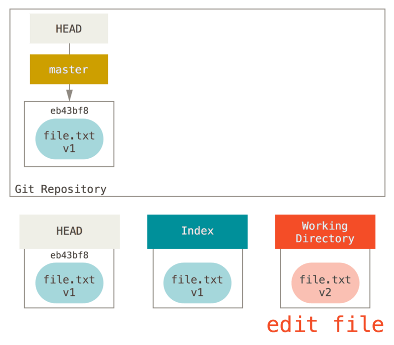
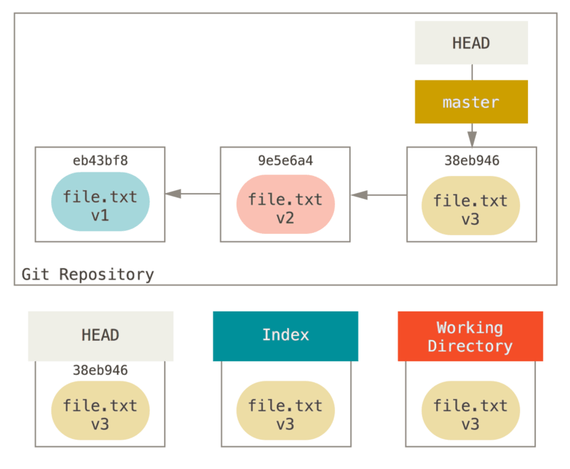
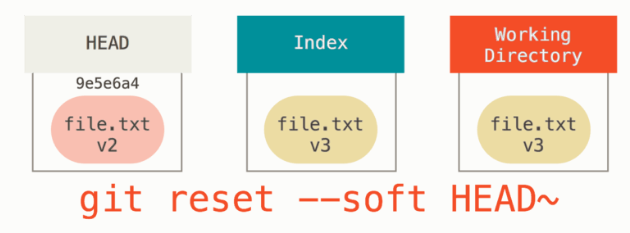
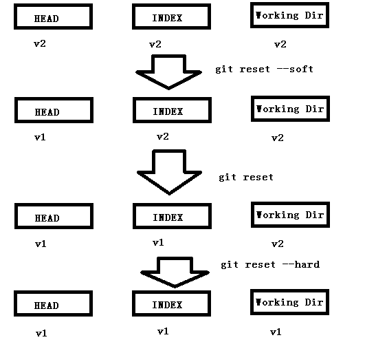

# 目录

[TOC]

# 三种状态

## 已提交（committed）

已提交表示数据已经安全地保存在本地数据库中。

## 已修改（modified）

已修改表示修改了文件，但还没保存到数据库中。

## 已暂存（staged）

已暂存表示对一个已修改文件的当前版本做了标记，使之包含在下次提交的快照中。


这会让我们的 Git 项目拥有三个阶段：工作区、暂存区以及 Git 目录。


 

上述三种状态分别对应着下面的区域：

## 工作区

​	是对项目的某个版本独立提取出来的内容。 这些从 Git 仓库的压缩数据库中提取出来的文件，放在磁盘上供你使用或修改。

## 暂存区

​	是一个文件，保存了下次将要提交的文件列表信息，一般在 Git 仓库目录中。 按照 Git 的术语叫做“索引”，不过一般说法还是叫“暂存区”。

## Git 仓库目录

​	是 Git 用来保存项目的元数据和对象数据库的地方。 这是 Git 中最重要的部分，从其它计算机克隆仓库时，复制的就是这里的数据。  

------

# 初次运行 Git 前的配置

Git 自带一个 **git config** 的工具来帮助设置控制 Git 外观和行为的配置变量。 这些变量存储在三个不同的位置：

1. ***/etc/gitconfig***文件: 包含系统上每一个用户及他们仓库的通用配置。 如果在执行 `git config` 时带上`--system` 选项，那么它就会读写该文件中的配置变量。 （由于它是系统配置文件，因此你需要管理员或超级用户权限来修改它。）

   

2. **~/.gitconfig** 或 ***~/.config/git/config*** 文件：只针对当前用户。 你可以传递 `--global` 选项让 Git读写此文件，这会对你系统上 所有的仓库生效。

3. 当前使用仓库的 Git 目录中的 config 文件（即 ***.git/config***）

   针对该仓库。 你可以传递 `--local` 选项让 Git 强制读写此文件，虽然默认情况下用的就是它。（当然，你需要进入某个 Git 仓库中才能让该选项生效。）

每一个级别会覆盖上一级别的配置，所以 ***.git/config*** 的配置变量会覆盖 ***/etc/gitconfig*** 中的配置变量。


你可以通过以下命令查看所有的配置以及它们所在的文件：

```shell
git config --list --show-orig  
```

# 获取帮助

```shell
git help <verb>
git <verb> --help
man git-<verb>  
```
获取简略的帮助手册使用：

```shell

git <verb> -h
```


# 初始化Git仓库

## 1.`git init` 

​	初始化git 代码仓库

## 2.`git add fileName`

​	把要进行版本控制的文件加入到git仓库中

## 3.`git commit -m "message"`

​	提交


# 文件的状态变化周期

 


# clone 现有的仓库

## 	`git clone  <url>`

或者重命名

## 	`git clone <url> newName`


# `git add` 

​	 这是个多功能命令：可以用它开始跟踪新文件，或者把已跟踪的文件放到暂存区，还能用于合并时把有冲突的文件标记为已解决状态等。 将这个命令理解为“**精确地将内容添加到下一次提交中**”而不是“将一个文件添加到版本控制中”要更加合适。

​	`git commit`  只会对暂存区中的文件做快照

​	

# .gitignore 文件

格式：

- 所有空行或者以 **#** 开头的行都会被 Git 忽略。

- 匹配模式可以以（**/**）开头防止递归。

  ```
  # 只忽略当前目录下的 TODO 文件，而不忽略 subdir/TODO
  /TODO
  ```
  
- 匹配模式可以以（**/**）结尾指定目录。

  ```
  # 忽略任何目录下名为 build 的文件夹
  build/
  ```

- 要忽略指定模式以外的文件或目录，可以在模式前加上叹号（**!**）取反。

  ```
  # 跟踪所有的 lib.a
  !lib.a
  ```

-  星号（`*`）匹配零个或多个任意字符

  ```
  # 忽略所有的 .a 文件
  *.a
  ```

- `[abc]` 匹配任何一个列在方括号中的字符 （这个例子要么匹配一个 a，要么匹配一个 b，要么匹配一个 c） 

- 问号（`?`）只匹配一个任意字符

- 如果在方括号中使用短划线分隔两个字符， 表示所有在这两个字符范围内的都可以匹配（比如 `[0-9]` 表示匹配所有 0 到 9 的数字）。 

- 使用两个星号（`**`）表示匹配任意中间目录，比如 `a/**/z` 可以匹配 `a/z` 、 `a/b/z` 或 `a/b/c/z` 等。

  ```
  # 忽略 doc/ 目录及其所有子目录下的 .pdf 文件
  doc/**/*.pdf
  ```

**Note**

GitHub 有一个十分详细的针对数十种项目及语言的 `.gitignore` 文件列表， 你可以在 https://github.com/github/gitignore 找到它。


# `git diff` （待修改）

此命令比较的是工作目录中当前文件和暂存区域快照之间的差异。 也就是修改之后**还没有暂存**起来的变化内容。


## `git diff --staged（--cached）`

​	 查看已暂存的将要添加到下次提交里的内容


# 跳过使用暂存区域(`git commit -a`)	

​	尽管使用暂存区域的方式可以精心准备要提交的细节，但有时候这么做略显繁琐。 Git 提供了一个跳过使用暂存区域的方式， 只要在提交的时候，给 `git commit` 加上 `-a` 选项，Git 就会自动把所有已经跟踪过的文件暂存起来一并提交，从而跳过 `git add` 步骤：


# 移除文件

## 	`git rm` 

​	在工作目录以及git仓库中一并删除（可恢复）。

​	如果要删除之前修改过或已经放到暂存区的文件，则必须使用强制删除选项 `-f`

​	

## 	`git rm --cached filename`

​	让文件保留在磁盘，但是并不想让 Git 继续跟踪。 当你忘记添加 `.gitignore` 文件，不小心把一个很大的日志文件或一堆 `.a` 这样的编译生成文件添加到暂存区时，这一做法尤其有用。 为达到这一目的，使用 `--cached` 选项


# 移动文件

## 	`git mv file_from file_to`

​	运行 `git mv` 就相当于运行了下面三条命令：

```console
$ mv README.md README
$ git rm README.md
$ git add README
```


# 查看提交历史

## 1. `git log`

​	不传入任何参数的默认情况下，`git log` 会按时间先后顺序列出所有的提交，最近的更新排在最上面。 正如你所看到的，这个命令会列出每个提交的 SHA-1 校验和、作者的名字和电子邮件地址、提交时间以及提交说明。

## 2. `git log -p(--patch)` `-n`

​	它会显示每次提交所引入的差异（按 **补丁** 的格式输出）。 你也可以限制显示的日志条目数量，例如使用 `-2` 选项来只显示最近的两次提交

## 3. `git log --stat`

​	查看每次提交的简略统计信息

`-stat` 选项在每次提交的下面列出所有被修改过的文件、有多少文件被修改了以及被修改过的文件的哪些行被移除或是添加了。 在每次提交的最后还有一个总结。

## 4.`git log --pretty=(oneline|short|full|fuller)`

​	这个选项可以使用不同于默认格式的方式展示提交历史

## 5.`git log --pretty=format:"格式化字符串"`

```sh
$ git log --pretty=format:"%h - %an, %ar : %s"
ca82a6d - Scott Chacon, 6 years ago : changed the version number
085bb3b - Scott Chacon, 6 years ago : removed unnecessary test
a11bef0 - Scott Chacon, 6 years ago : first commit
```

`git log --pretty=format` 常用的选项

| 选项  | 说明                                          |
| ----- | --------------------------------------------- |
| `%H`  | 提交的完整哈希值                              |
| `%h`  | 提交的简写哈希值                              |
| `%T`  | 树的完整哈希值                                |
| `%t`  | 树的简写哈希值                                |
| `%P`  | 父提交的完整哈希值                            |
| `%p`  | 父提交的简写哈希值                            |
| `%an` | 作者名字                                      |
| `%ae` | 作者的电子邮件地址                            |
| `%ad` | 作者修订日期（可以用 --date=选项 来定制格式） |
| `%ar` | 作者修订日期，按多久以前的方式显示            |
| `%cn` | 提交者的名字                                  |
| `%ce` | 提交者的电子邮件地址                          |
| `%cd` | 提交日期                                      |
| `%cr` | 提交日期（距今多长时间）                      |
| `%s`  | 提交说明                                      |

​	ps:*作者* 和 *提交者* 之间差别:其实作者指的是实际作出修改的人，提交者指的是最后将此工作成果提交到仓库的人。 所以，当你为某个项目发布补丁，然后某个核心成员将你的补丁并入项目时，你就是作者，而那个核心成员就是提交者。

## 6.`git log` 的常用选项

| 选项              | 说明                                                         |
| :---------------- | ------------------------------------------------------------ |
| `-p`              | 按补丁格式显示每个提交引入的差异。                           |
| `--stat`          | 显示每次提交的文件修改统计信息。                             |
| `--shortstat`     | 只显示 --stat 中最后的行数修改添加移除统计。                 |
| `--name-only`     | 仅在提交信息后显示已修改的文件清单。                         |
| `--name-status`   | 显示新增、修改、删除的文件清单。                             |
| `--abbrev-commit` | 仅显示 SHA-1 校验和所有 40 个字符中的前几个字符。            |
| `--relative-date` | 使用较短的相对时间而不是完整格式显示日期（比如“2 weeks ago”）。 |
| `--graph`         | 在日志旁以 ASCII 图形显示分支与合并历史。                    |
| `--pretty`        | 使用其他格式显示历史提交信息。可用的选项包括 oneline、short、full、fuller 和 format（用来定义自己的格式）。 |
| `--oneline`       | `--pretty=oneline --abbrev-commit` 合用的简写。              |

## 7.过滤提交历史结果

​	

## 8.隐藏合并提交

按照你代码仓库的工作流程，记录中可能有为数不少的合并提交，它们所包含的信息通常并不多。 为了避免显示的合并提交弄乱历史记录，可以为 `log` 加上 `--no-merges` 选项。


# 撤销操作

## 1.`git commit --amend`

​	有时候我们提交完了才发现漏掉了几个文件没有添加，或者提交信息写错了，又或者发现代码少写了一行。 此时，可以运行带有 `--amend` 选项的提交命令来重新提交。这个命令会将暂存区中的文件提交。 如果自上次提交以来你还未做任何修改（例如，在上次提交后马上执行了此命令）， 那么快照会保持不变，而你所修改的只是提交信息。

​	例如，你提交后发现忘记了暂存某些需要的修改，可以像下面这样操作：

```console
$ git commit -m 'initial commit'
$ git add forgotten_file
$ git commit --amend
```

最终你只会有一个提交——第二次提交将代替第一次提交的结果。

**PS**:当你在修补最后的提交时，与其说是修复旧提交，倒不如说是完全用一个 **新的提交** 替换旧的提交， 理解这一点非常重要。从效果上来说，就像是旧有的提交从未存在过一样，它并不会出现在仓库的历史中。

修补提交最明显的价值是可以稍微改进你最后的提交，而不会让“啊，忘了添加一个文件”或者 “小修补，修正笔误”这种提交信息弄乱你的仓库历史。

## 2.取消暂存的文件（`git reset`）

​	`git reset <file>` 可以把加入暂存区中的文件取消暂存。

​	`git reset` 取消暂存所有文件

`git reset` 确实是个危险的命令，如果加上了 `--hard` 选项则更是如此。 然而在上述场景中，工作目录中的文件尚未修改，因此相对安全一些。

git reset详细用法见后面。


## 3.撤消对文件的修改(`git checkout -- <file>`)

​	**NOTE** :请务必记得 `git checkout -- <file>` 是一个危险的命令。 你对那个文件在本地的任何修改都会消失——Git 会用最近提交的版本覆盖掉它。 除非你确实清楚不想要对那个文件的本地修改了，否则请不要使用这个命令。

​	记住，在 Git 中任何 **已提交** 的东西几乎总是可以恢复的。 甚至那些被删除的分支中的提交或使用 `--amend` 选项覆盖的提交也可以恢复 （阅读 [数据恢复](https://git-scm.com/book/zh/v2/ch00/_data_recovery) 了解数据恢复）。 然而，任何你未提交的东西丢失后很可能再也找不到了。


# 远程仓库(`git remote`)

### 	PS：远程仓库可以在你的本地主机上

你完全可以在一个“远程”仓库上工作，而实际上它在你本地的主机上。 词语“远程”未必表示仓库在网络或互联网上的其它位置，而只是表示它在别处。 在这样的远程仓库上工作，仍然需要和其它远程仓库上一样的标准推送、拉取和抓取操作。


### 1.查看远程仓库(`git remote (-v)`)

#### 	`git remote`

​	 	它会列出你指定的每一个远程服务器的简写。 如果你已经克隆了自己的仓库，那么至少应该能看到 origin ——这是 Git 给你克隆的仓库服务器的默认名字。

#### 	`git remote -v`

​		选项 `-v`，会显示需要读写远程仓库使用的 Git 保存的简写与其对应的 URL。

### 2.`git remote add <shortname> <url>`

​	 运行 `git remote add <shortname> <url>` 添加一个新的远程 Git 仓库，同时指定一个方便使用的简写

```console
$ git remote
origin
$ git remote add pb https://github.com/paulboone/ticgit
$ git remote -v
origin	https://github.com/schacon/ticgit (fetch)
origin	https://github.com/schacon/ticgit (push)
pb	https://github.com/paulboone/ticgit (fetch)
pb	https://github.com/paulboone/ticgit (push)
```

现在你可以在命令行中使用字符串 `pb` 来代替整个 URL。


### 3.`git fetch <shortname>`

​	如果你想拉取 Paul 的仓库中有但你没有的信息，可以运行 `git fetch pb`：

```console
$ git fetch pb
remote: Counting objects: 43, done.
remote: Compressing objects: 100% (36/36), done.
remote: Total 43 (delta 10), reused 31 (delta 5)
Unpacking objects: 100% (43/43), done.
From https://github.com/paulboone/ticgit
 * [new branch]      master     -> pb/master
 * [new branch]      ticgit     -> pb/ticgit
```

这个命令会访问远程仓库，从中拉取所有你还没有的数据。 执行完成后，你将会拥有那个远程仓库中所有分支的引用，可以随时合并或查看。

必须注意 `git fetch` 命令只会将数据下载到你的本地仓库——它并不会自动合并或修改你当前的工作。 当准备好时你必须手动将其合并入你的工作。

### 4.推送到远程仓库（`git push <remote> <localBranch>`）

​	当你想分享你的项目时，必须将其推送到上游。

​	你想要将 `master` 分支推送到 `origin` 服务器时（再次说明，克隆时通常会自动帮你设置好那两个名字）， 那么运行这个命令就可以将你所做的备份到服务器：

```console
$ git push origin master
```

只有当你有所克隆服务器的写入权限，并且之前没有人推送过时，这条命令才能生效。 当你和其他人在同一时间克隆，他们先推送到上游然后你再推送到上游，你的推送就会毫无疑问地被拒绝。 你必须先抓取他们的工作并将其合并进你的工作后才能推送。

### 5.查看某个远程仓库（`git remote show <remote>`）

​	如果想要查看某一个远程仓库的更多信息，可以使用 `git remote show <remote>` 命令。 如果想以一个特定的缩写名运行这个命令，例如 `origin`，会得到像下面类似的信息：

```console
$ git remote show origin
* remote origin
  Fetch URL: https://github.com/schacon/ticgit
  Push  URL: https://github.com/schacon/ticgit
  HEAD branch: master
  Remote branches:
    master                               tracked
    dev-branch                           tracked
  Local branch configured for 'git pull':
    master merges with remote master
  Local ref configured for 'git push':
    master pushes to master (up to date)
```

它同样会列出远程仓库的 URL 与跟踪分支的信息。 这些信息非常有用，它告诉你正处于 `master` 分支，并且如果运行 `git pull`， 就会抓取所有的远程引用，然后将远程 `master` 分支合并到本地 `master` 分支。 它也会列出拉取到的所有远程引用。

这是一个经常遇到的简单例子。 如果你是 Git 的重度使用者，那么还可以通过 `git remote show` 看到更多的信息。

```console
$ git remote show origin
* remote origin
  URL: https://github.com/my-org/complex-project
  Fetch URL: https://github.com/my-org/complex-project
  Push  URL: https://github.com/my-org/complex-project
  HEAD branch: master
  Remote branches:
    master                           tracked
    dev-branch                       tracked
    markdown-strip                   tracked
    issue-43                         new (next fetch will store in remotes/origin)
    issue-45                         new (next fetch will store in remotes/origin)
    refs/remotes/origin/issue-11     stale (use 'git remote prune' to remove)
  Local branches configured for 'git pull':
    dev-branch merges with remote dev-branch
    master     merges with remote master
  Local refs configured for 'git push':
    dev-branch                     pushes to dev-branch                     (up to date)
    markdown-strip                 pushes to markdown-strip                 (up to date)
    master                         pushes to master                         (up to date)
```

这个命令列出了当你在特定的分支上执行 `git push` 会自动地推送到哪一个远程分支。 它也同样地列出了哪些远程分支不在你的本地，哪些远程分支已经从服务器上移除了， 还有当你执行 `git pull` 时哪些本地分支可以与它跟踪的远程分支自动合并。

### 6.远程仓库的重命名与移除

#### 	重命名

​	`git remote rename <oldname> <newname>`

#### 	移除

​	`git remote remove/rm <remote>`


# 打标签（`git tag`）

### 1.列出标签

#### 	`git tag` 

​		这个命令以字母顺序列出标签，但是它们显示的顺序并不重要。

#### 	`git tag -l(--list) <模式>`

​		按照特定的模式查找标签

```console
$ git tag -l "v1.8.5*"
v1.8.5
v1.8.5-rc0
v1.8.5-rc1
v1.8.5-rc2
v1.8.5-rc3
v1.8.5.1
v1.8.5.2
v1.8.5.3
v1.8.5.4
v1.8.5.5
```

​	**PS**:按照通配符列出标签需要 `-l` 或 `--list` 选项。

​	如果你只想要完整的标签列表，那么运行 `git tag` 就会默认假定你想要一个	列表，它会直接给你列出来， 此时的 `-l` 或 `--list` 是可选的。然而，如果	你提供了一个匹配标签名的通配模式，那么 `-l` 或 `--list` 就是强制使用		的。

### 2.Git 支持两种标签：轻量标签（lightweight）与附注标签（annotated）。

​	***轻量标签***很像一个不会改变的分支——它只是某个特定提交的引用。

​	***附注标签***是存储在 Git 数据库中的一个完整对象， 它们是可以被校验的，其中包含打标签者的名字、电子邮件地址、日期时间， 此外还有一个标签信息，并且可以使用 GNU Privacy Guard （GPG）签名并验证。

​	 通常会建议创建附注标签，这样你可以拥有以上所有信息。但是如果你只是想用一个临时的标签， 或者因为某些原因不想要保存这些信息，那么也可以用轻量标签。

### 3.创建标签

#### 	附注标签（`git tag -a <tag> -m <message>`）

```console
$ git tag -a v1.4 -m "my version 1.4"
$ git tag
v0.1
v1.3
v1.4
```

​		`-m` 选项指定了一条将会存储在标签中的信息。 如果没有为附注标签指定一条信息，Git 会启动编辑器要求你输入信息。

​		`git show <tag>` 命令可以看到标签信息和与之对应的提交信息：打标签者的信息、打标签的日期时间、附注信息，然后显示具体的提交信息。

#### 	轻量标签（`git tag <tag>`）

​	轻量标签本质上是将提交校验和存储到一个文件中——没有保存任何其他信息。

​	这时，如果在标签上运行 `git show <tag>`，你不会看到额外的标签信息。 命令只会显示出提交信息。

### 4.后期打标签(`git tag (-a) <tag> <hash>`)

​	`$ git tag v1.2 9fceb02` 对之前的版本 `9fceb02`  打标签

### 5.共享标签（`git push <remote> <tagname> `）

​		默认情况下，`git push` 命令并不会传送标签到远程仓库服务器上。 在创建完标签后你必须显式地推送标签到共享服务器上。

​	例如：`$ git push origin v1.5`


##### 	`git push <remote> --tags`

​		例如： `$ git push origin --tags`

​		如果想要一次性推送很多标签，也可以使用带有 `--tags` 选项的 `git push` 命令。 这将会把所有不在远程仓库服务器上的标签全部传送到那里。

​		**NOTE**:`git push` 推送两种标签

​		使用 `git push <remote> --tags` 推送标签并不会区分轻量标签和附注标签， 没有简单的选项能够让你只选择推送一种标签。

### 6.删除标签（`git tag -d <tag>`）

​	**e.g.:**`$ git tag -d v1.4-lw`

​	上述命令并不会从任何远程仓库中移除这个标签。

##### 	删除远程仓库中的标签：

###### 		A. `git  push <remote> : refs/tags/<tag>`

​			**e.g.:**`$ git push origin :refs/tags/v1.4-lw`

​			上面这种操作的含义是，将冒号前面的空值推送到远程标签名，从而高效地删除它。

###### 		B. `git push <remote> --delete <tagname>`

### 7.检出标签（`git checkout <tag>`）

​	如果你想查看某个标签所指向的文件版本，可以使用 `git checkout` 命令， 虽然这会使你的仓库处于“分离头指针（detached HEAD）”的状态——这个状态有些不好的副作用。

​	在“分离头指针”状态下，如果你做了某些更改然后提交它们，标签不会发生变化， 但你的新提交将不属于任何分支，并且将无法访问，除非通过确切的提交哈希才能访问。 因此，如果你需要进行更改，比如你要修复旧版本中的错误，那么通常需要创建一个新分支：

```console
$ git checkout -b version2 v2.0.0
Switched to a new branch 'version2'
```

​	如果在这之后又进行了一次提交，`version2` 分支就会因为这个改动向前移动， 此时它就会和 `v2.0.0` 标签稍微有些不同，这时就要当心了。

------


# Git 别名

#### 命令格式：`git config --global alias.<aliasName> <command>`

​	**e.g.:** `git config --global alias.unstage 'reset HEAD --'`

​			`git config --global alias.last 'log -1 HEAD'`

​			`git config --global alias.co checkout`

​		

​	**NOTE : ** 然而，你可能想要执行外部命令，而不是一个 Git 子命令。 如果是那样的话，可以在命令前面加入 `!` 符号。 如果你自己要写一些与 Git 仓库协作的工具的话，那会很有用。 我们现在演示将 `git visual` 定义为 `gitk` 的别名：

```console
$ git config --global alias.visual '!gitk'
```

------


# 三棵树

​	“树” 在我们这里的实际意思是 “文件的集合”，而不是指特定的数据结构。

| 树                | 用途                                 |
| :---------------- | :----------------------------------- |
| HEAD              | 上一次提交的快照，下一次提交的父结点 |
| Index             | 预期的下一次提交的快照               |
| Working Directory | 沙盒                                 |

### 1.HEAD

​	HEAD 是当前分支引用的指针，它总是指向该分支上的最后一次提交。 这表示 HEAD 将是下一次提交的父结点。 通常，理解 HEAD 的最简方式，就是将它看做 **该分支上的最后一次提交** 的快照。

### 2.索引（暂存区）

​	索引是你的 **预期的下一次提交**。 我们也会将这个概念引用为 Git 的“暂存区”，这就是当你运行 `git commit` 时 Git 看起来的样子。

### 3.工作目录（工作区）

​	上述两棵树以一种高效但并不直观的方式，将它们的内容存储在 `.git` 文件夹中。 

​	工作目录会将它们解包为实际的文件以便编辑。 你可以把工作目录当做 **沙盒**。在你将修改提交到暂存区并记录到历史之前，可以随意更改。

------


### 4.git 工作流程

​	经典的 Git 工作流程是通过操纵三个区域来以更加连续的状态记录项目快照的：


让我们来可视化这个过程：假设我们进入到一个新目录，其中有一个文件。 我们称其为该文件的 **v1** 版本，将它标记为蓝色。 现在运行 `git init`，这会创建一个 Git 仓库，其中的 HEAD 引用指向未创建的 `master` 分支。


此时，只有工作目录有内容。

现在我们想要提交这个文件，所以用 `git add` 来获取工作目录中的内容，并将其复制到索引中。


接着运行 `git commit`，它会取得索引中的内容并将它保存为一个永久的快照， 然后创建一个指向该快照的提交对象，最后更新 `master` 来指向本次提交。


此时如果我们运行 `git status`，会发现没有任何改动，因为现在三棵树完全相同。

现在我们想要对文件进行修改然后提交它。 我们将会经历同样的过程；首先在工作目录中修改文件。 我们称其为该文件的 **v2** 版本，并将它标记为红色。



如果现在运行 `git status`，我们会看到文件显示在 “Changes not staged for commit” 下面并被标记为红色，因为该条目在索引与工作目录之间存在不同。 接着我们运行 `git add` 来将它暂存到索引中。


此时，由于索引和 HEAD 不同，若运行 `git status` 的话就会看到 “Changes to be committed” 下的该文件变为绿色 ——也就是说，现在预期的下一次提交与上一次提交不同。 最后，我们运行 `git commit` 来完成提交。


现在运行 `git status` 会没有输出，因为三棵树又变得相同了。

**切换分支或克隆的过程也类似。 当检出一个分支时，它会修改 HEAD 指向新的分支引用，将 索引 填充为该次提交的快照， 然后将 索引 的内容复制到 工作目录 中。**

### 5.git reset

假设我们再次修改了 `file.txt` 文件并第三次提交它。 现在的历史看起来是这样的：



让我们跟着 `reset` 看看它都做了什么。 它以一种简单可预见的方式直接操纵这三棵树。 它做了三个基本操作：

#### 第 1 步：移动 HEAD

​	如果 HEAD 设置为 `master` 分支（例如，你正在 `master` 分支上）， 运行 `git reset 9e5e6a4` 将会使 `master` 指向 `9e5e6a4`：


**无论你调用了何种形式的带有一个提交的 `reset`，它首先都会尝试 使用 `reset --soft`**

它本质上是撤销了上一次 `git commit` 命令：



------

#### 第 2 步：更新索引（--mixed）

接下来，`reset` 会用 HEAD 指向的当前快照的内容来更新索引：


​	**如果指定 `--mixed` 选项，`reset` 将会在这时停止。 这也是默认行为，所以如果没有指定任何选项（在本例中只是 `git reset HEAD~`），这就是命令将会停止的地方。**

​	它依然会撤销一上次 `提交`，但还会 *取消暂存* 所有的东西。 于是，我们回滚到了所有 `git add` 和 `git commit` 的命令执行之前。

#### 第 3 步：更新工作目录（--hard）

​	`reset` 要做的的第三件事情就是让工作目录看起来像索引。

​	 **如果使用 `--hard` 选项，它将会继续这一步。**


​	你撤销了最后的提交、`git add` 和 `git commit` 命令 **以及** 工作目录中的所有工作。

​	**但是如果工作目录中增加了新文件，并不会把该文件删除。**

​	**必须注意，`--hard` 标记是 `reset` 命令唯一的危险用法，它也是 Git 会真正地销毁数据的仅有的几个操作之一。 其他任何形式的 `reset` 调用都可以轻松撤消，但是 `--hard` 选项不能，因为它强制覆盖了工作目录中的文件。 在这种特殊情况下，我们的 Git 数据库中的一个提交内还留有该文件的 v3 版本， 我们可以通过 `reflog` 来找回它。但是若该文件还未提交，Git 仍会覆盖它从而导致无法恢复。**

------

#### 通过路径来重置（`git reset <commit> <path>`）

​	前面讲述了 `reset` 基本形式的行为，不过你还可以给它提供一个作用路径。 若指定了一个路径，`reset` 将会跳过第 1 步，并且将它的作用范围限定为指定的文件或文件集合。 这样做自然有它的道理，因为 HEAD 只是一个指针，你无法让它同时指向两个提交中各自的一部分。 **不过索引和工作目录 *可以部分更新***，所以重置会继续进行第 2、3 步。

​	现在，假如我们运行 `git reset file.txt` （**这其实是 `git reset --mixed HEAD file.txt` 的简写形式**，因为你既没有指定一个提交的 SHA-1 或分支，也没有指定 `--soft` 或 `--hard`），它会：

1. 移动 HEAD 分支的指向 ***（已跳过）***
2. 让索引看起来像 HEAD ***（到此处停止）***


**所以它本质上只是将 `file.txt` 从 HEAD 复制到索引中。它还有 *取消暂存文件* 的实际效果。**

如果当前三棵树都是一致的状态，例如 **HEAD , INDEX ,工作目录** 都是V2，此时`git reset file.txt` 没有任何影响。

如果此时**HEAD** 为 v1，**INDEX** 和**工作目录** 为V2 （即 **file.txt** 已暂存），运行 `git reset file.txt` 则会取消**file.txt** 的暂存状态。这和 `git add file.txt` 是相反的：


------

​	我们可以不让 Git 从 HEAD 拉取数据，而是通过具体指定一个提交来拉取该文件的对应版本。 我们只需运行类似于 `git reset eb43bf file.txt` 的命令即可。


此时**INDEX** 中 **file.txt** 为v1，其他两个都是v3。

所以此时运行`git status` 会发现有一个to be commited 和一个 unstaged 。

还有一点同 `git add` 一样，就是 `reset` 命令也可以接受一个 `--patch` 选项来一块一块地取消暂存的内容。 这样你就可以根据选择来取消暂存或恢复内容了。

#### 压缩提交

假设你有一个项目，第一次提交中有一个文件，第二次提交增加了一个新的文件并修改了第一个文件，第三次提交再次修改了第一个文件。 由于第二次提交是一个未完成的工作，因此你想要压缩它。


那么可以运行 `git reset --soft HEAD~2` 来将 HEAD 分支移动到一个旧一点的提交上（即你想要保留的最近的提交）：


然后只需再次运行 `git commit`：


现在你可以查看可到达的历史，即将会推送的历史，现在看起来有个 v1 版 `file-a.txt` 的提交， 接着第二个提交将 `file-a.txt` 修改成了 v3 版并增加了 `file-b.txt`。 包含 v2 版本的文件已经不在历史中了。

------


### 6.总结(重要)

#### A.`git reset` , `git reset --soft`,`git reset --hard` 三者的区别

​	`reset` 命令会以特定的顺序重写三棵树，在你指定以下选项时停止：

1. 移动 HEAD 分支的指向 **（若指定了 `--soft`，则到此停止）**
2. 使索引变成 HEAD **（若指定 `--mixed` 或者 默认情况（`git reset`），则到此停止）**
3. 使工作目录变成索引**（若指定`--hard`）**

------

#### B.`git reset` 和 `git commit` 以及 `git add` 顺序问题。

如果是要提交：

三棵树则是按照如下顺序：


如果是reset：

三棵树则是相反的顺序：




------

#### C.`checkout` 和 `reset` 之间的区别

​	和 `reset` 一样，`checkout` 也操纵三棵树，不过它有一点不同，这取决于你是否传给该命令一个文件路径。

##### 	不带路径（`git checkout <commit>`）

​	运行 `git checkout [branch]` 与运行 `git reset --hard [branch]` 非常相似，它会更新所有三棵树使其看起来像 `[branch]`，不过有两点重要的区别：

1.`checkout` 对工作目录是安全的，它会通过检查来确保不会将已更改的文件弄丢。它会在工作目录中先试着简单合并一下，这样所有 *还未修改过的* 文件都会被更新。 而 `reset --hard` 则会不做检查就全面地替换所有东西。

2.**`reset` 会移动 HEAD所指的 分支的指向，而 `checkout` 只会移动 HEAD 自身来指向另一个分支**：

例如，假设我们有 `master` 和 `develop` 分支，它们分别指向不同的提交；我们现在在 `develop` 上（所以 HEAD 指向它）。 如果我们运行 `git reset master`，那么 `develop` 自身现在会和 `master` 指向同一个提交。 而如果我们运行 `git checkout master` 的话，`develop` 不会移动，HEAD 自身会移动。 现在 HEAD 将会指向 `master`。


##### 	带路径（`git checkout <commit> <file>`）

​	运行 `checkout` 的另一种方式就是指定一个文件路径，它不会移动 HEAD。 它就像 `git reset [commit] file` 那样用该次提交中的那个文件来更新索引，**但是它也会覆盖工作目录中对应的文件**。 它就像是 `git reset --hard [branch] file`（如果 `reset` 允许你这样运行的话）， 这样对工作目录并不安全，它也不会移动 HEAD。

​	此外，同 `git reset` 和 `git add` 一样，`checkout` 也接受一个 `--patch` 选项，允许你根据选择一块一块地恢复文件内容。

------

#### D.下面的速查表列出了命令对树的影响:


​	**“HEAD” 一列中的 “REF” 表示该命令移动了 HEAD 指向的分支引用，而 “HEAD” 则表示只移动了 HEAD 自身。 特别注意 *WD Safe?* 一列——如果它标记为 NO，那么运行该命令之前请考虑一下。**


#### E.`git diff` 用法解析

git diff 显示的是文件增量的结果，显示的是从 A 到 B应该做的修改。例如下文中：“查看 **INDEX**  和 **WD** 的区别”，指的是 INDEX中的内容到 WD中的内容应该做哪些修改。

##### 1.`git diff`（不加参数） 

​	查看 **INDEX**  和 **WD** 的区别

##### 2.`git diff --cached` （不加参数） 

​	查看 **HEAD** 和 **INDEX** 的区别

##### 3.`git diff HEAD` 

​	查看 **HEAD** 与  **WD** 两者的差别

##### 4.`git diff <commit/branch>` 

​	查看 对应的 commit 或者 branch 与 **WD**的区别

​	例如： `git diff test` 就是查看 test 分支与 **WD** 的区别

##### 5.`git diff <file>` 

​	查看 **INDEX**  和 **WD** 的区别 ，但是仅查看file 文件的改动

##### 6.`git diff HEAD [--] <file>`   

​	查看 **HEAD** 与  **WD**，但是仅查看 file 文件的改动。

##### 7.`git diff A B`

​	 A 和 B 为提交hash 或者分支。查看 A提交 和 B提交 的区别。如果后面加上 `-- file` 则仅查看 file文件的区别。

​	注意：这和 `git diff B A`  显示的内容是不同的。

​	例如 `git diff HEAD~ HEAD`，查看 **HEAD~** 和 **HEAD** 的区别。

##### 8.`git diff` 两点 和 三点  以及 `git log` 两点与三点

​	参见下图：

虚线箭头 指的是 diff 比较的两个提交 ， 绿色区域 则是log 所要显示的提交集合。

