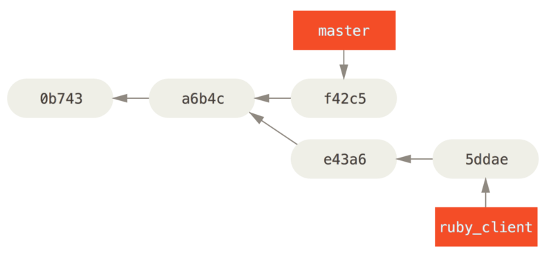

# 目录

[TOC]


# Git 进阶


## git 分支

### 1.git 如何保存数据

​	我们假设现在有一个工作目录，里面包含了三个将要被暂存和提交的文件。

​	 **暂存操作 ** 会为每一个文件计算校验和（SHA-1算法），然后会把当前版本的文件快照保存到 Git 仓库中 （Git 使用 ***blob* 对象**来保存它们），最终将校验和加入到暂存区域等待提交：

```sh
$ git add README test.rb LICENSE
$ git commit -m 'The initial commit of my project'
```

​	当使用 `git commit` 进行 **提交操作** 时，Git 会先计算每一个子目录（本例中只有项目根目录）的校验和， 然后在 Git 仓库中这些校验和保存为**树对象**。

​	随后，Git 便会创建一个**提交对象**， 它除了包含上面提到的那些信息外，还包含指向这个树对象（项目根目录）的指针。 如此一来，Git 就可以在需要的时候重现此次保存的快照。

现在，Git 仓库中有五个对象：三个 ***blob*** 对象（保存着文件快照）、一个 **树** 对象 （记录着目录结构和 blob 对象索引）以及一个 **提交** 对象（包含着指向前述树对象的指针和所有提交信息）。

​	首次提交对象及其树结构：


​	做些修改后再次提交，那么这次产生的提交对象会包含一个指向上次提交对象（父对象）的指针。（如图：）


**Git 的分支，其实本质上仅仅是指向提交对象的可变指针。 Git 的默认分支名字是 `master`。 在多次提交操作之后，你其实已经有一个指向最后那个提交对象的 `master` 分支。 `master` 分支会在每次提交时自动向前移动。**

​		**NOTE :**Git 的 `master` 分支并不是一个特殊分支。 它就跟其它分支完全没有区别。 之所以几乎每一个仓库都有 master 分支，是因为 `git init` 命令默认创建它，并且大多数人都懒得去改动它。


分支及其提交历史:


### 2.分支创建（`git branch <branchName>` ）

#### **`git branch <branchName>`**

​	Git 是怎么创建新分支的呢？ 很简单，它只是为你创建了一个可以移动的新的指针。 比如，创建一个 testing 分支， 你需要使用 `git branch` 命令：

```sh
$ git branch testing
```

这会在当前所在的提交对象上创建一个指针。

两个指向相同提交历史的分支：

​	


####  **HEAD指针**

​	Git 又是怎么知道当前在哪一个分支上呢？ 也很简单，它有一个名为 `HEAD` 的特殊指针。

​	在 Git 中，它是一个指针，指向当前所在的本地分支（译注：将 `HEAD` 想象为当前分支的别名）。 在本例中，你仍然在 `master` 分支上。 因为 `git branch` 命令仅仅 **创建** 一个新分支，并不会自动切换到新分支中去。

​	HEAD 指向当前所在的分支：


#### **`使用 git log --decorate` 查看各个分支当前所指的对象**

​	

### 3.分支切换（`git checkout <branchName>` ）

​	**e.g.:**`git checkout testing`这样 `HEAD` 就指向 `testing` 分支了：

​	

​	

​	

​	假如此时修改文件并重新提交一次：

```sh
$ vim test.rb
$ git commit -a -m 'made a change'
```

​	`testing` 分支向前移动了，但是 `master` 分支却没有，它仍然指向运行 `git checkout` 时所指的对象：


​	然后切换回master 分支：

```sh
$ git checkout master
```

​	此时HEAD 随之移动：

​		

​	这条命令做了两件事。 一是使 HEAD 指回 `master` 分支，二是将工作目录恢复成 `master` 分支所指向的快照内容。 也就是说，你现在做修改的话，项目将始于一个较旧的版本。 本质上来讲，这就是忽略 `testing` 分支所做的修改，以便于向另一个方向进行开发。

​	**NOTE:**分支切换会改变你工作目录中的文件

​		在切换分支时，一定要注意你工作目录里的文件会被改变。 如果是切换到		一个较旧的分支，你的工作目录会恢复到该分支最后一次提交时的样子。 		如果 Git 不能干净利落地完成这个任务，它将禁止切换分支。


​	假如此时再做修改并提交：

```sh
$ vim test.rb
$ git commit -a -m 'made other changes'
```

​	这个项目的提交历史已经产生了分叉。 因为刚才你创建了一个新分支，并切换过去进行了一些工作，随后又切换回 master 分支进行了另外一些工作。 上述两次改动针对的是不同分支：你可以在不同分支间不断地来回切换和工作，并在时机成熟时将它们合并起来：


##### 	`git log --oneline --decorate --graph --all`

​	它会输出你的提交历史、各个分支的指向以及项目的分支分叉情况：

```sh
$ git log --oneline --decorate --graph --all
* c2b9e (HEAD, master) made other changes
| * 87ab2 (testing) made a change
|/
* f30ab add feature #32 - ability to add new formats to the
* 34ac2 fixed bug #1328 - stack overflow under certain conditions
* 98ca9 initial commit of my project
```

​	**git 的分支实质上仅是包含所指对象校验和（长度为 40 的 SHA-1 值字符串）的文件，所以它的创建和销毁都异常高效。 创建一个新分支就相当于往一个文件中写入 41 个字节（40 个字符和 1 个换行符）**

### 4.创建新分支的同时切换过去（`git checkout -b <newbranchname>`）

​	通常我们会在创建一个新分支后立即切换过去，这可以用 `git checkout -b <newbranchname>` 一条命令搞定。

​	


------


### 5.分支合并（`git merge`）

​	假如现在有两个新分支：


​		

​	iss53 是修复53号问题所处的分支。

​	hotfix 是修复紧急bug 后所处的分支。

​	mater是现有版本所处的分支。


​	假如此时我们已修复好紧急bug， 想把 `hotfix` 分支合并回你的 `master` 分支来部署到线上，就可以使用 `git merge` 命令：

```sh
$ git checkout master
$ git merge hotfix
Updating f42c576..3a0874c
Fast-forward
 index.html | 2 ++
 1 file changed, 2 insertions(+)
```

#### 	


#### 	快进（fast -forward）

​		由于你想要合并的分支 `hotfix` 所指向的提交 `C4` 是你所在的提交 `C2` 的直接后继， 因此 Git 会直接将指针向前移动。换句话说，当你试图合并两个分支时， 如果顺着一个分支走下去能够到达另一个分支，那么 Git 在合并两者的时候， 只会简单的将指针向前推进（指针右移），因为这种情况下的合并操作没有需要解决的分歧——这就叫做 **“快进（fast-forward）”**。

​	git默认是打开了 快进 模式 ，如果要强制禁用快进模式，请使用：

​	`git merge --no-ff`

这样git 会创建一个新的提交来合并。


现在，最新的修改已经在 `master` 分支所指向的提交快照中，你可以着手发布该修复了。关于这个紧急bug的解决方案发布之后，你准备回到被打断之前时的工作中。 然而，你应该先删除 `hotfix` 分支，因为你已经不再需要它了 —— `master` 分支已经指向了同一个位置。 

#### 	**删除分支（`git branch -d <branchName>`）**

​		你可以使用带 `-d` 选项的 `git branch` 命令来删除分支：

```sh
$ git branch -d hotfix
Deleted branch hotfix (3a0874c).
```

​	

现在回到iss53分支继续工作：

```sh
$ git checkout iss53
Switched to branch "iss53"
$ vim index.html
$ git commit -a -m 'finished the new footer [issue 53]'
[iss53 ad82d7a] finished the new footer [issue 53]
1 file changed, 1 insertion(+)
```


假如此时已经修复好了53号问题，并且打算将你的工作合并入 `master` 分支。

为此，你需要合并 `iss53` 分支到 `master` 分支，这和之前你合并 `hotfix` 分支所做的工作差不多。 **你只需要检出到你想合并入的分支，然后运行 `git merge` 命令：**

```sh
$ git checkout master
Switched to branch 'master'
$ git merge iss53
Merge made by the 'recursive' strategy.
index.html |    1 +
1 file changed, 1 insertion(+)
```

在这种情况下，你的开发历史从一个更早的地方开始分叉开来（diverged）。 因为，`master` 分支所在提交并不是 `iss53` 分支所在提交的直接祖先，Git 不得不做一些额外的工作。 出现这种情况的时候，Git 会使用两个分支的末端所指的快照（`C4` 和 `C5`）以及这两个分支的公共祖先（`C2`），做一个简单的三方合并：


Git 将此次三方合并的结果做了一个新的快照并且自动创建一个新的提交指向它。 这个被称作一次合并提交，它的特别之处在于他有不止一个父提交：


既然你的修改已经合并进来了，就不再需要 `iss53` 分支了。 现在你可以在任务追踪系统中关闭此项任务，并删除这个分支。

```sh
$ git branch -d iss53
```

------


#### 遇到冲突时的分支合并

 		如果你在两个不同的分支中，对同一个文件的同一个部分进行了不同的修改，Git 就没法干净的合并它们。这时就会产生**合并冲突**。

​		 如果你对 #53 问题的修改和有关 `hotfix` 分支的修改都涉及到同一个文件的同一处，在合并它们的时候就会产生合并冲突：

```sh
$ git merge iss53
Auto-merging index.html
CONFLICT (content): Merge conflict in index.html
Automatic merge failed; fix conflicts and then commit the result.
```

​		你可以在合并冲突后的任意时刻使用 `git status` 命令来查看那些因包含合并冲突而处于未合并（unmerged）状态的文件。


​		 出现冲突的文件会包含一些特殊区段，看起来像下面这个样子：

```html
<<<<<<< HEAD:index.html
<div id="footer">contact : email.support@github.com</div>
=======
<div id="footer">
 please contact us at support@github.com
</div>
>>>>>>> iss53:index.html
```

`=======` 的上半部分 ： HEAD 所指的版本。

`=======` 的下半部分： `iss53` 分支所指示的版本。

为了解决冲突，你必须选择使用由 `=======` 分割的两部分中的一个，或者你也可以自行合并这些内容。`<<<<<<<` , `=======` , 和 `>>>>>>>` 这些行被完全删除。

在你解决了所有文件里的冲突之后，对每个文件使用 `git add` 命令来将其标记为冲突已解决。 一旦暂存这些原本有冲突的文件，Git 就会将它们标记为冲突已解决。

##### 	`git mergetool`

​	该命令会为你启动一个合适的可视化合并工具，并带领你一步一步解决这些冲突。等你退出合并工具之后，Git 会询问刚才的合并是否成功。 如果你回答是，Git 会暂存那些文件以表明冲突已解决： 你可以再次运行 `git status` 来确认所有的合并冲突都已被解决。

------

#### 中断一次合并（`git merge --abort`）

​	`git merge --abort` 选项会尝试恢复到你运行合并前的状态。 但当运行命令前，在工作目录中有未储藏、未提交的修改时它不能完美处理，除此之外它都工作地很好。

​	如果出于某些原因你想要重来一次，也可以运行 `git reset --hard HEAD` 回到上一次提交的状态。 请牢记此时任何未提交的工作都会丢失，所以请确认你不需要保留任何改动。

------

#### 忽略空白（`-Xignore-all-space` 或 `-Xignore-space-change` 选项）

​	第一个选项在比较行时 **完全忽略** 空白修改，第二个选项将一个空白符与多个连续的空白字符视作等价的。

```sh
$ git merge -Xignore-space-change whitespace
```

------

#### 撤销合并

 假设现在在一个主题分支上工作，不小心将其合并到 `master` 中，现在提交历史看起来是这样：


有两种方法来解决这个问题：

##### 1.`git reset --hard`

​	如果这个不想要的合并提交**只存在于你的本地仓库中**，大多数情况下，如果你在错误的 `git merge` 后运行 `git reset --hard HEAD~`，这会重置分支指向所以它们看起来像这样：


这个方法的缺点是它会重写历史，在一个共享的仓库中这会造成问题的。

##### 2.`git revert  `

​	这个命令会生成一个新的提交，这个新提交会撤销一个父提交所引入的修改。（只保留另一个）：

```sh
$ git revert -m 1 HEAD
[master b1d8379] Revert "Merge branch 'topic'"
```

  **`-m 1`** 标记指出 “mainline” 需要**被保留下来的父结点**。

​	 当你引入一个合并到 `HEAD`（`git merge topic`），新提交有两个父结点：第一个是 `HEAD`（`C6`），第二个是将要合并入分支的最新提交（`C4`）。 在本例中，我们想要撤消所有由父结点 #2（`C4`）合并引入的修改，同时保留从父结点 #1（`C6`）开始的所有内容。

有还原提交的历史看起来像这样：


新的提交 `^M` 与 `C6` 有完全一样的内容，所以从这儿开始就像合并从未发生过。

------

​	如果你在 `topic` 中增加工作然后再次合并，Git 只会引入被还原的合并 *之后* 的修改：


解决这个最好的方式是撤消还原原始的合并，因为现在你想要引入被还原出去的修改，**然后** 创建一个新的合并提交：

```sh
$ git revert ^M
[master 09f0126] Revert "Revert "Merge branch 'topic'""
$ git merge topic
```


 **在本例中，`M` 与 `^M` 抵消了。 `^^M` 事实上合并入了 `C3` 与 `C4` 的修改，`C8` 合并了 `C7` 的修改，所以现在 `topic` 已经完全被合并了。**


------

### 6.分支管理

#### 	`git branch`

​		如果不加任何参数运行它，会得到当前所有分支的一个列表。

```sh
$ git branch
  iss53
* master
  testing
```

------

#### 	`git branch -v`

​		查看每一个分支的最后一次提交。

```sh
$ git branch -v
  iss53   93b412c fix javascript issue
* master  7a98805 Merge branch 'iss53'
  testing 782fd34 add scott to the author list in the readmes
```

------

#### 	`git branch --merged`

​		查看那些分支合并到了当前分支

```sh
$ git branch --merged
  iss53
* master
```

在这个列表中分支名字前没有 * 号的分支通常可以使用 `git branch -d` 删除掉；你已经将它们的工作整合到了另一个分支，所以并不会失去任何东西。

------


#### 	`git branch --no-merged`

​		查看所有包含未合并工作的分支

​		这里显示的分支尝试使用 `git branch -d` 命令删除它时会失败。

​		如果真的想要删除分支并丢掉那些工作，如同帮助信息里所指出的，可以使用 `-D` 选项强制删除它。


**TIP：**上面描述的选项 `--merged` 和 `--no-merged` 会在没有给定提交或分支名作为参数时， 分别列出已合并或未合并到 **当前** 分支的分支。

你总是可以提供一个附加的参数来查看其它分支的合并状态而不必检出它们。 例如，尚未合并到 `master` 分支的有哪些？

```sh
$ git checkout testing
$ git branch --no-merged master
  topicA
  featureB
```

------


## 远程分支

### 1.**远程引用** 

​		是对远程仓库的引用（指针），包括分支、标签等等。 你可以通过 `git ls-remote <remote>` 来显式地获得远程引用的完整列表， 或者通过 `git remote show <remote>` 获得远程分支的更多信息。 

### 2.**远程跟踪分支** 

​		是远程分支状态的引用。它们是你无法移动的本地引用。一旦你进行了网络通信， Git 就会为你移动它们以精确反映远程仓库的状态。请将它们看做书签， 这样可以提醒你该分支在远程仓库中的位置就是你最后一次连接到它们的位置。

​	它们以 `<remote>/<branch>` 的形式命名。 例如，如果你想要看你最后一次与远程仓库 `origin` 通信时 `master` 分支的状态，你可以查看 `origin/master` 分支。 你与同事合作解决一个问题并且他们推送了一个 `iss53` 分支，你可能有自己的本地 `iss53` 分支， 然而在服务器上的分支会以 `origin/iss53` 来表示。

------

假设你的网络里有一个在 `git.ourcompany.com` 的 Git 服务器。 如果你从这里克隆，Git 的 `clone` 命令会为你自动将其命名为 `origin`，拉取它的所有数据， 创建一个指向它的 `master` 分支的指针，并且在本地将其命名为 `origin/master`。 Git 也会给你一个与 origin 的 `master` 分支在指向同一个地方的本地 `master` 分支，这样你就有工作的基础。


------

​		**NOTE:**“origin” 并无特殊含义

​		远程仓库名字 “origin” 与分支名字 “master” 一样，在 Git 中并没有任何特别		的含义一样。 同时 “master” 是当你运行 `git init` 时默认的起始分支名字，原因仅仅是它的广泛使用， “origin” 是当你运行 `git clone` 时默认的远程仓库名字。 如果你运行 `git clone -o booyah`，那么你默认的远程分支名字将会是 `booyah/master`。

------

​	如果你在本地的 `master` 分支做了一些工作，在同一段时间内有其他人推送提交到 `git.ourcompany.com` 并且更新了它的 `master` 分支，这就是说你们的提交历史已走向不同的方向。 即便这样，只要你保持不与 `origin` 服务器连接（并拉取数据），你的 `origin/master` 指针就不会移动。


​	如果要与给定的远程仓库同步数据，运行 `git fetch <remote>` 命令（在本例中为 `git fetch origin`）。 这个命令查找 “origin” 是哪一个服务器（在本例中，它是 `git.ourcompany.com`）， 从中抓取本地没有的数据，并且更新本地数据库，移动 `origin/master` 指针到更新之后的位置。


​	为了演示有多个远程仓库与远程分支的情况，我们假定你有另一个内部 Git 服务器，仅服务于你的某个敏捷开发团队。 这个服务器位于 `git.team1.ourcompany.com`。 你可以运行 `git remote add` 命令添加一个新的远程仓库引用到当前的项目。将这个远程仓库命名为 `teamone`，将其作为完整 URL 的缩写。


​	现在，可以运行 `git fetch teamone` 来抓取远程仓库 `teamone` 有而本地没有的数据。 因为那台服务器上现有的数据是 `origin` 服务器上的一个子集， 所以 Git 并不会抓取数据而是会设置远程跟踪分支 `teamone/master` 指向 `teamone` 的 `master` 分支。


------

### 	3.推送远程分支（`git push <remote> <branch>`）

​		如果希望和别人一起在名为 `serverfix` 的分支上工作，你可以像推送第一个分支那样推送它：

```sh
$ git push origin serverfix
```

​	这里有些工作被简化了。 **Git 自动将 `serverfix` 分支名字展开为 `refs/heads/serverfix:refs/heads/serverfix`， 那意味着，“推送本地的 `serverfix` 分支来更新远程仓库上的 `serverfix` 分支。”**

​	你也可以运行 `git push origin serverfix:serverfix`， 它会做同样的事——也就是说“推送本地的 `serverfix` 分支，将其作为远程仓库的 `serverfix` 分支” 可以通过这种格式来推送本地分支到一个命名不相同的远程分支。 如果并不想让远程仓库上的分支叫做 `serverfix`，可以运行 `git push origin serverfix:awesomebranch` 来将本地的 `serverfix` 分支推送到远程仓库上的 `awesomebranch` 分支。

​		

------

### 4.跟踪分支

​	从一个远程跟踪分支检出一个本地分支会自动创建所谓的 **“跟踪分支”** （它跟踪的分支叫做 **“上游分支”** ）。 跟踪分支是与远程分支有直接关系的本地分支。 如果在一个跟踪分支上输入 `git pull`，Git 能自动地识别去哪个服务器上抓取、合并到哪个分支。

#### `git checkout -b <branch> <remote>/<branch>`：

​	当克隆一个仓库时，它通常会自动地创建一个跟踪 `origin/master` 的 `master` 分支。

​	 **运行 `git checkout -b <branch> <remote>/<branch>`  创建了一个新分支并且该分支跟踪远程仓库 *remote* 的 *branch* 分支，并切换到这个新创建的分支**

 这是一个十分常用的操作所以 Git 提供了 `--track` 快捷方式：

```sh
$ git checkout --track origin/serverfix
Branch serverfix set up to track remote branch serverfix from origin.
Switched to a new branch 'serverfix'
```

由于这个操作太常用了，该捷径本身还有一个捷径。 如果你尝试检出的分支 (a) 不存在且 (b) 刚好只有一个名字与之匹配的远程分支，那么 Git 就会为你创建一个跟踪分支：

```sh
$ git checkout serverfix
Branch serverfix set up to track remote branch serverfix from origin.
Switched to a new branch 'serverfix'
```

如果想要将本地分支与远程分支设置为不同的名字，你可以轻松地使用上一个命令增加一个不同名字的本地分支：

```sh
$ git checkout -b sf origin/serverfix
Branch sf set up to track remote branch serverfix from origin.
Switched to a new branch 'sf'
```

**现在，本地分支 `sf` 会自动从 `origin/serverfix` 拉取。**

------


#### `git branch (-u|--set-upstream-to) <remote>/<branch>`:

​	设置已有的本地分支跟踪一个刚刚拉取下来的远程分支，或者想要修改正在跟踪的上游分支， 你可以在任意时间使用 `-u` 或 `--set-upstream-to` 选项运行 `git branch` 来显式地设置。

```sh
$ git branch -u origin/serverfix
Branch serverfix set up to track remote branch serverfix from origin.
```

#### 上游快捷方式

当设置好跟踪分支后，可以通过简写 `@{upstream}` 或 `@{u}` 来引用它的上游分支。 所以在 `master` 分支时并且它正在跟踪 `origin/master` 时，如果愿意的话可以使用 `git merge @{u}` 来取代 `git merge origin/master`

------

#### `git branch -vv`：

​	如果想要查看设置的所有跟踪分支，可以使用 `git branch` 的 `-vv` 选项。 这会将所有的本地分支列出来并且包含更多的信息，如每一个分支正在跟踪哪个远程分支与本地分支是否是领先、落后或是都有。

```sh
$ git branch -vv
  iss53     7e424c3 [origin/iss53: ahead 2] forgot the brackets
  master    1ae2a45 [origin/master] deploying index fix
* serverfix f8674d9 [teamone/server-fix-good: ahead 3, behind 1] this should do it
  testing   5ea463a trying something new
```

​	这里可以看到 `iss53` 分支正在跟踪 `origin/iss53` 并且 “ahead” 是 2，意味着本地有两个提交还没有推送到服务器上。 也能看到 `master` 分支正在跟踪 `origin/master` 分支并且是最新的。 接下来可以看到 `serverfix` 分支正在跟踪 `teamone` 服务器上的 `server-fix-good` 分支并且领先 3 落后 1， 意味着服务器上有一次提交还没有合并入同时本地有三次提交还没有推送。 最后看到 `testing` 分支并没有跟踪任何远程分支。

​	需要重点注意的一点是这些数字的值来自于你从每个服务器上最后一次抓取的数据。 这个命令并没有连接服务器，它只会告诉你关于本地缓存的服务器数据。 如果想要统计最新的领先与落后数字，需要在运行此命令前抓取所有的远程仓库。 可以像这样做：

```sh
$ git fetch --all; git branch -vv
```

------

#### 拉取（`git fetch`）

​	当 `git fetch` 命令从服务器上抓取本地没有的数据时，它并不会修改工作目录中的内容。 它只会获取数据然后让你自己合并。 然而，有一个命令叫作 `git pull` 在大多数情况下它的含义是一个 `git fetch` 紧接着一个 `git merge` 命令。 如果有一个像之前章节中演示的设置好的跟踪分支，不管它是显式地设置还是通过 `clone` 或 `checkout` 命令为你创建的，`git pull` 都会查找当前分支所跟踪的服务器与分支， 从服务器上抓取数据然后尝试合并入那个远程分支。

​	**由于 `git pull` 的魔法经常令人困惑所以通常单独显式地使用 `fetch` 与 `merge` 命令会更好一些。**

------

### 删除远程分支（`git push --delete <branch>`）

​	假设你已经通过远程分支做完所有的工作了——也就是说你和你的协作者已经完成了一个特性， 并且将其合并到了远程仓库的 `master` 分支（或任何其他稳定代码分支）。 可以运行带有 `--delete` 选项的 `git push` 命令来删除一个远程分支。 如果想要从服务器上删除 `serverfix` 分支，运行下面的命令：

```sh
$ git push origin --delete serverfix
To https://github.com/schacon/simplegit
 - [deleted]         serverfix
```

基本上这个命令做的只是从服务器上移除这个指针。 Git 服务器通常会保留数据一段时间直到垃圾回收运行，所以如果不小心删除掉了，通常是很容易恢复的。

------


## 变基

### 1.概念

​		假如有如下的分支：

​	

​		你可以提取在 `C4` 中引入的补丁和修改，然后在 `C3` 的基础上应用一次。 在 Git 中，这种操作就叫做 **变基（rebase）**。

### 2.`git rebase <branchName>`

​	你可以使用 `rebase` 命令将提交到某一分支上的所有修改都移至另一分支上，就好像“重新播放”一样。

在这个例子中，你可以检出 `experiment` 分支，然后将它变基到 `master` 分支上：

```sh
$ git checkout experiment
$ git rebase master
First, rewinding head to replay your work on top of it...
Applying: added staged command
```

​	它的 **原理 ** 是首先找到这两个分支（即当前分支 `experiment`、变基操作的目标基底分支 `master`） 的最近共同祖先 `C2`，然后对比当前分支相对于该祖先的历次提交，提取相应的修改并存为临时文件， 然后将当前分支指向目标基底 `C3`, 最后以此将之前另存为临时文件的修改依序应用


现在回到 `master` 分支，进行一次快进合并。

```sh
$ git checkout master
$ git merge experiment
```


### 3.rebase 和 merge 的区别：

​	这两种整合方法的最终结果没有任何区别，但是变基使得提交历史更加整洁。 你在查看一个经过变基的分支的历史记录时会发现，尽管实际的开发工作是并行的， 但它们看上去就像是串行的一样，提交历史是一条直线没有分叉。

​	无论是通过变基，还是通过三方合并，整合的最终结果所指向的快照始终是一样的，只不过提交历史不同罢了。 变基是将一系列提交按照原有次序依次应用到另一分支上，而合并是把最终结果合在一起。

### 4.`git rebase --onto `

​	假如有如下的提交图：


假设你希望将 `client` 中的修改合并到主分支并发布，但暂时并不想合并 `server` 中的修改， 因为它们还需要经过更全面的测试。这时，你就可以使用 `git rebase` 命令的 `--onto` 选项， 选中在 `client` 分支里但不在 `server` 分支里的修改（即 `C8` 和 `C9`），将它们在 `master` 分支上重放：

```sh
$ git rebase --onto master server client
```

**以上命令的意思是：“取出 `client` 分支，找出它从 `server` 分支分歧之后的补丁， 然后把这些补丁在 `master` 分支上重放一遍，让 `client` 看起来像直接基于 `master` 修改一样”。**


现在可以快进合并 `master` 分支了。

```sh
$ git checkout master
$ git merge client
```


### 5.`git rebase <basebranch> <topicbranch>`

接下来你决定将 `server` 分支中的修改也整合进来。 使用 `git rebase <basebranch> <topicbranch>` 命令可以直接将主题分支 （即本例中的 `server`）变基到目标分支（即 `master`）上。 这样做能省去你先切换到 `server` 分支，再对其执行变基命令的多个步骤。

```sh
$ git rebase master server
```


```sh
$ git checkout master
$ git merge server
```

至此，`client` 和 `server` 分支中的修改都已经整合到主分支里了， 你可以删除这两个分支，最终提交历史会变成图中的样子：

```sh
$ git branch -d client
$ git branch -d server
```


------

### 6.变基的风险

​		使用变基得遵守一条准则：

***如果提交存在于你的仓库之外，而别人可能基于这些提交进行开发，那么不要执行变基。***

​	让我们来看一个在公开的仓库上执行变基操作所带来的问题。 假设你从一个中央服务器克隆然后在它的基础上进行了一些开发。 你的提交历史如图所示：


然后，某人又向中央服务器提交了一些修改，其中还包括一次合并。 你抓取了这些在远程分支上的修改，并将其合并到你本地的开发分支，然后你的提交历史就会变成这样：


接下来，这个人又决定把合并操作回滚，改用变基；继而又用 `git push --force` 命令覆盖了服务器上的提交历史。 之后你从服务器抓取更新，会发现多出来一些新的提交：


结果就是你们两人的处境都十分尴尬。 如果你执行 `git pull` 命令，你将合并来自两条提交历史的内容，生成一个新的合并提交，最终仓库会如图所示：


此时如果你执行 `git log` 命令，你会发现有两个提交的作者、日期、日志居然是一样的，这会令人感到混乱。 此外，如果你将这一堆又推送到服务器上，你实际上是将那些已经被变基抛弃的提交又找了回来，这会令人感到更加混乱。 很明显对方并不想在提交历史中看到 `C4` 和 `C6`，因为之前就是他把这两个提交通过变基丢弃的。

------

#### 	用变基解决变基

如果你 **真的** 遭遇了类似的处境，Git 还有一些高级魔法可以帮到你。 如果团队中的某人强制推送并覆盖了一些你所基于的提交，你需要做的就是检查你做了哪些修改，以及他们覆盖了哪些修改。

实际上，Git 除了对整个提交计算 SHA-1 校验和以外，也对本次提交所引入的修改计算了校验和——即 “patch-id”。

如果你拉取被覆盖过的更新并将你手头的工作基于此进行变基的话，一般情况下 Git 都能成功分辨出哪些是你的修改，并把它们应用到新分支上。

举个例子，如果遇到前面提到的有人推送了经过变基的提交，并丢弃了你的本地开发所基于的一些提交那种情境，如果我们不是执行合并，而是执行 `git rebase teamone/master`, Git 将会：

- 检查哪些提交是我们的分支上独有的（C2，C3，C4，C6，C7）
- 检查其中哪些提交不是合并操作的结果（C2，C3，C4）
- 检查哪些提交在对方覆盖更新时并没有被纳入目标分支（只有 C2 和 C3，因为 C4 其实就是 C4'）
- 把查到的这些提交应用在 `teamone/master` 上面

从而我们将得到与 你将相同的内容又合并了一次，生成了一个新的提交 中不同的结果，如图 在一个被变基然后强制推送的分支上再次执行变基 所示。


Figure 48. 在一个被变基然后强制推送的分支上再次执行变基

要想上述方案有效，还需要对方在变基时确保 `C4'` 和 `C4` 是几乎一样的。 否则变基操作将无法识别，并新建另一个类似 `C4` 的补丁（而这个补丁很可能无法整洁的整合入历史，因为补丁中的修改已经存在于某个地方了）。

在本例中另一种简单的方法是使用 `git pull --rebase` 命令而不是直接 `git pull`。 又或者你可以自己手动完成这个过程，先 `git fetch`，再 `git rebase teamone/master`。

如果你习惯使用 `git pull` ，同时又希望默认使用选项 `--rebase`，你可以执行这条语句 `git config --global pull.rebase true` 来更改 `pull.rebase` 的默认配置。

如果你只对不会离开你电脑的提交执行变基，那就不会有事。 如果你对已经推送过的提交执行变基，但别人没有基于它的提交，那么也不会有事。 如果你对已经推送至共用仓库的提交上执行变基命令，并因此丢失了一些别人的开发所基于的提交， 那你就有大麻烦了，你的同事也会因此鄙视你。

如果你或你的同事在某些情形下决意要这么做，请一定要通知每个人执行 `git pull --rebase` 命令，这样尽管不能避免伤痛，但能有所缓解。

#### 	变基 vs. 合并

至此，你已在实战中学习了变基和合并的用法，你一定会想问，到底哪种方式更好。 在回答这个问题之前，让我们退后一步，想讨论一下提交历史到底意味着什么。

有一种观点认为，仓库的提交历史即是 **记录实际发生过什么**。 它是针对历史的文档，本身就有价值，不能乱改。 从这个角度看来，改变提交历史是一种亵渎，你使用 *谎言* 掩盖了实际发生过的事情。 如果由合并产生的提交历史是一团糟怎么办？ 既然事实就是如此，那么这些痕迹就应该被保留下来，让后人能够查阅。

另一种观点则正好相反，他们认为提交历史是 **项目过程中发生的事**。 没人会出版一本书的第一版草稿，软件维护手册也是需要反复修订才能方便使用。 持这一观点的人会使用 `rebase` 及 `filter-branch` 等工具来编写故事，怎么方便后来的读者就怎么写。

现在，让我们回到之前的问题上来，到底合并还是变基好？希望你能明白，这并没有一个简单的答案。 Git 是一个非常强大的工具，它允许你对提交历史做许多事情，但每个团队、每个项目对此的需求并不相同。 既然你已经分别学习了两者的用法，相信你能够根据实际情况作出明智的选择。

总的原则是，只对尚未推送或分享给别人的本地修改执行变基操作清理历史， 从不对已推送至别处的提交执行变基操作，这样，你才能享受到两种方式带来的便利。

------

## 服务器上的git（选读）

URL : https://git-scm.com/book/zh/v2/%E6%9C%8D%E5%8A%A1%E5%99%A8%E4%B8%8A%E7%9A%84-Git-%E5%8D%8F%E8%AE%AE

------

## 分布式Git

### 集中式工作流

​	集中式系统中通常使用的是单点协作模型——集中式工作流。 一个中心集线器，或者说 **仓库**，可以接受代码，所有人将自己的工作与之同步。 若干个开发者则作为节点，即中心仓库的消费者与中心仓库同步。


​	例如 John 和 Jessica 同时开始工作。 John 完成了他的修改并推送到服务器。 接着 Jessica 尝试提交她自己的修改，却遭到服务器拒绝。 她被告知她的修改正通过非快进式（non-fast-forward）的方式推送，只有将数据抓取下来并且合并后方能推送。 这种模式的工作流程的使用非常广泛，因为大多数人对其很熟悉也很习惯。

### 集成管理者工作流

这一流程的工作方式如下所示：

1. 项目维护者推送到主仓库。
2. 贡献者克隆此仓库，做出修改。
3. 贡献者将数据推送到自己的公开仓库。
4. 贡献者给维护者发送邮件，请求拉取自己的更新。
5. 维护者在自己本地的仓库中，将贡献者的仓库加为远程仓库并合并修改。
6. 维护者将合并后的修改推送到主仓库。


### 主管与副主管工作流

​	被称为 **副主管（lieutenant）** 的各个集成管理者分别负责集成项目中的特定部分。 所有这些副主管头上还有一位称为 **主管（dictator）** 的总集成管理者负责统筹。 主管维护的仓库作为参考仓库，为所有协作者提供他们需要拉取的项目代码。 整个流程看起来是这样的：

1. 普通开发者在自己的主题分支上工作，并根据 `master` 分支进行变基。 这里是主管推送的参考仓库的 `master` 分支。
2. 副主管将普通开发者的主题分支合并到自己的 `master` 分支中。
3. 主管将所有副主管的 `master` 分支并入自己的 `master` 分支中。
4. 最后，主管将集成后的 `master` 分支推送到参考仓库中，以便所有其他开发者以此为基础进行变基。


------

### 维护项目

##### 1.应用来自邮件的补丁

###### `git apply `

​		如果你收到了一个使用 `git diff` 或 Unix `diff` 命令的变体（不推荐使用这种方式，具体见下一节） 创建的补丁，可以使用 `git apply` 命令来应用。 假设你将补丁保存在了 `/tmp/patch-ruby-client.patch` 中，可以这样应用补丁：

```sh
$ git apply /tmp/patch-ruby-client.patch
```

​		它与运行 `patch -p1` 命令来应用补丁几乎是等效的，但是这种方式更加严格，相对于 patch 来说，它能够接受的模糊匹配更少。 它也能够处理 `git diff` 格式文件所描述的文件添加、删除和重命名操作，而 `patch` 则不会。 最后，`git apply` 命令采用了一种“全部应用，否则就全部撤销（apply all or abort all）”的模型， 即补丁只有全部内容都被应用和完全不被应用两个状态，而 `patch` 可能会导致补丁文件被部分应用， 最后使你的工作目录保持在一个比较奇怪的状态。 总体来看，`git apply` 命令要比 `patch` 谨慎得多。 并且，它不会为你创建提交——在运行之后，你需要手动暂存并提交补丁所引入的更改。

###### `git apply --check`

​		在实际应用补丁前，你还可以使用 git apply 来检查补丁是否可以顺利应用——即对补丁运行 `git apply --check` 命令：

```sh
$ git apply --check 0001-seeing-if-this-helps-the-gem.patch
error: patch failed: ticgit.gemspec:1
error: ticgit.gemspec: patch does not apply
```

如果没有产生输出，则该补丁可以顺利应用。 

######  `git am` 命令

​	如果补丁的贡献者也是一个 Git 用户，并且其能熟练使用 `format-patch` 命令来生成补丁，这样的话你的工作会变得更加轻松，因为这种补丁中包含了作者信息和提交信息供你参考。 如果可能的话，请鼓励贡献者使用 `format-patch` 而不是 `diff` 来为你生成补丁。 而只有对老式的补丁，你才必须使用 `git apply` 命令。

​	要应用一个由 `format-patch` 命令生成的补丁，你应该使用 `git am` 命令 （该命令的名字 `am` 表示它“应用（Apply）一系列来自邮箱（Mailbox）的补丁”）。 从技术的角度看，`git am` 是为了读取 mbox 文件而构建的， mbox 是一种用来在单个文本文件中存储一个或多个电子邮件消息的简单纯文本格式。 其大致格式如下所示：

```sh
From 330090432754092d704da8e76ca5c05c198e71a8 Mon Sep 17 00:00:00 2001
From: Jessica Smith <jessica@example.com>
Date: Sun, 6 Apr 2008 10:17:23 -0700
Subject: [PATCH 1/2] add limit to log function

Limit log functionality to the first 20
```

 	如果有人使用 `git send-email` 命令将补丁以电子邮件的形式发送给你， 你便可以将它下载为 mbox 格式的文件，之后将 git am 命令指向该文件，它会应用其中包含的所有补丁。 如果你所使用的邮件客户端能够同时将多封邮件保存为 mbox 格式的文件， 你甚至能够将一系列补丁打包为单个 mbox 文件，并利用 `git am` 命令将它们一次性全部应用。

​	然而，如果贡献者将 `git format-patch` 生成的补丁文件上传到工单系统或类似的任务处理系统， 你可以先将其保存到本地，之后通过 `git am` 来应用补丁：

```sh
$ git am 0001-limit-log-function.patch

```

​	但是，有时候无法顺利地应用补丁。

​	该命令将会在所有出现问题的文件内加入冲突标记，就和发生冲突的合并或变基操作一样。 而你解决问题的手段很大程度上也是一样的——即手动编辑那些文件来解决冲突，暂存新的文件， 之后运行 `git am --resolved` 继续应用下一个补丁：

```sh
$ (fix the file)
$ git add ticgit.gemspec
$ git am --resolved
Applying: seeing if this helps the gem
```

​	如果你希望 Git 能够尝试以更加智能的方式解决冲突，你可以对其传递 `-3` 选项来使 Git 尝试进行三方合并：

###### `git am -3 <patch>`

​	如果你正在利用一个 mbox 文件应用多个补丁，也可以在交互模式下运行 `am` 命令：

###### `git am -3 -i mbox`

##### 2.检出远程分支

​		如果你的贡献者建立了自己的版本库，并且向其中推送了若干修改， 之后将版本库的 URL 和包含更改的远程分支发送给你，那么你可以将其添加为一个远程分支，并且在本地进行合并。

比如 Jessica 向你发送了一封电子邮件，内容是在她的版本库中的 `ruby-client` 分支中有一个很不错的新功能， 为了测试该功能，你可以将其添加为一个远程分支，并在本地检出：

```sh
$ git remote add jessica git://github.com/jessica/myproject.git
$ git fetch jessica
$ git checkout -b rubyclient jessica/ruby-client
```

##### 3.拣选（`git cherry-pick <hash>`）

​	 Git 中的拣选类似于对特定的某次提交的变基。 它会提取该提交的补丁，之后尝试将其重新应用到当前分支上。 这种方式在你只想引入主题分支中的某个提交，或者主题分支中只有一个提交，而你不想运行变基时很有用。 举个例子，假设你的项目提交历史类似：

​	

如果你希望将提交 `e43a6` 拉取到 `master` 分支，你可以运行：

```sh
$ git cherry-pick e43a6
Finished one cherry-pick.
[master]: created a0a41a9: "More friendly message when locking the index fails."
 3 files changed, 17 insertions(+), 3 deletions(-)
```

这样会拉取和 `e43a6` 相同的更改，但是因为应用的日期不同，你会得到一个新的提交 SHA-1 值。 现在你的历史会变成这样：


现在你可以删除这个主题分支，并丢弃不想拉入的提交。

##### 4.生成构建号（`git describe <branch>`）

​	`git describe` 命令会生成一个字符串， 它由最近的标签名、自该标签之后的提交数目和你所描述的提交的部分 SHA-1 值（前缀的 `g` 表示 Git）构成：

```sh
$ git describe master
v1.6.2-rc1-20-g8c5b85c
```

##### 5.准备一次发布(`git archive`)

现在你可以发布一个构建了。 其中一件事情就是为那些不使用 Git 的可怜包们创建一个最新的快照归档。 使用 `git archive` 命令完成此工作：

```sh
$ git archive master --prefix='project/' | gzip > `git describe master`.tar.gz
$ ls *.tar.gz
v1.6.2-rc1-20-g8c5b85c.tar.gz
```

如果有人将这个压缩包解压，他就可以在一个 `project` 目录中得到你项目的最新快照。 你也可以以类似的方式创建一个 zip 压缩包，但此时你应该向 `git archive` 命令传递 `--format=zip` 选项：

```sh
$ git archive master --prefix='project/' --format=zip > `git describe master`.zip
```

现在你有了本次发布的一个 tar 包和一个 zip 包，可以将其上传到网站或以电子邮件的形式发送给人们。

## Git工具

### 1.选择修订版本

#### 简短的SHA-1：`git show <hash>`

​		在本例中，假设你想要的提交其 SHA-1 以 `1c002dd....` 开头， 那么你可以用如下几种 `git show` 的变体来检视该提交（假设简短的版本没有歧义）：

```sh
$ git show 1c002dd4b536e7479fe34593e72e6c6c1819e53b
$ git show 1c002dd4b536e7479f
$ git show 1c002d
```

#### 分支引用 ： `git show <branchName>`

​		引用特定提交的一种直接方法是，若它是一个分支的顶端的提交， 那么可以在任何需要引用该提交的 Git 命令中直接使用该分支的名称。 例如，你想要查看一个分支的最后一次提交的对象，假设 `topic1` 分支指向提交 `ca82a6d...` ， 那么以下的命令是等价的：

```sh
$ git show ca82a6dff817ec66f44342007202690a93763949
$ git show topic1
```

#### 引用日志：`git reflog`

​	Git 会在后台保存一个引用日志（reflog）， 引用日志记录了最近几个月你的 HEAD 和分支引用所指向的历史。

```sh
$ git reflog
734713b HEAD@{0}: commit: fixed refs handling, added gc auto, updated
d921970 HEAD@{1}: merge phedders/rdocs: Merge made by the 'recursive' strategy.
1c002dd HEAD@{2}: commit: added some blame and merge stuff
1c36188 HEAD@{3}: rebase -i (squash): updating HEAD
```

​	每当你的 HEAD 所指向的位置发生了变化，Git 就会将这个信息存储到引用日志这个历史记录里。 你也可以通过 reflog 数据来获取之前的提交历史。 如果你想查看仓库中 HEAD 在五次前的所指向的提交，你可以使用 `@{n}` 来引用 reflog 中输出的提交记录。

##### ` git show HEAD@{5}`

每当你的 HEAD 所指向的位置发生了变化，Git 就会将这个信息存储到引用日志这个历史记录里。 你也可以通过 reflog 数据来获取之前的提交历史。 如果你想查看仓库中 HEAD 在五次前的所指向的提交，你可以使用 `@{n}` 来引用 reflog 中输出的提交记录。

​	你同样可以使用这个语法来查看某个分支在一定时间前的位置。 例如，查看你的 `master` 分支在昨天的时候指向了哪个提交，你可以输入

##### `git show master@{yesterday}`

**NOTE :**值得注意的是，引用日志只存在于本地仓库，它只是一个记录你在 **自己** 的仓库里做过什么的日志。 其他人拷贝的仓库里的引用日志不会和你的相同，而你新克隆一个仓库的时候，引用日志是空的，因为你在仓库里还没有操作。 `git show HEAD@{2.months.ago}` 这条命令只有在你克隆了一个项目至少两个月时才会显示匹配的提交—— 如果你刚刚克隆了仓库，那么它将不会有任何结果返回。

#### 祖先引用：`git show HEAD^`

​	祖先引用是另一种指明一个提交的方式。 如果你在引用的尾部加上一个 `^`（脱字符）， Git 会将其解析为该引用的上一个提交。

​	在 Windows 上转义脱字符

在 Windows 的 `cmd.exe` 中，`^` 是一个特殊字符，因此需要区别对待。 你可以双写它或者将提交引用放在引号中：

```sh
$ git show HEAD^     # 在 Windows 上无法工作
$ git show HEAD^^    # 可以
$ git show "HEAD^"   # 可以
```

你也可以在 `^` 后面添加一个数字来指明想要 **哪一个** 父提交——例如 `d921970^2` 代表 “d921970 的第二父提交” 这个语法只适用于合并的提交，因为合并提交会有多个父提交。 合并提交的第一父提交是你合并时所在分支（通常为 `master`），而第二父提交是你所合并的分支（例如 `topic`）

###### 	另一种指明祖先提交的方法是 `~`（波浪号）。

​		同样是指向第一父提交，因此 `HEAD~` 和 `HEAD^` 是等价的。 而区别在于你在后面加数字的时候。 `HEAD~2` 代表“第一父提交的第一父提交”，也就是“祖父提交”——Git 会根据你指定的次数获取对应的第一父提交。

​	也可以写成 `HEAD~~~`，也是第一父提交的第一父提交的第一父提交。

### 2.提交区间

#### 	双点

​	例如，你有如下的提交历史：


​	你想要查看 experiment 分支中还有哪些提交尚未被合并入 master 分支。 你可以使用  **master..experiment**  来让 Git 显示这些提交。也就是**“在 experiment 分支中而不在 master 分支中的提交”**。 为了使例子简单明了，我使用了示意图中提交对象的字母来代替真实日志的输出，所以会显示：

```sh
$ git log master..experiment
D
C
```

​	反过来，如果你想查看在 `master` 分支中而不在 `experiment` 分支中的提交，你只要交换分支名即可。 `experiment..master` 会显示在 `master` 分支中而不在 `experiment` 分支中的提交：

```sh
$ git log experiment..master
F
E
```

​	

------

​	另一个常用的场景是查看你即将推送到远端的内容：

```sh
$ git log origin/master..HEAD
```

​	这个命令会输出在你当前分支中而不在远程 `origin` 中的提交。 如果你执行 `git push` 并且你的当前分支正在跟踪 `origin/master`，由 `git log origin/master..HEAD` 所输出的提交就是会被传输到远端服务器的提交。如果你留空了其中的一边， Git 会默认为 `HEAD`。 例如， `git log origin/master..` 将会输出与之前例子相同的结果 —— Git 使用 HEAD 来代替留空的一边。

#### 多点

​	双点语法很好用，但有时候你可能需要两个以上的分支才能确定你所需要的修订， 比如查看哪些提交是被包含在某些分支中的一个，但是不在你当前的分支上。 Git 允许你在任意引用前加上 `^` 字符或者 `--not` 来指明你不希望提交被包含其中的分支。 因此下列三个命令是等价的：

```sh
$ git log refA..refB
$ git log ^refA refB
$ git log refB --not refA
```

这个语法很好用，因为你可以在查询中指定超过两个的引用，这是双点语法无法实现的。 比如，你想查看所有被 `refA` 或 `refB` 包含的但是不被 `refC` 包含的提交，你可以使用以下任意一个命令：

```sh
$ git log refA refB ^refC
$ git log refA refB --not refC
```

这就构成了一个十分强大的修订查询系统，你可以通过它来查看你的分支里包含了哪些东西。

#### 三点

​	最后一种主要的区间选择语法是三点，这个语法可以选择出被两个引用 **之一** 包含但又不被两者同时包含的提交。 再看看之前双点例子中的提交历史。 如果你想看 `master` 或者 `experiment` 中包含的但不是两者共有的提交，你可以执行：

```sh
$ git log master...experiment
F
E
D
C
```

这和通常 `log` 按日期排序的输出一样，仅仅给出了4个提交的信息。

这种情形下，`log` 命令的一个常用参数是 `--left-right`，它会显示每个提交到底处于哪一侧的分支。 这会让输出数据更加清晰。

```sh
$ git log --left-right master...experiment
< F
< E
> D
> C
```

### 3.交互式暂存

如果运行 `git add` 时使用 `-i` 或者 `--interactive` 选项，Git 将会进入一个交互式终端模式，显示类似下面的东西：

```sh
$ git add -i
           staged     unstaged path
  1:    unchanged        +0/-1 TODO
  2:    unchanged        +1/-1 index.html
  3:    unchanged        +5/-1 lib/simplegit.rb

*** Commands ***
  1: [s]tatus     2: [u]pdate      3: [r]evert     4: [a]dd untracked
  5: [p]atch      6: [d]iff        7: [q]uit       8: [h]elp
What now>
```

#### 暂存与取消暂存文件

如果在 `What now>` 提示符后键入 `u` 或 `2`（更新），它会问你想要暂存哪个文件：

```sh
What now> u
           staged     unstaged path
  1:    unchanged        +0/-1 TODO
  2:    unchanged        +1/-1 index.html
  3:    unchanged        +5/-1 lib/simplegit.rb
Update>>
```

要暂存 `TODO` 和 `index.html` 文件，可以输入数字：

```sh
Update>> 1,2
           staged     unstaged path
* 1:    unchanged        +0/-1 TODO
* 2:    unchanged        +1/-1 index.html
  3:    unchanged        +5/-1 lib/simplegit.rb
Update>>
```

每个文件前面的 `*` 意味着选中的文件将会被暂存。 如果在 `Update>>` 提示符后不输入任何东西并直接按回车，Git 将会暂存之前选择的文件：

```sh
Update>>
updated 2 paths

*** Commands ***
  1: [s]tatus     2: [u]pdate      3: [r]evert     4: [a]dd untracked
  5: [p]atch      6: [d]iff        7: [q]uit       8: [h]elp
What now> s
           staged     unstaged path
  1:        +0/-1      nothing TODO
  2:        +1/-1      nothing index.html
  3:    unchanged        +5/-1 lib/simplegit.rb
```

现在可以看到 `TODO` 与 `index.html` 文件已经被暂存而 `simplegit.rb` 文件还未被暂存。 如果这时想要取消暂存 TODO 文件，使用 `r` 或 `3`（撤消）选项：

```sh
*** Commands ***
  1: [s]tatus     2: [u]pdate      3: [r]evert     4: [a]dd untracked
  5: [p]atch      6: [d]iff        7: [q]uit       8: [h]elp
What now> r
           staged     unstaged path
  1:        +0/-1      nothing TODO
  2:        +1/-1      nothing index.html
  3:    unchanged        +5/-1 lib/simplegit.rb
Revert>> 1
           staged     unstaged path
* 1:        +0/-1      nothing TODO
  2:        +1/-1      nothing index.html
  3:    unchanged        +5/-1 lib/simplegit.rb
Revert>> [enter]
reverted one path
```

再次查看 Git 状态，可以看到已经取消暂存 `TODO` 文件：

```sh
*** Commands ***
  1: [s]tatus     2: [u]pdate      3: [r]evert     4: [a]dd untracked
  5: [p]atch      6: [d]iff        7: [q]uit       8: [h]elp
What now> s
           staged     unstaged path
  1:    unchanged        +0/-1 TODO
  2:        +1/-1      nothing index.html
  3:    unchanged        +5/-1 lib/simplegit.rb
```

如果想要查看已暂存内容的区别，可以使用 `d` 或 `6`（区别）命令。 它会显示暂存文件的一个列表，可以从中选择想要查看的暂存区别。 这跟你在命令行指定 `git diff --cached` 非常相似：

```sh
*** Commands ***
  1: [s]tatus     2: [u]pdate      3: [r]evert     4: [a]dd untracked
  5: [p]atch      6: [d]iff        7: [q]uit       8: [h]elp
What now> d
           staged     unstaged path
  1:        +1/-1      nothing index.html
Review diff>> 1
diff --git a/index.html b/index.html
index 4d07108..4335f49 100644
--- a/index.html
+++ b/index.html
@@ -16,7 +16,7 @@ Date Finder

 <p id="out">...</p>

-<div id="footer">contact : support@github.com</div>
+<div id="footer">contact : email.support@github.com</div>

 <script type="text/javascript">
```

通过这些基本命令，可以使用交互式添加模式来轻松地处理暂存区。

#### 暂存补丁

Git 也可以暂存文件的特定部分。 例如，如果在 simplegit.rb 文件中做了两处修改，但只想要暂存其中的一个而不是另一个，Git 会帮你轻松地完成。 在和上一节一样的交互式提示符中，输入 `p` 或 `5`（补丁）。 Git 会询问你想要部分暂存哪些文件；然后，对已选择文件的每一个部分，它都会一个个地显示文件区别并询问你是否想要暂存它们：

```sh
diff --git a/lib/simplegit.rb b/lib/simplegit.rb
index dd5ecc4..57399e0 100644
--- a/lib/simplegit.rb
+++ b/lib/simplegit.rb
@@ -22,7 +22,7 @@ class SimpleGit
   end

   def log(treeish = 'master')
-    command("git log -n 25 #{treeish}")
+    command("git log -n 30 #{treeish}")
   end

   def blame(path)
Stage this hunk [y,n,a,d,/,j,J,g,e,?]?
```

这时有很多选项。 输入 `?` 显示所有可以使用的命令列表：

```sh
Stage this hunk [y,n,a,d,/,j,J,g,e,?]? ?
y - stage this hunk
n - do not stage this hunk
a - stage this and all the remaining hunks in the file
d - do not stage this hunk nor any of the remaining hunks in the file
g - select a hunk to go to
/ - search for a hunk matching the given regex
j - leave this hunk undecided, see next undecided hunk
J - leave this hunk undecided, see next hunk
k - leave this hunk undecided, see previous undecided hunk
K - leave this hunk undecided, see previous hunk
s - split the current hunk into smaller hunks
e - manually edit the current hunk
? - print help
```

通常情况下可以输入 `y` 或 `n` 来选择是否要暂存每一个区块， 当然，暂存特定文件中的所有部分或为之后的选择跳过一个区块也是非常有用的。 如果你只暂存文件的一部分，状态输出可能会像下面这样：

```sh
What now> 1
           staged     unstaged path
  1:    unchanged        +0/-1 TODO
  2:        +1/-1      nothing index.html
  3:        +1/-1        +4/-0 lib/simplegit.rb
```

`simplegit.rb` 文件的状态很有趣。 它显示出若干行被暂存与若干行未被暂存。 已经部分地暂存了这个文件。 在这时，可以退出交互式添加脚本并且运行 `git commit` 来提交部分暂存的文件。

也可以不必在交互式添加模式中做部分文件暂存——可以在命令行中使用 `git add -p` 或 `git add --patch` 来启动同样的脚本。

更进一步地，可以使用 `git reset --patch` 命令的补丁模式来部分重置文件， 通过 `git checkout --patch` 命令来部分检出文件与 `git stash save --patch` 命令来部分暂存文件。 我们将会在接触这些命令的高级使用方法时了解更多详细信息。

------

### 4.贮藏（`git stash`）

​	**贮藏（stash）** 会处理工作目录的脏的状态——即跟踪文件的修改与暂存的改动——然后将未完成的修改保存到一个栈上， 而你可以在任何时候重新应用这些改动（甚至在不同的分支上）。

​	为了演示贮藏，你需要进入项目并改动几个文件，然后可以暂存其中的一个改动。 如果运行 `git status`，可以看到有改动的状态：

```sh
$ git status
Changes to be committed:
  (use "git reset HEAD <file>..." to unstage)

	modified:   index.html

Changes not staged for commit:
  (use "git add <file>..." to update what will be committed)
  (use "git checkout -- <file>..." to discard changes in working directory)

	modified:   lib/simplegit.rb
```

现在想要切换分支，但是还不想要提交之前的工作；所以贮藏修改。 将新的贮藏推送到栈上，运行 **`git stash`** 或 **`git stash push`**：

```sh
$ git stash
Saved working directory and index state \
  "WIP on master: 049d078 added the index file"
HEAD is now at 049d078 added the index file
(To restore them type "git stash apply")
```

可以看到工作目录是干净的了：

```sh
$ git status
# On branch master
nothing to commit, working directory clean
```


#### 要查看贮藏的东西，可以使用 `git stash list`：

```sh
$ git stash list
stash@{0}: WIP on master: 049d078 added the index file
stash@{1}: WIP on master: c264051 Revert "added file_size"
stash@{2}: WIP on master: 21d80a5 added number to log
```

#### 使用 `git stash apply stash@{n}`来恢复（apply）贮藏的状态：

```sh
$ git stash apply
On branch master
Changes not staged for commit:
  (use "git add <file>..." to update what will be committed)
  (use "git checkout -- <file>..." to discard changes in working directory)

	modified:   index.html
	modified:   lib/simplegit.rb

no changes added to commit (use "git add" and/or "git commit -a")
```

**如果不加stash@{n} ，则恢复最近一个贮藏。**

​	 在本例中，当尝试应用贮藏时有一个干净的工作目录，并且尝试将它应用在保存它时所在的分支。 并不是必须要有一个干净的工作目录，或者要应用到同一分支才能成功应用贮藏。 可以在一个分支上保存一个贮藏，切换到另一个分支，然后尝试重新应用这些修改。 当应用贮藏时工作目录中也可以有修改与未提交的文件——如果有任何东西不能干净地应用，Git 会产生合并冲突。

​	文件的改动被重新应用了，但是之前暂存的文件却没有重新暂存。 想要那样的话，必须使用 

#### `git stash apply --index stash@{n}`

来尝试重新应用暂存的修改：

```sh
$ git stash apply --index
On branch master
Changes to be committed:
  (use "git reset HEAD <file>..." to unstage)

	modified:   index.html

Changes not staged for commit:
  (use "git add <file>..." to update what will be committed)
  (use "git checkout -- <file>..." to discard changes in working directory)

	modified:   lib/simplegit.rb
```


#### 移除贮藏：`git stash drop stash@{n}`：

```sh
$ git stash list
stash@{0}: WIP on master: 049d078 added the index file
stash@{1}: WIP on master: c264051 Revert "added file_size"
stash@{2}: WIP on master: 21d80a5 added number to log
$ git stash drop stash@{0}
Dropped stash@{0} (364e91f3f268f0900bc3ee613f9f733e82aaed43)
```

#### 应用贮藏并移除：`git stash pop`


#### `git stash --keep-index(-k)`：

它告诉 Git 不仅要贮藏所有已暂存的内容，同时已暂存的状态依然保留：

```sh
$ git status -s
M  index.html
 M lib/simplegit.rb

$ git stash --keep-index
Saved working directory and index state WIP on master: 1b65b17 added the index file
HEAD is now at 1b65b17 added the index file

$ git status -s
M  index.html
#index.html 依然处于已暂存状态
```


#### `git stash --include-untracked(-u)`:

 默认情况下，`git stash` 只会贮藏已修改和暂存的 **已跟踪** 文件。 如果指定 `--include-untracked` 或 `-u` 选项，Git 也会贮藏任何未跟踪文件。 然而，在贮藏中包含未跟踪的文件仍然不会包含明确 **忽略** 的文件。 要额外包含忽略的文件，请使用 `--all` 或 `-a` 选项。

```sh
$ git status -s
M  index.html
 M lib/simplegit.rb
?? new-file.txt

$ git stash -u
Saved working directory and index state WIP on master: 1b65b17 added the index file
HEAD is now at 1b65b17 added the index file

$ git status -s
$
```

#### `git stash --patch`:

​	如果指定了 `--patch` 标记，Git 不会贮藏所有修改过的任何东西， 但是会交互式地提示哪些改动想要贮藏、哪些改动需要保存在工作目录中：

```sh
$ git stash --patch
diff --git a/lib/simplegit.rb b/lib/simplegit.rb
index 66d332e..8bb5674 100644
--- a/lib/simplegit.rb
+++ b/lib/simplegit.rb
@@ -16,6 +16,10 @@ class SimpleGit
         return `#{git_cmd} 2>&1`.chomp
       end
     end
+
+    def show(treeish = 'master')
+      command("git show #{treeish}")
+    end

 end
 test
Stash this hunk [y,n,q,a,d,/,e,?]? y

Saved working directory and index state WIP on master: 1b65b17 added the index file
```


#### 从贮藏创建分支（`git stash branch <branchName>`）

如果贮藏了一些工作，将它留在那儿了一会儿，然后继续在贮藏的分支上工作，在重新应用工作时可能会有问题。 如果应用尝试修改刚刚修改的文件，你会得到一个合并冲突并不得不解决它。 如果想要一个轻松的方式来再次测试贮藏的改动，可以运行 `git stash branch <new branchname>` 以你指定的分支名创建一个新分支，检出贮藏工作时所在的提交，重新在那应用工作，然后在应用成功后丢弃贮藏：

```sh
$ git stash 
#先创建一个贮藏

$ git stash branch testchanges
#该命令会创建一个新的分支，并且会检出贮藏时所在的提交，并且会移除该贮藏
```

这是在新分支轻松恢复贮藏工作并继续工作的一个很不错的途径。

------

### 5.清理（`git clean`）

​	你需要谨慎地使用这个命令，因为它被设计为从工作目录中移除未被追踪的文件。 如果你改变主意了，你也不一定能找回来那些文件的内容。 一个更安全的选项是运行 `git stash --all` 来移除每一样东西并存放在栈中。

#### `git clean -f -d`:

​	移除工作目录中所有未追踪的文件以及目录。 `-f` 意味着“强制（force）”或“确定要移除”，使用它需要 Git 配置变量 `clean.requireForce` 没有显式设置为 `false`。


#### `--dry-run 或 -n`

​	只是查看它会做什么，这意味着“做一次演习然后告诉你 **将要** 移除什么”：

```sh
$ git clean -d -n
Would remove test.o
Would remove tmp/
```


#### `-x`

​	默认情况下，`git clean` 命令只会移除没有忽略的未跟踪文件。 任何与 `.gitignore` 或其他忽略文件中的模式匹配的文件都不会被移除。 如果你也想要移除那些文件，例如为了做一次完全干净的构建而移除所有由构建生成的 `.o` 文件， 可以给 clean 命令增加一个 `-x` 选项

```sh
$ git status -s
 M lib/simplegit.rb
?? build.TMP
?? tmp/

$ git clean -n -d
Would remove build.TMP
Would remove tmp/

$ git clean -n -d -x
Would remove build.TMP
Would remove test.o
Would remove tmp/
```


#### `-i`

以交互模式运行 clean 命令

```sh
$ git clean -x -i
Would remove the following items:
  build.TMP  test.o
*** Commands ***
    1: clean                2: filter by pattern    3: select by numbers    4: ask each             5: quit
    6: help
What now>
```

### 6.签名

​	https://git-scm.com/book/zh/v2/Git-%E5%B7%A5%E5%85%B7-%E7%AD%BE%E7%BD%B2%E5%B7%A5%E4%BD%9C


### 7.搜索

#### `git grep [-e] <pattern>`

​	Git 提供了一个 `grep` 命令，你可以很方便地从提交历史、工作目录、甚至索引中查找一个字符串或者正则表达式。-e 可加可不加。

##### 	`git grep -n(--line-number) <pattern>`

​		你可以传递 `-n` 或 `--line-number` 选项来输出 Git 找到的匹配行的行号：

```sh
$ git grep -n gmtime_r
compat/gmtime.c:3:#undef gmtime_r
compat/gmtime.c:8:      return git_gmtime_r(timep, &result);
compat/gmtime.c:11:struct tm *git_gmtime_r(const time_t *timep, struct tm *result)
compat/gmtime.c:16:     ret = gmtime_r(timep, result);
compat/mingw.c:826:struct tm *gmtime_r(const time_t *timep, struct tm *result)
compat/mingw.h:206:struct tm *gmtime_r(const time_t *timep, struct tm *result);
date.c:482:             if (gmtime_r(&now, &now_tm))
date.c:545:             if (gmtime_r(&time, tm)) {
date.c:758:             /* gmtime_r() in match_digit() may have clobbered it */
git-compat-util.h:1138:struct tm *git_gmtime_r(const time_t *, struct tm *);
git-compat-util.h:1140:#define gmtime_r git_gmtime_r
```

------


##### 	`git grep -c(--count) <pattern>`

​		若不想打印所有匹配的项，你可以使用 `-c` 或 `--count` 选项来让 `git grep` 输出概述的信息， 其中仅包括那些包含匹配字符串的文件，以及每个文件中包含了多少个匹配。

```sh
$ git grep --count gmtime_r
compat/gmtime.c:4
compat/mingw.c:1
compat/mingw.h:1
date.c:3
git-compat-util.h:2
```

------


##### 	`git grep -p(--show-function)`

如果你还关心搜索字符串的 **上下文**，那么可以传入 `-p` 或 `--show-function` 选项来显示每一个匹配的字符串所在的方法或函数：

```sh
$ git grep -p gmtime_r *.c
date.c=static int match_multi_number(timestamp_t num, char c, const char *date,
date.c:         if (gmtime_r(&now, &now_tm))
date.c=static int match_digit(const char *date, struct tm *tm, int *offset, int *tm_gmt)
date.c:         if (gmtime_r(&time, tm)) {
date.c=int parse_date_basic(const char *date, timestamp_t *timestamp, int *offset)
date.c:         /* gmtime_r() in match_digit() may have clobbered it */
```

​	

------

#### 	日志搜索

##### 	`git log -S <String>`

或许你不想知道某一项在 **哪里** ，而是想知道是什么 **时候** 存在或者引入的。

​	例如，如果我们想找到 `ZLIB_BUF_MAX` 常量是什么时候引入的，我们可以使用 `-S` 选项 （在 Git 中俗称“鹤嘴锄（pickaxe）”选项）来显示新增和删除该字符串的提交。

```sh
$ git log -S ZLIB_BUF_MAX --oneline
e01503b zlib: allow feeding more than 4GB in one go
ef49a7a zlib: zlib can only process 4GB at a time
```

​	如果我们查看这些提交的 diff，我们可以看到在 `ef49a7a` 这个提交引入了常量，并且在 `e01503b` 这个提交中被修改了。

如果你希望得到更精确的结果，你可以使用 `-G` 选项来使用正则表达式搜索。

##### 	行日志搜索

行日志搜索是另一个相当高级并且有用的日志搜索功能。 在 `git log` 后加上 `-L` 选项即可调用，它可以展示代码中一行或者一个函数的历史。

例如，假设我们想查看 `zlib.c` 文件中`git_deflate_bound` 函数的每一次变更， 我们可以执行 `git log -L :git_deflate_bound:zlib.c`。 Git 会尝试找出这个函数的范围，然后查找历史记录，并且显示从函数创建之后一系列变更对应的补丁。

```sh
$ git log -L :git_deflate_bound:zlib.c
commit ef49a7a0126d64359c974b4b3b71d7ad42ee3bca
Author: Junio C Hamano <gitster@pobox.com>
Date:   Fri Jun 10 11:52:15 2011 -0700

    zlib: zlib can only process 4GB at a time

diff --git a/zlib.c b/zlib.c
--- a/zlib.c
+++ b/zlib.c
@@ -85,5 +130,5 @@
-unsigned long git_deflate_bound(z_streamp strm, unsigned long size)
+unsigned long git_deflate_bound(git_zstream *strm, unsigned long size)
 {
-       return deflateBound(strm, size);
+       return deflateBound(&strm->z, size);
 }


commit 225a6f1068f71723a910e8565db4e252b3ca21fa
Author: Junio C Hamano <gitster@pobox.com>
Date:   Fri Jun 10 11:18:17 2011 -0700

    zlib: wrap deflateBound() too

diff --git a/zlib.c b/zlib.c
--- a/zlib.c
+++ b/zlib.c
@@ -81,0 +85,5 @@
+unsigned long git_deflate_bound(z_streamp strm, unsigned long size)
+{
+       return deflateBound(strm, size);
+}
+
```

如果 Git 无法计算出如何匹配你代码中的函数或者方法，你可以提供一个正则表达式。 例如，这个命令和上面的是等同的：`git log -L '/unsigned long git_deflate_bound/',/^}/:zlib.c`。 你也可以提供单行或者一个范围的行号来获得相同的输出。

------

### 8.重写历史

#### 修改最后一次提交（`git commit --amend`）

​	上面这条命令会将最后一次的提交信息载入到编辑器中供你修改。 当保存并关闭编辑器后，编辑器会将更新后的提交信息写入新提交中，它会成为新的最后一次提交。

​	另一方面，如果你想要修改最后一次提交的实际内容，那么流程很相似：首先作出你想要补上的修改， 暂存它们，然后用 `git commit --amend` 以新的改进后的提交来 **替换** 掉旧有的最后一次提交，使用这个技巧的时候需要小心，因为修正会改变提交的 SHA-1 校验和。 

​	**比如上次提交之后，你突然想起来要加几行代码，你可以先加上代码，然后把修改后的文件加入到暂存区，再使用 `git commit --amend` ，这样上一次提交就会包含你新加入的代码，而不是新创建一个提交。**

​	**NOTE:**如果你的修补是琐碎的（如修改了一个笔误或添加了一个忘记暂存的文件）， 那么之前的提交信息不必修改，你只需作出更改，暂存它们，然后通过以下命令避免不必要的编辑器环节即可：

```sh
$ git commit --amend --no-edit
```

------

#### 修改多个提交信息（`git rebase -i`）

​	假如你想修该最近三次的提交信息，或者这三次提交信息中的任意一个。

比如现在你的提交历史如下(他们是线性的）：

```sh
$ git log --oneline
bd88a54 (HEAD -> master) amend commit
50dbe34 master
402d665 append 1
22c9d1b first
```

​	然后你可以使用：

```sh
$ git rebase -i HEAD~3
```

​		HEAD~3 是指`22c9d1b`这次提交

然后会打开文本编辑器：

```
pick 402d665 append 1
pick 50dbe34 master
pick bd88a54 amend commit

# Rebase 22c9d1b..bd88a54 onto 22c9d1b (3 commands)
#
# Commands:
# p, pick <commit> = use commit
# r, reword <commit> = use commit, but edit the commit message
# e, edit <commit> = use commit, but stop for amending
# s, squash <commit> = use commit, but meld into previous commit
# f, fixup <commit> = like "squash", but discard this commit's log message
# x, exec <command> = run command (the rest of the line) using shell
# b, break = stop here (continue rebase later with 'git rebase --continue')
# d, drop <commit> = remove commit
# l, label <label> = label current HEAD with a name
# t, reset <label> = reset HEAD to a label
# m, merge [-C <commit> | -c <commit>] <label> [# <oneline>]
# .       create a merge commit using the original merge commit's
# .       message (or the oneline, if no original merge commit was
# .       specified). Use -c <commit> to reword the commit message.
#
# These lines can be re-ordered; they are executed from top to bottom.
#
# If you remove a line here THAT COMMIT WILL BE LOST.
#
# However, if you remove everything, the rebase will be aborted.
#

```

​	再次记住这是一个变基命令——在 `HEAD~3..HEAD` 范围内的每一个修改了提交信息的提交及其 **所有后裔** 都会被重写。	

​	交互式变基给你一个它将会运行的脚本。 它将会从你在命令行中指定的提交（`HEAD~3`）开始，从上到下的依次重演每一个提交引入的修改。 **它将最旧的而不是最新的列在上面**，因为那会是第一个将要重演的。

​	例如，只想修改过去的第三次提交信息，可以像下面这样修改文件：

```sh
edit 402d665 append 1
pick 50dbe34 master
pick bd88a54 amend commit
```

​	然后保存并退出：

```
$ git rebase -i HEAD~3
Stopped at 402d665...  append 1
You can amend the commit now, with

  git commit --amend

Once you are satisfied with your changes, run

  git rebase --continue
```

然后你可以修改这次提交

修改完后把修改后的文件暂存

然后输入：

```sh
$ git commit --amend
```

修改提交信息

然后输入：

```sh
$ git rebase --continue
```

**PS:** 此时可能会出现合并冲突，修改文件解决合并冲突后，用git add 加入到暂存区后再次使用 `git rebase --continue` ，上述操作可能会出现多次。

------

#### 重新排序提交

也可以使用交互式变基来重新排序或完全移除提交。 如果想要移除 “added cat-file” 提交然后修改另外两个提交引入的顺序，可以将变基脚本从这样：

```sh
pick f7f3f6d changed my name a bit
pick 310154e updated README formatting and added blame
pick a5f4a0d added cat-file
```

改为这样：

```sh
pick 310154e updated README formatting and added blame
pick f7f3f6d changed my name a bit
```

------

#### 压缩提交

通过交互式变基工具，也可以将一连串提交压缩成一个单独的提交。 在变基信息中脚本给出了有用的指令：

```sh
#
# Commands:
# p, pick <commit> = use commit
# r, reword <commit> = use commit, but edit the commit message
# e, edit <commit> = use commit, but stop for amending
# s, squash <commit> = use commit, but meld into previous commit
# f, fixup <commit> = like "squash", but discard this commit's log message
# x, exec <command> = run command (the rest of the line) using shell
# b, break = stop here (continue rebase later with 'git rebase --continue')
# d, drop <commit> = remove commit
# l, label <label> = label current HEAD with a name
# t, reset <label> = reset HEAD to a label
# m, merge [-C <commit> | -c <commit>] <label> [# <oneline>]
# .       create a merge commit using the original merge commit's
# .       message (or the oneline, if no original merge commit was
# .       specified). Use -c <commit> to reword the commit message.
#
# These lines can be re-ordered; they are executed from top to bottom.
#
# If you remove a line here THAT COMMIT WILL BE LOST.
#
# However, if you remove everything, the rebase will be aborted.
#
# Note that empty commits are commented out
```

如果，指定 “squash” 而不是 “pick” 或 “edit”，Git 将应用两者的修改并合并提交信息在一起。 所以，如果想要这三次提交变为一个提交，可以这样修改脚本：

```sh
pick f7f3f6d changed my name a bit
squash 310154e updated README formatting and added blame
squash a5f4a0d added cat-file
```

当保存并退出编辑器时，Git 应用所有的三次修改然后将你放到编辑器中来合并三次提交信息：

```sh
# This is a combination of 3 commits.
# The first commit's message is:
changed my name a bit

# This is the 2nd commit message:

updated README formatting and added blame

# This is the 3rd commit message:

added cat-file
```

当你保存之后，你就拥有了一个包含前三次提交的全部变更的提交。

------

### 9.Rerere

https://git-scm.com/book/zh/v2/Git-%E5%B7%A5%E5%85%B7-Rerere

------

### 10.使用git调试

https://git-scm.com/book/zh/v2/Git-%E5%B7%A5%E5%85%B7-%E4%BD%BF%E7%94%A8-Git-%E8%B0%83%E8%AF%95

------

### 11.子模块

https://git-scm.com/book/zh/v2/Git-%E5%B7%A5%E5%85%B7-%E5%AD%90%E6%A8%A1%E5%9D%97

------

### 12.Git 打包

https://git-scm.com/book/zh/v2/Git-%E5%B7%A5%E5%85%B7-%E6%89%93%E5%8C%85

------

### 13.替换

https://git-scm.com/book/zh/v2/Git-%E5%B7%A5%E5%85%B7-%E6%9B%BF%E6%8D%A2

------

### 14.凭证存储

https://git-scm.com/book/zh/v2/Git-%E5%B7%A5%E5%85%B7-%E5%87%AD%E8%AF%81%E5%AD%98%E5%82%A8

# Github

### 1.派生项目（Fork）

​	如果你想要参与某个项目，但是并没有推送权限，这时可以对这个项目进行**“派生（Fork）”**。 当你“派生”一个项目时，GitHub 会在你的空间中创建一个完全属于你的项目副本，且你对其具有推送权限。

​	 人们可以派生这个项目，将修改推送到派生出的项目副本中，并通过创建 **拉取请求（Pull Request，简称 PR）**来让他们的改动进入源版本库。创建了拉取请求后，就会开启一个可供审查代码的板块，项目的拥有者和贡献者可以在此讨论相关修改，直到项目拥有者对其感到满意，并且认为这些修改可以被合并到版本库。

### 2.GitHub 流程

​	GitHub 设计了一个以拉取请求为中心的特殊合作流程：

1. 派生一个项目
2. 从 `master` 分支创建一个新分支
3. 提交一些修改来改进项目
4. 将这个分支推送到 GitHub 上
5. 创建一个拉取请求
6. 讨论，根据实际情况继续修改
7. 项目的拥有者合并或关闭你的拉取请求
8. 将更新后的 `master` 分支同步到你的派生中

这就是大部分 GitHub 项目使用的工作流程：创建分支，基于分支创建拉取请求，进行讨论， 根据需要继续在分支上进行修改，最终关闭或合并拉取请求。

### 3.创建拉取请求

1.首先，单击“Fork”按钮来获得这个项目的副本。我们将它克隆到本地，创建一个分支，修改代码，最后再将改动推送到 GitHub：

```sh
$ git clone https://github.com/tonychacon/blink (1)


$ cd blink
$ git checkout -b slow-blink (2)
$ sed -i '' 's/1000/3000/' blink.ino (macOS) (3)
$ git diff --word-diff (4)
$ git commit -a -m 'three seconds is better' (5)
$ git push origin slow-blink (6)

```

1. 将派生出的副本克隆到本地
2. 创建出名称有意义的分支
3. 修改代码
4. 检查改动
5. 将改动提交到分支中
6. 将新分支推送到 GitHub 的副本中


2.现在到 GitHub 上查看之前的项目副本，可以看到 GitHub 提示我们有新的分支。

3.然后就可以创建一个 Pull Request。

现在，项目的拥有者可以看到你的改动并合并它，拒绝它或是发表评论。

当维护者发表评论后，提交拉取请求的人，以及所有正在关注（Watching）这个版本库的用户都会收到通知。 

### 4.让你的 GitHub 公共仓库保持更新

​	当你派生了一个 GitHub 仓库之后，你的仓库（即你的“派生”）会独立于原仓库而独立。 特别地，当原仓库有新的提交时，GitHub 会通知你：

```text
This branch is 5 commits behind progit:master.
（本分支落后 progit:master 5 个提交。）
```

但你的 GitHub 仓库不会被 GitHub 自动更新，这件事必须由你自己来做。

第一种方法无需配置。例如，若你从 `https://github.com/progit/progit2.git` 派生了项目， 你可以像这样更新你的 `master` 分支：

```sh
$ git checkout master (1)
$ git pull https://github.com/progit/progit2.git (2)
$ git push origin master (3)
```

1. 如果在另一个分支上，就切换到 `master`
2. 从 `https://github.com/progit/progit2.git` 抓取更改后合并到 `master`
3. 将 `master` 分支推送到 `origin`

这虽然可行，但每次都要输入从哪个 URL 抓取有点麻烦。你可以稍微设置一下来自动完成它：

```sh
$ git remote add progit https://github.com/progit/progit2.git (1)
$ git branch --set-upstream-to=progit/master master (2)
$ git config --local remote.pushDefault origin (3)
```

1. 添加源仓库并取一个名字，这里叫它 `progit`
2. 将 `master` 分支设置为从 `progit` 远端抓取
3. 将默认推送仓库设置为 `origin`

搞定之后，工作流程为更加简单：

```sh
$ git checkout master (1)
$ git pull (2)
$ git push (3)
```

1. 如果在另一个分支上，就切换到 `master`
2. 从 `progit` 抓取更改后合并到 `master`
3. 将 `master` 分支推送到 `origin`

这种方法非常有用，而且没有缺点。Git 非常乐意为你暗中做这些工作，而且它不会在你向 `master` 提交更改，从 `progit` 拉取更改，然后向 `origin` 推送时通知你，所有这些操作在这种配置下都是有效的。 因此你不必对直接提交到 `master` 有所顾虑，因为该分支从效果上来说属于上游仓库。

### 5.创建新的版本库

​	有gui 帮助创建新的版本库

​	GitHub 上的项目可通过 HTTP 或 SSH 访问，HTTPS 为 `https://github.com/<user>/<project_name>` ， SSH 为 `git@github.com:<user>/<project_name>` 。 Git 可以通过以上两种 URL 进行抓取和推送，但是用户的访问权限又因连接时使用的证书不同而异。

#### 	添加合作者

​		如果你想与他人合作，并想给他们提交的权限，你需要把他们添加为 **“Collaborators”**（在仓库的 **Settings** 里面）。这样做会给他们 “推送” 权限，就是说他们对项目和 Git 版本库都有读写的权限。

### 6.特殊文件

#### 		README

第一个就是 `README` 文件，可以是几乎任何 GitHub 可以识别的格式。 例如，它可以是 `README` ，`README.md` ， `README.asciidoc` 。 如果 GitHub 在你的版本库中找到 README 文件，会把它在项目的首页渲染出来。

很多团队在这个文件里放版本库或项目新人需要了解的所有相关的信息。 它一般包含这些内容：

- 该项目的作用
- 如何配置与安装
- 有关如何使用和运行的例子
- 项目的许可证
- 如何向项目贡献力量

因为 GitHub 会渲染这个文件，你可以在文件里植入图片或链接让它更容易理解。

#### 	贡献 CONTRIBUTING

​	这个的作用就是你可以在这里指出对于你的项目开启的合并请求你想要的／不想要的各种事情。 这样别人在开启合并请求之前可以读到这些指导方针。

### 7.移交项目

如果你想把一个项目移交给 GitHub 中的另一个人或另一个组织，还是设置页面的这个 “options” 标签下有一个 “Transfer ownership” 选项可以用来干这个。

### 8.Webhook

​	如果需要做一些更具体的事，或者想要整合一个不在这个列表中的服务或站点，可以转而使用更通用的钩子系统。 GitHub 仓库钩子是非常简单的。 **指定一个 URL 然后 GitHub 在任一期望的事件发生时就会发送一个 HTTP 请求到那个 URL 。**

通常做这件事的方式是可以设置一个小的 web 服务来监听 GitHub 钩子请求然后使用收到的数据做一些事情。

### 9.Github token

​	然而，如果想要在网站上进行一个操作，如在 Issue 或 Pull Request 上评论，或者想要查看私有内容或与其交互，你需要授权。

​	这里提供了几种授权方式。 你可以使用仅需用户名与密码的基本授权，但是通常更好的主意是使用一个个人访问**token**。 可以从设置页的 “Applications” 标签生成访问**token**。

​	它会询问这个令牌的作用域与一个描述。 确保使用一个好的描述信息，这样当脚本或应用不再使用时你会很放心地移除。

​	GitHub 只会显示令牌一次，所以记得一定要拷贝它。 现在可以在脚本中使用它代替使用用户名写密码来授权。 这很漂亮，因为可以限制想要做的范围并且令牌是可废除的。

​	 如果没有授权的话，你会被限制在一小时最多发起 60 次请求。 如果授权则可以一小时最多发起 5000 次请求。