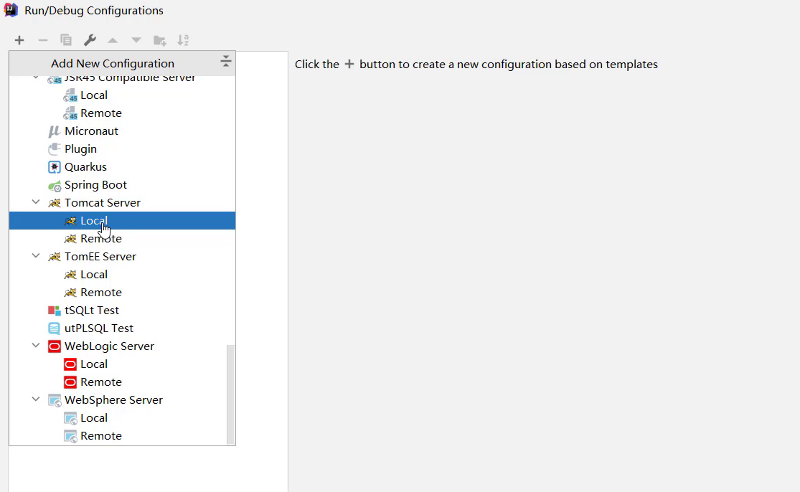
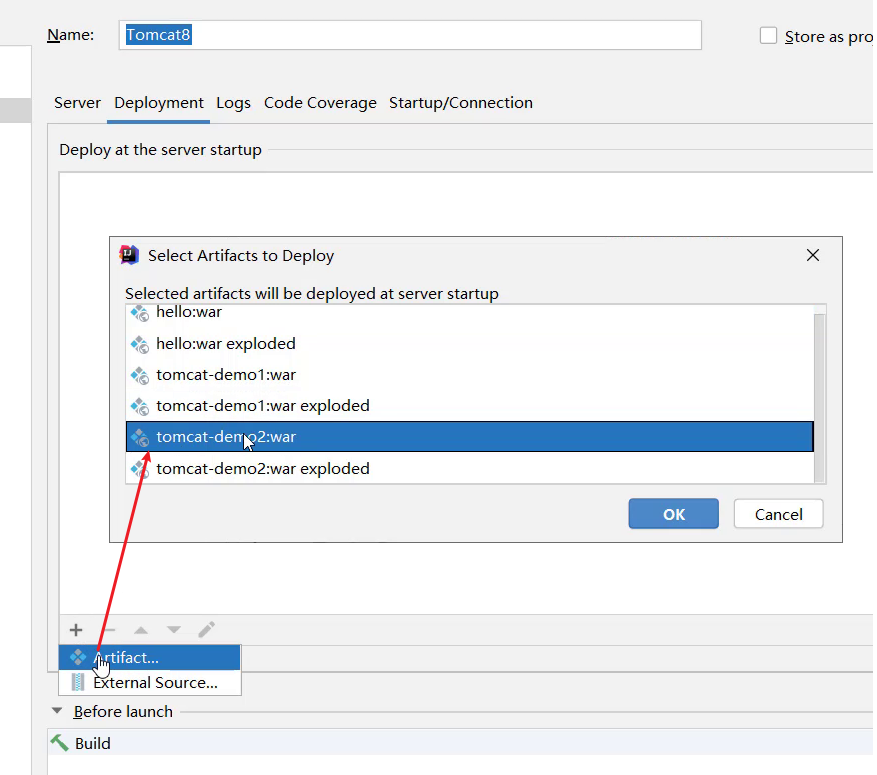
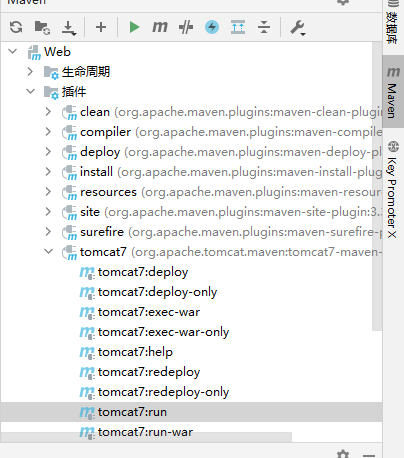
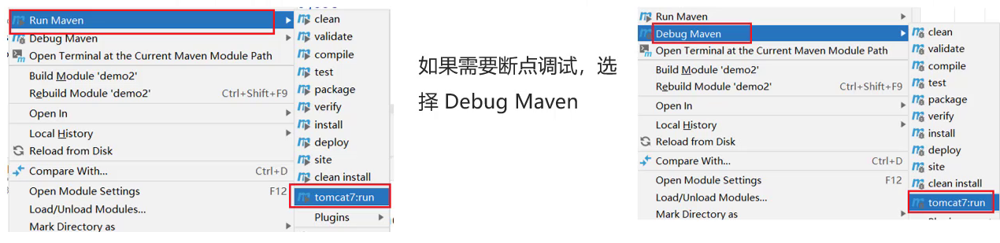

# 一、什么是Servlet

1、 Servlet 是 JavaEE 规范之一。 规范就是接口，将来我们需要定义Servlet类实现Servlet接口，并由web服务器运行Servlet。

2、 Servlet 就 JavaWeb 三大组件之一。 三大组件分别是： **Servlet 程序**、 **Filter 过滤器**、 **Listener 监听器**。

3、 Servlet 是运行在服务器上的一个 java 小程序， 它可以接收客户端发送过来的请求， 并响应数据给客户端。他是java提供的一门动态web资源开发技术


Servlet 没有main方法，不能独立运行，所以需要把它放到一个web服务器中，例如tomcat，tomcat 就是这样一个web服务器，Servlet容器。

# 二、Tomcat

* Tomcat是Apache软件基金会一个核心项目，是一个开源免费的轻量级Web服务器，支持Servlet/JSP少量JavaEE规范。

* 概念中提到了JavaEE规范，那什么又是JavaEE规范呢?

  JavaEE: Java Enterprise Edition,Java企业版。指Java企业级开发的技术规范总和。包含13项技术规范:JDBC、JNDI、EJB、RMI、JSP、Servlet、XML、JMS、Java IDL、JTS、JTA、JavaMail、JAF。

* 因为Tomcat支持Servlet/JSP规范，所以Tomcat也被称为Web容器、Servlet容器。Servlet需要依赖Tomcat才能运行。

* Tomcat的官网: https://tomcat.apache.org/ 从官网上可以下载对应的版本进行使用。

## 1.安装tomcat

下载zip版本并解压，放到相应的路径下。

tomcat的主目录下有两个特别的目录：

`webapps`目录：这个用于存放开发好的项目，开发完成的项目放到这个目录下就可以完成部署。

`work`目录：tomcat的工作目录


安装完成后需要配置如下环境变量：

`JAVA_HOME`（必须） ：jdk 的主目录

`JRE_HOME`（可选）：jre的主目录

`CATALINA_HOME`（必须）：tomcat的主目录


## 2.启动

运行bin目录下的 `startup`脚本就可以启动tomcat。

启动后，通过浏览器访问 `http://localhost:8080` （默认端口号为8080）

启动后控制台可能会有乱码，因为tomcat的日志编码默认为 UTF-8 。

如果需要更改这个编码，修改 `conf/logging.prooperties`文件中的如下内容：


## 3.关闭

关闭有三种方式 

* 直接x掉运行窗口:强制关闭[不建议]
* bin\shutdown.bat：正常关闭
* ctrl+c： 正常关闭(推荐)


## 4.配置

### 修改端口号：

* Tomcat默认的端口是8080，要想修改Tomcat启动的端口号，需要修改 conf/server.xml


> 注: HTTP协议默认端口号为80，如果将Tomcat端口号改为80，则将来访问Tomcat时，将不用输入端口号。


## 5.项目部署

将项目放置到**webapps目录**下，即部署完成。

一般JavaWeb项目会被打包称**war**包，然后将war包放到webapps目录下，Tomcat会自动解压缩war文件，就完成了部署


## 6.在IDEA中使用Tomcat

* Maven Web项目创建成功后，通过Maven的package命令可以将项目打包成war包，将war文件拷贝到Tomcat的webapps目录下，启动Tomcat就可以将项目部署成功，然后通过浏览器进行访问即可。
* 然而我们在开发的过程中，项目中的内容会经常发生变化，如果按照上面这种方式来部署测试，是非常不方便的
* 如何在IDEA中能快速使用Tomcat呢?

在IDEA中集成使用Tomcat有两种方式：

### 1）集成本地Tomcat：

1. 打开添加运行配置，选择Tomcat:

   

2. 指定本地Tomcat的具体路径

   

3. 修改Tomcat的名称，此步骤可以不改，只是让名字看起来更有意义，HTTP port中的端口也可以进行修改，比如把8080改成80

   

4. 将开发项目部署项目到Tomcat中

   

   扩展内容： xxx.war和 xxx.war exploded这两种部署项目模式的区别?

   * war模式是将WEB工程打成war包，把war包发布到Tomcat服务器上

   * war exploded模式是将WEB工程以当前文件夹的位置关系发布到Tomcat服务器上
   * war模式部署成功后，Tomcat的webapps目录下会有部署的项目内容
   * war exploded模式部署成功后，Tomcat的webapps目录下没有，而使用的是项目的target目录下的内容进行部署
   * 建议大家都选war模式进行部署，更符合项目部署的实际情况

5. 然后就可以运行了

### 2）Tomcat Maven 插件

在IDEA中使用本地Tomcat进行项目部署，相对来说步骤比较繁琐，所以我们需要一种更简便的方式来替换它，那就是直接使用Maven中的Tomcat插件来部署项目，具体的实现步骤，只需要两步，分别是:

1. 在pom.xml中添加Tomcat插件

   ```xml
   <build>
       <plugins>
       	<!--Tomcat插件 -->
           <plugin>
               <groupId>org.apache.tomcat.maven</groupId>
               <artifactId>tomcat7-maven-plugin</artifactId>
               <version>2.2</version>
           </plugin>
       </plugins>
   </build>
   ```

2. 然后就可以使用如下就可以运行了



3.或者也可以使用maven helper插件（需要提前安装好）：

选中项目，右键-->Run Maven --> tomcat7:run




使用Maven Tomcat插件，要想修改Tomcat的端口和访问路径，可以直接修改pom.xml

```xml
<build>
    <plugins>
    	<!--Tomcat插件 -->
        <plugin>
            <groupId>org.apache.tomcat.maven</groupId>
            <artifactId>tomcat7-maven-plugin</artifactId>
            <version>2.2</version>
            <configuration>
            	<port>80</port><!--访问端口号 -->
                <!--项目访问路径
					未配置访问路径: http://localhost:80/tomcat-demo2/a.html
					配置/后访问路径: http://localhost:80/a.html
					如果配置成 /hello,访问路径会变成什么?
						答案: http://localhost:80/hello/a.html
				-->
                <path>/</path>
            </configuration>
        </plugin>
    </plugins>
</build>
```


# 三、快速入门

==需求分析: 编写一个Servlet类，并使用IDEA中Tomcat插件进行部署，最终通过浏览器访问所编写的Servlet程序。==

具体的实现步骤为:

## 1.创建Web项目（项目名web-demo），导入Servlet依赖坐标

在项目的pom.xml文件中加入Servlet依赖：

```xml
<dependency>
    <groupId>javax.servlet</groupId>
    <artifactId>javax.servlet-api</artifactId>
    <version>3.1.0</version>
    <!--
      此处为什么需要添加该标签?
      provided指的是在编译和测试过程中有效,最后生成的war包时不会加入
       因为Tomcat的lib目录中已经有servlet-api这个jar包，如果在生成war包的时候生效就会和Tomcat中的jar包冲突，导致报错
    -->
    <scope>provided</scope>
</dependency>
```

## 2.定义一个类，实现Servlet接口

需要重写Servlet中的所有方法，但是现在只需要重写 `service方法`

```java
package com.itheima.web;

import javax.servlet.*;
import java.io.IOException;

public class ServletDemo1 implements Servlet {

    public void service(ServletRequest servletRequest, ServletResponse servletResponse) throws ServletException, IOException {
        System.out.println("servlet hello world~");
    }
    public void init(ServletConfig servletConfig) throws ServletException {

    }

    public ServletConfig getServletConfig() {
        return null;
    }

    public String getServletInfo() {
        return null;
    }

    public void destroy() {

    }
}
```

## 3.配置该Servlet的访问路径

在上述**实现类**的前面加上 **WebServlet注解，并指明访问路径路径**

```java
@WebServlet("/demo1")
```

## 4.部署到Tomcat服务器上，并启动

这里可以直接使用 Tomcat 的maven插件来启动，然后在浏览器中输入相应的url，例如：

```
http://localhost:8080/web-demo/demo1
```

如果此时服务器控制台输出 servlet hello world~ 那么说明已经运行成功。


# 四、执行流程

浏览器发出`http://localhost:8080/web-demo/demo1`请求，从请求中可以解析出三部分内容，分别是`localhost:8080`、`web-demo`、`demo1`

* 根据`localhost:8080`可以找到要访问的Tomcat Web服务器
* 根据`web-demo`可以找到部署在Tomcat服务器上的web-demo项目
* 根据`demo1`可以找到要访问的是项目中的哪个Servlet类，根据@WebServlet后面的值进行匹配


web服务器找到我们实现的类后，Web服务器就会为这个类创建一个对象，然后调用对象中的service方法

* ServletDemo1实现了Servlet接口，所以类中必然会重写service方法供Tomcat Web服务器进行调用
* service方法中有ServletRequest和ServletResponse两个参数，ServletRequest封装的是请求数据，ServletResponse封装的是响应数据，后期我们可以通过这两个参数实现前后端的数据交互


Servlet由谁创建?Servlet方法由谁调用?

​	Servlet由web服务器创建，Servlet方法由web服务器调用

服务器怎么知道Servlet中一定有service方法?

​	因为我们自定义的Servlet,必须实现Servlet接口并复写其方法，而Servlet接口中有service方法


# 五、生命周期

生命周期: 对象的生命周期指一个对象从被创建到被销毁的整个过程。

Servlet运行在Servlet容器(web服务器)中，其生命周期由容器来管理，分为4个阶段：

## 1.加载和实例化：

​	默认情况，Servlet会在第一次访问被容器创建，但是如果创建Servlet比较耗时的话，那么我们会把Servlet的创建放到服务器启动的时候来创建，可以通过以下注解来实现：

```
@WebServlet(urlPatterns = "/demo1",loadOnStartup = 1)
loadOnstartup的取值有两类情况
	（1）负整数:第一次访问时创建Servlet对象
	（2）0或正整数:服务器启动时创建Servlet对象，数字越小优先级越高
```


## 2.初始化：

​	在Servlet实例化之后，容器将调用Servlet的**init()方法**初始化这个对象，完成一些如加载配置文件、创建连接等初始化的工作。该方法**只调用一次**


## 3.请求处理：

​	**每次**请求Servlet时，Servlet容器都会调用Servlet的**service()**方法对请求进行处理


## 4.服务终止：

​	当需要释放内存或者容器关闭时，容器就会调用Servlet实例的**destroy()方法**完成资源的释放。在destroy()方法调用之后，容器会释放这个Servlet实例，该实例随后会被Java的垃圾收集器所回收。


**小结**

这节中需要掌握的内容是:

1. Servlet对象在什么时候被创建的?

> 默认是第一次访问的时候被创建，可以使用@WebServlet(urlPatterns = "/demo2",loadOnStartup = 1)的loadOnStartup 修改成在服务器启动的时候创建。

2. Servlet生命周期中涉及到的三个方法，这三个方法是什么?什么时候被调用?调用几次?

>涉及到三个方法，分别是 init()、service()、destroy()
>
>init方法在Servlet对象被创建的时候执行，只执行1次
>
>service方法在Servlet被访问的时候调用，每访问1次就调用1次
>
>destroy方法在Servlet对象被销毁的时候调用，只执行1次

# 六、方法介绍

初始化方法，在Servlet被创建时执行，只执行一次

```java
void init(ServletConfig config) 
```


提供服务方法， 每次Servlet被访问，都会调用该方法

```java
void service(ServletRequest req, ServletResponse res)
```


销毁方法，当Servlet被销毁时，调用该方法。在内存释放或服务器关闭时销毁Servlet

```java
void destroy() 
```


获取Servlet信息

```java
String getServletInfo() 
//该方法用来返回Servlet的相关信息，没有什么太大的用处，一般我们返回一个空字符串即可
public String getServletInfo() {
    return "";
}
```


获取ServletConfig对象

```java
ServletConfig getServletConfig()
```

该方法一般把init方法中的ServletConfig作为返回值，即在实现类中声明一个ServletConfig变量，在init方法中把tomcat服务器传入的ServletConfig对象赋值给它，再在getServletConfig方法中将其返回。


# 七、体系结构

 

​	因为我们将来开发B/S架构的web项目，都是针对HTTP协议，当客户端发送请求时使用的HTTP方法不同时，应该做区别处理，而直接在原始的Servlet中对不同的方法进行处理写代码会比较繁琐，所以我们会通过继承**HttpServlet类**来分别处理 GET方法 和 POST方法：

```java
@WebServlet("/demo4")
public class ServletDemo4 extends HttpServlet {
    @Override
    protected void doGet(HttpServletRequest req, HttpServletResponse resp) throws ServletException, IOException {
        //TODO GET 请求方式处理逻辑
        System.out.println("get...");
    }
    @Override
    protected void doPost(HttpServletRequest req, HttpServletResponse resp) throws ServletException, IOException {
        //TODO Post 请求方式处理逻辑
        System.out.println("post...");
    }
}
```


**HttpServlet类**实际上是对Servlet的继承并封装，具体实现方式类似于如下：

```java
package com.itheima.web;

import javax.servlet.*;
import javax.servlet.http.HttpServletRequest;
import java.io.IOException;

public class MyHttpServlet implements Servlet {
    public void init(ServletConfig config) throws ServletException {

    }

    public ServletConfig getServletConfig() {
        return null;
    }

    public void service(ServletRequest req, ServletResponse res) throws ServletException, IOException {
        HttpServletRequest request = (HttpServletRequest)req;
        //1. 获取请求方式
        String method = request.getMethod();
        //2. 判断
        if("GET".equals(method)){
            // get方式的处理逻辑
            doGet(req,res);
        }else if("POST".equals(method)){
            // post方式的处理逻辑
            doPost(req,res);
        }
    }

    protected void doPost(ServletRequest req, ServletResponse res) {
    }

    protected void doGet(ServletRequest req, ServletResponse res) {
    }

    public String getServletInfo() {
        return null;
    }

    public void destroy() {

    }
}

```

**小结**

1. HttpServlet的使用步骤

> 继承HttpServlet
>
> 重写doGet和doPost方法

2. HttpServlet原理

> 获取请求方式，并根据不同的请求方式，调用不同的doXxx方法

# 八、urlPattern配置

下文中均用 `http://localhost:80/web-demo` 表示项目的访问url


一个Servlet,可以配置多个urlPattern：`@WebServlet(urlPatterns = {"/demo1","/demo2"})`

那么通过 `http://localhost:80/web-demo/demo1`

和 `http://localhost:80/web-demo/demo2` 都可以访问到这个Servlet


Servlet的url配置有四种方式：

## 1.精确匹配

`@WebServlet(urlPatterns = "/demo")`

那么此时url为：`http://localhost:80/web-demo/demo`


## 2.目录匹配

`@WebServlet(urlPatterns = "/user/*")`

此时的url为：`http://localhost:80/web-demo/user/任意`

`/*` 表示 零或多个层级访问目录


例如：`http://localhost:80/web-demo/user` 和 

`http://localhost:80/web-demo/user/a/b` 都可以访问到此Servlet。


如果同时有两个Servlet，他们的urlPattern 分别为：/user/* 和 /user/select

那么url `http://localhost:80/web-demo/user/select` 会访问到后者，因为精确匹配比目录匹配优先级要高


## 3.扩展名匹配

`@WebServlet(urlPatterns = "*.后缀")`

**注意：**`*.后缀` 前面没有 `/`

此时的url 为：`http://localhost:80/web-demo/任意.后缀`


例如：

urlPattern = “*.do”，那么 `http://localhost:80/web-demo/A.do` 和

`http://localhost:80/web-demo/B.do` 都可以访问到此Servlet


**注意：**

如果路径配置的不是扩展名，那么在路径的前面就必须要加`/`否则会报错


## 4.任意匹配

`@WebServlet(urlPatterns = "/")` 或者 

`@WebServlet(urlPatterns = "/*")`

此时的url为：`http://localhost:8080/demo-web/任意`


**注意：**

`/`和`/*`的区别?

1. 当我们的项目中的Servlet配置了 "/",会覆盖掉tomcat中的DefaultServlet,当其他的url-pattern都匹配不上时都会走这个Servlet。

2. 当我们的项目中配置了"/*",意味着匹配任意访问路径。

3. **DefaultServlet**是用来处理**静态资源**，如果配置了"/"会把默认的覆盖掉，就会引发请求静态资源的时候没有走默认的而是走了自定义的Servlet类，最终导致静态资源不能被访问。


五种配置的优先级为 精确匹配 > 目录匹配> 扩展名匹配 > /* > / ,无需记，以最终运行结果为准。


# 九、XML配置（3.0版本以前）

​	前面对应Servlet的配置，我们都使用的是@WebServlet,这个是Servlet从3.0版本后开始支持注解配置，3.0版本前只支持XML配置文件的配置方法。

​	XML配置方法需要在 `WEB-INF/web.xml` 文件中加入如下内容：

```xml
 	<!--
    Servlet 全类名
    -->
    <servlet>
        <!-- servlet的名称，名字任意-->
        <servlet-name>hello</servlet-name>
        <!--servlet的类全名-->
        <servlet-class>org.example.web.MyServlet</servlet-class>
    </servlet>

    <!--
        Servlet 访问路径
    -->
    <servlet-mapping>
        <!-- servlet的名称，要和上面的名称一致-->
        <servlet-name>hello</servlet-name>
        <!-- servlet的访问路径-->
        <url-pattern>/hello</url-pattern>
    </servlet-mapping>
```
