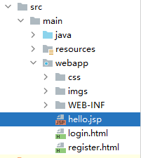
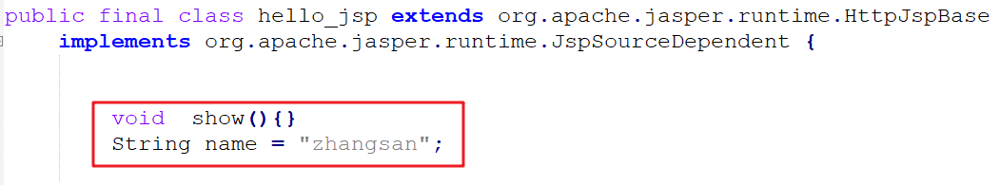

# 一、概述

JSP（全称：Java Server Pages）：Java 服务端页面。是一种动态的网页技术，其中既可以定义 HTML、JS、CSS等静态内容，还可以定义 Java代码的动态内容，也就是 `JSP = HTML + Java`。

```jsp
<html>
    <head>
        <title>Title</title>
    </head>
    <body>
        <h1>JSP,Hello World</h1>
        <%
        	System.out.println("hello,jsp~");
        %>
    </body>
</html>
```

JSP 作用：简化开发，避免了在Servlet中直接输出HTML标签。

# 二、快速入门

使用JSP开发需要如下步骤

## 1.导入JSP依赖

```xml
<dependency>
    <groupId>javax.servlet.jsp</groupId>
    <artifactId>jsp-api</artifactId>
    <version>2.2</version>
    <scope>provided</scope>
</dependency>
```

注意：scope 必须为 **provided**

## 2.创建JSP页面

在webapp目录下创建一个 jsp文件。



## 3.编写代码

在jsp文件中书写html标签和java代码。

```jsp
<%@ page contentType="text/html;charset=UTF-8" language="java" %>
<html>
<head>
    <title>Title</title>
</head>
<body>
    <h1>hello jsp</h1>
    <%
        System.out.println("hello,jsp");
    %>

</body>
</html>
```


# 三、JSP原理

**JSP 本质上就是一个 Servlet。**

1. 浏览器第一次访问 `hello.jsp` 页面
2. `tomcat` 会将 `hello.jsp` 转换为名为 `hello_jsp.java` 的一个 `Servlet`
3. `tomcat` 再将转换的 `Servlet` 编译成字节码文件 `hello_jsp.class`
4. `tomcat` 会执行该字节码文件，向外提供服务

转换后的 **hello_jsp.java** 文件中，有一个  **hello_jsp类**，它间接继承了 `HttpServlet`，并且它含有一个名为 `_jspService()` 的方法，该方法就是每次访问 `jsp` 时自动执行的方法，和 `servlet` 中的 `service` 方法一样 。

而在 `_jspService()` 方法中可以看到往浏览器写标签的代码：


以前我们自己写 `servlet` 时，这部分代码是由我们自己来写，现在有了 `jsp` 后，由tomcat完成这部分功能。


# 四、JSP脚本

JSP脚本用于在 JSP页面内定义 Java代码。

JSP 脚本有如下三个分类：

## <%...%>

内容会直接放到**_jspService()方法**之中

在 `hello.jsp` 中书写

```jsp
<%
    System.out.println("hello,jsp~");
    int i = 3;
%>
```

通过浏览器访问 `hello.jsp` 后，查看转换的 `hello_jsp.java` 文件，i 变量定义在了 `_jspService()` 方法中


## <%=…%>

内容会放到`_jspService()` 方法中的 **out.print()**中，作为out.print()的参数

在 `hello.jsp` 中书写

```jsp
<%="hello"%>
<%=i%>
```

通过浏览器访问 `hello.jsp` 后，查看转换的 `hello_jsp.java` 文件，该脚本的内容被放在了 `out.print()` 中，作为参数


## <%!…%>

内容会放到**_jspService()方法**之外，被类直接包含

在 `hello.jsp` 中书写

```jsp
<%!
    void  show(){}
	String name = "zhangsan";
%>
```

通过浏览器访问 `hello.jsp` 后，查看转换的 `hello_jsp.java` 文件，该脚本的内容被放在了成员位置



## 例子

使用JSP脚本展示品牌数据


代码：

```jsp
<%@ page import="com.itheima.pojo.Brand" %>
<%@ page import="java.util.List" %>
<%@ page import="java.util.ArrayList" %>
<%@ page contentType="text/html;charset=UTF-8" language="java" %>

<%
    // 模拟查询数据库
    List<Brand> brands = new ArrayList<Brand>();
    brands.add(new Brand(1,"三只松鼠","三只松鼠",100,"三只松鼠，好吃不上火",1));
    brands.add(new Brand(2,"优衣库","优衣库",200,"优衣库，服适人生",0));
    brands.add(new Brand(3,"小米","小米科技有限公司",1000,"为发烧而生",1));

%>


<!DOCTYPE html>
<html lang="en">
<head>
    <meta charset="UTF-8">
    <title>Title</title>
</head>
<body>
<input type="button" value="新增"><br>
<hr>
<table border="1" cellspacing="0" width="800">
    <tr>
        <th>序号</th>
        <th>品牌名称</th>
        <th>企业名称</th>
        <th>排序</th>
        <th>品牌介绍</th>
        <th>状态</th>
        <th>操作</th>
    </tr>
    <%
        for (int i = 0; i < brands.size(); i++) {
            Brand brand = brands.get(i);
    %>

    <tr align="center">
        <td><%=brand.getId()%></td>
        <td><%=brand.getBrandName()%></td>
        <td><%=brand.getCompanyName()%></td>
        <td><%=brand.getOrdered()%></td>
        <td><%=brand.getDescription()%></td>
		<td><%=brand.getStatus() == 1 ? "启用":"禁用"%></td>
        <td><a href="#">修改</a> <a href="#">删除</a></td>
    </tr>

    <%
        }
    %>
</table>
</body>
</html>
```


# 五、JSP缺点

由于 JSP页面内，既可以定义 HTML 标签，又可以定义 Java代码，造成了以下问题：

* 书写麻烦：特别是复杂的页面

  既要写 HTML 标签，还要写 Java 代码

* 阅读麻烦

  上面案例的代码，相信你后期再看这段代码时还需要花费很长的时间去梳理

* 复杂度高：运行需要依赖于各种环境，JRE，JSP容器，JavaEE…

* 占内存和磁盘：JSP会自动生成.java和.class文件占磁盘，运行的是.class文件占内存

* 调试困难：出错后，需要找到自动生成的.java文件进行调试

* 不利于团队协作：前端人员不会 Java，后端人员不精 HTML

  如果页面布局发生变化，前端工程师对静态页面进行修改，然后再交给后端工程师，由后端工程师再将该页面改为 JSP 页面

所以 JSP基本上不怎么用了。

下面对技术的发展进行简单的说明：


1. 第一阶段：使用 `servlet` 即实现逻辑代码编写，也对页面进行拼接。这种模式我们之前也接触过

2. 第二阶段：随着技术的发展，出现了 `JSP` ，人们发现 `JSP` 使用起来比 `Servlet` 方便很多，但是还是要在 `JSP` 中嵌套 `Java` 代码，也不利于后期的维护

3. 第三阶段：使用 `Servlet` 进行逻辑代码开发，而使用 `JSP` 进行数据展示。

   这一阶段中，不直接在JSP中写Java代码。

4. 第四阶段：使用 `servlet` 进行后端逻辑代码开发，而使用 `HTML` 进行数据展示。而这里面就存在问题，`HTML` 是静态页面，怎么进行动态数据展示呢？这就是 `ajax` 的作用了。

   

接下来我们来学习第三阶段，使用 `EL表达式` 和 `JSTL` 标签库替换 `JSP` 中的 `Java` 代码。

# 六、EL表达式

在第三阶段中，我们使用 Servlet来进行逻辑处理，比如访问数据库之类的，然后把数据封装成一个对象，再**转发**给 JSP页面进行展示。当JSP收到转发过来的数据之后，使用 **EL表达式** 来获取这些数据。

EL（全称Expression Language ）表达式语言，用于简化 JSP 页面内的 Java 代码。

EL 表达式的**主要作用是获取数据**。其实就是从**域对象**中获取数据，然后将数据展示在页面上。

而 EL 表达式的语法也比较简单：**${expression}** 。例如：`${brands}` 就是获取域中存储的 key 为 brands 的数据。

代码演示：

* 定义servlet，在 servlet 中封装一些数据并存储到 request 域对象中并转发到 `el-demo.jsp` 页面。

  ```java
  @WebServlet("/demo1")
  public class ServletDemo1 extends HttpServlet {
      @Override
      protected void doGet(HttpServletRequest request, HttpServletResponse response) throws ServletException, IOException {
          //1. 准备数据
          List<Brand> brands = new ArrayList<Brand>();
          brands.add(new Brand(1,"三只松鼠","三只松鼠",100,"三只松鼠，好吃不上火",1));
          brands.add(new Brand(2,"优衣库","优衣库",200,"优衣库，服适人生",0));
          brands.add(new Brand(3,"小米","小米科技有限公司",1000,"为发烧而生",1));
  
          //2. 存储到request域中
          request.setAttribute("brands",brands);
  
          //3. 转发到 el-demo.jsp
          request.getRequestDispatcher("/el-demo.jsp").forward(request,response);
      }
  
      @Override
      protected void doPost(HttpServletRequest request, HttpServletResponse response) throws ServletException, IOException {
          this.doGet(request, response);
      }
  }
  ```
  
  **注意**： 此处需要用转发，因为转发才可以使用 request 对象作为**域对象**进行数据共享
  
* 在 `el-demo.jsp` 中通过 EL表达式 获取数据

  ```jsp
  <%@ page contentType="text/html;charset=UTF-8" language="java" %>
  <html>
  <head>
      <title>Title</title>
  </head>
  <body>
      ${brands}
  </body>
  </html>
  ```

* 在浏览器的地址栏输入 `http://localhost:8080/jsp-demo/demo1` ，页面效果如下：

  


## 域对象

JavaWeb中有四大域对象，分别是：

* **page**：当前页面有效
* **request**：当前请求有效
* **session**：当前会话有效
* **application**：当前应用有效

el 表达式获取数据，会依次从这4个域中寻找，直到找到为止。而这四个域对象的作用范围如下图所示


例如： ${brands}，el 表达式获取数据，会先从page域对象中获取数据，如果没有再到 requet 域对象中获取数据，如果再没有再到 session 域对象中获取，如果还没有才会到 application 中获取数据。


# 七、JSTL标签

JSP标准标签库(Jsp Standarded Tag Library) ，使用标签取代JSP页面上的Java代码。如下代码就是JSTL标签。

```jsp
<c:if test="${flag == 1}">
    男
</c:if>
<c:if test="${flag == 2}">
    女
</c:if>
```

使用步骤：

* 导入坐标

  ```xml
  <dependency>
      <groupId>jstl</groupId>
      <artifactId>jstl</artifactId>
      <version>1.2</version>
  </dependency>
  <dependency>
      <groupId>taglibs</groupId>
      <artifactId>standard</artifactId>
      <version>1.1.2</version>
  </dependency>
  ```

* 在JSP页面上引入JSTL标签库

  ```jsp
  <%@ taglib prefix="c" uri="http://java.sun.com/jsp/jstl/core" %> 
  ```

* 使用标签


JSTL标签有很多种，只介绍下面两种。


## if 标签

`<c:if>`：相当于 if 判断

* 属性：test，用于定义条件表达式

```jsp
<c:if test="${flag == 1}">
    男
</c:if>
<c:if test="${flag == 2}">
    女
</c:if>
```

**代码演示：**

* 定义一个 `servlet` ，在该 `servlet` 中向 request 域对象中添加 键是 `status` ，值为 `1` 的数据

  ```java
  @WebServlet("/demo2")
  public class ServletDemo2 extends HttpServlet {
      @Override
      protected void doGet(HttpServletRequest request, HttpServletResponse response) throws ServletException, IOException {
          //1. 存储数据到request域中
          request.setAttribute("status",1);
  
          //2. 转发到 jstl-if.jsp
          数据request.getRequestDispatcher("/jstl-if.jsp").forward(request,response);
      }
  
      @Override
      protected void doPost(HttpServletRequest request, HttpServletResponse response) throws ServletException, IOException {
          this.doGet(request, response);
      }
  }
  ```

* 定义 `jstl-if.jsp` 页面，在该页面使用 `<c:if>` 标签

  ```jsp
  <%@ page contentType="text/html;charset=UTF-8" language="java" %>
  <%@ taglib prefix="c" uri="http://java.sun.com/jsp/jstl/core" %>
  <html>
  <head>
      <title>Title</title>
  </head>
  <body>
      <%--
          c:if：来完成逻辑判断，替换java  if else
      --%>
      <c:if test="${status ==1}">
          启用
      </c:if>
  
      <c:if test="${status ==0}">
          禁用
      </c:if>
  </body>
  </html>
  ```


##  forEach 标签

`<c:forEach>`：相当于 for 循环。java中有增强for循环和普通for循环，JSTL 中的 `<c:forEach>` 也有两种用法

### 用法一

类似于 Java 中的增强for循环。涉及到的 `<c:forEach>` 中的属性如下

* items：被遍历的容器

* var：遍历产生的临时变量

* varStatus：遍历状态对象

如下代码，是从域对象中获取名为 brands 数据，该数据是一个集合；遍历集合，并给该集合中的每一个元素起名为 `brand`，是 Brand对象。在循环里面使用 EL表达式获取每一个Brand对象的属性值

```jsp
<c:forEach items="${brands}" var="brand">
    <tr align="center">
        <td>${brand.id}</td>
        <td>${brand.brandName}</td>
        <td>${brand.companyName}</td>
        <td>${brand.description}</td>
    </tr>
</c:forEach>
```

**代码演示：**

* `servlet` 还是使用之前的名为 `ServletDemo1` 。

* 定义名为 `jstl-foreach.jsp` 页面，内容如下：

  ```jsp
  <%@ page contentType="text/html;charset=UTF-8" language="java" %>
  <%@ taglib prefix="c" uri="http://java.sun.com/jsp/jstl/core" %>
  
  <!DOCTYPE html>
  <html lang="en">
  <head>
      <meta charset="UTF-8">
      <title>Title</title>
  </head>
  <body>
  <input type="button" value="新增"><br>
  <hr>
  <table border="1" cellspacing="0" width="800">
      <tr>
          <th>序号</th>
          <th>品牌名称</th>
          <th>企业名称</th>
          <th>排序</th>
          <th>品牌介绍</th>
          <th>状态</th>
          <th>操作</th>
      </tr>
  
      <c:forEach items="${brands}" var="brand" varStatus="status">
          <tr align="center">
              <%--<td>${brand.id}</td>--%>
              <td>${status.count}</td>
              <td>${brand.brandName}</td>
              <td>${brand.companyName}</td>
              <td>${brand.ordered}</td>
              <td>${brand.description}</td>
              <c:if test="${brand.status == 1}">
                  <td>启用</td>
              </c:if>
              <c:if test="${brand.status != 1}">
                  <td>禁用</td>
              </c:if>
              <td><a href="#">修改</a> <a href="#">删除</a></td>
          </tr>
      </c:forEach>
  </table>
  </body>
  </html>
  ```

### 用法二

类似于 Java 中的普通for循环。涉及到的 `<c:forEach>` 中的属性如下

* begin：开始数

* end：结束数

* step：步长

实例代码：

从0循环到10，变量名是 `i` ，每次自增1

```jsp
<c:forEach begin="0" end="10" step="1" var="i">
    ${i}
</c:forEach>
```


