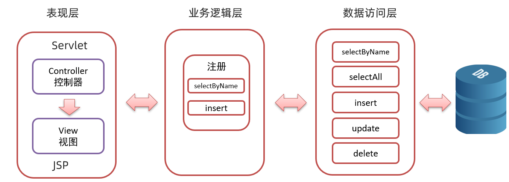
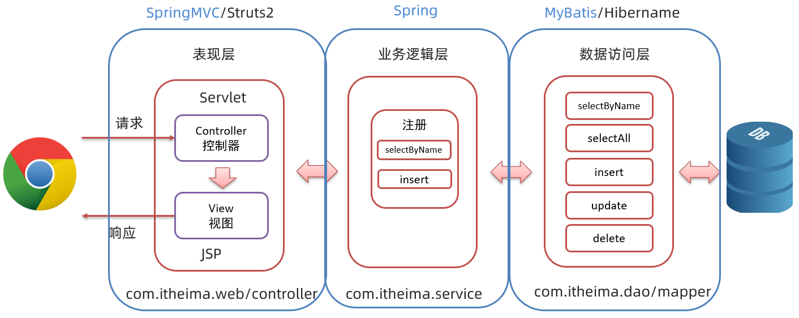

# MVC模式和三层架构

## MVC模式

MVC 是一种分层开发的模式，其中：

* M：Model，业务模型，处理业务

* V：View，视图，界面展示

* C：Controller，控制器，处理请求，调用模型和视图

控制器（serlvlet）用来接收浏览器发送过来的请求，控制器调用模型（JavaBean）来获取数据，比如从数据库查询数据；控制器获取到数据后再交由视图（JSP）进行数据展示。

**MVC 好处：**

* 职责单一，互不影响。每个角色做它自己的事，各司其职。

* 有利于分工协作。

* 有利于组件重用

## 三层架构

三层架构是将我们的项目分成了三个层面，分别是 `表现层`、`业务逻辑层`、`数据访问层`。

* 数据访问层：对数据库的CRUD基本操作
* 业务逻辑层：对业务逻辑进行封装，组合数据访问层中基本功能，形成复杂的业务逻辑功能。例如 `注册业务功能` ，我们会先调用 `数据访问层` 的 `selectByName()` 方法判断该用户名是否存在，如果不存在再调用 `数据访问层` 的 `insert()` 方法进行数据的添加操作
* 表现层：接收请求，封装数据，调用业务逻辑层，响应数据

而整个流程是，浏览器发送请求，表现层的Servlet接收请求并调用业务逻辑层的方法进行业务逻辑处理，而业务逻辑层方法调用数据访问层方法进行数据的操作，依次返回到serlvet，然后servlet将数据交由 JSP 进行展示。

三层架构的每一层都有特有的包名称：

* 表现层： `xxx.controller` 或者 `xxx.web`

* 业务逻辑层：`xxx.service`

* 数据访问层：`xxx.dao` 或者 `xxx.mapper`

  

后期我们还会学习一些框架，不同的框架是对不同层进行封装的

## MVC 和 三层架构

MVC和三层架构的区别和联系

如上图上半部分是 MVC 模式，上图下半部分是三层架构。 

`MVC 模式` 中的 C（控制器）和 V（视图）就是 `三层架构` 中的表现层，而 `MVC 模式` 中的 M（模型）就是 `三层架构` 中的 业务逻辑层 和 数据访问层。

可以将 `MVC 模式` 理解成是一个大的概念，而 `三层架构` 是对 `MVC 模式` 实现架构的思想。 那么我们以后按照要求将不同层的代码写在不同的包下，每一层里功能职责做到单一，将来如果将表现层的技术换掉，而业务逻辑层和数据访问层的代码不需要发生变化。

