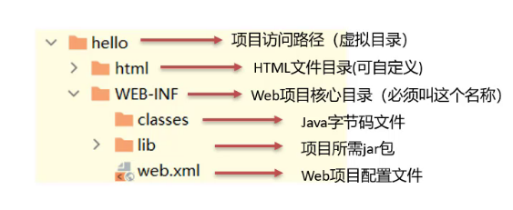

# 一、maven web项目结构

## 1.开发中的项目结构

## 2.开发完成后部署的项目结构

* 开发项目通过执行Maven打包命令 **package**,可以获取到打包后的web项目（war包）。
* 编译后的Java字节码文件和resources的资源文件，会被放到WEB-INF下的classes目录下
* pom.xml中依赖坐标对应的jar包，会被放入WEB-INF下的lib目录下

**web项目中的pom.xml文件中，一定要把打包方式改为war**，即添加如下：

`<packaging>war</packaging>`

