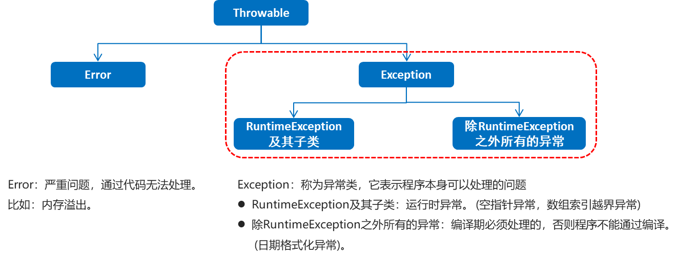
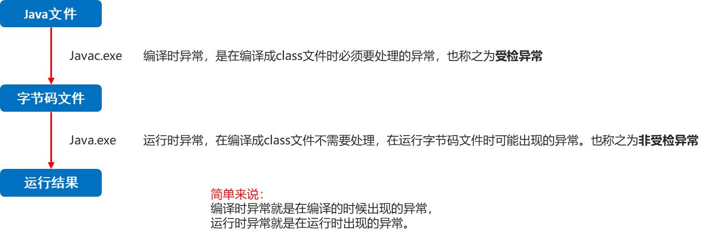
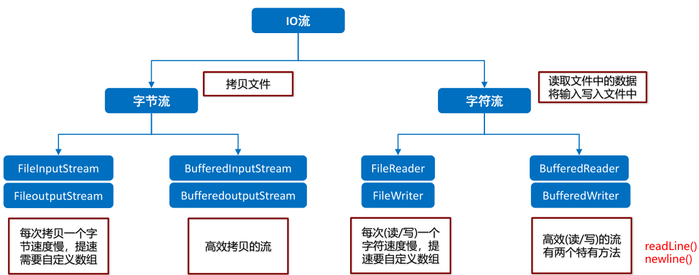
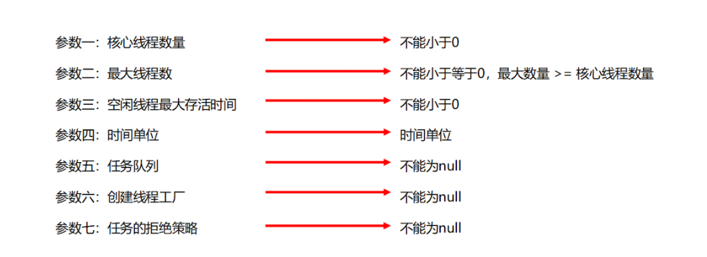
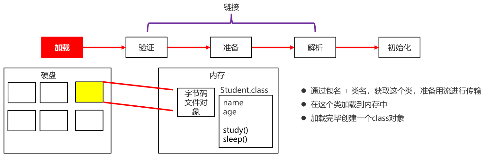
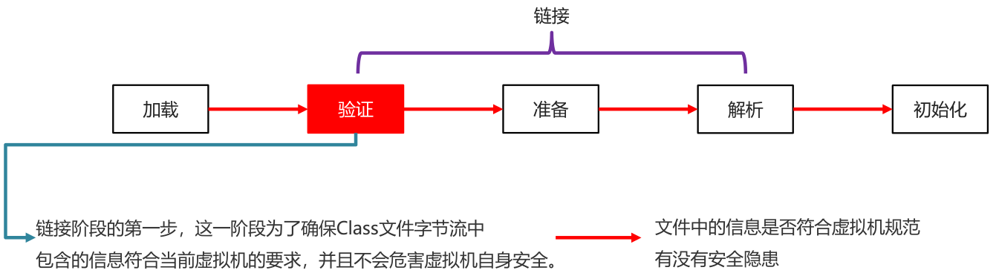
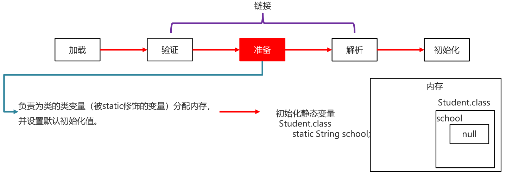
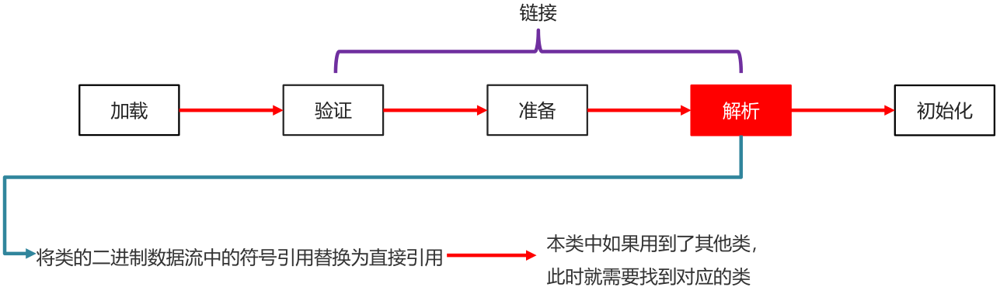
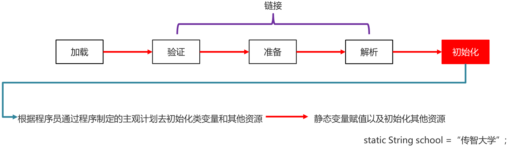
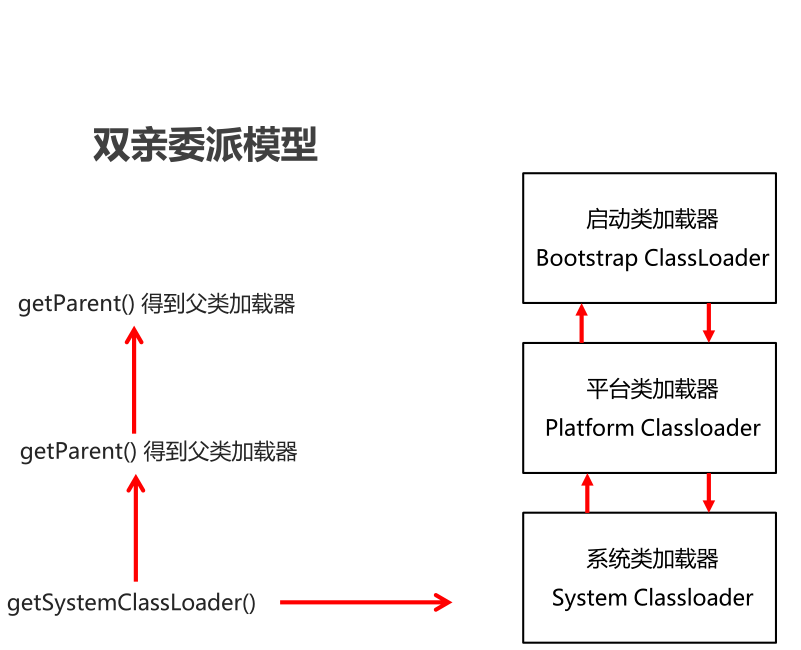

# 1. 代码块

+ 局部代码块

  + 位置: 方法中定义

  + 作用: **限定变量的生命周期，及早释放，提高内存利用率**

  + 示例代码

    ```java
    public class Test {
        /*
            局部代码块
                位置：方法中定义
                作用：限定变量的生命周期，及早释放，提高内存利用率
         */
        public static void main(String[] args) {
            {
                int a = 10;
                System.out.println(a);
            }
    
           // System.out.println(a);
        }
    }
    ```

+ 构造代码块

  + 位置: 类中方法外定义

  + 特点: 每次构造方法执行的时，都会执行该代码块中的代码，并且在构造方法执行前执行

  + 作用: **将多个构造方法中相同的代码，抽取到构造代码块中，提高代码的复用性**

  + 示例代码

    ```java
    public class Test {
        /*
            构造代码块:
                位置：类中方法外定义
                特点：每次构造方法执行的时，都会执行该代码块中的代码，并且在构造方法执行前执行
                作用：将多个构造方法中相同的代码，抽取到构造代码块中，提高代码的复用性
         */
        public static void main(String[] args) {
            Student stu1 = new Student();
            Student stu2 = new Student(10);
        }
    }
    
    class Student {
    
        {
            System.out.println("好好学习");
        }
    
        public Student(){
            System.out.println("空参数构造方法");
        }
    
        public Student(int a){
            System.out.println("带参数构造方法...........");
        }
    }
    ```

+ 静态代码块

  + 位置: 类中方法外定义

  + 特点: **需要通过static关键字修饰，随着类的加载而加载，并且只执行一次**

  + 作用: **在<u>类加载</u>的时候做一些数据初始化的操作**

  + 示例代码

    ```java
    public class Test {
        /*
            静态代码块:
                位置：类中方法外定义
                特点：需要通过static关键字修饰，随着类的加载而加载，并且只执行一次
                作用：在类加载的时候做一些数据初始化的操作
         */
        public static void main(String[] args) {
            Person p1 = new Person();
            Person p2 = new Person(10);
        }
    }
    
    class Person {
        static {
            System.out.println("我是静态代码块, 我执行了");
        }
    
        public Person(){
            System.out.println("我是Person类的空参数构造方法");
        }
    
        public Person(int a){
            System.out.println("我是Person类的带...........参数构造方法");
        }
    }
    ```


# 2. 接口

+ 接口就是一种公共的规范标准，只要符合规范标准，大家都可以通用。
+ Java中接口存在的两个意义
  1. **用来定义规范**
  2. **用来做功能的拓展**

## 接口的成员特点（记忆）

- **成员变量**

  ​	 **只能是常量**
  ​	 默认修饰符：public static final

- **构造方法**

  ​	没有，因为接口主要是扩展功能的，而没有具体存在

- 成员方法

  ​	只能是抽象方法

  ​	默认修饰符：public abstract

  ​	

## 接口与接口的关系

继承关系，可以单继承，也可以多继承


## 接口中默认方法 JAVA8

- 格式

  public default 返回值类型 方法名(参数列表) {   }

- 作用

  解决接口升级的问题

- 范例

  ```java
  public default void show3() { 
  }
  ```

- 注意事项

  - 默认方法不是抽象方法，所以不强制被重写。但是可以被重写，重写的时候去掉default关键字
  - public可以省略，default不能省略
  - 如果实现了多个接口，多个接口中存在相同的方法声明，子类就必须对该方法进行重写


## 接口中静态方法 JAVA8

- 格式

  public static 返回值类型 方法名(参数列表) {   }

- 范例

  ```java
  public static void show() {
  }
  ```

- 注意事项

  - 静态方法**只能通过接口名**调用，不能通过实现类名或者对象名调用
  - public可以省略，static不能省略

## 接口中私有方法 JAVA9

- 私有方法产生原因

  Java 9中新增了带方法体的私有方法，这其实在Java 8中就埋下了伏笔：Java 8允许在接口中定义带方法体的默认方法和静态方法。这样可能就会引发一个问题：当两个默认方法或者静态方法中包含一段相同的代码实现时，程序必然考虑将这段实现代码抽取成一个共性方法，而这个共性方法是不需要让别人使用的，因此用私有给隐藏起来，这就是Java 9增加私有方法的必然性

- 定义格式

  - 格式1

    private 返回值类型 方法名(参数列表) {   }

  - 范例1

    ```java
    private void show() {  
    }
    ```

  - 格式2

    private static 返回值类型 方法名(参数列表) {   }

  - 范例2

    ```java
    private static void method() {  
    }
    ```

- 注意事项

  - 默认方法可以调用私有的静态方法和非静态方法
  - 静态方法只能调用私有的静态方法


# 3. 多态

## 多态的概述

- 什么是多态

  ​	同一个对象，在不同时刻表现出来的不同形态

- 多态的前提

  - 要有继承或实现关系
  - 要有方法的重写
  - 要有父类引用指向子类对象

## 多态的好处和弊端（

- 好处

  ​	**提高程序的扩展性。**定义方法时候，使用父类型作为参数，在使用的时候，使用具体的子类型参与操作

- 弊端

  ​	不能使用子类的特有成员


# 4.内部类

## 内部类的访问特点 

- 内部类可以直接访问外部类的成员，包括私有
- 外部类要访问内部类的成员，必须创建对象

- 示例代码：

  ```java
  /*
      内部类访问特点：
          内部类可以直接访问外部类的成员，包括私有
          外部类要访问内部类的成员，必须创建对象
   */
  public class Outer {
      private int num = 10;
      public class Inner {
          public void show() {
              System.out.println(num);
          }
      }
      public void method() {
          Inner i = new Inner();
          i.show();
      }
  }
  ```

## 成员内部类

- 成员内部类的定义位置

  - 在类中跟方法、成员变量是一个级别

- 外界创建成员内部类格式

  - 格式：`外部类名.内部类名 对象名 = 外部类对象.内部类对象;`
  - 举例：`Outer.Inner oi = new Outer().new Inner();`

- 私有成员内部类

  - 将一个类，设计为内部类的目的，大多数都是不想让外界去访问，所以内部类的定义应该私有化，私有化之后，再提供一个可以让外界调用的方法，方法内部创建内部类对象并调用。

  - 示例代码：

    ```java
    class Outer {
        private int num = 10;
        private class Inner {
            public void show() {
                System.out.println(num);
            }
        }
        public void method() {
            Inner i = new Inner();
            i.show();
        }
    }
    public class InnerDemo {
        public static void main(String[] args) {
    		//Outer.Inner oi = new Outer().new Inner();
    		//oi.show();
            Outer o = new Outer();
            o.method();
        }
    }
    ```

- 静态成员内部类

  + 静态成员内部类访问格式：`外部类名.内部类名 对象名 = new 外部类名.内部类名();`

  + 静态成员内部类中的静态方法：外部类名.内部类名.方法名();

  + 示例代码

    ```java
    class Outer {
        static class Inner {
            public void show(){
                System.out.println("inner..show");
            }
    
            public static void method(){
                System.out.println("inner..method");
            }
        }
    }
    
    public class Test3Innerclass {
        /*
            静态成员内部类演示
         */
        public static void main(String[] args) {
            // 外部类名.内部类名 对象名 = new 外部类名.内部类名();
            Outer.Inner oi = new Outer.Inner();
            oi.show();
    
            Outer.Inner.method();
        }
    }
    ```

    

## 局部内部类

- 局部内部类定义位置

  - 局部内部类是在**方法**中定义的类

- 局部内部类方式方式

  - 局部内部类，外界是无法直接使用，需要在方法内部创建对象并使用
  - 该类可以直接访问外部类的成员，也可以访问方法内的局部变量

- 示例代码

  ```java
  class Outer {
      private int num = 10;
      public void method() {
          int num2 = 20;
          class Inner {
              public void show() {
                  System.out.println(num);
                  System.out.println(num2);
              }
          }
          Inner i = new Inner();
          i.show();
      }
  }
  public class OuterDemo {
      public static void main(String[] args) {
          Outer o = new Outer();
          o.method();
      }
  }
  
  ```


## 匿名内部类

- 匿名内部类的前提

  - 存在一个类或者接口，这里的类可以是具体类也可以是抽象类

- 匿名内部类的格式

  - 格式：`new 类名 ( ) {  重写方法 }    new  接口名 ( ) { 重写方法 }`

  - 举例： 

    ```java
    new Inter(){
        @Override
        public void method(){}
    } 
    ```

- 匿名内部类的本质

  - 本质：是一个继承了该类或者实现了该接口的子类匿名对象

- 匿名内部类的细节

  - 匿名内部类可以通过多态的形式接受

    ```java
    Inter i = new Inter(){
      @Override
        public void method(){
            
        }
    }
    ```

- 匿名内部类直接调用方法

  ```java
  interface Inter{
      void method();
  }
  
  class Test{
      public static void main(String[] args){
          new Inter(){
              @Override
              public void method(){
                  System.out.println("我是匿名内部类");
              }
          }.method();	// 直接调用方法
      }
  }
  ```


# 5. Lambda表达式

## 省略模式

- 省略的规则

  - 参数类型可以省略。但是有多个参数的情况下，不能只省略一个
  - 如果参数有且仅有一个，那么小括号可以省略
  - 如果代码块的语句只有一条，可以省略大括号和分号，和return关键字

## Lambda表达式和匿名内部类的区别

- 所需类型不同
  - 匿名内部类：可以是接口，也可以是抽象类，还可以是具体类
  - Lambda表达式：只能是接口
- 使用限制不同
  - 如果接口中有且仅有一个抽象方法，可以使用Lambda表达式，也可以使用匿名内部类
  - 如果接口中多于一个抽象方法，只能使用匿名内部类，而不能使用Lambda表达式
- **实现原理不同**
  - 匿名内部类：编译之后，产生一个单独的.class字节码文件
  - Lambda表达式：编译之后，没有一个单独的.class字节码文件。**对应的字节码会在运行的时候动态生成**


# 6. 异常

## 异常的体系结构







# 7. HashSet结构

- JDK1.8以前

  ​	数组 + 链表

  

- JDK1.8以后

  - 节点个数少于等于8个

    ​	数组 + 链表

  - 节点个数多于8个

    ​	数组 + 红黑树

  


# 8. Stream流库

## Stream流的三类方法

- 获取Stream流
  - 创建一条流水线,并把数据放到流水线上准备进行操作
- 中间方法
  - 流水线上的操作
  - 一次操作完毕之后,还可以继续进行其他操作
- 终结方法
  - 一个Stream流只能有一个终结方法，执行完此方法之后，Stream流将不能再执行其他操作
  - 是流水线上的最后一个操作

## 生成Stream流的方式

- Collection体系集合

  使用默认方法stream()生成流， `default Stream<E> stream()`

- Map体系集合

  把Map转成Set集合，间接地生成流 

- 数组

  通过Arrays中的静态方法stream生成流 ：`Arrays.stream(...)`

- 同种数据类型的多个数据

  通过Stream接口的静态方法of(T... values)生成流：`Stream.of(...)`


# 9. IO流

## IO流小结




## 转换流

- **InputStreamReader**：是从字节流到字符流的桥梁,父类是Reader

  - 它读取字节，并使用指定的编码将其解码为字符


  - 它使用的字符集可以由名称指定，也可以被明确指定，或者可以接受平台的默认字符集

- **OutputStreamWriter**：是从字符流到字节流的桥梁,父类是Writer

  - 使用指定的编码将写入的字符编码为字节


  - 它使用的字符集可以由名称指定，也可以被明确指定，或者可以接受平台的默认字符集


​	**构造方法**：

| 方法名                                                | 说明                                         |
| ----------------------------------------------------- | -------------------------------------------- |
| `InputStreamReader(InputStream in)`                   | 使用默认字符编码创建InputStreamReader对象    |
| `InputStreamReader(InputStream in,String chatset)`    | 使用指定的字符编码创建InputStreamReader对象  |
| `OutputStreamWriter(OutputStream out)`                | 使用默认字符编码创建OutputStreamWriter对象   |
| `OutputStreamWriter(OutputStream out,String charset)` | 使用指定的字符编码创建OutputStreamWriter对象 |


# 10. 并发基础

## 实现多线程方式

### ① 继承Thread类

| 方法名       | 说明                                        |
| ------------ | ------------------------------------------- |
| void run()   | 在线程开启后，此方法将被调用执行            |
| void start() | 使此线程开始执行，Java虚拟机会调用run方法() |

实现步骤

- 定义一个类MyThread继承Thread类
- 在MyThread类中重写run()方法
- 创建MyThread类的对象
- 启动线程（start()方法）

两个小问题

- 为什么要重写run()方法？

  因为run()是用来封装被线程执行的代码

- run()方法和start()方法的区别？

  run()：封装线程执行的代码，直接调用，相当于普通方法的调用

  start()：启动线程；然后由JVM调用此线程的run()方法

### ② 实现Runnable接口

使用Thread构造方法

| 方法名                               | 说明                   |
| ------------------------------------ | ---------------------- |
| Thread(Runnable target)              | 分配一个新的Thread对象 |
| Thread(Runnable target, String name) | 分配一个新的Thread对象 |

Runnable是一个函数式接口，只有一个 `void run()方法`


###  ③ 实现Callable接口

Callable接口是一个函数式接口（泛型接口），只有一个 `V call()`方法


**实现步骤**

+ 创建Future的实现类**FutureTask**对象，把**Callable**对象作为构造方法的参数
+ 创建Thread类的对象，把**FutureTask**对象作为构造方法的参数
+ 启动线程
+ 再调用 FutureTask 对象的**get方法**，就可以获取线程结束之后的结果。

```java
public class MyCallable implements Callable<String> {
    @Override
    public String call() throws Exception {
        for (int i = 0; i < 100; i++) {
            System.out.println("跟女孩表白" + i);
        }
        //返回值就表示线程运行完毕之后的结果
        return "答应";
    }
}
public class Demo {
    public static void main(String[] args) throws ExecutionException, InterruptedException {
        //线程开启之后需要执行里面的call方法
        MyCallable mc = new MyCallable();

        //可以获取线程执行完毕之后的结果.也可以作为参数传递给Thread对象
        FutureTask<String> ft = new FutureTask<>(mc);

        //创建线程对象
        Thread t1 = new Thread(ft);

        //开启线程
        t1.start();
		
        String s = ft.get();
        
        System.out.println(s);
    }
}
```


三种实现方式的对比

+ 实现Runnable、Callable接口
  + 好处: 扩展性强，实现该接口的同时还可以继承其他的类
  + 缺点: 编程相对复杂，不能直接使用Thread类中的方法
+ 继承Thread类
  + 好处: 编程比较简单，可以直接使用Thread类中的方法
  + 缺点: 可以扩展性较差，不能再继承其他的类


## 线程六种状态

| 线程状态      | 具体含义                                                     |
| ------------- | ------------------------------------------------------------ |
| NEW           | 一个尚未启动的线程的状态。也称之为初始状态、开始状态。线程刚被创建，但是并未启动。还没调用start方法。MyThread t = new MyThread()只有线程象，没有线程特征。 |
| RUNNABLE      | 当我们调用线程对象的start方法，那么此时线程对象进入了RUNNABLE状态。那么此时才是真正的在JVM进程中创建了一个线程，线程一经启动并不是立即得到执行，线程的运行与否要听令与CPU的调度，那么我们把这个中间状态称之为可执行状态(RUNNABLE)也就是说它具备执行的资格，但是并没有真正的执行起来而是在等待CPU的度。 |
| BLOCKED       | 当一个线程试图获取一个对象锁，而该对象锁被其他的线程持有，则该线程进入Blocked状态；当该线程持有锁时，该线程将变成Runnable状态。 |
| WAITING       | 一个正在等待的线程的状态。也称之为等待状态。造成线程等待的原因有两种，分别是调用Object.wait()、join()方法。处于等待状态的线程，正在等待其他线程去执行一个特定的操作。例如：因为wait()而等待的线程正在等待另一个线程去调用notify()或notifyAll()；一个因为join()而等待的线程正在等待另一个线程结束。 |
| TIMED_WAITING | 一个在限定时间内等待的线程的状态。也称之为限时等待状态。造成线程限时等待状态的原因有三种，分别是：Thread.sleep(long)，Object.wait(long)、join(long)。 |
| TERMINATED    | 一个完全运行完成的线程的状态。也称之为终止状态、结束状态     |


## 线程池

有两种方法创建线程池

### ① Executors默认线程池

可以使用 **Executors类** 中的静态方法来创建线程池：

```java
package com.itheima.mythreadpool;


//static ExecutorService newCachedThreadPool()   创建一个默认的线程池
//static ExecutorService newFixedThreadPool(int nThreads)	    创建一个指定最多线程数量的线程池

import java.util.concurrent.ExecutorService;
import java.util.concurrent.Executors;

public class MyThreadPoolDemo {
    public static void main(String[] args) throws InterruptedException {

        //1,创建一个默认的线程池对象.池子中默认是空的.默认最多可以容纳int类型的最大值.
        ExecutorService executorService = Executors.newCachedThreadPool();
        //Executors --- 可以帮助我们创建线程池对象
        //ExecutorService --- 可以帮助我们控制线程池

        executorService.submit(()->{
            System.out.println(Thread.currentThread().getName() + "在执行了");
        });

        //Thread.sleep(2000);

        executorService.submit(()->{
            System.out.println(Thread.currentThread().getName() + "在执行了");
        });

        executorService.shutdown();
    }
}

```

### ② ThreadPoolExecutor类

使用 **ThreadPoolExecutor类** 的构造方法 来创建线程池：

`ThreadPoolExecutor threadPoolExecutor = new ThreadPoolExecutor(核心线程数量,最大线程数量,空闲线程最大存活时间,时间单位,任务队列,创建线程工厂,任务的拒绝策略);`



```java
public ThreadPoolExecutor(int corePoolSize,
                              int maximumPoolSize,
                              long keepAliveTime,
                              TimeUnit unit,
                              BlockingQueue<Runnable> workQueue,
                              ThreadFactory threadFactory,
                              RejectedExecutionHandler handler)
    
corePoolSize：   核心线程的最大值，不能小于0
maximumPoolSize：最大线程数，不能小于等于0，maximumPoolSize >= corePoolSize
keepAliveTime：  空闲线程最大存活时间,不能小于0
unit：           时间单位
workQueue：      任务队列，不能为null
threadFactory：  创建线程工厂,不能为null      
handler：        任务的拒绝策略,不能为null  
```

**注：**

**任务的拒绝策略** ：是指当任务队列已满后该如何处理后续的任务。

**RejectedExecutionHandler**是jdk提供的一个任务拒绝策略接口，它下面存在4个子类。

```java
ThreadPoolExecutor.AbortPolicy: 		    丢弃任务并抛出RejectedExecutionException异常。是默认的策略。
ThreadPoolExecutor.DiscardPolicy： 		   丢弃任务，但是不抛出异常 这是不推荐的做法。
ThreadPoolExecutor.DiscardOldestPolicy：    抛弃队列中等待最久的任务 然后把当前任务加入队列中。
ThreadPoolExecutor.CallerRunsPolicy:        调用任务的run()方法绕过线程池直接执行。
```

线程池最多可容纳的任务数 = 任务队列容量 + 最大线程数，如果提交给线程池的任务数超过了该任务数就会触发任务拒绝策略。


**案例演示1**：演示**ThreadPoolExecutor.AbortPolicy任务处理策略**

```java
public class ThreadPoolExecutorDemo01 {

    public static void main(String[] args) {

        /**
         * 核心线程数量为1 ， 最大线程池数量为3, 任务容器的容量为1 ,空闲线程的最大存在时间为20s
         */
        ThreadPoolExecutor threadPoolExecutor = new ThreadPoolExecutor(1 , 3 , 20 , TimeUnit.SECONDS ,
                new ArrayBlockingQueue<>(1) , Executors.defaultThreadFactory() , new ThreadPoolExecutor.AbortPolicy()) ;

        // 提交5个任务，而该线程池最多可以处理4个任务，当我们使用AbortPolicy这个任务处理策略的时候，就会抛出异常
        for(int x = 0 ; x < 5 ; x++) {
            threadPoolExecutor.submit(() -> {
                System.out.println(Thread.currentThread().getName() + "---->> 执行了任务");
            });
        }
    }
}
```

**控制台输出结果**

```java
pool-1-thread-1---->> 执行了任务
pool-1-thread-3---->> 执行了任务
pool-1-thread-2---->> 执行了任务
pool-1-thread-3---->> 执行了任务
```

控制台报错，仅仅执行了4个任务，有一个任务被丢弃了


**案例演示2**：演示**ThreadPoolExecutor.DiscardPolicy任务处理策略**

```java
public class ThreadPoolExecutorDemo02 {
    public static void main(String[] args) {
        /**
         * 核心线程数量为1 ， 最大线程池数量为3, 任务容器的容量为1 ,空闲线程的最大存在时间为20s
         */
        ThreadPoolExecutor threadPoolExecutor = new ThreadPoolExecutor(1 , 3 , 20 , TimeUnit.SECONDS ,
                new ArrayBlockingQueue<>(1) , Executors.defaultThreadFactory() , new ThreadPoolExecutor.DiscardPolicy()) ;

        // 提交5个任务，而该线程池最多可以处理4个任务，当我们使用DiscardPolicy这个任务处理策略的时候，控制台不会报错
        for(int x = 0 ; x < 5 ; x++) {
            threadPoolExecutor.submit(() -> {
                System.out.println(Thread.currentThread().getName() + "---->> 执行了任务");
            });
        }
    }
}
```

**控制台输出结果**

```java
pool-1-thread-1---->> 执行了任务
pool-1-thread-1---->> 执行了任务
pool-1-thread-3---->> 执行了任务
pool-1-thread-2---->> 执行了任务
```

控制台没有报错，仅仅执行了4个任务，有一个任务被丢弃了


**案例演示3**：演示**ThreadPoolExecutor.DiscardOldestPolicy任务处理策略**

```java
public class ThreadPoolExecutorDemo02 {
    public static void main(String[] args) {
        /**
         * 核心线程数量为1 ， 最大线程池数量为3, 任务容器的容量为1 ,空闲线程的最大存在时间为20s
         */
        ThreadPoolExecutor threadPoolExecutor;
        threadPoolExecutor = new ThreadPoolExecutor(1 , 3 , 20 , TimeUnit.SECONDS ,
                new ArrayBlockingQueue<>(1) , Executors.defaultThreadFactory() , new ThreadPoolExecutor.DiscardOldestPolicy());
        // 提交5个任务
        for(int x = 0 ; x < 5 ; x++) {
            // 定义一个变量，来指定指定当前执行的任务;这个变量需要被final修饰
            final int y = x ;
            threadPoolExecutor.submit(() -> {
                System.out.println(Thread.currentThread().getName() + "---->> 执行了任务" + y);
            });     
        }
    }
}
```

**控制台输出结果**

```java
pool-1-thread-2---->> 执行了任务2
pool-1-thread-1---->> 执行了任务0
pool-1-thread-3---->> 执行了任务3
pool-1-thread-1---->> 执行了任务4
```

由于任务1在线程池中等待时间最长，因此任务1被丢弃。


**案例演示4**：演示**ThreadPoolExecutor.CallerRunsPolicy任务处理策略**

```java
public class ThreadPoolExecutorDemo04 {
    public static void main(String[] args) {

        /**
         * 核心线程数量为1 ， 最大线程池数量为3, 任务容器的容量为1 ,空闲线程的最大存在时间为20s
         */
        ThreadPoolExecutor threadPoolExecutor;
        threadPoolExecutor = new ThreadPoolExecutor(1 , 3 , 20 , TimeUnit.SECONDS ,
                new ArrayBlockingQueue<>(1) , Executors.defaultThreadFactory() , new ThreadPoolExecutor.CallerRunsPolicy());

        // 提交5个任务
        for(int x = 0 ; x < 5 ; x++) {
            threadPoolExecutor.submit(() -> {
                System.out.println(Thread.currentThread().getName() + "---->> 执行了任务");
            });
        }
    }
}
```

**控制台输出结果**

```java
pool-1-thread-1---->> 执行了任务
pool-1-thread-3---->> 执行了任务
pool-1-thread-2---->> 执行了任务
pool-1-thread-1---->> 执行了任务
main---->> 执行了任务
```

通过控制台的输出，我们可以看到次策略没有通过线程池中的线程执行任务，而是直接调用任务的run()方法绕过线程池直接执行。


创建线程池例子：

```java
package com.itheima.mythreadpool;

import java.util.concurrent.ArrayBlockingQueue;
import java.util.concurrent.Executors;
import java.util.concurrent.ThreadPoolExecutor;
import java.util.concurrent.TimeUnit;

public class MyThreadPoolDemo3 {
//    参数一：核心线程数量
//    参数二：最大线程数
//    参数三：空闲线程最大存活时间
//    参数四：时间单位
//    参数五：任务队列
//    参数六：创建线程工厂
//    参数七：任务的拒绝策略（ 任务队列满了该怎么处理的策略 ）
    public static void main(String[] args) {
        ThreadPoolExecutor pool = new ThreadPoolExecutor(2,
                                                         5,
                                                         2,
                                                         TimeUnit.SECONDS,
                                                         new ArrayBlockingQueue<>(10), 
                                                         Executors.defaultThreadFactory(),
                                                         new ThreadPoolExecutor.AbortPolicy());
        pool.submit(new MyRunnable());
        pool.submit(new MyRunnable());

        pool.shutdown();
    }
}
```


# 11.网络编程

## InetAddress类

此类表示（IP）地址

相关方法

| 方法名                                      | 说明                                                         |
| ------------------------------------------- | ------------------------------------------------------------ |
| `static InetAddress getByName(String host)` | 确定主机名称的IP地址。主机名称可以是机器名称，也可以是IP地址 |
| `String getHostName()`                      | 获取此IP地址的主机名                                         |
| `String getHostAddress()`                   | 返回文本表示的IP地址字符串                                   |

```java
InetAddress address = InetAddress.getByName("www.baidu.com");

String name = address.getHostName();    //www.baidu.com
String ip = address.getHostAddress();   //39.156.66.14

System.out.println("主机名：" + name);
System.out.println("IP地址：" + ip);
```


## UDP

Java提供了**DatagramSocket类**作为**基于UDP协议**的Socket

### 发送数据

`void send(DatagramPacket p)`   发送数据报包

```java
public class SendDemo {
    public static void main(String[] args) throws IOException {
        // 创建发送端的Socket对象(DatagramSocket)
        // DatagramSocket() 构造数据报套接字并将其绑定到本地主机上的任何可用端口
        DatagramSocket ds = new DatagramSocket();

        //创建数据，并把数据打包
        //DatagramPacket(byte[] buf, int length, InetAddress address, int port)
        //构造一个数据包，发送长度为 length的数据包到指定主机上的指定端口号。
        byte[] bys = "hello,udp,我来了".getBytes();

        DatagramPacket dp = new DatagramPacket(bys,bys.length,InetAddress.getByName("127.0.0.1"),10086);

        //调用DatagramSocket对象的方法发送数据
        //void send(DatagramPacket p) 从此套接字发送数据报包
        ds.send(dp);

        //关闭发送端
        //void close() 关闭此数据报套接字
        ds.close();
    }
}
```

### 接收数据

`void receive(DatagramPacket p)`   从此套接字接受数据报包

```java
public class ReceiveDemo {
    public static void main(String[] args) throws IOException {
      	//创建接收端的Socket对象(DatagramSocket)，端口号为12345
      	DatagramSocket ds = new DatagramSocket(12345);

      	//创建一个数据包，用于接收数据
      	byte[] bys = new byte[1024];
      	DatagramPacket dp = new DatagramPacket(bys, bys.length);

      	//调用DatagramSocket对象的方法接收数据
      	ds.receive(dp);

      	//解析数据包，并把数据在控制台显示
      	System.out.println("数据是：" + new String(dp.getData(), 0,                                             dp.getLength()));
        }
    }
}
```


## UDP三种通讯方式

- 单播

  单播用于两个主机之间的端对端通信

- 组播

  组播用于对一组特定的主机进行通信

- 广播

  广播用于一个主机对整个局域网上所有主机上的数据通信

### UDP组播实现

```java
// 发送端
public class ClinetDemo {
    public static void main(String[] args) throws IOException {
        // 1. 创建发送端的Socket对象(DatagramSocket)
        DatagramSocket ds = new DatagramSocket();
        String s = "hello 组播";
        byte[] bytes = s.getBytes();
        InetAddress address = InetAddress.getByName("224.0.1.0");
        int port = 10000;
        // 2. 创建数据，并把数据打包(DatagramPacket)
        DatagramPacket dp = new DatagramPacket(bytes,bytes.length,address,port);
        // 3. 调用DatagramSocket对象的方法发送数据(在单播中,这里是发给指定IP的电脑但是在组播当中,这里是发给组播地址)
        ds.send(dp);
        // 4. 释放资源
        ds.close();
    }
}
// 接收端
public class ServerDemo {
    public static void main(String[] args) throws IOException {
        // 1. 创建接收端Socket对象(MulticastSocket)
        MulticastSocket ms = new MulticastSocket(10000);
        // 2. 创建一个箱子,用于接收数据
        DatagramPacket dp = new DatagramPacket(new byte[1024],1024);
        // 3. 把当前计算机绑定一个组播地址,表示添加到这一组中.
        ms.joinGroup(InetAddress.getByName("224.0.1.0"));
        // 4. 将数据接收到箱子中
        ms.receive(dp);
        // 5. 解析数据包,并打印数据
        byte[] data = dp.getData();
        int length = dp.getLength();
        System.out.println(new String(data,0,length));
        // 6. 释放资源
        ms.close();
    }
}
```


### UDP广播实现

```java
// 发送端
public class ClientDemo {
    public static void main(String[] args) throws IOException {
      	// 1. 创建发送端Socket对象(DatagramSocket)
        DatagramSocket ds = new DatagramSocket();
		// 2. 创建存储数据的箱子,将广播地址封装进去
        String s = "广播 hello";
        byte[] bytes = s.getBytes();
        InetAddress address = InetAddress.getByName("255.255.255.255");
        int port = 10000;
        DatagramPacket dp = new DatagramPacket(bytes,bytes.length,address,port);
		// 3. 发送数据
        ds.send(dp);
		// 4. 释放资源
        ds.close();
    }
}
// 接收端
public class ServerDemo {
    public static void main(String[] args) throws IOException {
        // 1. 创建接收端的Socket对象(DatagramSocket)
        DatagramSocket ds = new DatagramSocket(10000);
        // 2. 创建一个数据包，用于接收数据
        DatagramPacket dp = new DatagramPacket(new byte[1024],1024);
        // 3. 调用DatagramSocket对象的方法接收数据
        ds.receive(dp);
        // 4. 解析数据包，并把数据在控制台显示
        byte[] data = dp.getData();
        int length = dp.getLength();
        System.out.println(new String(data,0,length));
        // 5. 关闭接收端
        ds.close();
    }
}
```


## TCP

Java为TCP客户端提供了**Socket类**，为服务器端提供了**ServerSocket类**

### 发送数据

- 构造方法

  | 方法名                               | 说明                                           |
  | ------------------------------------ | ---------------------------------------------- |
  | Socket(InetAddress address,int port) | 创建流套接字并将其连接到指定IP指定端口号       |
  | Socket(String host, int port)        | 创建流套接字并将其连接到指定主机上的指定端口号 |

- 相关方法

  | 方法名                         | 说明                 |
  | ------------------------------ | -------------------- |
  | InputStream  getInputStream()  | 返回此套接字的输入流 |
  | OutputStream getOutputStream() | 返回此套接字的输出流 |

```java
public class ClientDemo {
    public static void main(String[] args) throws IOException {
        //创建客户端的Socket对象(Socket)  服务器ip、端口
        Socket s = new Socket("127.0.0.1",10000);

        OutputStream os = s.getOutputStream();
        os.write("hello,tcp,我来了".getBytes());

        //释放资源
        s.close();
    }
}
```

### 接收数据

- 构造方法

  | 方法名                  | 说明                             |
  | ----------------------- | -------------------------------- |
  | ServletSocket(int port) | 创建绑定到指定端口的服务器套接字 |

- 相关方法

  | 方法名          | 说明                           |
  | --------------- | ------------------------------ |
  | Socket accept() | 监听要连接到此的套接字并接受它 |

```java
public class ServerDemo {
    public static void main(String[] args) throws IOException {
        //创建服务器端的Socket对象(ServerSocket)
        //ServerSocket(int port) 创建绑定到指定端口的服务器套接字
        ServerSocket mainSocket = new ServerSocket(10000);

        //Socket accept() 侦听要连接到此套接字并接受它
        Socket serviceSocket = mainSocket.accept();

        //获取输入流，读数据，并把数据显示在控制台
        InputStream is = serviceSocket.getInputStream();
        byte[] bys = new byte[1024];
        int len = is.read(bys);
        String data = new String(bys,0,len);
        System.out.println("数据是：" + data);

        //释放资源
        serviceSocket.close();
        mainSocket.close();
    }
}
```

accept方法是阻塞的,作用就是等待客户端连接

read方法也是阻塞的


### TCP程序文件上传示例

客户端：

```java
public class ClientDemo {
    public static void main(String[] args) throws IOException {
        Socket socket = new Socket("127.0.0.1",10000);

        //是本地的流,用来读取本地文件的.
        BufferedInputStream bis = new BufferedInputStream(new FileInputStream("socketmodule\\ClientDir\\1.jpg"));

        //写到服务器 --- 网络中的流
        OutputStream os = socket.getOutputStream();
        BufferedOutputStream bos = new BufferedOutputStream(os);

        int b;
        while((b = bis.read())!=-1){
            bos.write(b);//通过网络写到服务器中
        }
        bos.flush();
        //给服务器一个结束标记,告诉服务器文件已经传输完毕
        socket.shutdownOutput();

        BufferedReader br = new BufferedReader(new InputStreamReader(socket.getInputStream()));
        String line;
        while((line = br.readLine()) !=null){
            System.out.println(line);
        }
        bis.close();
        socket.close();
    }
}
```

服务器：

```java
// 服务器代码
public class ServerDemo {
    public static void main(String[] args) throws IOException {
        ServerSocket ss = new ServerSocket(10000);

        while (true) {
            Socket accept = ss.accept();
            ThreadSocket ts = new ThreadSocket(accept);
            //创建一个新的线程来处理业务
            new Thread(ts).start();
        }
        //ss.close();
    }
}
```

```java
// 线程任务类
public class ThreadSocket implements Runnable {
    private Socket acceptSocket;

    public ThreadSocket(Socket accept) {
        this.acceptSocket = accept;
    }
  
    @Override
    public void run() {
        BufferedOutputStream bos = null;
        try {
            //网络中的流,从客户端读取数据的
            BufferedInputStream bis = new BufferedInputStream(acceptSocket.getInputStream());
            //本地的IO流,把数据写到本地中,实现永久化存储
            bos = new BufferedOutputStream(new FileOutputStream("optimizeserver\\ServerDir\\" + UUID.randomUUID().toString() + ".jpg"));

            int b;
            while((b = bis.read()) !=-1){
                bos.write(b);
            }
          
            BufferedWriter bw = new BufferedWriter(new OutputStreamWriter(acceptSocket.getOutputStream()));
            bw.write("上传成功");
            bw.newLine();
            bw.flush();
        } catch (IOException e) {
            e.printStackTrace();
        } finally {
            if(bos != null){
                try {
                    bos.close();
                } catch (IOException e) {
                    e.printStackTrace();
                }
            }

            if (acceptSocket != null){
                try {
                    acceptSocket.close();
                } catch (IOException e) {
                    e.printStackTrace();
                }
            }
        }
    }
}
```

服务器也可以使用线程池来创建任务。


# 12. 枚举

- 格式

  ```java
  public enum s {   
  	枚举项1,枚举项2,枚举项3;
  }
  注意: 定义枚举类要用关键字enum
  ```

- 示例代码

  ```java
  // 定义一个枚举类，用来表示春，夏，秋，冬这四个固定值
  public enum Season {
      SPRING,SUMMER,AUTUMN,WINTER;
  }
  ```

## 枚举的特点

- 所有枚举类都是**Enum**的子类

- 我们可以通过"枚举类名.枚举项名称"去访问指定的枚举项

- 每一个枚举项其实就是该枚举的一个对象

- 枚举也是一个类，也可以去定义成员变量

- 枚举类的第一行上必须是枚举项，最后一个枚举项后的分号是可以省略的，但是如果枚举类有其他的东西，这个分号就不能省略。建议不要省略

- 枚举类可以有构造器，但必须是private的，它默认的也是private的。

- 枚举类也可以有抽象方法，但是枚举项必须重写该方法

```java
public enum Season {

    SPRING("春"){

        //如果枚举类中有抽象方法
        //那么在枚举项中必须要全部重写
        @Override
        public void show() {
            System.out.println(this.name);
        }

    },

    SUMMER("夏"){
        @Override
        public void show() {
            System.out.println(this.name);
        }
    },

    AUTUMN("秋"){
        @Override
        public void show() {
            System.out.println(this.name);
        }
    },

    WINTER("冬"){
        @Override
        public void show() {
            System.out.println(this.name);
        }
    };

    public String name;

    //空参构造
    //private Season(){}
  
    //有参构造
    private Season(String name){
        this.name = name;
    }
  
    //抽象方法
    public abstract void show();
}

public class EnumDemo {
    public static void main(String[] args) {
        /*
        1.所有枚举类都是Enum的子类
        2.我们可以通过"枚举类名.枚举项名称"去访问指定的枚举项
        3.每一个枚举项其实就是该枚举的一个对象
        4.枚举也是一个类，也可以去定义成员变量
        5.枚举类的第一行上必须是枚举项，最后一个枚举项后的分号是可以省略的，
          但是如果枚举类有其他的东西，这个分号就不能省略。建议不要省略
        6.枚举类可以有构造器，但必须是private的，它默认的也是private的。
          枚举项的用法比较特殊：枚举("");
        7.枚举类也可以有抽象方法，但是枚举项必须重写该方法
    */
  
        //第二个特点的演示
        //我们可以通过"枚举类名.枚举项名称"去访问指定的枚举项
        System.out.println(Season.SPRING);
        System.out.println(Season.SUMMER);
        System.out.println(Season.AUTUMN);
        System.out.println(Season.WINTER);
  
        //第三个特点的演示
        //每一个枚举项其实就是该枚举的一个对象
        Season spring = Season.SPRING;
    }
}
```


## 枚举类常用方法

方法介绍

| `方法名`                                                     | `说明`                                     |
| ------------------------------------------------------------ | ------------------------------------------ |
| `String name()`                                              | 获取枚举项的名称 （例如 `SPRING、SUMMER`） |
| `int ordinal()`                                              | 返回枚举项在枚举类中的索引值（从0开始）    |
| `int compareTo(E o)`                                         | 比较两个枚举项，返回的是索引值的差值       |
| `String toString()`                                          | 返回枚举常量的名称                         |
| **Enum类**中： `static <T> T valueOf(Class<T> type,String  name)` | 获取指定枚举类中的指定名称的枚举值         |
| `values()`                                                   | 获得所有的枚举项                           |

valueOf方法例子：

```java
Season spring = Enum.valueOf(Season.class, "SPRING");
System.out.println(spring); //SPRING
System.out.println(spring == Season.SPRING);//true
```


# 13. 类加载器

作用：负责将.class文件（存储的物理文件）加载到内存中

## 类加载的过程

+ 1. **加载**

     + 通过包名 + 类名，获取这个类，准备用流进行传输
     + 在这个类加载到内存中
     + 加载完毕创建一个class对象

     

  2. **链接**

     + 验证

       确保Class文件字节流中包含的信息符合当前虚拟机的要求，并且不会危害虚拟机自身安全

       (文件中的信息是否符合虚拟机规范有没有安全隐患)

     

     

     + 准备

       负责为类的类变量（被static修饰的变量）分配内存，并设置默认初始化值

       (初始化静态变量)

     

     + 解析

       将类的二进制数据流中的符号引用替换为直接引用

       (本类中如果用到了其他类，此时就需要找到对应的类)


  

  

  3. **初始化**

     根据程序员通过程序制定的主观计划去初始化类变量和其他资源

     (静态变量赋值以及初始化其他资源)

     

  

## 类加载器的分类

+ **Bootstrap class loader**：启动类加载器，虚拟机的内置类加载器，通常表示为null ，并且没有父加载器
+ **Platform class loader**：平台类加载器,负责加载JDK中一些特殊的模块
+ **System class loader**：系统类加载器,负责加载用户类路径上所指定的类库

继承关系：

System 继承 Platform 继承 Bootstrap

## 双亲委派模型

​	如果一个类加载器收到了类加载请求，它并不会自己先去加载，而是把这个请求委托给父类的加载器去执行，如果父类加载器还存在其父类加载器，则进一步向上委托，依次递归，请求最终将到达顶层的**启动类加载器**，**如果父类加载器可以完成类加载任务，就成功返回，倘若父类加载器无法完成此加载任务，子加载器才会尝试自己去加载**，这就是双亲委派模式



## ClassLoader类 中的两个方法

- 方法介绍

  | 方法名                                              | 说明               |
  | --------------------------------------------------- | ------------------ |
  | public static ClassLoader getSystemClassLoader()    | 获取系统类加载器   |
  | public InputStream getResourceAsStream(String name) | 加载某一个资源文件 |

- 示例代码

  ```java
  public class ClassLoaderDemo2 {
      public static void main(String[] args) throws IOException {
          //static ClassLoader getSystemClassLoader() 获取系统类加载器
          //InputStream getResourceAsStream(String name)  加载某一个资源文件
  
          //获取系统类加载器
          ClassLoader systemClassLoader = ClassLoader.getSystemClassLoader();
  
          //利用加载器去加载一个指定的文件
          //参数：文件的路径（放在src的根目录下，默认去那里加载）
          //返回值：字节流。
          InputStream is = systemClassLoader.getResourceAsStream("prop.properties");
  
          Properties prop = new Properties();
          prop.load(is);
  
          System.out.println(prop);
  
          is.close();
      }
  }
  ```


# 14. 反射

## 获取Class类对象的三种方式

+ 类名.class属性

+ 对象名.getClass()方法

+ Class.forName(全类名)方法

```java
//1.Class类中的静态方法forName("全类名")
//全类名:包名 + 类名
Class clazz = Class.forName("com.itheima.myreflect2.Student");

//2.通过class属性来获取
Class clazz2 = Student.class;

//3.利用对象的getClass方法来获取class对象
//getClass方法是定义在Object类中.
Student s = new Student();
Class clazz3 = s.getClass();
```


# 15. 注解

- 格式


```
public @interface 注解名称 {
	public 属性类型 属性名() default 默认值 ;
}
```

+ 属性类型

  + 基本数据类型
  + String
  + Class
  + 注解
  + 枚举
  + 以上类型的一维数组

+ 代码演示

  ```java
  public @interface Anno2 {
  }
  
  public enum Season {
      SPRING,SUMMER,AUTUMN,WINTER;
  }
  
  public @interface Anno1 {
  
      //定义一个基本类型的属性
      int a () default 23;
  
      //定义一个String类型的属性
      public String name() default "itheima";
  
      //定义一个Class类型的属性
      public Class clazz() default Anno2.class;
  
      //定义一个注解类型的属性
      public Anno2 anno() default @Anno2;
  
      //定义一个枚举类型的属性
      public Season season() default Season.SPRING;
  
      //以上类型的一维数组
      //int数组
      public int[] arr() default {1,2,3,4,5};
  
      //枚举数组
      public Season[] seasons() default {Season.SPRING,Season.SUMMER};
  
      //value。后期我们在使用注解的时候，如果我们只需要给注解的value属性赋值。
      //那么value就可以省略
      public String value();
  
  }
  
  //在使用注解的时候如果注解里面的属性没有指定默认值。
  //那么我们就需要手动给出注解属性的设置值。
  //@Anno1(name = "itheima")
  @Anno1("abc")
  public class AnnoDemo {
  }
  ```

  **如果只有一个属性需要赋值，并且属性的名称是value，则value可以省略，直接定义值即可**


## 元注解

元注解就是描述注解的注解

| 元注解名    | 说明                                    |
| ----------- | --------------------------------------- |
| @Target     | 指定了注解能在哪里使用                  |
| @Retention  | 可以理解为保留时间(生命周期)            |
| @Inherited  | 表示修饰的自定义注解可以被子类继承      |
| @Documented | 表示该自定义注解，会出现在API文档里面。 |
