## 一. Linux简介

### 1. Linux系统版本

Linux系统的版本分为两种，分别是： 内核版 和 发行版。

**1). 内核版**

- 由Linus Torvalds及其团队开发、维护

- 免费、开源

- 负责控制硬件


**2). 发行版**

- 基于Linux内核版进行扩展

- 由各个Linux厂商开发、维护

- 有收费版本和免费版本


我们使用Linux操作系统，实际上选择的是Linux的发行版本。在linux系统中，有各种各样的发行版本，具体如下： 

| 发行版本  | Logo                                                         | 特点                             |
| --------- | ------------------------------------------------------------ | -------------------------------- |
| Ubuntu    |  | 以桌面应用为主                   |
| RedHat    |  | 应用最广泛、收费                 |
| CentOS    |  | RedHat的社区版、免费             |
| openSUSE  |  | 对个人完全免费、图形界面华丽     |
| Fedora    |  | 功能完备、快速更新、免费         |
| 红旗Linux |  | 北京中科红旗软件技术有限公司开发 |

除了上述罗列出来的发行版，还有很多Linux发行版，这里，我们就不再一一列举了。


## 二. Linux安装

### 1. 安装Linux

VMware虚拟机安装完毕之后，我们就可以打开VMware，并在上面来安装Linux操作系统。具体步骤如下： 

**1). 选择创建新的虚拟机**

 


**2). 选择"典型"配置**

 


**3). 选择"稍后安装操作系统(S)"**

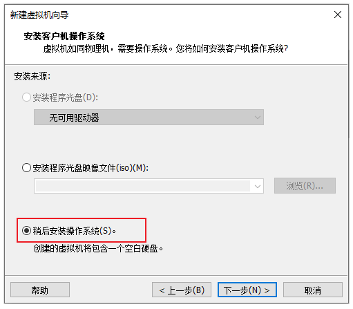 


**4). 选择"Linux"操作系统,"CentOS7 64位"版本**

 


**5). 设置虚拟机的名称及系统文件存放路径**

 


**6). 设置磁盘容量**

 


**7). 自定义硬件信息**

 


**8). 启动上述创建的新虚拟机**

  


**9). 选择"Install CentOS7"**

 

> 进入到Linux系统里面, 我们发现光标无法移动到windows操作系统中了, 这个时候, 我们可以通过快捷键 "Ctrl+Alt" 切换光标到windows系统中。


**10). 选择语言为 "简体中文"**

 


**11). 选择"自动配置分区"**

  


12). 选择"最小安装"

 


**13). 设置"root"用户密码**

 

安装完毕后，点击窗口中的蓝色的 "重启" 按钮，重启Linux系统。


**14). 登录系统**

 

> <font color='red'>注意 : 在Linux系统中，在命令行中输入密码信息，为了保证安全性，密码是不显示的(看似没有输入，实际已经输入了)；</font>


### 2. 网卡设置

服务器重启完成之后，我们可以通过linux的指令 `ip addr` 来查询Linux系统的IP地址，具体信息如下: 

 

从图中我们可以看到，并没有获取到linux系统的IP地址，这是为什么呢？这是由于启动服务器时未加载网卡，导致IP地址初始化失败而造成的。那么接下来我们就需要来修改网络初始化配置，设定网卡在系统启动时初始化。

**具体操作步骤如下：** 

1). 修改网卡的配置项

```java
cd /				进入根目录
cd etc				进入etc目录
cd sysconfig		进入sysconfig目录
cd network-scripts	进入network-scripts
vi ifcfg-ens33		编辑ifcfg-ens33文件

n
进入文件后执行如下操作: 
①. 按 i 键 		 进入编辑状态
②. 按↑↓键来移动光标, 删除no,输入yes 
③. 按 ESC 键
④. 输入 :wq
⑤. 按 ENTER	保存退出
```

 


> <font color='red'>备注: 在上述的操作中用到了Linux中的相关指令, 目前大家不用深究, 后面会详细讲解, 目前大家只需要把这个文件的配置项ONBOOT的值有no改为yes即可。</font>


2). 重新启动虚拟机

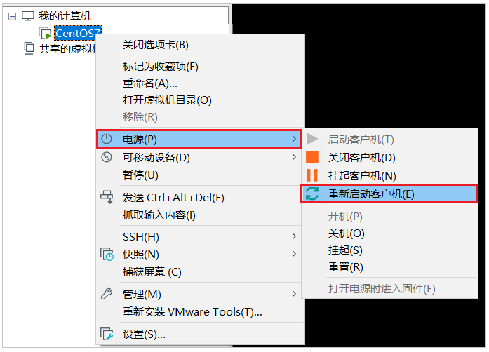 

重启之后, 再次输入root的用户名密码，登录到Linux系统之后，可以通过指令 `ip addr` 来查看IP地址。

 


### 3. 安装SSH连接工具

#### 3.1 SSH连接工具介绍

Linux已经安装并且配置好了，接下来我们要来学习Linux的基本操作指令。而在学习之前，我们还需要做一件事情，由于我们企业开发时，Linux服务器一般都是在远程的机房部署的，我们要操作服务器，不会每次都跑到远程的机房里面操作，而是会直接通过SSH连接工具进行连接操作。

 

SSH（Secure Shell），建立在应用层基础上的安全协议。常用的SSH连接工具: 

| SSH工具    | Logo                                                         | 说明                                    |
| ---------- | ------------------------------------------------------------ | --------------------------------------- |
| putty      |  | 免费, 界面简单, 功能单一                |
| secureCRT  |  | 收费, 功能强大                          |
| xshell     |  | 收费版/免费版                           |
| finalshell |  | 免费, 功能强大, 界面效果好 (课程中采用) |


#### 3.2 FinalShell安装

安装 FinalShell

#### 3.3 连接Linux

**1). 打开finalShell**

 


**2). 建立连接**

 

  


### 4. Linux目录结构

登录到Linux系统之后，我们需要先来熟悉一下Linux的目录结构。在Linux系统中，也是存在目录的概念的，但是Linux的目录结构和Windows的目录结构是存在比较多的差异的 在Windows目录下，是一个一个的盘符(C盘、D盘、E盘)，目录是归属于某一个盘符的。Linux系统中的目录有以下特点： 

**A. / 是所有目录的顶点**

**B. 目录结构像一颗倒挂的树**


**Linux 和 Windows的目录结构对比:** 

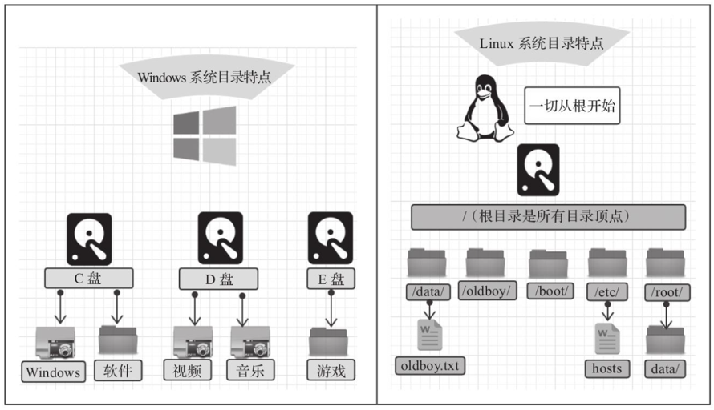 


Linux的目录结构，如下： 

 


根目录/ 下各个目录的作用及含义说明:  

| 编号 | 目录  | 含义                                       |
| ---- | ----- | ------------------------------------------ |
| 1    | /bin  | 存放二进制可执行文件                       |
| 2    | /boot | 存放系统引导时使用的各种文件               |
| 3    | /dev  | 存放设备文件                               |
| 4    | /etc  | 存放系统配置文件                           |
| 5    | /home | 存放系统用户的文件                         |
| 6    | /lib  | 存放程序运行所需的共享库和内核模块         |
| 7    | /opt  | 额外安装的可选应用程序包所放置的位置       |
| 8    | /root | 超级用户目录                               |
| 9    | /sbin | 存放二进制可执行文件，只有root用户才能访问 |
| 10   | /tmp  | 存放临时文件                               |
| 11   | /usr  | 存放系统应用程序                           |
| 12   | /var  | 存放运行时需要改变数据的文件，例如日志文件 |


## 三. Linux常用命令

### 1. Linux命令初体验

#### 1.1 常用命令演示

在这一部分中，我们主要介绍几个常用的命令，让大家快速感受以下Linux指令的操作方式。主要包含以下几个指令： 

| 序号 | 命令           | 对应英文             | 作用                    |
| ---- | -------------- | -------------------- | ----------------------- |
| 1    | ls [目录名]    | list                 | 查看当前目录下的内容    |
| 2    | pwd            | print work directory | 查看当前所在目录        |
| 3    | cd [目录名]    | change directory     | 切换目录                |
| 4    | touch [文件名] | touch                | 如果文件不存在,创建文件 |
| 5    | mkdir [目录名] | make directory       | 创建目录                |
| 6    | rm [文件名]    | remove               | 删除指定文件            |

接下来，我们快速的来演示一下这些常用的指令。


**1). ls**

 

> 指令解读: 
>
> ​	ls 	查看当前目录下的内容(文件及目录)
>
> ​	ls /   查看指定目录(/)下的内容


**2). pwd**

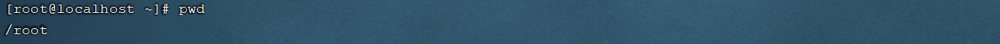 

> 指令解读: 
>
> ​	pwd	查看当前所在目录


**3). cd**

 

> 指令解读: 
>
> ​	cd  /		切换到根目录
>
> ​	cd  /root	切换到/root目录


**4). touch**

 

> 指令解读: 
>
> ​	touch  1.txt    创建文件1.txt
>
> ​	touch  2.txt 3.txt 4.txt   一次性创建文件2.txt,3.txt,3.txt


**5). mkdir**

 

> 指令解读: 
>
> ​	mkdir 01 	创建文件夹01 


**6). rm**

 

> 指令解读: 
>
> ​	rm  4.txt	删除文件 (删除文件时,需要确认,输入y, 代表确定)

**==注意:==** 

​	 

​	==在执行Linux命令时，提示信息如果显示为乱码，如上图所示。这是由于编码问题导致，只需要修改Linux的编码即可，命令如下：==

​	`echo 'LANG="en_US.UTF-8"' >> /etc/profile`

​	`source /etc/profile`


#### 1.2 Linux命令使用技巧

在我们使用Linux系统命令时，可以使用以下几个技巧： 

**1). Tab键自动补全**

**2). 连续两次Tab键，给出操作提示**

3). 使用上下箭头快速调出曾经使用过的命令

**4). 使用`clear`命令或者`Ctrl+L`快捷键实现清屏**


**操作示例:** 

A. 执行指令的时候，对于操作的文件/目录，按一下Tab会自动补全:

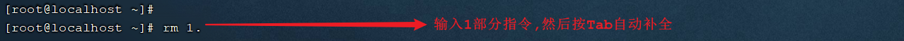 


B. 如果上述以 "1." 开头的文件有多个，可以按两下Tab键，给出操作提示:

 


C. 使用clear命令或者Ctrl+l快捷键实现清屏:


清屏之后，界面就变得干净了: 

 


#### 1.3 Linux命令格式

```
command [-options] [parameter]
	
说明: 
	command: 	 命令名
	[-options]:  选项，可用来对命令进行控制，也可以省略
	[parameter]: 传给命令的参数，可以是零个、一个或者多个
	
注意: 
	[] 	 代表可选
	命令名、选项、参数之间有空格进行分隔
```


**操作示例:** 

 


### 2. 文件目录操作命令

#### 2.1 ls

作用: 显示指定目录下的内容

语法: `ls [-al] [dir]`

说明: 
	`-a` 显示所有文件及目录 (以 . 开头的隐藏文件也会列出)
	`-l` 除文件名称外，同时将文件类型(d表示目录，-表示文件)、权限、拥有者、文件大小等信息详细列出
	
注意: 
	由于我们使用ls命令时经常需要加入-l选项，所以Linux为`ls -l`命令提供了一种简写方式，即：`ll`，`ll` 是 `ls -l` 的别名。
	
常见用法: 
	`ls -al` 	查看当前目录的所有文件及目录详细信息。等价于 `ls -a -l`
	`ls -al /etc`   查看/etc目录下所有文件及目录详细信息
	`ll`  	查看当前目录文件及目录的详细信息 

#### 2.2 cd

作用: 用于切换当前工作目录，即进入指定目录

语法: `cd [dirName]`
	
特殊说明: 
	`~`	**表示用户的主目录**，例如root的就是 /root ， 其他的就是 /home/user
	`.` 	表示目前所在的目录
	`..` 	表示目前目录位置的上级目录
	
举例: 
	`cd 	..`		切换到当前目录的上级目录
	`cd 	~`		切换到用户的home目录
	`cd 	/usr/local`	切换到/usr/local目录

备注: 

​	用户的home目录： 

​		root用户	`/root`

​		其他用户	`/home/xxx`


#### 2.3 cat

作用: 用于显示文件内容

语法: `cat [-n] fileName`

说明:
	`-n`:  输出行号

举例:

​	`cat /etc/profile`		查看/etc目录下的profile文件内容


​	cat 指令会一次性查看文件的所有内容，如果文件内容比较多，这个时候查看起来就不是很方便了，这个时候我们可以通过一个新的指令`more`。


#### 2.4 more

作用: 以分页的形式显示文件内容

语法: `more fileName`

操作说明:

​    `回车键` 	向下滚动一行
​    `空格键` 	向下滚动一屏
​    `b` 		返回上一屏
​    `q`或者`Ctrl+C`	退出more
​	
举例：
​	`more /etc/profile`		以分页方式显示/etc目录下的profile文件内容

 

当我们在查看一些比较大的文件时，我们可能需要经常查询文件尾部的数据信息，那这个时候如果文件很大，我们要一直向下翻页，直到最后一页，去看最新添加的数据，这种方式就比较繁琐了，此时，我们可以借助于`tail`命令。


#### 2.5 tail

作用: 查看文件末尾的内容，默认是查看文件最后 10 行的内容。

语法: `tail [-f] fileName`

说明:
	`-f` : 动态读取文件末尾内容并显示，通常用于日志文件的内容输出
	`-{number}` 显示文件最后 {number} 行的内容

举例: 
`tail /etc/profile`		显示/etc目录下的profile文件末尾10行的内容
`tail -20 /etc/profile`	显示/etc目录下的profile文件末尾20行的内容
`tail -f /itcast/my.log`	动态读取/itcast目录下的my.log文件末尾内容并显示


**操作示例：** 

动态读取文件尾部的数据

 

在窗口1中执行指令 `tail -f 1.txt` 动态查看文件尾部的数据。然后在顶部的标签中右键选择 "复制标签"，打开新的窗口2 , 此时再新打开的窗口2中执行指令 `echo 1 >> 1.txt` , 往1.txt文件尾部追加内容，然后我们就可以在窗口1中看到最新的文件尾部的数据。

如果我们不想查看文件尾部的数据了，可以直接使用快捷键 `Ctrl+C` ， 结束当前进程。


#### 2.6 mkdir

作用: 创建目录

语法: `mkdir [-p] dirName`

说明: 
	`-p`: 确保目录名称存在，不存在的就创建一个。通过此选项，可以实现多级目录同时创建

举例: 
    `mkdir itcast`  在当前目录下，建立一个名为itcast的子目录
    `mkdir -p itcast/test`   在工作目录下的itcast目录中建立一个名为test的子目录，若itcast目录不存在，则建立一个


**操作演示:**

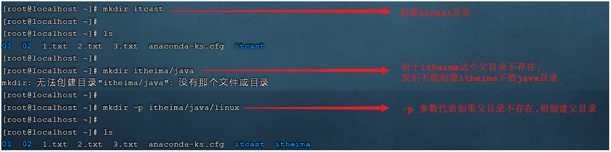 


#### 2.7 rmdir

作用: 删除**空目录**

语法: `rmdir [-p] dirName`

说明:
	`-p`: 当子目录被删除后使父目录为空目录的话，则一并删除

举例:
    `rmdir itcast`   删除名为itcast的空目录
    `rmdir -p itcast/test`   删除itcast目录中名为test的子目录，若test目录删除后itcast目录变为空目录，则也被删除
    `rmdir itcast*`   删除名称以itcast开始的空目录


#### 2.8 rm

作用: 删除文件或者目录

语法: `rm [-rf] name`

说明: 
    `-r`:  将目录及目录中所有文件（目录）逐一删除，即递归删除
    `-f`:  无需确认，直接删除
	
举例: 
    `rm -r itcast/`     删除名为itcast的目录和目录中所有文件，删除前需确认
    `rm -rf itcast/`    无需确认，直接删除名为itcast的目录和目录中所有文件
    `rm -f hello.txt`   无需确认，直接删除hello.txt文件


**注意: 对于 rm -rf xxx 这样的指令，在执行的时候，一定要慎重，确认无误后再进行删除，避免误删。**


### 3. 拷贝移动命令

#### 3.1 cp

作用: 用于复制文件或目录

语法: `cp [-r] source dest`

说明: 
	`-r`: 如果复制的是目录需要使用此选项，此时将复制该目录下所有的子目录和文件

举例: 
    `cp hello.txt itcast/`            将hello.txt复制到itcast目录中
    `cp hello.txt ./hi.txt`           将hello.txt复制到当前目录，并改名为hi.txt
    `cp -r itcast/ ./itheima/`    	将itcast目录和目录下所有内容复制到itheima目录下
    `cp -r itcast/* ./itheima/` 	 	将itcast目录下所有内容复制到itheima目录下


**操作示例:** 

 

 

 

如果拷贝的内容是目录，需要加上参数 -r 


#### 3.2 mv

作用: 为文件或目录改名、或将文件或目录移动到其它位置

语法: `mv source dest`

举例: 
    `mv hello.txt hi.txt`                 将hello.txt改名为hi.txt
    `mv hi.txt itheima/`                  将文件hi.txt移动到itheima目录中
    `mv hi.txt itheima/hello.txt`   		将hi.txt移动到itheima目录中，并改名为hello.txt

*    `mv itcast/ itheima/`                 如果itheima目录不存在，将itcast目录改名为itheima

* `mv itcast/ itheima/`                 如果itheima目录存在，将itcast目录移动到itheima目录中


**操作示例:** 

mv 命令既能够改名，又可以移动，具体是改名还是移动,系统会根据我们输入的参数进行判定(如果第二个参数dest是一个已存在的目录,将执行移动操作,其他情况都是改名)


### 4. 打包压缩命令

作用: 对文件进行打包、解包、压缩、解压

语法: `tar  [-zcxvf]  fileName  [files]`

​    包文件后缀为`.tar`表示只是完成了打包，并没有压缩

​    包文件后缀为`.tar.gz`表示打包的同时还进行了压缩

说明:
    `-z`: z代表的是gzip，通过gzip命令处理文件，gzip可以对文件压缩或者解压
    `-c`: c代表的是create，即创建新的包文件
    `-x`: x代表的是extract，实现从包文件中还原文件
    `-v`: v代表的是verbose，显示命令的执行过程
    `-f`: f代表的是file，用于指定包文件的名称（`fileName` 参数表示的文件名）

​	`-C path`: 把提取出的文件提取到 path 指定的目录处

举例：
打包:
        `tar -cvf hello.tar ./*`		  		将当前目录下所有文件打包，打包后的文件名为hello.tar
        `tar -zcvf hello.tar.gz ./*`		  	将当前目录下所有文件打包并压缩，打包后的文件名为hello.tar.gz
		

解包:
    `tar -xvf hello.tar`		  			将hello.tar文件进行解包，并将解包后的文件放在当前目录
    `tar -zxvf hello.tar.gz`		  		将hello.tar.gz文件进行解压，并将解压后的文件放在当前目录
    `tar -zxvf hello.tar.gz -C /usr/local`     将hello.tar.gz文件进行解压，并将解压后的文件放在/usr/local目录


**操作示例:** 

A. 打包

 


B. 打包并压缩

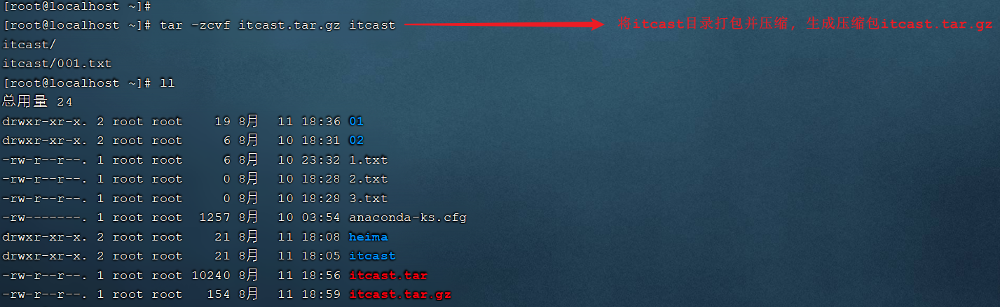 


C. 解包

 


D. 解压

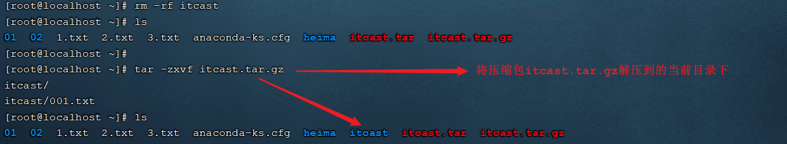 

解压到指定目录,需要加上参数 -C

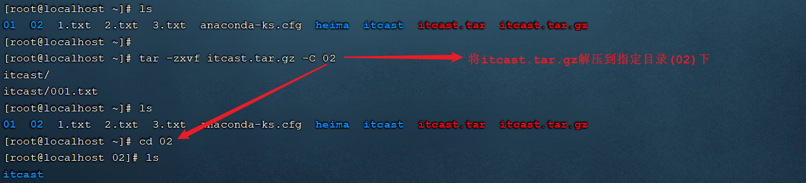 


### 5. 文本编辑命令

文本编辑的命令，主要包含两个: vi 和 vim，两个命令的用法类似，我们课程中主要讲解vim的使用。


#### 5.1 vi&vim介绍

作用: vi命令是Linux系统提供的一个文本编辑工具，可以对文件内容进行编辑，类似于Windows中的记事本

语法: vi fileName

说明: 

  1). vim是从vi发展来的一个功能更加强大的文本编辑工具，编辑文件时可以对文本内容进行着色，方便我们对文件进行编辑处理，所以实际工作中vim更加常用。

  2). 要使用vim命令，需要我们自己完成安装。可以使用下面的命令来完成安装：`yum install vim`


#### 5.2 vim安装

命令： `yum install vim`

 

安装过程中，会有确认提示，此时输入 y，然后回车，继续安装：

 

 


#### 5.3 vim使用

作用: 对文件内容进行编辑，vim其实就是一个文本编辑器

语法: `vim fileName`

说明: 
	1). 在使用vim命令编辑文件时，如果指定的文件存在则直接打开此文件。如果指定的文件不存在则新建文件。

​	2). vim在进行文本编辑时共分为三种模式，分别是 **命令模式（Command mode），插入模式（Insert mode）和底行模式（Last line mode）**。

这三种模式之间可以相互切换。我们在使用vim时一定要注意我们当前所处的是哪种模式。


##### 命令模式

​      A. 命令模式下可以查看文件内容、移动光标（上下左右箭头、gg、G）

​      B. 通过vim命令打开文件后，默认进入命令模式

​      C. 另外两种模式需要首先进入命令模式，才能进入。

| 命令模式指令 | 含义                              |
| ------------ | --------------------------------- |
| gg           | 定位到文本内容的第一行            |
| G            | 定位到文本内容的最后一行          |
| dd           | 删除光标所在行的数据              |
| ndd          | 删除当前光标所在行及之后的n行数据 |
| u            | 撤销操作                          |
| shift+zz     | 保存并退出                        |
| i 或 a 或 o  | 进入插入模式                      |


​      

##### 插入模式

​	A. 插入模式下可以对文件内容进行编辑

​	B. 在命令模式下按下`[i,a,o]`任意一个，可以进入插入模式。进入插入模式后，下方会出现【insert】字样

​	C. 在插入模式下按下ESC键，回到命令模式


##### 底行模式

​	A. 底行模式下可以通过命令对文件内容进行查找、显示行号、退出等操作

​	B. 在命令模式下按下 `:` 或者 `/` 任意一个，可以进入底行模式

​	C. 通过 `/` 方式进入底行模式后，可以对文件内容进行查找

​	D. 通过 `:` 方式进入底行模式后，可以输入`wq`（保存并退出）、`q!`（不保存退出）、`set nu`（显示行号）

| 底行模式命令 | 含义                                 |
| ------------ | ------------------------------------ |
| :wq          | 保存并退出                           |
| :q!          | 不保存退出                           |
| :set nu      | 显示行号                             |
| :set nonu    | 取消行号显示                         |
| :n           | 定位到第n行, 如 :10 就是定位到第10行 |

​      

​	

**操作示例:** 

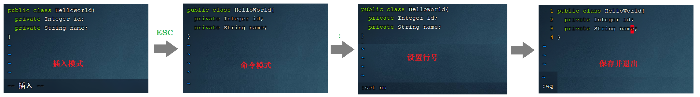 


### 6 查找命令

#### 6.1 find

作用: 在指定目录下查找文件

语法: `find dirName -option fileName`

举例:
    `find  .  –name "*.java"`			在当前目录及其子目录下查找.java结尾文件
    `find  /itcast  -name “*.java"`	在/itcast目录及其子目录下查找.java结尾的文件


**操作示例:** 

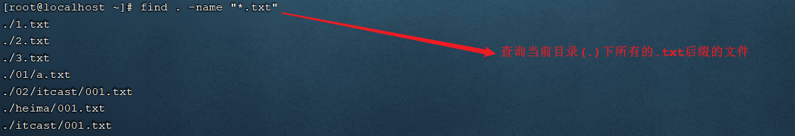 


#### 6.2 grep

作用: 从指定文件中查找指定的文本内容

语法: `grep PATTERfileName`

举例: 
    `grep Hello HelloWorld.java`	查找HelloWorld.java文件中出现的Hello字符串的位置
    `grep hello *.java`			查找当前目录中所有.java结尾的文件中包含hello字符串的位置


**操作示例:** 

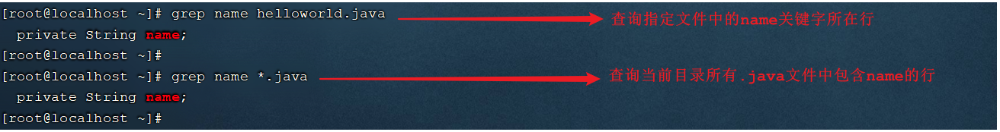 


