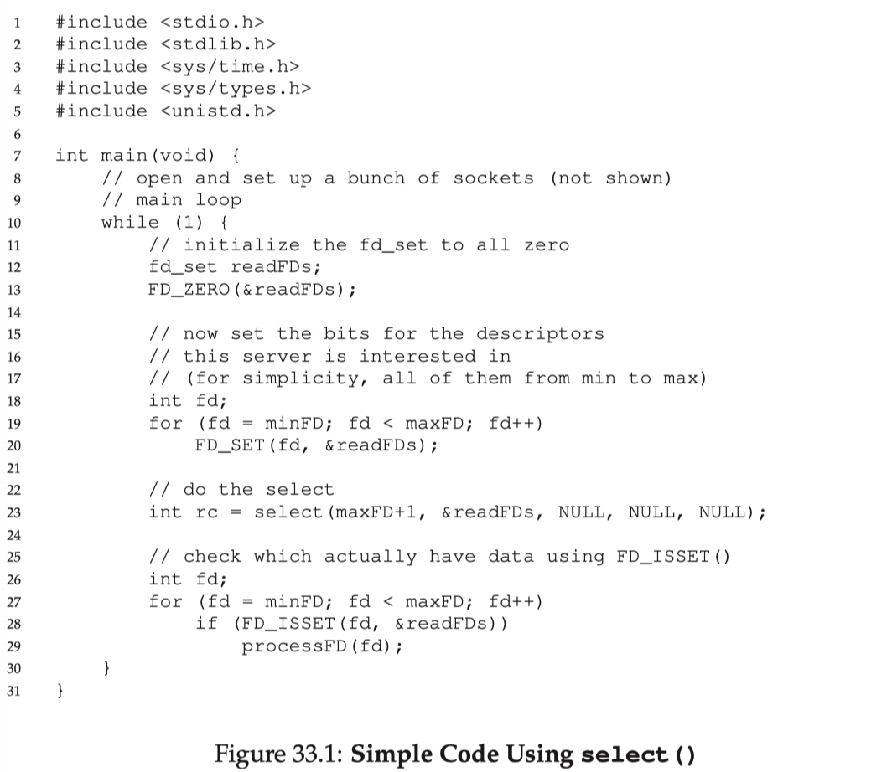

# 一 、概念说明

## 用户空间与内核空间

现在操作系统都是采用虚拟存储器，那么对32位操作系统而言，它的寻址空间（虚拟存储空间）为4G（2的32次方）。操作系统的核心是内核，独立于普通的应用程序，可以访问受保护的内存空间，也有访问底层硬件设备的所有权限。为了保证用户进程不能直接操作内核（kernel），保证内核的安全，操心系统将虚拟空间划分为两部分，一部分为内核空间，一部分为用户空间。针对linux操作系统而言，将最高的1G字节（从虚拟地址0xC0000000到0xFFFFFFFF），供内核使用，称为内核空间，而将较低的3G字节（从虚拟地址0x00000000到0xBFFFFFFF），供各个进程使用，称为用户空间。

## 进程切换

为了控制进程的执行，内核必须有能力挂起正在CPU上运行的进程，并恢复以前挂起的某个进程的执行。这种行为被称为进程切换。因此可以说，任何进程都是在操作系统内核的支持下运行的，是与内核紧密相关的。

从一个进程的运行转到另一个进程上运行，这个过程中经过下面这些变化：
1. 保存处理机上下文，包括程序计数器和其他寄存器。
2. 更新PCB信息。
3. 把进程的PCB移入相应的队列，如就绪、在某事件阻塞等队列。
4. 选择另一个进程执行，并更新其PCB。
5. 更新内存管理的数据结构。
6. 恢复处理机上下文。

注：**总而言之就是很耗资源**，具体的可以参考这篇文章：[进程切换](http://guojing.me/linux-kernel-architecture/posts/process-switch/)

## 文件描述符fd

文件描述符（file descriptor）是一个非负整数，从 0 开始。进程使用文件描述符来标识一个打开的文件。

系统为每一个进程维护了一个文件描述符表，表示该进程打开文件的记录表，而**文件描述符实际上就是这张表的索引**。当进程打开（`open`）或者新建（`create`）文件时，内核会在该进程的文件列表中新增一个表项，同时返回一个文件描述符 —— 也就是新增表项的下标。

一般来说，每个进程最多可以打开 64 个文件，`fd ∈ 0~63`。在不同系统上，最多允许打开的文件个数不同，Linux 2.4.22 强制规定最多不能超过 1,048,576。

每个进程默认都有 3 个文件描述符：0 (stdin)、1 (stdout)、2 (stderr)。

## 缓存 I/O

缓存 I/O 又被称作标准 I/O，大多数文件系统的默认 I/O 操作都是缓存 I/O。在 Linux 的缓存 I/O 机制中，操作系统会将 I/O 的数据缓存在文件系统的页缓存（ page cache ）中，也就是说，数据会先被拷贝到操作系统内核的缓冲区中，然后才会从操作系统内核的缓冲区拷贝到应用程序的地址空间。

**缓存 I/O 的缺点：**
数据在传输过程中需要在应用程序地址空间和内核进行多次数据拷贝操作，这些数据拷贝操作所带来的 CPU 以及内存开销是非常大的。


# 二、IO模式

刚才说了，对于一次IO访问（以read举例），数据会先被拷贝到操作系统内核的缓冲区中，然后才会从操作系统内核的缓冲区拷贝到应用程序的地址空间。所以说，当一个read操作发生时，它会经历两个阶段：
1. 等待数据准备 (Waiting for the data to be ready)
2. 将数据从内核拷贝到进程中 (Copying the data from the kernel to the process)

正式因为这两个阶段，linux系统产生了下面五种网络模式的方案。
- 阻塞 I/O（blocking IO）
- 非阻塞 I/O（nonblocking IO）
- I/O 多路复用（ IO multiplexing）
- 信号驱动 I/O（ signal driven IO）
- 异步 I/O（asynchronous IO）

注：由于signal driven IO在实际中并不常用，所以我这只提及剩下的四种IO Model。

## 阻塞 I/O（blocking IO）

在linux中，默认情况下所有的socket都是blocking，一个典型的读操作流程大概是这样：


当用户进程调用了recvfrom这个系统调用，kernel就开始了IO的第一个阶段：准备数据（对于网络IO来说，很多时候数据在一开始还没有到达。比如，还没有收到一个完整的UDP包。这个时候kernel就要等待足够的数据到来）。这个过程需要等待，也就是说数据被拷贝到操作系统内核的缓冲区中是需要一个过程的。而在用户进程这边，整个进程会被阻塞（当然，是进程自己选择的阻塞）。当kernel一直等到数据准备好了，它就会将数据从kernel中拷贝到用户内存，然后kernel返回结果，用户进程才解除block的状态，重新运行起来。

> 所以，blocking IO的特点就是在IO执行的两个阶段都被block了。

## 非阻塞 I/O（nonblocking IO）

linux下，可以通过设置socket使其变为non-blocking。当对一个non-blocking socket执行读操作时，流程是这个样子：


当用户进程发出read操作时，如果kernel中的数据还没有准备好，那么它并不会block用户进程，而是立刻返回一个error。从用户进程角度讲 ，它发起一个read操作后，并不需要等待，而是马上就得到了一个结果。用户进程判断结果是一个error时，它就知道数据还没有准备好，于是它可以再次发送read操作。一旦kernel中的数据准备好了，并且又再次收到了用户进程的system call，那么它马上就将数据拷贝到了用户内存，然后返回。

> 所以，nonblocking IO的特点是用户进程需要**不断的主动询问**kernel数据好了没有。

## I/O 多路复用（ IO multiplexing）

IO multiplexing就是我们说的select，poll，epoll，有些地方也称这种IO方式为event driven IO。select/epoll的好处就在于单个process就可以同时处理多个网络连接的IO。它的基本原理就是select，poll，epoll这个function会不断的轮询所负责的所有socket，当某个socket有数据到达了，就通知用户进程。


`当用户进程调用了select，那么整个进程会被block`，而同时，kernel会“监视”所有select负责的socket，当任何一个socket中的数据准备好了，select就会返回。这个时候用户进程再调用read操作，将数据从kernel拷贝到用户进程。

> 所以，I/O 多路复用的特点是通过一种机制一个进程能同时等待多个文件描述符，而这些文件描述符（套接字描述符）其中的任意一个进入读就绪状态，select()函数就可以返回。

这个图和blocking IO的图其实并没有太大的不同，事实上，还更差一些。因为这里需要使用两个system call (select 和 recvfrom)，而blocking IO只调用了一个system call (recvfrom)。但是，用select的优势在于它可以同时处理多个connection。

所以，如果处理的连接数不是很高的话，使用select/epoll的web server不一定比使用multi-threading + blocking IO的web server性能更好，可能延迟还更大。select/epoll的优势并不是对于单个连接能处理得更快，而是在于能处理更多的连接。）

在IO multiplexing Model中，实际中，对于每一个socket，一般都设置成为non-blocking，但是，如上图所示，整个用户的process其实是一直被block的。只不过process是被select这个函数block，而不是被socket IO给block。

## 异步 I/O（asynchronous IO）

inux下的asynchronous IO其实用得很少。先看一下它的流程：


用户进程发起read操作之后，立刻就可以开始去做其它的事。而另一方面，从kernel的角度，当它受到一个asynchronous read之后，首先它会立刻返回，所以不会对用户进程产生任何block。然后，kernel会等待数据准备完成，然后将数据拷贝到用户内存，当这一切都完成之后，kernel会给用户进程发送一个signal，告诉它read操作完成了。

### 阻塞和非阻塞的区别

调用blocking IO会一直block住对应的进程直到操作完成，而non-blocking IO在kernel还准备数据的情况下会立刻返回。

### 同步IO和非同步IO的区别

在说明synchronous IO和asynchronous IO的区别之前，需要先给出两者的定义。POSIX的定义是这样子的：
\- A synchronous I/O operation causes the requesting process to be blocked until that I/O operation completes;
\- An asynchronous I/O operation does not cause the requesting process to be blocked;

两者的区别就在于synchronous IO做”IO operation”的时候会将process阻塞。按照这个定义，之前所述的blocking IO，non-blocking IO，IO multiplexing都属于synchronous IO。

有人会说，non-blocking IO并没有被block啊。这里有个非常“狡猾”的地方，定义中所指的”IO operation”是指真实的IO操作，就是例子中的recvfrom这个system call。non-blocking IO在执行recvfrom这个system call的时候，如果kernel的数据没有准备好，这时候不会block进程。但是，当kernel中数据准备好的时候，recvfrom会将数据从kernel拷贝到用户内存中，这个时候进程是被block了，在这段时间内，进程是被block的。

而asynchronous IO则不一样，当进程发起IO 操作之后，就直接返回再也不理睬了，直到kernel发送一个信号，告诉进程说IO完成。在这整个过程中，进程完全没有被block。

# 三、I/O 多路复用之select、poll、epoll详解

select，poll，epoll都是IO多路复用的机制。I/O多路复用就是通过一种机制，一个进程可以监视多个描述符，一旦某个描述符就绪（一般是读就绪或者写就绪），能够通知程序进行相应的读写操作。但select，poll，epoll本质上都是同步I/O，因为他们都需要在读写事件就绪后自己负责进行读写，也就是说这个读写过程是阻塞的，而异步I/O则无需自己负责进行读写，异步I/O的实现会负责把数据从内核拷贝到用户空间。

## 1. select

### 函数签名与参数

```
int select(int nfds,
            fd_set *restrict readfds,
            fd_set *restrict writefds,
            fd_set *restrict errorfds,
            struct timeval *restrict timeout);
```

`readfds`、`writefds`、`errorfds` 是三个文件描述符（等同于socket）集合。`select` 会遍历每个集合的前 `nfds` 个描述符，分别找到可以读取、可以写入、发生错误的描述符，统称为“就绪”的描述符。然后用找到的子集替换参数中的对应集合，返回所有就绪描述符的总数。

`timeout` 参数表示调用 `select` 时的阻塞时长。如果所有文件描述符都未就绪，就阻塞调用进程，直到某个描述符就绪，或者阻塞超过设置的 timeout 后，返回。如果 `timeout` 参数设为 NULL，会无限阻塞直到某个描述符就绪；如果 `timeout` 参数设为 0，会立即返回，不阻塞。

### fd_set 文件描述符集合

参数中的 `fd_set` 类型表示文件描述符的集合。

由于文件描述符 `fd` 是一个从 0 开始的无符号整数，所以可以使用 `fd_set` 的**二进制每一位**来表示一个文件描述符。某一位为 1，表示对应的文件描述符已就绪。比如比如设 `fd_set` 长度为 1 字节，则一个 `fd_set` 变量最大可以表示 8 个文件描述符。当 `select` 返回 `fd_set = 00010011` 时，表示文件描述符 `1`、`2`、`5` 已经就绪。

`fd_set` 的使用涉及以下几个 API：

```
#include <sys/select.h>   
int FD_ZERO(int fd, fd_set *fdset);  // 将 fd_set 所有位置 0
int FD_CLR(int fd, fd_set *fdset);   // 将 fd_set 某一位置 0
int FD_SET(int fd, fd_set *fd_set);  // 将 fd_set 某一位置 1
int FD_ISSET(int fd, fd_set *fdset); // 检测 fd_set 某一位是否为 1
```

### select 使用示例

下图的代码说明：

1. 先声明一个 `fd_set` 类型的变量 `readFDs`
2. 调用 `FD_ZERO`，将 `readFDs` 所有位置 0
3. 调用 `FD_SET`，将 `readFDs` 感兴趣的位置 1，表示要监听这几个文件描述符
4. 将 `readFDs` 传给 `select`，调用 `select`
5. `select` 会将 `readFDs` 中就绪的位置 1，未就绪的位置 0，返回就绪的文件描述符的数量
6. 当 `select` 返回后，调用 `FD_ISSET` 检测给定位是否为 1，表示对应文件描述符是否就绪

比如进程想监听 1、2、5 这三个文件描述符，就将 `readFDs` 设置为 `00010011`，然后调用 `select`。

如果 `fd=1`、`fd=2` 就绪，而 `fd=5` 未就绪，`select` 会将 `readFDs` 设置为 `00000011` 并返回 2。

如果每个文件描述符都未就绪，`select` 会阻塞 `timeout` 时长，再返回。这期间，如果 `readFDs` 监听的某个文件描述符上发生可读事件，则 `select` 会将对应位置 1，并立即返回。



### select 的缺点

1. 性能开销大
   1. 调用 `select` 时会陷入内核，这时需要将参数中的 `fd_set` 从用户空间拷贝到内核空间
   2. 内核需要遍历传递进来的所有 `fd_set` 的每一位，不管它们是否就绪
2. 同时能够监听的文件描述符数量太少。受限于 `sizeof(fd_set)` 的大小，在编译内核时就确定了且无法更改。一般是 1024，不同的操作系统不相同


## 2. poll

poll 和 select 几乎没有区别。poll 在用户态通过**数组**方式**传递**文件描述符，在内核会转为**链表**方式**存储**，没有最大数量的限制。

```
int poll ( struct pollfd * fds, unsigned int nfds, int timeout);
```

### 参数

**struct pollfd * fds**

pollfd结构体定义如下：

```
struct pollfd {
    int fd;               /* 文件描述符 */
    short events;         /* 等待的事件 */
    short revents;        /* 实际发生了的事件 */
} ; 
```

每一个pollfd结构体指定了一个被监视的文件描述符，可以传递多个结构体，指示poll()监视多个文件描述符。

每个结构体的events域是监视该文件描述符的事件掩码，由用户来设置这个域。

revents域是文件描述符的操作结果事件掩码，内核在调用返回时设置这个域。

events域中请求的任何事件都可能在revents域中返回。

合法的事件如下：

```
POLLIN 　　　　　　　　有数据可读。
POLLRDNORM 　　　　  有普通数据可读。
POLLRDBAND　　　　　 有优先数据可读。
POLLPRI　　　　　　　　 有紧迫数据可读。
POLLOUT　　　　　　      写数据不会导致阻塞。
POLLWRNORM　　　　　  写普通数据不会导致阻塞。
POLLWRBAND　　　　　   写优先数据不会导致阻塞。
POLLMSGSIGPOLL 　　　　消息可用。
```

此外，revents域中还可能返回下列事件：

```
POLLER　　   指定的文件描述符发生错误。
POLLHUP　　 指定的文件描述符挂起事件。
POLLNVAL　　指定的文件描述符非法。
```

这些事件在events域中无意义，因为它们在合适的时候总是会从revents中返回。

例如，要同时监视一个文件描述符是否可读和可写，我们可以设置 events为POLLIN |POLLOUT。在poll返回时，我们可以检查revents中的标志，对应于文件描述符请求的events结构体。如果POLLIN事件被设置，则文件描述符可以被读取而不阻塞。如果POLLOUT被设置，则文件描述符可以写入而不导致阻塞。这些标志并不是互斥的：它们可能被同时设置，表示这个文件描述符的读取和写入操作都会正常返回而不阻塞。


**unsigned int nfds**
　　nfds_t类型的参数，用于标记数组fds中的结构体元素的总数量

**int timeout**
　　timeout参数指定等待的毫秒数，无论I/O是否准备好，poll都会返回。
　　timeout指定为负数值表示无限超时，使poll()一直挂起直到一个指定事件发生
　　timeout为0指示poll调用立即返回并列出准备好I/O的文件描述符，但并不等待其它的事件。这种情况下，poll()就像它的名字那样，一旦选举出来，立即返回。


### **返回值**

　　成功时，poll()返回结构体中revents域不为0的文件描述符个数。
　　如果在超时前没有任何事件发生，poll()返回0。
　　失败时，poll()返回-1

### 代码示例

```c
int main(int argc,char* argv[])
{
    struct pollfd pfd[1];
    int len = 1;

    pfd[0].fd = 0;
    pfd[0].events = POLLIN;
    pfd[0].revents = 0;

    int done = 0;
    while(!done)
    {
        switch(poll(pfd,1,-1))
        {
            case 0:
                printf("timeout\n");
                break;
            case -1:
                perror("poll");
                break;
            default:
            {
                char buf[1024];
                if(pfd[0].revents & POLLIN)
                {
                    ssize_t _s = read(pfd[0].fd,buf,sizeof(buf)-1);
                    if(_s > 0)
                    {
                        buf[_s] = '\0';
                        printf("echo:%s\n",buf);
                    }
                }
            }
            break;
        }
    }
}
```


## 3. epoll

epoll 是对 select 和 poll 的改进，避免了“性能开销大”和“文件描述符数量少”两个缺点。

简而言之，epoll 有以下几个特点：

- 使用**红黑树**存储文件描述符集合
- 使用**队列**存储就绪的文件描述符
- 每个文件描述符只需在添加时传入一次；通过事件更改文件描述符状态

select、poll 模型都只使用一个函数，而 epoll 模型使用三个函数：`epoll_create`、`epoll_ctl` 和 `epoll_wait`。

### epoll_create

```
int epoll_create(int size);
```

`epoll_create` 会创建一个 `epoll` 实例，同时返回一个引用该实例的文件描述符。

返回的文件描述符仅仅指向对应的 `epoll` 实例，并不表示真实的磁盘文件节点。其他 API 如 `epoll_ctl`、`epoll_wait` 会使用这个文件描述符来操作相应的 `epoll` 实例。

当创建好 epoll 句柄后，它会占用一个 fd 值，在 linux 下查看 `/proc/进程id/fd/`，就能够看到这个 fd。所以在使用完 epoll 后，必须调用 `close(epfd)` 关闭对应的文件描述符，否则可能导致 fd 被耗尽。当指向同一个 `epoll` 实例的所有文件描述符都被关闭后，操作系统会销毁这个 `epoll` 实例。

`epoll` 实例内部存储：

- 监听列表：所有要监听的文件描述符，使用红黑树
- 就绪列表：所有就绪的文件描述符，使用链表

### epoll_ctl

```
int epoll_ctl(int epfd, int op, int fd, struct epoll_event *event);
```

`epoll_ctl` 会监听文件描述符 `fd` 上发生的 `event` 事件。

参数说明：

- `epfd` 即 `epoll_create` 返回的文件描述符，指向一个 `epoll` 实例
- `fd` 表示要监听的目标文件描述符
- `event` 表示要监听的事件（可读、可写、发送错误…）
- op表示要对fd执行的操作，有以下几种：
  - `EPOLL_CTL_ADD`：为 `fd` 添加一个监听事件 `event`
  - `EPOLL_CTL_MOD`：Change the event event associated with the target file descriptor fd（`event` 是一个结构体变量，这相当于变量 `event` 本身没变，但是更改了其内部字段的值）
  - `EPOLL_CTL_DEL`：删除 `fd` 的所有监听事件，这种情况下 `event` 参数没用

返回值 0 或 -1，表示上述操作成功与否。

`epoll_ctl` 会将文件描述符 `fd` 添加到 `epoll` 实例的监听列表里，同时为 `fd` 设置一个回调函数，并监听事件 `event`。当 `fd` 上发生相应事件时，会调用回调函数，将 `fd` 添加到 `epoll` 实例的就绪队列上。

### epoll_wait

```
int epoll_wait(int epfd, struct epoll_event *events,
               int maxevents, int timeout);
```

这是 epoll 模型的主要函数，功能相当于 `select`。

参数说明：

- `epfd` 即 `epoll_create` 返回的文件描述符，指向一个 `epoll` 实例
- `events` 是一个数组，保存就绪状态的文件描述符，其空间由调用者负责申请
- `maxevents` 指定 `events` 的大小
- `timeout` 类似于 `select` 中的 timeout。如果没有文件描述符就绪，即就绪队列为空，则 `epoll_wait` 会阻塞 timeout 毫秒。如果 timeout 设为 -1，则 `epoll_wait` 会一直阻塞，直到有文件描述符就绪；如果 timeout 设为 0，则 `epoll_wait` 会立即返回

返回值表示 `events` 中存储的就绪描述符个数，最大不超过 `maxevents`。

```cpp
typedef union epoll_data
{
  void *ptr;
  int fd;
  uint32_t u32;
  uint64_t u64;
} epoll_data_t;

struct epoll_event
{
  uint32_t events;  /* Epoll events */
  epoll_data_t data;    /* User data variable */
};
```

### epoll 的优点

一开始说，epoll 是对 select 和 poll 的改进，避免了“性能开销大”和“文件描述符数量少”两个缺点。

对于“文件描述符数量少”，select 使用整型数组存储文件描述符集合，而 epoll 使用红黑树存储，数量较大。

对于“性能开销大”，`epoll_ctl` 中为每个文件描述符指定了回调函数，并在就绪时将其加入到就绪列表，因此 epoll 不需要像 `select` 那样遍历检测每个文件描述符，只需要判断就绪列表是否为空即可。这样，在没有描述符就绪时，epoll 能更早地让出系统资源。

> 相当于时间复杂度从 O(n) 降为 O(1)

此外，每次调用 `select` 时都需要向内核拷贝所有要监听的描述符集合，而 epoll 对于每个描述符，只需要在 `epoll_ctl` 传递一次，之后 `epoll_wait` 不需要再次传递。这也大大提高了效率。

### 水平触发、边缘触发

`select` 只支持水平触发，`epoll` 支持水平触发和边缘触发。

水平触发（LT，Level Trigger）：当文件描述符就绪时，会触发通知，如果用户程序没有一次性把数据读/写完，下次还会发出可读/可写信号进行通知。

边缘触发（ET，Edge Trigger）：仅当描述符从未就绪变为就绪时，通知一次，之后不会再通知。

区别：边缘触发效率更高，**减少了事件被重复触发的次数**，函数不会返回大量用户程序可能不需要的文件描述符。


### epoll高效的奥秘

   epoll精巧的使用了3个方法来实现select方法要做的事：

1. 新建epoll描述符==epoll_create()
2. epoll_ctrl(epoll描述符，添加或者删除所有待监控的连接)
3. 返回的活跃连接 ==epoll_wait（ epoll描述符 ）

   与select相比，epoll分清了频繁调用和不频繁调用的操作。例如，epoll_ctrl是不太频繁调用的，而epoll_wait是非常频繁调用的。这时，epoll_wait却几乎没有入参，这比select的效率高出一大截，而且，它也不会随着并发连接的增加使得入参越发多起来，导致内核执行效率下降。

​	poll是通过内核与用户空间mmap同一块内存实现的。mmap将用户空间的一块地址和内核空间的一块地址同时映射到相同的一块物理内存地址（不管是用户空间还是内核空间都是虚拟地址，最终要通过地址映射映射到物理地址），使得这块物理内存对内核和对用户均可见，减少用户态和内核态之间的数据交换。内核可以直接看到epoll监听的句柄，效率高。上面mmap出来的内存如何保存epoll所监听的套接字，必然也得有一套数据结构，epoll在实现上采用红黑树去存储所有套接字，当添加或者删除一个套接字时（epoll_ctl），都在红黑树上去处理，红黑树本身插入和删除性能比较好，时间复杂度O(logN)。

​	 通过epoll_ctl函数添加进来的事件都会被放在红黑树的某个节点内，所以，重复添加是没有用的。当把事件添加进来的时候时候会完成关键的一步，那就是该事件都会与相应的设备（网卡）驱动程序建立回调关系，当相应的事件发生后，就会调用这个回调函数，该回调函数在内核中被称为：ep_poll_callback,**这个回调函数其实就所把这个事件添加到rdllist这个双向链表中**。一旦有事件发生，epoll就会将该事件添加到双向链表中。那么当我们调用epoll_wait时，epoll_wait只需要检查rdlist双向链表中是否有存在注册的事件，效率非常可观。这里也需要将发生了的事件复制到用户态内存中即可。

 epoll_wait的工作流程：

1. epoll_wait调用ep_poll，当rdlist为空（无就绪fd）时挂起当前进程，直到rdlist不空时进程才被唤醒。
2. 文件fd状态改变（buffer由不可读变为可读或由不可写变为可写），导致相应fd上的回调函数ep_poll_callback()被调用。
3. ep_poll_callback将相应fd对应epitem加入rdlist，导致rdlist不空，进程被唤醒，epoll_wait得以继续执行。
4. ep_events_transfer函数将rdlist中的epitem拷贝到txlist中，并将rdlist清空。
5. ep_send_events函数（很关键），它扫描txlist中的每个epitem，调用其关联fd对用的poll方法。此时对poll的调用仅仅是取得fd上较新的events（防止之前events被更新），之后将取得的events和相应的fd发送到用户空间（封装在struct epoll_event，从epoll_wait返回）。   

## 三者对比

- `select`：调用开销大（需要复制集合）；集合大小有限制；需要遍历整个集合找到就绪的描述符
- `poll`：poll 采用数组的方式存储文件描述符，没有最大存储数量的限制，其他方面和 select 没有区别
- `epoll`：调用开销小（不需要复制）；集合大小无限制；采用回调机制，不需要遍历整个集合

`select`、`poll` 都是在用户态维护文件描述符集合，因此每次需要将完整集合传给内核；`epoll` 由操作系统在内核中维护文件描述符集合，因此只需要在创建的时候传入文件描述符。

此外 `select` 只支持水平触发，`epoll` 支持边缘触发。

## 适用场景

当连接数较多并且有很多的不活跃连接时，epoll 的效率比其它两者高很多。当连接数较少并且都十分活跃的情况下，由于 epoll 需要很多回调，因此性能可能低于其它两者。
