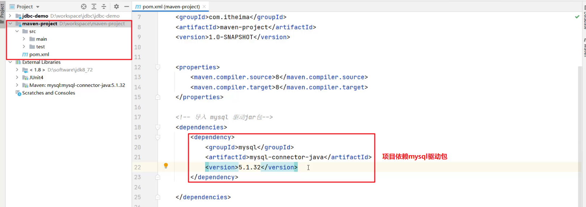

## Maven

Maven是专门用于管理和构建Java项目的工具，它的**主要功能**有：

* 提供了一套标准化的**项目结构**

* 提供了一套标准化的**构建流程**（编译，测试，打包，发布……）

* 提供了一套**依赖管理机制**


### Maven构建的项目结构。


**标准化的构建流程：**


如上图所示我们开发了一套系统，代码需要进行编译、测试、打包、发布，这些操作如果需要反复进行就显得特别麻烦，而Maven提供了一套简单的命令来完成项目构建。

**依赖管理：**

依赖管理其实就是管理你项目所依赖的第三方资源（jar包、插件）。如之前我们项目中需要使用JDBC和Druid的话，就需要去网上下载对应的依赖包（当前之前是老师已经下载好提供给大家了），复制到项目中，还要将jar包加入工作环境这一系列的操作。如下图所示


而Maven使用标准的 **==坐标==** 配置来管理各种依赖，只需要简单的配置就可以完成依赖管理。


如上图右边所示就是mysql驱动包的坐标，在项目中只需要写这段配置，其他都不需要我们担心，Maven都帮我们进行操作了。

市面上有很多构建工具，而Maven依旧还是主流构建工具，如下图是常用构建工具的使用占比


### 1.1  Maven简介

**==Apache Maven==** 是一个项目管理和构建**工具**，它基于项目**对象模型(POM)**的概念，通过一小段描述信息来管理项目的构建、报告和文档。

官网 ：http://maven.apache.org/ 

通过上面的描述大家只需要知道Maven是一个工具即可。Apache 是一个开源组织，将来我们会学习很多Apache提供的项目。


#### 1.1.1  Maven模型

* **项目对象模型 (Project Object Model)**
* **依赖管理模型(Dependency)**
* **插件(Plugin)**


如上图所示就是Maven的模型，而我们先看紫色框框起来的部分，他就是用来完成 `标准化构建流程` 。如我们需要编译，Maven提供了一个**编译插件**供我们使用，我们需要打包，Maven就提供了一个打包插件提供我们使用等。


上图中紫色框起来的部分，项目对象模型就是将我们自己抽象成一个对象模型，有自己专属的坐标，如下图所示是一个Maven项目：


依赖管理模型则是使用坐标来描述当前项目依赖哪儿些第三方jar包，如下图所示



上述Maven模型图中还有一部分是仓库。如何理解仓库呢？

#### 1.1.2  仓库

大家想想这样的场景，我们创建Maven项目，在项目中使用坐标来指定项目的依赖，那么依赖的jar包到底存储在什么地方呢？其实依赖jar包是存储在我们的本地仓库中。而项目运行时从本地仓库中拿需要的依赖jar包。

##### **仓库分类**

* **本地仓库**：自己计算机上的一个目录

* **中央仓库**：由Maven团队维护的全球唯一的仓库

  * 地址： https://repo1.maven.org/maven2/

* **远程仓库(私服)**：一般由公司团队搭建的私有仓库

  今天我们只学习远程仓库的使用，并不会搭建。


当项目中使用坐标引入对应依赖jar包后，首先会查找**本地仓库**中是否有对应的jar包：

* 如果有，则在项目直接引用;

* 如果没有，则去**中央仓库**中下载对应的jar包到本地仓库。


如果还可以搭建远程仓库，将来jar包的查找顺序则变为：

> 本地仓库 --> 远程仓库--> 中央仓库


### 1.2  Maven安装配置

* 解压 apache-maven-3.6.1.rar 既安装完成

  

  > 建议解压缩到没有中文、特殊字符的路径下。如课程中解压缩到 `D:\software` 下。

  解压缩后的目录结构如下：

  

  * **bin目录** ： 存放的是可执行命令。mvn 命令重点关注。
  * **conf目录** ：存放Maven的配置文件。`settings.xml` 配置文件后期需要修改。
  * **lib目录** ：存放Maven依赖的jar包。Maven也是使用java开发的，所以它也依赖其他的jar包。

  

  

#### 配置环境变量

  环境变量 `MAVEN_HOME` 为maven的安装路径：

  在系统变量处新建一个变量 `MAVEN_HOME`

  

  在 `Path` 中进行配置

  

  打开命令提示符进行验证，出现如图所示表示安装成功

  


#### 配置本地仓库

修改 conf/settings.xml 中的 `<localRepository>` 为一个指定目录作为本地仓库，用来存储jar包。


#### 配置阿里云私服

中央仓库在国外，所以下载jar包速度可能比较慢，而阿里公司提供了一个远程仓库，里面基本也都有开源项目的jar包。

修改 conf/settings.xml 中的 `<mirrors>`标签，为其添加如下子标签：

```xml
<mirror>  
    <id>alimaven</id>  
    <name>aliyun maven</name>  
    <url>http://maven.aliyun.com/nexus/content/groups/public/</url>
    <mirrorOf>central</mirrorOf>          
</mirror>
```


### 1.3  Maven基本使用

#### 1.3.1  Maven 常用命令

* compile ：编译

* clean：清理

* test：测试

* package：打包

* install：安装

**命令演示：**

一个使用Maven构建的项目，项目结构如下：


而我们使用上面命令需要在磁盘上进入到项目的 **`pom.xml` 文件所在的目录下**


##### **compile命令**

```java
compile ：编译
```

执行上述命令可以看到：

* 从阿里云下载编译需要的插件的jar包，在本地仓库也能看到下载好的插件
* 在项目下会生成一个 `target` 目录


同时在项目下会出现一个 `target` 目录，编译后的字节码文件就放在该目录下


##### **clean命令**

```
mvn clean
```

执行上述命令可以看到

* 从阿里云下载清理需要的插件jar包（第一次运行）
* 删除项目下的 `target` 目录


##### **package命令**

```
mvn package
```

执行上述命令可以看到：

* 从阿里云下载打包需要的插件jar包（第一次运行）
* 在项目的 `terget` 目录下有一个jar包（将当前项目打成的jar包）


##### **test命令**

```
mvn test  
```

该命令会执行所有的测试代码。执行上述命令效果如下


##### **install命令**

```
mvn install
```

该命令会将当前项目打成jar包，**并安装到本地仓库**。执行完上述命令后到本地仓库查看结果如下：


#### 1.3.2  Maven 生命周期

Maven 构建项目生命周期 描述的是一次构建过程经历了多少个阶段（Phase）

Maven 对项目构建的生命周期划分为**3套**：

* **clean** ：清理工作。
* **default** ：核心工作，例如编译，测试，打包，安装等。
* **site** ： 产生报告，发布站点等。这套声明周期一般不会使用。


Maven项目的构建生命周期是由一系列阶段（Phase）构成的，前面所述的一些命令就对应于响应的阶段。

同一套生命周期内，**执行后边的命令（阶段），前面的所有命令会自动执行**。例如默认（default）生命周期如下：


当我们执行 `install`（安装）命令时，它会先执行 `compile`命令，再执行 `test ` 命令，再执行 `package` 命令，最后执行 `install` 命令。

当我们执行 `package` （打包）命令时，它会先执行 `compile` 命令，再执行 `test` 命令，最后执行 `package` 命令。


默认的生命周期也有对应的很多阶段（命令），其他的一般都不会使用，我们只关注常用的：


### Maven 坐标详解

**什么是坐标？**

* Maven 中的坐标是**==资源的唯一标识==**
* 使用坐标来定义项目或引入项目中需要的依赖

**Maven 坐标主要组成**

* **groupId**：定义当前Maven项目隶属组织名称（通常是域名反写，例如：com.itheima）
* **artifactId**：定义当前Maven项目名称（通常是模块名称，例如 order-service、goods-service）
* **version**：定义当前项目版本号

如下图就是使用坐标表示一个项目：


**==注意：==**

* 上面所说的资源可以是 插件、依赖、当前项目。
* 我们的项目如果被其他的项目依赖时，也是需要坐标来引入的。


### 1.4  IDEA使用Maven

#### 1.4.1  IDEA配置Maven环境

我们需要先在IDEA中配置Maven环境：

* 选择 IDEA中 File --> Settings

  

* 搜索 maven 

  

* 设置 IDEA 使用本地安装的 Maven，并修改配置文件路径

  


#### 1.4.2  IDEA 创建 Maven项目

* 创建模块，选择Maven，点击Next

  

* 填写模块名称，坐标信息，点击finish，创建完成

  

  创建好的项目目录结构如下：

  

  

#### 1.4.3  IDEA 导入 Maven项目

我们可以通过以下步骤进行项目的导入：

* 选择右侧Maven面板，点击 + 号

  

* 选中对应项目的**pom.xml文件**，双击即可

  

* 如果没有Maven面板，选择

  View --> Appearance --> Tool Window Bars

  


可以通过下图所示进行命令的操作：


**Maven-Helper 插件** 

​	安装完该插件后可以通过 选中项目右键进行相关命令操作，如下图所示：


### 1.5  依赖管理

#### 1.5.1  使用坐标引入jar包

**使用坐标引入jar包的步骤：**

* 在项目的 pom.xml 中编写 <dependencies> 标签

* 在 <dependencies> 标签中 使用 <dependency> 引入坐标

* 定义坐标的 groupId，artifactId，version

  

* 点击刷新按钮，使坐标生效

  

>  注意：
>
>  * 具体的坐标我们可以到如下网站进行搜索
>  * https://mvnrepository.com/


**快捷方式导入jar包的坐标：**

每次需要引入jar包，都去对应的网站进行搜索是比较麻烦的，接下来给大家介绍一种快捷引入坐标的方式

* 在 pom.xml 中 按 alt + insert，选择 Dependency

  

* 在弹出的面板中搜索对应坐标，然后双击选中对应坐标

  

* 点击刷新按钮，使坐标生效

  


**自动导入设置：**

上面每次操作都需要点击刷新按钮，让引入的坐标生效。当然我们也可以通过设置让其自动完成

* 选择 IDEA中 File --> Settings

  

* 在弹出的面板中找到 Build Tools

  

* 选择 Any changes，点击 ok 即可生效


#### 1.5.2  依赖范围

通过设置坐标的**依赖范围(scope)**，可以设置 对应jar包的作用范围：**编译环境、测试环境、运行环境**。

如下图所示给 `junit` 依赖通过 `scope` 标签指定依赖的作用范围。 那么这个依赖就只能作用在测试环境，其他环境下不能使用。


那么 `scope` 都可以有哪些取值呢？

| **依赖范围**        | 编译classpath | 测试classpath | 运行classpath | 例子                        |
| ------------------- | ------------- | ------------- | ------------- | --------------------------- |
| **compile（默认）** | Y             | Y             | Y             | logback                     |
| **test**            | -             | Y             | -             | Junit                       |
| **provided**        | Y             | Y             | -             | servlet-api                 |
| **runtime**         | -             | Y             | Y             | jdbc驱动（例如mysql驱动）   |
| **system**          | Y             | Y             | Y             | 运行时使用存储在本地的jar包 |

* compile ：作用于编译环境、测试环境、运行环境。
* test ： test表示只会在测试阶段使用，在src/main/java里面的代码是无法使用这些api的，并且项目打包时，也不会将"test"标记的打入"jar"包或者"war"包。典型的就是Junit坐标，以后使用Junit时，都会将scope指定为该值
* provided ：provided表示的是在编译和测试的时候有效，在执行（mvn package）进行打包成war、jar包的时候不会加入。我们后面会学习 `servlet-api` ，在使用它时，必须将 `scope` 设置为该值，不然运行时就会报错。
* runtime  ： 作用于测试环境、运行环境。jdbc驱动一般将 `scope` 设置为该值，当然不设置也没有任何问题 
* system：system依赖不是从maven仓库中获得，而是本地的jar包，因此必须配合systemPath标签来指定本地的jar包所在全路径。这类jar包默认会参与编译、测试、运行，但是不会被参与打包阶段。如果也想打包进去的话，需要在打包插件里做配置：`<includeSystemScope>true</includeSystemScope>`

**注：**

还有一个叫做 **import** 的 特殊scope：

​	import scope只能用在dependencyManagement标签里面

​	它的作用是将其他模块定义好的 dependencyManagement 导入当前 Maven 项目 pom 的 dependencyManagement 中，通常是为了解决Maven的单继承问题。

​	比如我们自己的项目需要继承本公司自己编写的一个parent，同时又需要用到SpringBoot里的一些模块，那么就可以如下配置：

```xml
<dependencyManagement>
	<dependencies>
		<dependency>
			<groupId>org.springframework.boot</groupId>
			<artifactId>spring-boot-dependencies</artifactId>
			<version>1.3.3.RELEASE</version>
			<type>pom</type>
			<scope>import</scope>
		</dependency>
	</dependencies>
</dependencyManagement>
 
<dependencies>
	<dependency>
		<groupId>org.springframework.boot</groupId>
		<artifactId>spring-boot-starter-web</artifactId>
	</dependency>
</dependencies>
```


> 注意：
>
> * 如果引入坐标不指定 `scope` 标签时，默认就是 compile  值。以后大部分jar包都是使用默认值。

