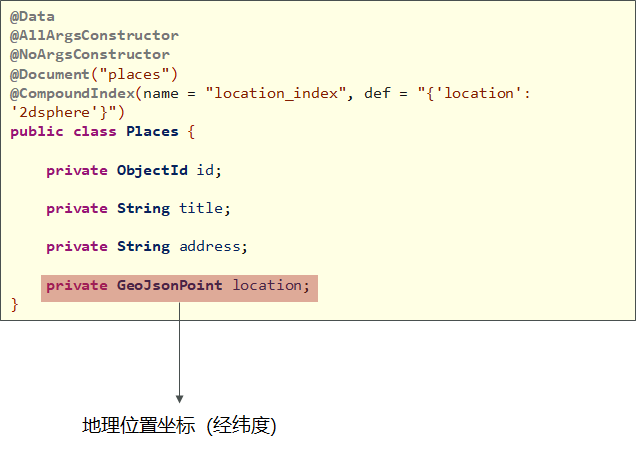
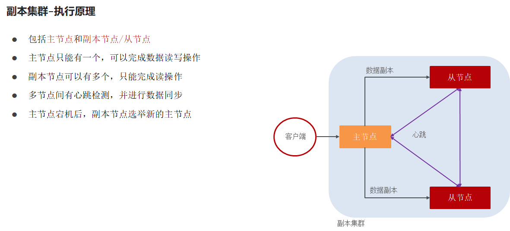
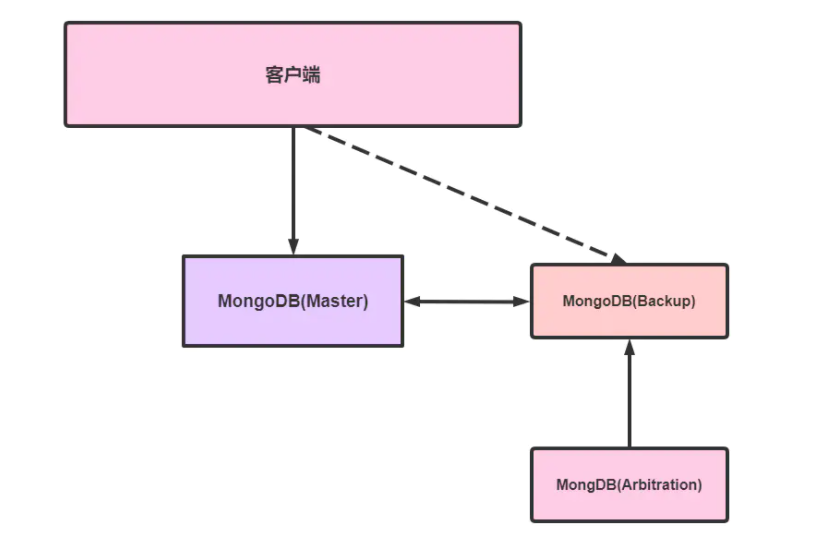
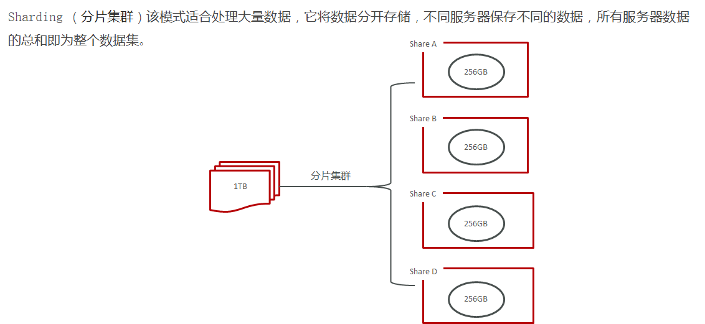
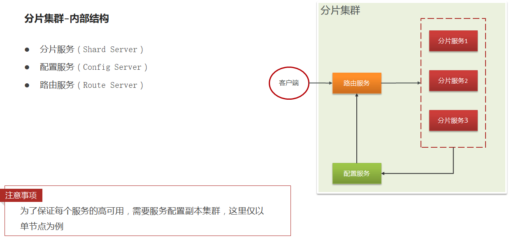

# 一、MongoDB简介

## 1. MongoDB简介

MongoDB：是一个高效的非关系型数据库（不支持表关系：只能操作单表）

MongoDB是一个介于关系数据库和非关系数据库之间的产品，是非关系数据库当中功能最丰富，最像关系数据库的。它支持的数据结构非常松散，是类似json的bson格式，因此可以存储比较复杂的数据类型。

官网：https://www.mongodb.com

## 2. 通过docker安装MongoDB

```
docker pull mongo
docker run --name mongo-service -p 27017:27017 -v ~/data/mongodata:/data -d  mongo
```

## 3. MongoDB体系结构

MongoDB 的逻辑结构是一种层次结构。主要由： 文档(document)、集合(collection)、数据库(database)这三部分组成的。逻辑结构是面向用户的，用户使用 MongoDB 开发应用程序使用的就是逻辑结构。 

1. MongoDB 的**文档（document）**，相当于关系数据库中的一行记录。 
2. 多个文档组成一个**集合（collection）**，相当于关系数据库的表。 
3. 多个集合（collection），逻辑上组织在一起，就是**数据库（database）**。 
4. 一个 MongoDB 实例支持多个数据库（database）。 文档(document)、集合(collection)、数据库(database)的层次结构如下图:


为了更好的理解，下面与SQL中的概念进行对比：

| SQL术语/概念 | MongoDB术语/概念 | 解释/说明                             |
| ------------ | ---------------- | ------------------------------------- |
| database     | database         | 数据库                                |
| table        | collection       | 数据库表/集合                         |
| row          | document         | 表中的一行数据                        |
| column       | field            | 数据字段/域                           |
| index        | index            | 索引                                  |
| table joins  |                  | 表连接,MongoDB不支持                  |
| primary key  | primary key      | 主键,MongoDB自动将`_id`字段设置为主键 |

 

## 4. 数据类型

数据格式：**BSON**  `{aa:bb}`

- **null**：用于表示空值或者不存在的字段，`{"x":null}` 
- **布尔型**：布尔类型有两个值true和false，`{"x":true}` 
- **数值**：shell中默认使用64位浮点型数值。`{"x"：3.14}`或 `{"x"：3}`。
  - 对于整型值，可以使用 `NumberInt`（4字节符号整数）或 `NumberLong`（8字节符号整数）， `{"x":NumberInt("3")}  {"x":NumberLong("3")}` 
- **字符串**：UTF-8字符串都可以表示为字符串类型的数据，`{"x"："呵呵"}` 
- **日期**：日期被存储为自新纪元依赖经过的毫秒数，不存储时区，`{"x":new Date()}`
- **正则表达式**：查询时，使用正则表达式作为限定条件，语法与JavaScript的正则表达式相同，`{"x":/[abc]/}` 
- **数组**：数据列表或数据集可以表示为数组，`{"x":["a","b","c"]}` 
- **内嵌文档**：文档可以嵌套其他文档，被嵌套的文档作为值来处理，`{"x":{"y":3 }}` 
- **对象Id**：对象id是一个12字节的字符串，是文档的唯一标识，`{"x": objectId() }` 
- **二进制数据**：二进制数据是一个任意字节的字符串。它不能直接在shell中使用。如果要将非utf-8字符保存到数据库中，二进制数据是唯一的方式。

# 二、MongoDB基本命令

## 1、数据库以及表的操作

~~~shell
#查看所有的数据库
> show dbs

#通过use关键字切换数据库
> use admin

#创建数据库
#说明：在MongoDB中，数据库是自动创建的，通过use切换到新数据库中，进行插入数据即可自动创建数据库
> use testdb

> db.user.insert({id:1,name:'zhangsan'})  #插入数据(自动创建表和数据库)

#查看表
> show tables

> show collections

#删除集合（表）
> db.user.drop()
true  #如果成功删除选定集合，则 drop() 方法返回 true，否则返回 false。

#删除数据库
> use testdb #先切换到要删除的数据中

> db.dropDatabase()  #删除数据库
~~~

## 2、新增数据

在MongoDB中，存储的文档结构是一种类似于json的结构，称之为bson（全称为：Binary JSON）。

~~~shell
#插入数据
#语法：db.表名.insert(json字符串)

> db.user.insert({id:1,username:'zhangsan',age:20})

> db.user.find()  #查询数据
~~~

## 3、更新数据

update() 方法用于更新已存在的文档。语法格式如下：

```shell
db.collection.update(
   <query>,
   <update>,
   [
     upsert: <boolean>,
     multi: <boolean>,
     writeConcern: <document>
   ]
)
```

**参数说明：**

- **query** : update的查询条件，类似sql update查询内where后面的。
- **update** : update的对象和一些更新的操作符（如$，$inc，$set）等，也可以理解为sql update查询内set后面的
- **upsert** : 可选，这个参数的意思是，如果不存在update的记录，是否插入新的记录。true为插入，默认是false，不插入。
- **multi** : 可选，mongodb 默认是false, 只更新找到的第一条记录，如果这个参数为true,就把按条件查出来多条记录全部更新。
- **writeConcern** :可选，抛出异常的级别。

~~~shell
#查询全部
> db.user.find()

#更新数据
> db.user.update({id:1},{$set:{age:22}}) 

#注意：如果这样写，会删除掉其他的字段
> db.user.update({id:1},{age:25})

#更新不存在的字段，会新增字段
> db.user.update({id:2},{$set:{sex:1}}) #更新数据

#更新不存在的数据，默认不会新增数据
> db.user.update({id:3},{$set:{sex:1}})

#如果设置第一个参数为true，就是新增数据
> db.user.update({id:3},{$set:{sex:1}},true)
~~~

## 4、删除数据

通过remove()方法进行删除数据，语法如下：

~~~shell
db.collection.remove(
   <query>,
   {
     justOne: <boolean>,
     writeConcern: <document>
   }
)
~~~

**参数说明：**

- **query** :（可选）删除的文档的条件。
- **justOne** : （可选）如果设为 true 或 1，则只删除一个文档，如果不设置该参数，或使用默认值 false，则删除所有匹配条件的文档。
- **writeConcern** :（可选）抛出异常的级别。

实例：

~~~shell
#插入4条测试数据
db.user.insert({id:1,username:'zhangsan',age:20})
db.user.insert({id:2,username:'lisi',age:21})
db.user.insert({id:3,username:'wangwu',age:22})
db.user.insert({id:4,username:'zhaoliu',age:22})

#删除一条数据
> db.user.remove({age:22},true)

#删除所有数据
> db.user.remove({})
~~~

## 5、查询数据

MongoDB 查询数据的语法格式如下：

```
db.user.find([query],[fields])
```

- **query** ：可选，使用查询操作符指定查询条件
- **fields** ：可选，使用投影操作符指定返回的键。查询时如果要返回文档中所有键值， 只需省略该参数即可（默认省略）。

条件查询：

| 操作       | 格式                     | 范例                                        | RDBMS中的类似语句         |
| ---------- | ------------------------ | ------------------------------------------- | ------------------------- |
| 等于       | `{<key>:<value>`}        | `db.col.find({"by":"黑马程序员"}).pretty()` | `where by = '黑马程序员'` |
| 小于       | `{<key>:{$lt:<value>}}`  | `db.col.find({"likes":{$lt:50}}).pretty()`  | `where likes < 50`        |
| 小于或等于 | `{<key>:{$lte:<value>}}` | `db.col.find({"likes":{$lte:50}}).pretty()` | `where likes <= 50`       |
| 大于       | `{<key>:{$gt:<value>}}`  | `db.col.find({"likes":{$gt:50}}).pretty()`  | `where likes > 50`        |
| 大于或等于 | `{<key>:{$gte:<value>}}` | `db.col.find({"likes":{$gte:50}}).pretty()` | `where likes >= 50`       |
| 不等于     | `{<key>:{$ne:<value>}}`  | `db.col.find({"likes":{$ne:50}}).pretty()`  | `where likes != 50`       |

实例：

~~~shell
#插入测试数据
db.user.insert({id:1,username:'zhangsan',age:20})
db.user.insert({id:2,username:'lisi',age:21})
db.user.insert({id:3,username:'wangwu',age:22})
db.user.insert({id:4,username:'zhaoliu',age:22})

db.user.find()  #查询全部数据
db.user.find({},{id:1,username:1})  #只查询id与username字段
db.user.find().count()  #查询数据条数
db.user.find({id:1}) #查询id为1的数据
db.user.find({age:{$lte:21}}) #查询小于等于21的数据
db.user.find({$or:[{id:1},{id:2}]}) #查询id=1 or id=2

#分页查询：Skip()跳过几条，limit()查询条数
db.user.find().limit(2).skip(1)  #跳过1条数据，查询2条数据
db.user.find().sort({id:-1}) #按照id倒序排序，-1为倒序，1为正序
~~~

## 6、索引

~~~shell
#创建索引
> db.user.createIndex({'age':1})

#查看索引
> db.user.getIndexes()
[
	{
		"v" : 2,
		"key" : {
			"_id" : 1
		},
		"name" : "_id_",
		"ns" : "testdb.user"
	}
]
#说明：1表示升序创建索引，-1表示降序创建索引。
~~~


## 7、执行计划

MongoDB 查询分析可以确保我们建议的索引是否有效，是查询语句性能分析的重要工具。

~~~shell
#插入1000条数据
for(var i=1;i<1000;i++)db.user.insert({id:100+i,username:'name_'+i,age:10+i})

#查看执行计划
> db.user.find({age:{$gt:100},id:{$lt:200}}).explain()

#测试没有使用索引
> db.user.find({username:'zhangsan'}).explain()

#winningPlan：最佳执行计划
#"stage" : "FETCH", #查询方式，常见的有COLLSCAN/全表扫描、IXSCAN/索引扫描、FETCH/根据索引去检索文档、SHARD_MERGE/合并分片结果、IDHACK/针对_id进行查询
~~~

# 三、SpringData-Mongo

Spring-data对MongoDB做了支持，使用spring-data-mongodb可以简化MongoDB的操作，封装了底层的mongodb-driver。

地址：https://spring.io/projects/spring-data-mongodb

使用Spring-Data-MongoDB很简单，只需要如下几步即可：

* 导入起步依赖
* 编写配置信息
* 编写实体类（配置注解  @Document，@Id）
* 操作mongodb
  * **注入MongoTemplate对象，完成CRUD操作**

## 1. 依赖

~~~xml
<parent>
    <groupId>org.springframework.boot</groupId>
    <artifactId>spring-boot-starter-parent</artifactId>
    <version>2.3.9.RELEASE</version>
</parent>
<dependencies>
    <dependency>
         <groupId>org.springframework.boot</groupId>
         <artifactId>spring-boot-starter-data-mongodb</artifactId>
    </dependency>
</dependencies>
~~~

## 2. 配置文件

~~~yml
spring:
  data:
    mongodb:
      uri: mongodb://192.168.136.160:27017/testdb
~~~

## 3. 完成基本操作

### 3.1 实体类（@Document注解）

~~~java
import lombok.AllArgsConstructor;
import lombok.Data;
import lombok.NoArgsConstructor;
import org.bson.types.ObjectId;	 //注意不要导错包
import org.springframework.data.mongodb.core.mapping.Document;

@Data
@AllArgsConstructor
@NoArgsConstructor
@Document(collection="person")		//指定集合名称，默认是类的首字母小写。
public class Person {
	//@Id 可以通过该注解指明实体类中对应集合中id的属性。
    //@Indexed 指定索引列
    private ObjectId id;
    //@Field("myname") 可以通过该注解指明集合中的对应的字段名
    private String name;
    private int age;
    private String address;
    
}
~~~

### 3.2 MongoTemplate进行CRUD

~~~java
@RunWith(SpringRunner.class)
@SpringBootTest(classes = MongoApplication.class)
public class MongoTest {

    /**
     * SpringData-mongodb操作
     *    1、配置实体类
     *    2、实体类上配置注解（配置集合和对象间的映射关系）
     *    3、注入MongoTemplate对象
     *    4、调用对象方法，完成数据库操作
     */
    @Autowired
    private MongoTemplate mongoTemplate;

    //保存
    @Test
    public void testSave() {
        for (int i = 0; i < 10; i++) {
            Person person = new Person();
            person.setId(ObjectId.get()); //ObjectId.get()：获取一个唯一主键字符串
            person.setName("张三"+i);
            person.setAddress("北京顺义"+i);
            person.setAge(18+i);
            //save方法保存
            mongoTemplate.save(person);
        }
    }

    //查询-查询所有
    @Test
    public void testFindAll() {
        //findAll方法，查询所有
        List<Person> list = mongoTemplate.findAll(Person.class);
        for (Person person : list) {
            System.out.println(person);
        }
    }

    //条件查询
    @Test
    public void testFind() {
        //查询年龄小于20的所有人
        //先创建一个Criteria对象，然后把这个对象传递给Query的构造方法，得到Query对象
        Criteria criteria = Criteria.where("age").lt(20)//类似于sql中的 where age < 20 。 where方法中的参数是MongoDB中集合的字段名
         /*
         如果有多个条件可以这样写
         Criteria criteria = Criteria.where("age").lt(20)
         						.and("name").is("zhangsan")
         类似于sql中的 where age < 20 and name = zhangsan
         */
            
        Query query = new Query(criteria); //查询条件对象
        //使用 find方法来进行条件查询，第一个参数 Query对象， 第二个参数 实体类的Class对象
        List<Person> list = mongoTemplate.find(query, Person.class);
		
       //findOne方法查询一个文档
        
        for (Person person : list) {
            System.out.println(person);
        }
    }

    /**
     * 分页查询
     */
    @Test
    public void testPage() {
        Criteria criteria = Criteria.where("age").lt(30);
        //1、查询总数
        Query queryCount = new Query(criteria);
        long count = mongoTemplate.count(queryCount, Person.class);
        System.out.println(count);

        //当前页码
        int page = 1;
        //每页的条数
        int pageSize = 5;

        //2、查询当前页的数据列表, 查询 第2页，每页查询2条
        Query queryLimit = new Query(criteria)
                .limit(pageSize) //设置每页查询条数
                .skip((page - 1) * pageSize)  //跳过多少条数据（也就是从第几条数据开始查询） （page-1）*pageSize
                .with(Sort.by(Sort.Order.desc("age"))); //设置排序.根据 age字段降序排列

        List<Person> list = mongoTemplate.find(queryLimit, Person.class);
        for (Person person : list) {
            System.out.println(person);
        }
    }


    /**
     * 更新:
     */
    @Test
    public void testUpdate() {
        //1、
        Query query = Query.query(Criteria.where("id").is("5fe404c26a787e3b50d8d5ad"));
        //2、更新的数据
        Update update = new Update();
        update.set("age", 20);
        
       	//传递 Query对象 Update对象 实体类Class对象
        mongoTemplate.updateFirst(query, update, Person.class);
    }
    
    //更新并获取更新后的结果
    public Long getNextId(String collName) {
        Query query = new Query(Criteria.where("collName").is(collName));
        Update update = new Update();
        update.inc("seqId", 1);

        FindAndModifyOptions options = new FindAndModifyOptions();
        options.upsert(true);	//有则更新，无则添加
        options.returnNew(true);//每次返回最新的内容
		//findAndModify 查找并修改
        Sequence sequence = mongoTemplate.findAndModify(query, update, options, Sequence.class);
        return sequence.getSeqId();
    }
	
    /**
    * 删除
    */
    @Test
    public void testRemove() {
        Query query = Query.query(Criteria.where("id").is("5fe404c26a787e3b50d8d5ad"));
        mongoTemplate.remove(query, Person.class);
    }
    
    //判断数据是否存在
public Boolean hasComment(String movementId, Long userId, CommentType commentType) {
    Criteria criteria = Criteria.where("userId").is(userId)
            .and("publishId").is(new ObjectId(movementId))
            .and("commentType").is(commentType.getType());
    Query query = Query.query(criteria);
    return mongoTemplate.exists(query,Comment.class); //判断数据是否存在
	}
}

~~~


## 4. 聚集函数

```java
//随机获取满足套件的指定数量的文档
public List<Movement> randomMovements(Integer counts) {
    TypedAggregation<Movement> aggregation = Aggregation.newAggregation(Movement.class,
            Aggregation.match(criteria),	//指定条件，条件略                             
            Aggregation.sample(counts));
    AggregationResults<Movement> movements = mongoTemplate.aggregate(aggregation,Movement.class);

    return movements.getMappedResults();
}
```


# 四、地理位置查询

## 1、地理位置索引

MongoDB中使用地理位置查询，必须**创建索引**才可以能查询，目前有两种索引。

### ① 2d 

使用2d index 能够将数据作为二维平面上的点存储起来,在MongoDB 2.4以前使用2d

### ② 2dsphere（推荐）

`2dsphere`索引支持查询在一个类地球的球面上进行几何计算，以**GeoJSON对象**或者普通坐标对的方式存储数据。


MongoDB内部支持多种GeoJson对象类型：

#### GeoJson

**Point** 

最基础的坐标点，指定纬度和经度坐标，首先列出**经度**，然后列出 **纬度**：

- 有效的经度值介于`-180`和之间`180`，两者都包括在内。
- 有效的纬度值介于`-90`和之间`90`，两者都包括在内。

```json
{ type: "Point", coordinates: [ 40, 5 ] }
```

**LineString**

```json
{ type: "LineString", coordinates: [ [ 40, 5 ], [ 41, 6 ] ] }
```

**Polygon**

```json
{
  type: "Polygon",
  coordinates: [ [ [ 0 , 0 ] , [ 3 , 6 ] , [ 6 , 1 ] , [ 0 , 0  ] ] ]
}
```

## 2、实体类



对应的BSON：

```json
{
    "_id": ObjectId("60bc79b03471fc3479a9b7cd"),
    "title": "泽园酒家(南长街店)",
    "address": "西城区南长街20号",
    "location": {
        "type": "Point",
        "coordinates": [
            116.398053,
            39.920301
        ]
    }
}
```

## 3、查询附近

以某坐标点为圆心，查找一定半径的圆的范围内的所有数据

```java
//构造坐标点
GeoJsonPoint point = new GeoJsonPoint(116.404, 39.915);
//构造半径
Distance distanceObj = new Distance(1, Metrics.KILOMETERS);
//画了一个圆圈
Circle circle = new Circle(point, distanceObj);
//使用 withinSphere方法
Query query = Query.query(Criteria.where("location").withinSphere(circle));
//还是使用 find 方法
List<Places> list = mongoTemplate.find(query, Places.class);
list.forEach(System.out::println);
```

## 4、查询附近并获取距离

```java
//1、构造中心点(圆点)
GeoJsonPoint point = new GeoJsonPoint(116.404, 39.915);
//2、构建NearQuery对象
NearQuery query = NearQuery.near(point, Metrics.KILOMETERS).maxDistance(1, Metrics.KILOMETERS);
//3、调用mongoTemplate的geoNear方法查询
GeoResults<Places> results = mongoTemplate.geoNear(query, Places.class);
//4、解析GeoResult对象，获取距离和数据
for (GeoResult<Places> result : results) {
    Places places = result.getContent();
    double value = result.getDistance().getValue();
    System.out.println(places+"---距离："+value + "km");
}
```


# 五、MongoDB集群

为了解决单点故障和海量数据存储问题，MongoDB提供了三种集群形式来支持

- **Master-Slaver（主从集群）**： 是一种主从副本的模式，目前已经**不推荐使用**

- **Replica Set （副本集群）**：模式取代了 Master-Slave 模式，是一种互为主从的关系。可以解决单点故障问题

- **Sharding （分片集群）**：可以解决单点故障和海量数据存储问题

> 企业中一般由专业人员部署构建集群，故MongoDB集群不需要自行搭建
>
> 学习集群需要理解各个集群的特点以及适用场景即可


## 1、副本集群



对于**中小型项目**，使用副本集群就够了。

一个主，两个从库组成，主库宕机时，这两个从库都可以被选为主库。

当主库宕机后,两个从库都会进行竞选，其中一个变为主库，当原主库恢复后，作为从库加入当前的复制集群即可。

**原理：**



**Master**:代表主节点，主节点提供所有数据的CRUD服务

**Backup**:代表从节点，从节点不提供任何服务

**Arbitration**:代表仲裁节点，仲裁节点不存储任何数据，其主要作用就是当主节点挂掉以后，把备份节点提升为主节点。


## 2、分片集群







MongoDB中数据的分片是以**集合**为基本单位的，集合中的数据通过**片键（Shard key）**被分成多部分。其实片键就是在集合中选一个键，用该键的值作为数据拆分的依据。

一般片键采用**范围**或**哈希**的方式进行分片。

MongoDB通过分片策略，决定数据存储的分片服务器。mongodb有两种**分片策略**，根据集合字段来指定。

- **范围指定**

  将指定字段的数据按照范围进行划分，根据范围获取分片服务器。比如按照年龄字段把不同年龄段的数据分别存储在不同的分片上。

- **数据Hash**

  将指定字段的数据进行Hash计算，获取存储的分片服务器。比如对文档中的id计算hash值，然后获取该hash值对应的分片服务器。

