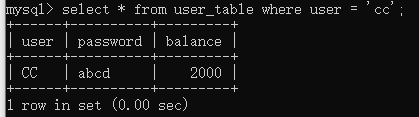
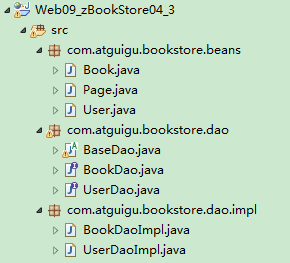

# JDBC概念

> JDBC   就是使用Java语言操作关系型数据库的一套API
>
> 全称：( Java DataBase Connectivity ) Java 数据库连接


* 官方（sun公司）定义的一套操作所有关系型数据库的规则，即**接口**
* 各个数据库厂商去实现这套接口，提供**数据库驱动jar包**
* 我们可以使用这套接口（JDBC）编程，**真正执行的代码是驱动jar包中的实现类**


# 使用JDBC


## 数据库URL

​	JDBC 数组库 URL 一般语法：

​	`jdbc:subprotocol:other`

**几种常用数据库的 JDBC URL**

- MySQL的连接URL编写方式：

  - jdbc:mysql://主机名称:mysql服务端口号/数据库名称?参数=值&参数=值
  - jdbc:mysql://localhost:3306/atguigu
  - jdbc:mysql://localhost:3306/atguigu**?useUnicode=true&characterEncoding=utf8**（如果JDBC程序与服务器端的字符集不一致，会导致乱码，那么可以通过参数指定服务器端的字符集）
  - jdbc:mysql://localhost:3306/atguigu?user=root&password=123456

- Oracle 9i的连接URL编写方式：

  - jdbc:oracle:thin:@主机名称:oracle服务端口号:数据库名称
  - jdbc:oracle:thin:@localhost:1521:atguigu

- SQLServer的连接URL编写方式：

  - jdbc:sqlserver://主机名称:sqlserver服务端口号:DatabaseName=数据库名称

  - jdbc:sqlserver://localhost:1433:DatabaseName=atguigu


## 一、程序编写步骤

1）注册驱动 - 加载 **Driver** 类

2）获取连接 - 获取 **Connetcion** 对象

3）执行SQL语句 

4）释放资源


## 二、注册驱动

​	如果JDBC驱动的 JAR 文件包含 `META-INF/services/java.sql.Driver  `这个文件，那么他就可以自动注册驱动器类。像 MySQL5之后的驱动 JAR 包就含有这个文件，所以可以跳过这一步。

​	通过使用 DriveManager ，有两种方式可以注册驱动器类，首先找出驱动器类名字 ，例如 ： org.postgresql.Driver，MySQL的是：`com.mysql.jdbc.Driver`。然后使用以下两种方法进行注册。

 1. `Class.forName("org.postgresql.Driver");  `

 2. 设置 `jdbc.divers` 属性：

    ​	1） 在命令行启动java程序前输入`java -Djdbc.drivers=org.postgresql.Driver ProgramName`  

    ​	2） 在 java程序中设置系统属性：`System.setProperty("jdbc.drivers", "org.postgresql.Driver");  `

    

## 三、 获取连接

```java
try{
            //1.加载配置文件
            InputStream in = ClassLoader.getSystemClassLoarder().getResourceAsStream("properties/jdbc.prop");
            Properties properties = new Properties();
            properties.load(in);

            //2.读取配置信息
            String user = properties.getProperty("user");
            String password = properties.getProperty("password");
            String url = properties.getProperty("url");
            String driverClass = properties.getProperty("driverClass");
            
            //3.加载驱动
            Class.forName(driverClass);


            //获取连接
            Connection connection = DriverManager.getConnection(url,user,password);
            System.out.println(connection);
        }
        catch (Exception e) {
            e.printStackTrace();
        }
```

**NOTE：** 配置文件存放 url，user等配置信息，然后在代码中读取配置文件：

①实现了代码和数据的分离，如果需要修改配置信息，直接在配置文件中修改，不需要深入代码
②如果修改了配置信息，省去重新编译的过程。


## 四、 执行SQL语句实现 CRUD 操作

在 java.sql 包中有 3 个接口分别定义了对数据库的调用的不同方式：

- **Statement**：用于执行静态 SQL 语句并返回它所生成结果的对象。 
- **PrepatedStatement**：SQL 语句被预编译并存储在此对象中，可以使用此对象多次高效地执行该语句。
- **CallableStatement**：用于执行 SQL 存储过程（不常用）


### 使用 Statement(存在 SQL注入问题，不推荐)

1. 通过调用 Connection 对象的 **createStatement()实例方法**创建该对象。

2. Statement 接口中定义了下列方法用于执行 SQL 语句：

   ```java
   int excuteUpdate(String sql)	//执行更新操作INSERT、UPDATE、DELETE
   ResultSet executeQuery(String sql)	//执行查询操作SELECT
   ```

3. 使用Statement操作数据表存在弊端：

   - **问题一：存在拼串操作，繁琐**
   - **问题二：存在SQL注入问题**

4. 对于 Java 而言，要防范 SQL 注入，只要用 **PreparedStatement**(从Statement扩展而来) 取代 Statement 就可以了。

### 使用 PreparedStatement

#### 1.优点

- 代码的可读性和可维护性。

- **PreparedStatement 能最大可能提高性能：**
  
  - DBServer会对**预编译**语句提供性能优化。因为预编译语句有可能被重复调用，所以<u>语句在被DBServer的编译器编译后的执行代码被缓存下来，那么下次调用时只要是相同的预编译语句就不需要编译，只要将参数直接传入编译过的语句执行代码中就会得到执行。</u>
  - 在statement语句中,即使是相同操作但因为数据内容不一样,所以整个语句本身不能匹配,没有缓存语句的意义.事实是没有数据库会对普通语句编译后的执行代码缓存。这样<u>每执行一次都要对传入的语句编译一次。</u>
  - (语法检查，语义检查，翻译成二进制命令，缓存)
  
- **PreparedStatement 可以防止 SQL 注入** 

   

#### 2.增、删、改操作：

```java
//通用的增、删、改操作（体现一：增、删、改 ； 体现二：针对于不同的表）
	public void update(String sql,Object ... args){
		Connection conn = null;
		PreparedStatement ps = null;
		try {
			//1.获取数据库的连接
			conn = JDBCUtils.getConnection();
			
			//2.获取PreparedStatement的实例 (或：预编译sql语句)
			ps = conn.prepareStatement(sql);
			//3.填充占位符，PreparedStatement中的sql语句使用 ? 作为参数的占位符
			for(int i = 0;i < args.length;i++){
				ps.setObject(i + 1, args[i]);	//参数索引从1开始
			}
			
			//4.执行sql语句
			ps.execute();
		} catch (Exception e) {
			
			e.printStackTrace();
		}finally{
			//5.关闭资源
			JDBCUtils.closeResource(conn, ps);
			
		}
	}
```

   

#### 3.查询操作

查询操作会返回一个结果集 **ResultSet**

```java
// 通用的针对于不同表的查询:返回一个JavaBean对象。
	public <T> T getInstance(Class<T> clazz, String sql, Object... args) {
		Connection conn = null;
		PreparedStatement ps = null;
		ResultSet rs = null;
		try {
			// 1.获取数据库连接
			conn = JDBCUtils.getConnection();

			// 2.预编译sql语句，得到PreparedStatement对象
			ps = conn.prepareStatement(sql);

			// 3.填充占位符
			for (int i = 0; i < args.length; i++) {
				ps.setObject(i + 1, args[i]);
			}

			// 4.执行executeQuery(),得到结果集：ResultSet
			rs = ps.executeQuery();

			// 5.得到结果集的元数据：ResultSetMetaData，通过元数据可以获取列名，列数等数据
			ResultSetMetaData rsmd = rs.getMetaData();

			// 6.1通过ResultSetMetaData得到columnCount,columnLabel；通过ResultSet得到列值
			int columnCount = rsmd.getColumnCount();
			if (rs.next()) {	//如果结果集中有结果，返回true并且把指针下移，否则返回false
				T t = clazz.newInstance();		//创建一个JavaBean类对象
           		for (int i = 0; i < columnCount; i++) {// 遍历每一个列
					// 获取列值
					Object columnVal = rs.getObject(i + 1);
                    
					/*
					* 这里的getColumnName()获取的是数据库中的列名
					* 而getColumnLabel()获取的是列的别名，即在sql语句中定义的别名，这样就可以解决，数据库中列名与JavaBean中属性名不匹配的问题。
					*/
					String columnLabel = rsmd.getColumnLabel(i + 1);
                    
					// 6.2使用反射，给对象的相应属性赋值
					Field field = clazz.getDeclaredField(columnLabel);
					field.setAccessible(true);
					field.set(t, columnVal);	

				}
				return t;
			}
		} catch (Exception e) {
			e.printStackTrace();
		} finally {
			// 7.关闭资源，Connection,PreparedStatement,ResultSet都需要关闭
			JDBCUtils.closeResource(conn, ps, rs);
		}
		return null;
	}
```

##### ResultSet

- 查询需要调用PreparedStatement 的 **executeQuery()** 方法，查询结果是一个ResultSet 对象

- ResultSet 对象以逻辑表格的形式封装了执行数据库操作的结果集，ResultSet 接口由数据库厂商提供实现
- ResultSet 返回的实际上就是一张数据表。有一个指针指向数据表的第一条记录的前面。

- ResultSet 对象维护了一个指向当前数据行的**游标**，初始的时候，游标在第一行之前，可以通过 ResultSet 对象的 **next() 方法**移动到下一行。调用 next()方法检测下一行是否有效。若有效，该方法返回 true，且指针下移。相当于Iterator对象的 hasNext() 和 next() 方法的结合体。
- 当指针指向一行时, 可以通过调用 **getXxx(int index)** 或 **getXxx(int columnName)** 获取每一列的值。

  - 例如: `getInt(1), getString("name")`
  - **注意：Java与数据库交互涉及到的相关Java API中的索引都从1开始。**


##### ResultSetMetaData

- 可用于获取关于 ResultSet 对象中列的类型和属性信息的对象

- ResultSetMetaData meta = resultSet.getMetaData();
  - **getColumnName**(int column)：获取指定列的名称
  - **getColumnLabel**(int column)：获取指定列的别名
  - **getColumnCount**()：返回当前 ResultSet 对象中的列数。 

  - getColumnTypeName(int column)：检索指定列的数据库特定的类型名称。 
  - getColumnDisplaySize(int column)：指示指定列的最大标准宽度，以字符为单位。 
  - **isNullable**(int column)：指示指定列中的值是否可以为 null。 

  - isAutoIncrement(int column)：指示是否自动为指定列进行编号，这样这些列仍然是只读的。 


#### 4. ORM思想

ORM思想**(object relational mapping**)

- 一个数据表对应一个java类
- 表中的一条记录对应java类的一个对象
- 表中的一个字段对应java类的一个属性

> sql是需要结合列名和表的属性名来写。注意起别名。


## 五、释放资源

- 需要释放**ResultSet, Statement,Connection**。
- 数据库连接（Connection）是非常稀有的资源，用完后必须马上释放，如果Connection不能及时正确的关闭将导致系统宕机。Connection的使用原则是**尽量晚创建，尽量早的释放。**
- 可以在finally中关闭，保证及时其他代码出现异常，资源也一定能被关闭。
- 只要关闭掉 **Connection**， **ResultSet  和 Statement** 也会关闭


## 六、MySQL BLOB类型

- MySQL中，BLOB是一个二进制大型对象，是一个可以存储大量数据的容器，它能容纳不同大小的数据。
- 插入BLOB类型的数据必须使用PreparedStatement，因为BLOB类型的数据无法使用字符串拼接写的。

- MySQL的四种BLOB类型(除了在存储的最大信息量上不同外，他们是等同的)


- 实际使用中根据需要存入的数据大小定义不同的BLOB类型。
- 需要注意的是：如果存储的文件过大，数据库的性能会下降。
- 如果在指定了相关的Blob类型以后，还报错：xxx too large，那么在**mysql的安装目录**下，找**my.ini**文件加上如下的配置参数： **max_allowed_packet=16M**。同时注意：修改了my.ini文件之后，需要**重新启动mysql服务**。


### PreparedStatement里的setBlob(int index ,InputStream stream) 用于更新数据库中的blob对象：

```java
PreparedStatement ps = conn.prepareStatement(sql);
InputStream ins = new FileInputStream("lwq.png");
ps.setBlob(4,ins);
ps.executeUpdate();
```


### ResultSet里的getBlob(int index) 用于查询blob对象：

```java
ResultSet rs = ps.executeQuery();
Blob blob = rs.getBlob(5);
InputStream bin = blob.getBinaryStream();	//获得从查询结果中读取blob对象的输入流

//如果需要保存blob对象到本地磁盘
OutputStream os = new FileOutputStream("c.jpg");
byte [] buffer = new byte[1024];
int len = 0;
while((len = is.read(buffer)) != -1){
	os.write(buffer, 0, len);
}

```


## 七、批操作

**addBatch() 和 executeBatch()**方法

```java
cont.setAutoCommit(false);              //关闭自动提交

String sql = """
	insert into goods(name)
	value(?)
	""";
PreparedStatement preStat = cont.prepareStatement(sql);

for (int i = 1; i < 100000; i++) {
	String name = "productName_" + i;
	preStat.setString(1, name);

	preStat.addBatch();     //添加进批操作里

	if(i % 500 == 0){
	//执行批操作
	preStat.executeBatch();
	//清空批操作
	preStat.clearBatch();
	}
}
//提交批操作
cont.commit();
```


## 八、数据库事务

### 1. 事务的介绍

- **事务：一组逻辑操作单元,使数据从一种状态变换到另一种状态。**

- **事务处理（事务操作）：**保证所有事务都作为一个工作单元来执行，即使出现了故障，都不能改变这种执行方式。当在一个事务中执行多个操作时，要么所有的事务都**被提交(commit)**，那么这些修改就永久地保存下来；要么数据库管理系统将放弃所作的所有修改，整个事务**回滚(rollback)**到最初状态。

- 为确保数据库中数据的**一致性**，数据的操纵应当是离散的成组的逻辑单元：当它全部完成时，数据的一致性可以保持，而当这个单元中的一部分操作失败，整个事务应全部视为错误，所有从起始点以后的操作应全部回退到开始状态。 

  

### 2.JDBC中的事务处理

- **数据一旦提交，就不可回滚。**

- **当一个连接对象被创建时，默认情况下是自动提交事务**：每次执行一个 SQL 语句时，如果执行成功，就会向数据库自动提交，而不能回滚。

- **关闭数据库连接，数据就会自动的提交。**如果多个操作，每个操作使用的是自己单独的连接，则无法保证事务。即同一个事务的多个操作必须在同一个连接下。

- **JDBC程序中为了让多个 SQL 语句作为一个事务执行：**
  
  - 调用 Connection 对象的 **setAutoCommit(false);** 以取消自动提交事务
  - 在所有的 SQL 语句都成功执行后，调用 **commit();** 方法提交事务
  - 在出现异常时，调用 **rollback();** 方法回滚事务
	
  > 若此时 Connection 没有被关闭，还可能被重复使用，则需要恢复其自动提交状态 setAutoCommit(true)。尤其是在使用数据库连接池技术时，执行close()方法前，建议恢复自动提交状态。
  >

例子如下

  ```java
  public void testJDBCTransaction() {
  	Connection conn = null;
  	try {
  		// 1.获取数据库连接
  		conn = JDBCUtils.getConnection();
  		// 2.开启事务
  		conn.setAutoCommit(false);
  		// 3.进行数据库操作
  		String sql1 = "update user_table set balance = balance - 100 where user = ?";
  		update(conn, sql1, "AA");
  
  		// 模拟网络异常
  		//System.out.println(10 / 0);
  
  		String sql2 = "update user_table set balance = balance + 100 where user = ?";
  		update(conn, sql2, "BB");
  		// 4.若没有异常，则提交事务
  		conn.commit();
  	} catch (Exception e) {
  		e.printStackTrace();
  		// 5.若有异常，则回滚事务
  		try {
  			conn.rollback();
  		} catch (SQLException e1) {
  			e1.printStackTrace();
  		}
      } finally {
          try {
  			//6.恢复每次DML操作的自动提交功能
  			conn.setAutoCommit(true);
  		} catch (SQLException e) {
  			e.printStackTrace();
  		}
          //7.关闭连接
  		JDBCUtils.closeResource(conn, null, null); 
      }  
  }
  
  ```

  ```java
  public void update(Connection conn ,String sql, Object... args) {
  	PreparedStatement ps = null;
  	try {
  		// 1.获取PreparedStatement的实例 (或：预编译sql语句)
  		ps = conn.prepareStatement(sql);
  		// 2.填充占位符
  		for (int i = 0; i < args.length; i++) {
  			ps.setObject(i + 1, args[i]);
  		}
  		// 3.执行sql语句
  		ps.execute();
  	} catch (Exception e) {
  		e.printStackTrace();
  	} finally {
  		// 4.关闭资源
  		try{
              ps.close();
          }catch(SQLException e){
              e.printStackTrace();
          }
  
  	}
  }
  ```

  

### 3.事务的ACID属性    

#### 1）**原子性（Atomicity）**

​	原子性是指事务是一个不可分割的工作单位，事务中的操作要么都发生，要么都不发生。 

#### 2）**一致性（Consistency）**

​	事务必须使数据库从一个一致性状态变换到另外一个一致性状态。

#### 3）**隔离性（Isolation）**

​	事务的隔离性是指一个事务的执行不能被其他事务干扰，即一个事务内部的操作及使用的数据对并发的其他事务是隔离的，并发执行的各个事务之间不能互相干扰。

​	**数据库事务的隔离性**: 数据库系统必须具有隔离并发运行各个事务的能力, 使它们不会相互影响, 避免各种并发问题。

#### 4）**持久性（Durability）**

​	持久性是指一个事务一旦被提交，它对数据库中数据的改变就是永久性的，接下来的其他操作和数据库故障不应该对其有任何影响。


### 4.数据库的并发问题

对于同时运行的多个事务, 当这些事务访问数据库中相同的数据时, 如果没有采取必要的隔离机制, 就会导致各种并发问题:

#### 脏读: 

​	对于两个事务 T1, T2。T1 读取了已经被 T2 更新但还**没有被提交**的字段。之后, 若 T2 回滚, T1读取的内容就是临时且无效的。

#### 不可重复读: 

​	对于两个事务T1, T2。 T1 读取了一个字段, 然后 T2 **更新**了该字段。之后, T1再次读取同一个字段, 值就不同了。

#### 幻读: 

​	对于两个事务T1, T2,。T1 从一个表中读取了一个字段, 然后 T2 在该表中**插入**了一些新的行。之后, 如果 T1 再次读取同一个表, 就会多出几行。


### 5.数据库隔离级别：

​	一个事务与其他事务隔离的程度称为隔离级别。

​	数据库规定了多种事务隔离级别, 不同隔离级别对应不同的干扰程度, **隔离级别越高, 数据一致性就越好, 但并发性越弱。**

#### 1.四种隔离级别

- 数据库提供的4种事务隔离级别：


- Oracle 支持的 2 种事务隔离级别：**READ COMMITED**, SERIALIZABLE。 Oracle 默认的事务隔离级别为: **READ COMMITED** 。


- **Mysql** 支持 4 种事务隔离级别。Mysql 默认的事务隔离级别为: **REPEATABLE READ。**


**举个例子**：

1. 假如当前数据库隔离级别为 **REPEATABLE READ** ， **T1** 事务进行 **SELECT** 查询余额，当它第一次查询到余额：




2. 此时 **T2** 正在进行 **UPDATE** 更新（**未提交**）这个余额：


​	更新完后，**T2** 进行查询 ：

​	

​	现在 **T2** 查询到的是更新后的 2500。


 3. 在 **T2** 更新后，**T1** 又进行查询操作（**重复读**）：

    

	4. **T2 ** 进行 **提交**，然后 **T1** 再次读取：

    

    ​			

	5. **并且 此时数据库已经更新了， T1 读取的依然是旧的值！**：


**ps：**

​	Mysql 中

**READ UNCOMMITED** 的表现是：T1事务第一次读的值为 a1，然后T2进行了更新操作，把相应值改为了b1，但是**未提交**，T1这时再来读，读取到的值就是更新后的 b1。

**READ COMMITED** 的表现是： T1事务第一次读的值为 a1，然后T2进行了更新操作，把相应值改为了b1，但是**未提交**，T1这时再来读，读取到的值还是a1，但是T2这时**提交后**，T1再次读取到的值就是b1了。

**REPEATABLE READ** 的表现就是上述例子中的： T1事务第一次读的值为 a1，然后T2进行了更新操作，把相应值改为了b1，但是**未提交**，T1这时再来读，读取到的值还是a1，但是T2这时**提交后**，T1再次读取到的值依然是a1了。

**SERIALIZABLE** 的表现是：T1事务第一次读的值为 a1，然后T2进行了更新操作，把相应值改为了b1，但是**未提交**，**这时T2会被阻塞**， T1这时再来读，读取到的值还是a1。**如果T1 也进行更新操作，就会发生死锁！（T1会显示发生死锁，T2解除阻塞）。** 

把这个隔离理解成本事务与其他事务的隔离级别，即各个事务之间的操作对彼此的可见程度。

#### **2.在 MySQL中设置隔离级别**

- 每启动一个 mysql 程序, 就会获得一个单独的数据库连接. 每个数据库连接都有一个全局变量 @@tx_isolation, 表示当前的事务隔离级别。

- 查看当前的隔离级别: 

  ```mysql
  SELECT @@transaction_isolation; #mysql 8.0及之后使用该命令
  ```

- 设置当前 mySQL 连接的隔离级别:  

  ```mysql
  set transaction isolation level read committed;
  ```

- 设置数据库系统的全局的隔离级别:

  ```mysql
  set global transaction isolation level read committed;
  ```

- 补充操作：

  - 创建mysql数据库用户：

    ```mysql
    create user tom identified by 'abc123';
    ```

  - 授予权限

    ```mysql
    #授予通过网络方式登录的tom用户，对所有库所有表的全部权限，密码设为abc123.
    grant all privileges on *.* to tom@'%'  identified by 'abc123'; 
    
     #给tom用户使用本地命令行方式，授予atguigudb这个库下的所有表的插删改查的权限。
    grant select,insert,delete,update on atguigudb.* to tom@localhost identified by 'abc123'; 
    
    ```


#### 3.在Java中查看和设置隔离级别

**connection.getTransactionIsolation()** 用于获取当前连接的隔离级别；

**connection.setTransactionIsolation(Connection.TRANSACTION_READ_COMMITTED)**

用于设置当前连接的隔离级别


## 九、DAO（Data Access Object）

- **DAO**：Data Access Object访问数据信息的类和接口，包括了对数据的CRUD（Create、Retrival、Update、Delete），而不包含任何业务相关的信息。有时也称作：BaseDAO
- 作用：为了实现功能的模块化，更有利于代码的维护和升级。

- 下面是尚硅谷JavaWeb阶段书城项目中DAO使用的体现：



- 层次结构：


**BaseDAO** 是一个泛型抽象类，它实现了访问数据库的通用方法。

**BookDAO** 是一个接口，它声明了访问数据库中 Book表的一些方法。

**BookDAOImpl** 继承和实现了上述类和接口。它使用 从**BaseDAO** 中继承而来的访问数据库的通用方法来实现 **BookDAO** 接口中声明的访问 Book表的方法。


BaseDAO.java：

```java
package dao;

import java.lang.reflect.*;
import java.sql.*;
import java.util.ArrayList;
import java.util.List;

/**
 * 封装了对数据库的通用的访问操作
 *
 * @param <T> 子类的类型
 */

public abstract class BaseDao<T> {
    private Class<T> clss = null;

    {
        //获取当前BaseDAO的子类继承的父类中的泛型
        Type genericSuperclass = this.getClass().getGenericSuperclass();
        ParameterizedType paramType = (ParameterizedType) genericSuperclass;

        Type[] typeArguments = paramType.getActualTypeArguments();//获取了父类的泛型参数
        clss = (Class<T>) typeArguments[0];//泛型的第一个参数
    }

    /**
     * 通用的增删改操作
     */
    public int update(Connection conn, String sql, Object... args) {
        try (PreparedStatement ps = conn.prepareStatement(sql)) {
            for (int i = 1; i <= args.length; i++) {
                ps.setObject(i, args[i - 1]);
            }

            return ps.executeUpdate();
        } catch (SQLException e) {
            e.printStackTrace();
        }

        return 0;
    }

    /**
     * 通用的查询操作，返回数据库表中的一条记录，并且把这个记录按照 ORM 创建成一个实例并返回。
     */
    public T querySingleton(Connection conn, String sql, Object... args) throws Exception {
        try (PreparedStatement ps = conn.prepareStatement(sql)) {
            for (int i = 1; i <= args.length; i++) {
                ps.setObject(i, args[i - 1]);
            }

            ResultSet resultSet = ps.executeQuery();
            ResultSetMetaData metaData = resultSet.getMetaData();
            int columnCnt = metaData.getColumnCount();
            if (resultSet.next()) {
                T instance = clss.getDeclaredConstructor().newInstance();
                for (int i = 1; i <= columnCnt; i++) {
                    String label = metaData.getColumnLabel(i);
                    Object value = resultSet.getObject(i);

                    Field field = clss.getDeclaredField(label);
                    field.setAccessible(true);
                    field.set(instance, value);
                }
                return instance;
            }
        }
        return null;
    }


    /**
     * 通用的查询操作，返回多条记录构成的集合。
     */
    public List<T> queryMulti(Connection conn, String sql, Object... args) throws Exception {
        try (PreparedStatement ps = conn.prepareStatement(sql)) {
            List<T> list = new ArrayList<>();
            for (int i = 1; i <= args.length; i++) {
                ps.setObject(i, args[i - 1]);
            }

            ResultSet resultSet = ps.executeQuery();
            ResultSetMetaData metaData = resultSet.getMetaData();
            int columnCnt = metaData.getColumnCount();
            while (resultSet.next()) {
                T instance = clss.getDeclaredConstructor().newInstance();
                for (int i = 1; i <= columnCnt; i++) {
                    String label = metaData.getColumnLabel(i);
                    Object value = resultSet.getObject(i);

                    Field field = clss.getDeclaredField(label);
                    field.setAccessible(true);
                    field.set(instance, value);
                }
                list.add(instance);
            }
            return list;
        }
    }

    /**
     * 查询特殊值。例如聚集函数。
     */
    public <R> R queryValue(Connection conn, String sql, Object... args) throws Exception {
        try(PreparedStatement ps = conn.prepareStatement(sql)){
            for (int i = 1; i <= args.length; i++) {
                ps.setObject(i, args[i - 1]);
            }

            ResultSet resultSet = ps.executeQuery();
            if(resultSet.next()){
                return (R)resultSet.getObject(1);
            }
        }
        return null;
    }
}
```


## 十、数据库连接池

### 1.  JDBC数据库连接池的必要性

- 在使用开发基于数据库的web程序时，传统的模式基本是按以下步骤：　　
  - **在主程序（如servlet、beans）中建立数据库连接**
  - **进行sql操作**
  - **断开数据库连接**

- 这种模式开发，存在的问题:
  - 普通的JDBC数据库连接使用 DriverManager 来获取，每次向数据库建立连接的时候都要将 Connection 加载到内存中，再验证用户名和密码(得花费0.05s～1s的时间)。需要数据库连接的时候，就向数据库要求一个，执行完成后再断开连接。这样的方式将会消耗大量的资源和时间。**数据库的连接资源并没有得到很好的重复利用。**若同时有几百人甚至几千人在线，频繁的进行数据库连接操作将占用很多的系统资源，严重的甚至会造成服务器的崩溃。
  - **对于每一次数据库连接，使用完后都得断开。**否则，如果程序出现异常而未能关闭，将会导致数据库系统中的内存泄漏，最终将导致重启数据库。
  - **这种开发不能控制被创建的连接对象数**，系统资源会被毫无顾及的分配出去，如连接过多，也可能导致内存泄漏，服务器崩溃。 

### 2. 数据库连接池技术

#### **数据库连接池的基本思想**

​	连接池是在一开始就创建好了一些连接（Connection）对象存储起来。用户需要连接数据库时，不需要自己创建连接，而只需要从连接池中获取一个连接进行使用，使用完毕后再将连接对象归还给连接池；这样就可以起到资源重用，也节省了频繁创建连接销毁连接所花费的时间，从而提升了系统响应的速度。

​	**数据库连接池**负责分配、管理和释放数据库连接，它**允许应用程序重复使用一个现有的数据库连接，而不是重新建立一个**。


#### **最小数据库连接数**

​	数据库连接池在初始化时将创建一定数量的数据库连接放到连接池中，这些数据库连接的数量是由**最小数据库连接数来设定**的。


#### **最大数据库连接数量**

​	连接池的**最大数据库连接数量**限定了这个连接池能占有的最大连接数，当应用程序向连接池请求的连接数超过最大连接数量时，这些请求将被加入到等待队列中。


### 3. 数据库连接池的使用

​	JDBC 的数据库连接池使用 **javax.sql.DataSource接口** 来表示，DataSource 只是一个接口，该接口通常由服务器(Weblogic, WebSphere, Tomcat)提供实现，也有一些开源组织提供实现：

- **DBCP** 是Apache提供的数据库连接池。tomcat 服务器自带dbcp数据库连接池。**速度相对c3p0较快**，但因自身存在BUG，Hibernate3已不再提供支持。

- **C3P0** 是一个开源组织提供的一个数据库连接池，**速度相对较慢，稳定性还可以。**hibernate官方推荐使用

- **Druid** 是阿里提供的数据库连接池，据说是集DBCP 、C3P0 、Proxool 优点于一身的数据库连接池，但是速度不确定是否有BoneCP快

  

#### 1）DataSource接口

​	DataSource 通常被称为数据源，它包含**连接池**和**连接池管理**两个部分，习惯上也经常把 DataSource 称为连接池。

​	**DataSource用来取代DriverManager来获取Connection，获取速度快，同时可以大幅度提高数据库访问速度。**

​	**特别注意**：数据源和数据库连接不同，数据源无需创建多个，它是产生数据库连接的工厂，因此**整个应用只需要一个数据源即可。**当数据库访问结束后，程序还是像以前一样关闭数据库连接：conn.close(); 但conn.close()并**没有关闭数据库的物理连接**，它仅仅把数据库连接释放，归还给了数据库连接池。


#### 2）C3P0数据库连接池


```java
//使用C3P0数据库连接池的配置文件方式，获取数据库的连接：推荐
private static DataSource cpds = new ComboPooledDataSource("helloc3p0");
public static Connection getConnection2() throws SQLException{
	Connection conn = cpds.getConnection();
	return conn;
}
```

其中，src下的配置文件为：【c3p0-config.xml】

```xml
<?xml version="1.0" encoding="UTF-8"?>
<c3p0-config>
	<named-config name="helloc3p0">
		<!-- 获取连接的4个基本信息 -->
		<property name="user">root</property>
		<property name="password">abc123</property>
		<property name="jdbcUrl">jdbc:mysql:///test</property>
		<property name="driverClass">com.mysql.jdbc.Driver</property>
		
		<!-- 涉及到数据库连接池的管理的相关属性的设置 -->
		<!-- 若数据库中连接数不足时, 一次向数据库服务器申请多少个连接 -->
		<property name="acquireIncrement">5</property>
		<!-- 初始化数据库连接池时连接的数量 -->
		<property name="initialPoolSize">5</property>
		<!-- 数据库连接池中的最小的数据库连接数 -->
		<property name="minPoolSize">5</property>
		<!-- 数据库连接池中的最大的数据库连接数 -->
		<property name="maxPoolSize">10</property>
		<!-- C3P0 数据库连接池可以维护的 Statement 的个数 -->
		<property name="maxStatements">20</property>
		<!-- 每个连接同时可以使用的 Statement 对象的个数 -->
		<property name="maxStatementsPerConnection">5</property>

	</named-config>
</c3p0-config>
```


#### 3）DBCP数据库连接池

DBCP 是 Apache 软件基金组织下的开源连接池实现，该连接池依赖该组织下的另一个开源系统：Common-pool。如需使用该连接池实现，应在系统中增加如下两个 jar 文件：

​	**Commons-dbcp.jar**：连接池的实现

​	**Commons-pool.jar**：连接池实现的依赖库

**Tomcat 的连接池正是采用该连接池来实现的。**该数据库连接池既可以与应用服务器整合使用，也可由应用程序独立使用。


```
//使用dbcp数据库连接池的配置文件方式，获取数据库的连接：推荐
private static DataSource source = null;
static{
	try {
		Properties pros = new Properties();
		

	InputStream is = DBCPTest.class.getClassLoader().getResourceAsStream("dbcp.properties");
		
	pros.load(is);
	//根据提供的BasicDataSourceFactory创建对应的DataSource对象
	source = BasicDataSourceFactory.createDataSource(pros);
} catch (Exception e) {
	e.printStackTrace();
}

}
public static Connection getConnection4() throws Exception {
		

Connection conn = source.getConnection();

return conn;

}
```

其中，src下的配置文件为：【dbcp.properties】

```properties
driverClassName=com.mysql.jdbc.Driver
url=jdbc:mysql://localhost:3306/test?rewriteBatchedStatements=true&useServerPrepStmts=false
username=root
password=abc123

initialSize=10
#...
```


#### 4）Druid 数据库连接池（重点）

首先需要在项目中导入 druid连接池的依赖jar包。

```java
package com.atguigu.druid;

import java.sql.Connection;
import java.util.Properties;

import javax.sql.DataSource;

import com.alibaba.druid.pool.DruidDataSourceFactory;

public class TestDruid {
	public static void main(String[] args) throws Exception {
		Properties pro = new Properties();		 pro.load(TestDruid.class.getClassLoader().getResourceAsStream("druid.properties"));
		DataSource ds = DruidDataSourceFactory.createDataSource(pro);
		Connection conn = ds.getConnection();
		System.out.println(conn);
	}
}

```

其中，src下的配置文件为：【druid.properties】

```properties
url=jdbc:mysql://localhost:3306/test?rewriteBatchedStatements=true
username=root
password=123456
driverClassName=com.mysql.jdbc.Driver
# 初始化连接数量
initialSize=10
# 最大连接数
maxActive=20
# 最大等待时间
maxWait=1000
filters=wall
```


## 十一、Apache-DBUtils

​	**commons-dbutils** 是 Apache 组织提供的一个开源 JDBC工具类库，**它是对JDBC的简单封装**，学习成本极低，并且使用dbutils能极大简化jdbc编码的工作量，同时也不会影响程序的性能。

### 1. 主要API的使用

#### 	1）DbUtils

​		DbUtils ：提供如关闭连接、装载JDBC驱动程序等常规工作的工具类，里面的所有方法都是静态的。

#### 	2）QueryRunner类

​		该类简单化了SQL查询，它与ResultSetHandler组合在一起使用可以完成大部分的数据库操作，能够大大减少编码量。

#### 	3）ResultSetHandler接口及实现类

​		该接口用于处理 java.sql.ResultSet，将数据按要求转换为另一种形式。

​		**ResultSetHandler 接口**提供了一个单独的方法：Object **handle** (java.sql.ResultSet .rs)。

​		自定义ResultSetHandler的实现类：

```java
QueryRunner runner = new QueryRunner();

Connection conn = getConnection();
	
String sql = "select id,name,email,birth from customers where id = ?";

//自定义ResultSetHandler的匿名内部实现类
ResultSetHandler<Customer> handler = new ResultSetHandler<Customer>() {
	
    //覆盖handle方法
	@Override
	public Customer handle(ResultSet rs) throws SQLException {
		System.out.println("handle");
		if(rs.next()){
			int id = rs.getInt("id");
			String name = rs.getString("name");
			String email = rs.getString("email");
			Date birth = rs.getDate("birth");
				
			return new Customer(id, name, email, birth);
		}
		return null;
			
	}
};
	
Customer customer = runner.query(conn, sql, handler, 23);
	
System.out.println(customer);
	
JDBCUtils.closeResource(conn, null);
```


​		**接口的主要实现类**：

- ArrayHandler：把结果集中的第一行数据转成对象数组。

- ArrayListHandler：把结果集中的每一行数据都转成一个数组，再存放到List中。

- **BeanHandler：**将结果集中的第一行数据封装到一个对应的JavaBean实例中。

  ```java
   //查询一条记录
  
  
    //获取QueryRunner对象
    QueryRunner runner = new QueryRunner();
  
    //获取连接
    Connection conn = getConnection();
    	
    String sql = "select id,name,email,birth from customers where id = ?";
    	
    //使用BeanHandler来生成一个Bean对象
    BeanHandler<Customer> handler = new BeanHandler<>(Customer.class);
    Customer customer = runner.query(conn, sql, handler, 23);
    System.out.println(customer);	
    JDBCUtils.closeResource(conn, null);
  
  
  ```

  

  

- **BeanListHandler：**将结果集中的每一行数据都封装到一个对应的JavaBean实例中，存放到List里。

  ```java
  //查询多条记录构成的集合
  QueryRunner runner = new QueryRunner();
  
  Connection conn = getConnection();
  	
  String sql = "select id,name,email,birth from customers where id < ?";
  	
  //
  BeanListHandler<Customer> handler = new BeanListHandler<>(Customer.class);
  List<Customer> list = runner.query(conn, sql, handler, 23);
  list.forEach(System.out::println);
  	
  JDBCUtils.closeResource(conn, null);
  ```

- ColumnListHandler：将结果集中某一列的数据存放到List中。

- KeyedHandler(name)：将结果集中的每一行数据都封装到一个Map里，再把这些map再存到一个map里，其key为指定的key。

- **MapHandler：**将结果集中的第一行数据封装到一个Map里，key是列名，value就是对应的值。

- **MapListHandler：**将结果集中的每一行数据都封装到一个Map里，然后再存放到List

- **ScalarHandler：**查询单个值对象

  ```java
  //如何查询类似于最大的，最小的，平均的，总和，个数相关的数据，
  
  //使用ScalarHandler
  
  QueryRunner runner = new QueryRunner();
  
  Connection conn = getConnection();
  	
  //测试一：
  
  //	String sql = "select count(*) from customers where id < ?";
  //	ScalarHandler handler = new ScalarHandler();
  //	long count = (long) runner.query(conn, sql, handler, 20);
  //	System.out.println(count);
  		
  
  //测试二：
  String sql = "select max(birth) from customers";
  ScalarHandler handler = new ScalarHandler();
  Date birth = (Date) runner.query(conn, sql, handler);
  System.out.println(birth);
  	
  JDBCUtils.closeResource(conn, null);
  ```

  

## 十二、JDBC总结

```java
public void testUpdateWithTx() {
		
	Connection conn = null;
	try {
		//1.获取连接的操作
		//① 手写的连接：JDBCUtils.getConnection();
		//② 使用数据库连接池：C3P0;DBCP;Druid
		//2.对数据表进行一系列CRUD操作
		//① 使用PreparedStatement实现通用的增删改、查询操作（version 1.0 \ version 2.0)
//version2.0的增删改public void update(Connection conn,String sql,Object ... args){}
//version2.0的查询 public <T> T getInstance(Connection conn,Class<T> clazz,String sql,Object ... args){}
		//② 使用dbutils提供的jar包中提供的QueryRunner类
			
		//提交数据
		conn.commit();
			
	
	} catch (Exception e) {
		e.printStackTrace();
			
			
		try {
			//回滚数据
			conn.rollback();
		} catch (SQLException e1) {
			e1.printStackTrace();
		}
			
	}finally{
		//3.关闭连接等操作
		//① JDBCUtils.closeResource();
		//② 使用dbutils提供的jar包中提供的DbUtils类提供了关闭的相关操作
			
	}
}
```
