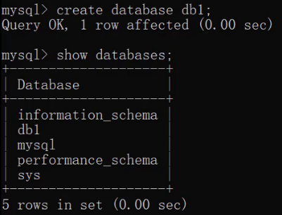
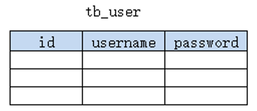
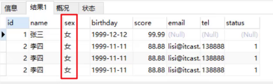

# 一、数据库相关概念

## 1.  数据库

* **存储和管理数据的仓库，数据是有组织的进行存储。**

* 数据库英文名是 DataBase，简称DB。

数据库就是将数据存储在硬盘上，可以达到持久化存储的效果。那又是如何解决上述问题的？使用数据库管理系统。

## 2.  数据库管理系统

* **管理数据库的大型软件**
* 英文：DataBase Management System，简称 DBMS

我们平时说的MySQL数据库其实是MySQL数据库管理系统。

## 3.  常见的数据库管理系统


接下来对上面列举的数据库管理系统进行简单的介绍：

* Oracle：收费的大型数据库，Oracle 公司的产品
* ==MySQL==： 开源免费的中小型数据库。后来 Sun公司收购了 MySQL，而 Sun 公司又被 Oracle 收购
* SQL Server：MicroSoft 公司收费的中型的数据库。C#、.net 等语言常使用
* PostgreSQL：开源免费中小型的数据库
* DB2：IBM 公司的大型收费数据库产品
* SQLite：嵌入式的微型数据库。如：作为 Android 内置数据库
* MariaDB：开源免费中小型的数据库


# 二、MySQL（windows）

## 1.  MySQL安装

> **安装环境:Win10 64位**
> **软件版本:MySQL 5.7.24 解压版**

### 1.1  下载

https://downloads.mysql.com/archives/community/


### 1.2  安装(解压)

下载完成后我们得到的是一个压缩包，将其解压，我们就可以得到MySQL 5.7.24的软件本体了(就是一个文件夹)，我们可以把它放在你想安装的位置。

------


## 2.  MySQL配置

### 3.1  添加环境变量

在`系统变量`中新建 **MYSQL_HOME**：


配置 `Path` 环境变量：


在命令行输入 ： `mysql --version` 测试是否配置成功


### 3.2  新建配置文件

新建一个文本文件 ：`my.ini`，内容如下：

```properties
[mysql]
default-character-set=utf8

[mysqld]
character-set-server=utf8
default-storage-engine=INNODB
sql_mode=STRICT_TRANS_TABLES,NO_ZERO_IN_DATE,NO_ZERO_DATE,ERROR_FOR_DIVISION_BY_ZERO,NO_AUTO_CREATE_USER,NO_ENGINE_SUBSTITUTION
```

上面代码意思就是配置数据库的默认编码集为utf-8和默认存储引擎为INNODB。


配置文件存放的路径为MySQL的`根目录`(例如我的是`D:\software\mysql-5.7.24-winx64`,根据自己的MySQL目录位置修改)。


### 3.3  初始化MySQL

在命令行中输入 `mysqld --initialize-insecure`

稍微等待一会，如果出现没有出现报错信息(如下图)则证明data目录初始化没有问题，此时再查看MySQL根目录下已经有`data`目录生成。


tips：如果出现如下错误


是由于权限不足导致的，去`C:\Windows\System32` 下以管理员方式运行 cmd.exe


### 3.4  注册MySQL服务

在cmd中输入 `mysqld -install` 


现在你的计算机上已经安装好了MySQL服务了。


### 3.5  启动MySQL服务

在cmd中输入 `net start mysql`

```java
net start mysql  // 启动mysql服务
    
net stop mysql  // 停止mysql服务
```


### 3.6  修改默认账户密码

cmd中输入 ：`mysqladmin -u root password 1234`

这里的`1234`就是指默认管理员(即root账户)的密码，可以自行修改成你喜欢的。

**至此，MySQL 5.7 解压版安装完毕！**


## 3. MySQL卸载

如果你想卸载MySQL，也很简单。

右键开始菜单，选择`命令提示符(管理员)`，打开黑框。

1. 敲入`net stop mysql`，回车。

```
net stop mysql
```


2. 再敲入`mysqld -remove mysql`，回车。

```
mysqld -remove mysql
```


3. 最后删除MySQL目录及相关的环境变量。

**至此，MySQL卸载完成！**


## 4.  MySQL登陆和退出

**登陆**

在cmd中输入，`mysql -uroot -p1234`


登陆参数：

```shell
mysql -u用户名 -p密码 -h要连接的mysql服务器的ip地址(默认127.0.0.1) -P端口号(默认3306)
```


**退出**

退出mysql：

```
exit
quit
```


## 5.  MySQL数据模型

**关系型数据库：**

> 关系型数据库是建立在关系模型基础上的数据库，简单说，关系型数据库是由多张能互相连接的 二维表 组成的数据库

如下图，`订单信息表` 和 `客户信息表` 都是有行有列二维表我们将这样的称为关系型数据库。


**mysql数据模型：**


如上图，我们通过客户端可以通过数据库管理系统创建数据库，在数据库中创建表，在表中添加数据。


**创建的每一个数据库对应到磁盘上都是一个目录。**


比如可以通过SQL语句创建一个数据库（数据库名称为db1）：


我们可以在数据库安装目录下的 `data目录` 下看到多了一个名为  `db1` 的目录。


而一个数据库下可以创建多张表，我们到MySQL中自带的mysql数据库的文件夹目录下：


而上图中右边的 `db.frm` 是表文件，`db.MYD` 是数据文件，通过这两个文件就可以查询到数据展示成二维表的效果。

**注意：** 上述数据库中表文件格式随着mysql版本的不同而不同


**小结：**

* MySQL中可以创建多个数据库，每个数据库对应到磁盘上的一个文件夹
* 在每个数据库中可以创建多个表，每张都对应到磁盘上一个 frm 文件
* 每张表可以存储多条数据，数据会被存储到磁盘中  MYD 文件中


# 三、SQL概述

了解了数据模型后，接下来我们就学习SQL语句，通过SQL语句对数据库、表、数据进行增删改查操作。 

## 1.  SQL简介

* 英文：Structured Query Language，简称 SQL
* 结构化查询语言，一门操作关系型数据库的编程语言
* 定义操作所有关系型数据库的统一标准
* 对于同一个需求，每一种数据库操作的方式可能会存在一些不一样的地方，我们称为**“方言”**


## 2.  通用语法

1. SQL 语句可以单行或多行书写，以**分号**结尾。

    

   如上，以分号结尾才是一个完整的sql语句。

   

2. MySQL 数据库的 SQL 语句**不区分大小写**，**关键字建议使用大写**。

   同样的一条sql语句写成下图的样子，一样可以运行处结果。

    

   

3. 注释

   * 单行注释: 

     `-- 注释内容`  或 

     `#注释内容`  (MySQL 特有) 

      

      

     注意：使用 `--` 添加单行注释时，`--` **后面一定要加空格**，而 `#` 没有要求。

   * 多行注释:  `/* 注释内容 */`


## 3. SQL分类

* **DDL(Data Definition Language)** ： **数据定义语言**

  用来定义数据库对象：**数据库，表，列**等

  

  

* **DML(Data Manipulation Language) 数据操作语言**

  用来对数据库中**表的数据**进行**增删改**

  

* **DQL(Data Query Language) 数据查询语言**

  用来**查询数据库中表的记录(数据)**

  

  

* **DCL(Data Control Language) 数据控制语言**

  用来定义**数据库的访问权限和安全级别，及创建用户**

  

> 注意： 以后我们最常操作的是 `DML` 和 `DQL`  ，因为我们开发中最常操作的就是数据。


# 四、DDL:操作数据库

## 1.  查询数据库（SHOW DATABASES）

查询所有的数据库

```sql
SHOW DATABASES;
```

运行上面语句效果如下：


上述查询到的是的这些数据库是mysql安装好自带的数据库，我们以后不要操作这些数据库。


## 2.  创建数据库（CREATE DATABASE）

* **创建数据库**：

```sql
CREATE DATABASE 数据库名称;
```

运行语句效果如下：




而在创建数据库的时候，我并不知道db1数据库有没有创建，直接再次创建名为db1的数据库就会出现错误。


为了避免上面的错误，**在创建数据库的时候先做判断，如果不存在再创建**。

* **创建数据库(判断，如果不存在则创建)**

```sql
CREATE DATABASE IF NOT EXISTS 数据库名称;
```


运行语句效果如下：


从上面的效果可以看到虽然db1数据库已经存在，再创建db1也没有报错，而创建db2数据库则创建成功。


## 3.  删除数据库（DROP DATABASE）

* **删除数据库**

```sql
DROP DATABASE 数据库名称;
```

* **删除数据库(判断，如果存在则删除)**

```sql
DROP DATABASE IF EXISTS 数据库名称;
```


运行语句效果如下：


## 4.  使用数据库（USE、DATABASE()函数）

数据库创建好了，要在数据库中创建表，得先明确在哪儿个数据库中操作，此时就需要使用数据库。

* **使用数据库**

```sql
USE 数据库名称;
```

* **查看当前使用的数据库**

```sql
SELECT DATABASE();
```

运行语句效果如下：


# 五、DDL:操作表

## 1.  查询所有表名称（SHOW TABLES）

* **查询当前数据库下所有表名称**

```sql
SHOW TABLES;
```

我们创建的数据库中没有任何表，因此我们进入mysql自带的mysql数据库，执行上述语句查看


## 2. **查询表结构**（DESC）

```sql
DESC 表名称;
```

DESC 是 description的缩写

查看mysql数据库中func表的结构，运行语句如下：


## 3.  创建表（CREATE TABLE）

* **创建表**

```sql
CREATE TABLE 表名 (
	字段名1  数据类型1,
	字段名2  数据类型2,
	…
	字段名n  数据类型n
);
```

**注意：最后一行末尾，不能加逗号**


**示例**

知道了创建表的语句，那么我们创建创建如下结构的表



```sql
create table tb_user (
	id int,
    username varchar(20),
    password varchar(32)
);
```

运行语句如下：


## 4.  MySQL常用数据类型

MySQL 支持多种类型，可以分为三类：

### ① 数值

| 数据类型     | 大小（byte） | 描述           |
| ------------ | ------------ | -------------- |
| TINYINT      | 1            | 小整数值       |
| SMALLINT     | 2            | 大整数值       |
| MEDIUMINT    | 3            | 大整数值       |
| INT或INTEGER | 4            | 大整数值       |
| BIGINT       | 8            | 极大整数值     |
| FLOAT        | 4            | 单精度浮点数值 |
| DOUBLE       | 8            | 双精度浮点数值 |
| DECIMAL      |              | 小数值         |


### ② **日期**

| 数据类型  | 大小（byte） | 描述                     |
| --------- | ------------ | ------------------------ |
| DATE      | 3            | 日期值(年 月 日)         |
| TIME      | 3            | 时间值或持续时间         |
| YEAR      | 1            | 年份值                   |
| DATETIME  | 8            | 混合日期和时间值         |
| TIMESTAMP | 4            | 混合日期和时间值，时间戳 |


### ③ **字符串**

| 数据类型   | 大小（byte）              | 描述                                          |
| ---------- | ------------------------- | --------------------------------------------- |
| CHAR       | 0-255                     | 定长字符串  例如： `char(10)` 固定10个字节    |
| VARCHAR    | 0-65535                   | 变长字符串  例如： `varchar(10)` 最多10个字节 |
| TINYBLOB   | 0-255                     | 不超过 255 个字符的二进制字符串               |
| TINYTEXT   | 0-255                     | 短文本字符串                                  |
| BLOB       | 0-65 535                  | 二进制形式的长文本数据                        |
| TEXT       | 0-65 535                  | 长文本数据                                    |
| MEDIUMBLOB | 0-16 777 215（2^24 - 1)   | 二进制形式的中等长度文本数据                  |
| MEDIUMTEXT | 0-16 777 215              | 中等长度文本数据                              |
| LONGBLOB   | 0-4 294 967 295（2^32 -1) | 二进制形式的极大文本数据                      |
| LONGTEXT   | 0-4 294 967 295           | 极大文本数据                                  |


**案例：**

```
需求：设计一张学生表，请注重数据类型、长度的合理性
	1. 编号
	2. 姓名，姓名最长不超过10个汉字
	3. 性别，因为取值只有两种可能，因此最多一个汉字
	4. 生日，取值为年月日
	5. 入学成绩，小数点后保留两位
	6. 邮件地址，最大长度不超过 64
	7. 家庭联系电话，不一定是手机号码，可能会出现 - 等字符
	8. 学生状态（用数字表示，正常、休学、毕业...）
```

语句设计如下：

```sql
create table student (
	id int,
    name varchar(10),
    gender char(1),
    birthday date,
    score double(5,2),
    email varchar(15),
    tel varchar(15),
    status tinyint
);
```


## 5. 删除表（DROP TABLE）

* **删除表**

```sql
DROP TABLE 表名;
```

* **删除表时判断表是否存在**

```sql
DROP TABLE IF EXISTS 表名;
```


运行语句效果如下：


## 6. 修改表（ALTER TABLE）

#### **修改表名（RENAME TO）**

```sql
ALTER TABLE 表名 RENAME TO 新的表名;

-- 将表名student修改为stu
alter table student rename to stu;
```

#### **添加一列（ADD）**

```sql
ALTER TABLE 表名 ADD 列名 数据类型;

-- 给stu表添加一列address，该字段类型是varchar(50)
alter table stu add address varchar(50);
```

#### **修改列的数据类型（MODIFY）**

```sql
ALTER TABLE 表名 MODIFY 列名 新数据类型;

-- 将stu表中的address字段的类型改为 char(50)
alter table stu modify address char(50);
```

#### **修改列名和数据类型（CHANGE）**

```sql
ALTER TABLE 表名 CHANGE 列名 新列名 新数据类型;

-- 将stu表中的address字段名改为 addr，类型改为varchar(50)
alter table stu change address addr varchar(50);
```

#### **删除列（DROP）**

```sql
ALTER TABLE 表名 DROP 列名;

-- 将stu表中的addr字段 删除
alter table stu drop addr;
```


# 六、DML

对表中的数据进行 增删改：

## 1.  添加数据（INSERT INTO）

* **给指定列添加数据**

```sql
INSERT INTO 表名(列名1,列名2,…) VALUES(值1,值2,…);
```

* **给全部列添加数据**

```sql
INSERT INTO 表名 VALUES(值1,值2,…);
```

* **批量添加数据**

```sql
INSERT INTO 表名(列名1,列名2,…) VALUES(值1,值2,…),(值1,值2,…),(值1,值2,…)…;
INSERT INTO 表名 VALUES(值1,值2,…),(值1,值2,…),(值1,值2,…)…;
```


**练习**

为了演示以下的增删改操作是否操作成功，故先将查询所有数据的语句介绍给大家：

```sql
select * from stu;
```


```sql
-- 给指定列添加数据
INSERT INTO stu (id, NAME) VALUES (1, '张三');
-- 给所有列添加数据，列名的列表可以省略的
INSERT INTO stu (id,NAME,sex,birthday,score,email,tel,STATUS) VALUES (2,'李四','男','1999-11-11',88.88,'lisi@itcast.cn','13888888888',1);
-- 或者
INSERT INTO stu VALUES (2,'李四','男','1999-11-11',88.88,'lisi@itcast.cn','13888888888',1);

-- 批量添加数据
INSERT INTO stu VALUES 
	(2,'李四','男','1999-11-11',88.88,'lisi@itcast.cn','13888888888',1),
	(2,'李四','男','1999-11-11',88.88,'lisi@itcast.cn','13888888888',1),
	(2,'李四','男','1999-11-11',88.88,'lisi@itcast.cn','13888888888',1);
```


## 2.  修改数据（UPDATE）

* **修改表数据**

```sql
UPDATE 表名 SET 列名1=值1,列名2=值2,… [WHERE 条件] ;
```

> 注意：
>
> 1. 修改语句中如果不加条件，则将所有数据都修改！
> 2. 像上面的语句中的方括号，表示在写sql语句中可以省略这部分


* **练习**

  * 将张三的性别改为女

    ```sql
    update stu set sex = '女' where name = '张三';
    ```

  * 将张三的生日改为 1999-12-12 ，分数改为99.99

    ```sql
    update stu set birthday = '1999-12-12', score = 99.99 where name = '张三';
    ```

  * **注意：如果update语句没有加where条件，则会将表中所有数据全部修改**！

    ```sql
    update stu set sex = '女';
    ```

    上面语句的执行完后查询到的结果是：

    


## 3. 删除数据（DELETE FROM）

* **删除数据**

```sql
DELETE FROM 表名 [WHERE 条件] ;
```

* **练习**

```sql
-- 删除张三记录
delete from stu where name = '张三';

-- 删除stu表中所有的数据
delete from stu;
```


# 七、DQL

我们先介绍查询的完整语法：

```sql
SELECT 
    字段列表
FROM 
    表名列表 
WHERE 
    过滤条件列表
GROUP BY
    分组字段
HAVING
    分组后过滤条件
ORDER BY
    排序字段
LIMIT
    分页限定
```

为了给大家演示查询的语句，我们需要先准备表及一些数据：

```sql
-- 删除stu表
drop table if exists stu;


-- 创建stu表
CREATE TABLE stu (
 id int, -- 编号
 name varchar(20), -- 姓名
 age int, -- 年龄
 sex varchar(5), -- 性别
 address varchar(100), -- 地址
 math double(5,2), -- 数学成绩
 english double(5,2), -- 英语成绩
 hire_date date -- 入学时间
);

-- 添加数据
INSERT INTO stu(id,NAME,age,sex,address,math,english,hire_date) 
VALUES 
(1,'马运',55,'男','杭州',66,78,'1995-09-01'),
(2,'马花疼',45,'女','深圳',98,87,'1998-09-01'),
(3,'马斯克',55,'男','香港',56,77,'1999-09-02'),
(4,'柳白',20,'女','湖南',76,65,'1997-09-05'),
(5,'柳青',20,'男','湖南',86,NULL,'1998-09-01'),
(6,'刘德花',57,'男','香港',99,99,'1998-09-01'),
(7,'张学右',22,'女','香港',99,99,'1998-09-01'),
(8,'德玛西亚',18,'男','南京',56,65,'1994-09-02');
```


## 1.  基础查询

### 1.1 基本查询语法

```sql
SELECT 字段列表 FROM 表名;
SELECT * FROM 表名; -- 查询所有数据
```

**在实际生产环境中，上面语句中的 select * 不建议使用，因为不方便阅读，不清楚查询了那些字段。**

### 1.2 **去除重复记录（DISTINCT)**

```sql
SELECT DISTINCT 字段列表 FROM 表名;
```

### 1.3 **起别名（AS）**

```sql
AS: AS 也可以省略
```


### 1.4  练习

* 查询name、age两列

  ```sql
  select name,age from stu;
  ```

* 查询所有列的数据，列名的列表可以使用*替代

  ```sql
  select * from stu;
  ```

  我们写字段列表的话，可以添加注释对每一个字段进行说明

  

  

* 查询地址信息

  ```sql
  select address from stu;
  ```

  执行上面语句结果如下：

  

  从上面的结果我们可以看到有重复的数据，我们也可以使用 `distinct` 关键字去重重复数据。

* 去除重复记录

  ```sql
  select distinct address from stu;
  ```

* 查询姓名、数学成绩、英语成绩。并通过as给math和english起别名（as关键字可以省略）

  ```sql
  select name,math as 数学成绩,english as 英文成绩 from stu;
  select name,math 数学成绩,english 英文成绩 from stu;
  ```

  

## 2. 条件查询（WHERE 子句）

### 2.1 基本语法

```sql
SELECT 字段列表 FROM 表名 WHERE 条件列表;
```

* **条件**

条件列表可以使用以下运算符


### 2.2  条件查询练习

* 查询年龄大于20岁的学员信息

  ```sql
  select * from stu where age > 20;
  ```

* 查询年龄大于等于20岁的学员信息

  ```sql
  select * from stu where age >= 20;
  ```

* 查询年龄大于等于20岁 并且 年龄 小于等于 30岁 的学员信息

  ```sql
  select * from stu where age >= 20 &&  age <= 30;
  select * from stu where age >= 20 and  age <= 30;
  ```

  > 上面语句中 &&  和  and  都表示并且的意思。建议使用 and 。
  >
  > 也可以使用  between ... and 来实现上面需求

  ```sql
  select * from stu where age BETWEEN 20 and 30;
  ```

* 查询入学日期在'1998-09-01' 到 '1999-09-01'  之间的学员信息

  ```sql
  select * from stu where hire_date BETWEEN '1998-09-01' and '1999-09-01';
  ```

* 查询年龄等于18岁的学员信息

  ```sql
  select * from stu where age = 18;
  ```

* 查询年龄不等于18岁的学员信息

  ```sql
  select * from stu where age != 18;
  select * from stu where age <> 18;
  ```

* 查询年龄等于18岁 或者 年龄等于20岁 或者 年龄等于22岁的学员信息

  ```sql
  select * from stu where age = 18 or age = 20 or age = 22;
  select * from stu where age in (18,20 ,22);
  ```

* 查询英语成绩为 null的学员信息

  null值的比较不能使用 =  或者 != 。需要使用 is  或者 is not

  ```sql
  select * from stu where english = null; -- 这个语句是不行的
  select * from stu where english is null;
  select * from stu where english is not null;
  ```


### 2.3  模糊查询练习

> 模糊查询使用like关键字，可以使用通配符进行占位:
>
> （1）_ : 代表单个任意字符
>
> （2）% : 代表任意个数字符

* 查询姓'马'的学员信息

  ```sql
  select * from stu where name like '马%';
  ```

* 查询第二个字是'花'的学员信息  

  ```sql
  select * from stu where name like '_花%';
  ```

* 查询名字中包含 '德' 的学员信息

  ```sql
  select * from stu where name like '%德%';
  ```

  

## 3. 排序查询（ORDER BY子句）

### 3.1  基本语法

```sql
SELECT 字段列表 FROM 表名 ORDER BY 排序字段名1 [排序方式1],排序字段名2 [排序方式2] …;
```

上述语句中的排序方式有两种，分别是：

* ASC ： 升序排列 **（默认值）**
* DESC ： 降序排列

> 注意：如果有多个排序条件，当前边的排序字段值一样时，才会根据第二个字段进行排序


### 3.2  练习

* 查询学生信息，按照年龄升序排列 

  ```sql
  select * from stu order by age ;
  ```

* 查询学生信息，按照数学成绩降序排列

  ```sql
  select * from stu order by math desc ;
  ```

* 查询学生信息，按照数学成绩降序排列，如果数学成绩一样，再按照英语成绩升序排列

  ```sql
  select * from stu order by math desc , english asc ;
  ```

  

## 4. 聚合函数

### 4.1  概念

 **将一列数据作为一个整体，进行纵向计算。**

如何理解呢？假设有如下表


现有一需求让我们求表中所有数据的数学成绩的总和。这就是对math字段进行纵向求和。

### 4.2  聚合函数分类

| 函数名      | 功能     |
| ----------- | -------- |
| count(列名) | 统计数量 |
| max(列名)   | 最大值   |
| min(列名)   | 最小值   |
| sum(列名)   | 求和     |
| avg(列名)   | 平均值   |

**注：**

`count(*)` 表示统计所有行的数量，即使某一行中的某一个列的值为null也会算进去。（推荐使用）

`count(列名)` 只会统计该列中值不为null的行，如果某一行中该列的值为null，不会算进去。

`count(distinct 列名)` 会统计该列中值不同的行的数量（去重），也不会统计值为null的行。


### 4.3  聚合函数语法

```sql
SELECT 聚合函数名(列名) FROM 表;
```

**注意：null 值不参与所有聚合函数运算**

例如：`SELECT avg( english ) FROM stu;` 结果为：english列中的所有数据求和（不包含null）÷ 7（上述中english列中不为null值的行有7行）


### 4.4  练习

* 统计班级一共有多少个学生

  ```sql
  select count(id) from stu;
  select count(english) from stu;
  ```

  **注意：**

  上面语句根据某个字段进行统计，如果该字段某一行的值为null的话，将不会被统计。所以可以用`count(*)`  来实现。\* 表示所有字段数据，一行中也不可能所有的数据都为null，所以可以使用 `count(*)`

  ```sql
  select count(*) from stu;
  ```

* 查询数学成绩的最高分

  ```sql
  select max(math) from stu;
  ```

* 查询数学成绩的最低分

  ```sql
  select min(math) from stu;
  ```

* 查询数学成绩的总分

  ```sql
  select sum(math) from stu;
  ```

* 查询数学成绩的平均分

  ```sql
  select avg(math) from stu;
  ```

* 查询英语成绩的最低分

  ```sql
  select min(english) from stu;
  ```

  

## 5. 分组查询（GROUP BY子句、Having子句）

### 5.1  基本语法

```sql
SELECT 字段列表 FROM 表名 [WHERE 分组前条件限定] GROUP BY 分组字段名 [HAVING 分组后条件过滤];
```

**注意：分组之后，查询的字段为 <u>聚合函数</u> 和 <u>分组字段</u>，查询其他字段无任何意义**


### 5.2  练习

* 查询男同学和女同学各自的数学平均分

  ```sql
  select sex, avg(math) from stu group by sex;
  ```

  > 注意：分组之后，查询的字段为聚合函数和分组字段，查询其他字段无任何意义

  ```sql
  select name, sex, avg(math) from stu group by sex;  -- 这里查询name字段就没有任何意义
  ```

* 查询男同学和女同学各自的数学平均分，以及各自人数

  ```sql
  select sex, avg(math),count(*) from stu group by sex;
  ```

* 查询男同学和女同学各自的数学平均分，以及各自人数，要求：分数低于70分的不参与分组

  ```sql
  select sex, avg(math),count(*) from stu where math > 70 group by sex;
  ```

* 查询男同学和女同学各自的数学平均分，以及各自人数，要求：分数低于70分的不参与分组，分组之后人数大于2个的

  ```sql
  select sex, avg(math),count(*) from stu where math > 70 group by sex having count(*)  > 2;
  ```

  

**where 和 having 区别：**

* 执行时机不一样：where 是**分组之前**进行限定，不满足where条件，则不参与分组，而having是**分组之后**对结果进行过滤。

* 可判断的条件不一样：where 不能对聚合函数进行判断，having 可以。


## 6. 分页查询（LIMIT）

### 6.1  语法

```sql
SELECT 字段列表 FROM 表名 LIMIT  起始索引 , 查询条目数;
```

**注意：** 

1. 上述语句中的起始索引是**从0开始**

2. **limit 是 mysql的方言**

   Oracle分页查询使用 **rownumber**

   SQL Server分页查询使用 **top**


### 6.2  练习

* 从0开始查询，查询3条数据

  ```sql
  select * from stu limit 0 , 3;
  ```

* 每页显示3条数据，查询第1页数据

  ```sql
  select * from stu limit 0 , 3;
  ```

* 每页显示3条数据，查询第2页数据

  ```sql
  select * from stu limit 3 , 3;
  ```

* 每页显示3条数据，查询第3页数据

  ```sql
  select * from stu limit 6 , 3;
  ```

从上面的练习推导出起始索引计算公式：

```sql
起始索引 = (当前页码 - 1) * 每页显示的条数
```
