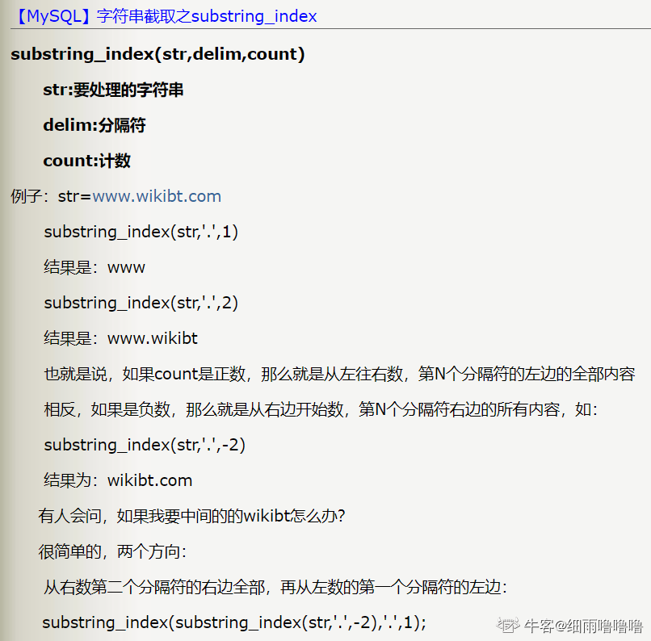
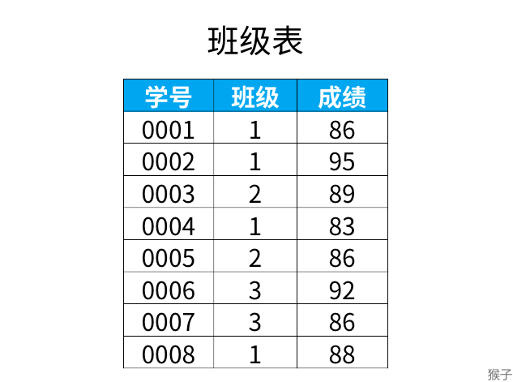
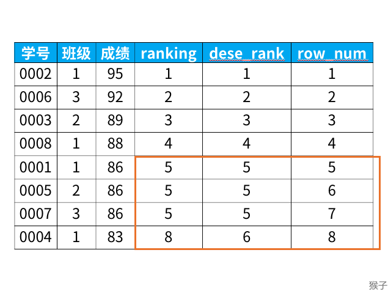
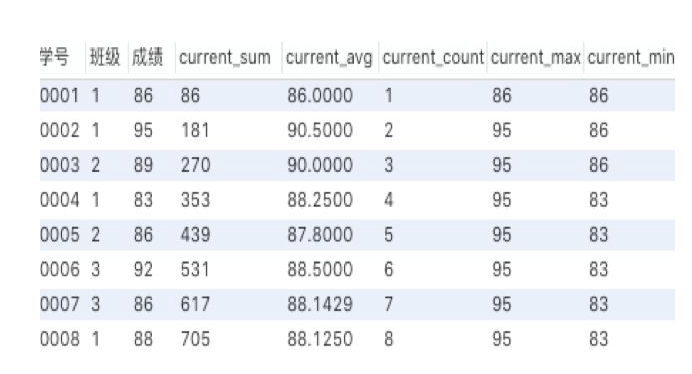

# IS NULL 和 IS NOT NULL

​	查询结果只会包含WHERE子句里的判断结果为true的行！不包含判断结果为false和unknown的行。对NULL使用比较谓词（比如`> NULL`），结果也都是unknown。

 	所以如果列中有NULL，那么就需要用 `IS NULL` 或者 ` IS NOT NULL` 来判断


# CASE函数

是一种多分支的函数，可以根据条件列表的值返回多个可能的结果表达式中的一个。
可用在任何允许使用表达式的地方，但不能单独作为一个语句执行。

## 简单CASE函数

```sql
CASE 测试表达式
WHEN 简单表达式1 THEN 结果表达式1
WHEN 简单表达式2 THEN 结果表达式2 …
WHEN 简单表达式n THEN 结果表达式n
[ ELSE 结果表达式n+1 ]
END
```

​	计算测试表达式，按从上到下的书写顺序将测试表达式的值与每个WHEN子句的简单表达式进行比较。
​	如果某个简单表达式的值与测试表达式的值相等，则返回第一个与之匹配的WHEN子句所对应的结果表达式的值。
​	如果所有简单表达式的值与测试表达式的值都不相等，若指定了ELSE子句,则返回ELSE子句中指定的结果表达式的值；若没有指定ELSE子句，则返回NULL。


例子：

查询班级表中的学生的班号、班名、系号和班主任号，并对系号作如下处理：

1. 当系号为1时，显示 “计算机系”；
2. 当系号为2时，显示 “软件工程系”；
3. 当系号为3时，显示 “物联网系”。

```sql
SELECT 班号 ,班名,
CASE 系号
WHEN 1 THEN '软件工程系'
WHEN 2 THEN '计算机系'
WHEN 3 THEN '物联网系'
END AS 系号,班主任号
FROM 班级表
```


## 搜索CASE函数

```sql
CASE
WHEN 布尔表达式1 THEN 结果表达式1
WHEN 布尔表达式2 THEN 结果表达式2
...
WHEN 布尔表达式n THEN 结果表达式n
[ ELSE 结果表达式n+1 ]
END
```

按从上到下的书写顺序计算每个WHEN子句的布尔表达式。
返回第一个取值为TRUE的布尔表达式所对应的结果表达式的值。
如果没有取值为TRUE的布尔表达式，
则当指定了ELSE子句时,返回ELSE子句中指定的结果；
如果没有指定ELSE子句，则返回NULL。


上述例子使用 搜索case：

```sql
SELECT 班号 ,班名,
CASE
WHEN 系号=1 THEN '软件工程系'
WHEN 系号=2 THEN '计算机系'
WHEN 系号=3 THEN '物联网系'
END AS 系号,班主任号
FROM 班级表

```


# 日期函数

#### DAYOFWEEK(date)

返回日期date的星期索引(1=星期天，2=星期一, ……7=星期六)。这些索引值对应于ODBC标准。

```sql
select DAYOFWEEK('1998-02-03')
```

-> 3


#### DAYOFMONTH(date)

返回date的月份中日期，在1到31范围内。

```sql
mysql> select WEEKDAY('1997-10-04 22:23:00');
```

-> 3


#### DAYOFYEAR(date)

返回date在一年中的日数, 在1到366范围内。

```sql
mysql> select DAYOFYEAR('1998-02-03');
```

-> 34


#### MONTH(date)

返回date的月份，范围1到12。

```sql
mysql> select MONTH('1998-02-03');
```

-> 2


#### DAYNAME(date)

返回date的星期名字。

```sql
mysql> select DAYNAME("1998-02-05");
```

-> 'Thursday'


#### MONTHNAME(date)

返回date的月份名字。

```sql
mysql> select MONTHNAME("1998-02-05");
```

-> 'February'


#### QUARTER(date)

返回date一年中的季度，范围1到4。

```sql
mysql> select QUARTER('98-04-01');
```

-> 2


#### WEEK(date)

对于星期天是一周的第一天的地方，有一个单个参数，返回date的周数，范围在0到52。

```sql
mysql> select WEEK('1998-02-20');
```

-> 7


#### YEAR(date)

返回date的年份，范围在1000到9999。

```sql
mysql> select YEAR('98-02-03');
```

-> 1998


#### HOUR(time)

返回time的小时，范围是0到23。

```sql
mysql> select HOUR('10:05:03');
```

-> 10


#### MINUTE(time)

返回time的分钟，范围是0到59。

```sql
mysql> select MINUTE('98-02-03 10:05:03');
```

-> 5


#### SECOND(time)

回来time的秒数，范围是0到59。

```sql
mysql> select SECOND('10:05:03');
```

-> 3


# DATE_FORMAT函数

```
DATE_FORMAT(date,format) 
```

参数：

`date`：代表具体时间字段。例如 `now()` 查询当前时间 
`format`：格式化字符串。如 `%Y-%m-%d %H:%i:%s` 会将传来的datetime数据转为`"yyyy-MM-dd hh:mm:ss"`格式


# SUBSTRING_INDEX 函数




# REPLACE 函数

```sql
REPLACE(列名,旧内容,新内容)
```

例如：

```sql
update stu set name = replace(name,'ab','cd') where id = 1;
```

上述会把id为1的行的name字段中的 ‘ab’ 改为 ‘cd’


也可以在查询的时候使用该函数

```sql
select replace(name,'ab','cd') as new_name from stu where id = 1;
```


# TIMESTAMPDIFF函数

`TIMESTAMPDIFF(interval, time_start, time_end)`可计算time_start-time_end的时间差，单位以指定的interval为准，常用可选：

- SECOND 秒
- MINUTE 分钟（返回秒数差除以60的整数部分）
- HOUR 小时（返回秒数差除以3600的整数部分）
- DAY 天数（返回秒数差除以3600*24的整数部分）
- MONTH 月数
- YEAR 年数

```sql
SELECT * 
FROM table
WHERE TIMESTAMPDIFF(MINUTE, start_time, submit_time) < 5;
```


# CONCAT函数

`CONCAT(str1,str2...)` 该函数用于把多个字符串连接起来

eg: employee_tbl表如下：

| id   | name | work_date  | daily |
| ---- | ---- | ---------- | ----- |
| 1    | John | 2007-01-24 | 250   |
| 2    | Ram  | 2007-05-27 | 270   |

`SELECT CONCAT(id, name, work_date) FROM employee_tbl;`

结果：

| CONCAT(id, name, work_date) |
| --------------------------- |
| 1John2007-01-24             |
| 2Ram2007-05-27              |


# CONCAT_WS函数

`concat_ws(separator,str2,str2,...)` ws 代表  with separator，用于把多个字符串用`separator`（分隔符） 连接起来。`separator` 可以是一个字符串，也可以是其他参数。

**注意：如果分隔符为NULL，那么结果也为NULL，函数会忽略任何分隔符参数后的NULL值**


eg：

```csharp
select concat_ws(',','11','22','33');
```

结果：

| concat_ws(',','11','22','33') |
| ----------------------------- |
| 11，22，33                    |

eg：

```csharp
select concat_ws(',','11','22',NULL);
```

结果：

| concat_ws(',','11','22',NULL) |
| ----------------------------- |
| 11，22                        |


# GROUP_CONCAT函数

group_concat的用途：按分组来把多行数据显示在一行，将group by产生的同一个分组中的值连接起来，返回一个字符串结果。

完整语法：`group_concat([DISTINCT] 要连接的字段 [ORDERBY BY ASC/DESC 排序字段] [SEPARATOR'分隔符'])`

**group_concat()函数需要与group by语句在一起使用，才能得到需要的效果。**

eg：

下图是exam表

```
|id |subject |student|teacher|score|
---------------------------------------
|1 |数学 |小红 |王老师 |80 |
|2 |数学 |小李 |王老师 |80 |
|3 |数学 |小王 |王老师 |70 |
|4 |数学 |小张 |王老师 |90 |
|5 |数学 |小赵 |王老师 |70 |
|6 |数学 |小孙 |王老师 |80 |
|7 |数学 |小钱 |王老师 |90 |
|8 |数学 |小高 |王老师 |70 |
|9 |数学 |小秦 |王老师 |80 |
|10 |数学 |小马 |王老师 |90 |
|11 |数学 |小朱 |王老师 |90 |
|12 |语文 |小高 |李老师 |70 |
|15 |语文 |小秦 |李老师 |70 |
|18 |语文 |小马 |李老师 |80 |
|21 |语文 |小朱 |李老师 |90 |
|24 |语文 |小钱 |李老师 |90 |
```

如果我们希望按分数score进行分组，并将分组后的学生姓名打印下来，就可以用group_concat实现。执行sql：

```sql
select score,group_concat(student) from exam group by score;
```

结果如下：

```
|score |group_concat(student)		|
-------------------------------------
|70	   |小王,小赵,小高,小高,小秦		|
|80	   |小红,小李,小孙,小秦,小马		|
|90	   |小张,小钱,小马,小朱,小朱,小钱	|
```


不难看出，在70分这一行有两条小高的记录，90分这一行有两条小钱和小朱的记录，如果我们需要去重，则需要给函数中加一个distinct参数：

```sql
select score,group_concat(distinct student) from exam group by score;
```

执行结果为：

```
|score |group_concat(student)	|
---------------------------------

|70	   |小王,小赵,小高,小秦		|
|80	   |小红,小李,小孙,小秦,小马	|
|90	   |小张,小钱,小马,小朱		|
```


这样group_concat每行数据的结果中就没有了重复值，但是在数据中的分隔符为默认的逗号','，如果想修改默认的分隔符，只需要在上述指令中稍作修改：

```sql
select score,group_concat(distinct student separator '%') from exam group by score;
```

  执行结果：

```
|score |group_concat(student)	|
---------------------------------

|70	   |小王%小秦%小赵%小高		|
|80	   |小孙%小李%小秦%小红%小马	|
|90	   |小张%小朱%小钱%小马		|
```


# 窗口函数

**1.窗口函数语法**

```text
<窗口函数> over (partition by <用于分组的列名>
                order by <用于排序的列名>)
```

<窗口函数>的位置，可以放以下两种函数：

1） 专用窗口函数，比如rank, dense_rank, row_number等

2） 聚合函数，如sum,avg, count, max, min等


**2.窗口函数有以下功能：**

1）同时具有分组（partition by）和排序（order by）的功能

2）不减少原表的行数，所以经常用来在每组内排名


**3.注意事项**

窗口函数原则上只能写在select子句中

partition子句可以省略，但是省略了就失去了窗口函数的功能。


**4.窗口函数使用场景**

1）业务需求“**在每组内排名”**，比如：

> 排名问题：每个部门按业绩来排名
> topN问题：找出每个部门排名前N的员工进行奖励


**例子：**

下图，是班级表中的内容




```text
select *,
   rank() over (order by 成绩 desc) as ranking,
   dense_rank() over (order by 成绩 desc) as dese_rank,
   row_number() over (order by 成绩 desc) as row_num
from 班级表
```

结果如下：



从上面的结果可以看出：

> rank函数：这个例子中是5位，5位，5位，8位，也就是如果有并列名次的行，会占用下一名次的位置。比如正常排名是1，2，3，4，但是现在前3名是并列的名次，结果是：**1，1，1**，4。
>
> dense_rank函数：这个例子中是5位，5位，5位，6位，也就是如果有并列名次的行，不占用下一名次的位置。比如正常排名是1，2，3，4，但是现在前3名是并列的名次，结果是：**1，1，1**，2。
>
> row_number函数：这个例子中是5位，6位，7位，8位，也就是不考虑并列名次的情况。比如前3名是并列的名次，排名是正常的**1，2，3**，4。


如果窗口函数是聚合函数：

```
select *,
   sum(成绩) over (order by 学号) as current_sum,
   avg(成绩) over (order by 学号) as current_avg,
   count(成绩) over (order by 学号) as current_count,
   max(成绩) over (order by 学号) as current_max,
   min(成绩) over (order by 学号) as current_min
from 班级表
```

结果如下：



​	如上图，聚合函数sum在窗口函数中，是对自身记录、及位于自身记录以上的数据进行求和的结果。比如0004号，在使用sum窗口函数后的结果，是对0001，0002，0003，0004号的成绩求和，若是0005号，则结果是0001号~0005号成绩的求和，以此类推。

​	不仅是sum求和，平均、计数、最大最小值，也是同理，都是针对自身记录、以及自身记录之上的所有数据进行计算。

​	比如0005号后面的聚合窗口函数结果是：学号0001~0005五人成绩的总和、平均、计数及最大最小值。

​	如果想要知道所有人成绩的总和、平均等聚合结果，看最后一行即可。

# 插入记录

- 插入一行（全字段）：

  ```SQL
  INSERT INTO table_name VALUES(col1_val,col2_val...)
  ```

- 插入一行（部分字段）：

  ```sql
  INSERT INTO table_name(field1,field2...) VALUES(col1_val,col2_val...)
  ```

- 插入多行（全字段）：

  ```SQL
  INSERT INTO table_name VALUES
  (col1_val,col2_val...),		#第一行的数据
  (col1_val1,col2_val...),	#第二行的数据
  ...							#每一行的数据用 ',' 分隔
  							#如果是部分字段插入，只需在 table_name后面加上响应字段名即可
  ```

- **从另一个表导入**

  ```sql
  INSERT INTO table_name SELECT * FROM table_name2 [WHERE key=value]
  ```

  

# REPLACE INTO

replace into 跟 insert into功能类似，不同点在于：replace into 首先尝试插入数据到表中，

1. 如果发现表中已经有此行数据（根据主键或者唯一索引判断）则先删除此行数据，然后插入新的数据；
2. 否则，直接插入新数据。

要注意的是：插入数据的表必须有主键或者唯一索引！否则的话，replace into 会直接插入数据，这将导致表中出现重复的数据。


```sql
REPLACE INTO examination_info
VALUES(NULL,9003,'SQL','hard',90,'2021-01-01 00:00:00');
```


# TRUNCATE 与 DELETE FROM

```sql
TRUNCATE [TABLE] table_name;
```

与

```sql
DELETE FROM table_name;
```

两者都会删除表中所有行，并且不会删除表的结构、约束等信息。

**但truncate table 比delete速度更快，且使用的系统和事务日志资源少，并且会使自增计数器的值重置。**

而 DELETE FROM 不会重置自增计数器值。


# 修改自增计数器值

可以使用以下语句：

```SQL
ALTER TABLE table_name AUTO_INCREMENT = 123;
```

现在新的自增初始值为 123


# 索引创建与删除

索引创建、删除与使用：

**创建索引：**

1.  create方式创建索引：

```
CREATE 
  [UNIQUE -- 唯一索引
  | FULLTEXT -- 全文索引
  ] INDEX index_name ON table_name -- 不指定唯一或全文时默认普通索引
  (column1[(length) [DESC|ASC]] [,column2,...]) -- 可以对多列建立组合索引  
```

2. alter方式创建索引：`ALTER TABLE tb_name ADD [UNIQUE | FULLTEXT] [INDEX] index_content(content)`


**删除索引：**

1. drop方式删除索引：`DROP INDEX <索引名> ON <表名>`
2. alter方式删除索引：`ALTER TABLE <表名> DROP INDEX <索引名>`

上述删除索引方式对于任何种类的索引都是一样的语法。


**索引的使用：**

- 索引使用时满足最左前缀匹配原则，即对于组合索引(col1, col2)，在不考虑引擎优化时，条件必须是col1在前col2在后，或者只使用col1，索引才会生效；
- 索引不包含有NULL值的列
- 一个查询只使用一次索引，where中如果使用了索引，order by就不会使用
- like做字段比较时只有前缀确定时才会使用索引
- 在列上进行运算后不会使用索引，如year(start_time)<2020不会使用start_time上的索引

