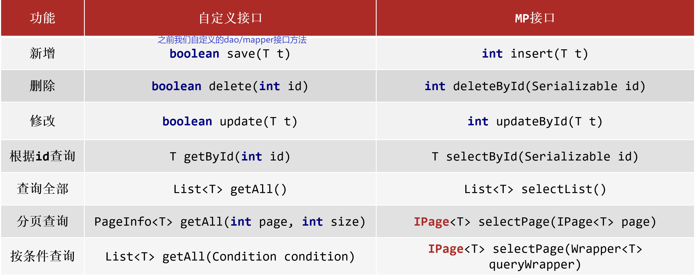
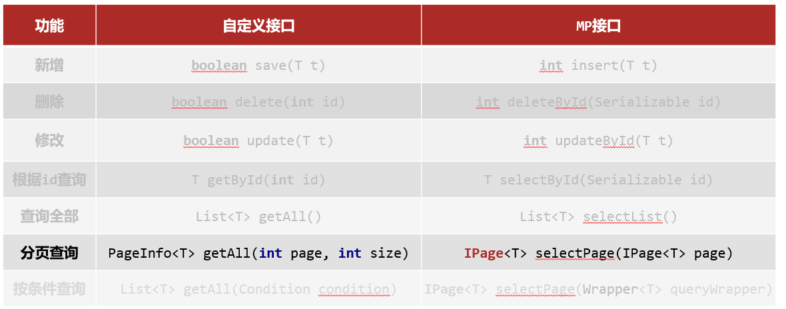
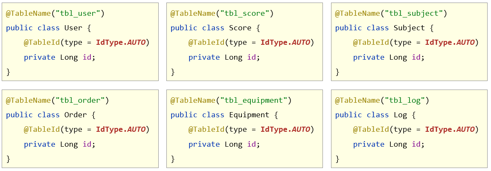
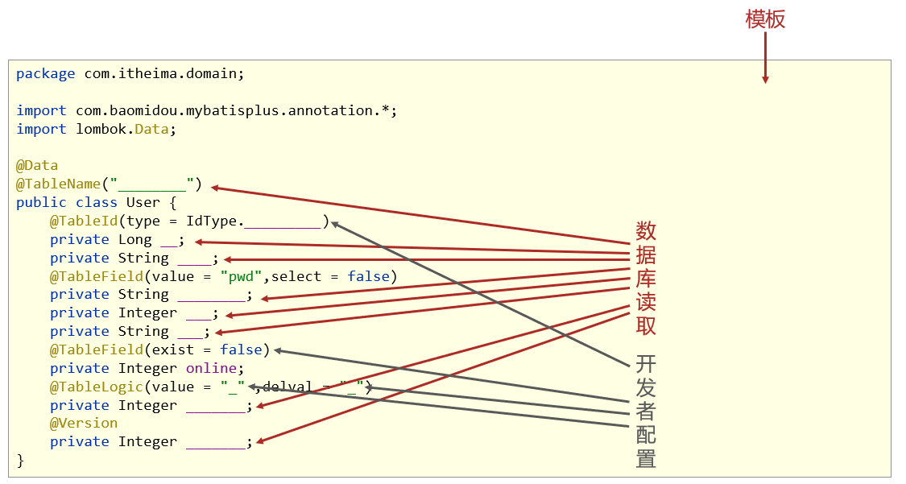

## 一、MyBatisPlus简介

### 1. 入门案例

#### 1.1 SpringBoot整合MyBatisPlus入门程序

##### ①：创建新模块，选择Spring初始化，并配置模块相关基础信息

#####  ②：选择当前模块需要使用的技术集（仅保留JDBC）

 

##### ③：手动添加MyBatisPlus起步依赖

```xml
<dependency>
    <groupId>com.baomidou</groupId>
    <artifactId>mybatis-plus-boot-starter</artifactId>
    <version>3.4.1</version>
</dependency>
<dependency>
    <groupId>com.alibaba</groupId>
    <artifactId>druid</artifactId>
    <version>1.1.16</version>
</dependency>
```

**注意事项1：由于mp并未被收录到idea的系统内置配置，无法直接选择加入**

**注意事项2：如果使用Druid数据源，需要导入对应坐标**

##### ④：制作实体类与表结构

（类名与表名对应，属性名与字段名对应）

```sql
create database if not exists mybatisplus_db character set utf8;
use mybatisplus_db;
CREATE TABLE user (
            id bigint(20) primary key auto_increment,
            name varchar(32) not null,
            password  varchar(32) not null,
            age int(3) not null ,
            tel varchar(32) not null
);
insert into user values(null,'tom','123456',12,'12345678910');
insert into user values(null,'jack','123456',8,'12345678910');
insert into user values(null,'jerry','123456',15,'12345678910');
insert into user values(null,'tom','123456',9,'12345678910');
insert into user values(null,'snake','123456',28,'12345678910');
insert into user values(null,'张益达','123456',22,'12345678910');
insert into user values(null,'张大炮','123456',16,'12345678910');
```

```java
public class User {
    private Long id;
    private String name;
    private String password;
    private Integer age;
    private String tel;
    //自行添加getter、setter、toString()等方法
}
```

##### ⑤：设置Jdbc参数（**application.yml**）

```yml
spring:
  datasource:
    type: com.alibaba.druid.pool.DruidDataSource
    driver-class-name: com.mysql.cj.jdbc.Driver
    url: jdbc:mysql://localhost:3306/mybatisplus_db?serverTimezone=UTC
    username: root
    password: root
```

##### ⑥：定义数据接口，继承**BaseMapper**

```java
package com.itheima.dao;

import com.baomidou.mybatisplus.core.mapper.BaseMapper;
import com.itheima.domain.User;
import org.apache.ibatis.annotations.Mapper;

@Mapper
public interface UserDao extends BaseMapper<User> {
}
```

##### ⑦：测试类中注入dao接口，测试功能

```java
package com.itheima;

import com.itheima.dao.UserDao;
import com.itheima.domain.User;
import org.junit.jupiter.api.Test;
import org.springframework.beans.factory.annotation.Autowired;
import org.springframework.boot.test.context.SpringBootTest;

import java.util.List;

@SpringBootTest
public class Mybatisplus01QuickstartApplicationTests {

    @Autowired
    private UserDao userDao;

    @Test
    void testGetAll() {
        List<User> userList = userDao.selectList(null);
        System.out.println(userList);
    }
}
```


### 2. MyBatisPlus概述

#### 2.1 MyBatis介绍

- MyBatisPlus（简称MP）是基于MyBatis框架基础上开发的增强型工具，旨在简化开发、提高效率

- 官网：[https](https://mybatis.plus/)[://mybatis.plus](https://mybatis.plus/)[/](https://mybatis.plus/)   [https://mp.baomidou.com](https://mp.baomidou.com/)[/](https://mp.baomidou.com/)

#### 2.2 MyBatisPlus特性

- 无侵入：只做增强不做改变，不会对现有工程产生影响
- 强大的 CRUD 操作：内置通用 Mapper，少量配置即可实现单表CRUD 操作
- 支持 Lambda：编写查询条件无需担心字段写错
- 支持主键自动生成
- 内置分页插件
- ……


## 二、标准数据层开发

### 1. MyBatisPlus的CRUD操作



```java
package com.itheima;

import com.itheima.dao.UserDao;
import com.itheima.domain.User;
import org.junit.jupiter.api.Test;
import org.springframework.beans.factory.annotation.Autowired;
import org.springframework.boot.test.context.SpringBootTest;

import java.util.List;

@SpringBootTest
class Mybatisplus01QuickstartApplicationTests {

    @Autowired
    private UserDao userDao;

    @Test
    void testSave() {
        User user = new User();
        user.setName("黑马程序员");
        user.setPassword("itheima");
        user.setAge(12);
        user.setTel("4006184000");
        userDao.insert(user);
    }

    @Test
    void testDelete() {
        userDao.deleteById(1401856123725713409L);
    }

    @Test
    void testUpdate() {
        User user = new User();
        user.setId(1L);
        user.setName("Tom888");
        user.setPassword("tom888");
        userDao.updateById(user);
    }

    @Test
    void testGetById() {
        User user = userDao.selectById(2L);
        System.out.println(user);
    }


    @Test
    void testGetAll() {
        List<User> userList = userDao.selectList(null);
        System.out.println(userList);
    }
}

```

### 2. Lombok介绍

**问题导入**

有什么简单的办法可以自动生成实体类的GET、SET方法？

- **Lombok**，一个<u>Java类库</u>，提供了一组注解，<u>简化POJO实体类开发</u>。


```xml
<dependency>
    <groupId>org.projectlombok</groupId>
    <artifactId>lombok</artifactId>
    <version>1.18.12</version>
</dependency>
```

- 常用注解：**==@Data==**，为当前实体类在编译期设置对应的get/set方法，toString方法，hashCode方法，equals方法等。（不包含无参和全部参数构造方法）。只需要在实体类的上面添加相应的注解，就不用写一些方法了。


```java
package com.itheima.domain;

import lombok.*;
/*
    1 生成getter和setter方法：@Getter、@Setter
      生成toString方法：@ToString
      生成equals和hashcode方法：@EqualsAndHashCode

    2 统一成以上所有：@Data

    3 生成空参构造： @NoArgsConstructor
      生成全参构造： @AllArgsConstructor

    4 lombok还给我们提供了builder的方式创建对象,好处就是可以链式编程。 @Builder【扩展】
 */
@Data
public class User {
    private Long id;
    private String name;
    private String password;
    private Integer age;
    private String tel;
}

```


### 3. MyBatisPlus分页功能

#### 3.1 分页功能接口



#### 3.2 MyBatisPlus分页使用

**①：设置分页拦截器作为Spring管理的bean**

```java
package com.itheima.config;

import com.baomidou.mybatisplus.extension.plugins.MybatisPlusInterceptor;
import com.baomidou.mybatisplus.extension.plugins.inner.PaginationInnerInterceptor;
import org.springframework.context.annotation.Bean;
import org.springframework.context.annotation.Configuration;

@Configuration
public class MybatisPlusConfig {
    
    @Bean
    public MybatisPlusInterceptor mybatisPlusInterceptor(){
        //1 创建MybatisPlusInterceptor拦截器对象
        MybatisPlusInterceptor mpInterceptor=new MybatisPlusInterceptor();
        //2 添加分页拦截器
        mpInterceptor.addInnerInterceptor(new PaginationInnerInterceptor());
        return mpInterceptor;
    }
}
```

**②：执行分页查询**

```java
//分页查询
@Test
void testSelectPage(){
    //1 创建IPage分页对象,设置分页参数，第一个参数为当前页码，第二个参数为每页的行数。
    IPage<User> page=new Page<>(1,3);
    //2 执行分页查询
    userDao.selectPage(page,null);
    //3 获取分页结果
    System.out.println("当前页码值："+page.getCurrent());
    System.out.println("每页显示数："+page.getSize());
    System.out.println("总页数："+page.getPages());
    System.out.println("总行数："+page.getTotal());
    System.out.println("当前页数据："+page.getRecords());
}
```


##### 开启MyBatisPlus日志

如果开启MyBatisPlus日志呢？

需要在 application.yml中如下配置：

```yml
spring:
  datasource:
    type: com.alibaba.druid.pool.DruidDataSource
    driver-class-name: com.mysql.cj.jdbc.Driver
    url: jdbc:mysql://localhost:3306/mybatisplus_db?serverTimezone=UTC
    username: root
    password: root
# 开启mp的日志（输出到控制台）
mybatis-plus:
  configuration:
    log-impl: org.apache.ibatis.logging.stdout.StdOutImpl
```


##### 解决日志打印过多问题

1. 取消初始化spring日志打印


做法：在resources下新建一个**logback.xml文件**，名称固定，内容如下：

```xml
<?xml version="1.0" encoding="UTF-8"?>
<configuration>

</configuration>
```


2. 取消SpringBoot启动banner图标


```yaml
spring:
  main:
    banner-mode: off # 关闭SpringBoot启动图标(banner)
```

3. 取消MybatisPlus启动banner图标


```yaml
# mybatis-plus日志控制台输出
mybatis-plus:
  configuration:
    log-impl: org.apache.ibatis.logging.stdout.StdOutImpl
  global-config:
    banner: off # 关闭mybatisplus启动图标
```


## 三、DQL编程控制

### 1. 条件查询方式

- MyBatisPlus将书写复杂的SQL查询条件进行了封装，**Wapper接口** 就封装了条件查询的 条件。


#### 1.1 条件查询

##### 1.1.1 方式一：按条件查询

```java
//方式一：按条件查询
QueryWrapper<User> qw=new QueryWrapper<>();
qw.lt("age", 18);
List<User> userList = userDao.selectList(qw);
System.out.println(userList);
```

##### 1.1.2 方式二：lambda格式按条件查询

```java
//方式二：lambda格式按条件查询
QueryWrapper<User> qw = new QueryWrapper<User>();
qw.lambda().lt(User::getAge, 10);
List<User> userList = userDao.selectList(qw);
System.out.println(userList);
```

##### 1.1.3 方式三：lambda格式按条件查询（推荐）

```java
//方式三：lambda格式按条件查询
LambdaQueryWrapper<User> lqw = new LambdaQueryWrapper<User>();
lqw.lt(User::getAge, 10);
List<User> userList = userDao.selectList(lqw);
System.out.println(userList);
```


#### 1.2 组合条件

##### 1.2.1 并且关系（and）

```java
//并且关系
LambdaQueryWrapper<User> lqw = new LambdaQueryWrapper<User>();
//并且关系：10到30岁之间
lqw.lt(User::getAge, 30).gt(User::getAge, 10);
//等价于
//lqw.lt(User::getAge,30);	lqw.gt(User::getAge,10);
 
List<User> userList = userDao.selectList(lqw);
System.out.println(userList);
```

##### 1.2.2 或者关系（or）

```java
//或者关系
LambdaQueryWrapper<User> lqw = new LambdaQueryWrapper<User>();
//或者关系：小于10岁或者大于30岁
lqw.lt(User::getAge, 10).or().gt(User::getAge, 30);
List<User> userList = userDao.selectList(lqw);
System.out.println(userList);
```


#### 1.3 NULL值处理

**问题导入**

如下搜索场景，在多条件查询中，有条件的值为空应该怎么解决？


#####  1.3.1 if语句控制条件追加（不推荐）

```java
Integer minAge=10;  //将来有用户传递进来,此处简化成直接定义变量了
Integer maxAge=null;  //将来有用户传递进来,此处简化成直接定义变量了

LambdaQueryWrapper<User> lqw = new LambdaQueryWrapper<User>();
if(minAge!=null){
    lqw.gt(User::getAge, minAge);
}
if(maxAge!=null){
    lqw.lt(User::getAge, maxAge);
}
List<User> userList = userDao.selectList(lqw);
userList.forEach(System.out::println);
```

##### 1.3.2 条件参数控制

```java
Integer minAge=10;  //将来有用户传递进来,此处简化成直接定义变量了
Integer maxAge=null;  //将来有用户传递进来,此处简化成直接定义变量了
LambdaQueryWrapper<User> lqw = new LambdaQueryWrapper<User>();
//参数1：如果表达式为true，那么查询才使用该条件
lqw.gt(minAge!=null,User::getAge, minAge);
lqw.lt(maxAge!=null,User::getAge, maxAge);
List<User> userList = userDao.selectList(lqw);
userList.forEach(System.out::println);
```

##### 1.3.3 条件参数控制（链式编程）

```java
Integer minAge=10;  //将来有用户传递进来,此处简化成直接定义变量了
Integer maxAge=null;  //将来有用户传递进来,此处简化成直接定义变量了
LambdaQueryWrapper<User> lqw = new LambdaQueryWrapper<User>();
//参数1：如果表达式为true，那么查询才使用该条件
lqw.gt(minAge!=null,User::getAge, minAge)
   .lt(maxAge!=null,User::getAge, maxAge);
List<User> userList = userDao.selectList(lqw);
userList.forEach(System.out::println);
```


### 2. 查询投影-设置【查询字段、分组、分页】

#### 2.1 查询结果包含模型类中部分属性

```java
/*LambdaQueryWrapper<User> lqw = new LambdaQueryWrapper<User>();
lqw.select(User::getId, User::getName, User::getAge);*/
//或者
QueryWrapper<User> lqw = new QueryWrapper<User>();
lqw.select("id", "name", "age", "tel");
List<User> userList = userDao.selectList(lqw);
System.out.println(userList);
```


#### 2.2 查询结果包含模型类中未定义的属性

```java
QueryWrapper<User> lqw = new QueryWrapper<User>();
lqw.select("count(*) as count, tel");
lqw.groupBy("tel");	//设置groupBy

//获取到的是一个list集合，list里面的元素又是一个map集合，这个map集合就表示
//列的名称 ， 列的值 。 每个map集合表示一行数据。
List<Map<String, Object>> userList = userDao.selectMaps(lqw);
System.out.println(userList);
//[{count=7, tel=12345678910}, {count=2, tel=154577744}]
```


### 3. 查询条件设定

多条件查询有哪些组合？

- 范围匹配（> 、 = 、between）
- 模糊匹配（like）
- 空判定（null）
- 包含性匹配（in）
- 分组（group）
- 排序（order）
- ……


#### 3.1 查询条件种类

- 相等条件（**eq方法**）

```java
LambdaQueryWrapper<User> lqw = new LambdaQueryWrapper<User>();
//等同于=
lqw.eq(User::getName, "Jerry").eq(User::getPassword, "jerry");
User loginUser = userDao.selectOne(lqw);
System.out.println(loginUser);
```

- 区间条件（ **lt le gt ge eq between 方法**）

```java
LambdaQueryWrapper<User> lqw = new LambdaQueryWrapper<User>();
//范围查询 lt le gt ge eq between
lqw.between(User::getAge, 10, 30);
List<User> userList = userDao.selectList(lqw);
System.out.println(userList);
```

- like条件（ **like likeLeft likeRight方法** ）

likeLeft 是指 `%` 在左边

likeRight 是指 `% `在右边

like是指 `% ` 左右两边均有

```java
LambdaQueryWrapper<User> lqw = new LambdaQueryWrapper<User>();
//模糊匹配 like
lqw.likeLeft(User::getName, "J");		//相当于 select * from user where name like %J
List<User> userList = userDao.selectList(lqw);
System.out.println(userList);
```

- 分组 排序 聚集函数 (**groupBy  orderBy和 select 方法**)

```java
QueryWrapper<User> qw = new QueryWrapper<User>();
qw.select("gender","count(*) as nums");
qw.groupBy("gender");
List<Map<String, Object>> maps = userDao.selectMaps(qw);
System.out.println(maps);
```


更多查询条件设置参看文档


### 4. 字段映射与表名映射

**问题导入**

思考<u>表的字段</u>和<u>实体类的属性</u>不对应，查询会怎么样？


#### 4.1 问题一：表字段名与实体类属性名不一致

- 在模型类属性上方，使用**@TableField**属性注解，通过==**value**==属性，设置当前属性对应的<u>数据库表</u>中的字段名。


#### 4.2 问题二：实体类中添加了数据库中未定义的属性

- 在模型类属性上方，使用**@TableField**注解，通过**==exist==**属性，设置属性在数据库表字段中是否存在，**默认为true**。<u>此属性无法与value合并使用。</u>


#### 4.3 问题三：默认查询开放了更多的字段查看权限

例如，有时候查询数据库中的表，表中含有密码等敏感信息，所以希望在查询时不查这些字段。

- 在模型类属性上方，使用**@TableField**注解，通过**==select==**属性：设置该属性是否参与查询。此属性与select()映射配置不冲突。

 

#### 4.4 问题四：表名与实体类名不一致

- 在<u>**模型类**</u>上方，使用**@TableName**注解，通过**==value==**属性，设置当前类对应的数据库表名称。


```java
@Data
@TableName("tbl_user")
public class User {
    /*
        id为Long类型，因为数据库中id为bigint类型，
        并且mybatis有自己的一套id生成方案，生成出来的id必须是Long类型
     */
    private Long id;
    private String name;
    @TableField(value = "pwd",select = false)
    private String password;
    private Integer age;
    private String tel;
    @TableField(exist = false) //表示online字段不参与CRUD操作
    private Boolean online;
}
```


## 四、DML编程控制

### 1. id生成策略控制（Insert）

**问题导入**

主键生成的策略有哪几种方式？

不同的表应用不同的id生成策略

- 日志：自增（1,2,3,4，……）
- 购物订单：特殊规则（FQ23948AK3843）
- 外卖单：关联地区日期等信息（10 04 20200314 34 91）
- 关系表：可省略id
- ……

#### 1.1 id生成策略控制（@TableId注解）

- 名称：**@TableId**

- 类型：**属性注解**

- 位置：模型类中用于表示<u>主键</u>的属性定义上方

- 作用：设置当前类中主键属性的生成策略

- 相关属性

    ​	**type**：设置主键属性的生成策略，值参照IdType枚举值

     


#### 1.2 全局策略配置

在 **application.yml** 中配置：

```yml
mybatis-plus:
  global-config:
    db-config:
      id-type: assign_id
      table-prefix: tbl_
```

##### id生成策略全局配置

`id-type: assign_id`：

相当于在所有 表对应的实体类 的主键属性上边加上 `@TableId(type = )注解`：



这样，在实体类中就不用写上图的那些  @TableId注解了


##### 表名前缀全局配置

`table-prefix: tbl_`

它相当于给 所有实体类都添加 `@TableName("tbl_" + 首字母小写的类名)` 这个注解。

所以这些实体类中就不用写下图中的这些注解了。


### 2. 批量操作（批量Delete/Select）

#### 2.1 按照主键删除多条记录

```java
//删除指定多条数据
List<Long> list = new ArrayList<>();
list.add(1402551342481838081L);
list.add(1402553134049501186L);
list.add(1402553619611430913L);

userDao.deleteBatchIds(list);
```

#### 2.2 根据主键查询多条记录

```java
//查询指定多条数据
List<Long> list = new ArrayList<>();
list.add(1L);
list.add(3L);
list.add(4L);
userDao.selectBatchIds(list);
```


### 3. 逻辑删除（Delete/Update）

**问题导入**

下图中是一个员工表和业绩表。

如果1号员工离职，一般来说我们会直接把1号员工及其在业绩表中的行删除掉。但是如果真的把这些数据从数据库中删除，那么当我们想统计所有业绩总额时，就会由于1号员工的数据已被删除而导致统计不准确。

所以，我们希望在删除1号员工时只是 **逻辑删除**，也就是不删掉数据库中的数据，而是给这些逻辑删除的数据添加一个 标记（例如 下图中的deleted），这样这些数据实际还保存在数据库中，但是逻辑上已经从表中删除了。

- 逻辑删除：为数据设置是否可用状态字段，删除时设置状态字段为不可用状态，数据保留在数据库中

 


#### 3.1 逻辑删除案例

##### ①：数据库表中添加逻辑删除标记字段

 

##### ②：实体类中添加对应字段，并设定当前字段为逻辑删除标记字段

```java
package com.itheima.domain;

import com.baomidou.mybatisplus.annotation.*;

import lombok.Data;

@Data
public class User {

    private Long id;
    
    //逻辑删除字段，标记当前记录是否被删除
   	//value属性表示没被逻辑删除的值，deval属性表示被逻辑删除后该字段的值。
    @TableLogic(value = "0" ,delval = "1")
    private Integer deleted;
    
}
```

##### ③：全局配置逻辑删除字面值

也可以全局配置逻辑删除，这样就不用在实体类中添加 @TableLogic注解了

```yml
mybatis-plus:
  global-config:
    db-config:
      table-prefix: tbl_
      # 逻辑删除字段名,值 应该与 ==实体类中的属性名== 一致。
      logic-delete-field: deleted
      # 逻辑删除字面值：未删除为0
      logic-not-delete-value: 0
      # 逻辑删除字面值：删除为1
      logic-delete-value: 1
```


**逻辑删除本质**：逻辑删除的本质其实是**update操作**，mybatis-plus会在底层的sql语句中，把deleted值set为1。

如果加了逻辑删除字段，查询数据时也会自动带上逻辑删除字段：

 


### 4. 乐观锁

**问题导入**

乐观锁主张的思想是什么？

- 业务并发现象带来的问题：秒杀

 

#### 4.1 乐观锁案例

①：数据库表中添加锁标记字段

 

②：实体类中添加对应字段，并设定当前字段为 乐观锁 标记字段（**@Version注解**）

```java
package com.itheima.domain;

import com.baomidou.mybatisplus.annotation.TableField;
import com.baomidou.mybatisplus.annotation.TableLogic;
import com.baomidou.mybatisplus.annotation.Version;
import lombok.Data;

@Data
public class User {

	private Long id;
	
    @Version
    private Integer version;
}
```

③：配置乐观锁拦截器实现锁机制对应的动态SQL语句拼装

```java
package com.itheima.config;

import com.baomidou.mybatisplus.extension.plugins.MybatisPlusInterceptor;
import com.baomidou.mybatisplus.extension.plugins.inner.OptimisticLockerInnerInterceptor;
import com.baomidou.mybatisplus.extension.plugins.inner.PaginationInnerInterceptor;
import org.springframework.context.annotation.Bean;
import org.springframework.context.annotation.Configuration;

@Configuration
public class MpConfig {
    @Bean
    public MybatisPlusInterceptor mpInterceptor() {
        //1.定义Mp拦截器
        MybatisPlusInterceptor mpInterceptor = new MybatisPlusInterceptor();

        //2.添加乐观锁拦截器
        mpInterceptor.addInnerInterceptor(new OptimisticLockerInnerInterceptor());
        
        return mpInterceptor;
    }
}

```

④：使用乐观锁机制在修改前必须先获取到对应数据的verion方可正常进行

```java
@Test
public void testUpdate() { 
    //.先通过要修改的数据id将当前数据查询出来
    User user = userDao.selectById(3L);
    //2.将要修改的属性逐一设置进去
    user.setName("Jock888");
    userDao.updateById(user);
    
}
```

 


##  五、快速开发-代码生成器

**问题导入**

如果只给一张表的字段信息，能够推演出Domain、Dao层的代码？


### 1. MyBatisPlus提供模板

类似于填空造句

- Mapper接口模板


- 实体对象类模板




### 2. 工程搭建和基本代码编写

- 第一步：创建SpringBoot工程，添加代码生成器相关依赖

```xml
<!--代码生成器-->
<dependency>
    <groupId>com.baomidou</groupId>
    <artifactId>mybatis-plus-generator</artifactId>
    <version>3.4.1</version>
</dependency>

<!--velocity模板引擎-->
<dependency>
    <groupId>org.apache.velocity</groupId>
    <artifactId>velocity-engine-core</artifactId>
    <version>2.3</version>
</dependency>
```

全部依赖如下：

```xml
    <dependencies>
        <dependency>
            <groupId>org.springframework.boot</groupId>
            <artifactId>spring-boot-starter</artifactId>
        </dependency>

        <dependency>
            <groupId>mysql</groupId>
            <artifactId>mysql-connector-java</artifactId>
            <scope>runtime</scope>
        </dependency>
        <dependency>
            <groupId>org.springframework.boot</groupId>
            <artifactId>spring-boot-starter-test</artifactId>
            <scope>test</scope>
        </dependency>

        <dependency>
            <groupId>com.baomidou</groupId>
            <artifactId>mybatis-plus-boot-starter</artifactId>
            <version>3.4.1</version>
        </dependency>

        <dependency>
            <groupId>com.alibaba</groupId>
            <artifactId>druid</artifactId>
            <version>1.2.8</version>
        </dependency>
        <dependency>
            <groupId>org.projectlombok</groupId>
            <artifactId>lombok</artifactId>
            <version>1.18.12</version>
        </dependency>

        <!--代码生成器-->
        <dependency>
            <groupId>com.baomidou</groupId>
            <artifactId>mybatis-plus-generator</artifactId>
            <version>3.4.1</version>
        </dependency>

        <!--velocity模板引擎-->
        <dependency>
            <groupId>org.apache.velocity</groupId>
            <artifactId>velocity-engine-core</artifactId>
            <version>2.3</version>
        </dependency>
    </dependencies>
```


- 第二步：编写代码生成器类

```java
package com.itheima;

import com.baomidou.mybatisplus.generator.AutoGenerator;
import com.baomidou.mybatisplus.generator.config.DataSourceConfig;

public class Generator {
    public static void main(String[] args) {
        //1. 创建代码生成器对象，执行生成代码操作
        AutoGenerator autoGenerator = new AutoGenerator();

        //2. 数据源相关配置：读取数据库中的信息，根据数据库表结构生成代码
        DataSourceConfig dataSource = new DataSourceConfig();
        dataSource.setDriverName("com.mysql.cj.jdbc.Driver");
        dataSource.setUrl("jdbc:mysql://localhost:3306/mybatisplus_db?serverTimezone=UTC");
        dataSource.setUsername("root");
        dataSource.setPassword("root");
        autoGenerator.setDataSource(dataSource);

         //3. 执行生成操作
        autoGenerator.execute();
    }
}

```

### 3. 开发者自定义配置

- 设置全局配置

```java
//设置全局配置
GlobalConfig globalConfig = new GlobalConfig();
globalConfig.setOutputDir(System.getProperty("user.dir")+"/mybatisplus_04_generator/src/main/java");    //设置代码生成位置
globalConfig.setOpen(false);    //设置生成完毕后是否打开生成代码所在的目录
globalConfig.setAuthor("黑马程序员");    //设置作者
globalConfig.setFileOverride(true);     //设置是否覆盖原始生成的文件
globalConfig.setMapperName("%sDao");    //设置数据层接口名，%s为占位符，指代模块名称
globalConfig.setIdType(IdType.ASSIGN_ID);   //设置Id生成策略
autoGenerator.setGlobalConfig(globalConfig);
```

- 设置包名相关配置

```java
//设置包名相关配置
PackageConfig packageInfo = new PackageConfig();
packageInfo.setParent("com.aaa");   //设置生成的包名，与代码所在位置不冲突，二者叠加组成完整路径
packageInfo.setEntity("domain");    //设置实体类包名
packageInfo.setMapper("dao");   //设置数据层包名
autoGenerator.setPackageInfo(packageInfo);
```

- 策略设置

```java
//策略设置
StrategyConfig strategyConfig = new StrategyConfig();
strategyConfig.setInclude("tbl_user");  //设置当前参与生成的表名，参数为可变参数
strategyConfig.setTablePrefix("tbl_");  //设置数据库表的前缀名称，模块名 = 数据库表名 - 前缀名  例如： User = tbl_user - tbl_
strategyConfig.setRestControllerStyle(true);    //设置controller是否启用Rest风格
strategyConfig.setVersionFieldName("version");  //设置乐观锁字段名
strategyConfig.setLogicDeleteFieldName("deleted");  //设置逻辑删除字段名
strategyConfig.setEntityLombokModel(true);  //设置是否启用lombok
autoGenerator.setStrategy(strategyConfig);
```

> 说明：在资料中也提供了CodeGenerator代码生成器类，根据实际情况修改后可以直接使用。
