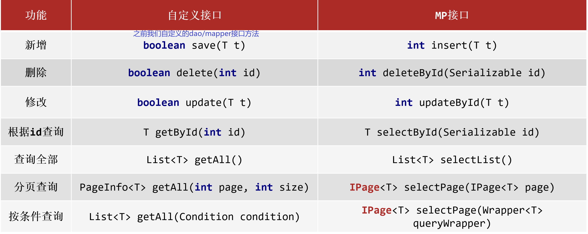
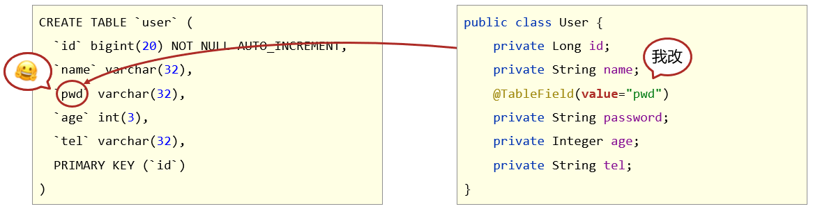
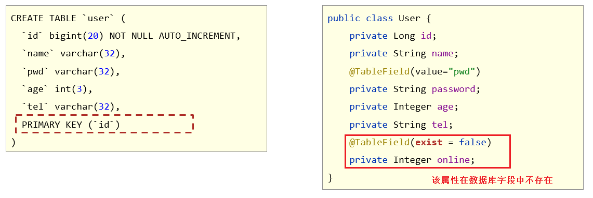
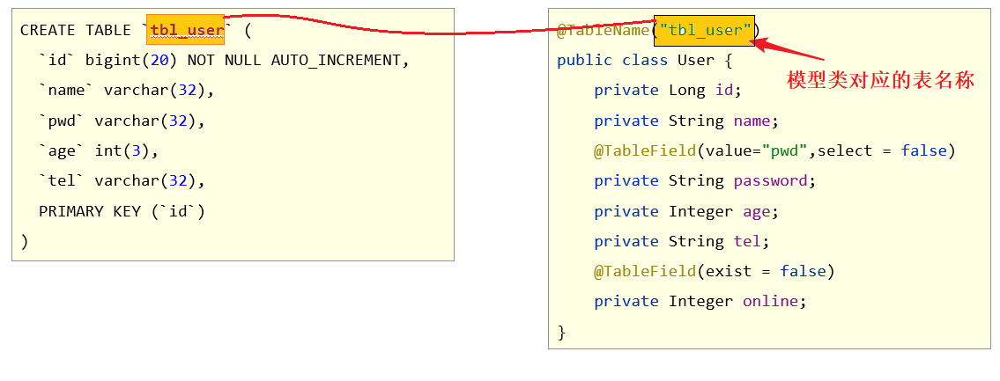
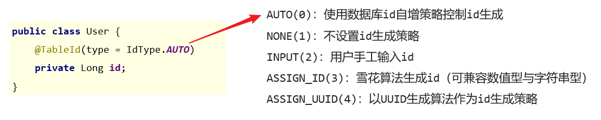
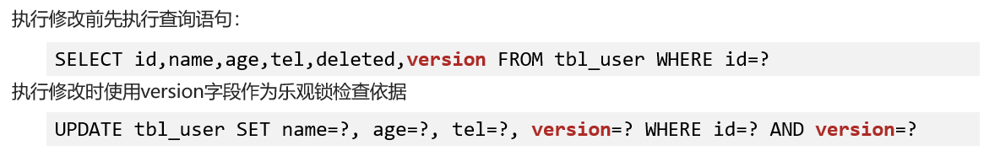

# starter依赖

```xml
<dependency>
    <groupId>com.baomidou</groupId>
    <artifactId>mybatis-plus-boot-starter</artifactId>
    <version>3.4.1</version>
</dependency>
```


# 使用方式

使用MP只需要导入上面的依赖即可，不需要引入Mybatis的依赖，因为MP和M是两个不同的模块。

**使用MP的方式跟使用MyBatis是一样的**：也是需要定义Mapper接口，然后在接口上添加**@Mapper注解**，或者在启动类上添加 **@MapperScan注解**。Mapper.xml文件和Mapper接口同包的用法也是一样，只不过在两者不同包时在application.yml文件中的配置内容不同了：

```yml
mybatis-plus:	#使用的是 mybatis-plus了
  mapper-locations: classpath:mappers/*.xml
```

**另外，MP还提供了更多功能，相当于是MyBatis的补充**


# Lombok

**Lombok**，一个<u>Java类库</u>，提供了一组注解，只要在POJO类上添加注解，就可以实现给POJO类添加 getter、setter、toString等方法，不再需要繁琐的手动编写。

## Maven依赖

```xml
<dependency>
    <groupId>org.projectlombok</groupId>
    <artifactId>lombok</artifactId>
    <version>1.18.12</version>
</dependency>
```


## 常用注解

生成getter和setter方法：**@Getter、@Setter**

生成toString方法：**@ToString**

生成equals和hashcode方法：**@EqualsAndHashCode**

生成空参构造： **@NoArgsConstructor**

生成全参构造： **@AllArgsConstructor**

生成RequiredArgs构造方法：**@RequiredArgsConstructor** （Required arguments are **final fields** and **fields with constraints such as @NonNull**）


**最常用的就是 <u>@Data</u>** ：相当于同时添加 **@Getter @Setter @RequiredArgsConstructor @ToString @EqualsAndHashCode**。


lombok还给我们提供了builder的方式创建对象,好处就是可以链式编程：**@Builder**

```java
@Data
public class User {
    private Integer id;
    private String name;
    private Integer age;
}
```

**@Slf4j** 注解在类上，就可以在类中直接使用 `log.info("msg")` 来记录日志。


# BaseMapper\<T\>

```java
@Mapper
public interface UserMapper extends BaseMapper<User> {
    //可以使用mapper.xml文件
    List<User> selectAll();
    
    //可以使用注解
    @Select("select * from tb_user where id = #{id}")
    User selectById(int id);
}
```

T 为数据库表所对应的实体类的类型。实体类的名称应该和数据库中的表名一致，并且实体类中的属性名也应该和数据库中的列名一致，如果不一致，就应该在实体类中使用注解指名它所映射的数据库名，这些注解后文会说。

让原来的Mapper接口继承了 BaseMapper，就给它增加了许多新功能，这些新功能不再需要手动写SQL，只需要调用BaseMapper中的方法即可获得和原来写SQL一样的效果。


# 基本CRUD方法



上表中右边的就是BaseMapper提供的方法。


**selectOne**

```java
@Test
void testGetOne() {
    QueryWrapper<User> queryWrapper = new QueryWrapper<>();
    queryWrapper.eq("id",16);

    User user = userMapper.selectOne(queryWrapper);	//传入Wrapper对象，条件必须保证最多只有一行能查到，否则会报错。
    System.out.println(user);
}
```

**selectById**

```java
@Test
void testGetById() {
    User user = userMapper.selectById(15);
    System.out.println(user);
}
```

**selectList**

```java
@Test
void testGetAll() {
    List<User> userList = userMapper.selectList(null);	//这里需要传递一个Wapper对象，Wapper对象用于设置条件查询的条件。
    System.out.println(userList);
}
```

**updateById**

```java
@Test
void testUpdate() {
    User user = new User();
    user.setId(15);
    user.setName("Tom888");
    userMapper.updateById(user);		//传递一个实体类对象
}
```

**deleteById**

```java
@Test
void testDelete() {
    userMapper.deleteById(15);
}
```

**insert**

```java
@Test
void testSave() {
    User user = new User();
    user.setName("黑马程序员");
    user.setAge(12);
    userMapper.insert(user);	//这里需要配置特定的主键生成策略，后面会说
}
```

**批量删除deleteBatchIds**

```java
List<Long> list = new ArrayList<>();
list.add(1402551342481838081L);
list.add(1402553134049501186L);
list.add(1402553619611430913L);
//删除指定多条数据
userMapper.deleteBatchIds(list);
```

**查询多个id对应的记录selectBatchIds**

```java
List<Long> list = new ArrayList<>();
list.add(1L);
list.add(3L);
list.add(4L);
//查询指定多条数据
userDao.selectBatchIds(list);
```


# MyBatisPlus分页功能

## 分页拦截器

要使用MyBatis分页查询，设置分页拦截器作为Spring管理的bean

```java
@Configuration
public class MybatisPlusConfig {
    
    @Bean
    public MybatisPlusInterceptor mybatisPlusInterceptor(){
        //1 创建MybatisPlusInterceptor拦截器对象
        MybatisPlusInterceptor mpInterceptor=new MybatisPlusInterceptor();
        //2 添加分页拦截器
        mpInterceptor.addInnerInterceptor(new PaginationInnerInterceptor());
        return mpInterceptor;
    }
}
```


## selectPage

```java
<E extends IPage<T>> E selectPage(E page, Wrapper<T> queryWrapper);
```

使用BaseMapper的这个方法来执行分页查询:

第一个参数：实现了**IPage\<T**\>接口 的对象 。（T是实体类）

第二个参数：条件查询的条件Wrapper对象。

返回值：返回参数值中的page对象。


用法：

```java
@Test
public void testPage(){
    int currentPage = 0;
    int pageSize = 1;

    //1.创建Page对象
    //Page类实现了 IPage接口。参数：当前页号（从1开始）  每页大小。
    Page<User> page = new Page<>(currentPage,pageSize);

    //2.执行分页查询
    userMapper.selectPage(page,null);   //省略了条件，查询所有

    //3.使用Page对象中的方法获取分页查询结果
    System.out.println("当前页码值："+page.getCurrent());
    System.out.println("每页显示数："+page.getSize());
    System.out.println("总页数："+page.getPages());
    System.out.println("总行数："+page.getTotal());
    
    List<User> records = page.getRecords();
    System.out.println("当前页数据："+ records);
}
```


# Wrapper

## 基本使用方式

MyBatisPlus将书写复杂的SQL查询条件进行了封装，**Wapper接口** 就封装了条件查询的 条件。

Wapper接口有两个实现类：**QueryWrapper类** 和 **LambdaQueryWrapper类**。

两者效果都是一致的，只不过语法不同，前者直接写列名，后者使用实体类的方法引用（Lambda表达式）

他们都是泛型类，泛型参数为实体类类名。

eg：

**QueryWrapper**

```java
//方式一：按条件查询
QueryWrapper<User> qw=new QueryWrapper<>();
qw.lt("age", 18);	// 相当于 where age < 18

List<User> userList = userDao.selectList(qw);//条件查询，传入Wrapper对象
System.out.println(userList);
```

**LambdaQueryWrapper（推荐使用这种方式）**

```java
//lambda格式按条件查询
LambdaQueryWrapper<User> lqw = new LambdaQueryWrapper<User>();
lqw.lt(User::getAge, 10);	// 相当于 where age < 18

List<User> userList = userDao.selectList(lqw);	//条件查询，传入Wrapper对象
System.out.println(userList);
```


**组合条件**

1. 并且关系（and）

   ```java
   
   LambdaQueryWrapper<User> lqw = new LambdaQueryWrapper<User>();
   //并且关系，指定多个条件即可。  where	age > 10 and age < 30
   lqw.lt(User::getAge, 30);
   lqw.gt(User::getAge, 10);
   
   也可使用链式编程
   lqw.lt(User::getAge, 30).gt(User::getAge, 10);
   ```

2. 或者关系（or）

   ```java
   LambdaQueryWrapper<User> lqw = new LambdaQueryWrapper<User>();
   //或者关系：小于10岁或者大于30岁 
   lqw.lt(User::getAge, 10).or().gt(User::getAge, 30);
   ```


**条件参数控制**

```java
Integer minAge=10;  //将来会作为方法的参数传过来，此处简化成直接定义变量了
Integer maxAge=null; 

LambdaQueryWrapper<User> lqw = new LambdaQueryWrapper<User>();

//参数1：如果表达式为true，那么查询才使用该条件
//也就是说 如果minAge不为null，最终的SQL语句才会有 where age > 10
lqw.gt(minAge!=null,User::getAge, minAge);
lqw.lt(maxAge!=null,User::getAge, maxAge);
List<User> userList = userDao.selectList(lqw);
userList.forEach(System.out::println);
```

也可以使用链式编程：

```java
lqw.gt(minAge!=null,User::getAge, minAge)
   .lt(maxAge!=null,User::getAge, maxAge);
```


**查询结果包含实体类中部分属性**

selectList等方法，默认会查询表中的所有字段。

如果我们指向查询部分字段封装到实体类中：

```java
LambdaQueryWrapper<User> lqw = new LambdaQueryWrapper<User>();
lqw.select(User::getId, User::getName, User::getAge);
//或者
QueryWrapper<User> lqw = new QueryWrapper<User>();
lqw.select("id", "name", "age", "tel");	//列名


List<User> userList = userMapper.selectList(lqw);
System.out.println(userList);
```


**查询结果包含实体类中未定义的属性**

如果SQL的查询结果的列名包含实体类中未定义的属性，例如查询聚集函数的结果：

使用 BaseMapper的**selectMaps方法**：

```java
//QueryWrapper的**select方法** 还可以指定聚集函数等：
QueryWrapper<User> lqw = new QueryWrapper<User>();
lqw.select("count(*) as count, tel");
lqw.groupBy("tel");	//设置groupBy

//获取到的是一个list集合，list里面的元素又是一个map集合，这个map集合就表示
//列的名称 ， 列的值 。 每个map集合表示一行数据。
List<Map<String, Object>> userList = userMapper.selectMaps(lqw);
System.out.println(userList);
//[{count=7, tel=12345678910}, {count=2, tel=154577744}]
```


**设置更新的字段和值**

```

```


## 基本查询条件方法

Wrapper中有很多指定条件的方法，他们都对应着SQL语句。

- 相等条件（**eq方法**）

```
LambdaQueryWrapper<User> lqw = new LambdaQueryWrapper<User>();
lqw.eq(User::getName, "Jerry").eq(User::getPassword, "jerry");
```

- 区间条件（ **lt le gt ge eq between 方法**）

```java
//范围查询 lt le gt ge eq between
lqw.between(User::getAge, 10, 30);
```

- like条件（ **like likeLeft likeRight方法** ）

​		likeLeft 是指 `%` 在左边

​		likeRight 是指 `% `在右边

​		like是指 `% ` 左右两边均有

```java
lqw.likeLeft(User::getName, "J");		//相当于 select * from user where name like %J
```

- 分组 排序 聚集函数 (**groupBy  orderBy和 select 方法**)

```java
QueryWrapper<User> qw = new QueryWrapper<User>();
qw.select("gender","count(*) as nums");
qw.groupBy("gender");
List<Map<String, Object>> maps = userDao.selectMaps(qw);
```


## UpdateWrapper

MP还提供了 **UpdateWrapper类** 和 **LambdaUpdateWrapper类** 用于更新操作。

使用 他们的 set方法，可以设置更新的字段和值

```java
UpdateWrapper<User> wrapper = new UpdateWrapper();
//相当于 UPDATE tb_user SET age=888 WHERE id = 1548669057830752258
wrapper.set("age",888);
wrapper.eq("id",1548669057830752258L);
userMapper.update(null,wrapper);    //第一个参数为实体类对象，封装需要更新的字段和值，这里我们不指定它
```


# 实体类注解

<u>表的列名</u>和<u>实体类的属性名</u>不对应或者<u>表名</u>与<u>实体类名</u>不一致，就需要使用一些注解来指定映射关系。


## @TableField

**1.表字段名与实体类属性名不一致**

在模型类属性上方，使用**@TableField**属性注解，通过**value属性**，设置当前属性对应的<u>数据库表</u>中的字段名。



**2.实体类中添加了数据库中未定义的属性**

如果实体类中有表中未定义的属性，使用 **exist属性** 设置属性在数据库表字段中是否存在，**默认为true**。<u>此属性无法与value合并使用。</u>



如果不加该注解，就会报错。

**3.希望在查询时某些字段不封装到实体类中**

例如，有时候查询数据库中的表，表中含有密码等敏感信息，希望查询时能不查这些字段。

在模型类属性上方，通过**select属性**：设置该属性是否参与查询，默认为true。

此属性与select方法配置不冲突，即使通过 QueryWrapper的select方法指定了要查该列，实际上也不会封装到实体类中（SQL语句中会有该列，但是实体类中该属性为null）。


## @TableName

在<u>**模型类**</u>上方，使用**@TableName**注解，通过**value**属性，设置当前类对应的数据库表名称。



**注：**

MP**默认情况**下开启了如下配置：

```yml
mybatis-plus:
  configuration:
    map-underscore-to-camel-case: true #默认就为true。
```

数据库中的表名、列名 与  Java中的类名、属性名映射关系为，下划线与驼峰命名法映射：

tb_user表名 <----->   TbUser 类名

user_name列名   <-----> userName 属性名

在生成SQL语句和封装实体类对象的时候，都会进行上述的互相转化。


## @TableId

注解在实体类的属性上，表示该属性对应数据库表中的主键，可以通过 **value属性** 设置表中的列名。

还可以通过 **type属性** 设置主键属性的生成策略，这个主要用于在调用 BaseMapper的 **insert方法**时，如何设置主键的值。

### id生成策略



- **AUTO:**  生成 insert SQL语句时，不会指定主键所在的列，按照数据库的id生成策略为其生成一个主键值。

  底层产生的SQL语句如下

  ```sql
  INSERT INTO tb_user ( name, age ) VALUES ( ?, ? )
  ```

- **NONE**：SQL语句同上

- **INPUT**:  SQL语句会加上主键字段，所以可以在实体类中指定id的值：

  ```sql
  INSERT INTO tb_user ( id, name, age ) VALUES ( ?, ?, ? )
  ```

  ```java
  TbUser user = new TbUser();
  user.setName("黑马程序员");
  user.setId(666);
  user.setAge(12);
  userMapper.insert(user);
  System.out.println(user.getId());	//666
  ```

- **ASSIGN_ID 和 ASSIGN_UUID** ：SQL语句会加上 主键字段。但是主键的值是由MP帮我们自动生成并且填写到参数中。这种方式必须要求主键的类型是Long或者字符串类型。


## @TableLogic（逻辑删除）

标记该属性为逻辑删除属性。

逻辑删除：为数据库表设置 是否删除 状态字段，然后再对应的实体类的对应属性上添加该注解，这样调用BaseMapper中的delete方法时**不会删除数据库中的数据，只是改变这个状态字段的值。**


设置了逻辑删除属性的实体类在执行delete相关方法时，**底层的SQL语句会变成 update**

```sql
UPDATE tb_user SET deleted=1 WHERE id=? AND deleted=0
```

如果加了逻辑删除字段，查询数据时也会自动带上 `deleted=0` 的条件。


**①：数据库表中添加逻辑删除标记字段**

 

**②：实体类中添加对应属性，并添加@TableLogic注解**

```java
@Data
public class User {
    private Long id;
    
    //逻辑删除字段，标记当前记录是否被删除
   	//value属性表示没被逻辑删除的值，deval属性表示被逻辑删除后该字段的值。
    @TableLogic(value = "0" ,delval = "1")
    private Integer deleted;    
}
```

也可以在yml文件中全局配置逻辑删除字面值，这样就不用在实体类中添加 @TableLogic注解了

```yml
mybatis-plus:
  global-config:
    db-config:
      table-prefix: tbl_
      # 逻辑删除字段名,值 应该与 ==实体类中的属性名== 一致。
      logic-delete-field: deleted
      # 逻辑删除字面值：未删除为0
      logic-not-delete-value: 0
      # 逻辑删除字面值：删除为1
      logic-delete-value: 1
```


## @Version（乐观锁）

支持并发访问时的CAS机制。

**①数据库表中添加锁标记字段**


**②：实体类中添加对应字段，并设定该字段为 乐观锁 标记字段（@Version注解）**

```java
@Data
public class User {
	private Long id;
	
    @Version
    private Integer version;
}
```

**③：配置乐观锁拦截器实现锁机制对应的动态SQL语句拼装**

```java
@Configuration
public class MpConfig {
    @Bean
    public MybatisPlusInterceptor mpInterceptor() {
        //1.定义Mp拦截器
        MybatisPlusInterceptor mpInterceptor = new MybatisPlusInterceptor();

        //2.添加乐观锁拦截器
        mpInterceptor.addInnerInterceptor(new OptimisticLockerInnerInterceptor());
        
        return mpInterceptor;
    }
}
```

**④：使用乐观锁机制在修改前必须先获取到对应数据的verion方可正常进行**

```java
@Test
public void testUpdate() { 
    //1.先通过要修改的数据id将当前数据查询出来
    User user = userMapper.selectById(3L);
    //2.再进行更新
    user.setName("Jock888");
    userMapper.updateById(user);
}
```

原理：



两个version参数由MP自动计算，如果在本次更新操作期间，有其他线程更新了该行数据，那么就会导致该行中的version字段值和第二个version参数的值不一致，从而本次更新操作就会更新不了数据


## 字段自动填充@TableField

@TableField还有一个属性 **fill** ，用于字段的自动填充。

Mybatis Plus字段自动填充，也就是在**插入**或者**更新**的时候为指定字段赋予指定的值，使用它的好处就是可以统一对这些字段进行处理，避免了重复代码。

1）在实体类的属性上加入@TableField注解，指定fill属性（自动填充的策略）。

​	**FieldFill.INSERT**: **插入时**自动填充该属性值

​	**FieldFill.UPDATE**: **更新时**自动填充该属性值

​	**FieldFill.INSERT_UPDATE**: **插入/更新时**自动填充该属性值

```java
@Data
@NoArgsConstructor
public class User {
    省略了其他属性

    @TableField(fill=FieldFill.INSERT)
    private LocalDateTime createTime;

    @TableField(fill=FieldFill.INSERT_UPDATE)
    private LocalDateTime updateTime;
}
```

2）编写一个组件类实现 **MetaObjectHandler接口**，在此类中为需要自动填充的字段赋值。

```java
@Component
public class MyMetaObjectHandler implements MetaObjectHandler {
    //插入操作时自动填充
    @Override
    public void insertFill(MetaObject metaObject) {
        //使用 MetaObject的setValue方法指定自动填充字段的名和需要自动填充的值
        metaObject.setValue("createTime", LocalDateTime.now());
        metaObject.setValue("updateTime",LocalDateTime.now());
    }

    //更新操作时自动填充
    @Override
    public void updateFill(MetaObject metaObject) {
        metaObject.setValue("updateTime",LocalDateTime.now());
    }
}
```


# 常用配置项

MP在 application.yml 中的常用配置项有：

```yml
mybatis-plus:
  configuration:
    #把数据库中的下划线名称 跟 驼峰式命名相对应。默认就为true
    map-underscore-to-camel-case: true
    log-impl: org.apache.ibatis.logging.stdout.StdOutImpl #开启日志（可以查看到执行的SQL语句）。这个是输出到控制台。
  global-config:  #全局配置
    db-config:
      table-prefix: tb_   #它相当于给所有实体类都添加 `@TableName("tbl_" + 首字母小写的类名)` 这个注解。
      id-type: auto       #相当于在所有表对应的实体类的主键属性上边加上 `@TableId(type = )注解`            
      logic-delete-field: deleted	# 逻辑删除字段名,值 应该与 ==实体类中的属性名== 一致。     
      logic-not-delete-value: 0  # 逻辑删除字面值：未删除为0
      logic-delete-value: 1 # 逻辑删除字面值：删除为1
    banner: off   #日志中是否打印MyBatisPlus的Banner
  mapper-locations: classpath:mappers/*.xml     #mapper.xml文件的路径
  type-aliases-package: com.test.pojo   #类型别名的包
```


# IService\<T\>

为了简化web开发中service层的编写，MP还提供了 **IService接口** 和 及其实现类 **ServiceImpl** 。IService接口提供了很多写好的业务层方法，对dao层的Mapper接口进行了封装。

```java
1.service层的接口,IService的泛型为实体类
public interface UserService extends IService<User> {
}

2.service层的实现类
ServiceImpl的第一个泛型是继承了BaseMapper的Mapper接口，第二个泛型为实体类
@Service
public class UserServiceImpl extends ServiceImpl<UserMapper, User> implements UserService{

}

3.直接在controller层注入UserService对象，并使用它来进行基本的CRUD操作
User user = userService.getById(1548585545693929474L);
System.out.println(user);
```


# 代码生成器

见笔记。
