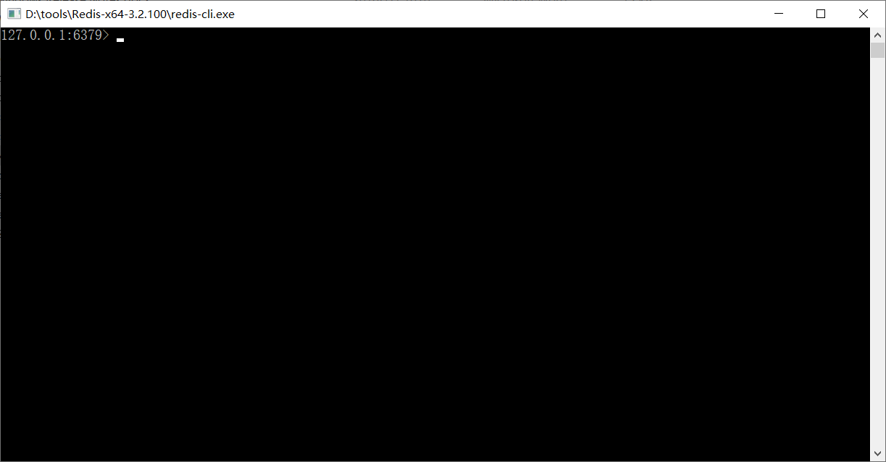
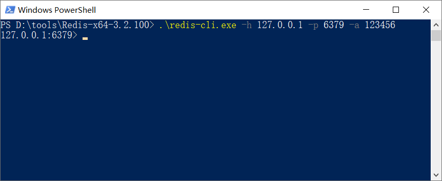
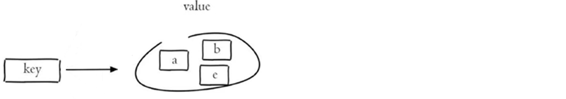

# Redis基础

## 一. 前言

### 1. 什么是Redis

Redis是一个基于**内存**的key-value结构数据库。Redis 是互联网技术领域使用最为广泛的**存储中间件**，它是「**Re**mote **Di**ctionary **S**ervice」的首字母缩写，也就是「远程字典服务」。

- [ ] 基于**内存**存储，读写性能高

- [ ] 适合存储热点数据（热点商品、资讯、新闻）

- [ ] 企业应用广泛

### 2. 使用Redis能做什么

- 数据缓存
- 消息队列
- 注册中心
- 发布订阅


## 二. Redis入门

### 1. Redis简介

Redis is an open source (BSD licensed), in-memory data structure store, used as a database, cache, and message broker. 翻译为：Redis是一个开源的内存中的数据结构存储系统，它可以用作：数据库、缓存和消息中间件。

官网：[https://redis.io](https://redis.io/)

Redis是用C语言开发的一个开源的高性能键值对(key-value)数据库，官方提供的数据是可以达到100000+的QPS（每秒内查询次数）。它存储的value类型比较丰富，也被称为结构化的**NoSql数据库**。

**NoSql（Not Only SQL）**，不仅仅是SQL，泛指**非关系型数据库**。NoSql数据库并不是要取代关系型数据库，而是关系型数据库的补充。

**关系型数据库(RDBMS)**：

- Mysql
- Oracle
- DB2
- SQLServer

**非关系型数据库(NoSql)**：

- Redis
- Mongo db
- MemCached


### 2. Redis下载与安装

#### 2.1 Redis下载

Redis安装包分为windows版和Linux版：

- Windows版下载地址：https://github.com/microsoftarchive/redis/releases
- Linux版下载地址： https://download.redis.io/releases/ 

下载后得到下面安装包：


#### 2.2 Redis安装

**1）在Linux中安装Redis**

在Linux系统安装Redis步骤：

1. 将Redis安装包上传到Linux
2. 解压安装包，命令：`tar -zxvf redis-4.0.0.tar.gz -C /usr/local`
3. 安装Redis的依赖环境gcc，命令：`yum install gcc-c++`
4. 进入`/usr/local/redis-4.0.0`，进行编译，命令：`make`
5. 进入redis的src目录进行安装，命令：`make install`

**注：**4，5步也可以合起来：`make && make install`


安装后重点文件说明：

**/usr/local/redis-4.0.0/src/redis-server**：Redis服务启动脚本

**/usr/local/redis-4.0.0/src/redis-cli**：Redis客户端脚本

**/usr/local/redis-4.0.0/redis.conf**：Redis配置文件


**2）在Windows中安装Redis**

Redis的Windows版属于绿色软件，直接解压即可使用，解压后目录结构如下：


### 3. Redis服务启动与停止

**1）Linux系统中启动和停止Redis**

执行Redis服务启动脚本文件 **redis-server** （在 src目录下）：


通过启动日志可以看到，Redis默认端口号为 **6379**。

**Ctrl + C**停止Redis服务

通过**redis-cli**可以连接到本地的Redis服务，默认情况下不需要认证即可连接成功。

退出客户端可以输入**exit**或者**quit**命令。

**2）Windows系统中启动和停止Redis**

Windows系统中启动Redis，直接双击redis-server.exe即可启动Redis服务，redis服务默认端口号为**6379**


Ctrl + C停止Redis服务

双击redis-cli.exe即可启动Redis客户端，默认连接的是本地的Redis服务，而且不需要认证即可连接成功。



退出客户端可以输入exit或者quit命令。

### 4. Redis配置文件

前面我们已经启动了Redis服务，默认情况下Redis启动后是在前台运行，而且客户端不需要密码就可以连接到Redis服务。如果我们希望Redis服务启动后是在后台运行，同时希望客户端认证通过后才能连接到Redis服务，应该如果做呢？

此时就需要修改Redis的配置文件：

- Linux系统中Redis配置文件：**REDIS_HOME/redis.conf**
- Windows系统中Redis配置文件：**REDIS_HOME/redis.windows.conf**

REDIS_HOME表示redis的安装目录


**通过修改Redis配置文件可以进行如下配置：**

**1）**设置Redis服务后台运行

​	将配置文件中的 **daemonize** 配置项改为yes，默认值为no。

​	注意：Windows版的Redis不支持后台运行。

**2）**设置Redis服务密码

​	将配置文件中的 **# requirepass foobared** 配置项取消注释，默认为注释状态。**foobared为密码**，可以根据情况自己指定。

**3）**设置允许客户端远程连接Redis服务

​	Redis服务**默认只能客户端本地连接**，不允许客户端远程连接。将配置文件中的 **bind 127.0.0.1** 配置项注释掉。


**解释说明：**

Redis配置文件中 **#** 表示注释

Redis配置文件中的**配置项前面不能有空格，需要顶格写**

**daemonize**：用来指定redis是否要用守护线程的方式启动，设置成yes时，代表开启守护进程模式。在该模式下，redis会在后台运行

**requirepass**：设置Redis的连接密码

**bind**：如果指定了bind，则说明只允许来自指定网卡的Redis请求。如果没有指定，就说明可以接受来自任意一个网卡的Redis请求。


**注意**：修改配置文件后需要重启Redis服务配置才能生效，并且**启动Redis服务时需要显示的指定配置文件**：

1）Linux中启动Redis服务

~~~
# 进入Redis安装目录
cd /usr/local/redis-4.0.0
# 启动Redis服务，指定使用的配置文件
./src/redis-server ./redis.conf
~~~

2）Windows中启动Redis服务


客户端连接Redis服务需要执行如下命令：

`redis-cli -h 主机名 -p 端口号(默认6379)  -a 密码`

`redis-cli` 文件在 src目录下。


**注意：**

要记得先在linux系统中开放6379端口：

```shell
firewall-cmd --zone=public --add-port=6379/tcp --permanent
firewall-cmd --reload
```

windows客户端连接方式变为：



**解释说明：**

-h：指定连接的Redis服务的ip地址

-p：指定连接的Redis服务的端口号

-a：指定连接的Redis服务的密码


## 三. Redis数据类型

### 1. 介绍

Redis存储的是**key-value结构**的数据，其中**key是字符串类型**，value有5种常用的数据类型：

- 字符串 string
- 哈希 hash
- 列表 list
- 集合 set
- 有序集合 sorted set / zset

### 2. Redis 5种常用数据类型


**解释说明：**

字符串(string)：普通字符串，常用

哈希(hash)：适合存储对象

列表(list)：按照插入顺序排序，可以有重复元素

集合(set)：无序集合，没有重复元素

有序集合(sorted set / zset)：集合中每个元素关联一个分数（score），根据分数升序排序，没有重复元素

## 四. Redis常用命令

为了方便练习，使用windows的redis来进行操作。

### 1. 字符串string操作命令

Redis 中字符串类型常用命令：

- **SET** key value 					         设置指定key的值
- **GET** key                                        获取指定key的值
- **SETEX** key seconds value         设置指定key的值，并将 key 的过期时间设为 seconds 秒
- **SETNX** key value                        只有在 key不存在时设置 key 的值


### 2. 哈希hash操作命令

Redis hash 是一个string类型的 field 和 value 的映射表（散列表），hash特别适合用于存储对象，常用命令：

- **HSET** key field value             将哈希表 key 中的字段 field 的值设为 value
- **HGET** key field                       获取存储在哈希表中指定字段的值
- **HDEL** key field                       删除存储在哈希表中的指定字段
- **HKEYS** key                              获取哈希表中所有字段
- **HVALS** key                              获取哈希表中所有值
- **HGETALL** key                         获取在哈希表中指定 key 的所有字段和值


### 3. 列表list操作命令

Redis 列表是简单的字符串列表（实际上是**双端队列**），按照插入顺序排序，常用命令：

- **LPUSH** key value1 [value2]         将一个或多个值从<u>左边</u>插入
- **RPUSH** key value1 [value2]         将一个或多个值从<u>右边</u>插入
- **LRANGE** key start stop                获取列表指定范围内的元素（索引从0开始），**从左往右索引递增。**如果 stop = -1 ,则表示最后一个元素的索引。所以查看列表中所有数据的命令就是 `lrange key 0 -1`
- **RPOP** key                                       从右边移除一个元素
- **LPOP** key                                       从左边移除一个元素
- **LLEN** key                                        获取列表长度
- **BRPOP** key1 [key2 ] timeout       移出并获取列表的最右边的一个元素， 如果列表没有元素会阻塞列表直到等待超时或发现可弹出元素为止。同样还有 **BLPOP**


### 4. 集合set操作命令

Redis set 是string类型的无序集合。集合成员是唯一的，这就意味着集合中不能出现重复的数据，常用命令：

- **SADD** key member1 [member2]            向集合添加一个或多个成员
- **SMEMBERS** key                                         返回集合中的所有成员
- **SCARD** key                                                  获取集合的成员数
- **SINTER** key1 [key2]                                   返回给定所有集合的交集
- **SUNION** key1 [key2]                                 返回所有给定集合的并集
- **SDIFF** key1 [key2]                                      返回给定所有集合的差集
- **SREM** key member1 [member2]            移除集合中一个或多个成员



### 5. 有序集合sorted set操作命令

Redis sorted set 有序集合是 string 类型元素的集合，且不允许重复的成员。每个元素都会关联一个double类型的分数(score) 。redis正是通过分数来为集合中的成员进行从小到大排序。有序集合的成员是唯一的，但分数却可以重复。

常用命令：

- **ZADD** key score1 member1 [score2 member2]     向有序集合添加一个或多个成员，或者更新已存在成员的 分数
- **ZRANGE** key start stop [WITHSCORES]                     通过索引区间返回有序集合中指定区间内的成员
- **ZINCRBY** key increment member                              有序集合中对指定成员的分数加上增量 increment
- **ZREM** key member [member ...]                                移除有序集合中的一个或多个成员


### 6. 通用命令

Redis中的通用命令，主要是针对key进行操作的相关命令：

- **KEYS** pattern  查找所有符合给定模式( pattern)的 key 
- **EXISTS** key  检查给定 key 是否存在
- **TYPE** key  返回 key 所储存的值的类型
- **TTL** key  返回给定 key 的剩余生存时间(TTL, time to live)，以秒为单位
- **DEL** key  该命令用于在 key 存在时删除 key

## 五. 在Java中操作Redis

### 1. 介绍

前面我们讲解了Redis的常用命令，这些命令是我们操作Redis的基础，那么我们在java程序中应该如何操作Redis呢？这就需要使用Redis的Java客户端，就如同我们使用JDBC操作MySQL数据库一样。

Redis 的 Java 客户端很多，官方推荐的有三种：

- **Jedis**
- Lettuce
- Redisson

Spring 对 Redis 客户端进行了整合，提供了 **Spring Data Redis**，在Spring Boot项目中还提供了对应的Starter，即 **spring-boot-starter-data-redis**。

### 2. Jedis

Jedis 是 Redis 的 Java 版本的客户端实现。

maven坐标：

~~~xml
<dependency>
	<groupId>redis.clients</groupId>
	<artifactId>jedis</artifactId>
	<version>2.8.0</version>
</dependency>
~~~

使用 Jedis 操作 Redis 的步骤：

1. 获取连接
2. 执行操作
3. 关闭连接

示例代码：

~~~java
package com.itheima.test;

import org.junit.Test;
import redis.clients.jedis.Jedis;
import java.util.Set;

/**
 * 使用Jedis操作Redis
 */
public class JedisTest {

    @Test
    public void testRedis(){
        //1 获取连接
        Jedis jedis = new Jedis("localhost",6379);
        
        //2 执行具体的操作
        jedis.set("username","xiaoming");

        String value = jedis.get("username");
        System.out.println(value);

        //jedis.del("username");

        jedis.hset("myhash","addr","bj");
        String hValue = jedis.hget("myhash", "addr");
        System.out.println(hValue);

        Set<String> keys = jedis.keys("*");
        for (String key : keys) {
            System.out.println(key);
        }

        //3 关闭连接
        jedis.close();
    }
}
~~~

### 3. Spring Data Redis

#### 3.1 介绍

Spring Data Redis 是 Spring 的一部分，提供了在 Spring 应用中通过简单的配置就可以访问 Redis 服务，对 Redis 底层开发包进行了高度封装。在 Spring 项目中，可以使用Spring Data Redis来简化 Redis 操作。

网址：https://spring.io/projects/spring-data-redis


maven坐标：

~~~xml
<dependency>
	<groupId>org.springframework.data</groupId>
	<artifactId>spring-data-redis</artifactId>
	<version>2.4.8</version>
</dependency>
~~~

Spring Boot提供了对应的Starter，maven坐标：

~~~xml
<dependency>
	<groupId>org.springframework.boot</groupId>
	<artifactId>spring-boot-starter-data-redis</artifactId>
</dependency>
~~~

Spring Data Redis中提供了一个高度封装的类：**RedisTemplate**，针对 Jedis 客户端中大量api进行了归类封装,将同一类型操作封装为**Operations接口**，具体分类如下：

- ValueOperations：简单K-V操作
- SetOperations：set类型数据操作
- ZSetOperations：zset类型数据操作
- HashOperations：针对hash类型的数据操作
- ListOperations：针对list类型的数据操作

#### 3.2 使用方式

##### 3.2.1 环境搭建

第一步：创建maven项目springdataredis_demo，配置pom.xml文件

~~~xml
<?xml version="1.0" encoding="UTF-8"?>
<project xmlns="http://maven.apache.org/POM/4.0.0"
         xmlns:xsi="http://www.w3.org/2001/XMLSchema-instance"
         xsi:schemaLocation="http://maven.apache.org/POM/4.0.0 http://maven.apache.org/xsd/maven-4.0.0.xsd">
    <modelVersion>4.0.0</modelVersion>
    <parent>
        <groupId>org.springframework.boot</groupId>
        <artifactId>spring-boot-starter-parent</artifactId>
        <version>2.4.5</version>
        <relativePath/>
    </parent>
    <groupId>com.itheima</groupId>
    <artifactId>springdataredis_demo</artifactId>
    <version>1.0-SNAPSHOT</version>
    <properties>
        <java.version>1.8</java.version>
    </properties>
    <dependencies>
        <dependency>
            <groupId>org.springframework.boot</groupId>
            <artifactId>spring-boot-starter-test</artifactId>
            <scope>test</scope>
        </dependency>
        <dependency>
            <groupId>junit</groupId>
            <artifactId>junit</artifactId>
        </dependency>
        <dependency>
            <groupId>org.springframework.boot</groupId>
            <artifactId>spring-boot-starter-data-redis</artifactId>
        </dependency>
    </dependencies>
    <build>
        <plugins>
            <plugin>
                <groupId>org.springframework.boot</groupId>
                <artifactId>spring-boot-maven-plugin</artifactId>
                <version>2.4.5</version>
            </plugin>
        </plugins>
    </build>
</project>
~~~

第二步：编写启动类

~~~java
package com.itheima;

import org.springframework.boot.SpringApplication;
import org.springframework.boot.autoconfigure.SpringBootApplication;

@SpringBootApplication
public class App {

    public static void main(String[] args) {
        SpringApplication.run(App.class,args);
    }

}
~~~

第三步：配置application.yml

~~~yaml
spring:
  application:
    name: springdataredis_demo
  #Redis相关配置
  redis:
    host: localhost
    port: 6379
    #password: 123456
    database: 0 #操作的是0号数据库
    jedis:
      #Redis连接池配置
      pool:
        max-active: 8 #最大连接数
        max-wait: 1ms #连接池最大阻塞等待时间
        max-idle: 4 #连接池中的最大空闲连接
        min-idle: 0 #连接池中的最小空闲连接
~~~

解释说明：

**spring.redis.database**：指定使用Redis的哪个数据库(默认是0号数据库)，Redis服务启动后默认有16个数据库，编号分别是从0到15。在redis客户端中输入命令 `select [number]` 来切换数据库

可以通过修改Redis配置文件来指定数据库的数量。


###### 乱码配置

第四步：提供配置类

~~~java
package com.itheima.config;

import org.springframework.cache.annotation.CachingConfigurerSupport;
import org.springframework.context.annotation.Bean;
import org.springframework.context.annotation.Configuration;
import org.springframework.data.redis.connection.RedisConnectionFactory;
import org.springframework.data.redis.core.RedisTemplate;
import org.springframework.data.redis.serializer.StringRedisSerializer;

/**
 * Redis配置类
 */
@Configuration
public class RedisConfig extends CachingConfigurerSupport {

    @Bean
    public RedisTemplate<Object, Object> redisTemplate(RedisConnectionFactory connectionFactory) {

        RedisTemplate<Object, Object> redisTemplate = new RedisTemplate<>();

        //默认的Key序列化器为：JdkSerializationRedisSerializer
        redisTemplate.setKeySerializer(new StringRedisSerializer());
        redisTemplate.setHashKeySerializer(new StringRedisSerializer());

        redisTemplate.setConnectionFactory(connectionFactory);

        return redisTemplate;
    }

}
~~~

**解释说明：**

**注：** SpringBoot帮我们自动配置了两种类型的RedisTemplate：

**RedisTemplate<Object,Object>** 和 **RedisTemplate<String,String>** 但是RedisTemplate<Object,Object>的key序列化器为JdkSerializationRedisSerializer，导致我们存到Redis中后的数据和原始数据有差别，所以需要进行上述配置。如果不进行默认配置，那么在命令行进行获取的时候就会出现乱码：

```shell
127.0.0.1:6379> keys *
1) "\xac\xed\x00\x05t\x00\x04name"
```

上面配置类不是必须的。如果只是在Java代码中设置和读取值，序列化和反序列化会自动完成，不会出现任何问题，但是如果通过命令行或者工具来查看Redis中的key的时候，出现key为乱码就不知道具体存的是什么。

上述配置中我们只改了key的序列化器，当我们获取**值**的时候，也还是会出现乱码：

```shell
127.0.0.1:6379> keys *
1) "\xac\xed\x00\x05t\x00\x04name"
2) "name"
127.0.0.1:6379> get name
"\xac\xed\x00\x05t\x00\bzhangsan"
```

但是值出现乱码不需要处理，因为如果我们要存Java对象的话，Java对象序列化后也是乱码。

 RedisTemplate<String,String> 类型的Key和Value的序列化器是String类型的，所以不会出现乱码，但是对于存对象类型的值不方便。

综上，如果希望在存对象类型的值时让key不出现乱码，就可以添加上述配置类，如果不需要存对象类型的值，则可以使用 String泛型的 RedisTemplate。


 

第五步：提供测试类

~~~java
package com.itheima.test;

import org.junit.runner.RunWith;
import org.springframework.beans.factory.annotation.Autowired;
import org.springframework.boot.test.context.SpringBootTest;
import org.springframework.test.context.junit4.SpringRunner;

@SpringBootTest
@RunWith(SpringRunner.class)
public class SpringDataRedisTest {

    @Autowired
    private RedisTemplate redisTemplate;
    
}
~~~

##### 3.2.2 操作字符串类型数据

~~~java
/**
 * 操作String类型数据
*/
@Test
public void testString(){
    	//通过 ValueOperations接口来操作 String类型数据
        ValueOperations valueOpr = redisTemplate.opsForValue();

        //存值	SET key value
        valueOpr.set("city","beijing");

        //取值	GET key
        String cityVal =(String) valueOpr.get("city");
        System.out.println(cityVal);

        //存值，同时设置过期时间	SETEX key seconds value
        valueOpr.set("key1","value1",10l, TimeUnit.SECONDS);

        //存值，如果存在则不执行任何操作	SETNX key value
        Boolean aBoolean = valueOpr.setIfAbsent("city1234", "nanjing");
        System.out.println(aBoolean);
}
~~~


##### 3.2.3 操作哈希类型数据

~~~java
/**
 * 操作Hash类型数据
*/
@Test
public void testHash(){
    //通过 HashOperations 接口来操作 Hash类型数据
    HashOperations hashOperations = redisTemplate.opsForHash();

    //存值	HSET key field value
    hashOperations.put("002","name","xiaoming");
    hashOperations.put("002","age","20");
    hashOperations.put("002","address","bj");

    //取值	HGET key field
    String age = (String) hashOperations.get("002", "age");
    System.out.println(age);

    //获得hash结构中的所有字段	HEKYS key
    Set keys = hashOperations.keys("002");
    for (Object key : keys) {
        System.out.println(key);
    }

    //获得hash结构中的所有值		HVALS key
    List values = hashOperations.values("002");
    for (Object value : values) {
        System.out.println(value);
    }
}
~~~


##### 3.2.4 操作列表类型数据

~~~java
/**
 * 操作List类型的数据
*/
@Test
public void testList(){
    //通过 ListOperations 接口来操作 Hash类型数据
    ListOperations listOperations = redisTemplate.opsForList();

    //存值	LPUSH key value1 [value2]
    listOperations.leftPush("mylist","a");
    listOperations.leftPushAll("mylist","b","c","d");

    //范围取值	LRANGE key start stop
    List<String> mylist = listOperations.range("mylist", 0, -1);
    for (String value : mylist) {
        System.out.println(value);
    }

    //获得列表长度 LLEN key
    Long size = listOperations.size("mylist");
    int lSize = size.intValue();
    for (int i = 0; i < lSize; i++) {
        //出队列	RPOP key
        String element = (String) listOperations.rightPop("mylist");
        System.out.println(element);
    }
}
~~~


##### 3.2.5 操作集合类型数据

~~~java
/**
 * 操作Set类型的数据
*/
@Test
public void testSet(){
    //通过 SetOperations 接口来操作 Hash类型数据
    SetOperations setOperations = redisTemplate.opsForSet();

    //存值	SADD key member1 [member2] 
    setOperations.add("myset","a","b","c","a");

    //取值	SMEMBERS key
    Set<String> myset = setOperations.members("myset");
    for (String o : myset) {
        System.out.println(o);
    }

    //删除成员	SREM key member1 [member2] 
    setOperations.remove("myset","a","b");
}
~~~


##### 3.2.6 操作有序集合类型数据

~~~java
/**
 * 操作ZSet类型的数据
*/
@Test
public void testZset(){
    //通过 ZSetOperations 接口来操作 Hash类型数据
    ZSetOperations zSetOperations = redisTemplate.opsForZSet();

    //存值	ZADD key score1 member1 (score2 member2)
    zSetOperations.add("myZset","a",10.0);
    zSetOperations.add("myZset","b",11.0);
    zSetOperations.add("myZset","c",12.0);
    zSetOperations.add("myZset","a",13.0);

    //取值	ZRANGE key start stop (WITHSCORES)
    Set<String> myZset = zSetOperations.range("myZset", 0, -1);
    for (String s : myZset) {
        System.out.println(s);
    }

    //修改分数	ZINCRBY key increment member
    zSetOperations.incrementScore("myZset","b",20.0);

    //取值
    myZset = zSetOperations.range("myZset", 0, -1);
    for (String s : myZset) {
        System.out.println(s);
    }

    //删除成员	ZREM key member [member ...] 
    zSetOperations.remove("myZset","a","b");

    //取值
    myZset = zSetOperations.range("myZset", 0, -1);
    for (String s : myZset) {
        System.out.println(s);
    }
}
~~~


##### 3.2.7 通用操作

~~~java
/**
 * 通用操作，针对不同的数据类型都可以操作
*/
@Test
public void testCommon(){
    //获取Redis中所有的key	 KEYS pattern
    Set<String> keys = redisTemplate.keys("*");
    for (String key : keys) {
        System.out.println(key);
    }

    //判断某个key是否存在		EXISTS key
    Boolean itcast = redisTemplate.hasKey("itcast");
    System.out.println(itcast);

    //删除指定key			   DEL key
    redisTemplate.delete("myZset");

    //获取指定key对应的value的数据类型	TYPE key 
    DataType dataType = redisTemplate.type("myset");
    System.out.println(dataType.name());

}
~~~


## 六. SpringCache

### 1. 介绍

**Spring Cache**是一个框架，实现了**基于注解**的缓存功能，只需要简单地加一个注解，就能实现缓存功能，大大简化我们在业务中操作缓存的代码。

Spring Cache只是提供了一层抽象，底层可以切换不同的cache实现。具体就是通过**CacheManager**接口来统一不同的缓存技术。**CacheManager**是Spring提供的各种缓存技术抽象接口。


针对不同的缓存技术需要实现不同的**CacheManager**：

| **CacheManager**    | **描述**                               |
| ------------------- | -------------------------------------- |
| EhCacheCacheManager | 使用**EhCache**作为缓存技术            |
| GuavaCacheManager   | 使用Google的**GuavaCache**作为缓存技术 |
| RedisCacheManager   | 使用**Redis**作为缓存技术              |


### 2. 注解

在SpringCache中提供了很多缓存操作的注解，常见的是以下的几个：

| **注解**           | **说明**                                                     |
| ------------------ | ------------------------------------------------------------ |
| **@EnableCaching** | 一般放在**启动类**上。开启缓存注解功能                       |
| **@Cacheable**     | 一般放在**方法**上。在方法执行前spring先查看缓存中是否有数据，如果有数据，则直接返回缓存数据；若没有数据，调用方法并将方法返回值放到缓存中 |
| **@CachePut**      | 一般放在**方法**上。将方法的返回值放到缓存中                 |
| **@CacheEvict**    | 一般放在**方法**上。将一条或多条数据从缓存中删除             |


在spring boot项目中，使用缓存技术只需在项目中导入相关缓存技术的依赖包，并在**启动类**上使用**@EnableCaching**开启缓存支持即可。

例如，使用Redis作为缓存技术，只需要导入**Spring data Redis**的maven坐标即可。


### 3. 入门程序

接下来，我们将通过一个入门案例来演示一下SpringCache的常见用法。 上面我们提到，SpringCache可以集成不同的缓存技术，如Redis、Ehcache甚至我们可以使用Map来缓存数据， 接下来我们在演示的时候，就先通过一个Map来缓存数据，最后我们再换成Redis来缓存。


#### 3.1 环境准备

**1). 数据库准备**

将今天资料中的SQL脚本直接导入数据库中。

 


**2). 导入基础工程**

基础环境的代码，在我们今天的资料中已经准备好了， 大家只需要将这个工程导入进来就可以了。导入进来的工程结构如下： 

 

由于SpringCache的基本功能是**Spring核心(spring-context)**中提供的，所以目前我们进行简单的SpringCache测试，是可以不用额外引入其他依赖的。


**3). 注入CacheManager**

我们可以在UserController注入一个**CacheManager**，在Debug时，我们可以通过CacheManager跟踪缓存中数据的变化。

 


我们可以看到CacheManager是一个接口，默认的实现有以下几种 ；

 

而在上述的这几个实现中，默认使用的是 **ConcurrentMapCacheManager**。稍后我们可以通过断点的形式跟踪缓存数据的变化。


**4). 引导类上加@EnableCaching**

在引导类上加该注解，就代表当前项目开启缓存注解功能。

 


#### 3.2 @CachePut注解

**@CachePut** 说明： 

​	作用: 将方法返回值，放入缓存

​	**value:** 缓存的名称, 每个缓存名称下面可以有很多key

​	**key**: 缓存的key  ----------> 支持Spring的表达式语言SPEL语法


**1). 在save方法上加注解@CachePut**

当前UserController的save方法是用来保存用户信息的，我们希望在该用户信息保存到数据库的同时，也往缓存中缓存一份数据，我们可以在save方法上加上注解 **@CachePut**，用法如下： 

```java
/**
* CachePut：将方法返回值放入缓存
* value：缓存的名称，每个缓存名称下面可以有多个key
* key：缓存的key
*/
@CachePut(value = "userCache", key = "#result.id")
@PostMapping
public User save(User user){
    userService.save(user);
    return user;
}
```


##### SPEL（Spring的表达式语言）语法：

​	**key的写法**如下： 

​		**#id** ：代表变量名为id的方法形参

​		**#user** : #user指的是方法形参中名为user的参数。

​		**#user.id** : #user指的是方法形参的名称, id指的是user的id属性 , 也就是使用user的id属性作为key ;

​		**#user.name**: #user指的是方法形参的名称, name指的是user的name属性 ,也就是使用user的name属性作为key ;


​		**#p0**： 代表方法的第一个参数

​		**#p1**： 代表方法的第二个参数

​		**#root.args[0]** ： 代表方法的第一个参数

​		**#root.args[1]** ： 代表方法的第二个参数

​		

​		**#result** : #result代表方法返回值

​		**#result.id** : 该表达式 代表以返回对象的id属性作为key ；

​		**#result.name** : 该表达式 代表以返回对象的name属性作为key ；


**2). 测试**

启动服务,通过postman请求访问UserController的方法, 然后通过断点的形式跟踪缓存数据。


第一次访问时，缓存中的数据是空的，因为save方法执行完毕后才会缓存数据。 

 


第二次访问时，我们通过debug可以看到已经有一条数据了，就是上次保存的数据，已经缓存了，缓存的key就是用户的id。

 


**注意**: 上述的演示，最终的数据，实际上是缓存在ConcurrentHashMap中，那么当我们的服务器重启之后，缓存中的数据就会丢失。 我们后面使用了Redis来缓存就不存在这样的问题了。


#### 3.3 @CacheEvict注解

**@CacheEvic**t 说明： 

​	作用: 清理指定缓存

​	**value**: 缓存的名称，每个缓存名称下面可以有多个key

​	**key**: 缓存的key  ----------> 支持Spring的表达式语言SPEL语法

​	**allEntries**：true 把名称空间value下的的所有缓存清除，key 和 allEntries属性只能指定一个

**1). 在 delete 方法上加注解@CacheEvict**

当我们在删除数据库user表的数据的时候,我们需要删除缓存中对应的数据,此时就可以使用@CacheEvict注解, 具体的使用方式如下: 

```java
/**
* CacheEvict：清理指定缓存
* value：缓存的名称，每个缓存名称下面可以有多个key
* key：缓存的key
*/
@CacheEvict(value = "userCache",key = "#p0")  //#p0 代表第一个参数
//@CacheEvict(value = "userCache",key = "#root.args[0]") //#root.args[0] 代表第一个参数
//@CacheEvict(value = "userCache",key = "#id") //#id 代表变量名为id的参数
@DeleteMapping("/{id}")
public void delete(@PathVariable Long id){
    userService.removeById(id);
}
```


**2). 在 update 方法上加注解@CacheEvict**

在更新数据之后，数据库的数据已经发生了变更，我们需要将缓存中对应的数据删除掉，避免出现数据库数据与缓存数据不一致的情况。

``` java
//@CacheEvict(value = "userCache",key = "#p0.id")   //第一个参数的id属性
//@CacheEvict(value = "userCache",key = "#user.id") //参数名为user参数的id属性
//@CacheEvict(value = "userCache",key = "#root.args[0].id") //第一个参数的id属性
@CacheEvict(value = "userCache",key = "#result.id")         //返回值的id属性
@PutMapping
public User update(User user){
    userService.updateById(user);
    return user;
}
```

加上注解之后，我们可以重启服务，然后测试方式，基本和上述相同，先缓存数据，然后再更新某一条数据，通过debug的形式查询缓存数据的情况。


#### 3.4 @Cacheable注解

**@Cacheable 说明**:

​	作用: 在方法执行前，spring先查看缓存中是否有数据，如果有数据，则直接返回缓存数据；若没有数据，调用方法并将方法返回值放到缓存中

​	**value**: 缓存的名称，每个缓存名称下面可以有多个key

​	**key**: 缓存的key  ----------> 支持Spring的表达式语言SPEL语法


**1). 在getById上加注解@Cacheable**

```java
/**
* Cacheable：在方法执行前spring先查看缓存中是否有数据，如果有数据，则直接返回缓存数据；若没有数据，调用方法并将方法返回值放到缓存中
* value：缓存的名称，每个缓存名称下面可以有多个key
* key：缓存的key
*/
@Cacheable(value = "userCache",key = "#id")
@GetMapping("/{id}")
public User getById(@PathVariable Long id){
    User user = userService.getById(id);
    return user;
}
```


**2). 测试**

我们可以重启服务，然后通过debug断点跟踪程序执行。我们发现，第一次访问，会请求我们controller的方法，查询数据库。后面再查询相同的id，就直接获取到数据库，不用再查询数据库了，就说明缓存生效了。

 


当我们在测试时，**查询一个数据库不存在的id值**，第一次查询缓存中没有，也会查询数据库。而第二次再查询时，会发现，不再查询数据库了，而是直接返回，那也就是说如果根据ID没有查询到数据,那么会自动**缓存一个null值**。 我们可以通过debug，验证一下： 

 


我们能不能做到，**当查询到的值不为null时，再进行缓存，如果为null，则不缓存**呢? 答案是可以的。


**3). 缓存非null值**

在@Cacheable注解中，提供了两个属性分别为： **condition**， **unless** 。

**condition** : 表示满足什么条件, 再进行缓存 ;

**unless** : 表示条件不满足时则缓存 ; 


具体实现方式如下: 

```java
/**
 * Cacheable：在方法执行前spring先查看缓存中是否有数据，如果有数据，则直接返回缓存数据；若没有数据，调用方法并将方法返回值放到缓存中
 * value：缓存的名称，每个缓存名称下面可以有多个key
 * key：缓存的key
 * condition：条件，满足条件时才缓存数据
 * unless：不满足条件则缓存
 */
@Cacheable(value = "userCache",key = "#id", unless = "#result == null")
@GetMapping("/{id}")
public User getById(@PathVariable Long id){
    User user = userService.getById(id);
    return user;
}
```

**注意：** 此处，我们使用的时候只能够使用 unless， 因为在 condition中不能使用 #result。


**4). 在list方法上加注解@Cacheable**

在list方法中进行查询时，有两个查询条件，如果传递了id，根据id查询； 如果传递了name， 根据name查询，那么我们缓存的key在设计的时候，就需要既包含id，又包含name。 具体的代码实现如下： 

```java
@Cacheable(value = "userCache",key = "#user.id + '_' + #user.name")
@GetMapping("/list")
public List<User> list(User user){
    LambdaQueryWrapper<User> queryWrapper = new LambdaQueryWrapper<>();
    queryWrapper.eq(user.getId() != null,User::getId,user.getId());
    queryWrapper.eq(user.getName() != null,User::getName,user.getName());
    List<User> list = userService.list(queryWrapper);
    return list;
}
```


然后再次重启服务，进行测试。

 

第一次查询时，需要查询数据库，在后续的查询中，就直接查询了缓存，不再查询数据库了。


#### 3.5 @Caching注解

Java代码中，同个方法，一个注解只能配置一次。如若操作多个缓存，可以使用**@Caching**

```java
public @interface Caching {
	Cacheable[] cacheable() default {};
	CachePut[] put() default {};
	CacheEvict[] evict() default {};
}
```


### 4. 集成Redis

在使用上述默认的ConcurrentHashMap做缓存时，服务重启之后，之前缓存的数据就全部丢失了，操作起来并不友好。在项目中使用，我们会选择使用redis来做缓存，主要需要操作以下几步： 

1). 导入坐标

```xml
<dependency>
    <groupId>org.springframework.boot</groupId>
    <artifactId>spring-boot-starter-data-redis</artifactId>
</dependency>
```


2). 配置application.yml

```yml
spring:
  redis:
    host: 192.168.200.200
    port: 6379
    password: root@123456
    database: 0
  cache:
    redis:
      time-to-live: 1800000   #设置缓存过期时间，可选，单位ms
```

