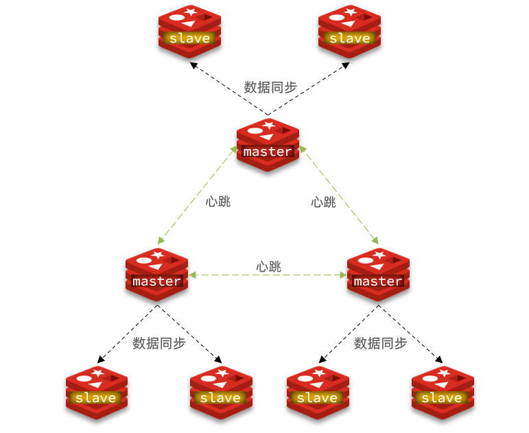

# 一、配置文件

**1）**设置Redis服务后台运行

​	**daemonize**：用来指定redis是否要用守护线程的方式启动，设置成yes时，代表开启守护进程模式。在该模式下，redis会在后台运行

**2）**设置Redis服务密码

​	**requirepass**：设置Redis的连接密码

**3）**设置允许客户端远程连接Redis服务

​	Redis服务**默认只能客户端本地连接**，不允许客户端远程连接。将配置文件中的 **bind 127.0.0.1** 配置项注释掉。如果指定了bind，则说明只允许来自指定网卡的Redis请求。如果没有指定，就说明可以接受来自任意一个网卡的Redis请求。


**解释说明：**

Redis配置文件中 **#** 表示注释

Redis配置文件中的**配置项前面不能有空格，需要顶格写**

**注意**：修改配置文件后需要重启Redis服务配置才能生效，并且**启动Redis服务时需要显示的指定配置文件**：

Linux中启动Redis服务：

~~~sh
# 进入Redis安装目录
cd /usr/local/redis-4.0.0
# 启动Redis服务，指定使用的配置文件
./src/redis-server ./redis.conf
~~~


# 二、Redis数据类型

Redis存储的是**key-value结构**的数据，其中**key是字符串类型**，value有5种常用的数据类型：

- 字符串 string
- 哈希 hash
- 列表 list
- 集合 set
- 有序集合 sorted set / zset

redis的key区分大小写！


# 三、常用命令

## 字符串string操作命令

Redis 中字符串类型常用命令：

- **SET** key value 					         设置指定key的值

- **GET** key                                        获取指定key的值

- **SETEX** key seconds value         设置指定key的值，并将 key 的过期时间设为 seconds 秒

  等价于：**SET** key value **EX** seconds

- **SETNX** key value                        只有在 key不存在时设置 key 的值

## 哈希hash操作命令

Redis hash 是一个string类型的 field 和 value 的映射表（散列表），hash特别适合用于存储对象，常用命令：

- **HSET** key field value             将哈希表 key 中的字段 field 的值设为 value
- **HGET** key field                       获取存储在哈希表中指定字段的值
- **HDEL** key field                       删除存储在哈希表中的指定字段
- **HKEYS** key                              获取哈希表中所有字段
- **HVALS** key                              获取哈希表中所有值
- **HGETALL** key                         获取在哈希表中指定 key 的所有字段和值

## 列表list操作命令

Redis 列表是简单的字符串列表（实际上是**双端队列**），按照插入顺序排序，常用命令：

- **LPUSH** key value1 [value2]         将一个或多个值从<u>左边</u>插入
- **RPUSH** key value1 [value2]         将一个或多个值从<u>右边</u>插入
- **LRANGE** key start stop                获取列表指定范围内的元素（索引从0开始），**从左往右索引递增。**如果 stop = -1 ,则表示最后一个元素的索引。所以查看列表中所有数据的命令就是 `lrange key 0 -1`
- **RPOP** key                                       从右边移除一个元素
- **LPOP** key                                       从左边移除一个元素
- **LLEN** key                                        获取列表长度
- **BRPOP** key1 [key2 ] timeout       移出并获取列表的最右边的一个元素， 如果列表没有元素会阻塞列表直到等待超时或发现可弹出元素为止。同样还有 **BLPOP**

## 集合set操作命令

Redis set 是string类型的无序集合。集合成员是唯一的，这就意味着集合中不能出现重复的数据，常用命令：

- **SADD** key member1 [member2]            向集合添加一个或多个成员
- **SMEMBERS** key                                         返回集合中的所有成员
- **SCARD** key                                                  获取集合的成员数
- **SINTER** key1 [key2]                                   返回给定所有集合的交集
- **SUNION** key1 [key2]                                 返回所有给定集合的并集
- **SDIFF** key1 [key2]                                      返回给定所有集合的差集
- **SREM** key member1 [member2]            移除集合中一个或多个成员

## 有序集合sorted set操作命令

Redis sorted set 有序集合是 string 类型元素的集合，且不允许重复的成员。每个元素都会关联一个double类型的分数(score) 。redis正是通过分数来为集合中的成员进行从小到大排序。有序集合的成员是唯一的，但分数却可以重复。

常用命令：

- **ZADD** key score1 member1 [score2 member2]     向有序集合添加一个或多个成员，或者更新已存在成员的 分数
- **ZRANGE** key start stop [WITHSCORES]                     通过索引区间返回有序集合中指定区间内的成员
- **ZINCRBY** key increment member                              有序集合中对指定成员的分数加上增量 increment
- **ZREM** key member [member ...]                                移除有序集合中的一个或多个成员

## 通用命令

Redis中的通用命令，主要是针对key进行操作的相关命令：

- **KEYS** pattern  查找所有符合给定模式( pattern)的 key 
- **EXISTS** key  检查给定 key 是否存在
- **TYPE** key  返回 key 所储存的值的类型
- **TTL** key  返回给定 key 的剩余生存时间(TTL, time to live)，以秒为单位
- **DEL** key  该命令用于在 key 存在时删除 key


# 四、Spring Data Redis

## 依赖

Spring Boot提供了对应的Starter，maven坐标：

~~~xml
<dependency>
	<groupId>org.springframework.boot</groupId>
	<artifactId>spring-boot-starter-data-redis</artifactId>
</dependency>
~~~

## yml配置

```yml
spring:
  #Redis相关配置
  redis:
    host: localhost
    port: 6379
    password: 123456
    database: 0 #操作的是0号数据库
    jedis:
      #Redis连接池配置
      pool:
        max-active: 8 #最大连接数
        max-wait: 1ms #连接池最大阻塞等待时间
        max-idle: 4 #连接池中的最大空闲连接
        min-idle: 0 #连接池中的最小空闲连接
```


## 基本用法

Spring Data Redis中提供了一个高度封装的类：**RedisTemplate<K,V>**，针对 Jedis 客户端中大量api进行了归类封装,将同一类型操作封装为**Operations接口**，具体分类如下：

- ValueOperations：简单K-V操作
- SetOperations：set类型数据操作
- ZSetOperations：zset类型数据操作
- HashOperations：针对hash类型的数据操作
- ListOperations：针对list类型的数据操作


**注：** SpringBoot帮我们自动配置了两种类型的RedisTemplate：

**RedisTemplate<Object,Object>** 和 **RedisTemplate<String,String>**

我们只需要在需要使用的地方直接使用 @Autowired 注入即可，并且这两种类型可以同时存在。

```java
@Autowired
private  RedisTemplate<String,String> redisTemplateS;

private  RedisTemplate<Object,Object> redisTemplate;
//或者private RedisTemplate redisTemplate;
    
@Test
void testRedisTemplate() {
	redisTemplateS.opsForValue().set("键","值");
    redisTemplate.opsForValue().set("user001",new User());
}
```

**RedisTemplate<Object,Object> 中的Object必须实现 Serializable接口**


### 乱码问题（设置序列化器）

但是，如果我们注入的是**RedisTemplate<Object,Object>** 类型，或者不加泛型的**RedisTemplate**类型，我们存入Redis中的数据在通过命令行或者工具等方式获取的时候就会发现是乱码：

```sh
127.0.0.1:6379> keys *
1) "\xac\xed\x00\x05t\x00\x04name"
```

原因是RedisTemplate<Object,Object>的key序列化器为**JdkSerializationRedisSerializer**。

如果只是在Java代码中设置和读取值，不会出现任何问题，但是如果通过命令行或者工具来查看Redis中的key的时候，出现key为乱码就不知道具体存的是什么。

解决方法就是我们自己注册一个修改了Key的序列化器的RedisTemplate对象到Spring容器中：

```java
/**
 * Redis配置类
 */
@Configuration
public class RedisConfig extends CachingConfigurerSupport {
	//我们自己注册一个RedisTemplate到容器中，方法的名字为redisTemplate，这样才能让SpringBoot不自动装配默认的RedisTemplate对象。
    @Bean
    public RedisTemplate<Object, Object> redisTemplate(RedisConnectionFactory connectionFactory) {
        RedisTemplate<Object, Object> redisTemplate = new RedisTemplate<>();
        //把Key的序列化器修改为StringRedisSerializer，这样key就可读了
        redisTemplate.setKeySerializer(new StringRedisSerializer());
        redisTemplate.setHashKeySerializer(new StringRedisSerializer());
        
        redisTemplate.setConnectionFactory(connectionFactory);
        return redisTemplate;
    }

}
```

RedisTemplate<String,String> 类型的Key和Value的序列化器是String类型的，所以如果我们不需要存对象类型的值，就可以@Autowired这个类型。

**综上，如果希望在存对象类型的值时让key不出现乱码，就可以添加上述配置类，如果不需要存对象类型的值，则可以直接注入RedisTemplate<String,String> 。** 


###  操作字符串类型数据

```java
//通过 ValueOperations接口来操作 String类型数据
ValueOperations valueOpr = redisTemplate.opsForValue();

//存值	SET key value
valueOpr.set("city","beijing");

//取值	GET key
String cityVal =(String) valueOpr.get("city");

//存值，同时设置过期时间	SETEX key seconds value
valueOpr.set("key1","value1",10l, TimeUnit.SECONDS);

//存值，如果存在则不执行任何操作	SETNX key value
Boolean aBoolean = valueOpr.setIfAbsent("city1234", "nanjing");
```

### 操作哈希类型数据

```java
//通过 HashOperations 接口来操作 Hash类型数据
HashOperations hashOperations = redisTemplate.opsForHash();

//存值	HSET key field value
hashOperations.put("002","name","xiaoming");
hashOperations.put("002","age","20");

//取值	HGET key field
String age = (String) hashOperations.get("002", "age");

//获得hash结构中的所有字段	HKEYS key
Set keys = hashOperations.keys("002");

//获得hash结构中的所有值		HVALS key
List values = hashOperations.values("002");
```

### 操作列表类型数据

```java
//通过 ListOperations 接口来操作 Hash类型数据
ListOperations listOperations = redisTemplate.opsForList();

//存值	LPUSH key value1 [value2]    RPUSH把left改成right即可
listOperations.leftPush("mylist","a");
listOperations.leftPushAll("mylist","b","c","d");

//范围取值	LRANGE key start stop
List<String> mylist = listOperations.range("mylist", 0, -1);

//获得列表长度 LLEN key
Long size = listOperations.size("mylist");
int lSize = size.intValue();

//出队列	RPOP key		LPOP把right改成left即可
String element = (String) listOperations.rightPop("mylist");
```

### 操作集合类型数据

```java
//通过 SetOperations 接口来操作 Hash类型数据
SetOperations setOperations = redisTemplate.opsForSet();

//存值	SADD key member1 [member2] 
setOperations.add("myset","a","b","c","a");

//取值	SMEMBERS key
Set<String> myset = setOperations.members("myset");

//删除成员	SREM key member1 [member2] 
setOperations.remove("myset","a","b");
```

### 操作有序集合类型数据

```java
//通过 ZSetOperations 接口来操作 Hash类型数据
ZSetOperations zSetOperations = redisTemplate.opsForZSet();

//存值	ZADD key score1 member1 (score2 member2)
zSetOperations.add("myZset","a",10.0);
zSetOperations.add("myZset","b",11.0);
zSetOperations.add("myZset","c",12.0);
zSetOperations.add("myZset","a",13.0);

//取值	ZRANGE key start stop (WITHSCORES)
Set<String> myZset = zSetOperations.range("myZset", 0, -1);
for (String s : myZset) {
    System.out.println(s);
}

//修改分数	ZINCRBY key increment member
zSetOperations.incrementScore("myZset","b",20.0);

//删除成员	ZREM key member [member ...] 
zSetOperations.remove("myZset","a","b");
```

### 通用操作

```java
//获取Redis中所有的key	 KEYS pattern
Set<String> keys = redisTemplate.keys("*");

//判断某个key是否存在		EXISTS key
Boolean itcast = redisTemplate.hasKey("itcast");

//删除指定key			   DEL key
redisTemplate.delete("myZset");

//获取指定key对应的value的数据类型	TYPE key 
DataType dataType = redisTemplate.type("myset");
```


# 五、Redis持久化

Redis有两种持久化方案：

- **RDB持久化**
- **AOF持久化**

## 1. RDB持久化

RDB全称**Redis Database Backup file（Redis数据备份文件）**，也被叫做<u>Redis数据快照</u>。简单来说就是把内存中的<u>所有数据</u>都记录到磁盘中。当Redis实例故障重启后，从磁盘读取快照文件，恢复数据。快照文件称为RDB文件，<u>默认是保存在当前运行目录。</u>

### 1.1 执行时机

RDB持久化在四种情况下会执行：

- ①执行**save**命令

  **save命令会导致主进程执行RDB，这个过程中其它所有命令都会被阻塞**。只有在数据迁移时可能用到。

- ②执行**bgsave**命令

  这个命令执行后会开启独立进程完成RDB，主进程可以持续处理用户请求，不受影响。

- ③Redis停机时

  Redis停机时会执行一次save命令，实现RDB持久化。

- ④触发RDB条件时

​	Redis内部有触发RDB的机制，可以在**redis.conf**文件中找到，格式如下：

```properties
#如果是save "" 则表示禁用RDB
#格式 save interval change_times
save 900 1  
save 300 10  
save 60 10000 
```

上述含义分别是：

把**从上一次执行bgsave到当前时刻所经历的时间**记为 当前时刻的save_interval。

```
1.如果当前时刻的save_interval > 900s ，并且在这段时间内至少修改了 1 次，那么执行 bgsave操作

2.如果当前时刻的save_interval > 300s，并且在这段时间内至少修改了 10 次，那么执行 bgsave操作

3.如果当前时刻的save_interval > 60s，并且在这段时间内至少修改了 10000 次，那么执行 bgsave操作
```

简言之，底层代码每隔100毫秒检查当前时刻距离上一次保存RDB文件的时间间隔是否大于 900、300、60，如果满足再检查是否满足对应的修改次数


RDB的其它配置也可以在**redis.conf**文件中设置：

```properties
# 是否压缩 ,建议不开启，压缩也会占用cpu资源。
rdbcompression yes

# RDB文件名称
dbfilename dump.rdb  

# 文件保存的路径目录
dir ./ 
```

### 1.2 RDB原理

bgsave开始时会**fork**主进程得到子进程，子进程共享主进程的内存数据。完成fork后子进程读取内存数据并写入 RDB 文件，再把新的RDB文件覆盖掉旧的RDB文件。

fork采用的是**copy-on-write**技术：

- 如果主进程只有读操作，那么与子进行共享内存；
- 如果主进程执行写操作，则会拷贝一份数据，执行写操作。此时子进程依然在原来的数据上进行读操作

RDB的缺点：

- RDB执行间隔时间长，两次RDB之间写入数据有丢失的风险
- fork子进程、压缩、写出RDB文件都比较耗时


## 2. AOF持久化

### 2.1 AOF原理

AOF全称为**Append Only File（追加文件）**。Redis处理的每一个写<u>命令</u>都会记录在AOF文件，可以看做是<u>命令日志文件</u>。

### 2.2 AOF配置

**AOF默认是关闭的**，需要修改**redis.conf**配置文件来开启AOF：

```properties
# 是否开启AOF功能，默认是no
appendonly yes
# AOF文件的名称
appendfilename "appendonly.aof"
```


AOF的命令记录的频率也可以通过redis.conf文件来配：

```properties
# 表示每执行一次写命令，立即记录到AOF文件
appendfsync always 
# 写命令执行完先放入AOF缓冲区，然后表示 每隔1秒 将缓冲区数据写到AOF文件，是默认方案
appendfsync everysec 
# 写命令执行完先放入AOF缓冲区，由操作系统决定何时将缓冲区内容写回磁盘
appendfsync no
```

> 注：内存中会有一个AOF缓冲区，每当执行写命令时，会把该命令记录到AOF缓冲区中，然后根据上述配置的策略来把缓冲区中的内容写到磁盘上。

三种策略对比：


### 2.3 AOF文件重写

因为是记录命令，AOF文件会比RDB文件大的多。而且AOF会记录对同一个key的多次写操作，但只有最后一次写操作才有意义。通过执行**`bgrewriteaof`命令**，可以让AOF文件执行重写功能，用最少的命令达到相同效果。

Redis也会在触发阈值时自动去重写AOF文件。阈值也可以在**redis.conf**中配置：

```properties
# AOF文件比上次文件 增长超过多少百分比则触发重写
auto-aof-rewrite-percentage 100
# AOF文件体积最小多大以上才触发重写 
auto-aof-rewrite-min-size 64mb 
```


## 3. RDB与AOF对比

RDB和AOF各有自己的优缺点，如果对数据安全性要求较高，在实际开发中往往会**结合**两者来使用。


**如果同时启用 RDB和AOF，redis会以 AOF优先。也就是说，如果同时存在rdb文件和aof文件，redis会优先读取aof文件**。


# 六、Redis主从

搭建主从参见笔记。

## 1. 主从数据同步原理

### 1.1 全量同步

主从**第一次**建立连接时，会执行**全量同步**，将master节点的所有数据都拷贝给slave节点，完整流程描述：

1. slave节点请求<u>增量同步</u>
2. master节点判断replid，发现不一致，拒绝增量同步
3. master将完整内存数据生成RDB，发送RDB到slave
4. slave清空本地数据，加载master的RDB
5. master将生成RDB之后的命令记录在repl_baklog，然后将log中的命令发送给slave
6. slave执行接收到的命令，保持与master之间的同步


这里有一个问题，master如何得知salve是第一次来连接呢？？

有几个概念，可以作为判断依据：

- **Replication Id**：简称replid，是数据集的标记，id一致则说明是同一数据集。每一个master都有唯一的replid，slave则会继承master节点的replid
- **offset**：偏移量，随着记录在repl_baklog中的数据增多而逐渐增大。slave完成同步时也会记录当前同步的offset。如果slave的offset小于master的offset，说明slave数据落后于master，需要更新。

因此slave做数据同步，必须向master声明自己的replication id 和offset，master才可以判断到底需要同步哪些数据。


因为slave原本也是一个master，有自己的replid和offset，当第一次变成slave，与master建立连接时，发送的replid和offset是自己的replid和offset。

**master判断发现slave发送来的replid与自己的不一致，说明这是一个全新的slave，就知道要做全量同步了。**

master会将自己的replid和offset都发送给这个slave，slave保存这些信息。以后slave的replid就与master一致了。

因此，**master判断一个节点是否是第一次同步的依据，就是看replid是否一致**。


### 1.2 增量同步

全量同步需要先做RDB，然后将RDB文件通过网络传输个slave，成本太高了。因此除了第一次做全量同步，其它大多数时候slave与master都是做**增量同步**，比如slave重启后同步则执行增量同步。

什么是增量同步？**就是只更新slave与master存在差异的部分数据**。如图：


那么master怎么知道slave与自己的数据差异在哪里呢?


### 1.3 repl_backlog原理

master怎么知道slave与自己的数据差异在哪里呢?

这就要说到全量同步时的**repl_baklog**文件了。

**repl_baklog**中会记录Redis处理过的命令日志及offset，包括master当前的offset，和slave已经拷贝到的offset。

这个文件是一个固定大小的数组，只不过数组是**环形**，也就是说**角标到达数组末尾后，会再次从0开始读写**，这样数组头部的数据就会被覆盖。


## 2. 主从同步优化

主从同步可以保证主从数据的一致性，非常重要。

可以从以下几个方面来**优化Redis主从就集群**：

1. 在**master**中配置`repl-diskless-sync yes`启用无磁盘复制，避免全量同步时的磁盘IO。也就是在写RDB文件的时候不写入磁盘，直接通过网络发送给slave。

2. Redis单节点上的内存占用不要太大，减少RDB导致的过多磁盘IO。

3. 适当提高**repl_baklog**的大小，发现slave宕机时尽快实现故障恢复，尽可能避免全量同步

4. 限制一个master上的slave节点数量，如果有太多slave，则可以采用<u>主-从-从链式结构</u>，减少master压力


# 七、Redis哨兵

## 1. 哨兵原理

### 1.1 集群结构和作用


哨兵的作用如下：

- **监控**：Sentinel 会不断检查您的master和slave是否按预期工作
- **自动故障恢复**：如果master故障，Sentinel会将一个slave提升为master。当故障实例恢复后则自动成为新的master的slave
- **通知**：Sentinel充当Redis客户端的<u>服务发现来源</u>，redis客户端在访问redis服务器时，是不知道redis服务的具体地址，而是通过Sentinel来获知redis服务的地址。当集群发生故障转移时，Sentinel会将最新信息（比如新的master的ip地址等）推送给Redis的客户端

### 1.2 集群监控原理

Sentinel基于**心跳机制**监测服务状态，**每隔1秒向集群的每个实例发送ping命令**，根据实例的响应结果，有两种情况：

- **主观下线**：如果某sentinel节点发现某实例未在规定时间响应，则认为该实例**主观下线**。

- **客观下线**：若超过指定数量**（quorum）**的sentinel都认为该实例主观下线，则该实例**客观下线**。quorum值最好超过Sentinel实例数量的一半。


### 1.3 集群故障恢复原理

一旦发现master故障，sentinel需要在slave中选择一个作为新的master。

当选出一个新的master后（例如下图中的7002，7001为原来的master）：

1. sentinel给备选的slave1节点(7002)发送`slaveof no one`命令，让该节点成为master
2. sentinel给所有其它slave发送`slaveof 192.168.150.101 7002` 命令，让这些slave成为新master的从节点，开始从新的master上同步数据。
3. 最后，sentinel将故障节点(7001)标记为slave：强制修改其配置文件为 `slaveof 192.168.150.101 7002`。这样当故障节点(7001)恢复后会自动成为新的master(7002)的slave节点


## 2. 搭建哨兵集群

见笔记

## 3. RedisTemplate集成哨兵

在Sentinel集群监管下的Redis主从集群，其节点会因为自动故障转移而发生变化，Redis的客户端必须感知这种变化，及时更新连接信息。Spring的RedisTemplate底层利用lettuce实现了节点的感知和自动切换。

Maven依赖就是 Spring Data Redis的依赖

### yml配置

如果使用哨兵，那么需要在application.yml中指定redis的**sentinel**相关信息：

```java
spring:
  redis:
    sentinel:	
      master: mymaster	# 和配置sentinel时指定的master的名称一致
      nodes:
        - 192.168.150.101:27001	#sentinel集群的地址
        - 192.168.150.101:27002
        - 192.168.150.101:27003
```

### 配置读写分离

在项目的**启动类**中，添加一个新的bean：

```java
@Bean
public LettuceClientConfigurationBuilderCustomizer clientConfigurationBuilderCustomizer(){
    return clientConfigurationBuilder -> clientConfigurationBuilder.readFrom(ReadFrom.REPLICA_PREFERRED);
}
```

**LettuceClientConfigurationBuilderCustomizer** 是一个函数式接口，所以可以 lambda表达式来作为返回值。 


这个bean中配置的就是读写策略（ReadFrom就是表示读写策略的一个枚举类），包括四种：

- **MASTER**：从主节点读取
- **MASTER_PREFERRED**：优先从master节点读取，master不可用才读取replica
- **REPLICA**：从slave（replica）节点读取
- **REPLICA _PREFERRED**（推荐）：优先从slave（replica）节点读取，所有的slave都不可用才读取master


# 八、Redis分片集群

## 1. 搭建分片集群



分片集群特征：

- 集群中有多个master，每个master保存不同数据

- 每个master都可以有多个slave节点

- master之间通过ping监测彼此健康状态

- 客户端请求可以访问集群任意节点，最终都会被转发到正确节点


搭建集群见笔记


## 2. 散列插槽

### 2.1 插槽原理

Redis会把每一个master节点映射到0~16383共**16384**个插槽**（hash slot）**上，查看集群信息时就能看到：


**数据key不是与节点绑定，而是与插槽绑定**。redis会根据key的有效部分计算插槽值，分两种情况：

- key中包含`{}`，且`{}`中至少包含1个字符，`{}`中的部分是有效部分
- key中不包含`{}`，整个key都是有效部分


例如：key是num，那么就根据num计算，如果是`{itcast}num`，则根据itcast计算。计算方式是利用CRC16算法得到一个hash值，然后对16384取余，得到的结果就是slot值。

 

如图，在7001这个节点执行`set a 1`时，对`a`做hash运算，对16384取余，得到的结果是`15495`，因为7003节点的插槽范围为：`10923-16383`  ，所以要存储到**7003节点**。所以图中显示 `redirected ...`。


到了7003后，执行`get num`时，对`num`做hash运算，对16384取余，得到的结果是`2765`，因为7001节点的插槽范围为：`0-5460` ，所以需要切换到**7001节点**。


**如何将同一类数据固定的保存在同一个Redis实例？**

这一类数据使用相同的有效部分，例如key都以{typeId}为前缀


## 3. RedisTemplate访问分片集群

RedisTemplate底层同样基于lettuce实现了分片集群的支持，而使用的步骤与哨兵模式基本一致：

1）引入redis的starter依赖

2）配置分片集群地址

3）配置读写分离

与哨兵模式相比，其中只有分片集群的配置方式略有差异，如下：

```yaml
spring:
  redis:
    cluster:
      nodes:
        - 192.168.150.101:7001
        - 192.168.150.101:7002
        - 192.168.150.101:7003
        - 192.168.150.101:8001
        - 192.168.150.101:8002
        - 192.168.150.101:8003
```
