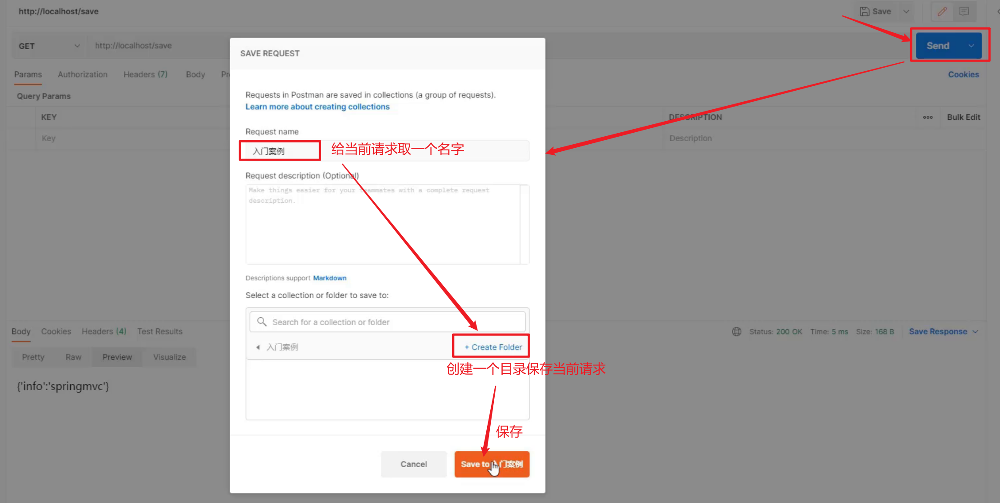

## 一、SpringMVC简介

### 1 SpringMVC概述

#### 1.1 SpringMVC概述

1. SpringMVC是一种基于Java实现MVC模型的轻量级Web框架
2. 优点
   1. 使用简单，开发便捷（相比于Servlet）
   2. 灵活性强


### 2 入门案例【重点】

#### 2.1 实现步骤

```
1 创建web工程（Maven结构）
2 设置tomcat服务器，加载web工程(tomcat插件）
3 导入坐标（SpringMVC+Servlet）
4 定义处理请求的功能类（UserController）
5 编写SpringMVC配置类，加载处理请求的Bean。
6 加载SpringMVC配置，并设置SpringMVC请求拦截的路径
```

#### 2.2 代码实现

##### 【第一步】创建web工程（Maven结构）

##### 【第二步】设置tomcat服务器，加载web工程(tomcat插件）

```xml 
<build>
    <plugins>
        <plugin>
            <groupId>org.apache.tomcat.maven</groupId>
            <artifactId>tomcat7-maven-plugin</artifactId>
            <version>2.1</version>
            <configuration>
                <port>80</port>
                <path>/</path>
            </configuration>
        </plugin>
    </plugins>
</build>
```

##### 【第三步】导入坐标（SpringMVC+Servlet）

```xml
<dependencies>
    <dependency>
        <groupId>javax.servlet</groupId>
        <artifactId>javax.servlet-api</artifactId>
        <version>3.1.0</version>
        <scope>provided</scope>
    </dependency>
    <dependency>
        <groupId>org.springframework</groupId>
        <artifactId>spring-webmvc</artifactId>
        <version>5.2.10.RELEASE</version>
    </dependency>
</dependencies>
```

**注意事项：**

1. 课程版本基于**Spring主版本5.2.10.RELEASE**制作
2. 导入spring-webmvc坐标自动依赖spring相关坐标

##### 【第四步】定义处理请求的功能类（UserController）

```java
//定义表现层控制器bean
@Controller
public class UserController {
    //设置映射路径为/save，即外部访问路径
    @RequestMapping("/save")
    //设置当前操作返回结果为指定json数据（本质上是一个字符串信息）
    @ResponseBody
    public String save(){
        System.out.println("user save ...");
        return "{'info':'springmvc'}";
    }
}
```

**==注意事项：==**

对于SpringMVC而言，Controller方法返回值默认表示要跳转的页面，没有对应的页面就会报错。如果不想跳转页面而是响应数据，那么就需要在方法上使用**@ResponseBody注解**。

##### 【第五步】编写SpringMVC配置类，加载处理请求的Bean。

```java
//springmvc配置类，本质上还是一个spring配置类
@Configuration
@ComponentScan("com.itheima.controller")
public class SpringMvcConfig {
}
```

##### 【第六步】加载SpringMVC配置，并设置SpringMVC请求拦截的路径

```java
//web容器配置类
public class ServletContainersInitConfig extends AbstractDispatcherServletInitializer {
    //加载springmvc配置类，产生springmvc容器（本质还是spring容器）
    protected WebApplicationContext createServletApplicationContext() {
        //初始化WebApplicationContext对象
        AnnotationConfigWebApplicationContext ctx = new AnnotationConfigWebApplicationContext();
        //加载指定配置类
        ctx.register(SpringMvcConfig.class);
        return ctx;
    }

    //设置由springmvc控制器处理的请求映射路径
    protected String[] getServletMappings() {
        return new String[]{"/"};
    }

    //加载spring配置类
    protected WebApplicationContext createRootApplicationContext() {
        return null;
    }
}
```

#### 2.3 运行结果


#### 2.4 案例注解和类解析

##### 2.4.1 @Controller注解

- 名称：@Controller
- 类型：类注解
- 位置：SpringMVC控制器类定义上方
- 作用：设定SpringMVC的核心控制器bean
- 范例

```java
@Controller
public class UserController {
}
```

##### 2.4.2 @RequestMapping注解

- 名称：@RequestMapping
- 类型：方法、类注解
- 位置：SpringMVC控制器方法定义上方
- 作用：设置当前控制器方法请求访问路径
- 范例

```java
@RequestMapping("/save")
public void save(){
    System.out.println("user save ...");
}
```

> 注意：其实@RequestMapping注解还可以写到类上面，笔记后面会介绍到。

##### 2.4.3 @ResponseBody注解

- 名称：@ResponseBody
- 类型：方法、类注解
- 位置：SpringMVC控制器方法定义上方
- 作用：设置当前控制器方法返回值为请求的响应体，无需解析
- 范例

```java
@RequestMapping("/save")
@ResponseBody
public String save(){
    System.out.println("user save ...");
    return "{'info':'springmvc'}";
}
```

##### 2.4.4 AbstractDispatcherServletInitializer类

- AbstractDispatcherServletInitializer类是SpringMVC提供的快速初始化Web3.0容器的抽象类

- AbstractDispatcherServletInitializer提供三个接口方法供用户实现

  - **createServletApplicationContext()方法**，创建Servlet容器时，加载SpringMVC管理的bean并放入WebApplicationContext对象范围中，而WebApplicationContext的作用范围为ServletContext范围，即整个web容器范围。

  ```java
  //加载springmvc配置类，产生springmvc容器（本质还是spring容器）
  protected WebApplicationContext createServletApplicationContext() {
      AnnotationConfigWebApplicationContext ctx = new AnnotationConfigWebApplicationContext();
      ctx.register(SpringMvcConfig.class);
      return ctx;
  }
  ```

  - **getServletMappings()方法**，设定SpringMVC对应的请求映射路径，设置为/表示拦截所有请求，任意请求都将转入到SpringMVC进行处理。

  ```java
  //设置由springmvc控制器处理的请求映射路径
  protected String[] getServletMappings() {
      return new String[]{"/"};
  }
  ```

  - **createRootApplicationContext()**方法，如果创建Servlet容器时需要加载非SpringMVC对应的bean，使用当前方法进行，使用方式同createServletApplicationContext()

  ```java
  //加载spring配置类
  protected WebApplicationContext createRootApplicationContext() {
      return null;
  }
  ```

#### 2.5 入门程序开发总结(1+N)

- 一次性工作
  - 创建工程，设置服务器，加载工程
  - 导入坐标
  - 创建web容器启动类，加载SpringMVC配置，并设置SpringMVC请求拦截路径
  - SpringMVC核心配置类（设置配置类，扫描controller包，加载Controller控制器bean）
- 多次工作
  - 定义处理请求的控制器类
  - 定义处理请求的控制器方法，并配置映射路径（@RequestMapping）与返回json数据（@ResponseBody）


### 3 入门案例工作流程分析【理解】

#### 3.1 启动服务器初始化过程

1. 服务器启动，执行ServletContainersInitConfig类，初始化web容器
2. 执行createServletApplicationContext方法，创建了WebApplicationContext对象
3. 加载SpringMvcConfig配置类
4. 执行@ComponentScan加载对应的bean
5. 加载UserController，每个@RequestMapping的名称对应一个具体的方法
6. 执行getServletMappings方法，定义所有的请求都通过SpringMVC


#### 3.2 单次请求过程

1. 发送请求localhost/save
2. web容器发现所有请求都经过SpringMVC，将请求交给SpringMVC处理
3. 解析请求路径/save
4. 由/save匹配执行对应的方法save(）
5. 执行save()
6. 检测到有@ResponseBody直接将save()方法的返回值作为响应体返回给请求方


### 4 Controller加载控制

SpringMVC负责表现层，Spring负责业务层和数据访问层。

因为功能不同，如何避免Spring错误地加载到SpringMVC的bean？

#### 4.1 Controller加载控制与业务bean加载控制

- SpringMVC相关bean（表现层bean）

- Spring控制的bean

  1. 业务bean（Service）
  2. 功能bean（DataSource等）

  

- SpringMVC相关bean加载控制

  1. SpringMVC加载的bean对应的包均在com.itheima.controller包内


**解决方法：**

1. 方式一：Spring加载的bean设定扫描范围为com.itheima，排除掉controller包内的bean（了解）

   ```java
   @Configuration
   @ComponentScan(value = "com.itheima",
                  excludeFilters = @ComponentScan.Filter(
                      type = FilterType.ANNOTATION,
                      classes = Controller.class
                  )
                 )
   public class SpringConfig {
   }
   ```

   ```java
   package com.demo.config;
   
   import org.springframework.context.annotation.ComponentScan;
   import org.springframework.context.annotation.Configuration;
   
   // 注意 ：使用这种方法时，下面的 @Configuration不能加，否则Spring又会把controller包下的bean扫描到。
   //@Configuration
   @ComponentScan({"com.itheima.controller"})
   public class SpringMVCConfig {
   
   }
   ```
   
   - 属性
     1. excludeFilters：排除扫描路径中加载的bean，需要指定类别（type）与具体项（classes）
     2. includeFilters：加载指定的bean，需要指定类别（type）与具体项（classes）
   
   
   
2. 方式二：Spring加载的bean设定扫描范围为精准范围，例如service包、dao包等，不要包括controller包。**（推荐使用）**

   ```java
   package com.demo.config;
   
   import org.springframework.context.annotation.ComponentScan;
   import org.springframework.context.annotation.Configuration;
   
   //这个时 SpringMVC的配置类
   @Configuration
   @ComponentScan({"com.demo.controller"})
   public class SpringMVCConfig {
   
   }
   
   ```

   ```java
   package com.demo.config;
   
   import org.springframework.context.annotation.ComponentScan;
   import org.springframework.context.annotation.Configuration;
   
   //这个是Spring的配置类
   @Configuration
   @ComponentScan({"com.demo.service","com.demo.dao"})
   public class SpringConfig {
   
   }
   
   ```

   

3. 方式三：不区分Spring与SpringMVC的环境，加载到同一个环境中

#### 4.3 Bean的加载格式

```java
public class ServletContainersInitConfig extends AbstractDispatcherServletInitializer { 
    //这个是加载SpringMVC配置的方法
    protected WebApplicationContext createServletApplicationContext() { 
        AnnotationConfigWebApplicationContext ctx = new AnnotationConfigWebApplicationContext();
        ctx.register(SpringMvcConfig.class);
        return ctx;  
    }  
    
    //这个是加载Spring配置的方法
    protected WebApplicationContext createRootApplicationContext() {  
        AnnotationConfigWebApplicationContext ctx = new AnnotationConfigWebApplicationContext();      
        ctx.register(SpringConfig.class);        
        return ctx;  
    }   
    
    //设置由springmvc控制器处理的请求映射路径
    protected String[] getServletMappings() { 
        return new String[]{"/"}; 
    }
}
```

**上面方式的简化方式**

```java
public class ServletContainersInitConfig extends AbstractAnnotationConfigDispatcherServletInitializer{
    protected Class<?>[] getServletConfigClasses() {
        return new Class[]{SpringMvcConfig.class}
    };
    protected String[] getServletMappings() {
        return new String[]{"/"};
    }
    protected Class<?>[] getRootConfigClasses() {
        return new Class[]{SpringConfig.class};
    }
}
```


### 5 PostMan【掌握】

#### 5.1 PostMan介绍

- Postman是一款功能强大的网页调试与发送网页HTTP请求的Chrome插件。
- 作用：常用于进行接口测试


#### 5.3 PostMan的使用

##### 5.3.1 创建WorkSpace工作空间


##### 5.3.2 发送请求获取json数据


##### 5.3.3 保存当前请求



> 注意：第一次请求需要创建一个新的目录，后面就不需要创建新目录，直接保存到已经创建好的目录即可。

