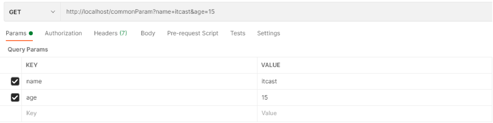
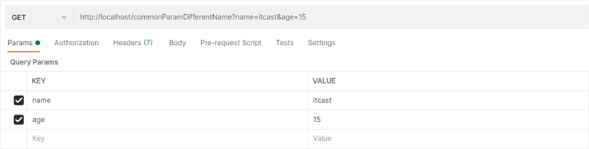
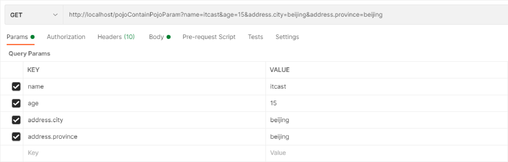
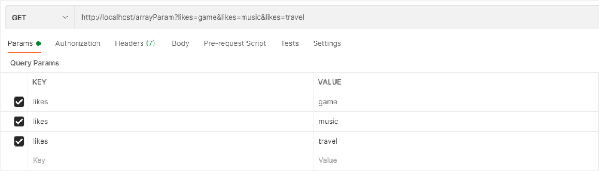

## 一、请求与响应

### 1 请求映射路径【重点】

#### 1.1 @RequestMapping注解

- 名称：@RequestMapping
- 类型：**方法注解**  **类注解**
- 作用：设置当前控制器方法请求访问路径，如果设置在**类**上统一设置当前控制器方法**请求访问路径前缀**
- 范例

```java
@Controller
//类上方配置的请求映射与方法上面配置的请求映射连接在一起，形成完整的请求映射路径
@RequestMapping("/user")
public class UserController {
    //请求路径映射
    @RequestMapping("/save") //此时save方法的访问路径是：/user/save
    @ResponseBody
    public String save(){
        System.out.println("user save ...");
        return "{'module':'user save'}";
    }
}
```


### 2 请求参数

#### 2.1 发送普通类型参数【重点】

##### 2.1.2 GET请求传递普通参数

- 普通参数：url地址传参，**url参数名**与**形参变量名**相同，定义形参即可接收参数



```java
//普通参数：请求参数与形参名称对应即可完成参数传递
@RequestMapping("/commonParam")
@ResponseBody
public String commonParam(String name ,int age){
    System.out.println("普通参数传递 name ==> "+name);
    System.out.println("普通参数传递 age ==> "+age);
    return "{'module':'common param'}";
}
```

- 问题：如果同学们传递的参数是中文试试，你们会发现接收到的参数出现了中文乱码问题。
- 原因：tomcat 8.5版本之后GET请求就不再出现中文乱码问题，但是我们使用的是tomcat7插件，所以会出现GET请求中文乱码问题。
- 解决：在pom.xml添加tomcat7插件处配置UTF-8字符集，解决GET请求中文乱码问题。

```xml
<build>
    <plugins>
      <plugin>
        <groupId>org.apache.tomcat.maven</groupId>
        <artifactId>tomcat7-maven-plugin</artifactId>
        <version>2.1</version>
        <configuration>
          <port>80</port><!--tomcat端口号-->
          <path>/</path> <!--虚拟目录-->
          <uriEncoding>UTF-8</uriEncoding><!--访问路径编解码字符集-->
        </configuration>
      </plugin>
    </plugins>
  </build>
```


##### 2.1.3 POST请求传递普通参数

- 普通参数：form表单post请求传参，**表单参数名**与**形参变量名**相同，定义形参即可接收参数


```java
//普通参数：请求参数与形参名称对应即可完成参数传递
@RequestMapping("/commonParam")
@ResponseBody
public String commonParam(String name ,int age){
    System.out.println("普通参数传递 name ==> "+name);
    System.out.println("普通参数传递 age ==> "+age);
    return "{'module':'common param'}";
}
```

问题：我们发现，**POST请求**传递的参数如果包含中文那么就会出现中文乱码问题，说明我们之前配置的tomcat插件uri路径编解码字符集无法解决POST请求中文乱码问题。那么如何解决呢？

##### 2.1.4 POST请求中文乱码处理

> 在加载SpringMVC配置的配置类中指定字符过滤器。

```java
public class ServletContainersInitConfig extends AbstractAnnotationConfigDispatcherServletInitializer {
    protected Class<?>[] getRootConfigClasses() {
        return new Class[0];
    }

    protected Class<?>[] getServletConfigClasses() {
        return new Class[]{SpringMvcConfig.class};
    }

    protected String[] getServletMappings() {
        return new String[]{"/"};
    }

    //乱码处理
    @Override
    protected Filter[] getServletFilters() {
        CharacterEncodingFilter filter = new CharacterEncodingFilter();
        filter.setEncoding("UTF-8");
        return new Filter[]{filter};
    }
}
```


#### 2.2 五种类型参数传递

##### 2.2.1 五种类型参数介绍

- 普通参数
- POJO类型参数
- 嵌套POJO类型参数
- 数组类型参数
- 集合类型参数

##### 2.2.2 普通参数【重点】

- 普通参数：**当请求参数名与形参变量名不同**，使用**@RequestParam**绑定参数关系



```java
//普通参数：请求参数名与形参名不同时，使用@RequestParam注解关联请求参数名称与形参名称之间的关系
@RequestMapping("/commonParamDifferentName")
@ResponseBody
public String commonParamDifferentName(@RequestParam("name") String userName , int age){
    System.out.println("普通参数传递 userName ==> "+userName);
    System.out.println("普通参数传递 age ==> "+age);
    return "{'module':'common param different name'}";
}
```

- 名称：@RequestParam
- 类型：形参注解
- 位置：SpringMVC控制器方法形参定义前面
- 作用：绑定请求参数与处理器方法形参间的关系
- 属性：
  - **value**：HTTP请求参数的名称
  - **required**：是否为必传参数，true：如果请求中没有该参数会抛异常
  - **defaultValue**：参数默认值


##### 2.2.3 POJO类型参数【重点】

- POJO参数：**请求参数名**与**形参对象属性名**相同，定义POJO类型形参即可接收参数


```java
public class User {
    private String name;
    private int age;
    //同学们自己添加getter/setter/toString()方法
}
```

```java
//POJO参数：请求参数与形参对象中的属性对应即可完成参数传递
@RequestMapping("/pojoParam")
@ResponseBody
public String pojoParam(User user){
    System.out.println("pojo参数传递 user ==> "+user);
    return "{'module':'pojo param'}";
}
```

**==注意事项：请求参数key的名称要和POJO中属性的名称一致，否则无法封装。==**

##### 2.2.4 嵌套POJO类型参数

- POJO对象中包含POJO对象

```java
public class User {
    private String name;
    private int age;
    private Address address;
    //同学们自己添加getter/setter/toString()方法
}
public class Address {
    private String province;
    private String city;
    private Address address;
}
```

- 嵌套POJO参数：**请求参数名**与**形参对象属性名**相同，按照对象层次结构关系即可接收嵌套POJO属性参数



```java
//嵌套POJO参数：嵌套属性按照层次结构设定名称即可完成参数传递
@RequestMapping("/pojoContainPojoParam")
@ResponseBody
public String pojoContainPojoParam(User user){
    System.out.println("pojo嵌套pojo参数传递 user ==> "+user);
    return "{'module':'pojo contain pojo param'}";
}
```

**==注意事项：请求参数key的名称要和POJO中属性的名称一致，否则无法封装。==**


##### 2.2.5 数组类型参数

- 数组参数：**请求参数名**与**形参名**相同且请求参数为多个，定义**数组类型**即可接收参数



```java
//数组参数：同名请求参数可以直接映射到对应名称的形参数组对象中
@RequestMapping("/arrayParam")
@ResponseBody
public String arrayParam(String[] likes){
    System.out.println("数组参数传递 likes ==> "+ Arrays.toString(likes));
    return "{'module':'array param'}";
}
```


##### 2.2.6 集合类型参数

- 集合保存普通参数：**请求参数名**与**形参集合对象名**相同且请求参数为多个，如果想要映射为集合类型，**必须使用@RequestParam**绑定参数关系


```java
//集合参数：同名请求参数可以使用@RequestParam注解映射到对应名称的集合对象中作为数据
@RequestMapping("/listParam")
@ResponseBody
public String listParam(@RequestParam List<String> likes){
    System.out.println("集合参数传递 likes ==> "+ likes);
    return "{'module':'list param'}";
}
```


#### 2.3 json数据参数传递

##### 2.3.2 传递json普通数组

###### 2.3.2.1 代码演示

1. 添加json数据转换相关坐标

```xml
<dependency>
    <groupId>com.fasterxml.jackson.core</groupId>
    <artifactId>jackson-databind</artifactId>
    <version>2.9.0</version>
</dependency>
```

2. 设置发送json数据（请求body中添加json数据）


3. 开启自动转换json数据的支持

```java
@Configuration
@ComponentScan("com.itheima.controller")
//开启json数据类型自动转换
@EnableWebMvc
public class SpringMvcConfig {
}
```

**注意事项：**

@EnableWebMvc注解功能强大，该注解整合了多个功能，此处仅使用其中一部分功能，即json数据进行自动类型转换

4. 在Controller中编写方法接收json参数

```java
//集合参数：json格式
//1.开启json数据格式的自动转换，在配置类中开启@EnableWebMvc
//2.使用@RequestBody注解将外部传递的json数组数据映射到形参的集合对象中作为数据
@RequestMapping("/listParamForJson")
@ResponseBody
public String listParamForJson(@RequestBody List<String> likes){
    System.out.println("list common(json)参数传递 list ==> "+likes);
    return "{'module':'list common for json param'}";
}
```


###### 2.3.2.2 @EnableWebMvc注解介绍

- 名称：**@EnableWebMvc**
- 类型：==配置类注解==
- 位置：SpringMVC配置类定义上方
- 作用：开启SpringMVC多项辅助功能
- 范例：

```java
@Configuration
@ComponentScan("com.itheima.controller")
@EnableWebMvc
public class SpringMvcConfig {
}
```

###### 2.3.2.3 @RequestBody注解介绍

- 名称：**@RequestBody**
- 类型：形参注解
- 位置：SpringMVC控制器方法形参定义前面
- 作用：将请求中请求体所包含的数据传递给请求参数，此注解一个处理器方法只能使用一次
- 范例：

```java
@RequestMapping("/listParamForJson")
@ResponseBody
public String listParamForJson(@RequestBody List<String> likes){
    System.out.println("list common(json)参数传递 list ==> "+likes);
    return "{'module':'list common for json param'}";
} 
```


##### 2.3.3 传递json对象

- POJO参数：json数据与形参对象属性名相同，定义POJO类型形参即可接收参数。**POJO类型一定要有无参构造方法。**


```java
//POJO参数：json格式
//1.开启json数据格式的自动转换，在配置类中开启@EnableWebMvc
//2.使用@RequestBody注解将外部传递的json数据映射到形参的实体类对象中，要求属性名称一一对应
@RequestMapping("/pojoParamForJson")
@ResponseBody
public String pojoParamForJson(@RequestBody User user){
    System.out.println("pojo(json)参数传递 user ==> "+user);
    return "{'module':'pojo for json param'}";
}
```

##### 2.3.4 传递json对象数组

- POJO集合参数：json数组数据与集合泛型属性名相同，定义List类型形参即可接收参数


```java
//集合参数：json格式
//1.开启json数据格式的自动转换，在配置类中开启@EnableWebMvc
//2.使用@RequestBody注解将外部传递的json数组数据映射到形参的保存实体类对象的集合对象中，要求属性名称一一对应
@RequestMapping("/listPojoParamForJson")
@ResponseBody
public String listPojoParamForJson(@RequestBody List<User> list){
    System.out.println("list pojo(json)参数传递 list ==> "+list);
    return "{'module':'list pojo for json param'}";
}
```


##### 2.3.5 @RequestBody与@RequestParam区别

- 区别
  @RequestParam用于接收**url地址传参**，**表单传参**【application/x-www-form-urlencoded】
  @RequestBody用于接收**json数据**【application/json】
- 应用
  后期开发中，发送json格式数据为主，@RequestBody应用较广
  如果发送非json格式数据，选用@RequestParam接收请求参数


### 3 日期类型参数传递【重点】

#### 3.1 代码演示

- 日期类型数据基于系统不同格式也不尽相同
  2088-08-18
  2088/08/18
  08/18/2088
- 接收形参时，根据不同的日期格式设置不同的接收方式


```java
//日期参数 http://localhost:80/dataParam?date=2088/08/08&date1=2088-08-18&date2=2088/08/28 8:08:08
//使用@DateTimeFormat注解设置日期类型数据格式，默认格式yyyy/MM/dd
@RequestMapping("/dataParam")
@ResponseBody
public String dataParam(Date date,
                  @DateTimeFormat(pattern="yyyy-MM-dd") Date date1,
                  @DateTimeFormat(pattern="yyyy/MM/dd HH:mm:ss") Date date2){
    System.out.println("参数传递 date ==> "+date);
    System.out.println("参数传递 date1(yyyy-MM-dd) ==> "+date1);
    System.out.println("参数传递 date2(yyyy/MM/dd HH:mm:ss) ==> "+date2);
    return "{'module':'data param'}";
}
```

#### 3.2 @DateTimeFormat注解介绍

- 名称：@DateTimeFormat

- 类型：**==形参注解==**

- 位置：SpringMVC控制器方法形参前面

- 作用：设定日期时间型数据格式

- 属性：pattern：指定日期时间格式字符串

  

#### 3.3 工作原理

- 其内部依赖**Converter接口**

```java
public interface Converter<S, T> {
    @Nullable
    T convert(S var1);
}
```

- 请求参数年龄数据（String→Integer）
- json数据转对象（json → POJO）
- 日期格式转换（String → Date）

#### 3.4 注意事项

**传递日期类型参数必须在配置类上使用@EnableWebMvc注解。**其功能之一：根据类型匹配对应的类型转换器。


### 4 响应

#### 4.1响应页面【了解】

```java
@Controller
public class UserController {
    //响应页面/跳转页面
    //返回值为String类型，设置返回值为页面名称，即可实现页面跳转
    @RequestMapping("/toJumpPage")
    public String toJumpPage(){
        System.out.println("跳转页面");
        return "page.jsp";
    }
}
```

```jsp
<%@ page contentType="text/html;charset=UTF-8" language="java" %>
<html>
    <head>
        <title>Title</title>
    </head>
    <body>
        <h2>Hello Spring MVC!</h2>
    </body>
</html>
```

#### 4.2 文本数据【了解】

```java
//响应文本数据
//返回值为String类型，设置返回值为任意字符串信息，即可实现返回指定字符串信息，需要依赖@ResponseBody注解
@RequestMapping("/toText")
@ResponseBody
public String toText(){
    System.out.println("返回纯文本数据");
    return "response text";
}
```

#### 4.3 json数据【重点】

```java
//响应POJO对象
//返回值为实体类对象，设置返回值为实体类类型，即可实现返回对应对象的json数据，需要依赖@ResponseBody注解和@EnableWebMvc注解
@RequestMapping("/toJsonPOJO")
@ResponseBody
public User toJsonPOJO(){
    System.out.println("返回json对象数据");
    User user = new User();
    user.setName("itcast");
    user.setAge(15);
    return user;
}
```

```java
//响应POJO集合对象
//返回值为集合对象，设置返回值为集合类型，即可实现返回对应集合的json数组数据，需要依赖@ResponseBody注解和@EnableWebMvc注解
@RequestMapping("/toJsonList")
@ResponseBody
public List<User> toJsonList(){
    System.out.println("返回json集合数据");
    User user1 = new User();
    user1.setName("传智播客");
    user1.setAge(15);

    User user2 = new User();
    user2.setName("黑马程序员");
    user2.setAge(12);

    List<User> userList = new ArrayList<User>();
    userList.add(user1);
    userList.add(user2);

    return userList;
}
```

**注意：需要添加jackson-databind依赖以及在SpringMvcConfig配置类上添加@EnableWebMvc注解**