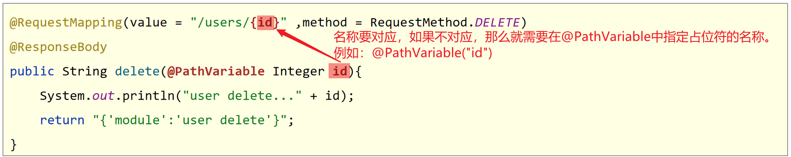
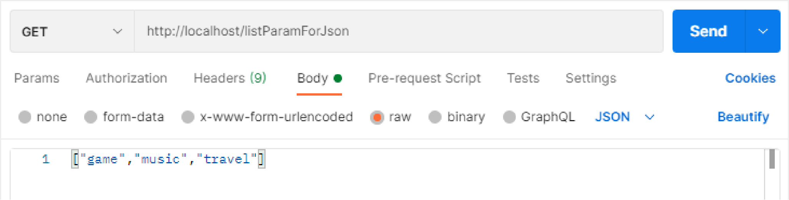
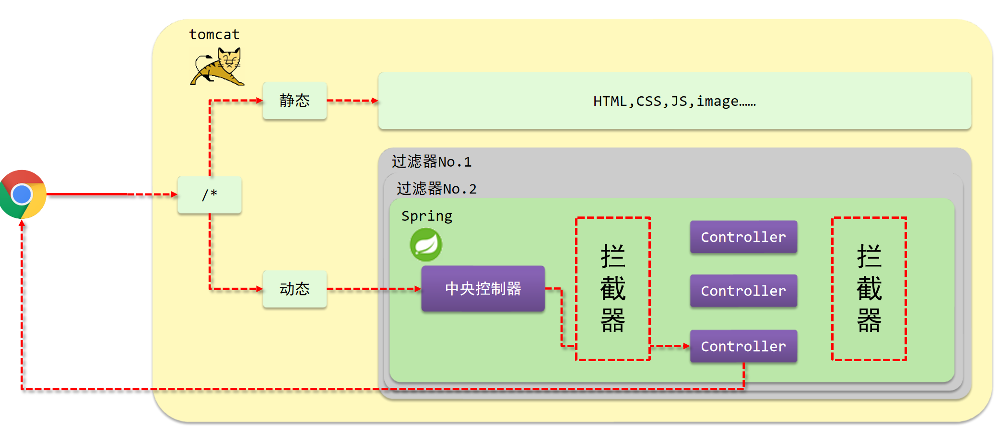
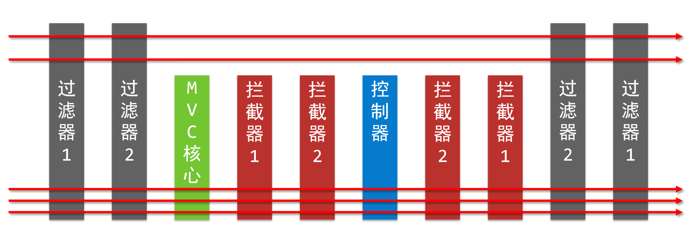
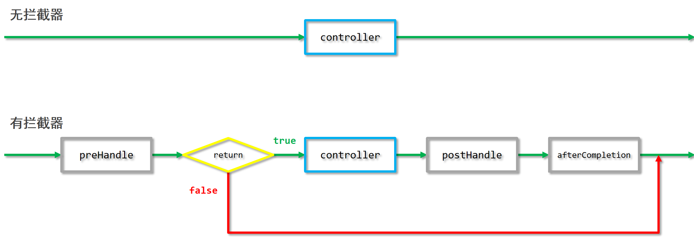
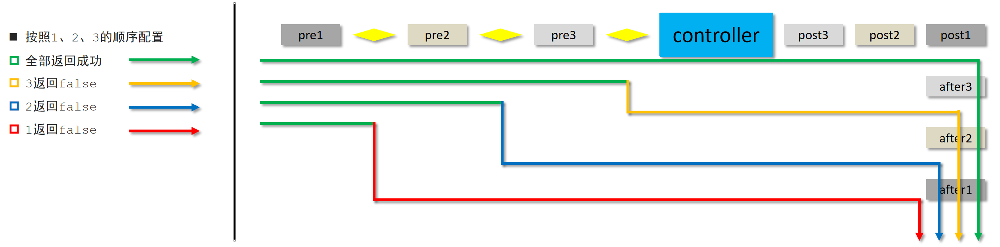

# 1.Maven依赖

```xml
<dependencies>
    <dependency>
        <groupId>javax.servlet</groupId>
        <artifactId>javax.servlet-api</artifactId>
        <version>3.1.0</version>
        <scope>provided</scope>
    </dependency>
    <dependency>
        <groupId>org.springframework</groupId>
        <artifactId>spring-webmvc</artifactId>
        <version>5.2.10.RELEASE</version>
    </dependency>
</dependencies>
```

导入spring-webmvc坐标自动依赖spring相关坐标


# 2.通用步骤

**①定义Controller类**

```java
//定义表现层控制器bean
@Controller
public class UserController {
    //设置映射路径为/save，即外部访问路径
    @RequestMapping("/save")
    //设置当前操作返回结果为指定json数据（本质上是一个字符串信息）
    @ResponseBody
    public String save(){
        System.out.println("user save ...");
        return "{'info':'springmvc'}";
    }
}
```

**②编写SpringMVC配置类，并且配置@ComponentScan扫描Controller类所在的包**

```java
//springmvc配置类，本质上还是一个spring配置类
@Configuration
@ComponentScan("com.itheima.controller")
public class SpringMvcConfig {
}
```

**SpringMVC负责表现层，Spring负责业务层和数据访问层。所以Spring的配置类中的@ComponentScan扫描的范围一般要跟SpringMVC配置类的扫描范围区分开。**

或者在Spring配置类中的@ComponentScan注解中添加**excludeFilters属性**，排除掉SpringMVC所管理的类：

```java
@Configuration
//如下注解表示扫描com.itheima包及其子包中的组件，但是排除掉添加了@Controller注解的类。
@ComponentScan(value = "com.itheima",
               excludeFilters = @ComponentScan.Filter(
                   type = FilterType.ANNOTATION,
                   classes = Controller.class
               )
              )
public class SpringConfig {
}


// 注意 ：使用这种方法时，下面的 @Configuration不能加，否则Spring又会把controller包下的bean扫描到。
//@Configuration
@ComponentScan({"com.itheima.controller"})
public class SpringMVCConfig {

}
```

**③创建一个AbstractDispatcherServletInitializer抽象类的子类**

```java
public class ServletContainersInitConfig extends AbstractDispatcherServletInitializer { 
    //这个是加载SpringMVC配置类的方法
    protected WebApplicationContext createServletApplicationContext() { 
        AnnotationConfigWebApplicationContext ctx = new AnnotationConfigWebApplicationContext();
        ctx.register(SpringMvcConfig.class);
        return ctx;  
    }  
    
    //这个是加载Spring配置类的方法
    protected WebApplicationContext createRootApplicationContext() {  
        AnnotationConfigWebApplicationContext ctx = new AnnotationConfigWebApplicationContext();      
        ctx.register(SpringConfig.class);        
        return ctx;  
    }   
    
    //设置由springmvc控制器处理的请求映射路径。设置为/表示拦截所有请求，任意请求都将转入到SpringMVC进行处理。
    protected String[] getServletMappings() { 
        return new String[]{"/"}; 
    }
}
```

**或者使用以下简化方式（推荐）**：

```java
public class ServletContainersInitConfig extends AbstractAnnotationConfigDispatcherServletInitializer{
    protected Class<?>[] getServletConfigClasses() {
        return new Class[]{SpringMvcConfig.class}
    };
    protected String[] getServletMappings() {
        return new String[]{"/"};
    }
    protected Class<?>[] getRootConfigClasses() {
        return new Class[]{SpringConfig.class};
    }
}
```

**④把项目打包放进Tomcat等容器中部署运行即可**


# 3.注解

## @Controller

- 类型：类注解
- 位置：SpringMVC控制器类定义上方
- 作用：设定SpringMVC的核心控制器bean


## @RestController

- 类型：类注解
- 位置：基于SpringMVC的RESTful开发控制器类定义上方
- 作用：设置当前控制器类为RESTful风格，**等同于@Controller与@ResponseBody两个注解组合功能**


## @RequestMapping

- 类型：**方法、类注解**
- 位置：SpringMVC控制器类或者方法定义上方
- 作用：设置当前控制器方法请求访问路径。如果设置在**类**上，统一设置当前控制器方法**请求访问路径前缀**

```java
@Controller
//类上方配置的请求映射与方法上面配置的请求映射连接在一起，形成完整的请求映射路径
@RequestMapping("/user")
public class UserController {
    //请求路径映射
    @RequestMapping("/save") //此时save方法的访问路径是：/user/save
    @ResponseBody
    public String save(){
        System.out.println("user save ...");
        return "{'module':'user save'}";
    }
}
```

**method属性：** 指定请求的HTTP方法类型：例如：

`@RequestMapping(value = "/users",method = RequestMethod.POST)`

上述方式等价于下面这种简写：

`@PostMapping("/users")`


### @xxxMapping

**xxx为：Get、Post、Put、Delete等** 该注解等价于 指定了相应method属性的@RequestMapping注解


## @RequestHeader

方法参数注解，用用于获取请求头

```java
@PostMapping
public String saveAvatar(MultipartFile avatarFile,@RequestHeader("Authorization")String token) throws IOException {}
```


## @ResponseBody

- 类型：方法、类注解
- 位置：SpringMVC控制器类或方法定义上方
- 作用：设置当前控制器方法返回值为请求的响应体。如果设置在类上，则表示给该类中所有方法添加该注解

对于SpringMVC而言，没有加该注解的Controller方法返回值默认表示要跳转的页面，没有对应的页面就会报错。如果不想跳转页面而是响应数据，那么就需要在方法上使用**@ResponseBody注解**。


## @RequestParam

- 类型：形参注解
- 位置：SpringMVC控制器方法形参定义前面
- 作用：绑定请求参数与处理器方法形参间的关系
- 属性：
  - **value**：HTTP请求参数的名称
  - **required**：是否为必传参数，true：如果请求中没有该参数会抛异常
  - **defaultValue**：参数默认值

**当请求参数名与形参变量名不同**，使用**@RequestParam**绑定参数关系

```java
//普通参数：请求参数名与形参名不同时，使用@RequestParam注解关联请求参数名称与形参名称之间的关系
@RequestMapping("/commonParamDifferentName")
@ResponseBody
public String commonParamDifferentName(@RequestParam("name") String userName , int age){
    System.out.println("普通参数传递 userName ==> "+userName);
    System.out.println("普通参数传递 age ==> "+age);
    return "{'module':'common param different name'}";
}
```

@RequestParam用于接收**url地址传参**，**表单传参**【application/x-www-form-urlencoded】


## @EnableWebMvc

如果要想把POST请求中携带的JSON数据转换为Java对象、传递日期类型的参数、发送JSON数据给客户端等，就必须在SpringMvc配置类上添加该注解。


## @RequestBody

- 类型：形参注解
- 位置：SpringMVC控制器方法形参定义前面
- 作用：将请求中请求体所包含的数据（一般是JSON数据）解析后传递给请求参数，此注解一个处理器方法只能使用一次。

@RequestBody用于接收**json数据**【application/json】


## @DateTimeFormat

- 类型：**==形参注解==**
- 位置：SpringMVC控制器方法形参前面
- 作用：设定日期时间型数据格式
- 属性：**pattern**：指定日期时间格式字符串

**传递日期类型参数必须在配置类上使用@EnableWebMvc注解**

```java
@RequestMapping("/dataParam")
@ResponseBody
public String dataParam(Date date,
                  @DateTimeFormat(pattern="yyyy-MM-dd") Date date1,
                  @DateTimeFormat(pattern="yyyy/MM/dd HH:mm:ss") Date date2){
    System.out.println("参数传递 date ==> "+date);
    System.out.println("参数传递 date1(yyyy-MM-dd) ==> "+date1);
    System.out.println("参数传递 date2(yyyy/MM/dd HH:mm:ss) ==> "+date2);
    return "{'module':'data param'}";
}
```


## @PathVariable

- 类型：形参注解
- 位置：SpringMVC控制器方法形参定义前面
- 作用：绑定路径参数与处理器方法形参间的关系，要求**路径参数名**与**形参名**一一对应

**value属性**：如果路径参数名和形参名不一致，设置该属性值为路径参数名


# 4.获取普通请求参数

获取GET请求URL中的参数或者POST请求中的表单参数。

## **POST请求中文乱码处理**

我们发现，**POST请求**传递的参数如果包含中文那么就会出现中文乱码问题，解决方法：

```java
public class ServletContainersInitConfig extends AbstractAnnotationConfigDispatcherServletInitializer {
    protected Class<?>[] getRootConfigClasses() {
        return new Class[0];
    }

    protected Class<?>[] getServletConfigClasses() {
        return new Class[]{SpringMvcConfig.class};
    }

    protected String[] getServletMappings() {
        return new String[]{"/"};
    }

    //乱码处理。设置字符编码过滤器
    @Override
    protected Filter[] getServletFilters() {
        CharacterEncodingFilter filter = new CharacterEncodingFilter();
        filter.setEncoding("UTF-8");
        return new Filter[]{filter};
    }
}
```


## 五种类型参数传递

### 普通参数

获取GET请求中URL参数和POST请求中的普通参数是一样的：

```java
//普通参数：请求参数名与形参名称对应即可完成参数传递
@RequestMapping("/commonParam")
@ResponseBody
public String commonParam(String name ,int age){
    System.out.println("普通参数传递 name ==> "+name);
    System.out.println("普通参数传递 age ==> "+age);
    return "{'module':'common param'}";
}
```

**当请求参数名与形参变量名不同**，使用**@RequestParam**绑定参数关系


### POJO类型参数

POJO参数：**请求参数名**与**形参对象属性名**相同，定义POJO类型形参即可接收参数


```java
public class User {
    private String name;
    private int age;
    //同学们自己添加getter/setter/toString()方法
}
```

```java
//POJO参数：请求参数与形参对象中的属性对应即可完成参数传递
@RequestMapping("/pojoParam")
@ResponseBody
public String pojoParam(User user){
    System.out.println("pojo参数传递 user ==> "+user);
    return "{'module':'pojo param'}";
}
```

**注意事项：请求参数key的名称要和POJO中属性的名称一致，否则无法封装。**


### **嵌套POJO类型参数**

POJO对象中包含POJO对象

```java
public class User {
    private String name;
    private int age;
    private Address address;
    //同学们自己添加getter/setter/toString()方法
}
public class Address {
    private String province;
    private String city;
    private Address address;
}
```

嵌套POJO参数：**请求参数名**与**形参对象属性名**相同，按照对象层次结构关系即可接收嵌套POJO属性参数


```java
//嵌套POJO参数：嵌套属性按照层次结构设定名称即可完成参数传递
@RequestMapping("/pojoContainPojoParam")
@ResponseBody
public String pojoContainPojoParam(User user){
    System.out.println("pojo嵌套pojo参数传递 user ==> "+user);
    return "{'module':'pojo contain pojo param'}";
}
```

**==注意事项：请求参数key的名称要和POJO中属性的名称一致，否则无法封装。==**


### 数组类型参数

数组参数：**请求参数名**与**形参名**相同且请求参数为多个，定义**数组类型**即可接收参数


```java
//数组参数：同名请求参数可以直接映射到对应名称的形参数组对象中
@RequestMapping("/arrayParam")
@ResponseBody
public String arrayParam(String[] likes){
    System.out.println("数组参数传递 likes ==> "+ Arrays.toString(likes));
    return "{'module':'array param'}";
}
```


### 集合类型参数

集合保存普通参数：**请求参数名**与**形参集合对象名**相同且请求参数为多个，如果想要映射为集合类型，**必须使用@RequestParam**绑定参数关系


```java
//集合参数：同名请求参数可以使用@RequestParam注解映射到对应名称的集合对象中作为数据
@RequestMapping("/listParam")
@ResponseBody
public String listParam(@RequestParam List<String> likes){
    System.out.println("集合参数传递 likes ==> "+ likes);
    return "{'module':'list param'}";
}
```

## 获取日期类型参数

如果请求参数中含有日期字符串，可以直接用java.util.Date类型的形参来接收：

默认格式是 `yyyy/MM/dd` ，如果参数中的字符串是其他格式，可以使用**@DateTimeFormat注解** 来指定转换格式：


```java
//日期参数 http://localhost:80/dataParam?date=2088/08/08&date1=2088-08-18&date2=2088/08/28 8:08:08
//使用@DateTimeFormat注解设置日期类型数据格式，默认格式yyyy/MM/dd
@RequestMapping("/dataParam")
@ResponseBody
public String dataParam(Date date,
                  @DateTimeFormat(pattern="yyyy-MM-dd") Date date1,
                  @DateTimeFormat(pattern="yyyy/MM/dd HH:mm:ss") Date date2){
    System.out.println("参数传递 date ==> "+date);
    System.out.println("参数传递 date1(yyyy-MM-dd) ==> "+date1);
    System.out.println("参数传递 date2(yyyy/MM/dd HH:mm:ss) ==> "+date2);
    return "{'module':'data param'}";
}
```

**传递日期类型参数必须在配置类上使用@EnableWebMvc注解**


## 获取URL路径参数

使用 **@PathVariable 注解**




# 5.接收JSON格式请求数据

获取POST请求中JSON格式的参数

1. 添加json数据转换相关坐标

```xml
<dependency>
    <groupId>com.fasterxml.jackson.core</groupId>
    <artifactId>jackson-databind</artifactId>
    <version>2.9.0</version>
</dependency>
```

2. SpringMvc配置类上添加**@EnableWebMvc注解**

```java
@Configuration
@ComponentScan("com.itheima.controller")
//开启json数据类型自动转换
@EnableWebMvc
public class SpringMvcConfig {
}
```

3. 在Controller中编写方法接收JSON格式转换后的参数，使用**@RequestBody注解**


**传递json集合**



```java
//集合参数：json格式
//1.开启json数据格式的自动转换，在配置类中开启@EnableWebMvc
//2.使用@RequestBody注解将外部传递的json数组数据映射到形参的集合对象中作为数据
@RequestMapping("/listParamForJson")
@ResponseBody
public String listParamForJson(@RequestBody List<String> likes){
    System.out.println("list common(json)参数传递 list ==> "+likes);
    return "{'module':'list common for json param'}";
}
```


**传递Json对象**

- POJO参数：json数据与形参对象属性名相同，定义POJO类型形参即可接收参数。**POJO类型一定要有无参构造方法。**


```java
//POJO参数：json格式
//1.开启json数据格式的自动转换，在配置类中开启@EnableWebMvc
//2.使用@RequestBody注解将外部传递的json数据映射到形参的实体类对象中，要求属性名称一一对应
@RequestMapping("/pojoParamForJson")
@ResponseBody
public String pojoParamForJson(@RequestBody User user){
    System.out.println("pojo(json)参数传递 user ==> "+user);
    return "{'module':'pojo for json param'}";
}
```


**传递json对象数组**

- POJO集合参数：json数组数据与集合泛型属性名相同，定义List类型形参即可接收参数


```java
//集合参数：json格式
//1.开启json数据格式的自动转换，在配置类中开启@EnableWebMvc
//2.使用@RequestBody注解将外部传递的json数组数据映射到形参的保存实体类对象的集合对象中，要求属性名称一一对应
@RequestMapping("/listPojoParamForJson")
@ResponseBody
public String listPojoParamForJson(@RequestBody List<User> list){
    System.out.println("list pojo(json)参数传递 list ==> "+list);
    return "{'module':'list pojo for json param'}";
}
```


# 6.发送响应

## 响应页面

如果没有给方法添加**@ResponseBody注解**那么方法的String返回值就表示页面的路径，把该路径的页面作为响应体返回给客户端。

```java
@Controller
public class UserController {
    //响应页面/跳转页面
    //返回值为String类型，设置返回值为页面名称，即可实现页面跳转
    @RequestMapping("/toJumpPage")
    public String toJumpPage(){
        System.out.println("跳转页面");
        return "page.jsp";
    }
}
```

## 响应文本数据

如果在Controller方法上加了@ResponseBody，那么方法的返回值就直接作为响应体。

```java
//响应文本数据
//返回值为String类型，设置返回值为任意字符串信息，即可实现返回指定字符串信息，需要依赖@ResponseBody注解
@RequestMapping("/toText")
@ResponseBody
public String toText(){
    System.out.println("返回纯文本数据");
    return "response text";
}
```

## 响应JSON格式的数据

```java
//响应POJO对象
//设置返回值为实体类类型，即可实现返回对应对象的Json数据，需要依赖@ResponseBody注解和@EnableWebMvc注解
@RequestMapping("/toJsonPOJO")
@ResponseBody
public User toJsonPOJO(){
    System.out.println("返回json对象数据");
    User user = new User();
    user.setName("itcast");
    user.setAge(15);
    return user;
}
```

```java
//响应POJO集合对象
//设置返回值为集合类型，即可实现返回对应集合的Json数组数据，需要依赖@ResponseBody注解和@EnableWebMvc注解
@RequestMapping("/toJsonList")
@ResponseBody
public List<User> toJsonList(){
    System.out.println("返回json集合数据");
    User user1 = new User();
    user1.setName("传智播客");
    user1.setAge(15);

    User user2 = new User();
    user2.setName("黑马程序员");
    user2.setAge(12);

    List<User> userList = new ArrayList<User>();
    userList.add(user1);
    userList.add(user2);

    return userList;
}
```

**注意：需要添加jackson-databind依赖以及在SpringMvcConfig配置类上添加@EnableWebMvc注解**


## ResponseEntity\<T\>

使用这个类可以快速构建响应。

例如静态方法 **ResponseEntity.ok** 可以快速构建一个HTTP响应，响应状态码为200，响应体就是ok方法的参数，参数是pojo对象，那么会转换为JSON字符串作为响应体。

```java
@GetMapping("/1")
public ResponseEntity get(){
	return ResponseEntity.ok(new User("张三",12));
}
```

其他用法可以参见文档


# 7.RESTful

按照REST风格访问资源时使用 **行为动作** 区分对资源进行了何种操作
http://localhost/users		查询全部用户信息					**GET（查询）**
http://localhost/users/1		查询指定用户信息				**GET（查询）**
http://localhost/users		添加用户信息							**POST（新增/保存）**
http://localhost/users		修改用户信息							**PUT（修改/更新）**
http://localhost/users/1		删除用户信息						**DELETE（删除）**

- 上述行为是**约定方式**，约定不是规范，可以打破，所以称**REST风格**，而不是REST规范

- 描述模块的名称通常使用复数，也就是加s的格式描述，表示此类资源，而非单个资源，例如：users、books、accounts……


# 8.静态资源映射

如果项目中含有静态资源，由于没有在Controller中为其设置映射路径，所以直接请求会报404。

解决方法：

编写一个配置类（加上@Configuration注解。通过@ComponentScan扫描把它加入到容器中），继承**WebMvcConfigurationSupport类** ，然后重写**addResourceHandlers方法**。

```java
@Configuration
public class SpringMvcSupport extends WebMvcConfigurationSupport {
    //设置静态资源映射，当前类需要设置为配置类，并被扫描加载
    @Override
    protected void addResourceHandlers(ResourceHandlerRegistry registry) {
        //当访问路径为/pages/*时，从/pages目录下查找内容
        registry.addResourceHandler("/pages/**")
            .addResourceLocations("/pages/");
        registry.addResourceHandler("/js/**")
            .addResourceLocations("/js/");        		
        registry.addResourceHandler("/css/**")
            .addResourceLocations("/css/");       
        registry.addResourceHandler("/plugins/**")
            .addResourceLocations("/plugins/");
    }
}
```

**WebMvcConfigurationSupport类也可用于添加拦截器**


也可以让SpringMvc配置类实现**WebMvcConfigurer接口**，然后重写**addResourceHandlers方法**


# 9.统一异常处理器

项目各个层级（service层、dao层等）均可能出现异常，我们应当让**所有异常都抛到 <u>表现层（controller层）</u> 进行处理**。

统一异常处理的原理是使用的aop。

## @ControllerAdvice

类型：**类注解**

自带@Component

被它注解的类成为一个 Advice类（参见Spring-AOP），我们可以使用该类中的方法对Controller中的方法进行增强。

**通常我们使用它配合@ExceptionHandler来进行统一异常处理**，也就是上述所说的，把所有异常均抛到controller层，当Controller（被@Controller注解的类）发生异常时，**@ControllerAdvice类**中的**@ExceptionHandler方法**就会对异常进行相应的处理。


使用@ControllerAdvice可以将所有的@ExceptionHandler方法都集中在一个类中，统一处理项目中产生的异常

使用方式：

- `@ControllerAdvice` ：增强所有@Controller类（如果是用于异常处理，这句话的意思就是会对所有@Controller类进行统一异常处理）
- `@ControllerAdvice(annotaions={Controller.class})` ：只会增强添加了某些注解的类
- `ControllerAdvice(basePackages = "com.demo")` ：增强指定路径下的@Controller类


## @ExceptionHandler

类型：**方法注解**

加到处理相应异常的方法的上面。

**value属性**：指定当发生什么异常时调用该方法，出现相应异常后终止原始控制器执行，并转入当前方法执行


实例：

```java
@ControllerAdvice
public class ExceptionAdvice {
    //当Controller中的方法抛出IOException时进入该方法
    @ExceptionHandler(IOException.class)
    public String handler(IOException e){   //可以把异常通过参数传递过来
        //模拟记录日志
        System.out.println(e.getMessage());
        System.err.println("发生异常");
        //跳转到错误提示页面
        return "/html/err.html";
    }
}
```

上述类中可以定义多个 @ExceptionHandler方法，对不同的异常进行不同的处理。

**如果方法没有添加@ResponseBody，那么String类型的返回值指定的是资源（页面）的路径。如果希望方法的返回值作为响应体，那么可以添加@ReponseBody**


## @RestControllerAdvice

类型：**类注解**

此注解等同于**@ResponseBody注解**  + **@ControllerAdvice注解**

也就是说该类中所有方法的返回值作为响应体。


# 10.拦截器

## 概念



**拦截器（Interceptor）**是一种动态拦截方法调用的机制，在SpringMVC中动态**拦截控制器方法**的执行。

- 作用：

  1. 在指定的方法调用<u>前后</u>执行预先设定的代码
  2. 阻止原始方法的执行
  3. 总结：增强

- 核心原理：<u>AOP思想</u>

  

**拦截器和过滤器的区别**

Filter属于Servlet技术，Interceptor属于SpringMVC技术

Filter对**所有资源的访问**进行拦截，Interceptor仅针对**SpringMVC资源（例如Controller中的方法访问** 进行拦截




## 定义拦截器

做法：定义一个类，实现**HandlerInterceptor接口**即可，这个类一般放在 controller.interceptor包下。

```java
@Component //可以把它交给Spring容器来进行管理，后面注册拦截器的时候就可以直接注入。
//定义拦截器类，实现HandlerInterceptor接口
public class ProjectInterceptor implements HandlerInterceptor {
    @Override
    //原始方法调用前调用该方法
    //返回值类型可以控制请求是否通过，true放行，false终止
    public boolean preHandle(HttpServletRequest request, HttpServletResponse response, Object handler) throws Exception {
        System.out.println("preHandle..."+contentType);
        return true;
    }

    @Override
    //原始方法正常执行完后调用，如果发生异常，不会调用
    public void postHandle(HttpServletRequest request, HttpServletResponse response, Object handler, ModelAndView modelAndView) throws Exception {
        System.out.println("postHandle...");
    }

    @Override
    //原始方法调用完成后调用的方法。无论原始方法是否发生异常，都会调用，如果设置了异常处理器，该方法会在异常处理器方法后执行。
    public void afterCompletion(HttpServletRequest request, HttpServletResponse response, Object handler, Exception ex) throws Exception {
        System.out.println("afterCompletion...");
    }
}
```

### 拦截器方法参数解释

request和response不解释。

**handler：** 是一个 `org.springframework.web.method.HandlerMethod`对象，**HandlerMethod类**是对反射中的**Method类**的包装，表示的是**@Controller类中的方法**

**modelAndView**：如果处理器执行完成具有返回结果，可以读取到对应数据与页面信息，并进行跳转

**ex**:如果处理器执行过程中出现异常对象，可以针对异常情况进行单独处理

### 拦截器执行步骤




## **注册拦截器**

```java
@Configuration
public class SpringMvcSupport extends WebMvcConfigurationSupport {
    @Autowired
    private ProjectInterceptor projectInterceptor;

    @Override
    protected void addInterceptors(InterceptorRegistry registry) {
        //注册拦截器，addPathPatterns指定需要拦截的资源路径，以及不需要拦截的资源路径
        registry.addInterceptor(projectInterceptor)
            .addPathPatterns("/books","/books/*")
            .excludePathPatterns("/user");
    }
}
```

**WebMvcConfigurationSupport类** 也可用于配置静态资源的放行。


也可以让SpringMvc配置类实现**接口WebMvcConfigurer**简化开发：

```java
@Configuration
@EnableWebMvc
@ComponentScan("com.milk")
//实现WebMvcConfigurer接口可以简化开发，但具有一定的侵入性。
public class SpringMvcConfig implements WebMvcConfigurer {
    //设置静态资源放行
    @Override
    public void addResourceHandlers(ResourceHandlerRegistry registry) 	  {
        registry.addResourceHandler("/html/**")
                .addResourceLocations("/html/");
    }
	
    //注册拦截器
    @Override
    public void addInterceptors(InterceptorRegistry registry) {
        registry.addInterceptor(new DemoInterceptor())
                .addPathPatterns("/user");
    }
}
```


### 拦截器链 

可以通过**addInterceptors方法**，注册多个拦截器， 形成拦截器链。（只需要调用多次registry.addInterceptor方法即可）

拦截器链的运行顺序参照**拦截器添加顺序**（**addInterceptors方法**里的顺序）为准

拦截器链中，在前面的拦截器如果preHandle方法返回false，后面的拦截器的preHandle方法不会执行；而且所有拦截器的postHandle方法都不会执行；只有preHandle方法返回值为true的拦截器的afterCompletion方法才会执行。


