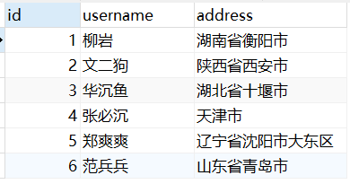
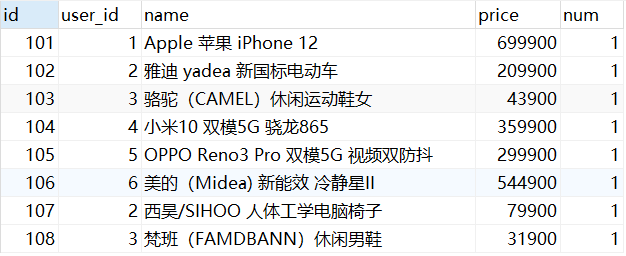
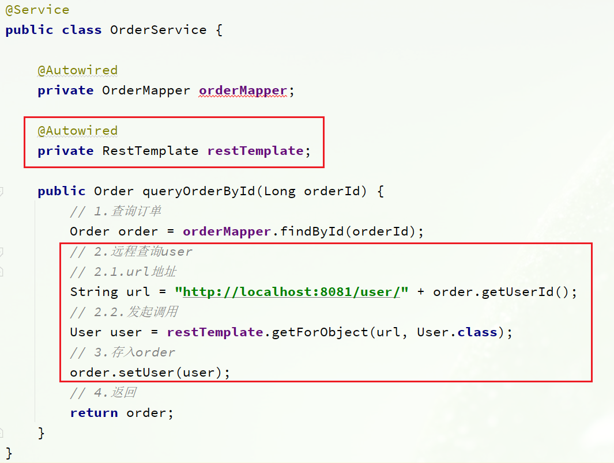

# 一.认识微服务

随着互联网行业的发展，对服务的要求也越来越高，服务架构也从单体架构逐渐演变为现在流行的微服务架构。这些架构之间有怎样的差别呢？

## 1. 单体架构

**单体架构**：将业务的所有功能集中在一个项目中开发，打成一个包部署。


单体架构的优缺点如下：

**优点：**

- 架构简单
- 部署成本低

**缺点：**

- 耦合度高（维护困难、升级困难）


## 2. 分布式架构

**分布式架构**：根据业务功能对系统做拆分，每个业务功能模块作为独立项目开发，称为一个**服务**。


分布式架构的优缺点：

**优点：**

- 降低服务耦合
- 有利于服务升级和拓展

**缺点：**

- 服务调用关系错综复杂


分布式架构虽然降低了服务耦合，但是服务拆分时也有很多问题需要思考：

- 服务拆分的粒度如何界定？
- 服务之间如何调用？
- 服务的调用关系如何管理？

人们需要制定一套行之有效的标准来约束分布式架构。


## 3. 微服务

**微服务**是一种经过良好架构设计的**分布式架构方案** 。

微服务的架构特征：

- **单一职责**：微服务拆分粒度更小，每一个服务都对应唯一的业务能力，做到单一职责
- **自治**：团队独立、技术独立、数据独立，独立部署和交付
- **面向服务**：服务提供统一标准的接口，与语言和技术无关
- **隔离性强**：服务调用做好隔离、容错、降级，避免出现级联问题


微服务的上述特性其实是在给分布式架构制定一个标准，进一步降低服务之间的耦合度，提供服务的独立性和灵活性。做到高内聚，低耦合。


但方案该怎么落地？选用什么样的技术栈？全球的互联网公司都在积极尝试自己的微服务落地方案。

其中在Java领域最引人注目的就是SpringCloud提供的方案了。

## 4. SpringCloud

**SpringCloud**是目前国内使用最广泛的微服务框架。官网地址：https://spring.io/projects/spring-cloud。

SpringCloud集成了各种微服务功能组件，并基于SpringBoot实现了这些组件的自动装配，从而提供了良好的开箱即用体验。

其中常见的组件包括：


另外，SpringCloud底层是依赖于SpringBoot的，并且有版本的兼容关系，如下：


**我们课堂学习的版本是 Hoxton.SR10，因此对应的SpringBoot版本是2.3.x版本。**


## 5. 总结

- **单体架构**：简单方便，高度耦合，扩展性差，适合小型项目。例如：学生管理系统

- **分布式架构**：松耦合，扩展性好，但架构复杂，难度大。适合大型互联网项目，例如：京东、淘宝

- **微服务**：一种良好的分布式架构方案

  ①优点：拆分粒度更小、服务更独立、耦合度更低

  ②缺点：架构非常复杂，运维、监控、部署难度提高

- **SpringCloud**是微服务架构的一站式解决方案，集成了各种优秀微服务功能组件


# 二.服务拆分和远程调用

任何分布式架构都离不开服务的拆分，微服务也是一样。

## 1. 服务拆分原则

这里我总结了微服务拆分时的几个原则：

- **不同微服务，不要重复开发相同业务**
- **微服务数据独立，不要访问其它微服务的数据库**
- **微服务可以将自己的业务暴露为接口，供其它微服务调用**


## 2. 服务拆分示例

以课前资料中的微服务cloud-demo为例，其结构如下：


cloud-demo：父工程，管理依赖

- order-service：订单微服务，负责订单相关业务
- user-service：用户微服务，负责用户相关业务

要求：

- 订单微服务和用户微服务都必须有各自的数据库，相互独立
- 订单服务和用户服务都对外暴露Restful的接口
- 订单服务如果需要查询用户信息，只能调用用户服务的Restful接口，不能查询用户数据库


### 2.1 导入Sql语句

首先，将课前资料提供的`cloud-order.sql`和`cloud-user.sql`导入到mysql中：

**cloud-user表**中初始数据如下：



**cloud-order表**中初始数据如下：




cloud-order表中持有cloud-user表中的id字段。


### 2.2 导入demo工程

用IDEA导入课前资料提供的Demo：

项目结构如下：


导入后，会在IDEA右下角出现弹窗：


点击弹窗，然后按下图选择：


会出现这样的菜单：


配置下项目使用的JDK：


## 3. 实现远程调用案例


在**order-service服务**中，有一个根据id查询订单的接口：


根据id查询订单，返回值是Order对象，如图：


其中的user为null


在**user-service**中有一个根据id查询用户的接口：


查询的结果如图：


### 3.1 案例需求：

修改**order-service**中的根据id查询订单业务，要求在查询订单的同时，根据订单中包含的userId查询出用户信息，一起返回。


因此，**我们需要在order-service中 向user-service发起一个http的请求**，调用`http://localhost:8081/user/{userId`}这个接口。

大概的步骤是这样的：

- 注册一个**RestTemplate**的实例到Spring容器
- 修改order-service服务中的OrderService类中的queryOrderById方法，根据Order对象中的userId查询User
- 将查询的User填充到Order对象，一起返回


### 3.2 注册RestTemplate

首先，我们在**order-service服务**中的**OrderApplication启动类**中，**注册RestTemplate实例**：

```java
package cn.itcast.order;

import org.mybatis.spring.annotation.MapperScan;
import org.springframework.boot.SpringApplication;
import org.springframework.boot.autoconfigure.SpringBootApplication;
import org.springframework.context.annotation.Bean;
import org.springframework.web.client.RestTemplate;

@MapperScan("cn.itcast.order.mapper")
@SpringBootApplication
public class OrderApplication {

    public static void main(String[] args) {
        SpringApplication.run(OrderApplication.class, args);
    }

    @Bean
    public RestTemplate restTemplate() {
        return new RestTemplate();
    }
}
```


### 3.3 实现远程调用

修改order-service服务中的cn.itcast.order.service包下的**OrderService类**中的queryOrderById方法：




## 4. 提供者与消费者

在服务调用关系中，会有两个不同的角色：

**服务提供者**：一次业务中，**被**其它微服务调用的服务。（提供接口给其它微服务）

**服务消费者**：一次业务中，**调用**其它微服务的服务。（调用其它微服务提供的接口）


但是，**服务提供者与服务消费者的角色并不是绝对的**，而是相对于业务而言。

如果服务A调用了服务B，而服务B又调用了服务C，服务B的角色是什么？

- 对于A调用B的业务而言：A是服务消费者，B是服务提供者
- 对于B调用C的业务而言：B是服务消费者，C是服务提供者


因此，服务B既可以是服务提供者，也可以是服务消费者。


# 三.Eureka注册中心


假如我们的服务提供者user-service部署了多个实例，如图：


大家思考几个问题：

- order-service在发起远程调用的时候，该如何得知user-service实例的ip地址和端口？
- 有多个user-service实例地址，order-service调用时该如何选择？
- order-service如何得知某个user-service实例是否依然健康，是不是已经宕机？


## 1. Eureka的结构和作用

这些问题都需要利用SpringCloud中的**注册中心**来解决，其中最广为人知的注册中心就是**Eureka**，其结构如下：


回答之前的各个问题。

**问题1：order-service（消费者）如何得知user-service（提供者）实例地址？**

获取地址信息的流程如下：

- user-service（提供者）服务实例启动后，将自己的信息注册到**eureka-server（Eureka服务端）**。这个叫**服务注册**
- eureka-server保存 **服务名称** 到 **服务实例地址列表** 的映射关系
- order-service（消费者）根据服务名称，拉取实例地址列表。这个叫**服务发现或服务拉取**


**问题2：order-service（消费者）如何从多个user-service（提供者）实例中选择具体的实例？**

- order-service（消费者）从实例列表中利用**负载均衡算法**选中一个实例地址
- 向该实例地址发起远程调用


**问题3：order-service（消费者）如何得知某个user-service（提供者）实例是否依然健康，是不是已经宕机？**

- user-service（提供者）会每隔一段时间（默认30秒）向eureka-server发起请求，报告自己状态，称为**心跳**
- 当超过一定时间没有发送心跳时，eureka-server会认为微服务实例故障，将该实例从服务列表中剔除
- order-service（消费者）拉取服务时，就能将故障实例排除了


**注意：**一个微服务，既可以是服务提供者，又可以是服务消费者，因此eureka将服务注册、服务发现等功能统一封装到了eureka-client端


因此，接下来我们动手实践的步骤包括：


## 2. 搭建eureka-server

首先大家注册中心服务端：eureka-server，这必须是一个独立的微服务

### 2.1 创建eureka-server服务

在cloud-demo父工程下，创建一个子模块：


填写模块信息：


然后填写服务信息：


### 2.2 引入eureka依赖

引入SpringCloud为eureka提供的starter依赖：

```xml
<dependency>
    <groupId>org.springframework.cloud</groupId>
    <artifactId>spring-cloud-starter-netflix-eureka-server</artifactId>
    <!--注意这里的依赖名为 xxx-server!!-->
</dependency>
```


### 2.3 编写启动类

给eureka-server服务编写一个启动类，一定要添加一个**@EnableEurekaServer注解**，开启eureka的注册中心功能：

```java
package cn.itcast.eureka;

import org.springframework.boot.SpringApplication;
import org.springframework.boot.autoconfigure.SpringBootApplication;
import org.springframework.cloud.netflix.eureka.server.EnableEurekaServer;

@SpringBootApplication
@EnableEurekaServer
public class EurekaApplication {
    public static void main(String[] args) {
        SpringApplication.run(EurekaApplication.class, args);
    }
}
```


### 2.4 编写配置文件

编写一个application.yml文件，内容如下：

```yaml
server:
  port: 10086
spring:
  application:
    name: eureka-server
eureka:
  client:
    service-url: 
      defaultZone: http://127.0.0.1:10086/eureka
```


### 2.5 启动服务

启动微服务，然后在浏览器访问：`http://127.0.0.1:10086`

看到下面结果应该是成功了：


## 3. 服务注册

下面，我们将user-service注册到eureka-server中去。

### 1）引入依赖

在user-service的pom文件中，引入下面的eureka-client依赖：

```xml
<dependency>
    <groupId>org.springframework.cloud</groupId>
    <artifactId>spring-cloud-starter-netflix-eureka-client</artifactId>
    <!--注意这里的依赖名为 xxx-client!!-->
</dependency>
```


### 2）配置文件

在user-service中，修改application.yml文件，添加服务名称、eureka地址：

```yaml
spring:
  application:
    name: userservice
eureka:
  client:
    service-url:
      defaultZone: http://127.0.0.1:10086/eureka
```


### 3）启动多个user-service实例

为了演示一个服务有多个实例的场景，我们添加一个SpringBoot的启动配置，再启动一个user-service。


首先，复制原来的user-service启动配置：


然后，在弹出的窗口中，填写信息：


现在，SpringBoot窗口会出现两个user-service启动配置：


不过，第一个是8081端口，第二个是8082端口。

启动两个user-service实例：


查看eureka-server管理页面：


## 4. 服务发现

下面，我们将order-service的逻辑修改：向eureka-server拉取user-service的信息，实现服务发现。

### 1）引入依赖

之前说过，**服务发现、服务注册统一都封装在eureka-client依赖**，因此这一步与服务注册时一致。

在order-service的pom文件中，引入下面的eureka-client依赖：

```xml
<dependency>
    <groupId>org.springframework.cloud</groupId>
    <artifactId>spring-cloud-starter-netflix-eureka-client</artifactId>
</dependency>
```


### 2）配置文件

服务发现也需要知道eureka地址，因此第二步与服务注册一致，都是配置eureka信息：

在order-service中，修改application.yml文件，添加服务名称、eureka地址：

```yaml
spring:
  application:
    name: orderservice
eureka:
  client:
    service-url:
      defaultZone: http://127.0.0.1:10086/eureka
```


### 3）服务拉取和负载均衡

最后，我们要去eureka-server中拉取user-service服务的实例列表，并且实现负载均衡。

不过这些动作不用我们去做，只需要添加一些注解即可。


在order-service的OrderApplication中，给**RestTemplate**这个Bean添加一个**@LoadBalanced注解**：


修改order-service服务中的cn.itcast.order.service包下的OrderService类中的queryOrderById方法。修改访问的url路径，**用服务名代替ip、端口**：


spring会自动帮助我们从eureka-server端，根据userservice这个服务名称，获取实例列表，而后完成负载均衡。


# 四.Ribbon负载均衡

上一节中，我们添加了**@LoadBalanced注解**，即可实现负载均衡功能，这是什么原理呢？


## 1. 负载均衡原理

SpringCloud底层其实是利用了一个名为**Ribbon的组件，来实现负载均衡功能的**。


那么我们发出的请求明明是`http://userservice/user/1`，怎么变成了`http://localhost:8081`的呢？


## 2. 源码跟踪

为什么我们只输入了service名称就可以访问了呢？之前还要获取ip和端口。

显然有人帮我们根据service名称，获取到了服务实例的ip和端口。它就是**LoadBalancerInterceptor**，这个类会在对**RestTemplate**的请求进行拦截，然后从Eureka根据服务id获取服务列表，随后利用负载均衡算法得到真实的服务地址信息，替换服务id。

我们进行源码跟踪：

### 1）LoadBalancerIntercepor


可以看到这里的**intercept方法**，拦截了用户的HttpRequest请求，然后做了几件事：

- `request.getURI()`：获取请求uri，本例中就是 `http://user-service/user/8`
- `originalUri.getHost()`：获取uri路径的主机名，其实就是服务id，`user-service`
- `this.loadBalancer.execute()`：处理服务id，和用户请求。

这里的`this.loadBalancer`是`LoadBalancerClient`类型，我们继续跟入。


### 2）LoadBalancerClient

继续跟入execute方法：


代码是这样的：

- `getLoadBalancer(serviceId)`：根据服务id获取**ILoadBalancer**，而**ILoadBalancer**会拿着服务id去eureka中获取服务列表并保存起来。
- **getServer(loadBalancer)**：利用内置的负载均衡算法，从服务列表中选择一个。本例中，可以看到获取了8082端口的服务


放行后，再次访问并跟踪，发现获取的是8081：

 

果然实现了负载均衡。


### 3）负载均衡策略IRule

在刚才的代码中，可以看到获取服务使通过一个`getServer`方法来做负载均衡:

 

我们继续跟入：


继续跟踪源码`chooseServer方法`，发现这么一段代码：

 

我们看看这个`rule`是谁：

 

这里的rule默认值是一个`RoundRobinRule`，看类的介绍：

 

这不就是轮询的意思嘛。

到这里，整个负载均衡的流程我们就清楚了。


### 4）总结

Ribbon的底层采用了一个拦截器，拦截了RestTemplate发出的请求，对地址做了修改。用一幅图来总结一下：


基本流程如下：

- 拦截我们的RestTemplate请求`http://userservice/user/1`
- **RibbonLoadBalancerClient**会从请求url中获取服务名称，也就是user-service
- **DynamicServerListLoadBalancer**根据user-service到eureka拉取服务列表
- eureka返回列表，localhost:8081、localhost:8082
- **IRule**利用内置负载均衡规则，从列表中选择一个，例如localhost:8081
- **RibbonLoadBalancerClient**修改请求地址，用localhost:8081替代userservice，得到`http://localhost:8081/user/1`，发起真实请求


## 3. 负载均衡策略

### 3.1 负载均衡策略

负载均衡的规则都定义在**IRule接口**中，而**IRule**有很多不同的实现类：


不同规则的含义如下：

| **内置负载均衡规则类**    | **规则描述**                                                 |
| ------------------------- | ------------------------------------------------------------ |
| RoundRobinRule            | 简单轮询服务列表来选择服务器。它是Ribbon默认的负载均衡规则。 |
| AvailabilityFilteringRule | 对以下两种服务器进行忽略：   （1）在默认情况下，这台服务器如果3次连接失败，这台服务器就会被设置为**“短路”状态**。短路状态将持续30秒，如果再次连接失败，短路的持续时间就会几何级地增加。  （2）并发数过高的服务器。如果一个服务器的并发连接数过高，配置了AvailabilityFilteringRule规则的客户端也会将其忽略。并发连接数的上限，可以由客户端的`<clientName>.<clientConfigNameSpace>.ActiveConnectionsLimit`属性进行配置。 |
| WeightedResponseTimeRule  | 为每一个服务器赋予一个权重值。服务器响应时间越长，这个服务器的权重就越小。这个规则会随机选择服务器，这个权重值会影响服务器的选择。 |
| **ZoneAvoidanceRule**     | 以区域可用的服务器为基础进行服务器的选择。使用Zone对服务器进行分类，这个**Zone**可以理解为一个机房、一个机架等。而后再**对Zone内的多个服务做轮询**。 |
| BestAvailableRule         | 忽略那些短路的服务器，并选择并发数较低的服务器。             |
| RandomRule                | 随机选择一个可用的服务器。                                   |
| RetryRule                 | 重试机制的选择逻辑                                           |


**默认的实现就是ZoneAvoidanceRule，是一种轮询方案**


### 3.2 自定义负载均衡策略

通过**定义IRule实现**可以修改负载均衡规则，有两种方式：

1. 代码方式：在order-service中的**OrderApplication类（启动类）**中（或者自己写一个配置类），定义一个新的IRule：

```java
@Bean
public IRule randomRule(){
    return new RandomRule();
}
```

这种方式是**全局生效**，也就是对于oder-service中的所有服务调用都采用这种负载均衡规则


2. 配置文件方式：在order-service的**application.yml文件**中，添加新的配置也可以修改规则：

```yaml
userservice: # 给某个微服务配置负载均衡规则，这里是userservice服务
  ribbon:
    NFLoadBalancerRuleClassName: com.netflix.loadbalancer.RandomRule # 负载均衡规则 
```

这种方式说明在**访问userservice这个微服务时**使用的负载均衡规则

**注意，一般用默认的负载均衡规则，不做修改。**


## 4. 饥饿加载

Ribbon默认是采用**懒加载**，即第一次发起请求时才会去创建LoadBalancerClient，造成第一次请求响应时间会很长。

而**饥饿加载**则会在项目启动时创建，降低第一次访问的耗时，通过在order-service中配置开启饥饿加载：

```yaml
ribbon:
  eager-load:
    enabled: true	#开启饥饿加载
    clients: userservice	#指定饥饿加载的服务名称
```

以上配置说明 在order-service中 访问userservice这个微服务时使用饥饿加载

**注意：**

​	上述配置中 `clients` 是一个集合，如果有多个微服务,那么需要如下配置：

```yml
ribbon:
  eager-load:
    enabled: true	#开启饥饿加载
    clients: 
      - service1
      - service2
```
