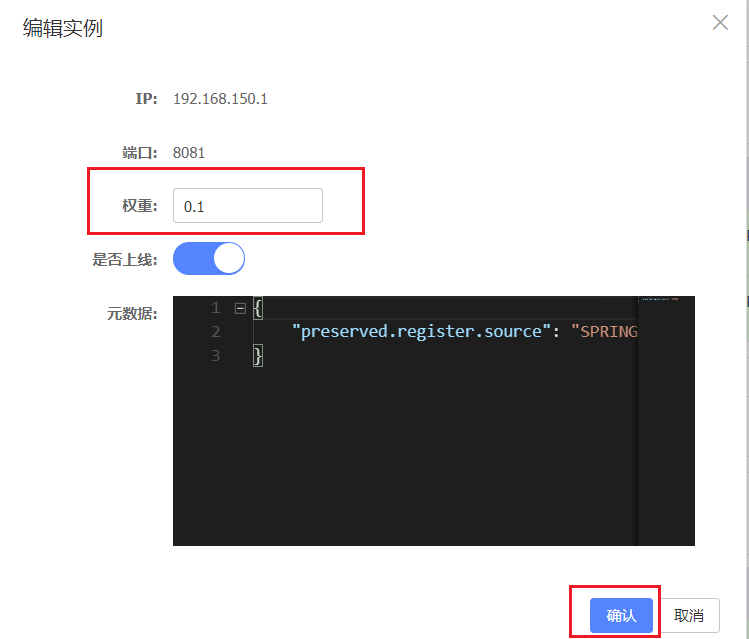
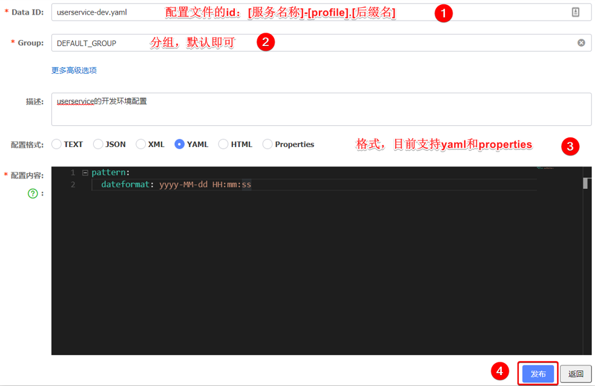
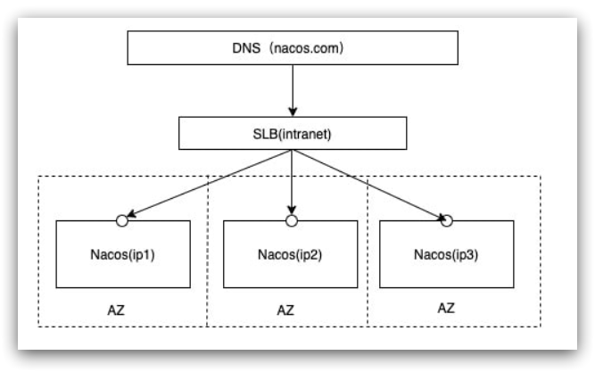
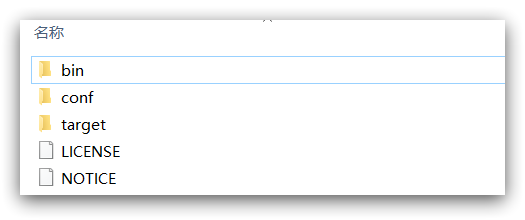
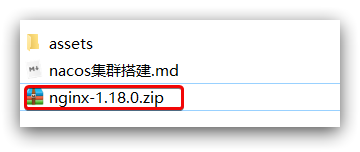

# 五.Nacos注册中心

国内公司一般都推崇阿里巴巴的技术，比如注册中心，SpringCloudAlibaba也推出了一个名为**Nacos**的注册中心。

## 1. 认识和安装Nacos

[Nacos](https://nacos.io/)是阿里巴巴的产品，现在是[SpringCloud](https://spring.io/projects/spring-cloud)中的一个组件。相比[Eureka](https://github.com/Netflix/eureka)功能更加丰富，在国内受欢迎程度较高。

安装方式可以参考课前资料《Nacos安装指南.md》


## 2. 服务注册到nacos

Nacos是SpringCloudAlibaba的组件，而SpringCloudAlibaba也遵循SpringCloud中定义的服务注册、服务发现规范。因此使用Nacos和使用Eureka对于微服务来说，并没有太大区别。

**主要差异**在于：

- 依赖不同
- 服务地址不同


### 1）引入依赖

在cloud-demo**父工程**的pom文件中的`<dependencyManagement>`中引入SpringCloudAlibaba的依赖：

```xml
<dependencyManagement>
    <dependencies>
        <dependency>
            <groupId>com.alibaba.cloud</groupId>
            <artifactId>spring-cloud-alibaba-dependencies</artifactId>
            <version>2.2.6.RELEASE</version>
            <type>pom</type>
            <scope>import</scope>
        </dependency>
    </dependencies>
</dependencyManagement>
```

然后在user-service和order-service中的pom文件中引入nacos-discovery依赖：

```xml
<dependency>
    <groupId>com.alibaba.cloud</groupId>
    <artifactId>spring-cloud-starter-alibaba-nacos-discovery</artifactId>
</dependency>
```


**注意**：不要忘了注释掉eureka的依赖。


### 2）配置nacos地址

在user-service和order-service的application.yml中添加nacos地址：

```yaml
spring:
  cloud:
    nacos:
      server-addr: localhost:8848
```


> **注意**：不要忘了注释掉eureka的地址


### 3）重启

重启微服务后，登录nacos管理页面，可以看到微服务信息：


## 3. 服务分级存储模型

一个**服务**可以有多个**实例**，例如我们的user-service，可以有:

- 127.0.0.1:8081
- 127.0.0.1:8082
- 127.0.0.1:8083

假如这些实例分布于全国各地的不同机房，例如：

- 127.0.0.1:8081，在上海机房
- 127.0.0.1:8082，在上海机房
- 127.0.0.1:8083，在杭州机房

Nacos就将同一机房内的实例 划分为一个**集群**。

也就是说，user-service是服务，一个服务可以包含多个集群，如杭州、上海，每个集群下可以有多个实例，形成分级模型，如图：


微服务互相访问时，应该尽可能访问同集群实例，因为本地访问速度更快。当本集群内不可用时，才访问其它集群。例如：


杭州机房内的order-service应该优先访问同机房的user-service。


### 3.1.配置集群

修改user-service的**application.yml文件**，添加集群配置：

```yaml
spring:
  cloud:
    nacos:
      server-addr: localhost:8848
      discovery:
        cluster-name: HZ # 集群名称
```

重启两个user-service实例后，我们可以在nacos控制台看到下面结果：


我们再次复制一个user-service启动配置，添加属性：

```sh
-Dserver.port=8083 -Dspring.cloud.nacos.discovery.cluster-name=SH
```

配置如图所示：


启动UserApplication3后再次查看nacos控制台：


### 3.2 同集群优先的负载均衡

默认的`ZoneAvoidanceRule`并不能实现根据同集群优先来实现负载均衡。

因此Nacos中提供了一个`IRule`的实现，可以优先从同集群中挑选实例。

1）给**order-service**配置集群信息

修改order-service的application.yml文件，添加集群配置：

```sh
spring:
  cloud:
    nacos:
      server-addr: localhost:8848
      discovery:
        cluster-name: HZ # 集群名称
```


2）修改负载均衡规则

修改order-service的application.yml文件，修改负载均衡规则：

```yaml
userservice:
  ribbon:
    NFLoadBalancerRuleClassName: com.alibaba.cloud.nacos.ribbon.NacosRule # 负载均衡规则 
```

#### NacosRule负载均衡策略

①优先选择同集群服务实例列表

②本地集群找不到提供者，才到其他集群寻找，并且会输出警告信息

③确定了可用实例列表后，再采用随机负载均衡规则选择实例


## 4. 权重配置

实际部署中会出现这样的场景：

服务器设备性能有差异，部分实例所在机器性能较好，另一些较差，我们希望性能好的机器承担更多的用户请求。

但**默认情况下NacosRule是同集群内随机挑选**，不会考虑机器的性能问题。


因此，Nacos提供了权重配置来控制访问频率，权重越大则访问频率越高。

**权重值在 0~1之间**

在nacos控制台，找到user-service的实例列表，点击编辑，即可修改权重：


在弹出的编辑窗口，修改权重：




**注意**：**如果权重修改为0，则该实例永远不会被访问**


## 5. 环境隔离

Nacos提供了**namespace**来实现**环境隔离功能**。

- nacos中可以有多个**namespace**
- namespace下可以有**group**、**service**等
- 不同namespace之间相互隔离，例如**不同namespace的服务互相不可见**


### 5.1 创建namespace

**默认情况下**，所有service、data、group都在同一个namespace，名为**public**：


我们可以点击页面新增按钮，添加一个namespace：


然后，填写表单：


就能在页面看到一个新的namespace：


### 5.2 给微服务配置namespace

给微服务配置namespace只能通过修改配置来实现。

例如，修改order-service的application.yml文件：

```yaml
spring:
  cloud:
    nacos:
      server-addr: localhost:8848
      discovery:
        cluster-name: HZ
        namespace: 492a7d5d-237b-46a1-a99a-fa8e98e4b0f9 # 命名空间，填命名空间的ID
```


重启order-service后，访问控制台，可以看到下面的结果：


此时访问order-service，因为namespace不同，会导致找不到userservice，控制台会报错：


## 6. Nacos与Eureka的区别

Nacos的服务实例分为两种类型：

- **临时实例**：如果实例宕机超过一定时间，会从服务列表剔除。**默认的类型**。

- **非临时实例**：如果实例宕机，不会从服务列表剔除，也可以叫**永久实例**。


### 配置非临时实例

**配置一个服务实例为永久实例**：

```yaml
spring:
  cloud:
    nacos:
      discovery:
        ephemeral: false # 设置为非临时实例
```


Nacos和Eureka整体结构类似：服务注册、服务拉取、心跳等待，但是也存在一些差异：


- Nacos与eureka的**共同点**
  - 都支持服务注册和服务拉取
  - 都支持服务提供者心跳方式做健康检测

- Nacos与Eureka的区别
  - Nacos支持服务端主动检测提供者状态：临时实例采用心跳模式，非临时实例采用主动检测模式
  - 临时实例心跳不正常会被剔除，非临时实例则不会被剔除
  - Nacos支持服务列表变更的消息推送模式，服务列表更新更及时。而eureka只支持定时拉去服务。
  - Nacos集群默认采用**AP方式**，当集群中存在非临时实例时，采用**CP模式**；Eureka采用AP方式


# 六.Nacos配置管理

Nacos除了可以做注册中心，同样可以做配置管理来使用。


## 1. 统一配置管理

当微服务部署的实例越来越多，达到数十、数百时，逐个修改微服务配置就会让人抓狂，而且很容易出错。我们需要一种统一配置管理方案，可以集中管理所有实例的配置。


Nacos一方面可以将**配置集中管理**，另一方可以在配置变更时，及时通知微服务，实现**配置的热更新**。


### 1.1 在nacos中添加配置文件

如何在nacos中管理配置呢？


然后在弹出的表单中，填写配置信息：




**注意：**项目的核心配置，**需要热更新的配置才有放到nacos管理的必要**。基本不会变更的一些配置还是保存在微服务本地比较好。


### 1.2 微服务拉取配置

**微服务要拉取nacos中管理的配置，并且与本地的application.yml配置合并，才能完成项目启动。**

但如果尚未读取application.yml，又如何得知nacos地址呢？

因此Spring引入了一种新的配置文件：**bootstrap.yaml文件**，会在application.yml之前被读取，流程如下：


#### 1）引入**nacos-config**依赖

首先，在user-service服务中，引入nacos-config的客户端依赖：

```xml
<!--nacos配置管理依赖-->
<dependency>
    <groupId>com.alibaba.cloud</groupId>
    <artifactId>spring-cloud-starter-alibaba-nacos-config</artifactId>
</dependency>
```

#### 2）添加**bootstrap.yaml**

然后，在user-service中添加一个bootstrap.yaml文件，内容如下：

```yaml
spring:
  application:
    name: userservice # 服务名称
  profiles:
    active: dev #开发环境，这里是dev 
  cloud:
    nacos:
      server-addr: localhost:8848 # Nacos地址
      config:
        file-extension: yaml # 文件后缀名
```

这里会根据spring.cloud.nacos.server-addr获取nacos地址，再根据

`${spring.application.name}-${spring.profiles.active}.${spring.cloud.nacos.config.file-extension}`作为文件id，来读取配置。

本例中，就是去读取`userservice-dev.yaml`：


3）读取nacos配置

在user-service中的UserController中添加业务逻辑，读取pattern.dateformat配置：


完整代码：

```java
package cn.itcast.user.web;

import cn.itcast.user.pojo.User;
import cn.itcast.user.service.UserService;
import lombok.extern.slf4j.Slf4j;
import org.springframework.beans.factory.annotation.Autowired;
import org.springframework.beans.factory.annotation.Value;
import org.springframework.web.bind.annotation.*;

import java.time.LocalDateTime;
import java.time.format.DateTimeFormatter;

@Slf4j
@RestController
@RequestMapping("/user")
public class UserController {

    @Autowired
    private UserService userService;

    @Value("${pattern.dateformat}")
    private String dateformat;
    
    @GetMapping("now")
    public String now(){
        return LocalDateTime.now().format(DateTimeFormatter.ofPattern(dateformat));
    }
    // ...略
}
```


在页面访问，可以看到效果：


## 2. 配置热更新

我们最终的目的，是修改nacos中的配置后，**微服务中无需重启即可让配置生效**，也就是**配置热更新**。


要实现配置热更新，可以使用两种方式：

### 2.1 方式一

**在@Value注入的变量所在类上添加注解@RefreshScope：**


### 2.2 方式二（推荐）

使用**@ConfigurationProperties注解**代替@Value注解。

在user-service服务中，添加一个类，读取`patterrn.dateformat`属性：

```java
package cn.itcast.user.config;

import lombok.Data;
import org.springframework.boot.context.properties.ConfigurationProperties;
import org.springframework.stereotype.Component;

@Component
@Data
@ConfigurationProperties(prefix = "pattern")
public class PatternProperties {
    private String dateformat;
}
```


在UserController中使用这个类代替@Value：


完整代码：

```java
package cn.itcast.user.web;

import cn.itcast.user.config.PatternProperties;
import cn.itcast.user.pojo.User;
import cn.itcast.user.service.UserService;
import lombok.extern.slf4j.Slf4j;
import org.springframework.beans.factory.annotation.Autowired;
import org.springframework.web.bind.annotation.GetMapping;
import org.springframework.web.bind.annotation.PathVariable;
import org.springframework.web.bind.annotation.RequestMapping;
import org.springframework.web.bind.annotation.RestController;

import java.time.LocalDateTime;
import java.time.format.DateTimeFormatter;

@Slf4j
@RestController
@RequestMapping("/user")
public class UserController {

    @Autowired
    private UserService userService;

    @Autowired
    private PatternProperties patternProperties;

    @GetMapping("now")
    public String now(){
        return LocalDateTime.now().format(DateTimeFormatter.ofPattern(patternProperties.getDateformat()));
    }

    // 略
}
```


**补充说明：@ConfigurationProperties注解用于注入属性：**

假如配置文件中有如下配置信息：

```
myConfigs:
  config1:
    field1: f1
    field2: f2
    field3: f3
```

那么，在需要注入属性的类上面，可以加入如下注解：

```java
@Component
@ConfigurationProperties(prefix="myConfigs.config1")
public class MyConfig1 {
    String field1;	//这些属性的名字必须和配置文件中的名字一样
    String field2;
    String field3;
}
```


## 3. 多环境配置共享

有时多个环境都需要有一些相同的配置。

其实微服务启动时，会去nacos读取多个配置文件，例如：

- `[spring.application.name]-[spring.profiles.active].yaml`，例如：`userservice-dev.yaml`

- `[spring.application.name].yaml`，例如：`userservice.yaml`

而`[spring.application.name].yaml`不包含环境，因此可以被多个环境共享，所以多环境共享配置可以写入该文件。


下面我们通过案例来测试配置共享


**1）添加一个环境共享配置**

我们在nacos中添加一个userservice.yaml文件：


**2）在user-service中读取共享配置**

在user-service服务中，修改PatternProperties类，读取新添加的属性：


在user-service服务中，修改UserController，添加一个方法：


**3）运行两个UserApplication，使用不同的profile**

修改UserApplication2这个启动项，改变其profile值：


这样，UserApplication(8081)使用的profile是dev，UserApplication2(8082)使用的profile是test。

启动UserApplication和UserApplication2

访问http://localhost:8081/user/prop，结果：


访问http://localhost:8082/user/prop，结果：


可以看出来，不管是dev，还是test环境，都读取到了envSharedValue这个属性的值。


### 多配置的优先级

**4）配置共享的优先级**

当nacos、服务本地同时出现相同属性时，优先级有高低之分：


也就是说，当上述三种配置文件中都有一个相同的属性时，最终的属性值以优先级最高的配置文件中的属性值为准。


# 七. 搭建Nacos集群

## 1. 集群结构图

官方给出的Nacos集群图：




其中包含3个nacos节点，然后一个负载均衡器代理3个Nacos。这里负载均衡器可以使用nginx。

我们计划的集群结构：


三个nacos节点的地址：

| 节点   | ip            | port |
| ------ | ------------- | ---- |
| nacos1 | 192.168.150.1 | 8845 |
| nacos2 | 192.168.150.1 | 8846 |
| nacos3 | 192.168.150.1 | 8847 |

此处的IP是你自己服务的IP，不一定要按照我的来


## 2. 搭建集群

搭建集群的基本步骤：

- 搭建数据库，初始化数据库表结构
- 下载nacos安装包
- 配置nacos
- 启动nacos集群
- nginx反向代理


### 2.1 初始化数据库

**Nacos默认数据存储在内嵌数据库Derby中，不属于生产可用的数据库**。

这里我们以单点的数据库为例来讲解。

首先新建一个数据库，命名为nacos，而后导入下面的SQL：

```sql
CREATE TABLE `config_info` (
  `id` bigint(20) NOT NULL AUTO_INCREMENT COMMENT 'id',
  `data_id` varchar(255) NOT NULL COMMENT 'data_id',
  `group_id` varchar(255) DEFAULT NULL,
  `content` longtext NOT NULL COMMENT 'content',
  `md5` varchar(32) DEFAULT NULL COMMENT 'md5',
  `gmt_create` datetime NOT NULL DEFAULT CURRENT_TIMESTAMP COMMENT '创建时间',
  `gmt_modified` datetime NOT NULL DEFAULT CURRENT_TIMESTAMP COMMENT '修改时间',
  `src_user` text COMMENT 'source user',
  `src_ip` varchar(50) DEFAULT NULL COMMENT 'source ip',
  `app_name` varchar(128) DEFAULT NULL,
  `tenant_id` varchar(128) DEFAULT '' COMMENT '租户字段',
  `c_desc` varchar(256) DEFAULT NULL,
  `c_use` varchar(64) DEFAULT NULL,
  `effect` varchar(64) DEFAULT NULL,
  `type` varchar(64) DEFAULT NULL,
  `c_schema` text,
  PRIMARY KEY (`id`),
  UNIQUE KEY `uk_configinfo_datagrouptenant` (`data_id`,`group_id`,`tenant_id`)
) ENGINE=InnoDB DEFAULT CHARSET=utf8 COLLATE=utf8_bin COMMENT='config_info';

/******************************************/
/*   数据库全名 = nacos_config   */
/*   表名称 = config_info_aggr   */
/******************************************/
CREATE TABLE `config_info_aggr` (
  `id` bigint(20) NOT NULL AUTO_INCREMENT COMMENT 'id',
  `data_id` varchar(255) NOT NULL COMMENT 'data_id',
  `group_id` varchar(255) NOT NULL COMMENT 'group_id',
  `datum_id` varchar(255) NOT NULL COMMENT 'datum_id',
  `content` longtext NOT NULL COMMENT '内容',
  `gmt_modified` datetime NOT NULL COMMENT '修改时间',
  `app_name` varchar(128) DEFAULT NULL,
  `tenant_id` varchar(128) DEFAULT '' COMMENT '租户字段',
  PRIMARY KEY (`id`),
  UNIQUE KEY `uk_configinfoaggr_datagrouptenantdatum` (`data_id`,`group_id`,`tenant_id`,`datum_id`)
) ENGINE=InnoDB DEFAULT CHARSET=utf8 COLLATE=utf8_bin COMMENT='增加租户字段';


/******************************************/
/*   数据库全名 = nacos_config   */
/*   表名称 = config_info_beta   */
/******************************************/
CREATE TABLE `config_info_beta` (
  `id` bigint(20) NOT NULL AUTO_INCREMENT COMMENT 'id',
  `data_id` varchar(255) NOT NULL COMMENT 'data_id',
  `group_id` varchar(128) NOT NULL COMMENT 'group_id',
  `app_name` varchar(128) DEFAULT NULL COMMENT 'app_name',
  `content` longtext NOT NULL COMMENT 'content',
  `beta_ips` varchar(1024) DEFAULT NULL COMMENT 'betaIps',
  `md5` varchar(32) DEFAULT NULL COMMENT 'md5',
  `gmt_create` datetime NOT NULL DEFAULT CURRENT_TIMESTAMP COMMENT '创建时间',
  `gmt_modified` datetime NOT NULL DEFAULT CURRENT_TIMESTAMP COMMENT '修改时间',
  `src_user` text COMMENT 'source user',
  `src_ip` varchar(50) DEFAULT NULL COMMENT 'source ip',
  `tenant_id` varchar(128) DEFAULT '' COMMENT '租户字段',
  PRIMARY KEY (`id`),
  UNIQUE KEY `uk_configinfobeta_datagrouptenant` (`data_id`,`group_id`,`tenant_id`)
) ENGINE=InnoDB DEFAULT CHARSET=utf8 COLLATE=utf8_bin COMMENT='config_info_beta';

/******************************************/
/*   数据库全名 = nacos_config   */
/*   表名称 = config_info_tag   */
/******************************************/
CREATE TABLE `config_info_tag` (
  `id` bigint(20) NOT NULL AUTO_INCREMENT COMMENT 'id',
  `data_id` varchar(255) NOT NULL COMMENT 'data_id',
  `group_id` varchar(128) NOT NULL COMMENT 'group_id',
  `tenant_id` varchar(128) DEFAULT '' COMMENT 'tenant_id',
  `tag_id` varchar(128) NOT NULL COMMENT 'tag_id',
  `app_name` varchar(128) DEFAULT NULL COMMENT 'app_name',
  `content` longtext NOT NULL COMMENT 'content',
  `md5` varchar(32) DEFAULT NULL COMMENT 'md5',
  `gmt_create` datetime NOT NULL DEFAULT CURRENT_TIMESTAMP COMMENT '创建时间',
  `gmt_modified` datetime NOT NULL DEFAULT CURRENT_TIMESTAMP COMMENT '修改时间',
  `src_user` text COMMENT 'source user',
  `src_ip` varchar(50) DEFAULT NULL COMMENT 'source ip',
  PRIMARY KEY (`id`),
  UNIQUE KEY `uk_configinfotag_datagrouptenanttag` (`data_id`,`group_id`,`tenant_id`,`tag_id`)
) ENGINE=InnoDB DEFAULT CHARSET=utf8 COLLATE=utf8_bin COMMENT='config_info_tag';

/******************************************/
/*   数据库全名 = nacos_config   */
/*   表名称 = config_tags_relation   */
/******************************************/
CREATE TABLE `config_tags_relation` (
  `id` bigint(20) NOT NULL COMMENT 'id',
  `tag_name` varchar(128) NOT NULL COMMENT 'tag_name',
  `tag_type` varchar(64) DEFAULT NULL COMMENT 'tag_type',
  `data_id` varchar(255) NOT NULL COMMENT 'data_id',
  `group_id` varchar(128) NOT NULL COMMENT 'group_id',
  `tenant_id` varchar(128) DEFAULT '' COMMENT 'tenant_id',
  `nid` bigint(20) NOT NULL AUTO_INCREMENT,
  PRIMARY KEY (`nid`),
  UNIQUE KEY `uk_configtagrelation_configidtag` (`id`,`tag_name`,`tag_type`),
  KEY `idx_tenant_id` (`tenant_id`)
) ENGINE=InnoDB DEFAULT CHARSET=utf8 COLLATE=utf8_bin COMMENT='config_tag_relation';

/******************************************/
/*   数据库全名 = nacos_config   */
/*   表名称 = group_capacity   */
/******************************************/
CREATE TABLE `group_capacity` (
  `id` bigint(20) unsigned NOT NULL AUTO_INCREMENT COMMENT '主键ID',
  `group_id` varchar(128) NOT NULL DEFAULT '' COMMENT 'Group ID，空字符表示整个集群',
  `quota` int(10) unsigned NOT NULL DEFAULT '0' COMMENT '配额，0表示使用默认值',
  `usage` int(10) unsigned NOT NULL DEFAULT '0' COMMENT '使用量',
  `max_size` int(10) unsigned NOT NULL DEFAULT '0' COMMENT '单个配置大小上限，单位为字节，0表示使用默认值',
  `max_aggr_count` int(10) unsigned NOT NULL DEFAULT '0' COMMENT '聚合子配置最大个数，，0表示使用默认值',
  `max_aggr_size` int(10) unsigned NOT NULL DEFAULT '0' COMMENT '单个聚合数据的子配置大小上限，单位为字节，0表示使用默认值',
  `max_history_count` int(10) unsigned NOT NULL DEFAULT '0' COMMENT '最大变更历史数量',
  `gmt_create` datetime NOT NULL DEFAULT CURRENT_TIMESTAMP COMMENT '创建时间',
  `gmt_modified` datetime NOT NULL DEFAULT CURRENT_TIMESTAMP COMMENT '修改时间',
  PRIMARY KEY (`id`),
  UNIQUE KEY `uk_group_id` (`group_id`)
) ENGINE=InnoDB DEFAULT CHARSET=utf8 COLLATE=utf8_bin COMMENT='集群、各Group容量信息表';

/******************************************/
/*   数据库全名 = nacos_config   */
/*   表名称 = his_config_info   */
/******************************************/
CREATE TABLE `his_config_info` (
  `id` bigint(64) unsigned NOT NULL,
  `nid` bigint(20) unsigned NOT NULL AUTO_INCREMENT,
  `data_id` varchar(255) NOT NULL,
  `group_id` varchar(128) NOT NULL,
  `app_name` varchar(128) DEFAULT NULL COMMENT 'app_name',
  `content` longtext NOT NULL,
  `md5` varchar(32) DEFAULT NULL,
  `gmt_create` datetime NOT NULL DEFAULT CURRENT_TIMESTAMP,
  `gmt_modified` datetime NOT NULL DEFAULT CURRENT_TIMESTAMP,
  `src_user` text,
  `src_ip` varchar(50) DEFAULT NULL,
  `op_type` char(10) DEFAULT NULL,
  `tenant_id` varchar(128) DEFAULT '' COMMENT '租户字段',
  PRIMARY KEY (`nid`),
  KEY `idx_gmt_create` (`gmt_create`),
  KEY `idx_gmt_modified` (`gmt_modified`),
  KEY `idx_did` (`data_id`)
) ENGINE=InnoDB DEFAULT CHARSET=utf8 COLLATE=utf8_bin COMMENT='多租户改造';


/******************************************/
/*   数据库全名 = nacos_config   */
/*   表名称 = tenant_capacity   */
/******************************************/
CREATE TABLE `tenant_capacity` (
  `id` bigint(20) unsigned NOT NULL AUTO_INCREMENT COMMENT '主键ID',
  `tenant_id` varchar(128) NOT NULL DEFAULT '' COMMENT 'Tenant ID',
  `quota` int(10) unsigned NOT NULL DEFAULT '0' COMMENT '配额，0表示使用默认值',
  `usage` int(10) unsigned NOT NULL DEFAULT '0' COMMENT '使用量',
  `max_size` int(10) unsigned NOT NULL DEFAULT '0' COMMENT '单个配置大小上限，单位为字节，0表示使用默认值',
  `max_aggr_count` int(10) unsigned NOT NULL DEFAULT '0' COMMENT '聚合子配置最大个数',
  `max_aggr_size` int(10) unsigned NOT NULL DEFAULT '0' COMMENT '单个聚合数据的子配置大小上限，单位为字节，0表示使用默认值',
  `max_history_count` int(10) unsigned NOT NULL DEFAULT '0' COMMENT '最大变更历史数量',
  `gmt_create` datetime NOT NULL DEFAULT CURRENT_TIMESTAMP COMMENT '创建时间',
  `gmt_modified` datetime NOT NULL DEFAULT CURRENT_TIMESTAMP COMMENT '修改时间',
  PRIMARY KEY (`id`),
  UNIQUE KEY `uk_tenant_id` (`tenant_id`)
) ENGINE=InnoDB DEFAULT CHARSET=utf8 COLLATE=utf8_bin COMMENT='租户容量信息表';


CREATE TABLE `tenant_info` (
  `id` bigint(20) NOT NULL AUTO_INCREMENT COMMENT 'id',
  `kp` varchar(128) NOT NULL COMMENT 'kp',
  `tenant_id` varchar(128) default '' COMMENT 'tenant_id',
  `tenant_name` varchar(128) default '' COMMENT 'tenant_name',
  `tenant_desc` varchar(256) DEFAULT NULL COMMENT 'tenant_desc',
  `create_source` varchar(32) DEFAULT NULL COMMENT 'create_source',
  `gmt_create` bigint(20) NOT NULL COMMENT '创建时间',
  `gmt_modified` bigint(20) NOT NULL COMMENT '修改时间',
  PRIMARY KEY (`id`),
  UNIQUE KEY `uk_tenant_info_kptenantid` (`kp`,`tenant_id`),
  KEY `idx_tenant_id` (`tenant_id`)
) ENGINE=InnoDB DEFAULT CHARSET=utf8 COLLATE=utf8_bin COMMENT='tenant_info';

CREATE TABLE `users` (
	`username` varchar(50) NOT NULL PRIMARY KEY,
	`password` varchar(500) NOT NULL,
	`enabled` boolean NOT NULL
);

CREATE TABLE `roles` (
	`username` varchar(50) NOT NULL,
	`role` varchar(50) NOT NULL,
	UNIQUE INDEX `idx_user_role` (`username` ASC, `role` ASC) USING BTREE
);

CREATE TABLE `permissions` (
    `role` varchar(50) NOT NULL,
    `resource` varchar(255) NOT NULL,
    `action` varchar(8) NOT NULL,
    UNIQUE INDEX `uk_role_permission` (`role`,`resource`,`action`) USING BTREE
);

INSERT INTO users (username, password, enabled) VALUES ('nacos', '$2a$10$EuWPZHzz32dJN7jexM34MOeYirDdFAZm2kuWj7VEOJhhZkDrxfvUu', TRUE);

INSERT INTO roles (username, role) VALUES ('nacos', 'ROLE_ADMIN');
```


### 2.2 下载nacos

nacos在GitHub上有下载地址：https://github.com/alibaba/nacos/tags，可以选择任意版本下载。

本例中使用1.4.1版本：


### 2.3 配置Nacos

将这个包解压到任意非中文目录下，如图：



目录说明：

- bin：启动脚本
- conf：配置文件


进入nacos的conf目录，修改配置文件cluster.conf.example，重命名为cluster.conf：


然后添加内容：

```
127.0.0.1:8845
127.0.0.1:8846
127.0.0.1:8847
```

上面内容是集群中结点的ip端口号，由于本例中服务器数量有限，均设置为本机

> 注意：此处的IP是你自己服务的IP，不一定要按照我的来！


可以在单节点运行时，到nacos控制台查看自己的节点IP，那么这里就配置一样的IP：


然后修改**application.properties文件**，添加数据库配置

```properties
spring.datasource.platform=mysql

db.num=1

db.url.0=jdbc:mysql://127.0.0.1:3306/nacos?characterEncoding=utf8&connectTimeout=1000&socketTimeout=3000&autoReconnect=true&useUnicode=true&useSSL=false&serverTimezone=UTC
db.user.0=root
db.password.0=123
```


这里的数据库地址、用户名、密码请根据实际情况配置。


### 2.4 启动

将nacos文件夹复制三份，分别命名为：nacos1、nacos2、nacos3

 

然后分别修改三个文件夹中的application.properties，

nacos1:

```properties
server.port=8845
```

nacos2:

```properties
server.port=8846
```

nacos3:

```properties
server.port=8847
```


然后分别启动三个nacos节点：

```
startup.cmd
```


### 2.5 nginx反向代理

找到课前资料提供的nginx安装包： 

 

解压到任意非中文目录下：

 

修改conf/nginx.conf文件，配置如下：

```nginx
upstream nacos-cluster {
    server 127.0.0.1:8845;
	server 127.0.0.1:8846;
	server 127.0.0.1:8847;
}

server {
    listen       80;
    server_name  localhost;

    location /nacos {
        proxy_pass http://nacos-cluster;
    }
}
```


而后在浏览器访问：http://localhost/nacos即可。


Java项目代码中application.yml文件配置如下：

```yaml
spring:
  cloud:
    nacos:
      server-addr: localhost:80 # Nacos地址
```


### 2.6.优化

- 实际部署时，需要给做反向代理的nginx服务器设置一个域名，这样后续如果有服务器迁移nacos的客户端也无需更改配置.

- Nacos的各个节点应该部署到多个不同服务器，做好容灾和隔离

