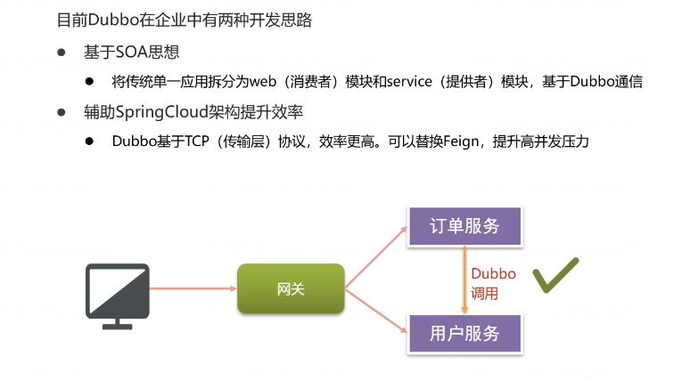
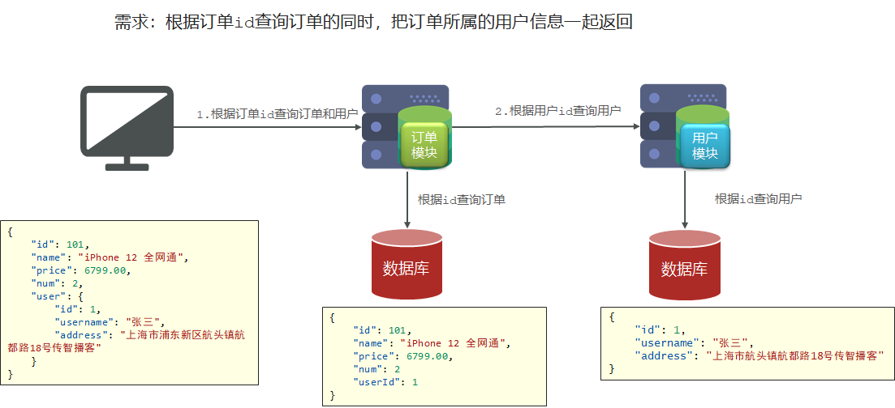

# 一.Dubbo简介

2011年10月27日，阿里巴巴开源了自己的SOA服务化治理方案的核心框架Dubbo，服务治理和SOA的设计理念开始逐渐在国内软件行业中落地，并被广泛应用。

* 早期版本的dubbo遵循SOA的思想，是面向服务架构的重要组件。
* 如今版本的Dubbo作为Spring Cloud的二进制通信方案来发挥Dubbo的性能优势




SOA：Service-Oriented Architecture 面向服务架构。它是一种组件模型，把应用程序的不同功能 单元（称为 服务）进行拆分，并通过接口协议来完成服务间通信。


# 二.Dubbo的快速入门

## 1. Dubbo的基本架构


节点角色说明：

| 节点     | 角色说明                                 |
| -------- | ---------------------------------------- |
| Provider | 暴露服务的服务提供方。                   |
| Consumer | 调用远程服务的服务消费方。               |
| Registry | 服务注册与发现的注册中心。               |
| Monitor  | 统计服务的调用次数和调用时间的监控中心。 |

调用关系说明：

1. 服务容器负责启动，加载，运行服务提供者。
2. 服务提供者在启动时，向注册中心注册自己提供的服务。
3. 服务消费者在启动时，向注册中心订阅自己所需的服务。
4. 注册中心返回服务提供者地址列表给消费者，如果有变更，注册中心将基于长连接推送变更数据给消费者。
5. 服务消费者，从提供者地址列表中，基于软负载均衡算法，选一台提供者进行调用，如果调用失败，再选另一台调用。
6. 服务消费者和提供者，在内存中累计调用次数和调用时间，定时每分钟发送一次统计数据到监控中心。


## 2. 准备工作

### 2.1安装nacos

参见微服务的资料


### 2.2 安装DubboAdmin

[DubboAdmin](https://github.com/apache/dubbo-admin)是阿里巴巴管理提供的管理控制台，可以实现服务查询，详情展示,服务测试等功能。借由DubboAdmin可以更好的帮助开发人员对服务进行管理和监控。

**注：**如果Dubbo是整合SpringCloud来使用，那么可以不用安装DubboAdmin

1）下载源码: 
`git clone https://github.com/apache/dubbo-admin.git`

资料中已经提供了源码 `dubbo-admin.zip`


2）在 源码的`dubbo-admin-server/src/main/resources/application.properties` 中指定注册中心地址：

修改下面这三项，改为nacos的地址：

```properties
admin.registry.address=nacos://127.0.0.1:8848
admin.config-center=nacos://127.0.0.1:8848
admin.metadata-report.address=nacos://127.0.0.1:8848
```


3）构建

在源码目录的pom文件所在目录下执行：`mvn clean package -D maven.test.skip=true`


4）启动

```
mvn --projects dubbo-admin-server spring-boot:run
```

或者 

```shell
cd dubbo-admin-distribution/target
java -jar dubbo-admin-0.1.jar
```


5）访问 http://localhost:8080

用户名和密码均为 `root`


## 3. 入门案例

需求：使用**Dubbo**构建分布式架构，完成根据用户id查询用户


导入资料中提供的项目：

`dubbo`


创建数据库 `dubbo-demo`，导入资料中提供的sql脚本：

`dubbo-demo.sql`


修改配置文件：

```yaml
server:
  port: 8088
spring:
  datasource:
    url: jdbc:mysql://localhost:3306/dubbo-demo?useSSL=false&serverTimezone=Asia/Shanghai
    username: root
    password: 123456
    driver-class-name: com.mysql.cj.jdbc.Driver
```


可以看到现在dubbo-demo项目是一个单体架构，controller、service等都在一个模块中。我们要实现的就是把它拆分成上图所示的那种结构。

### 3.1 服务提供者

（1）创建**user-provider模块** 并导入依赖

```xml
<dependencies>
    <dependency>
        <groupId>org.projectlombok</groupId>
        <artifactId>lombok</artifactId>
    </dependency>
    <dependency>
        <groupId>org.springframework.boot</groupId>
        <artifactId>spring-boot-starter-web</artifactId>
    </dependency>
    <dependency>
        <groupId>mysql</groupId>
        <artifactId>mysql-connector-java</artifactId>
    </dependency>
    <!--mybatis-->
    <dependency>
        <groupId>org.mybatis.spring.boot</groupId>
        <artifactId>mybatis-spring-boot-starter</artifactId>
    </dependency>

    <!--dubbo的起步依赖-->
    <dependency>
        <groupId>org.apache.dubbo</groupId>
        <artifactId>dubbo-spring-boot-starter</artifactId>
        <version>2.7.8</version>
    </dependency>

    <dependency>
        <groupId>org.apache.dubbo</groupId>
        <artifactId>dubbo-registry-nacos</artifactId>
        <version>2.7.8</version>
    </dependency>
</dependencies>
```


（2）编写启动类

```java
package cn.itcast.user;

import org.mybatis.spring.annotation.MapperScan;
import org.springframework.boot.SpringApplication;
import org.springframework.boot.autoconfigure.SpringBootApplication;

@MapperScan("cn.itcast.user.mapper")
@SpringBootApplication
public class UserProviderApplication {

    public static void main(String[] args) {
        SpringApplication.run(UserProviderApplication.class, args);
    }

}
```


#### @DubboService

（3）把原来单体架构中的 service mapper domain 包复制到 user-provider模块下。并修改UserServiceImpl

```java
package cn.itcast.user.service;


import cn.itcast.user.api.UserService;
import cn.itcast.user.domain.User;
import cn.itcast.user.mapper.UserMapper;
import org.apache.dubbo.config.annotation.DubboService;
import org.springframework.beans.factory.annotation.Autowired;

//使用该注解暴露dubbo服务，这样服务消费者才能调用该服务
@DubboService
public class UserServiceImpl implements UserService {

    @Autowired
    private UserMapper userMapper;

	//根据id查询用户名称
    public String queryUsername(Long id) {
        return userMapper.findById(id).getUsername();
    }
}
```


#### 配置文件

```yml
server:
  port: 18081
spring:
  datasource:
    url: jdbc:mysql://localhost:3306/dubbo-demo?useSSL=false&serverTimezone=Asia/Shanghai
    username: root
    password: 123456
    driver-class-name: com.mysql.cj.jdbc.Driver
  application:
    name: user-provider
logging:
  level:
    cn.itcast: debug
  pattern:
    dateformat: HH:mm:ss:SSS

#配置dubbo提供者
dubbo:
  #dubbo协议和访问端口
  protocol:
    name: dubbo
    port: 20881
  #注册中心的地址
  registry:
    address: nacos://localhost:8848
  #dubbo注解的包扫描
  scan:
    base-packages: cn.itcast.user.service
```

启动user-provider，在dubboadmin中可以看到已经有该服务了


### 3.2 服务消费者

（1）创建**user-consumer**模块导入依赖

```xml
<dependencies>
    <dependency>
        <groupId>org.projectlombok</groupId>
        <artifactId>lombok</artifactId>
    </dependency>
    <dependency>
        <groupId>org.springframework.boot</groupId>
        <artifactId>spring-boot-starter-web</artifactId>
    </dependency>


    <!--dubbo的起步依赖-->
    <dependency>
        <groupId>org.apache.dubbo</groupId>
        <artifactId>dubbo-spring-boot-starter</artifactId>
        <version>2.7.8</version>
    </dependency>

    <dependency>
        <groupId>org.apache.dubbo</groupId>
        <artifactId>dubbo-registry-nacos</artifactId>
        <version>2.7.8</version>
    </dependency>
</dependencies>
```


（2）创建引导类

```java
package cn.itcast.user;

import org.springframework.boot.SpringApplication;
import org.springframework.boot.autoconfigure.SpringBootApplication;


@SpringBootApplication
public class UserConsumerApplication {

    public static void main(String[] args) {
        SpringApplication.run(UserConsumerApplication.class, args);
    }
}
```


#### @DubboReference

（3）把原来项目中的controller拷贝过来并修改

```java
package cn.itcast.user.controller;


import cn.itcast.user.api.UserService;
import cn.itcast.user.domain.User;
import lombok.extern.slf4j.Slf4j;
import org.apache.dubbo.config.annotation.DubboReference;
import org.springframework.web.bind.annotation.GetMapping;
import org.springframework.web.bind.annotation.PathVariable;
import org.springframework.web.bind.annotation.RequestMapping;
import org.springframework.web.bind.annotation.RestController;

@Slf4j
@RestController
@RequestMapping("/user")
public class UserController {

    //引用远程服务
    @DubboReference
    private UserService userService;

    @GetMapping("/username/1")
    public String findUserName(@PathVariable("id") Long id) {
        return userService.queryUsername(id);
    }
}
```

由于provider模块中，UserService的全名为：`cn.itcast.user.service.UserService`

所以消费者模块中也要创建一个 cn.itcast.user.service.UserService 接口：

```java
public interface UserService {
    User queryUsername(Long id);
}
```


#### 配置文件

```yml
server:
  port: 18080
spring:
  application:
    name: user-consumer
logging:
  level:
    cn.itcast: debug
  pattern:
    dateformat: HH:mm:ss:SSS
#配置dubbo服务消费者，这里只需要指定注册中心的地址即可
dubbo:
  registry:
    address: nacos://127.0.0.1:8848
```

启动消费者，访问 http://localhost:18080/user/1 


### 3.3 代码优化

#### Dubbo最佳实践


将接口抽取为独立模块，并且把接口有关的实体类都放到这个模块中

（1）创建`user-api模块`引入依赖

（2）将**UserService接口和User对象**导入user-api模块下，并且在 provider和consumer模块中删除相应的接口和对象，并在这两个模块的pom文件中导入 user-api模块依赖。

provider模块中虽然没有 UserService接口，但是其实现类 UserServiceImpl还是要有。

（3）**注意：如果要用dubbo来传输java对象，java对象必须实现Serializable接口。**

User对象实现序列化接口

```java
package cn.itcast.user.domain;

import lombok.Data;

import java.io.Serializable;

@Data
public class User implements Serializable {
    private Long id;
    private String username;
    private String address;
}
```

#### 序列化


### 3.4 *总结


# 三. Dubbo高级特性

## 1. 超时与重试

服务消费者在调用服务提供者的时候，如果服务提供者宕机或者其他原因，导致服务消费者发生了阻塞、等待的情形，这个时候，服务消费者会一直等待下去。

在某个峰值时刻，大量的请求都在同时请求服务消费者，会造成线程的大量堆积，势必会造成**雪崩**。

* dubbo 利用**超时机制**来解决这个问题（使用 **timeout属**性 配置超时时间，默认值1000，单位毫秒）

* 若超时时间较短，当网络波动时请求就会失败，Dubbo通过**重试机制**避免此类问题的发生

  

但是，有些时候并不需要重试机制，比如请求保存、修改数据库的操作。那么可以在 **@DubboReference注解** 中添加 `属性 retries = 0` ，表示通过该服务调用时，不需要重试，当然也可以在配置文件中配置，使所有服务都不需要重试

user-consumer模块中添加配置信息

```yml
dubbo:
  registry:
    address: nacos://127.0.0.1:8848
  consumer:
    timeout: 3000	//设置超时时间，ms
    retries: 0		//设置重试次数
```


## 2. 启动检查

为了保障服务的正常可用，Dubbo **默认**会在启动时检查依赖的服务是否可用，不可用时会抛出异常


在正式环境这是很有必要的一项配置，可以保证整个调用链路的平稳运行

在开发时，往往会存在没有提供者的情况。由于启动检查的原因，可能导致开发测试出现问题

可以通过`check=false`关闭

user-consumer模块中添加配置信息

```yml
dubbo:
  registry:
    address: nacos://127.0.0.1:8848
  consumer:
    check: false #关闭消费者启动检查
```


## 3. 多版本

**灰度发布**：当出现新功能时，会让<u>一部分用户</u>先使用新功能（新版本），用户反馈没问题时，再将所有用户迁移到新功能。

Dubbo提供了提供者多版本的支持，平滑处理项目功能升级部署


（1）**user-provider**定义新的服务实现类UserServiceImpl2，指定版本

```java
@DubboService(version = “2.0.0”)	//指定version属性
public class UserServiceImpl2 implements UserService {
    …………
}

```

（2）**user-consumer**消费者调用时，指定版本调用

```java
@RestController
@RequestMapping("/user")
public class UserController {
    //引用远程服务
    @DubboReference(version = "2.0.0")	//指定version属性
    private UserService userService;    
    ………
}

```


## 4. 负载均衡

在集群部署时，Dubbo提供了4种负载均衡策略，帮助**消费者找到最优提供者**并调用

* **Random** ：**按权重随机**，**默认值**。按权重设置随机概率。

* **RoundRobin** ：**按权重轮询**

* **LeastActive**：选择最少活跃调用数。活跃调用数就是当前某个提供者正在被多少个消费者调用。相同活跃数的随机。

* **ConsistentHash**：一致性 Hash，相同参数的请求总是发到同一提供者。

```java
@RestController
@RequestMapping("/user")
public class UserController {
    //引用远程服务
    @DubboReference(loadbalance = "roundrobin")	//使用loadbalance属性指定消费者调用提供者的负载均衡策略
    private UserService userService;
}
```


# 四.SpringCloud整合Dubbo

通常来说，RPC协议比REST具有更好的性能。很多开发人员希望享受Spring Cloud的生态，同时有兼顾RPC的效率的效率。SpringCloud Alibaba很好的解决了这个问题。

## 1. 功能概述

- **Feign**基于Http协议（应用层），在高并发场景下性能不够理想，容易成为性能瓶颈

- Dubbo框架的通信协议采用TCP协议（数据传输层）

  Dubbo默认通过Netty构造TCP长连接的方式进行通信，性能较高

  

将Dubbo集成至SpringCloud主要是替换**Ribbon**或者**Feign**实现远程调用。加入Dubbo后，整体的架构如下：

- 客户端请求网关

- 网关将请求路由到微服务

- 微服务进行服务注册和配置管理

- 微服务间通过Dubbo进行远程调用


## 2. 入门案例

这里我们使用资料中`cloud-dubbo-demo`工程作为案例工程。

项目结构如下：





**模块分析**

使用Dubbo进行服务调用，一般将公共接口独立抽取为模块（xxx-api）。

消费者引入依赖，引用dubbo服务

提供者引入依赖，编写接口实现类，暴露服务即可


### 2.1 抽取接口

定义接口模块**dubbo-api**，将UserService接口抽取到此模块下

```java
package cn.itcast.dubbo.api;

import cn.itcast.dubbo.domain.User;

public interface UserService {
    User queryById(Long id);
}
```


### 2.2 引入相关依赖

父工程加入SpringCloud Alibaba的dependencyManagement

```xml
<dependencyManagement>
    <dependencies>
        <!--SpringCloud Alibaba-->
        <dependency>
            <groupId>com.alibaba.cloud</groupId>
            <artifactId>spring-cloud-alibaba-dependencies</artifactId>
            <version>2.2.6.RELEASE</version>
            <type>pom</type>
            <scope>import</scope>
        </dependency>
    </dependencies>
</dependencyManagement>
```

消费者和提供者引入nacos注册中心和Dubbo依赖

```xml
<!--nacos注册中心的依赖-->
<dependency>
    <groupId>com.alibaba.cloud</groupId>
    <artifactId>spring-cloud-starter-alibaba-nacos-discovery</artifactId>
</dependency>

<!--springcloud alibaba dubbo依赖   -->
<dependency>
    <groupId>com.alibaba.cloud</groupId>
    <artifactId>spring-cloud-starter-dubbo</artifactId>
</dependency>

<!-- 前面我们抽取出来的 api依赖   -->
<dependency>
    <groupId>cn.itcast</groupId>
    <artifactId>dubbo-api</artifactId>
    <version>1.0-SNAPSHOT</version>
</dependency>
```

### 2.3 服务提供者

在 **user-service模块**中，修改UserServiceImpl实现dubbo-api中的UserService接口。并使用**@DubboService**注解替换@Service对外暴露dubbo服务

```java
package cn.itcast.user.service;

import cn.itcast.dubbo.api.UserService;
import cn.itcast.dubbo.domain.User;
import cn.itcast.user.mapper.UserMapper;
import org.apache.dubbo.config.annotation.DubboService;
import org.springframework.beans.factory.annotation.Autowired;

@DubboService
public class UserServiceImpl implements UserService {

    @Autowired
    private UserMapper userMapper;

    public User queryById(Long id) {
        return userMapper.findById(id);
    }
}
```

在application.yml中添加配置

```yml
spring:
  datasource:
    url: jdbc:mysql://localhost:3306/dubbo-demo?useSSL=false
    username: root
    password: root
    driver-class-name: com.mysql.jdbc.Driver
  application:
    name: user-service
  cloud:
    nacos:
      discovery:
        server-addr: localhost:8848
#配置dubbo，注册中心，暴露的端口和协议，dubbo注解的包扫描
dubbo:
  protocol:
    name: dubbo
    port: 20881
  registry:
    address: spring-cloud://localhost   #使用SpringCloud中的注册中心
  scan:
    base-packages: cn.itcast.user.service  #dubbo中包扫描
```


### 2.4 服务消费者

在**order-service模块**的OrderController中引入dubbo服务。调用UserService查询用户

```java
package cn.itcast.order.controller;

import cn.itcast.dubbo.api.UserService;
import cn.itcast.dubbo.domain.Order;
import cn.itcast.dubbo.domain.User;
import cn.itcast.order.service.OrderService;
import org.apache.dubbo.config.annotation.DubboReference;
import org.springframework.beans.factory.annotation.Autowired;
import org.springframework.web.bind.annotation.GetMapping;
import org.springframework.web.bind.annotation.PathVariable;
import org.springframework.web.bind.annotation.RequestMapping;
import org.springframework.web.bind.annotation.RestController;

@RestController
@RequestMapping("order")
public class OrderController {

    @Autowired
    private OrderService orderService;

    @DubboReference		//引入dubbo服务
    private UserService userService;

    @GetMapping("{orderId}")
    public Order queryOrderByUserId(@PathVariable("orderId") Long orderId) {
        //根据id查询订单
        Order order = orderService.queryOrderById(orderId);
        //获取用户id
        Long userId = order.getUserId();
        //使用dubbo远程调用userservice 查询用户
        User user = userService.queryById(userId);
        //设置用户对象
        order.setUser(user);
        return order;
    }
}
```

在Order-service的模块中添加dubbo配置

```yml
spring:
  application:
    name: order-service
  cloud:
    nacos:
      discovery:
        server-addr: localhost:8848
#dubbo配置
dubbo:
  registry:
    address: spring-cloud://localhost  #使用spring cloud的注册中心
  consumer:
    check: false   #dubbo默认有启动检查，把它关闭
    retries: 0     #dubbo内置的重试机制，设置不重试
```


## 3. 总结

1、在微服务架构使用Dubbo替换Feign进行远程调用。 Dubbo基于tcp协议具有更优的性能

2、SpringCloud Alibaba内置了Dubbo的整合

- 引入Dubbo起步依赖

- 使用@DubboService暴露服务

- 使用@DubboReference引用服务

- 整合Dubbo使用Nacos作为注册中心


RPC（dubbo）和 REST（feign）的对比

| 类型     | RPC                            | Rest         |
| -------- | ------------------------------ | ------------ |
| 耦合性   | 强耦合                         | 松耦合       |
| 消息协议 | 二进制                         | 文本  Json   |
| 通信协议 | TCP                            | HTTP         |
| 对外开放 | 一般作为内部各个系统的通信框架 | 对接外部系统 |

