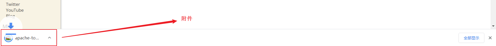
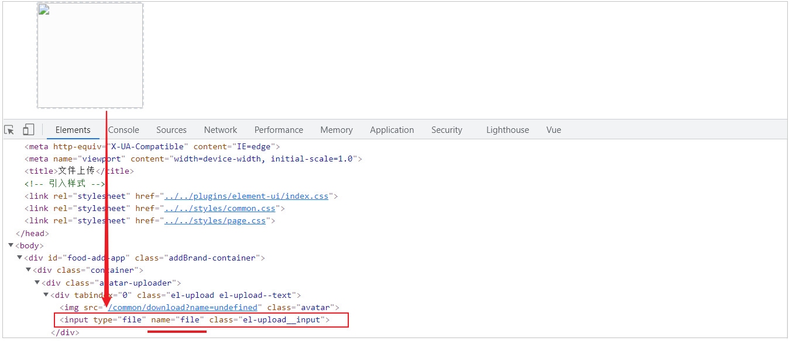
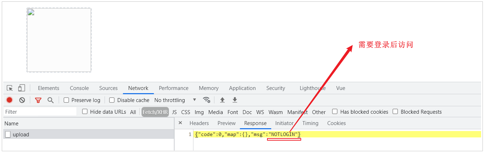
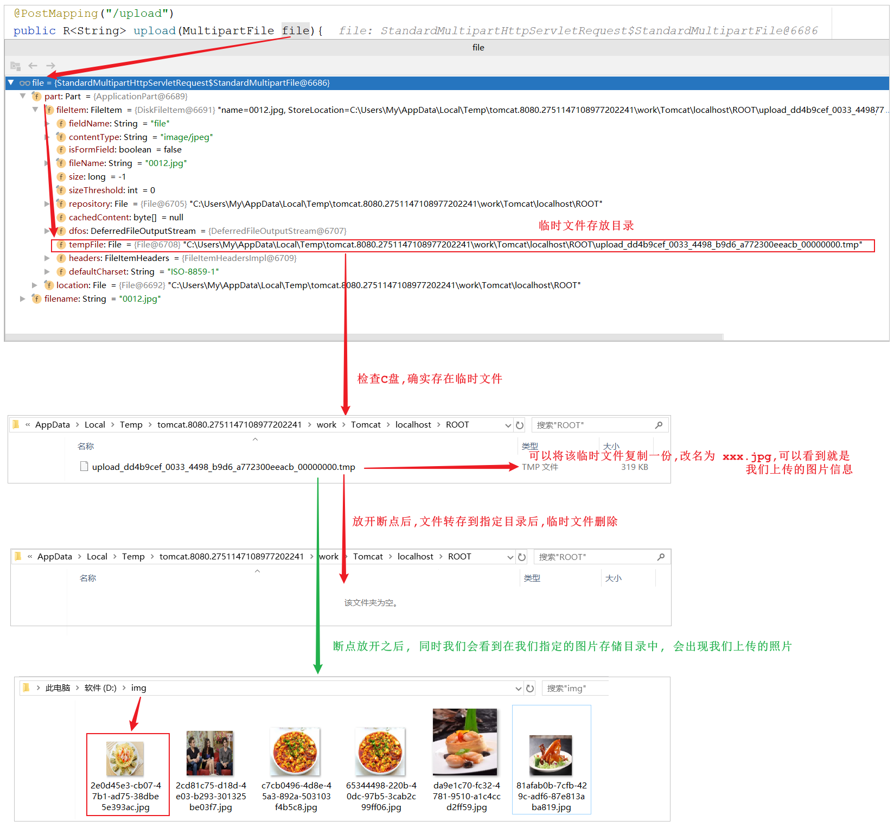

## 1. 文件上传下载

### 1.1 上传介绍

#### 1.1.1 概述

文件上传，也称为upload，是指将本地图片、视频、音频等文件上传到服务器上，可以供其他用户浏览或下载的过程。文件上传在项目中应用非常广泛，我们经常发微博、发微信朋友圈都用到了文件上传功能。

 


文件上传时，对页面的form表单有如下要求：

| 表单属性 | 取值                | 说明                      |
| -------- | ------------------- | ------------------------- |
| method   | post                | 必须选择post方式提交      |
| enctype  | multipart/form-data | 采用multipart格式上传文件 |
| type     | file                | 使用input的file控件上传   |


#### 1.1.2 前端介绍

**1). 简单html页面表单**

```html
<form method="post" action="/common/upload" enctype="multipart/form-data">
    <input name="myFile" type="file"  />
    <input type="submit" value="提交" /> 
</form>
```


**2). ElementUI中提供的upload上传组件**

目前一些前端组件库也提供了相应的上传组件，但是底层原理还是基于form表单的文件上传。

 


#### 1.1.3 服务端介绍

服务端要接收客户端页面上传的文件，通常都会使用Apache的两个组件：

- **commons-fileupload**

- **commons-io**


而Spring框架在**spring-web包**中对文件上传进行了封装，大大简化了服务端代码，我们只需要在Controller的方法中声明一个**MultipartFile类**型的参数即可接收上传的文件，例如：

```java
/**
 * 文件上传
 * @param file
 * @return
 */
@PostMapping("/upload")
public R<String> upload(MultipartFile file){
    System.out.println(file);
    return R.success(fileName);
}
```


### 1.2 下载介绍

文件下载，也称为download，是指将文件从服务器传输到本地计算机的过程。通过浏览器进行文件下载，通常有两种表现形式：

**1). 以附件形式下载，弹出保存对话框，将文件保存到指定磁盘目录**

 


**2). 直接在浏览器中打开**

而我们所需要实现的菜品展示，表现形式为在浏览器中直接打开。

  

通过浏览器进行文件下载，本质上就是服务端将文件以流的形式写回浏览器的过程。


### 1.3 上传代码实现

#### 1.3.1 前端代码

文件上传，我们作为服务端工程师，主要关注服务端代码实现。对于前端页面，可以使用ElementUI提供的上传组件。可以直接使用资料中提供的上传页面，位置：资料/文件上传下载页面/upload.html，将其拷贝到项目的目录(resources/backend/page/demo\)下，启动项目，访问上传页面。

http://localhost:8080/backend/page/demo/upload.html

 


在上述的浏览器抓取的网络请求中，上传文件的调用url，在哪里配置的呢，这个时候，我们需要去看一下前端上传组件。

 

虽然上述是ElementUI封装的代码，但是实际上最终还通过file域上传文件，如果未指定上传文件的参数名，默认为file。

 


#### 1.3.2 服务端实现

**1). application.yml**

需要在application.yml中定义文件存储路径

```yml
reggie:
  path: D:\img\
```


**2). CommonController**

编写文件上传的方法, 通过**MultipartFile类型**的参数即可接收上传的文件, **方法形参的名称需要与页面的file域的name属性一致**。

所在包: com.itheima.reggie.controller

上传逻辑: 

1). 获取文件的原始文件名, 通过原始文件名获取文件后缀

2). 通过UUID重新命名文件名, 以防止文件名称重复造成文件覆盖

3). 创建文件存放目录

4). 将上传的临时文件转存到指定位置

代码实现:

```java
import com.itheima.reggie.common.R;
import lombok.extern.slf4j.Slf4j;
import org.springframework.beans.factory.annotation.Value;
import org.springframework.web.bind.annotation.*;
import org.springframework.web.multipart.MultipartFile;
import java.io.File;
import java.util.UUID;

/**
 * 文件上传和下载
 */
@RestController
@RequestMapping("/common")
@Slf4j
public class CommonController {
    @Value("${reggie.path}")
    private String basePath;
    /**
     * 文件上传
     * @param file
     * @return
     */
    @PostMapping("/upload")
    public R<String> upload(MultipartFile file){
        //file是一个临时文件，需要转存到指定位置，否则本次请求完成后临时文件会删除
        log.info(file.toString());
		
        //原始文件名
        String originalFilename = file.getOriginalFilename();//abc.jpg
        String suffix = originalFilename.substring(originalFilename.lastIndexOf("."));

        //使用UUID重新生成文件名，防止文件名称重复造成文件覆盖
        String fileName = UUID.randomUUID().toString() + suffix;//dfsdfdfd.jpg
		
        //创建一个目录对象
        File dir = new File(basePath);
        //判断当前目录是否存在
        if(!dir.exists()){
            //目录不存在，需要创建
            dir.mkdirs();
        }
		
        try {
            //将临时文件转存到指定位置
            file.transferTo(new File(basePath + fileName));
        } catch (IOException e) {
            e.printStackTrace();
        }
        return R.success(fileName);
    }
}    
```


#### 1.3.3 测试

代码编写完成之后，我们重新启动项目，访问上传页面 http://localhost:8080/backend/page/demo/upload.html，然后点击上传图片，选择图片上传时，会发现图片并不能正常的上传，而且在浏览器中可以抓取到响应的数据，从图中我们可以判断出需要登录才可以操作。

 

而这样的话，就要求我们在测试时，每一次都需要先登录，登录完成后在进行图片上传的测试，为了简化我们的测试，我们可以在 LoginCheckFilter 的doFilter方法中，在不需要处理的请求路径的数组中再加入请求路径 /common/** , 如下: 

 

然后，我们在测试文件的上传功能时，就不需要登录就可以操作了。 


我们在测试文件上传时，可以通过debug的形式来跟踪上传的整个过程，验证一下临时文件是否存在，以及上传完成之后，临时文件是否会自动删除。

 

