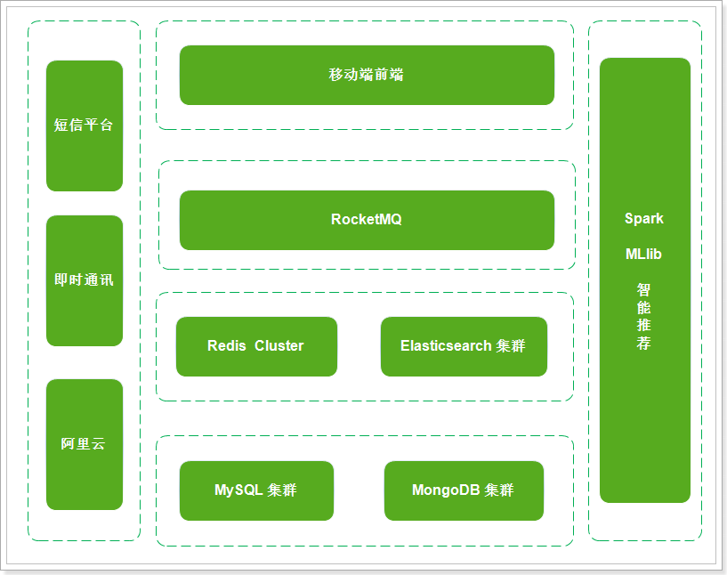

# 一.项目介绍

## 3. 技术方案

前端：

- flutter + android + 环信SDK + redux + shared_preferences + connectivity + iconfont + webview + sqflite

后端：

- Spring Boot + SpringMVC + Mybatis + MybatisPlus + Dubbo
- Elasticsearch geo 实现地理位置查询
- MongoDB 实现海量数据的存储
- Redis 数据的缓存
- Spark + MLlib 实现智能推荐
- 第三方服务 环信即时通讯 
- 第三方服务 阿里云 OSS 、 短信服务
- 第三方服务 虹软开放平台 / 阿里云

 

## 4. 技术解决方案

- 使用Elasticsearch geo实现附近的人的解决方案
- 使用Spark + Mllib实现智能推荐的解决方案
- 使用MongoDB进行海量数据的存储的解决方案
- 使用采用分布式文件系统存储小视频数据的解决方案
- 使用百度人脸识别的解决方案
- 使用阿里云进行短信验证码发送的解决方案


# 三.开发工具

探花交友项目的开发统一使用提供的Centos7环境，该环境中部署安装了项目所需要的各种服务，如：RabbitMQ, MongoDB、Redis等。

- 虚拟机的root用户密码为：<font color=red>root123</font>
- 默认参数：CPU：2核，内存：4G，硬盘：60G
- IP地址建议设置为192.168.136.160，否则有些服务将不可用，比如：Redis、RocketMQ等。

## 1. 虚拟机配置

由于课程中使用了较多的软件，且之间会有联系，推荐同学IP地址设置为192.168.136.160

仅仅需要修改虚拟机中的子网IP即可。

## 3. YAPI

YAPI已经在linux虚拟机中准备好了

请求地址：http://192.168.136.160:3000/

用户名/密码：tanhua@itcast.cn/123456


# 四. 环境搭建

## 1. MYSQL数据库

| 数据库表        | 说明       |
| --------------- | ---------- |
| tb_user         | 用户表     |
| tb_user_info    | 用户详情表 |
| tb_settings     | 用户设置表 |
| tb_question     | 好友问题表 |
| tb_black_list   | 黑名单     |
| tb_announcement | 公告表     |


## 2. 基础服务组件

探花交友学习中，除MySQL数据库部署到本地电脑中。其他涉及到的所有组件都已经以docker形式安装到虚拟机中。我们只需要进入虚拟机，使用简单的命令即可。为了方便学习与减少基础服务占用的学习时间，全部使用docker-compose的方式集中式部署。这些文件在linux虚拟机中的`/root/docker-file`文件夹下


每个文件夹中都包含一个docker-compose.yml配置文件，一键启动并部署应用。

```shell
#进入组件目录
cd /root/docker-file/base/
#执行docker-compose命令
docker-compose up -d 
```

**base**

* 其中包含**redis，nacos，yapi，mongodb**

**fastdfs**

* 包含fastdfs操作需要的组件。分布式存储

**rmq**

* 包含RabbitMQ需要所有组件

**recommend**

* 包含推荐系统需要所有组件


## 4. Maven模块分析

整体项目使用Maven架构搭建，采用聚合工程形式管理模块，为了便于调用，dubbo需要拆分为接口模块和服务模块


**工程主体结构**

| **父工程**   | **工程名称**           | **说明**                                       |
| ------------ | ---------------------- | ---------------------------------------------- |
| tanhua       | tanhua-autoconfig      | 自动装配的工具类                               |
| tanhua       | tanhua-model           | 实体类模块                                     |
| tanhua       | tanhua-dubbo           | Dubbo子模块（可以理解为文件夹，管理dubbo模块） |
| tanhua       | tanhua-commons         | 工具类                                         |
| tanhua       | tanhua-app-server      | 与手机端交互的入口模块                         |
| tanhua-dubbo | tanhua-dubbo-interface | Dubbo接口模块                                  |
| tanhua-dubbo | tanhua-dubbo-db        | Dubbo服务模块（数据库部分）                    |
| tanhua-dubbo | tanhua-dubbo-mongo     | Dubbo服务模块（MongoDB部分）                   |

**模块依赖分析**


## 5. 模块依赖

### tanhua

```xml
<parent>
    <groupId>org.springframework.boot</groupId>
    <artifactId>spring-boot-starter-parent</artifactId>
    <version>2.3.9.RELEASE</version>
</parent>

<properties>
    <maven.compiler.source>8</maven.compiler.source>
    <maven.compiler.target>8</maven.compiler.target>
    <mysql.version>5.1.47</mysql.version>
    <jackson.version>2.11.0</jackson.version>
    <druid.version>1.0.9</druid.version>
    <servlet-api.version>2.5</servlet-api.version>
    <jsp-api.version>2.0</jsp-api.version>
    <joda-time.version>2.5</joda-time.version>
    <commons-lang3.version>3.3.2</commons-lang3.version>
    <commons-io.version>1.3.2</commons-io.version>
    <mybatis.version>3.5.6</mybatis.version>
    <mybatis.mybatis-plus>3.4.1</mybatis.mybatis-plus>
    <lombok.version>1.18.8</lombok.version>
    <mongo.version>4.0.5</mongo.version>
    <spring-cloud.version>Hoxton.SR10</spring-cloud.version>
    <spring-cloud-alibaba.version>2.2.5.RELEASE</spring-cloud-alibaba.version>
</properties>

<!--通用依赖-->
<dependencies>
    <dependency>
        <groupId>org.springframework.boot</groupId>
        <artifactId>spring-boot-starter-test</artifactId>
        <scope>test</scope>
    </dependency>
    <dependency>
        <groupId>junit</groupId>
        <artifactId>junit</artifactId>
        <version>4.12</version>
        <scope>test</scope>
    </dependency>
    <dependency>
        <groupId>org.projectlombok</groupId>
        <artifactId>lombok</artifactId>
    </dependency>
    <dependency>
        <groupId>cn.hutool</groupId>
        <artifactId>hutool-all</artifactId>
        <version>5.4.3</version>
    </dependency>
    <dependency>
        <groupId>com.alibaba</groupId>
        <artifactId>fastjson</artifactId>
        <version>1.2.8</version>
    </dependency>
</dependencies>

<dependencyManagement>
    <dependencies>
        <dependency>
            <groupId>io.netty</groupId>
            <artifactId>netty-bom</artifactId>
            <version>4.1.59.Final</version>
            <type>pom</type>
            <scope>import</scope>
        </dependency>

        <dependency>
            <groupId>io.projectreactor</groupId>
            <artifactId>reactor-bom</artifactId>
            <version>2020.0.4</version>
            <type>pom</type>
            <scope>import</scope>
        </dependency>

        <dependency>
            <groupId>io.projectreactor.netty</groupId>
            <artifactId>reactor-netty</artifactId>
            <version>0.9.8.RELEASE</version>
        </dependency>

        <dependency>
            <groupId>org.springframework.cloud</groupId>
            <artifactId>spring-cloud-dependencies</artifactId>
            <version>${spring-cloud.version}</version>
            <type>pom</type>
            <scope>import</scope>
        </dependency>

        <dependency>
            <groupId>com.alibaba.cloud</groupId>
            <artifactId>spring-cloud-alibaba-dependencies</artifactId>
            <version>${spring-cloud-alibaba.version}</version>
            <type>pom</type>
            <scope>import</scope>
        </dependency>

        <dependency>
            <groupId>joda-time</groupId>
            <artifactId>joda-time</artifactId>
            <version>${joda-time.version}</version>
        </dependency>

        <!-- mybatis-plus插件依赖 -->
        <dependency>
            <groupId>com.baomidou</groupId>
            <artifactId>mybatis-plus</artifactId>
            <version>${mybatis.mybatis-plus}</version>
        </dependency>

        <!-- MySql -->
        <dependency>
            <groupId>mysql</groupId>
            <artifactId>mysql-connector-java</artifactId>
            <version>${mysql.version}</version>
        </dependency>

        <dependency>
            <groupId>org.mongodb</groupId>
            <artifactId>mongodb-driver-sync</artifactId>
            <version>${mongodb.version}</version>
        </dependency>

        <dependency>
            <groupId>org.projectlombok</groupId>
            <artifactId>lombok</artifactId>
            <optional>true</optional>
            <version>${lombok.version}</version>
        </dependency>

        <dependency>
            <groupId>org.apache.commons</groupId>
            <artifactId>commons-lang3</artifactId>
            <version>${commons-lang3.version}</version>
        </dependency>

        <dependency>
            <groupId>org.apache.commons</groupId>
            <artifactId>commons-lang3</artifactId>
            <version>3.7</version>
        </dependency>
        <!-- Jackson Json处理工具包 -->
        <dependency>
            <groupId>com.fasterxml.jackson.core</groupId>
            <artifactId>jackson-databind</artifactId>
            <version>${jackson.version}</version>
        </dependency>
        <dependency>
            <groupId>com.alibaba</groupId>
            <artifactId>druid</artifactId>
            <version>${druid.version}</version>
        </dependency>
        <dependency>
            <groupId>commons-codec</groupId>
            <artifactId>commons-codec</artifactId>
            <version>1.11</version>
        </dependency>
    </dependencies>
</dependencyManagement>

<build>
    <plugins>
        <!-- java编译插件 -->
        <plugin>
            <groupId>org.apache.maven.plugins</groupId>
            <artifactId>maven-compiler-plugin</artifactId>
            <version>3.2</version>
            <configuration>
                <source>1.8</source>
                <target>1.8</target>
                <encoding>UTF-8</encoding>
            </configuration>
        </plugin>
    </plugins>
</build>
```

### tanhua-app-server

```xml
<dependencies>
    <dependency>
        <groupId>org.springframework.boot</groupId>
        <artifactId>spring-boot-starter-web</artifactId>
    </dependency>

    <!--SpringDataRedis依赖-->
    <dependency>
        <groupId>org.springframework.boot</groupId>
        <artifactId>spring-boot-starter-data-redis</artifactId>
    </dependency>

    <!--lombok依赖-->
    <dependency>
        <groupId>org.projectlombok</groupId>
        <artifactId>lombok</artifactId>
    </dependency>

    <!--工具包-->
    <dependency>
        <groupId>org.apache.commons</groupId>
        <artifactId>commons-lang3</artifactId>
    </dependency>
    <dependency>
        <groupId>com.fasterxml.jackson.core</groupId>
        <artifactId>jackson-databind</artifactId>
    </dependency>
    <dependency>
        <groupId>commons-codec</groupId>
        <artifactId>commons-codec</artifactId>
    </dependency>
    <dependency>
        <groupId>joda-time</groupId>
        <artifactId>joda-time</artifactId>
    </dependency>

    <!--jwt依赖-->
    <dependency>
        <groupId>io.jsonwebtoken</groupId>
        <artifactId>jjwt</artifactId>
        <version>0.9.1</version>
    </dependency>

    <!--fastdfs文件存储-->
    <dependency>
        <groupId>com.github.tobato</groupId>
        <artifactId>fastdfs-client</artifactId>
        <version>1.26.7</version>
        <exclusions>
            <exclusion>
                <groupId>ch.qos.logback</groupId>
                <artifactId>logback-classic</artifactId>
            </exclusion>
        </exclusions>
    </dependency>


    <!-- Dubbo Spring Cloud Starter-->
    <dependency>
        <groupId>com.alibaba.cloud</groupId>
        <artifactId>spring-cloud-starter-dubbo</artifactId>
    </dependency>

    <!-- Spring Cloud Nacos Service Discovery-->
    <dependency>
        <groupId>com.alibaba.cloud</groupId>
        <artifactId>spring-cloud-starter-alibaba-nacos-discovery</artifactId>
    </dependency>

    <!-- nacos配置中心依赖支持
    <dependency>
        <groupId>com.alibaba.cloud</groupId>
        <artifactId>spring-cloud-starter-alibaba-nacos-config</artifactId>
    </dependency>
	-->
    <!--RabbitMQ
    <dependency>
        <groupId>org.springframework.boot</groupId>
        <artifactId>spring-boot-starter-amqp</artifactId>
    </dependency>
	-->
    <dependency>
        <groupId>com.itheima</groupId>
        <artifactId>tanhua-dubbo-interface</artifactId>
        <version>1.0-SNAPSHOT</version>
    </dependency>
    <dependency>
        <groupId>com.itheima</groupId>
        <artifactId>tanhua-commons</artifactId>
        <version>1.0-SNAPSHOT</version>
    </dependency>
    <dependency>
        <groupId>com.itheima</groupId>
        <artifactId>tanhua-autoconfig</artifactId>
        <version>1.0-SNAPSHOT</version>
    </dependency>
</dependencies>

<build>
    <finalName>tanhua-app-server</finalName>
    <plugins>
        <plugin>
            <groupId>org.springframework.boot</groupId>
            <artifactId>spring-boot-maven-plugin</artifactId>
            <version>2.3.9.RELEASE</version>
        </plugin>
    </plugins>
</build>
```

### tanhua-autoconfig

```xml
<dependencies>
    <!--阿里云核心API-->
    <dependency>
        <groupId>com.aliyun</groupId>
        <artifactId>aliyun-java-sdk-core</artifactId>
        <version>4.5.3</version>
    </dependency>
    <dependency>
        <groupId>com.aliyun</groupId>
        <artifactId>dysmsapi20170525</artifactId>
        <version>2.0.1</version>
    </dependency>
    <!--阿里云oss存储API-->
    <dependency>
        <groupId>com.aliyun.oss</groupId>
        <artifactId>aliyun-sdk-oss</artifactId>
        <version>3.10.2</version>
    </dependency>
    <!--阿里云人识别-->
    <dependency>
        <groupId>com.aliyun</groupId>
        <artifactId>facebody20191230</artifactId>
        <version>1.0.10</version>
    </dependency>
    <!--百度人脸识别API-->
    <dependency>
        <groupId>com.baidu.aip</groupId>
        <artifactId>java-sdk</artifactId>
        <version>4.8.0</version>
    </dependency>
    <!--springboot基础起步依赖-->
    <dependency>
        <groupId>org.springframework.boot</groupId>
        <artifactId>spring-boot-starter-web</artifactId>
    </dependency>
    <dependency>
        <groupId>com.easemob.im</groupId>
        <artifactId>im-sdk-core</artifactId>
        <version>0.2.5</version>
    </dependency>
    <dependency>
        <groupId>com.aliyun</groupId>
        <artifactId>aliyun-java-sdk-green</artifactId>
        <version>3.6.1</version>
    </dependency>
</dependencies>
```

### tanhua-commons

```xml
<dependencies>
    <!--工具包-->
    <dependency>
        <groupId>org.apache.commons</groupId>
        <artifactId>commons-lang3</artifactId>
    </dependency>
    <dependency>
        <groupId>commons-codec</groupId>
        <artifactId>commons-codec</artifactId>
    </dependency>
    <dependency>
        <groupId>joda-time</groupId>
        <artifactId>joda-time</artifactId>
    </dependency>
    <!--jwt依赖-->
    <dependency>
        <groupId>io.jsonwebtoken</groupId>
        <artifactId>jjwt</artifactId>
        <version>0.9.1</version>
    </dependency>
</dependencies>
```

### tanhua-dubbo-db

```xml
<dependencies>

    <dependency>
        <groupId>org.springframework.boot</groupId>
        <artifactId>spring-boot-starter-web</artifactId>
    </dependency>

    <dependency>
        <groupId>com.baomidou</groupId>
        <artifactId>mybatis-plus</artifactId>
    </dependency>

    <dependency>
        <groupId>com.baomidou</groupId>
        <artifactId>mybatis-plus-boot-starter</artifactId>
        <version>${mybatis.mybatis-plus}</version>
    </dependency>

    <dependency>
        <groupId>mysql</groupId>
        <artifactId>mysql-connector-java</artifactId>
    </dependency>

    <dependency>
        <groupId>com.alibaba</groupId>
        <artifactId>druid</artifactId>
    </dependency>

    <dependency>
        <groupId>org.projectlombok</groupId>
        <artifactId>lombok</artifactId>
    </dependency>

    <dependency>
        <groupId>org.apache.commons</groupId>
        <artifactId>commons-lang3</artifactId>
    </dependency>

    <dependency>
        <groupId>com.fasterxml.jackson.core</groupId>
        <artifactId>jackson-databind</artifactId>
    </dependency>

    <dependency>
        <groupId>commons-codec</groupId>
        <artifactId>commons-codec</artifactId>
    </dependency>

    <dependency>
        <groupId>joda-time</groupId>
        <artifactId>joda-time</artifactId>
    </dependency>

    <!-- Dubbo Spring Cloud Starter -->
    <dependency>
        <groupId>com.alibaba.cloud</groupId>
        <artifactId>spring-cloud-starter-dubbo</artifactId>
    </dependency>

    <!-- Spring Cloud Nacos Service Discovery -->
    <dependency>
        <groupId>com.alibaba.cloud</groupId>
        <artifactId>spring-cloud-starter-alibaba-nacos-discovery</artifactId>
    </dependency>

    <!-- nacos配置中心依赖支持
    <dependency>
        <groupId>com.alibaba.cloud</groupId>
        <artifactId>spring-cloud-starter-alibaba-nacos-config</artifactId>
    </dependency>
	-->
    <dependency>
        <groupId>com.itheima</groupId>
        <artifactId>tanhua-dubbo-interface</artifactId>
        <version>1.0-SNAPSHOT</version>
    </dependency>
</dependencies>

<build>
    <finalName>tanhua-dubbo-db</finalName>
    <plugins>
        <plugin>
            <groupId>org.springframework.boot</groupId>
            <artifactId>spring-boot-maven-plugin</artifactId>
            <version>2.3.9.RELEASE</version>
        </plugin>
    </plugins>
</build>
```

### tanhua-dubbo-interface

```xml
<dependencies>
    <dependency>
        <groupId>com.itheima</groupId>
        <artifactId>tanhua-model</artifactId>
        <version>1.0-SNAPSHOT</version>
    </dependency>
</dependencies>
```

### tanhua-dubbo-mongo

```xml
<dependencies>

    <dependency>
        <groupId>org.springframework.boot</groupId>
        <artifactId>spring-boot-starter-web</artifactId>
    </dependency>

    <dependency>
        <groupId>org.projectlombok</groupId>
        <artifactId>lombok</artifactId>
    </dependency>

    <dependency>
        <groupId>org.apache.commons</groupId>
        <artifactId>commons-lang3</artifactId>
    </dependency>

    <dependency>
        <groupId>com.fasterxml.jackson.core</groupId>
        <artifactId>jackson-databind</artifactId>
    </dependency>

    <dependency>
        <groupId>commons-codec</groupId>
        <artifactId>commons-codec</artifactId>
    </dependency>

    <dependency>
        <groupId>joda-time</groupId>
        <artifactId>joda-time</artifactId>
    </dependency>

    <!-- Dubbo Spring Cloud Starter -->
    <dependency>
        <groupId>com.alibaba.cloud</groupId>
        <artifactId>spring-cloud-starter-dubbo</artifactId>
    </dependency>

    <!-- Spring Cloud Nacos Service Discovery -->
    <dependency>
        <groupId>com.alibaba.cloud</groupId>
        <artifactId>spring-cloud-starter-alibaba-nacos-discovery</artifactId>
    </dependency>

    <!-- nacos配置中心依赖支持
    <dependency>
        <groupId>com.alibaba.cloud</groupId>
        <artifactId>spring-cloud-starter-alibaba-nacos-config</artifactId>
    </dependency>
	-->
    <dependency>
        <groupId>com.itheima</groupId>
        <artifactId>tanhua-commons</artifactId>
        <version>1.0-SNAPSHOT</version>
    </dependency>

    <dependency>
        <groupId>com.itheima</groupId>
        <artifactId>tanhua-dubbo-interface</artifactId>
        <version>1.0-SNAPSHOT</version>
    </dependency>
</dependencies>

<build>
    <finalName>tanhua-dubbo-db</finalName>
    <plugins>
        <plugin>
            <groupId>org.springframework.boot</groupId>
            <artifactId>spring-boot-maven-plugin</artifactId>
            <version>2.3.9.RELEASE</version>
        </plugin>
    </plugins>
</build>
```

### tanhua-model

```xml
<dependencies>
    <!--SpringDataMongo起步依赖
    <dependency>
        <groupId>org.springframework.boot</groupId>
        <artifactId>spring-boot-starter-data-mongodb</artifactId>
    </dependency>
    <dependency>
        <groupId>org.mongodb</groupId>
        <artifactId>mongodb-driver-sync</artifactId>
        <version>${mongodb.version}</version>
    </dependency>
	-->
    <!--MybatisPlus起步依赖-->
    <dependency>
        <groupId>com.baomidou</groupId>
        <artifactId>mybatis-plus</artifactId>
    </dependency>
</dependencies>
```


## 6. 配置启动类

tanhua-app-server模块添加引导类和配置文件application.yml

```java
//启动类
@SpringBootApplication
public class AppServerApplication {

    public static void main(String[] args) {
        SpringApplication.run(AppServerApplication.class,args);
    }
}
```


安装IDEA插件： 

> 如果不安装插件，程序可以正常执行，但是看不到生成的一些代码，如：get、set方法。


