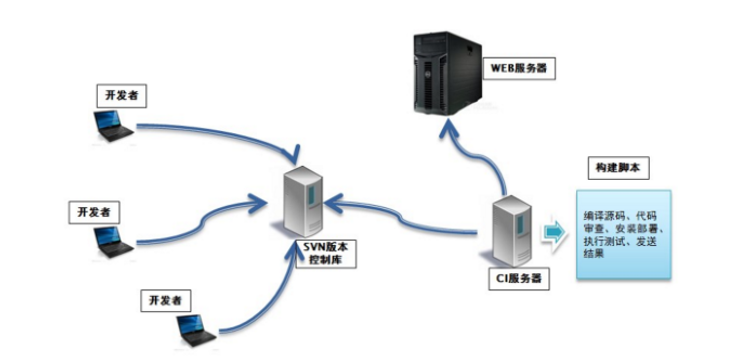
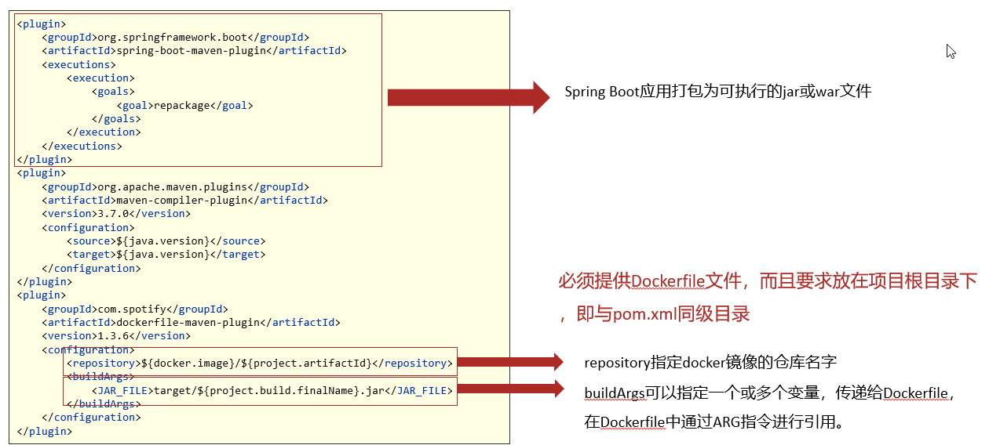
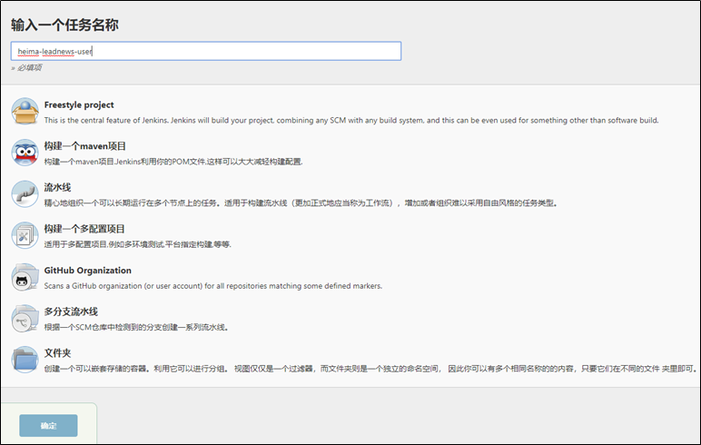
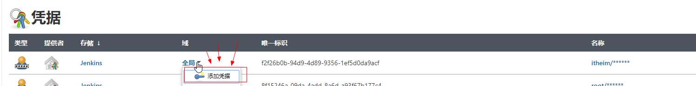
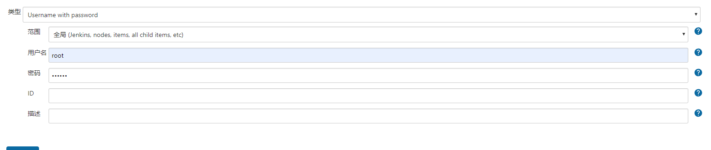
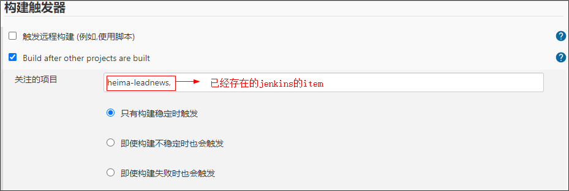

# 持续集成

持续集成（ Continuous integration ， 简称 CI ）指的是，频繁地（一天多次）将代码集成到主干



**持续集成的组成要素**

一个自动构建过程， 从检出代码、 编译构建、 运行测试、 结果记录、 测试统计等都是自动完成的， 无需人工干预。

一个代码存储库，即需要版本控制软件来保障代码的可维护性，同时作为构建过程的素材库，一般使用SVN或Git。

一个持续集成服务器， **Jenkins 就是一个配置简单和使用方便的持续集成服务器**。


1 ）首先，开发人员每天进行代码提交，提交到Git仓库

2）然后，Jenkins作为持续集成工具，使用Git工具到Git仓库拉取代码到集成服务器，再配合JDK，Maven等软件完成代码编译，代码测试与审查，测试，打包等工作，在这个过程中每一步出错，都重新再执行一次整个流程。

3）最后，Jenkins把生成的jar或war包分发到测试服务器或者生产服务器，测试人员或用户就可以访问应用。


# 软件的敏捷开发

敏捷开发（Agile Development） 的核心是迭代开发（Iterative Development） 与 增量开发（Incremental Development）。

**迭代开发**

对于大型软件项目，传统的开发方式是采用一个大周期（比如一年）进行开发，整个过程就是一次"大开发"；迭代开发的方式则不一样，它将开发过程拆分成多个小周期，即一次"大开发"变成多次"小开发"，每次小开发都是同样的流程，所以看上去就好像重复在做同样的步骤。

**增量开发**

软件的每个版本，都会新增一个用户可以感知的完整功能。也就是说，按照新增功能来划分迭代。


#  Jenkins安装配置

1. 采用YUM方式安装

   加入jenkins安装源：

   ```sh
   sudo wget -O /etc/yum.repos.d/jenkins.repo https://pkg.jenkins.io/redhat-stable/jenkins.repo --no-check-certificate
   
   sudo rpm --import https://pkg.jenkins.io/redhat-stable/jenkins.io.key
   ```

   执行yum命令安装：

   ```sh
   yum -y install jenkins
   ```

2. 采用RPM安装包方式

   [Jenkins安装包下载地址](https://pkg.jenkins.io/redhat-stable/)

   ```sh
   wget https://pkg.jenkins.io/redhat-stable/jenkins-2.190.1-1.1.noarch.rpm
   ```

   执行安装：

   ```sh
   rpm -ivh jenkins-2.190.1-1.1.noarch.rpm
   ```

3. 配置：

   修改配置文件：

   ```sh
   vi /etc/sysconfig/jenkins
   ```

   修改内容：

   ```sh
   # 修改为对应的目标用户， 这里使用的是root
   $JENKINS_USER="root"
   # 服务监听端口
   JENKINS_PORT="16060"
   ```

   目录权限：

   ```sh
   chown -R root:root /var/lib/jenkins
   chown -R root:root /var/cache/jenkins
   chown -R root:root /var/log/jenkins
   ```

   重启：

   ```sh
   systemctl restart jenkins
   ```

   如果启动失败， 出现错误信息：

   ```sh
   Starting Jenkins bash: /usr/bin/java: No such file or directory
   ```

   创建JAVA环境的软链接：

   ```sh
   ln -s /usr/local/jdk/bin/java /usr/bin/java
   ```

4. 管理后台初始化设置

   http://192.168.200.100:16060/

   需要输入管理密码， 在以下位置查看：

   ```sh
   cat /var/lib/jenkins/secrets/initialAdminPassword
   ```

   

1. 按默认设置，把建议的插件都安装上

   

   这一步等待时间较长， 安装完成之后， 创建管理员用户：

   

配置访问地址：


配置完成之后， 会进行重启， 之后可以看到管理后台：


# Jenkins插件安装

在实现持续集成之前， 需要确保以下插件安装成功。

- Maven Integration plugin： Maven 集成管理插件。
- Docker plugin： Docker集成插件。
- GitLab Plugin： GitLab集成插件。
- Publish Over SSH：远程文件发布插件。
- SSH: 远程脚本执行插件。

注意：服务器上应该安装好Git、Maven、Docker等工具


安装方法：

1. 进入【系统管理】-【插件管理】

2. 点击标签页的【可选插件】

   在过滤框中搜索插件名称

3. 勾选插件， 点击直接安装即可。

>注意，如果没有安装按钮，需要更改配置
>
>在安装插件的高级配置中，修改升级站点的连接为：http://updates.jenkins.io/update-center.json   保存
>
>
>
>


# Jenkins工具配置

1. 进入【系统管理】--> 【全局工具配置】

   

2. MAVEN配置全局设置

   

3. 指定JDK配置

   


4. 指定MAVEN 目录

   

5. 指定DOCKER目录

   

   如果不清楚docker的安装的目录，可以使用`whereis docker` 命令查看docker的安装的目录


# 案例

目标：把黑马头条的app端相关的微服务部署到192.168.200.100这台服务器上

## 1. 服务集成Docker配置

目标：部署的每一个微服务都是先创建docker镜像后创建对应容器启动

方式一：本地微服务打包以后上传到服务器，编写Dockerfile文件完成。

方式二：使用dockerfile-maven-plugin插件，可以直接把微服务创建为镜像使用（更省事）


**服务集成Docker配置**



在每个微服务的pom文件中添加如下：

```xml
<properties>
    <maven.compiler.source>8</maven.compiler.source>
    <maven.compiler.target>8</maven.compiler.target>
    <docker.image>docker_storage</docker.image>
</properties>

<build>
    <finalName>heima-leadnews-user</finalName>
    <plugins>
        <plugin>
            <groupId>org.springframework.boot</groupId>
            <artifactId>spring-boot-maven-plugin</artifactId>
            <executions>
                <execution>
                    <goals>
                        <goal>repackage</goal>
                    </goals>
                </execution>
            </executions>
        </plugin>
        <plugin>
            <groupId>org.apache.maven.plugins</groupId>
            <artifactId>maven-compiler-plugin</artifactId>
            <version>3.7.0</version>
            <configuration>
                <source>${java.version}</source>
                <target>${java.version}</target>
            </configuration>
        </plugin>
        <plugin>
            <groupId>com.spotify</groupId>
            <artifactId>dockerfile-maven-plugin</artifactId>
            <version>1.3.6</version>
            <configuration>
                <repository>${docker.image}/${project.artifactId}</repository>
                <buildArgs>
                    <JAR_FILE>target/${project.build.finalName}.jar</JAR_FILE>
                </buildArgs>
            </configuration>
        </plugin>
    </plugins>
</build>
```


给每个微服务添加如下Dockerfile文件

```dockerfile
# 设置JAVA版本
FROM openjdk:8
# 指定存储卷, 任何向/tmp写入的信息都不会记录到容器存储层
VOLUME /tmp
# 拷贝运行JAR包
ARG JAR_FILE
COPY ${JAR_FILE} app.jar
# 设置JVM运行参数， 这里限定下内存大小，减少开销
ENV JAVA_OPTS="\
-server \
-Xms256m \
-Xmx512m \
-XX:MetaspaceSize=256m \
-XX:MaxMetaspaceSize=512m"
#空参数，方便创建容器时传参
ENV PARAMS=""
# 入口点， 执行JAVA运行命令
ENTRYPOINT ["sh","-c","java -jar $JAVA_OPTS /app.jar $PARAMS"]
```


## 2. 部署依赖到Maven仓库中

在微服务运行之前需要在本地仓库中先去install所依赖的jar包，所以第一步应该是从git中拉取代码，并且把基础的依赖部分安装到仓库中

1.创建自由风格的软件项目


2.找到自己指定的git仓库，设置用户名和密码


3.把基础依赖信息安装到服务器上的本地仓库


4.执行


## 3.jenkins微服务打包配置

所有微服务打包的方式类似，以heima-leadnews-user微服务为例

**1) 新建任务**



**2) 找到自己指定的git仓库，设置用户名和密码**


**3)执行maven命令**


```java
clean install -Dmaven.test.skip=true  dockerfile:build -f heima-leadnews-service/heima-leadnews-user/pom.xml
```

<font color='red'>注意：根据自己的实际代码路径配置！</font>

`-Dmaven.test.skip=true`  跳过测试

`dockerfile:build` 启动dockerfile插件构建容器

`-f heima-leadnews-user/pom.xml` 指定需要构建的文件（必须是pom）

**4)并执行shell脚本**


```java
if [ -n  "$(docker ps -a -f  name=$JOB_NAME  --format '{{.ID}}' )" ]
 then
 #删除之前的容器
 docker rm -f $(docker ps -a -f  name=$JOB_NAME  --format '{{.ID}}' )
fi
 # 清理镜像
docker image prune -f 
 # 启动docker服务
docker run -d --net=host -e PARAMS="--spring.profiles.active=prod"  --name $JOB_NAME docker_storage/$JOB_NAME
```

`$JOB_NAME` 表示的是jenkins项目的名称。

**5)执行日志**


## 4.部署服务到远程服务器上

目标：使用jenkins（192.168.200.100）把微服务打包部署到192.168.200.130服务器上


**安装配置私有仓库**

对于持续集成环境的配置，Jenkins会发布大量的微服务， 要与多台机器进行交互， 可以采用docker镜像的保存与导出功能结合SSH实现， 但这样交互繁琐，稳定性差， 而且不便管理， 这里我们通过搭建Docker的私有仓库来实现， 这个有点类似GIT仓库， 集中统一管理资源， 由客户端拉取或更新。

1. 下载最新Registry镜像

   ```sh
   docker pull registry:latest
   ```

2. 启动Registry镜像服务

   ```sh
   docker run -d -p 5000:5000 --name registry -v /usr/local/docker/registry:/var/lib/registry registry:latest
   ```

   映射5000端口； -v是将Registry内的镜像数据卷与本地文件关联， 便于管理和维护Registry内的数据。

3. 查看仓库资源

   访问地址：http://192.168.200.100:5000/v2/_catalog

   启动正常， 可以看到返回：

   ```json
   {"repositories":[]}
   ```

   目前并没有上传镜像， 显示空数据。

4. 配置Docker客户端

   正常生产环境中使用， 要配置HTTPS服务， 确保安全，内部开发或测试集成的局域网环境，可以采用简便的方式， 不做安全控制。

   先确保持续集成环境的机器已安装好Docker客户端， 然后做以下修改：

   ```sh
   vi /lib/systemd/system/docker.service
   ```

   修改内容：

   ```sh
   ExecStart=/usr/bin/dockerd --insecure-registry 192.168.200.100:5000
   ```

   指向安装Registry的服务IP与端口。

   重启生效：

   ```sh
   systemctl daemon-reolad
   systemctl restart docker.service
   ```


**jenkins系统配置远程服务器链接**

位置：Manage Jenkins-->Configure System


需要添加凭证

位置：Manage Jenkins-->Manage CreDentials


添加链接到130服务器的用户名和密码






**创建jenkins项目**

1.设置参数


这个参数可以供下面的shell脚本进行使用

2.添加构建目标


maven命令

```java
clean install -Dmaven.test.skip=true dockerfile:build -f heima-leadnews/heima-leadnews-service/heima-leadnews-article/pom.xml
```

shell脚本

```shell
image_tag=$docker_registry/docker_storage/$JOB_NAME
echo '================docker镜像清理================'
if [ -n  "$(docker ps -a -f  name=$JOB_NAME  --format '{{.ID}}' )" ]
 then
 #删除之前的容器
 docker rm -f $(docker ps -a -f  name=$JOB_NAME  --format '{{.ID}}' )
fi
 # 清理镜像
docker image prune -f 

# 创建TAG
docker tag docker_storage/$JOB_NAME $image_tag
echo '================docker镜像推送================'
# 推送镜像
docker push $image_tag
# 删除TAG
docker rmi $image_tag
echo '================docker tag 清理 ================'
```

3.添加在远程服务器上执行脚本的目标


远程服务器执行的shell脚本

```shell
echo '================拉取最新镜像================'
docker pull $docker_registry/docker_storage/$JOB_NAME

echo '================删除清理容器镜像================'
if [ -n  "$(docker ps -a -f  name=$JOB_NAME  --format '{{.ID}}' )" ]
 then
 #删除之前的容器
 docker rm -f $(docker ps -a -f  name=$JOB_NAME  --format '{{.ID}}' )
fi
 # 清理镜像
docker image prune -f 

echo '===============启动容器================'
docker run -d   --net=host -e PARAMS="--spring.profiles.active=prod" --name $JOB_NAME $docker_registry/docker_storage/$JOB_NAME
```


# jenkins触发器配置

## URL触发远程构建

触发远程构建，修改jenkins的配置，如下


触发构建url： http://192.168.200.100:16060/job/leadnews-admin/build?token=88888888

## 其他工程构建后触发

配置需要触发的工程



这样，当heima-leadnews项目构建完成后，会自动构建该项目。

## 定时构建

定时构建（ Build periodically）


定时字符串从左往右分别为： 分 时 日 月 周

**定时构建-定时表达式**

定时字符串从左往右分别为： 分 时 日 月 周

| 组成部分 | 含义        | 取值范围                   |
| -------- | ----------- | -------------------------- |
| 第一部分 | minute (分) | 0~59                       |
| 第二部分 | hour(小时)  | 0~23                       |
| 第三部分 | day(天)     | 1~31                       |
| 第四部分 | month(月)   | 1~12                       |
| 第五部分 | week(周)    | 0~7，0 和 7 都是表示星期天 |

- 符号H 表示一个随机数，一般用于分散项目的构建时间。

- 符号*  取值范围的任意值

案例：

- 每30分钟构建一次：H/30 * * * * 10:02 10:32

- 每2个小时构建一次: H H/2 * * *

- 每天的8点，12点，22点，一天构建3次： (多个时间点中间用逗号隔开) 0 8,12,22 * * *

- 每天中午12点定时构建一次 H 12 * * *

- 每天下午18点定时构建一次 H 18 * * *

## 轮询

轮询 SCM（Poll SCM）

轮询SCM，是指定时扫描本地代码仓库的代码是否有变更，如果代码有变更就触发项目构建。


Jenkins会定时扫描本地整个项目的代码，增大系统的开销，不建议使用。

