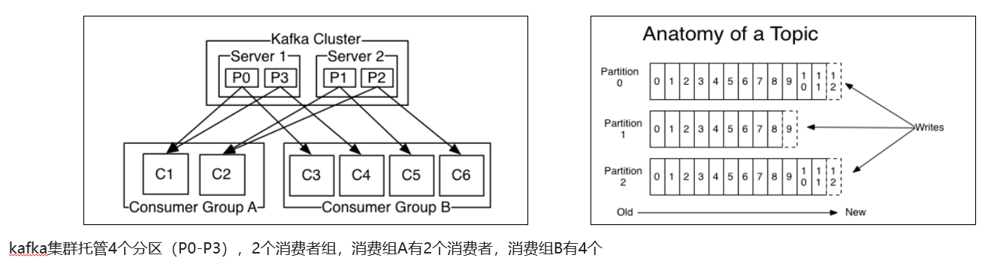

# kafka概述

消息中间件对比-选择建议

| **消息中间件** | **建议**                                                     |
| -------------- | ------------------------------------------------------------ |
| Kafka          | 追求高吞吐量，适合产生大量数据的互联网服务的数据收集业务     |
| RocketMQ       | 可靠性要求很高的金融互联网领域,稳定性高，经历了多次阿里双11考验 |
| RabbitMQ       | 性能较好，社区活跃度高，数据量没有那么大，优先选择功能比较完备的RabbitMQ |

kafka介绍

Kafka 是一个分布式流媒体平台,类似于消息队列或企业消息传递系统。kafka官网：http://kafka.apache.org/  


# 基本概念


- producer：发布消息的对象称之为主题生产者（Kafka topic producer）

- topic：Kafka将消息分门别类，每一类的消息称之为一个主题（Topic）

- consumer：订阅消息并处理发布的消息的对象称之为主题消费者（consumers）

- broker：已发布的消息保存在一组服务器中，称之为Kafka集群。集群中的每一个服务器都是一个代理（Broker）。 消费者可以订阅一个或多个主题（topic），并从Broker拉数据，从而消费这些已发布的消息。

## 1. Kafka分区

### 1.1 分区（partition）

Kafka的topic被分成多个分区。topic在kafka中是一个逻辑概念，一个分区是最小的存储单元，存储一个主题中的消息的子集。每个分区都是一个日志文件，消息以只追加的方式写入其中。


### 1.2 偏移量（Offsets)

分区中的每条记录（消息）都被分配一个名为偏移量（offset）的顺序标识符，该标识符对应分区中的每条记录都是唯一的。

偏移量（offset）是一个递增的、不可变的数字，由Kafka维护。当记录被写入分区时，它被追加到日志的末尾，并分配下一个顺序偏移量。

### 1.3 代理（brokers）

Kafka集群由一个或多个服务器组成，在kafka的世界里，他们被称为**代理（brokers）**。**每个代理持有属于整个集群的记录子集。**Kafka将一个特定主题的分区分布到多个broker上。通过这样做，我们将得到以下好处：

- 如果我们将一个主题的所有分区放在一个代理中，那么该主题的可伸缩性将受到代理IO吞吐量的限制。通过将分区分散到多个代理，单个主题可以水平扩展，以提供远远超过单个代理服务器的性能。
- 单个主题可以由多个使用者并行消费。单个代理存储所有的分区的话会限制消费者的连接数量。分布到多个代理商的分区支持更多的消费者。
- 同一个消费者的多个实例可以连接到不同代理的分区，从而允许非常高的消息处理吞吐量。每个消费者实例将由一个分区提供服务。


**分区是Kafka提供冗余的方式。**

**Kafka在多个broker上保留同一个分区的多个副本**。这个冗余的拷贝称为副本。如果一个代理宕机了，Kafka仍然可以用其他代理存储的分区副本来服务消费者。

### 1.4 消息分区指定

生产者如何决定记录（消息）应该进入哪个分区？生产者可以通过三种方式进行决定。

#### ① 分区键

生产者可以使用**分区键**将消息指向特定的分区。

一个唯一的设备ID或用户ID将是一个很好的分区键。

默认情况下，分区键通过一个哈希函数传递，该函数创建分区分配。这样可以确保所产生的记录包含相同的分区键都将到分配到相同的分区。指定分区键可以将相关事件保存在同一个分区中。


#### ② 轮询

如果生产者在生产记录时没有指定分区键，Kafka将使用**轮循分区**分配。这些记录将被均匀地写入特定主题的所有分区。但是，如果不使用分区键，则在给定的分区中不能保证记录的顺序。

#### ③ 随机

生产者生产记录时，随机放入该主题的任意一个分区中。

### 1.5 从分区读取记录

与其他发布/订阅实现不同，Kafka不向消费者推送消息。相反，消费者必须从Kafka主题分区中拉取消息。消费者连接到代理中的一个分区，按照消息被写入的顺序读取消息。

此时，消息的偏移量相当于消费者端游标。消费者通过跟踪消息的偏移量来跟踪它已经消费了哪些消息。读取消息后，消费者将游标移到分区中的下一个偏移量并继续。移动和记住分区内的最后读偏移量是消费者的责任。kafka不管偏移量的变化。


## 2. 消费者组

**消费者组（Consumer Group）** ：指的就是由一个或多个消费者组成的群体。

一个发布在Topic上消息被分发给**消费者组中的<u>一个</u>消费者**

- 如果所有的消费者都在一个组中，那么这就变成了queue模型

- 所有的消费者都在不同的组中，那么就完全变成了发布-订阅模型

  

1. 生产者发送消息，多个消费者订阅同一个主题，这些消费者**设置同一个组**，那么只能该组的消费者中**只有一个**消费者收到消息（一对一）

2. 生产者发送消息，多个消费者订阅同一个主题，这些消费者**设置不同的组**，那么所有消费者都能收到消息（一对多）

当一个消费者组消费一个topic的分区时，Kafka会确保每个分区都被组中的一个消费者消费。

下图表述这其中的关系：


一个topic的分区平均“分配”给每个组内的消费者。


## 3. 消息有序性

应用场景：

- 即时消息中的单对单聊天和群聊，保证发送方消息发送顺序与接收方的顺序一致

- 充值转账两个渠道在同一个时间进行余额变更，短信通知必须要有顺序



topic分区中消息只能由消费者组中的唯一一个消费者处理，所以消息肯定是按照先后顺序进行处理的。但是它也仅仅是保证Topic的一个分区顺序处理，不能保证跨分区的消息先后处理顺序。 **所以，如果你想要顺序的处理Topic的所有消息，那就只提供一个分区。**


# kafka高可用设计

## 1. 集群


- Kafka 的服务器端由被称为 Broker 的服务进程构成，即一个 Kafka 集群由多个 Broker 组成

- 这样如果集群中某一台机器宕机，其他机器上的 Broker 也依然能够对外提供服务。这其实就是 Kafka 提供高可用的手段之一

## 2. 备份机制(Replication）


Kafka 中消息的备份又叫做 副本（Replica）

Kafka 定义了两类副本：

- 领导者副本（Leader Replica）

- 追随者副本（Follower Replica）

**同步方式**


ISR（in-sync replica）需要同步复制保存的follower


如果leader失效后，需要选出新的leader，选举的原则如下：

第一：选举时优先从ISR中选定，因为这个列表中follower的数据是与leader同步的

第二：如果ISR列表中的follower都不行了，就只能从其他follower中选取


极端情况，就是所有副本都失效了，这时有两种方案

第一：等待ISR中的一个活过来，选为Leader，数据可靠，但活过来的时间不确定

第二：选择第一个活过来的Replication，不一定是ISR中的，选为leader，以最快速度恢复可用性，但数据不一定完整


# kafka安装（Docker）

Kafka对于zookeeper是强依赖，保存kafka相关的节点数据，所以安装Kafka之前必须先安装zookeeper

- Docker安装zookeeper

下载镜像：

```shell
docker pull zookeeper:3.4.14
```

创建容器

```shell
docker run -d --name zookeeper -p 2181:2181 zookeeper:3.4.14
```

- Docker安装kafka

下载镜像：

```shell
docker pull wurstmeister/kafka:2.12-2.3.1
```

创建容器

```shell
docker run -d --name kafka \
--env KAFKA_ADVERTISED_HOST_NAME=192.168.200.130 \
--env KAFKA_ZOOKEEPER_CONNECT=192.168.200.130:2181 \
--env KAFKA_ADVERTISED_LISTENERS=PLAINTEXT://192.168.200.130:9092 \
--env KAFKA_LISTENERS=PLAINTEXT://0.0.0.0:9092 \
--env KAFKA_HEAP_OPTS="-Xmx256M -Xms256M" \
--net=host wurstmeister/kafka:2.12-2.3.1
```


# Java客户端

## 1. 依赖

```xml
<dependency>
    <groupId>org.apache.kafka</groupId>
    <artifactId>kafka-clients</artifactId>
</dependency>
```

## 2. 生产者发送消息

```java
//1.kafka的配置信息
Properties properties = new Properties();
//kafka的连接地址
properties.put(ProducerConfig.BOOTSTRAP_SERVERS_CONFIG,"192.168.200.130:9092");
//发送失败，失败的重试次数
properties.put(ProducerConfig.RETRIES_CONFIG,5);
//消息key的序列化器
properties.put(ProducerConfig.KEY_SERIALIZER_CLASS_CONFIG,"org.apache.kafka.common.serialization.StringSerializer");
//消息value的序列化器
properties.put(ProducerConfig.VALUE_SERIALIZER_CLASS_CONFIG,"org.apache.kafka.common.serialization.StringSerializer");

//2.生产者对象
KafkaProducer<String,String> producer = new KafkaProducer<String, String>(properties);

//封装发送的消息，参数依次为   主题、key、消息内容
ProducerRecord<String,String> record = new ProducerRecord<String, String>("itheima-topic","100001","hello kafka");

//3.发送消息
producer.send(record);

//4.关闭消息通道，必须关闭，否则消息发送不成功
producer.close();
```

## 3. 消费者接收消息

```java
//1.添加kafka的配置信息
Properties properties = new Properties();
//kafka的连接地址
properties.put(ConsumerConfig.BOOTSTRAP_SERVERS_CONFIG, "192.168.200.130:9092");
//消费者组
properties.put(ConsumerConfig.GROUP_ID_CONFIG, "group2");
//消息的反序列化器
properties.put(ConsumerConfig.KEY_DESERIALIZER_CLASS_CONFIG, "org.apache.kafka.common.serialization.StringDeserializer");
properties.put(ConsumerConfig.VALUE_DESERIALIZER_CLASS_CONFIG, "org.apache.kafka.common.serialization.StringDeserializer");

//2.消费者对象
KafkaConsumer<String, String> consumer = new KafkaConsumer<String, String>(properties);

//3.订阅主题
consumer.subscribe(Collections.singletonList("itheima-topic"));

//当前线程一直处于监听状态
while (true) {
    //4.获取消息
    ConsumerRecords<String, String> consumerRecords = consumer.poll(Duration.ofMillis(1000));
    for (ConsumerRecord<String, String> consumerRecord : consumerRecords) {
        System.out.println(consumerRecord.key());
        System.out.println(consumerRecord.value());
    }
```

2. 


## 4. 生产者详解

### 4.1 发送类型

- **同步发送**

  使用send()方法发送，它会返回一个Future对象，调用get()方法进行等待，就可以知道消息是否发送成功

```java
RecordMetadata recordMetadata = producer.send(kvProducerRecord).get();
System.out.println(recordMetadata.offset());
```

- **异步发送**

  调用send()方法，并指定一个回调函数，服务器在返回响应时调用函数

```java
//异步消息发送
producer.send(kvProducerRecord, new Callback() {
    @Override
    public void onCompletion(RecordMetadata recordMetadata, Exception e) {
        if(e != null){
            System.out.println("记录异常信息到日志表中");
        }
        System.out.println(recordMetadata.offset());
    }
});
```

### 4.2 配置参数

#### acks


代码的配置方式：

```java
//ack配置  消息确认机制
prop.put(ProducerConfig.ACKS_CONFIG,"all");
```

参数的选择说明

| **确认机制**     | **说明**                                                     |
| ---------------- | ------------------------------------------------------------ |
| acks=0           | 生产者在成功写入消息之前不会等待任何来自服务器的响应,消息有丢失的风险，但是速度最快 |
| acks=1（默认值） | 只要集群首领节点收到消息，生产者就会收到一个来自服务器的成功响应 |
| acks=all         | 只有当所有参与赋值的节点全部收到消息时，生产者才会收到一个来自服务器的成功响应 |

#### **retries**


生产者从服务器收到的错误有可能是临时性错误，在这种情况下，retries参数的值决定了生产者可以重发消息的次数，如果达到这个次数，生产者会放弃重试返回错误，默认情况下，生产者会在每次重试之间等待100ms

代码中配置方式：

```java
//重试次数
prop.put(ProducerConfig.RETRIES_CONFIG,10);
```

#### **compression.type**

默认情况下， 消息发送时不会被压缩。

代码中配置方式：

```java
//数据压缩
prop.put(ProducerConfig.COMPRESSION_TYPE_CONFIG,"lz4");
```

| **压缩算法** | **说明**                                                     |
| ------------ | ------------------------------------------------------------ |
| snappy       | 占用较少的  CPU，  却能提供较好的性能和相当可观的压缩比， 如果看重性能和网络带宽，建议采用 |
| lz4          | 占用较少的 CPU， 压缩和解压缩速度较快，压缩比也很客观        |
| gzip         | 占用较多的  CPU，但会提供更高的压缩比，网络带宽有限，可以使用这种算法 |

使用压缩可以降低网络传输开销和存储开销，而这往往是向 Kafka 发送消息的瓶颈所在。


## 5. 消费者详解

### 5.1 提交偏移量

每当消费者从一个topic的分区中获取消息的时候，消费者会往一个叫做 `_consumer_offset` 的特殊主题发送消息，这个特殊消息里包含了它此次poll()获取到的消息的偏移量，可以把这个偏移量理解为消费者当前在该分区中的读取位置，即下一次需要从该偏移量位置 + 1开始poll()消息（这个过程叫做**提交偏移量**）。


### 5.2 **自动提交偏移量**

当 `enable.auto.commit` 属性被设为 true，那么每过 5s（默认值），消费者会自动把从 poll()方法（轮询）接收到的最大偏移量提交上去。

提交时间间隔由 `auto.commit.interval.ms` 控制，默认值是 5000。

与消费者里的其他东西一样，自动提交也是在轮询里进行的。消费者每次在进行轮询时会检查是否该提交偏移量了，如果是，那么就会提交从上一次轮询返回的偏移量。


### 5.3 再均衡问题

如果消费者发生崩溃或有新的消费者加入群组，就会触发**再均衡**：

正常的情况：


如果消费者2挂掉以后，会发生**再均衡**，消费者2负责的分区会被其他消费者进行消费：


**再均衡后不可避免会出现一些问题**

问题一：


如果提交偏移量小于消费者处理的最后一个消息的偏移量，那么处于两个偏移量之间的消息就会被重复处理。


**注：**

轮询就是调用 poll()方法，事件就是消息

这个图的意思是：

消费者2（上图中挂掉的那个）调用poll()方法，获取到了 7-11号事件（事件就是消息），并且当前正在处理10号事件（10号之前的消息已经被消费了）。但是由于采用的自动提交偏移量，上一次提交的偏移量为2号，这时消费者2挂掉了，当进行再均衡之后，消费者1”接管“上图中的分区，而消费者1发现该分区的偏移量为2，然后就会重新消费2号之后的消息。


问题二：


如果提交的偏移量大于消费者的最后一个消息的偏移量，那么处于两个偏移量之间的消息将会丢失。

这个图也是同上面类似，自动提交的偏移量为11，而消费者2正在处理5号事件就挂掉了，再均衡之后，消费者1会从11号之后的事件开始消费，从而丢失6-11号事件。


### 5.4 **手动提交偏移量** 

通常可以使用手动提交方式来解决上述问题。

当 `enable.auto.commit` 被设置为false，可以有以下三种手动提交方式

- **同步提交**

- **异步提交**

- **同步和异步组合提交**

#### 同步提交

把`enable.auto.commit`设置为false，让应用程序决定何时提交偏移量。

使用`commitSync()`提交偏移量，`commitSync()`将会提交**poll返回的最新的偏移量**，所以在处理完所有记录后要确保调用了`commitSync()`方法。否则还是会有消息丢失的风险。

只要没有发生不可恢复的错误，`commitSync()`方法会一直尝试直至提交成功，如果提交失败也可以记录到错误日志里。

```java
while (true){
    ConsumerRecords<String, String> records = consumer.poll(Duration.ofMillis(1000));
    for (ConsumerRecord<String, String> record : records) {
        System.out.println(record.value());
        System.out.println(record.key());
        try {
            consumer.commitSync();//在每次处理完消息后调用同步提交当前最新的偏移量
        }catch (CommitFailedException e){
            System.out.println("记录提交失败的异常："+e);
        }

    }
}
```

手动同步提交有一个缺点，那就是当发起提交调用时应用会阻塞。当然我们可以减少手动同步提交的频率，但这个会增加消息重复的概率（和自动提交一样）。另外一个解决办法是，使用异步提交的API。

#### 异步提交

异步提交也有个缺点，那就是如果服务器返回提交失败，**异步提交不会进行重试**。相比较起来，同步提交会进行重试直到成功或者最后抛出异常给应用。异步提交没有实现重试是因为，如果同时存在多个异步提交，进行重试可能会导致位移覆盖。

举个例子，假如我们发起了一个异步提交commitA，此时的提交位移为2000，随后又发起了一个异步提交commitB且位移为3000；commitA提交失败但commitB提交成功，此时commitA进行重试并成功的话，会将实际上将已经提交的位移从3000回滚到2000，导致消息重复消费。

```java
while (true){
    ConsumerRecords<String, String> records = consumer.poll(Duration.ofMillis(1000));
    for (ConsumerRecord<String, String> record : records) {
        System.out.println(record.value());
        System.out.println(record.key());
    }
    //异步提交，支持回调
    consumer.commitAsync(new OffsetCommitCallback() {
        @Override
        public void onComplete(Map<TopicPartition, OffsetAndMetadata> map, Exception e) {
            if(e!=null){
                System.out.println("记录错误的提交偏移量："+ map+",异常信息"+e);
            }
        }
    });
}
```

#### 同步和异步组合提交

一般情况下，针对偶尔出现的提交失败，不进行重试不会有太大问题，因为如果提交失败是因为临时问题导致的，那么后续的提交总会有成功的。

但如果这是发生在关闭消费者或再均衡前的最后一次提交，就要确保能够提交成功。因此在这种情况下，我们应该考虑使用混合提交

```java
try {
    while (true){
        ConsumerRecords<String, String> records = consumer.poll(Duration.ofMillis(1000));
        for (ConsumerRecord<String, String> record : records) {
            System.out.println(record.value());
            System.out.println(record.key());
        }
        //正常情况使用异步提交
        consumer.commitAsync();
    }
}catch (Exception e){+
    e.printStackTrace();
    System.out.println("记录错误信息："+e);
}finally {
    //关闭消费者之前或者发生异常后调用同步提交
    try {
        consumer.commitSync();
    }finally {
        consumer.close();
    }
}
```


# SpringBoot集成kafka

## 1. 依赖

```xml
<dependencies>
    <dependency>
        <groupId>org.springframework.kafka</groupId>
        <artifactId>spring-kafka</artifactId>
    </dependency>
</dependencies>
```

## 2. application.yml

```yaml
spring:
  application:
    name: kafka-demo
  kafka:
    bootstrap-servers: 192.168.200.130:9092	#kafka地址
    producer:		#生产者配置
      retries: 10
      key-serializer: org.apache.kafka.common.serialization.StringSerializer
      value-serializer: org.apache.kafka.common.serialization.StringSerializer
    consumer:		#消费者配置
      group-id: ${spring.application.name}
      key-deserializer: org.apache.kafka.common.serialization.StringDeserializer
      value-deserializer: org.apache.kafka.common.serialization.StringDeserializer
```

## 3. 消息生产者

```java
//使用KafkaTemplate对象来发送消息
@Autowired
private KafkaTemplate<String,String> kafkaTemplate;
kafkaTemplate.send("itcast-topic","黑马程序员");
```

## 4. 消息消费者

```java
@Component
public class HelloListener {
	//使用KafkaListener注解 来监听消息
    @KafkaListener(topics = "itcast-topic")
    public void onMessage(String message){
        if(!StringUtils.isEmpty(message)){
            System.out.println(message);
        }
    }
}
```

## 5. 传递消息为对象

目前springboot整合后的kafka，因为序列化器是StringSerializer，如果需要传递对象，通常把对象序列化为JSON字符串

- 发送消息

```java
User user = new User();
user.setUsername("xiaowang");
user.setAge(18);

kafkaTemplate.send("user-topic", JSON.toJSONString(user));
```

- 接收消息

```java
@KafkaListener(topics = "user-topic")
public void onMessage(String message){
    if(!StringUtils.isEmpty(message)){
        User user = JSON.parseObject(message, User.class);
        System.out.println(user);
    }
}
```


# KafkaStream

一般流式计算会与批量计算相比较。在流式计算模型中，输入是持续的，可以认为在时间上是无界的，也就意味着，永远拿不到全量数据去做计算。同时，计算结果是持续输出的，也即计算结果在时间上也是无界的。流式计算一般对实时性要求较高，同时一般是先定义目标计算，然后数据到来之后将计算逻辑应用于数据。同时为了提高计算效率，往往尽可能采用增量计算代替全量计算。


## 相关概念

- **源处理器（Source Processor）**：源处理器是一个没有任何上游处理器的特殊类型的流处理器。它从一个或多个kafka主题生成输入流。通过消费这些主题的消息并将它们转发到下游处理器。
- **Sink处理器**：sink处理器是一个没有下游流处理器的特殊类型的流处理器。它接收上游流处理器的消息发送到一个指定的**Kafka主题**。


## 依赖

```xml
<dependency>
    <groupId>org.apache.kafka</groupId>
    <artifactId>kafka-streams</artifactId>
</dependency>
```

## 入门

```java
/**
 * 流式处理
 */
public class KafkaStreamQuickStart {

    public static void main(String[] args) {

        //kafka的配置信息
        Properties prop = new Properties();
        prop.put(StreamsConfig.BOOTSTRAP_SERVERS_CONFIG,"192.168.200.130:9092");
        prop.put(StreamsConfig.DEFAULT_KEY_SERDE_CLASS_CONFIG, Serdes.String().getClass());
        prop.put(StreamsConfig.DEFAULT_VALUE_SERDE_CLASS_CONFIG, Serdes.String().getClass());
        prop.put(StreamsConfig.APPLICATION_ID_CONFIG,"streams-quickstart");

        //stream 构建器
        StreamsBuilder streamsBuilder = new StreamsBuilder();

        //流式计算
        streamProcessor(streamsBuilder);


        //创建kafkaStream对象
        KafkaStreams kafkaStreams = new KafkaStreams(streamsBuilder.build(),prop);
        //开启流式计算
        kafkaStreams.start();
    }

    /**
     * 流式计算
     * 消息的内容：hello kafka  hello itcast
     * @param streamsBuilder
     */
    private static void streamProcessor(StreamsBuilder streamsBuilder) {
        //创建kstream对象，同时指定从那个topic中接收消息
        KStream<String, String> stream = streamsBuilder.stream("itcast-topic-input");
        /**
         * 处理消息的value
         */
        stream.flatMapValues(new ValueMapper<String, Iterable<String>>() {
            @Override
            public Iterable<String> apply(String value) {
                return Arrays.asList(value.split(" "));
            }
        })
                //按照value进行聚合处理
                .groupBy((key,value)->value)
                //时间窗口
                .windowedBy(TimeWindows.of(Duration.ofSeconds(10)))
                //统计单词的个数
                .count()
                //转换为kStream
                .toStream()
                .map((key,value)->{
                    System.out.println("key:"+key+",vlaue:"+value);
                    return new KeyValue<>(key.key().toString(),value.toString());
                })
                //发送消息
                .to("itcast-topic-out");
    }
}
```


## SpringBoot集成

1）自定配置参数

```java
/**
 * 通过重新注册KafkaStreamsConfiguration对象，设置自定配置参数
 */

@Setter
@Getter
@Configuration
@EnableKafkaStreams		//一定要添加该注解
@ConfigurationProperties(prefix="kafka")
public class KafkaStreamConfig {
    private static final int MAX_MESSAGE_SIZE = 16* 1024 * 1024;
    private String hosts;
    private String group;
    @Bean(name = KafkaStreamsDefaultConfiguration.DEFAULT_STREAMS_CONFIG_BEAN_NAME)
    public KafkaStreamsConfiguration defaultKafkaStreamsConfig() {
        Map<String, Object> props = new HashMap<>();
        props.put(StreamsConfig.BOOTSTRAP_SERVERS_CONFIG, hosts);
        props.put(StreamsConfig.APPLICATION_ID_CONFIG, this.getGroup()+"_stream_aid");
        props.put(StreamsConfig.CLIENT_ID_CONFIG, this.getGroup()+"_stream_cid");
        props.put(StreamsConfig.RETRIES_CONFIG, 10);
        props.put(StreamsConfig.DEFAULT_KEY_SERDE_CLASS_CONFIG, Serdes.String().getClass());
        props.put(StreamsConfig.DEFAULT_VALUE_SERDE_CLASS_CONFIG, Serdes.String().getClass());
        return new KafkaStreamsConfiguration(props);
    }
}
```

修改application.yml文件，在最下方添加自定义配置

```yaml
kafka:
  hosts: 192.168.200.130:9092
  group: ${spring.application.name}
```

(2)新增配置类，创建KStream对象，进行聚合

```java
@Configuration
@Slf4j
public class KafkaStreamHelloListener {

    @Bean
    public KStream<String,String> kStream(StreamsBuilder streamsBuilder){
        //创建kstream对象，同时指定从那个topic中接收消息
        KStream<String, String> stream = streamsBuilder.stream("itcast-topic-input");
        stream.flatMapValues(new ValueMapper<String, Iterable<String>>() {
            @Override
            public Iterable<String> apply(String value) {
                return Arrays.asList(value.split(" "));
            }
        })
                //根据value进行聚合分组
                .groupBy((key,value)->value)
                //聚合计算时间间隔
                .windowedBy(TimeWindows.of(Duration.ofSeconds(10)))
                //求单词的个数
                .count()
                .toStream()
                //处理后的结果转换为string字符串
                .map((key,value)->{
                    System.out.println("key:"+key+",value:"+value);
                    return new KeyValue<>(key.key().toString(),value.toString());
                })
                //发送消息
                .to("itcast-topic-out");
        return stream;
    }
}
```


例子：

```java
@Configuration
@Slf4j
public class HotArticleStreamHandler {
    @Bean
    public KStream<String, String> kStream(StreamsBuilder streamsBuilder) {
        //接收消息
        KStream<String, String> kstream = streamsBuilder.stream(HotArticleConstants.HOT_ARTICLE_SCORE_TOPIC);

        kstream.map((key,value)->{
            log.info("收到消息：{}",value);
            UpdateApArticleMsg msg = JSON.parseObject(value, UpdateApArticleMsg.class);
            //重置消息的key，value
            //例如： 12345678(文章id) -> LIKES:1
            return new KeyValue<>(msg.getArticleId().toString(),msg.getType().name() + ":" + msg.getIncrement());
        })
                .groupBy((key,value)->key)  //按文章id进行聚合
                .windowedBy(TimeWindows.of(Duration.ofSeconds(10))) //聚合的时间窗口为 10s
                //自行完成聚合
                .aggregate(new Initializer<String>() {
                    //初始化方法，返回值为聚合的初始值
                    @Override
                    public String apply() {
                        return "COLLECTION:0,COMMENT:0,LIKES:0,VIEWS:0";
                    }
                }, new Aggregator<String, String, String>() {
                    //举个例：这个方法的 key就是文章id，value就是 LIKES:1 ,aggValue 为 Initializer的返回值
                    // 方法的返回值就是聚合后的 aggValue。也就是说这个方法会对消息流进行处理，每次处理一个消息。
                    // 以前一次处理的 aggValue为输入，返回处理了该次消息之后的aggValue。这个方法就像流水线工人一样，对消息进行处理
                    @Override
                    public String apply(String key, String value, String aggValue) {
                        if(StringUtils.isBlank(value))
                            return aggValue;
                        //把 COLLECTION:0,COMMENT:0,LIKES:0,VIEWS:0进行分割
                        String[] arr = aggValue.split(",");
                        int col = 0,com=0,lik=0,vie=0;
                        for (String s : arr) {
                            //再对 COLLECTION:0 进行分割
                            String[] split = s.split(":");
                            //根据操作类型来判断
                            switch(UpdateApArticleMsg.UpdateArticleType.valueOf(split[0])){
                                case COLLECTION:
                                    col = Integer.parseInt(split[1]);
                                    break;
                                case COMMENT:
                                    com = Integer.parseInt(split[1]);
                                    break;
                                case LIKES:
                                    lik = Integer.parseInt(split[1]);
                                    break;
                                case VIEWS:
                                    vie = Integer.parseInt(split[1]);
                                    break;
                            }
                        }
                        //对消息的值进行处理
                        String[] valueSplit = value.split(":");
                        switch(UpdateApArticleMsg.UpdateArticleType.valueOf(valueSplit[0])){
                            case COLLECTION:
                                col += Integer.parseInt(valueSplit[1]);
                                break;
                            case COMMENT:
                                com += Integer.parseInt(valueSplit[1]);
                                break;
                            case LIKES:
                                lik += Integer.parseInt(valueSplit[1]);
                                break;
                            case VIEWS:
                                vie += Integer.parseInt(valueSplit[1]);
                                break;
                        }
                        aggValue = String.format("COLLECTION:%d,COMMENT:%d,LIKES:%d,VIEWS:%d", col, com, lik, vie);
                        log.info("文章id:{},当前时间窗口内处理结果：{}" ,key,aggValue);
                        return aggValue;
                    }
                }, Materialized.as("hot-article-stream-count-001"))
                //聚合后转化为流并发送给下游，用于更新数据库中的数量以及计算评分
                .toStream()
                .map((key,value)->new KeyValue<>(key.key().toString(),formatObj(key.key().toString(),value)))
                .to(HotArticleConstants.HOT_ARTICLE_INCR_HANDLE_TOPIC);

        return kstream;
    }

    /**
     * 格式化消息的value数据
     * @param articleId
     * @param value
     * @return
     */
    public String formatObj(String articleId,String value){
        ArticleVisitStreamMsg msg = new ArticleVisitStreamMsg();
        msg.setArticleId(Long.valueOf(articleId));
        //COLLECTION:0,COMMENT:0,LIKES:0,VIEWS:0
        String[] valAry = value.split(",");
        for (String val : valAry) {
            String[] split = val.split(":");
            switch (UpdateApArticleMsg.UpdateArticleType.valueOf(split[0])){
                case COLLECTION:
                    msg.setCollect(Integer.parseInt(split[1]));
                    break;
                case COMMENT:
                    msg.setComment(Integer.parseInt(split[1]));
                    break;
                case LIKES:
                    msg.setLike(Integer.parseInt(split[1]));
                    break;
                case VIEWS:
                    msg.setView(Integer.parseInt(split[1]));
                    break;
            }
        }
        log.info("聚合消息处理之后的结果为:{}",JSON.toJSONString(msg));
        return JSON.toJSONString(msg);
    }
}

```

