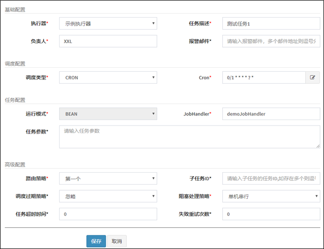

Spring传统的定时任务@Scheduled，但是这样存在这一些问题 ：

- 做集群任务的重复执行问题

- cron表达式定义在代码之中，修改不方便

- 定时任务失败了，无法重试也没有统计

- 如果任务量过大，不能有效的分片执行

解决这些问题的方案为：

xxl-job 分布式任务调度框架

源码地址：https://gitee.com/xuxueli0323/xxl-job

文档地址：https://www.xuxueli.com/xxl-job/


# docker部署调度中心

1.创建mysql容器，初始化xxl-job的SQL脚本

```shell
docker run -p 3306:3306 --name mysql57 \
-v /opt/mysql/conf:/etc/mysql \
-v /opt/mysql/logs:/var/log/mysql \
-v /opt/mysql/data:/var/lib/mysql \
-e MYSQL_ROOT_PASSWORD=root \
-d mysql:5.7
```

2.拉取镜像

```shell
docker pull xuxueli/xxl-job-admin:2.3.0
```

3.创建容器

```shell
docker run -e PARAMS="--spring.datasource.url=jdbc:mysql://192.168.200.130:3306/xxl_job?Unicode=true&characterEncoding=UTF-8 \
--spring.datasource.username=root \
--spring.datasource.password=root" \
-p 8888:8080 -v /tmp:/data/applogs \
--name xxl-job-admin --restart=always  -d xuxueli/xxl-job-admin:2.3.0
```


# 入门案例

1.登录调度中心，点击下图所示“新建任务”按钮，新建示例任务



2.创建xxljob-demo项目，导入依赖

```xml
<dependencies>
    <dependency>
        <groupId>org.springframework.boot</groupId>
        <artifactId>spring-boot-starter-web</artifactId>
    </dependency>

    <!--xxl-job-->
    <dependency>
        <groupId>com.xuxueli</groupId>
        <artifactId>xxl-job-core</artifactId>
        <version>2.3.0</version>
    </dependency>
</dependencies>
```

3.application.yml配置

```yaml
server:
  port: 8881

xxl:
  job:
    admin:
      addresses: http://192.168.200.130:8888/xxl-job-admin
    executor:
      appname: xxl-job-executor-sample
      port: 9999		#这个端口可以任意，最大9999
```

4.新建配置类

```java
package com.heima.xxljob.config;

import com.xxl.job.core.executor.impl.XxlJobSpringExecutor;
import org.slf4j.Logger;
import org.slf4j.LoggerFactory;
import org.springframework.beans.factory.annotation.Value;
import org.springframework.context.annotation.Bean;
import org.springframework.context.annotation.Configuration;

/**
 * xxl-job config
 *
 * @author xuxueli 2017-04-28
 */
@Configuration
public class XxlJobConfig {
    private Logger logger = LoggerFactory.getLogger(XxlJobConfig.class);

    @Value("${xxl.job.admin.addresses}")
    private String adminAddresses;

    @Value("${xxl.job.executor.appname}")
    private String appname;

    @Value("${xxl.job.executor.port}")
    private int port;


    @Bean
    public XxlJobSpringExecutor xxlJobExecutor() {
        logger.info(">>>>>>>>>>> xxl-job config init.");
        XxlJobSpringExecutor xxlJobSpringExecutor = new XxlJobSpringExecutor();
        xxlJobSpringExecutor.setAdminAddresses(adminAddresses);
        xxlJobSpringExecutor.setAppname(appname);
        xxlJobSpringExecutor.setPort(port);
        return xxlJobSpringExecutor;
    }


}
```

5.定时任务代码，重要注解:**@XxlJob(“JobHandler”)**

```java
package com.heima.xxljob.job;

import com.xxl.job.core.handler.annotation.XxlJob;
import org.springframework.stereotype.Component;

@Component
public class HelloJob {


    @XxlJob("demoJobHandler")	//这个名字要和调度中心中的JoBHandler相同
    public void helloJob(){
        System.out.println("简单任务执行了。。。。");

    }
}
```

6.测试

- 启动微服务

- 在xxl-job的调度中心中启动任务


# 执行器

- 执行器：任务的绑定的执行器，任务触发调度时将会自动发现注册成功的执行器, 实现任务自动发现功能; 

- 另一方面也可以方便的进行任务分组。每个任务必须绑定一个执行器

- 可以把这个执行器理解为任务执行的载体，也就是定时任务所在的微服务，执行器可以是一个微服务，也可以是集群。


 以下是执行器的属性说明：

| 属性名称 | 说明                                                         |
| -------- | ------------------------------------------------------------ |
| AppName  | 是每个执行器集群的唯一标示AppName, 执行器会周期性以AppName为对象进行自动注册。可通过该配置自动发现注册成功的执行器, 供任务调度时使用; |
| 名称     | 执行器的名称, 因为AppName限制字母数字等组成,可读性不强, 名称为了提高执行器的可读性; |
| 排序     | 执行器的排序, 系统中需要执行器的地方,如任务新增, 将会按照该排序读取可用的执行器列表; |
| 注册方式 | 调度中心获取执行器地址的方式；                               |
| 机器地址 | 注册方式为"手动录入"时有效，支持人工维护执行器的地址信息；   |

自动注册和手动注册的区别和配置


# 任务配置


## **基础配置**

- 执行器：每个任务必须绑定一个执行器, 方便给任务进行分组

- 任务描述：任务的描述信息，便于任务管理；

- 负责人：任务的负责人；

- 报警邮件：任务调度失败时邮件通知的邮箱地址，支持配置多邮箱地址，配置多个邮箱地址时用逗号分隔


## **调度配置**

- 调度类型：
  - 无：该类型不会主动触发调度；
  - CRON：该类型将会通过CRON表达式，触发任务调度；
  - 固定速度：该类型将会以固定速度，触发任务调度；按照固定的间隔时间，周期性触发；


## **任务配置** 

- 运行模式：

​    BEAN模式：任务以JobHandler方式维护在执行器端；需要结合 "JobHandler" 属性匹配执行器中任务；

- JobHandler：运行模式为 "BEAN模式" 时生效，和@XxlJob注解的value属性应该相同。

- 执行参数：任务执行所需的参数


## **阻塞处理策略**

阻塞处理策略：调度过于密集导致执行器来不及处理时的处理策略；

- 单机串行（默认）：调度请求进入单机执行器后，调度请求进入FIFO(First Input First Output)队列并以串行方式运行；

- 丢弃后续调度：调度请求进入单机执行器后，发现执行器存在运行的调度任务，本次请求将会被丢弃并标记为失败；

- 覆盖之前调度：调度请求进入单机执行器后，发现执行器存在运行的调度任务，将会终止运行中的调度任务并清空队列，然后运行本地调度任务；


## **路由策略**

当执行器集群部署时，提供丰富的路由策略，包括；

- FIRST（第一个）：固定选择第一个机器；

- LAST（最后一个）：固定选择最后一个机器；

- **ROUND（轮询）**：轮流把任务分配给每个执行器。

- RANDOM（随机）：随机选择在线的机器；

- CONSISTENT_HASH（一致性HASH）：每个任务按照Hash算法固定选择某一台机器，且所有任务均匀散列在不同机器上。

- LEAST_FREQUENTLY_USED（最不经常使用）：使用频率最低的机器优先被选举；

- LEAST_RECENTLY_USED（最近最久未使用）：最久未使用的机器优先被选举；

- FAILOVER（故障转移）：按照顺序依次进行心跳检测，第一个心跳检测成功的机器选定为目标执行器并发起调度；

- BUSYOVER（忙碌转移）：按照顺序依次进行空闲检测，第一个空闲检测成功的机器选定为目标执行器并发起调度；

- **SHARDING_BROADCAST(分片广播)：广播触发对应集群中所有机器执行一次任务，同时系统自动传递分片参数；可根据分片参数开发分片任务；**


### 分片广播

每次执行任务时，会对任务进行分片，然后把任务分片平均分配给执行器集群中的每一个服务。


```java
//XxlJobHelper类来获取分片的参数
int shardIndex = XxlJobHelper.getShardIndex();
int shardTotal = XxlJobHelper.getShardTotal();
```