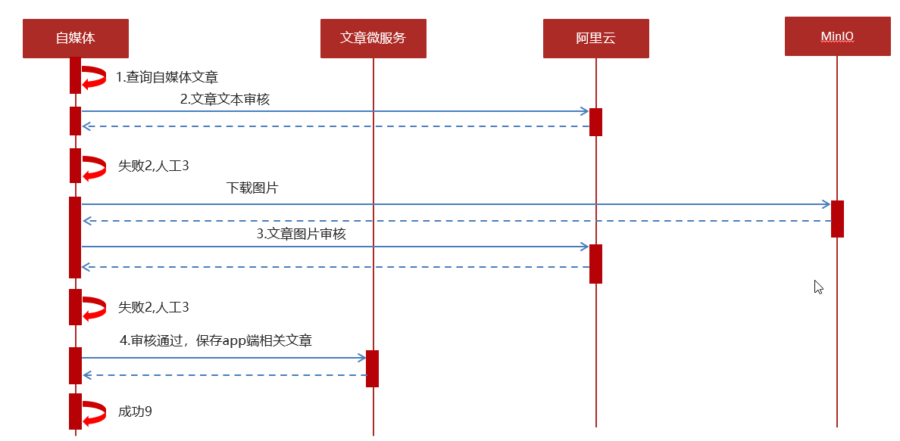

# 一、注册\登录

注册时生成一个密码盐，然后把密码 + salt 进行MD5哈希之后存入数据库的密码字段。

登陆时流程：


先根据用户名从数据库中查询出数据，然后把用户输入的密码 + salt进行MD5，然后和数据库中的密码进行比对，如果一致则登录成功，利用Jwt生成token返回给前端。

token中含有用户的用户名以及手机号等信息，这样可以在微服务中使用拦截器对token进行解析后获取登录用户的id等信息。


# 二、Nginx配置


前端静态资源部署在Nginx服务中，并且Nginx配置了反向代理，把ajax请求代理到微服务网关，再由网关路由到对应的微服务。

nginx.conf:

```java

#user  nobody;
worker_processes  1;

events {
    worker_connections  1024;
}
http {
    include       mime.types;
    default_type  application/octet-stream;
    sendfile        on;
    keepalive_timeout  65;
	# 引入自定义配置文件
	include leadnews.conf/*.conf;
}
```

自定义配置文件:

```
upstream  heima-app-gateway{
    server localhost:51601;
}

server {
	listen 8801;
	location / {
		root D:/workspace/app-web/;
		index index.html;
	}
	
	location ~/app/(.*) {
		proxy_pass http://heima-app-gateway/$1;
		proxy_set_header HOST $host;  # 不改变源请求头的值
		proxy_pass_request_body on;  #开启获取请求体
		proxy_pass_request_headers on;  #开启获取请求头
		proxy_set_header X-Real-IP $remote_addr;   # 记录真实发出请求的客户端IP
		proxy_set_header X-Forwarded-For $proxy_add_x_forwarded_for;  #记录代理信息
	}
}
```


# 三、项目架构


# 四、自媒体发布文章


1.前端提交发布或保存为草稿

2.后台判断请求中是否包含了文章id

3.如果不包含id,则为新增

​	3.1 执行新增文章的操作

​	3.2 关联文章内容图片与素材的关系

​	3.3 关联文章封面图片与素材的关系

4.如果包含了id，则为修改请求

​	4.1 删除该文章与素材的所有关系

​	4.2 执行修改操作

​	4.3 关联文章内容图片与素材的关系

​	4.4 关联文章封面图片与素材的关系


## 文章发布过程流程图


# 五、自媒体文章审核

自媒体文章发布成功之后需要对文章进行审核，先是使用阿里云内容安全服务来进行自动审核，自动审核不通过则需要后台管理人员进行人工审核。



1 自媒体端发布文章后，开始审核文章

2 审核的主要是审核文章的内容（文本内容和图片）

3 借助第三方提供的接口审核文本

4 借助第三方提供的接口审核图片，由于图片存储到minIO中，需要先下载才能审核

5 如果审核失败，则需要修改自媒体文章的状态，status:2  审核失败    status:3  转到人工审核

6 如果审核成功，则需要在文章微服务中创建app端需要的文章，这一步是通过feign进行远程调用文章微服务来实现的。


# 六、Feign远程接口使用方式


调用者使用 @EnableFeignClients来调用服务提供者

服务提供者实现Feign-api中的接口来实现具体的业务功能。


# 七、Redis实现延迟任务


在实现文章延迟审核发布时，使用了redis来实现延迟任务，用redis中的list来保存当前需要立即执行的延迟任务（已经到期的延迟任务），使用zset来保存未来几分钟内需要执行的任务（以时间戳作为score），zset会定时向list中同步到期的任务。然后数据库当中也会存放距离当前时间比较远的延迟任务，这些会定期同步到zset中，把延迟任务放到数据库当中是为了防止任务的丢失。

使用list作为消费队列来存放当前应该执行的任务。

使用zset来存放未来5分钟内该执行的任务，并按照任务执行的时间戳来排序。

生产者发布定时任务，写入数据库，然后根据任务的预订时间决定放入list还是zset。

消费者每秒从list中获取任务进行消费。

zset也会定期向list中同步应该执行的任务。

另外，也会有一个线程定期从数据库中取任务至Redis中。


# 八、Redis实现分布式锁

分布式锁：控制分布式系统有序的去对共享资源进行操作，通过互斥来保证数据的一致性。

解决方案：


setnx （SET if Not eXists） 命令在指定的 key 不存在时，为 key 设置指定的值。


这种加锁的思路是，如果 key 不存在则为 key 设置 value，如果 key 已存在则 SETNX 命令不做任何操作

- 客户端A请求服务器设置key的值，如果设置成功就表示加锁成功
- 客户端B也去请求服务器设置key的值，如果返回失败，那么就代表加锁失败
- 客户端A执行代码完成，删除锁
- 客户端B在等待一段时间后再去请求设置key的值，设置成功
- 客户端B执行代码完成，删除锁
- 

```java
/**
 * 加锁
 *
 * @param name
 * @param expire
 * @return
 */
public String tryLock(String name, long expire) {
    name = name + "_lock";
    String token = UUID.randomUUID().toString();
    RedisConnectionFactory factory = stringRedisTemplate.getConnectionFactory();
    RedisConnection conn = factory.getConnection();
    try {

        //参考redis命令：
        //set key value [EX seconds] [PX milliseconds] [NX|XX]
        Boolean result = conn.set(
                name.getBytes(),	//key为锁的名字
                token.getBytes(),	//value为一个唯一的标记
                Expiration.from(expire, TimeUnit.MILLISECONDS),
                RedisStringCommands.SetOption.SET_IF_ABSENT //NX
        );
        if (result != null && result)
            return token;
    } finally {
        RedisConnectionUtils.releaseConnection(conn, factory,false);
    }
    return null;
}
```


# 九、搜索历史记录

用户的搜索记录，需要给每一个用户都保存一份，数据量较大，要求加载速度快，通常这样的数据存储到mongodb更合适，不建议直接存储到关系型数据库中。

存放搜索的关键字、用户的id、以及搜索的时间即可。

用户每当发起搜索请求时，首先判断是否是第一页搜索，如果是，则异步调用一个方法来保存该搜索记录，然后再查询搜索的结果并返回。

保存搜索记录的方法首先查询搜索记录表，如果该条搜索记录已存在，那么更新它的搜索时间，如果不存在，按时间顺序查询出所有的历史记录，如果历史记录小于10条，那么新增该条历史记录，否则使用mongodb中的 findandreplace方法替换最早的一条搜索记录。


# 十、用户行为

用户行为数据的记录包括了关注、点赞、不喜欢、收藏、阅读等行为

## 关注

可以创建数据库的两张表：粉丝表、关注表，当用户关注一个作者时，记录双向关系至数据库中，然后使用redis的zset来记录用户的关注者的id，和用户的粉丝id。


## 点赞、阅读、不喜欢

这些数据也需要记录到redis中，使用hash来存储用户的点赞阅读行为。

key为 `行为_文章id`，hashKey为用户id，值为1即可。

这样查询用户是否点赞或者阅读某条文章时，只需要查看redis中是否存在对应的 key即可。


## 收藏

在redis中使用hash结构存储 用户收藏的文章 key为 `COLLECTION_用户id` ，hashkey为文章id 值为：json字符串，记录了收藏的文章或者动态id、收藏的类型、收藏的时间。

如果是收藏：那么先查redis 看是否已收藏，如果没有，写入数据库（记录用户id和收藏文章的id）

再写入redis。

如果是取消收藏：先删除数据库中的数据，然后删除redis中的数据。


# 十一 、热点文章

热点文章是根据用户的行为来计算的，判断文章是否是热点，有几项标准： 点赞数量，评论数量，阅读数量，收藏数量。

热点文章计算分为定时计算和实时计算。

## 定时计算

用一个定时任务，每天定时（例如凌晨2：00）从数据库中查询近几天发布的所有文章，然后基于上述数据来计算评分，把分值较大的若干文章数据存入到redis中。用户端查询文章时先从redis中查询热点文章，然后再从数据库中查询普通文章。

## 实时计算

每当用户进行点赞等行为的时候，会向kafka中的一个topic发送消息，消息内容包括：行为类型，文章的id，以及相应数据的增量（例如点赞+1）

然后使用KafkaStream对topic中的消息进行聚合处理，按照文章id进行聚合，统计一段时间内某文章的行为数的增量，然后又会向另一个topic发送消息，消息内容为文章id，聚合后的点赞、阅读、收藏、评论数。然后有一个消费者会监听这个消息，并基于这个消息先更新数据库中的行为数，然后再进行计算新的评分，再对redis中的热点文章数据进行刷新。


